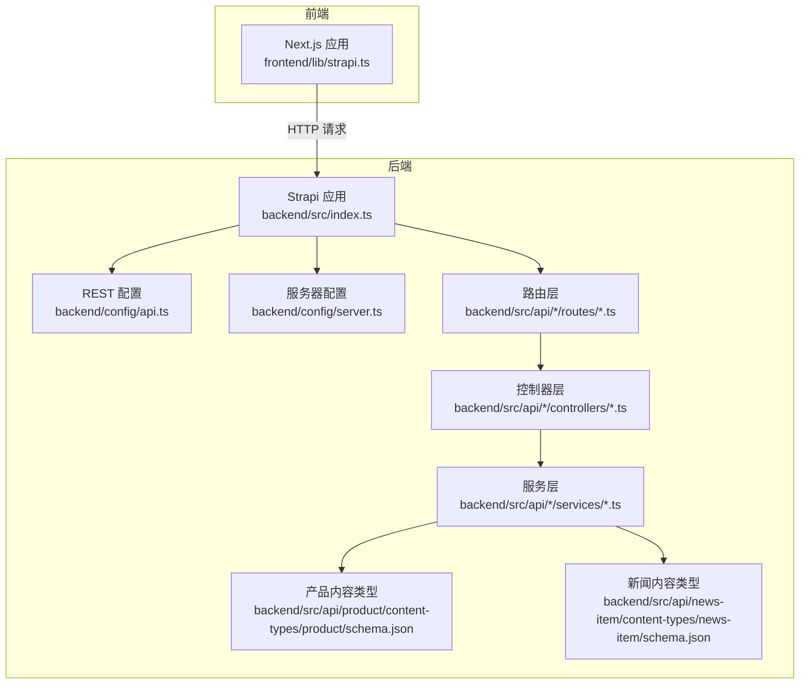
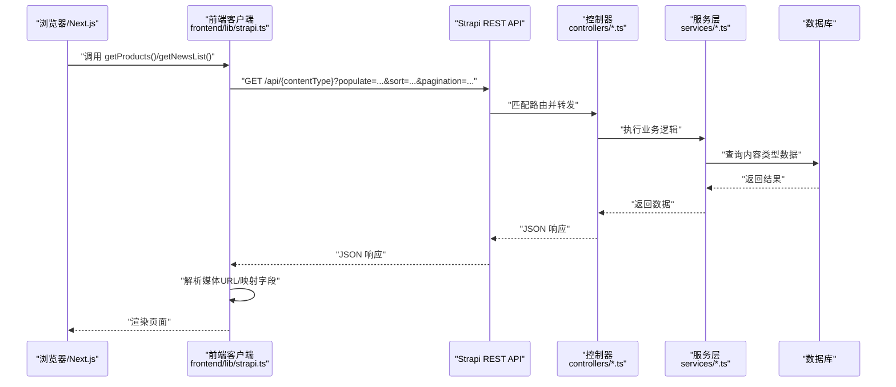
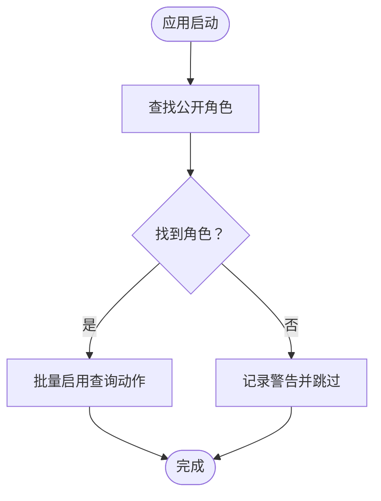
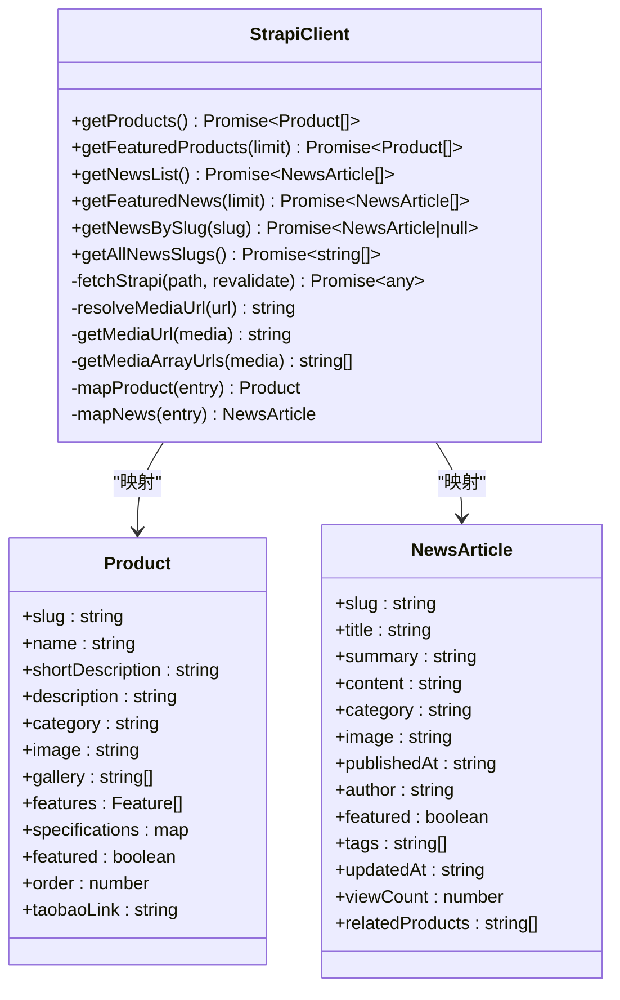
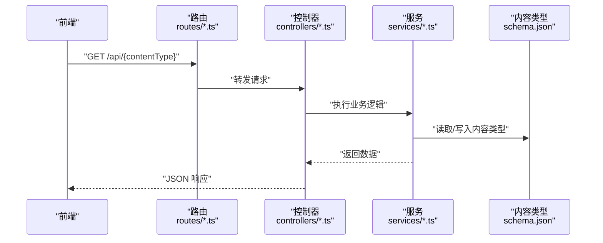
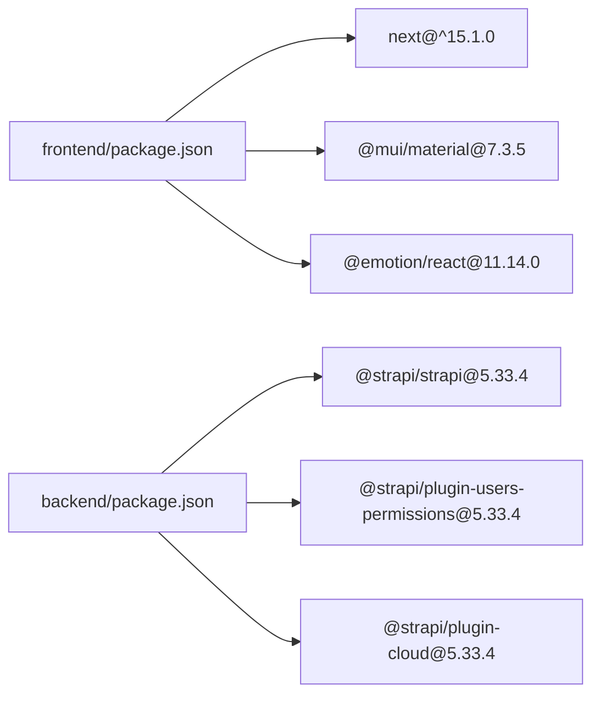

# API接口文档

<cite>
**本文档引用的文件**
- [backend/src/index.ts](file://backend/src/index.ts)
- [backend/config/api.ts](file://backend/config/api.ts)
- [backend/config/server.ts](file://backend/config/server.ts)
- [backend/src/api/news-item/controllers/news-item.ts](file://backend/src/api/news-item/controllers/news-item.ts)
- [backend/src/api/news-item/routes/news-item.ts](file://backend/src/api/news-item/routes/news-item.ts)
- [backend/src/api/news-item/services/news-item.ts](file://backend/src/api/news-item/services/news-item.ts)
- [backend/src/api/news-item/content-types/news-item/schema.json](file://backend/src/api/news-item/content-types/news-item/schema.json)
- [backend/src/api/product/controllers/product.ts](file://backend/src/api/product/controllers/product.ts)
- [backend/src/api/product/routes/product.ts](file://backend/src/api/product/routes/product.ts)
- [backend/src/api/product/services/product.ts](file://backend/src/api/product/services/product.ts)
- [backend/src/api/product/content-types/product/schema.json](file://backend/src/api/product/content-types/product/schema.json)
- [frontend/lib/strapi.ts](file://frontend/lib/strapi.ts)
- [frontend/types/news.ts](file://frontend/types/news.ts)
- [frontend/types/product.ts](file://frontend/types/product.ts)
- [backend/package.json](file://backend/package.json)
- [frontend/package.json](file://frontend/package.json)
</cite>

## 目录
1. [简介](#简介)
2. [项目结构](#项目结构)
3. [核心组件](#核心组件)
4. [架构总览](#架构总览)
5. [详细组件分析](#详细组件分析)
6. [依赖关系分析](#依赖关系分析)
7. [性能考虑](#性能考虑)
8. [故障排除指南](#故障排除指南)
9. [结论](#结论)
10. [附录](#附录)

## 简介
本文件为中创智控官网的API接口文档，覆盖后端基于 Strapi 的内容管理与前端 Next.js 客户端的数据交互。文档从系统架构、接口设计、数据模型、认证与权限、错误处理、性能优化等维度进行说明，并提供可复现的调用示例与最佳实践，帮助开发者准确理解与使用所有公开API。

## 项目结构
- 后端采用 Strapi v5，通过内容类型（Content Types）管理产品与新闻内容；通过控制器、路由、服务层组织业务逻辑；通过插件实现用户权限控制。
- 前端采用 Next.js 15，通过自定义 Strapi 客户端封装统一获取与映射数据，支持媒体资源 URL 解析与分页、排序、筛选等查询参数。

图表来源
- [backend/src/index.ts](file://backend/src/index.ts#L1-L65)
- [backend/config/api.ts](file://backend/config/api.ts#L1-L8)
- [backend/config/server.ts](file://backend/config/server.ts#L1-L8)
- [backend/src/api/product/content-types/product/schema.json](file://backend/src/api/product/content-types/product/schema.json#L1-L63)
- [backend/src/api/news-item/content-types/news-item/schema.json](file://backend/src/api/news-item/content-types/news-item/schema.json#L1-L65)
- [backend/src/api/product/routes/product.ts](file://backend/src/api/product/routes/product.ts#L1-L4)
- [backend/src/api/news-item/routes/news-item.ts](file://backend/src/api/news-item/routes/news-item.ts#L1-L4)
- [backend/src/api/product/controllers/product.ts](file://backend/src/api/product/controllers/product.ts#L1-L4)
- [backend/src/api/news-item/controllers/news-item.ts](file://backend/src/api/news-item/controllers/news-item.ts#L1-L4)
- [backend/src/api/product/services/product.ts](file://backend/src/api/product/services/product.ts#L1-L4)
- [backend/src/api/news-item/services/news-item.ts](file://backend/src/api/news-item/services/news-item.ts#L1-L4)

章节来源
- [backend/src/index.ts](file://backend/src/index.ts#L1-L65)
- [backend/config/api.ts](file://backend/config/api.ts#L1-L8)
- [backend/config/server.ts](file://backend/config/server.ts#L1-L8)

## 核心组件
- 后端权限初始化：应用启动时自动为“公开角色”启用产品与新闻的查询权限，确保前端可无鉴权访问。
- REST 默认行为：默认分页大小、最大分页、是否返回总数等由配置统一管理。
- 内容类型：产品与新闻均采用 Strapi collectionType，支持草稿发布、UID、媒体、枚举、JSON 字段等。
- 前端 Strapi 客户端：统一封装 GET 请求、媒体 URL 解析、错误处理与数据映射，提供产品与新闻的列表、详情、置顶推荐、分页与筛选等方法。

章节来源
- [backend/src/index.ts](file://backend/src/index.ts#L19-L62)
- [backend/config/api.ts](file://backend/config/api.ts#L2-L6)
- [backend/src/api/product/content-types/product/schema.json](file://backend/src/api/product/content-types/product/schema.json#L1-L63)
- [backend/src/api/news-item/content-types/news-item/schema.json](file://backend/src/api/news-item/content-types/news-item/schema.json#L1-L65)
- [frontend/lib/strapi.ts](file://frontend/lib/strapi.ts#L100-L155)

## 架构总览
下图展示了前后端交互流程：前端通过 Next.js 调用 Strapi REST API，后端根据路由与控制器返回标准化 JSON 数据，前端解析并渲染。

图表来源
- [frontend/lib/strapi.ts](file://frontend/lib/strapi.ts#L100-L155)
- [backend/src/api/product/routes/product.ts](file://backend/src/api/product/routes/product.ts#L1-L4)
- [backend/src/api/news-item/routes/news-item.ts](file://backend/src/api/news-item/routes/news-item.ts#L1-L4)
- [backend/src/api/product/controllers/product.ts](file://backend/src/api/product/controllers/product.ts#L1-L4)
- [backend/src/api/news-item/controllers/news-item.ts](file://backend/src/api/news-item/controllers/news-item.ts#L1-L4)
- [backend/src/api/product/services/product.ts](file://backend/src/api/product/services/product.ts#L1-L4)
- [backend/src/api/news-item/services/news-item.ts](file://backend/src/api/news-item/services/news-item.ts#L1-L4)

## 详细组件分析

### 认证与权限
- 角色与权限：应用启动时为“公开角色”启用产品与新闻的查询动作，允许匿名访问。
- 用户权限插件：后端依赖用户权限插件以实现角色与动作级别的访问控制。
- 安全建议：如需扩展到写操作或受保护资源，应在插件层面配置相应动作与角色映射。

图表来源
- [backend/src/index.ts](file://backend/src/index.ts#L19-L62)

章节来源
- [backend/src/index.ts](file://backend/src/index.ts#L19-L62)
- [backend/package.json](file://backend/package.json#L20-L29)

### REST 配置与行为
- 默认分页：每页默认返回条数、最大限制、是否包含总数。
- 服务器配置：主机、端口、应用密钥数组等运行时参数。
- 建议：在高并发场景下适当调整默认分页与最大分页，结合缓存策略提升性能。

章节来源
- [backend/config/api.ts](file://backend/config/api.ts#L2-L6)
- [backend/config/server.ts](file://backend/config/server.ts#L1-L8)

### 产品内容类型（Product）
- 结构要点：名称、唯一标识、简述、富文本描述、分类枚举、主图与图库、特性与规格 JSON、置顶、排序权重、淘宝链接等。
- 草稿发布：支持草稿与发布状态。
- 查询建议：按排序权重升序或发布时间降序；必要时使用 populate 优化媒体字段加载。

章节来源
- [backend/src/api/product/content-types/product/schema.json](file://backend/src/api/product/content-types/product/schema.json#L1-L63)

### 新闻内容类型（News Item）
- 结构要点：标题、唯一标识、摘要、富文本内容、分类枚举、封面与附件、作者、置顶、标签、阅读量、关联产品等。
- 草稿发布：支持草稿与发布状态。
- 查询建议：按发布时间倒序；支持按 slug 精确过滤；可限制返回字段减少传输体积。

章节来源
- [backend/src/api/news-item/content-types/news-item/schema.json](file://backend/src/api/news-item/content-types/news-item/schema.json#L1-L65)

### 前端 Strapi 客户端（API 封装）
- 统一请求函数：封装 fetch，设置 Next.js revalidate 缓存策略，失败时抛出带状态码的错误。
- 媒体 URL 解析：自动拼接基础地址，兼容不同响应形态。
- 数据映射：将 Strapi 响应映射为前端类型安全的 Product 与 NewsArticle。
- 方法清单：
  - 获取全部产品（支持 populate 与排序）
  - 获取置顶产品（支持 limit）
  - 获取新闻列表（支持 populate 与排序）
  - 获取置顶新闻（支持 limit）
  - 按 slug 获取新闻详情（支持 filters）
  - 获取全部新闻 slug 列表（支持字段选择与分页）

图表来源
- [frontend/lib/strapi.ts](file://frontend/lib/strapi.ts#L100-L155)
- [frontend/types/product.ts](file://frontend/types/product.ts#L1-L39)
- [frontend/types/news.ts](file://frontend/types/news.ts#L16-L43)

章节来源
- [frontend/lib/strapi.ts](file://frontend/lib/strapi.ts#L100-L155)
- [frontend/types/product.ts](file://frontend/types/product.ts#L1-L39)
- [frontend/types/news.ts](file://frontend/types/news.ts#L1-L44)

### 后端 API 端点设计
- 通用路由：每个内容类型通过核心路由工厂生成标准 REST 端点。
- 控制器与服务：控制器负责请求到服务层的转发，服务层与内容类型交互。
- 查询参数：支持 populate、sort、pagination、filters 等常见参数，具体行为由 Strapi 默认配置与内容类型定义决定。

图表来源
- [backend/src/api/product/routes/product.ts](file://backend/src/api/product/routes/product.ts#L1-L4)
- [backend/src/api/news-item/routes/news-item.ts](file://backend/src/api/news-item/routes/news-item.ts#L1-L4)
- [backend/src/api/product/controllers/product.ts](file://backend/src/api/product/controllers/product.ts#L1-L4)
- [backend/src/api/news-item/controllers/news-item.ts](file://backend/src/api/news-item/controllers/news-item.ts#L1-L4)
- [backend/src/api/product/services/product.ts](file://backend/src/api/product/services/product.ts#L1-L4)
- [backend/src/api/news-item/services/news-item.ts](file://backend/src/api/news-item/services/news-item.ts#L1-L4)

章节来源
- [backend/src/api/product/routes/product.ts](file://backend/src/api/product/routes/product.ts#L1-L4)
- [backend/src/api/news-item/routes/news-item.ts](file://backend/src/api/news-item/routes/news-item.ts#L1-L4)
- [backend/src/api/product/controllers/product.ts](file://backend/src/api/product/controllers/product.ts#L1-L4)
- [backend/src/api/news-item/controllers/news-item.ts](file://backend/src/api/news-item/controllers/news-item.ts#L1-L4)
- [backend/src/api/product/services/product.ts](file://backend/src/api/product/services/product.ts#L1-L4)
- [backend/src/api/news-item/services/news-item.ts](file://backend/src/api/news-item/services/news-item.ts#L1-L4)

## 依赖关系分析
- 前端依赖 Next.js 15 与 Material UI、Radix UI 等生态组件库；通过自定义 Strapi 客户端与类型定义对接后端。
- 后端依赖 Strapi 5 与用户权限插件；通过内容类型定义数据模型；通过核心控制器与路由工厂生成 REST 端点。

图表来源
- [frontend/package.json](file://frontend/package.json#L12-L86)
- [backend/package.json](file://backend/package.json#L20-L29)

章节来源
- [frontend/package.json](file://frontend/package.json#L12-L86)
- [backend/package.json](file://backend/package.json#L20-L29)

## 性能考虑
- 分页与限制：合理设置默认分页与最大分页，避免一次性返回过多数据。
- populate 策略：仅对需要的字段使用 populate，减少数据库与序列化开销。
- 缓存：利用前端 Next.js revalidate 缓存策略降低重复请求频率。
- 媒体优化：优先使用 CDN 与合适的图片尺寸，减少首屏渲染时间。
- 并发控制：在高并发场景下考虑引入速率限制与队列策略，避免后端压力过大。

## 故障排除指南
- 常见错误
  - 网络请求失败：检查 Strapi 地址与端口配置，确认网络连通性。
  - 响应非 JSON：确认后端返回格式与 Content-Type，排查中间件或代理问题。
  - 媒体 URL 为空：检查媒体字段是否存在以及 populate 是否正确传递。
- 建议
  - 在开发环境开启详细日志，定位控制器与服务层异常。
  - 对外暴露的 API 增加统一的错误拦截与重试机制。
  - 对高风险操作增加限流与熔断策略。

章节来源
- [frontend/lib/strapi.ts](file://frontend/lib/strapi.ts#L100-L111)

## 结论
本文档梳理了中创智控官网的前后端 API 设计与实现，明确了权限初始化、REST 行为、内容类型结构、前端客户端封装与错误处理机制。通过统一的查询参数与数据映射，前端可稳定获取产品与新闻数据；后端通过内容类型与插件体系保证了内容管理的灵活性与安全性。建议在生产环境中结合缓存、CDN 与速率限制进一步优化性能与稳定性。

## 附录

### 接口清单与调用示例

- 获取全部产品
  - 方法与路径：GET /api/products
  - 查询参数：
    - populate：指定需要填充的字段（如 image、gallery）
    - sort：排序规则（如 order: asc）
  - 成功响应：返回产品数组，包含映射后的字段
  - 错误响应：HTTP 4xx/5xx，响应体包含错误信息
  - 参考实现：[frontend/lib/strapi.ts](file://frontend/lib/strapi.ts#L113-L118)

- 获取置顶产品
  - 方法与路径：GET /api/products
  - 查询参数：
    - populate：image
    - sort：publishedAt desc
    - pagination[limit]：限制数量
  - 成功响应：返回产品数组
  - 错误响应：HTTP 4xx/5xx
  - 参考实现：[frontend/lib/strapi.ts](file://frontend/lib/strapi.ts#L120-L125)

- 获取新闻列表
  - 方法与路径：GET /api/news
  - 查询参数：
    - populate：image
    - sort：publishedAt desc
  - 成功响应：返回新闻数组
  - 错误响应：HTTP 4xx/5xx
  - 参考实现：[frontend/lib/strapi.ts](file://frontend/lib/strapi.ts#L127-L132)

- 获取置顶新闻
  - 方法与路径：GET /api/news
  - 查询参数：
    - populate：image
    - sort：publishedAt desc
    - pagination[limit]：限制数量
  - 成功响应：返回新闻数组
  - 错误响应：HTTP 4xx/5xx
  - 参考实现：[frontend/lib/strapi.ts](file://frontend/lib/strapi.ts#L134-L139)

- 按 slug 获取新闻详情
  - 方法与路径：GET /api/news
  - 查询参数：
    - populate：image
    - filters[slug][$eq]：精确匹配 slug
  - 成功响应：返回单个新闻对象或空
  - 错误响应：HTTP 4xx/5xx
  - 参考实现：[frontend/lib/strapi.ts](file://frontend/lib/strapi.ts#L141-L147)

- 获取全部新闻 slug 列表
  - 方法与路径：GET /api/news
  - 查询参数：
    - fields[0]=slug：仅返回 slug 字段
    - pagination[limit]：限制数量
  - 成功响应：返回 slug 数组
  - 错误响应：HTTP 4xx/5xx
  - 参考实现：[frontend/lib/strapi.ts](file://frontend/lib/strapi.ts#L149-L154)

### 数据模型与字段说明

- 产品（Product）
  - 字段概览：slug、name、shortDescription、description、category、image、gallery、features、specifications、featured、order、taobaoLink
  - 参考定义：[frontend/types/product.ts](file://frontend/types/product.ts#L13-L38)
  - 内容类型定义：[backend/src/api/product/content-types/product/schema.json](file://backend/src/api/product/content-types/product/schema.json#L13-L62)

- 新闻（NewsArticle）
  - 字段概览：slug、title、summary、content、category、image、publishedAt、author、featured、tags、updatedAt、viewCount、relatedProducts
  - 参考定义：[frontend/types/news.ts](file://frontend/types/news.ts#L16-L43)
  - 内容类型定义：[backend/src/api/news-item/content-types/news-item/schema.json](file://backend/src/api/news-item/content-types/news-item/schema.json#L13-L62)

### 认证与安全
- 当前权限：公开角色已启用产品与新闻的查询动作，无需鉴权即可访问。
- 扩展建议：如需写操作或私有内容，应通过用户权限插件配置相应动作与角色映射，并在前端增加鉴权与令牌刷新机制。

章节来源
- [backend/src/index.ts](file://backend/src/index.ts#L29-L60)
- [backend/package.json](file://backend/package.json#L20-L29)