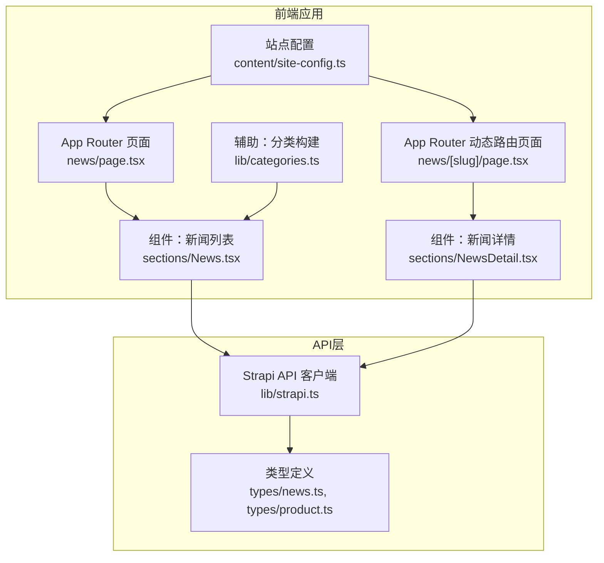
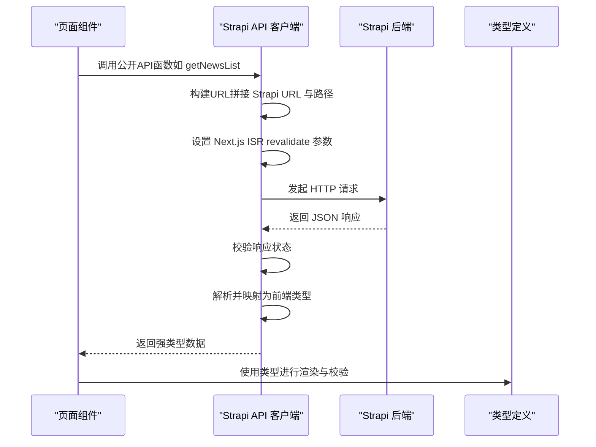
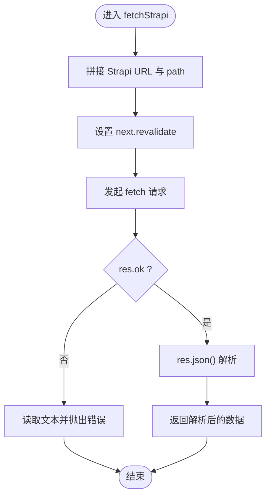
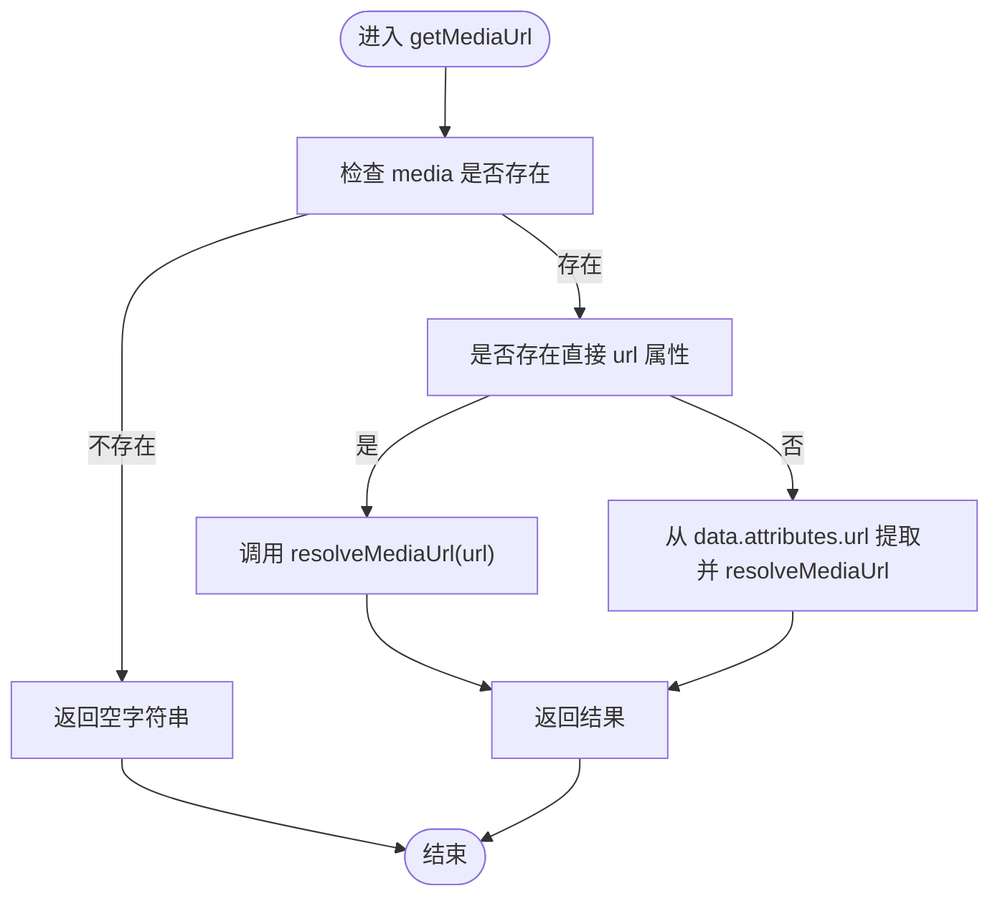
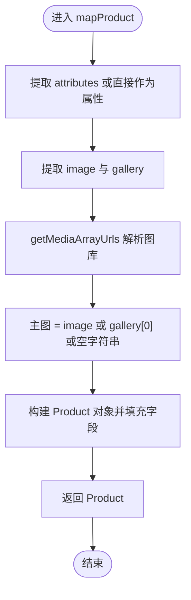
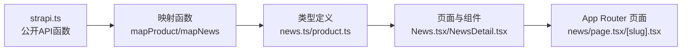

# 前端API客户端

<cite>
**本文档引用的文件**
- [frontend/lib/strapi.ts](file://frontend/lib/strapi.ts)
- [frontend/types/news.ts](file://frontend/types/news.ts)
- [frontend/types/product.ts](file://frontend/types/product.ts)
- [frontend/types/index.ts](file://frontend/types/index.ts)
- [frontend/app/news/page.tsx](file://frontend/app/news/page.tsx)
- [frontend/app/news/[slug]/page.tsx](file://frontend/app/news/[slug]/page.tsx)
- [frontend/components/sections/News.tsx](file://frontend/components/sections/News.tsx)
- [frontend/components/sections/NewsDetail.tsx](file://frontend/components/sections/NewsDetail.tsx)
- [frontend/lib/categories.ts](file://frontend/lib/categories.ts)
- [frontend/content/site-config.ts](file://frontend/content/site-config.ts)
- [frontend/.env.example](file://frontend/.env.example)
</cite>

## 目录
1. [简介](#简介)
2. [项目结构](#项目结构)
3. [核心组件](#核心组件)
4. [架构总览](#架构总览)
5. [详细组件分析](#详细组件分析)
6. [依赖关系分析](#依赖关系分析)
7. [性能考虑](#性能考虑)
8. [故障排除指南](#故障排除指南)
9. [结论](#结论)
10. [附录](#附录)

## 简介
本文件面向前端开发团队，系统性地阐述前端API客户端对Strapi CMS的封装实现，重点覆盖以下方面：
- fetchStrapi函数的工作原理：URL构建、请求配置（含Next.js ISR revalidate）、响应处理与错误抛出
- 数据映射函数：mapProduct与mapNews的字段转换、媒体资源处理、数据验证与默认值策略
- 公开API函数清单：getProducts、getFeaturedProducts、getNewsList、getFeaturedNews、getNewsBySlug、getAllNewsSlugs 的参数、返回值与典型用法
- 媒体资源URL解析机制：resolveMediaUrl与getMediaUrl的实现逻辑与边界条件
- 错误处理策略与最佳实践：网络错误、数据格式错误、空数据处理
- 性能优化建议：缓存策略、revalidate配置、批量请求与懒加载

## 项目结构
前端API客户端位于frontend/lib/strapi.ts，围绕Next.js App Router的数据获取模式设计，结合类型定义与页面组件协同工作。关键目录与文件如下：
- API封装：frontend/lib/strapi.ts
- 类型定义：frontend/types/news.ts、frontend/types/product.ts、frontend/types/index.ts
- 页面与组件：frontend/app/news/page.tsx、frontend/app/news/[slug]/page.tsx、frontend/components/sections/News.tsx、frontend/components/sections/NewsDetail.tsx
- 辅助工具：frontend/lib/categories.ts、frontend/content/site-config.ts
- 环境变量：frontend/.env.example

图表来源
- [frontend/app/news/page.tsx](file://frontend/app/news/page.tsx#L1-L31)
- [frontend/app/news/[slug]/page.tsx](file://frontend/app/news/[slug]/page.tsx#L1-L71)
- [frontend/components/sections/News.tsx](file://frontend/components/sections/News.tsx#L1-L299)
- [frontend/components/sections/NewsDetail.tsx](file://frontend/components/sections/NewsDetail.tsx#L1-L200)
- [frontend/lib/strapi.ts](file://frontend/lib/strapi.ts#L1-L155)
- [frontend/types/news.ts](file://frontend/types/news.ts#L1-L44)
- [frontend/types/product.ts](file://frontend/types/product.ts#L1-L39)

章节来源
- [frontend/lib/strapi.ts](file://frontend/lib/strapi.ts#L1-L155)
- [frontend/types/news.ts](file://frontend/types/news.ts#L1-L44)
- [frontend/types/product.ts](file://frontend/types/product.ts#L1-L39)
- [frontend/types/index.ts](file://frontend/types/index.ts#L1-L28)

## 核心组件
本节聚焦API客户端的核心能力与数据模型。

- Strapi URL与环境变量
  - 通过环境变量NEXT_PUBLIC_STRAPI_URL确定后端地址，默认回退到本地开发地址。
  - 环境变量示例位于frontend/.env.example。

- 数据模型
  - 新闻：NewsArticle接口定义了slug、title、summary、content、category、image、publishedAt、author、featured、tags、updatedAt、viewCount、relatedProducts等字段。
  - 产品：Product接口定义了slug、name、shortDescription、description、category、image、gallery、features、specifications、featured、order、taobaoLink等字段。

- 媒体资源类型
  - StrapiMedia与StrapiMediaArray用于描述媒体字段的两种形态（扁平属性与嵌套data），支持可选的url与alternativeText。

章节来源
- [frontend/lib/strapi.ts](file://frontend/lib/strapi.ts#L4-L39)
- [frontend/types/news.ts](file://frontend/types/news.ts#L16-L43)
- [frontend/types/product.ts](file://frontend/types/product.ts#L13-L38)
- [frontend/.env.example](file://frontend/.env.example#L1-L1)

## 架构总览
前端API客户端采用“统一请求封装 + 类型化映射”的架构，配合Next.js App Router的SSR/ISR能力，实现高效、稳定的页面渲染与SEO优化。

图表来源
- [frontend/lib/strapi.ts](file://frontend/lib/strapi.ts#L100-L111)
- [frontend/app/news/page.tsx](file://frontend/app/news/page.tsx#L25-L30)
- [frontend/app/news/[slug]/page.tsx](file://frontend/app/news/[slug]/page.tsx#L48-L70)

## 详细组件分析

### fetchStrapi：统一请求封装
- URL构建
  - 基于NEXT_PUBLIC_STRAPI_URL与传入path拼接完整请求地址。
- 请求配置
  - 使用Next.js fetch集成，通过next: { revalidate } 控制ISR缓存刷新周期（秒）。
- 响应处理
  - 若响应非OK，读取文本并抛出带状态码与内容的错误；否则解析JSON并返回。
- 错误处理
  - 明确区分网络错误与业务错误，便于上层捕获与降级。

图表来源
- [frontend/lib/strapi.ts](file://frontend/lib/strapi.ts#L100-L111)

章节来源
- [frontend/lib/strapi.ts](file://frontend/lib/strapi.ts#L100-L111)

### 媒体资源URL解析：resolveMediaUrl 与 getMediaUrl
- resolveMediaUrl
  - 处理空值、已包含协议的绝对URL、相对URL三种情况，统一补全为绝对URL。
- getMediaUrl
  - 支持两种媒体形态：对象直接包含url或嵌套在data.attributes中，优先使用对象属性，其次回退到嵌套结构。
- getMediaArrayUrls
  - 支持数组与嵌套数组两种媒体集合形态，统一提取并过滤有效URL。

图表来源
- [frontend/lib/strapi.ts](file://frontend/lib/strapi.ts#L35-L45)

章节来源
- [frontend/lib/strapi.ts](file://frontend/lib/strapi.ts#L35-L53)

### 数据映射：mapProduct 与 mapNews
- mapProduct
  - 字段映射：slug、name、shortDescription、description、category、image、gallery、features、specifications、featured、order、taobaoLink。
  - 媒体处理：优先使用image，其次使用gallery首张，若均无则为空字符串。
  - 类型约束：category使用ProductCategory枚举，features默认为空数组，specifications可选。
- mapNews
  - 字段映射：slug、title、summary、content、category、image、publishedAt、author、featured、tags、updatedAt、viewCount、relatedProducts。
  - 媒体处理：image为空时回退到默认占位图。
  - 类型约束：category默认为字符串，tags默认为空数组，viewCount默认为0。

图表来源
- [frontend/lib/strapi.ts](file://frontend/lib/strapi.ts#L55-L76)

章节来源
- [frontend/lib/strapi.ts](file://frontend/lib/strapi.ts#L55-L98)

### 公开API函数一览
- getProducts
  - 功能：获取全部产品，按order升序排序，并预加载image与gallery。
  - 返回：Product[]。
  - 用法：在产品列表页或推荐模块中调用。
- getFeaturedProducts(limit?)
  - 功能：获取最新产品，按publishedAt降序排序，限制数量。
  - 参数：limit（可选，默认6）。
  - 返回：Product[]。
  - 用法：首页或推荐区域展示热门产品。
- getNewsList
  - 功能：获取全部新闻，按publishedAt降序排序，并预加载image。
  - 返回：NewsArticle[]。
  - 用法：新闻列表页。
- getFeaturedNews(limit?)
  - 功能：获取最新新闻，按publishedAt降序排序，限制数量。
  - 参数：limit（可选，默认3）。
  - 返回：NewsArticle[]。
  - 用法：首页新闻轮播或专题推荐。
- getNewsBySlug(slug)
  - 功能：根据slug精确查询单条新闻。
  - 参数：slug（必需）。
  - 返回：NewsArticle | null。
  - 用法：动态路由页面渲染。
- getAllNewsSlugs
  - 功能：获取最多100条新闻的slug列表，用于生成静态路由参数。
  - 返回：string[]。
  - 用法：generateStaticParams。

章节来源
- [frontend/lib/strapi.ts](file://frontend/lib/strapi.ts#L113-L154)
- [frontend/app/news/[slug]/page.tsx](file://frontend/app/news/[slug]/page.tsx#L14-L20)

### 页面与组件中的使用示例
- 新闻列表页
  - 并行请求新闻列表与置顶新闻，构建分类导航，渲染新闻网格。
- 新闻详情页
  - 生成静态路由参数（基于getAllNewsSlugs），动态生成SEO元数据，渲染文章主体与相关推荐。

章节来源
- [frontend/app/news/page.tsx](file://frontend/app/news/page.tsx#L25-L30)
- [frontend/app/news/[slug]/page.tsx](file://frontend/app/news/[slug]/page.tsx#L48-L70)

## 依赖关系分析
- 组件与API
  - 页面组件通过公开API函数获取数据，避免直接耦合底层实现。
- 类型与API
  - API返回值经映射函数转换为前端类型，确保组件消费的数据结构稳定一致。
- 媒体解析与组件渲染
  - getMediaUrl/getMediaArrayUrls输出绝对URL，组件侧仅负责展示与回退策略。

图表来源
- [frontend/lib/strapi.ts](file://frontend/lib/strapi.ts#L55-L98)
- [frontend/types/news.ts](file://frontend/types/news.ts#L16-L43)
- [frontend/types/product.ts](file://frontend/types/product.ts#L13-L38)
- [frontend/components/sections/News.tsx](file://frontend/components/sections/News.tsx#L1-L299)
- [frontend/components/sections/NewsDetail.tsx](file://frontend/components/sections/NewsDetail.tsx#L1-L200)
- [frontend/app/news/page.tsx](file://frontend/app/news/page.tsx#L1-L31)
- [frontend/app/news/[slug]/page.tsx](file://frontend/app/news/[slug]/page.tsx#L1-L71)

## 性能考虑
- ISR缓存策略
  - fetchStrapi默认revalidate=60，可在不同页面场景下调参以平衡新鲜度与性能。
  - 新闻列表与详情页可依据内容更新频率设置不同revalidate值。
- 批量请求
  - 在新闻列表页使用Promise.all并行获取多个数据源，减少首屏等待时间。
- 媒体资源优化
  - 使用getMediaUrl统一解析，避免重复拼接逻辑；组件侧结合ImageWithFallback实现懒加载与占位。
- 分类与导航
  - 使用buildNewsCategories统计分类计数，减少重复计算。

章节来源
- [frontend/lib/strapi.ts](file://frontend/lib/strapi.ts#L100-L111)
- [frontend/app/news/page.tsx](file://frontend/app/news/page.tsx#L25-L30)
- [frontend/lib/categories.ts](file://frontend/lib/categories.ts#L33-L47)

## 故障排除指南
- 网络错误
  - 现象：fetch失败或res.ok=false。
  - 处理：捕获异常并提示用户重试或检查网络；必要时降级为静态占位数据。
- 数据格式错误
  - 现象：JSON解析失败或字段缺失。
  - 处理：在映射函数中提供默认值（如空字符串、空数组、布尔false），保证组件渲染不中断。
- 空数据处理
  - 现象：getNewsBySlug返回null。
  - 处理：在页面侧调用notFound()进行404跳转，或渲染“未找到”提示。
- 媒体资源为空
  - 现象：image或gallery为空导致渲染异常。
  - 处理：mapProduct/mapNews提供回退策略（主图回退至gallery首张或空字符串；新闻回退至默认占位图）。

章节来源
- [frontend/lib/strapi.ts](file://frontend/lib/strapi.ts#L105-L111)
- [frontend/lib/strapi.ts](file://frontend/lib/strapi.ts#L78-L98)
- [frontend/app/news/[slug]/page.tsx](file://frontend/app/news/[slug]/page.tsx#L55-L57)

## 结论
该前端API客户端以简洁、类型安全的方式封装了Strapi数据访问，结合Next.js的ISR与并行请求能力，实现了高性能、可维护的内容管理与展示。通过明确的错误处理与回退策略，保障了用户体验与稳定性。建议在生产环境中根据内容更新频率合理配置revalidate，并持续监控媒体资源可用性与组件渲染表现。

## 附录

### API函数速查表
- getProducts
  - 输入：无
  - 输出：Product[]
  - 用途：产品列表页
- getFeaturedProducts(limit=6)
  - 输入：limit（可选）
  - 输出：Product[]
  - 用途：推荐/热门产品
- getNewsList
  - 输入：无
  - 输出：NewsArticle[]
  - 用途：新闻列表页
- getFeaturedNews(limit=3)
  - 输入：limit（可选）
  - 输出：NewsArticle[]
  - 用途：首页新闻推荐
- getNewsBySlug(slug)
  - 输入：slug（必需）
  - 输出：NewsArticle | null
  - 用途：新闻详情页
- getAllNewsSlugs
  - 输入：无
  - 输出：string[]
  - 用途：生成静态路由参数

章节来源
- [frontend/lib/strapi.ts](file://frontend/lib/strapi.ts#L113-L154)