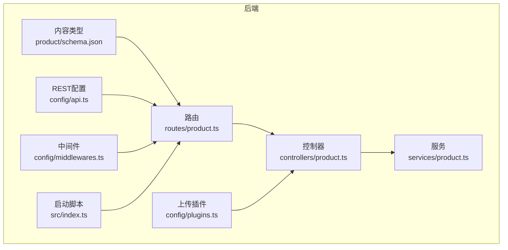
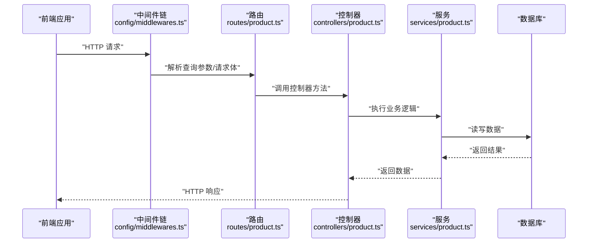
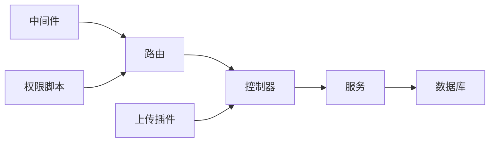
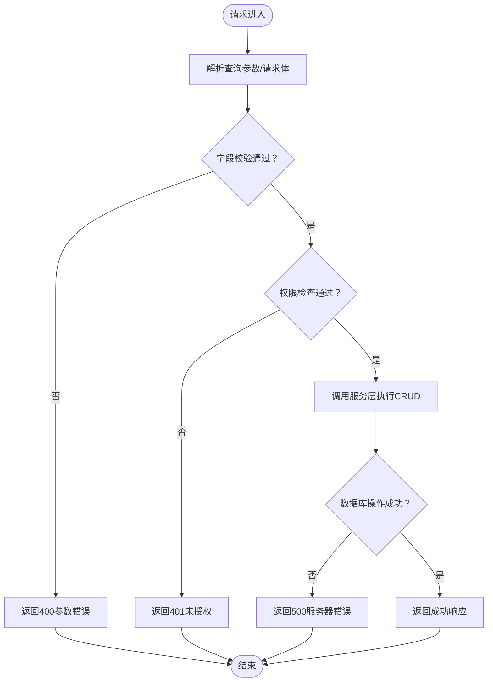

# 产品API端点

<cite>
**本文引用的文件**
- [backend/src/api/product/controllers/product.ts](file://backend/src/api/product/controllers/product.ts)
- [backend/src/api/product/routes/product.ts](file://backend/src/api/product/routes/product.ts)
- [backend/src/api/product/services/product.ts](file://backend/src/api/product/services/product.ts)
- [backend/src/api/product/content-types/product/schema.json](file://backend/src/api/product/content-types/product/schema.json)
- [backend/config/api.ts](file://backend/config/api.ts)
- [backend/config/server.ts](file://backend/config/server.ts)
- [backend/config/plugins.ts](file://backend/config/plugins.ts)
- [backend/config/middlewares.ts](file://backend/config/middlewares.ts)
- [backend/src/index.ts](file://backend/src/index.ts)
- [backend/package.json](file://backend/package.json)
- [backend/scripts/import-products.mjs](file://backend/scripts/import-products.mjs)
- [frontend/lib/strapi.ts](file://frontend/lib/strapi.ts)
- [frontend/types/product.ts](file://frontend/types/product.ts)
- [frontend/app/products/page.tsx](file://frontend/app/products/page.tsx)
</cite>

## 目录
1. [简介](#简介)
2. [项目结构](#项目结构)
3. [核心组件](#核心组件)
4. [架构总览](#架构总览)
5. [详细组件分析](#详细组件分析)
6. [依赖分析](#依赖分析)
7. [性能考虑](#性能考虑)
8. [故障排查指南](#故障排查指南)
9. [结论](#结论)
10. [附录](#附录)

## 简介
本文件为后端产品管理相关的RESTful API端点文档，覆盖以下端点：
- GET /api/products：获取产品列表，支持分页、排序、过滤
- GET /api/products/:id：获取单个产品详情
- POST /api/products：创建新产品
- PUT /api/products/:id：更新产品信息
- DELETE /api/products/:id：删除产品

文档将从数据模型、路由与控制器、服务层、中间件与权限、错误处理、请求/响应示例、性能与优化等维度进行系统化说明，并解释Strapi自动生成的CRUD与自定义业务逻辑的结合方式。

## 项目结构
后端采用Strapi标准目录结构，产品模块位于 backend/src/api/product/ 下，包含：
- content-types/product/schema.json：产品内容类型定义（字段、约束、关系）
- routes/product.ts：基于Strapi核心路由器工厂生成的路由
- controllers/product.ts：基于Strapi核心控制器工厂生成的控制器
- services/product.ts：基于Strapi核心服务工厂生成的服务

此外，全局配置影响REST行为：
- config/api.ts：REST默认分页限制、最大限制、是否返回总数
- config/server.ts：服务器主机、端口、应用密钥
- config/plugins.ts：上传插件配置（本地提供者、大小限制）
- config/middlewares.ts：中间件顺序（含错误处理）
- src/index.ts：启动时为公共角色启用产品读取权限



**图表来源**
- [backend/src/api/product/content-types/product/schema.json](file://backend/src/api/product/content-types/product/schema.json#L1-L63)
- [backend/src/api/product/routes/product.ts](file://backend/src/api/product/routes/product.ts#L1-L4)
- [backend/src/api/product/controllers/product.ts](file://backend/src/api/product/controllers/product.ts#L1-L4)
- [backend/src/api/product/services/product.ts](file://backend/src/api/product/services/product.ts#L1-L4)
- [backend/config/api.ts](file://backend/config/api.ts#L1-L8)
- [backend/config/middlewares.ts](file://backend/config/middlewares.ts#L1-L13)
- [backend/config/plugins.ts](file://backend/config/plugins.ts#L1-L11)
- [backend/src/index.ts](file://backend/src/index.ts#L19-L62)

**章节来源**
- [backend/src/api/product/content-types/product/schema.json](file://backend/src/api/product/content-types/product/schema.json#L1-L63)
- [backend/src/api/product/routes/product.ts](file://backend/src/api/product/routes/product.ts#L1-L4)
- [backend/src/api/product/controllers/product.ts](file://backend/src/api/product/controllers/product.ts#L1-L4)
- [backend/src/api/product/services/product.ts](file://backend/src/api/product/services/product.ts#L1-L4)
- [backend/config/api.ts](file://backend/config/api.ts#L1-L8)
- [backend/config/server.ts](file://backend/config/server.ts#L1-L8)
- [backend/config/plugins.ts](file://backend/config/plugins.ts#L1-L11)
- [backend/config/middlewares.ts](file://backend/config/middlewares.ts#L1-L13)
- [backend/src/index.ts](file://backend/src/index.ts#L19-L62)

## 核心组件
- 内容类型定义：产品集合类型，包含字符串、UID、文本、富文本、枚举、媒体、JSON、布尔、整数等字段；开启草稿/发布；部分字段必填或唯一。
- 路由：通过工厂函数生成，继承Strapi默认路由行为（含分页、排序、过滤）。
- 控制器：通过工厂函数生成，调用服务层执行业务逻辑。
- 服务：通过工厂函数生成，默认提供CRUD能力；可扩展以实现自定义业务逻辑。
- 全局REST配置：默认每页条数、最大限制、是否返回总数。
- 中间件：包含错误处理、安全、CORS、查询解析、Body解析等。
- 权限：启动时为公共角色启用产品读取动作。

**章节来源**
- [backend/src/api/product/content-types/product/schema.json](file://backend/src/api/product/content-types/product/schema.json#L10-L62)
- [backend/src/api/product/routes/product.ts](file://backend/src/api/product/routes/product.ts#L1-L4)
- [backend/src/api/product/controllers/product.ts](file://backend/src/api/product/controllers/product.ts#L1-L4)
- [backend/src/api/product/services/product.ts](file://backend/src/api/product/services/product.ts#L1-L4)
- [backend/config/api.ts](file://backend/config/api.ts#L2-L6)
- [backend/config/middlewares.ts](file://backend/config/middlewares.ts#L1-L13)
- [backend/src/index.ts](file://backend/src/index.ts#L29-L60)

## 架构总览
下图展示了从前端到后端的典型请求流程，以及权限与中间件的作用位置。



**图表来源**
- [backend/config/middlewares.ts](file://backend/config/middlewares.ts#L1-L13)
- [backend/src/api/product/routes/product.ts](file://backend/src/api/product/routes/product.ts#L1-L4)
- [backend/src/api/product/controllers/product.ts](file://backend/src/api/product/controllers/product.ts#L1-L4)
- [backend/src/api/product/services/product.ts](file://backend/src/api/product/services/product.ts#L1-L4)

## 详细组件分析

### 数据模型与字段约束
- 集合类型：产品集合类型，集合名、显示名、描述、草稿/发布开关。
- 字段与约束：
  - name：字符串，必填
  - slug：UID，目标字段为name，必填且唯一
  - shortDescription：文本
  - description：富文本
  - category：枚举，取值限定为 warning、sensing、inspection
  - image：媒体，单张图片，允许类型为images
  - gallery：媒体，多张图片，允许类型为images
  - features/specifications：JSON
  - featured：布尔，默认false
  - order：整数
  - taobaoLink：字符串

这些字段定义决定了请求体校验、上传媒体、排序与过滤等行为。

**章节来源**
- [backend/src/api/product/content-types/product/schema.json](file://backend/src/api/product/content-types/product/schema.json#L1-L63)

### 路由与控制器
- 路由：通过工厂函数生成，继承Strapi默认REST行为（find、findOne、create、update、delete），支持分页、排序、过滤。
- 控制器：通过工厂函数生成，直接委托给服务层；如需自定义业务逻辑，可在控制器中扩展。
- 服务：通过工厂函数生成，提供默认CRUD；可在此扩展业务规则与数据访问模式。

```mermaid
classDiagram
class 路由_产品 {
"+GET /api/products"
"+GET /api/products/ : id"
"+POST /api/products"
"+PUT /api/products/ : id"
"+DELETE /api/products/ : id"
}
class 控制器_产品 {
"+find()"
"+findOne(id)"
"+create(body)"
"+update(id, body)"
"+destroy(id)"
}
class 服务_产品 {
"+find()"
"+findOne(id)"
"+create(data)"
"+update(id, data)"
"+delete(id)"
}
路由_产品 --> 控制器_产品 : "调用"
控制器_产品 --> 服务_产品 : "调用"
```

**图表来源**
- [backend/src/api/product/routes/product.ts](file://backend/src/api/product/routes/product.ts#L1-L4)
- [backend/src/api/product/controllers/product.ts](file://backend/src/api/product/controllers/product.ts#L1-L4)
- [backend/src/api/product/services/product.ts](file://backend/src/api/product/services/product.ts#L1-L4)

**章节来源**
- [backend/src/api/product/routes/product.ts](file://backend/src/api/product/routes/product.ts#L1-L4)
- [backend/src/api/product/controllers/product.ts](file://backend/src/api/product/controllers/product.ts#L1-L4)
- [backend/src/api/product/services/product.ts](file://backend/src/api/product/services/product.ts#L1-L4)

### 服务层与数据访问模式
- 默认行为：服务层继承Strapi核心服务，提供标准CRUD。
- 扩展建议：可在服务层实现自定义校验、关联数据处理、事务控制、缓存策略等。
- 上传与媒体：上传插件配置了本地提供者与大小限制，控制器/服务层可结合该配置处理媒体字段。

**章节来源**
- [backend/src/api/product/services/product.ts](file://backend/src/api/product/services/product.ts#L1-L4)
- [backend/config/plugins.ts](file://backend/config/plugins.ts#L2-L9)

### 权限与中间件
- 权限：启动脚本为公共角色启用产品读取动作（find、findOne），便于前端公开访问。
- 中间件：包含错误处理、安全、CORS、查询解析、Body解析等，确保请求在进入控制器前被正确处理。

**章节来源**
- [backend/src/index.ts](file://backend/src/index.ts#L29-L60)
- [backend/config/middlewares.ts](file://backend/config/middlewares.ts#L1-L13)

### REST配置与分页/排序/过滤
- 默认分页限制、最大限制、是否返回总数由REST配置决定。
- 路由继承Strapi默认行为，支持查询参数驱动的分页、排序、过滤。

**章节来源**
- [backend/config/api.ts](file://backend/config/api.ts#L2-L6)
- [backend/src/api/product/routes/product.ts](file://backend/src/api/product/routes/product.ts#L1-L4)

### 前端集成与示例
- 前端通过统一的Strapi客户端函数发起请求，示例中对产品列表使用 populate 与 sort 参数。
- 前端类型定义明确了产品字段与分类枚举，便于类型安全消费。

**章节来源**
- [frontend/lib/strapi.ts](file://frontend/lib/strapi.ts#L113-L118)
- [frontend/types/product.ts](file://frontend/types/product.ts#L1-L39)
- [frontend/app/products/page.tsx](file://frontend/app/products/page.tsx#L43-L48)

## 依赖分析
- 组件耦合：路由依赖控制器，控制器依赖服务；服务依赖Strapi ORM与数据库。
- 外部依赖：上传插件、用户权限插件、中间件栈。
- 可能的循环依赖：当前结构为单向依赖，无明显循环。



**图表来源**
- [backend/src/api/product/routes/product.ts](file://backend/src/api/product/routes/product.ts#L1-L4)
- [backend/src/api/product/controllers/product.ts](file://backend/src/api/product/controllers/product.ts#L1-L4)
- [backend/src/api/product/services/product.ts](file://backend/src/api/product/services/product.ts#L1-L4)
- [backend/config/middlewares.ts](file://backend/config/middlewares.ts#L1-L13)
- [backend/config/plugins.ts](file://backend/config/plugins.ts#L1-L11)
- [backend/src/index.ts](file://backend/src/index.ts#L19-L62)

**章节来源**
- [backend/src/api/product/routes/product.ts](file://backend/src/api/product/routes/product.ts#L1-L4)
- [backend/src/api/product/controllers/product.ts](file://backend/src/api/product/controllers/product.ts#L1-L4)
- [backend/src/api/product/services/product.ts](file://backend/src/api/product/services/product.ts#L1-L4)
- [backend/config/middlewares.ts](file://backend/config/middlewares.ts#L1-L13)
- [backend/config/plugins.ts](file://backend/config/plugins.ts#L1-L11)
- [backend/src/index.ts](file://backend/src/index.ts#L19-L62)

## 性能考虑
- 分页与限制：REST默认限制与最大限制可避免一次性返回过多数据。
- 排序与过滤：合理使用排序与过滤减少不必要的数据传输。
- 媒体上传：上传插件限制了文件大小，避免过大资源导致性能问题。
- 缓存与populate：前端在查询时使用populate与sort，建议结合CDN与缓存策略提升响应速度。

**章节来源**
- [backend/config/api.ts](file://backend/config/api.ts#L2-L6)
- [backend/config/plugins.ts](file://backend/config/plugins.ts#L2-L9)
- [frontend/lib/strapi.ts](file://frontend/lib/strapi.ts#L113-L118)

## 故障排查指南
- 404 未找到：当请求的资源不存在时，Strapi默认返回相应错误；前端应提示资源不存在。
- 400 参数错误：当请求体不符合内容类型定义或上传文件不满足媒体类型要求时，会触发校验错误。
- 401 未授权：若权限未正确配置或缺少有效令牌，可能返回未授权错误。
- 500 服务器错误：中间件负责捕获异常并返回统一错误格式；检查日志定位具体问题。
- 上传失败：检查上传插件配置与文件大小限制，确认媒体字段类型匹配。

**章节来源**
- [backend/config/middlewares.ts](file://backend/config/middlewares.ts#L1-L13)
- [backend/config/plugins.ts](file://backend/config/plugins.ts#L2-L9)
- [backend/src/api/product/content-types/product/schema.json](file://backend/src/api/product/content-types/product/schema.json#L34-L44)

## 结论
本产品API基于Strapi核心工厂生成，具备标准的REST CRUD能力，并通过内容类型定义严格约束字段与关系。通过全局REST配置、中间件与权限脚本，系统实现了分页、排序、过滤、媒体上传与访问控制等关键能力。前端通过populate与sort优化了数据获取体验。建议在服务层进一步扩展业务逻辑（如数据校验、关联处理、缓存），并在生产环境中结合CDN与监控体系保障性能与稳定性。

## 附录

### 端点定义与参数说明

- GET /api/products
  - 功能：获取产品列表
  - 支持参数：
    - 分页：page、pageSize（受REST配置限制）
    - 排序：sort（如 order:asc）
    - 过滤：filters（如 slug、category、featured、name等）
    - 关联填充：populate（如 image、gallery）
  - 响应：包含分页信息与数据数组
  - 状态码：200 成功；400 参数错误；500 服务器错误

- GET /api/products/:id
  - 功能：获取单个产品详情
  - 路径参数：id（可为ID或documentId）
  - 响应：单个产品对象
  - 状态码：200 成功；404 未找到；500 服务器错误

- POST /api/products
  - 功能：创建新产品
  - 请求体字段：遵循内容类型schema定义（如 name、slug、category、image、gallery、features、specifications、featured、order、taobaoLink等）
  - 响应：创建后的完整产品对象
  - 状态码：200/201 成功；400 参数错误；500 服务器错误

- PUT /api/products/:id
  - 功能：更新产品信息
  - 路径参数：id（可为ID或documentId）
  - 请求体字段：同上（可选更新部分字段）
  - 响应：更新后的完整产品对象
  - 状态码：200 成功；400 参数错误；404 未找到；500 服务器错误

- DELETE /api/products/:id
  - 功能：删除产品
  - 路径参数：id（可为ID或documentId）
  - 响应：空或删除确认
  - 状态码：200 成功；404 未找到；500 服务器错误

**章节来源**
- [backend/config/api.ts](file://backend/config/api.ts#L2-L6)
- [backend/src/api/product/content-types/product/schema.json](file://backend/src/api/product/content-types/product/schema.json#L13-L62)
- [backend/src/api/product/routes/product.ts](file://backend/src/api/product/routes/product.ts#L1-L4)
- [frontend/lib/strapi.ts](file://frontend/lib/strapi.ts#L113-L118)

### 请求/响应示例（路径引用）

- 获取产品列表（populate与sort）
  - 示例路径：[frontend/lib/strapi.ts](file://frontend/lib/strapi.ts#L113-L118)

- 创建/更新产品（上传媒体与JSON字段）
  - 示例路径：[backend/scripts/import-products.mjs](file://backend/scripts/import-products.mjs#L83-L98)

- 权限脚本（公共角色启用产品读取）
  - 示例路径：[backend/src/index.ts](file://backend/src/index.ts#L29-L60)

### 业务逻辑与错误处理流程



**图表来源**
- [backend/config/middlewares.ts](file://backend/config/middlewares.ts#L1-L13)
- [backend/src/api/product/controllers/product.ts](file://backend/src/api/product/controllers/product.ts#L1-L4)
- [backend/src/api/product/services/product.ts](file://backend/src/api/product/services/product.ts#L1-L4)
- [backend/src/index.ts](file://backend/src/index.ts#L29-L60)