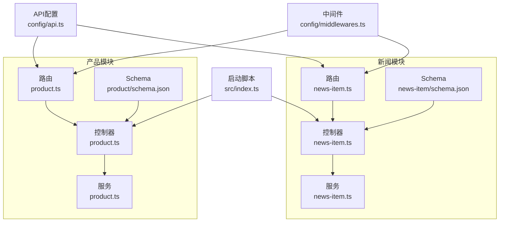
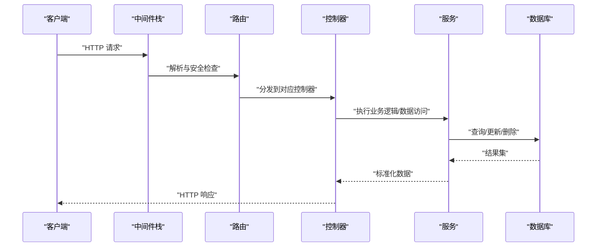
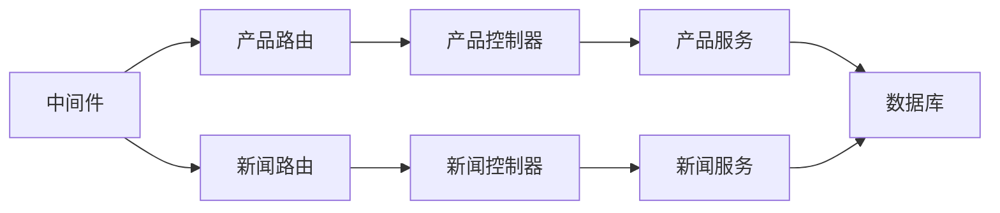

# 后端API端点

<cite>
**本文引用的文件**
- [backend/src/api/product/controllers/product.ts](file://backend/src/api/product/controllers/product.ts)
- [backend/src/api/news-item/controllers/news-item.ts](file://backend/src/api/news-item/controllers/news-item.ts)
- [backend/src/api/product/routes/product.ts](file://backend/src/api/product/routes/product.ts)
- [backend/src/api/news-item/routes/news-item.ts](file://backend/src/api/news-item/routes/news-item.ts)
- [backend/src/api/product/services/product.ts](file://backend/src/api/product/services/product.ts)
- [backend/src/api/news-item/services/news-item.ts](file://backend/src/api/news-item/services/news-item.ts)
- [backend/src/api/product/content-types/product/schema.json](file://backend/src/api/product/content-types/product/schema.json)
- [backend/src/api/news-item/content-types/news-item/schema.json](file://backend/src/api/news-item/content-types/news-item/schema.json)
- [backend/config/api.ts](file://backend/config/api.ts)
- [backend/config/middlewares.ts](file://backend/config/middlewares.ts)
- [backend/src/index.ts](file://backend/src/index.ts)
- [backend/scripts/import-products.mjs](file://backend/scripts/import-products.mjs)
- [backend/scripts/import-news.mjs](file://backend/scripts/import-news.mjs)
- [frontend/lib/strapi.ts](file://frontend/lib/strapi.ts)
- [frontend/types/news.ts](file://frontend/types/news.ts)
- [frontend/types/product.ts](file://frontend/types/product.ts)
</cite>

## 目录
1. [简介](#简介)
2. [项目结构](#项目结构)
3. [核心组件](#核心组件)
4. [架构总览](#架构总览)
5. [详细组件分析](#详细组件分析)
6. [依赖关系分析](#依赖关系分析)
7. [性能考量](#性能考量)
8. [故障排查指南](#故障排查指南)
9. [结论](#结论)
10. [附录](#附录)

## 简介
本文件为该 Strapi 后端项目的后端 API 端点文档，聚焦于产品与新闻两类内容的 RESTful 接口，覆盖以下端点：
- 产品：GET /api/products、POST /api/products、PUT /api/products/:id、DELETE /api/products/:id
- 新闻：GET /api/news、POST /api/news、PUT /api/news/:id、DELETE /api/news/:id

文档从 Strapi 的 MVC 架构出发，结合 Content Type 定义、路由与控制器、服务层逻辑、中间件与权限配置，系统性说明请求/响应结构、查询参数与过滤条件、排序规则、错误处理与安全考虑，并提供基于前端调用的实际示例路径。

## 项目结构
后端采用 Strapi 的模块化目录结构，每个内容类型（产品、新闻）均包含：
- Content Type Schema：定义字段、校验与元信息
- Controller：通过 Strapi 工厂函数创建核心控制器
- Service：通过 Strapi 工厂函数创建核心服务
- Route：通过 Strapi 工厂函数创建核心路由

此外，全局配置包括：
- API 默认分页与计数开关
- 中间件栈（含安全、CORS、查询解析、上传等）
- 应用启动时对公共角色的权限初始化

图表来源
- [backend/src/api/product/controllers/product.ts](file://backend/src/api/product/controllers/product.ts#L1-L4)
- [backend/src/api/news-item/controllers/news-item.ts](file://backend/src/api/news-item/controllers/news-item.ts#L1-L4)
- [backend/src/api/product/routes/product.ts](file://backend/src/api/product/routes/product.ts#L1-L4)
- [backend/src/api/news-item/routes/news-item.ts](file://backend/src/api/news-item/routes/news-item.ts#L1-L4)
- [backend/src/api/product/services/product.ts](file://backend/src/api/product/services/product.ts#L1-L4)
- [backend/src/api/news-item/services/news-item.ts](file://backend/src/api/news-item/services/news-item.ts#L1-L4)
- [backend/src/api/product/content-types/product/schema.json](file://backend/src/api/product/content-types/product/schema.json#L1-L63)
- [backend/src/api/news-item/content-types/news-item/schema.json](file://backend/src/api/news-item/content-types/news-item/schema.json#L1-L65)
- [backend/config/api.ts](file://backend/config/api.ts#L1-L8)
- [backend/config/middlewares.ts](file://backend/config/middlewares.ts#L1-L13)
- [backend/src/index.ts](file://backend/src/index.ts#L1-L65)

章节来源
- [backend/src/api/product/controllers/product.ts](file://backend/src/api/product/controllers/product.ts#L1-L4)
- [backend/src/api/news-item/controllers/news-item.ts](file://backend/src/api/news-item/controllers/news-item.ts#L1-L4)
- [backend/src/api/product/routes/product.ts](file://backend/src/api/product/routes/product.ts#L1-L4)
- [backend/src/api/news-item/routes/news-item.ts](file://backend/src/api/news-item/routes/news-item.ts#L1-L4)
- [backend/src/api/product/services/product.ts](file://backend/src/api/product/services/product.ts#L1-L4)
- [backend/src/api/news-item/services/news-item.ts](file://backend/src/api/news-item/services/news-item.ts#L1-L4)
- [backend/src/api/product/content-types/product/schema.json](file://backend/src/api/product/content-types/product/schema.json#L1-L63)
- [backend/src/api/news-item/content-types/news-item/schema.json](file://backend/src/api/news-item/content-types/news-item/schema.json#L1-L65)
- [backend/config/api.ts](file://backend/config/api.ts#L1-L8)
- [backend/config/middlewares.ts](file://backend/config/middlewares.ts#L1-L13)
- [backend/src/index.ts](file://backend/src/index.ts#L1-L65)

## 核心组件
- 控制器（Controller）
  - 产品与新闻分别通过工厂函数创建核心控制器，继承 Strapi 的通用 CRUD 能力，无需手动实现 GET/POST/PUT/DELETE 逻辑。
- 服务（Service）
  - 产品与新闻分别通过工厂函数创建核心服务，提供数据访问与业务逻辑扩展点。
- 路由（Route）
  - 产品与新闻分别通过工厂函数创建核心路由，暴露默认 RESTful 端点。
- 内容类型（Content Type Schema）
  - 定义字段类型、必填项、枚举值、媒体类型、布尔默认值、整型等约束；启用草稿/发布选项。
- API 配置
  - 默认分页限制、最大分页限制、是否返回总数。
- 中间件
  - 包含安全、CORS、查询解析、Body 解析、静态资源等。
- 权限初始化
  - 启动时为公共角色授予产品与新闻的“查找”权限。

章节来源
- [backend/src/api/product/controllers/product.ts](file://backend/src/api/product/controllers/product.ts#L1-L4)
- [backend/src/api/news-item/controllers/news-item.ts](file://backend/src/api/news-item/controllers/news-item.ts#L1-L4)
- [backend/src/api/product/services/product.ts](file://backend/src/api/product/services/product.ts#L1-L4)
- [backend/src/api/news-item/services/news-item.ts](file://backend/src/api/news-item/services/news-item.ts#L1-L4)
- [backend/src/api/product/routes/product.ts](file://backend/src/api/product/routes/product.ts#L1-L4)
- [backend/src/api/news-item/routes/news-item.ts](file://backend/src/api/news-item/routes/news-item.ts#L1-L4)
- [backend/src/api/product/content-types/product/schema.json](file://backend/src/api/product/content-types/product/schema.json#L1-L63)
- [backend/src/api/news-item/content-types/news-item/schema.json](file://backend/src/api/news-item/content-types/news-item/schema.json#L1-L65)
- [backend/config/api.ts](file://backend/config/api.ts#L1-L8)
- [backend/config/middlewares.ts](file://backend/config/middlewares.ts#L1-L13)
- [backend/src/index.ts](file://backend/src/index.ts#L19-L62)

## 架构总览
下图展示了 API 请求在 Strapi 中的典型流转：客户端请求经由中间件进入路由，路由委派给控制器，控制器调用服务层，服务层通过 Strapi 查询层访问数据库，最终返回响应。

图表来源
- [backend/config/middlewares.ts](file://backend/config/middlewares.ts#L1-L13)
- [backend/src/api/product/routes/product.ts](file://backend/src/api/product/routes/product.ts#L1-L4)
- [backend/src/api/news-item/routes/news-item.ts](file://backend/src/api/news-item/routes/news-item.ts#L1-L4)
- [backend/src/api/product/controllers/product.ts](file://backend/src/api/product/controllers/product.ts#L1-L4)
- [backend/src/api/news-item/controllers/news-item.ts](file://backend/src/api/news-item/controllers/news-item.ts#L1-L4)
- [backend/src/api/product/services/product.ts](file://backend/src/api/product/services/product.ts#L1-L4)
- [backend/src/api/news-item/services/news-item.ts](file://backend/src/api/news-item/services/news-item.ts#L1-L4)

## 详细组件分析

### 产品 API（/api/products）
- HTTP 方法与 URL 模式
  - GET /api/products：获取产品列表
  - POST /api/products：创建产品
  - PUT /api/products/:id：更新指定产品
  - DELETE /api/products/:id：删除指定产品
- 请求参数
  - GET 支持分页、排序、过滤与字段选择等通用查询参数（由 API 配置与 Strapi 查询解析中间件提供）
  - POST/PUT 请求体需包含 data 字段，其值为产品属性对象
- 响应格式
  - GET：返回数组包裹的产品条目，支持 populate、fields、pagination、sort 等查询参数
  - POST/PUT：返回单个产品条目
  - DELETE：通常返回空内容或 200/204
- 数据模型要点（节选）
  - 必填字段：name、slug
  - 枚举字段：category（warning/sensing/inspection）
  - 媒体字段：image（单图）、gallery（多图）
  - 结构化字段：features/specifications（JSON）
  - 元信息：featured（布尔，默认 false）、order（整数）、taobaoLink（字符串）
- 查询参数与过滤示例（来自前端调用）
  - populate[0]=image&populate[1]=gallery&sort[0]=order:asc
  - filters[slug][$eq]=xxx
  - pagination[limit]=N
- 错误处理
  - 400/422：请求体缺失或字段不合法
  - 401/403：未授权或权限不足
  - 404：资源不存在（PUT/DELETE）
  - 5xx：服务器内部错误
- 安全与权限
  - 公共角色已启用产品“查找”权限（启动时自动配置）

章节来源
- [backend/src/api/product/controllers/product.ts](file://backend/src/api/product/controllers/product.ts#L1-L4)
- [backend/src/api/product/routes/product.ts](file://backend/src/api/product/routes/product.ts#L1-L4)
- [backend/src/api/product/services/product.ts](file://backend/src/api/product/services/product.ts#L1-L4)
- [backend/src/api/product/content-types/product/schema.json](file://backend/src/api/product/content-types/product/schema.json#L13-L62)
- [backend/config/api.ts](file://backend/config/api.ts#L2-L7)
- [backend/config/middlewares.ts](file://backend/config/middlewares.ts#L1-L13)
- [backend/src/index.ts](file://backend/src/index.ts#L29-L62)
- [frontend/lib/strapi.ts](file://frontend/lib/strapi.ts#L113-L125)

### 新闻 API（/api/news）
- HTTP 方法与 URL 模式
  - GET /api/news：获取新闻列表
  - POST /api/news：创建新闻
  - PUT /api/news/:id：更新指定新闻
  - DELETE /api/news/:id：删除指定新闻
- 请求参数
  - GET 支持分页、排序、过滤与字段选择等通用查询参数
  - POST/PUT 请求体需包含 data 字段，其值为新闻属性对象
- 响应格式
  - GET：返回数组包裹的新闻条目，支持 populate、fields、pagination、sort 等查询参数
  - POST/PUT：返回单个新闻条目
  - DELETE：通常返回空内容或 200/204
- 数据模型要点（节选）
  - 必填字段：title、slug
  - 枚举字段：category（product/tech/standard/company）
  - 媒体字段：image（单图）、attachments（多图）
  - 元信息：author、featured（布尔，默认 false）、tags（JSON）、viewCount（整数，默认 0）、relatedProducts（JSON）
- 查询参数与过滤示例（来自前端调用）
  - populate[0]=image&sort[0]=publishedAt:desc
  - filters[slug][$eq]=xxx
  - fields[0]=slug&pagination[limit]=100
- 错误处理
  - 400/422：请求体缺失或字段不合法
  - 401/403：未授权或权限不足
  - 404：资源不存在（PUT/DELETE）
  - 5xx：服务器内部错误
- 安全与权限
  - 公共角色已启用新闻“查找”权限（启动时自动配置）

章节来源
- [backend/src/api/news-item/controllers/news-item.ts](file://backend/src/api/news-item/controllers/news-item.ts#L1-L4)
- [backend/src/api/news-item/routes/news-item.ts](file://backend/src/api/news-item/routes/news-item.ts#L1-L4)
- [backend/src/api/news-item/services/news-item.ts](file://backend/src/api/news-item/services/news-item.ts#L1-L4)
- [backend/src/api/news-item/content-types/news-item/schema.json](file://backend/src/api/news-item/content-types/news-item/schema.json#L13-L63)
- [backend/config/api.ts](file://backend/config/api.ts#L2-L7)
- [backend/config/middlewares.ts](file://backend/config/middlewares.ts#L1-L13)
- [backend/src/index.ts](file://backend/src/index.ts#L29-L62)
- [frontend/lib/strapi.ts](file://frontend/lib/strapi.ts#L127-L154)

### 控制器与服务层职责
- 控制器
  - 作为 HTTP 层，负责接收请求、参数校验、调用服务层、组装响应
  - 在本项目中，控制器通过工厂函数创建，复用 Strapi 的通用能力
- 服务层
  - 提供数据访问与业务逻辑扩展点，可在此添加自定义校验、关联数据处理、事件触发等
- 业务逻辑建议
  - 数据验证：利用 Content Type Schema 的必填与类型约束；必要时在服务层补充复杂校验
  - 权限检查：结合用户权限插件与角色控制，确保写操作仅限授权用户
  - 错误处理：统一捕获异常，返回标准错误码与消息
  - 草稿/发布：利用 Content Type 的 draftAndPublish 选项，配合 publish/unpublish 流程

章节来源
- [backend/src/api/product/controllers/product.ts](file://backend/src/api/product/controllers/product.ts#L1-L4)
- [backend/src/api/news-item/controllers/news-item.ts](file://backend/src/api/news-item/controllers/news-item.ts#L1-L4)
- [backend/src/api/product/services/product.ts](file://backend/src/api/product/services/product.ts#L1-L4)
- [backend/src/api/news-item/services/news-item.ts](file://backend/src/api/news-item/services/news-item.ts#L1-L4)
- [backend/src/api/product/content-types/product/schema.json](file://backend/src/api/product/content-types/product/schema.json#L10-L12)
- [backend/src/api/news-item/content-types/news-item/schema.json](file://backend/src/api/news-item/content-types/news-item/schema.json#L10-L12)

### 路由与查询参数
- 路由
  - 产品与新闻路由通过工厂函数创建，暴露默认 RESTful 端点
- 查询参数
  - 分页：pagination[limit]/pagination[start]
  - 排序：sort[0]=field:asc/desc
  - 过滤：filters[field][$eq]=$val、filters[slug][$eq]=xxx
  - 字段选择：fields[0]=field
  - 关联填充：populate[0]=image 等
- 示例（来自前端调用）
  - 获取产品列表并按 order 升序排列
  - 获取新闻列表并按发布时间降序排列
  - 按 slug 精确匹配获取单条新闻
  - 获取新闻 slug 列表并限制数量

章节来源
- [backend/src/api/product/routes/product.ts](file://backend/src/api/product/routes/product.ts#L1-L4)
- [backend/src/api/news-item/routes/news-item.ts](file://backend/src/api/news-item/routes/news-item.ts#L1-L4)
- [backend/config/api.ts](file://backend/config/api.ts#L2-L7)
- [frontend/lib/strapi.ts](file://frontend/lib/strapi.ts#L113-L154)

### 请求/响应示例（路径参考）
- 获取产品列表
  - 路径：/api/products?populate[0]=image&populate[1]=gallery&sort[0]=order:asc
  - 参考：[frontend/lib/strapi.ts](file://frontend/lib/strapi.ts#L113-L125)
- 获取热门产品
  - 路径：/api/products?populate[0]=image&sort[0]=publishedAt:desc&pagination[limit]=N
  - 参考：[frontend/lib/strapi.ts](file://frontend/lib/strapi.ts#L120-L125)
- 获取新闻列表
  - 路径：/api/news?populate[0]=image&sort[0]=publishedAt:desc
  - 参考：[frontend/lib/strapi.ts](file://frontend/lib/strapi.ts#L127-L139)
- 按 slug 获取新闻详情
  - 路径：/api/news?populate[0]=image&filters[slug][$eq]=xxx
  - 参考：[frontend/lib/strapi.ts](file://frontend/lib/strapi.ts#L141-L147)
- 获取新闻 slug 列表
  - 路径：/api/news?fields[0]=slug&pagination[limit]=100
  - 参考：[frontend/lib/strapi.ts](file://frontend/lib/strapi.ts#L149-L154)

章节来源
- [frontend/lib/strapi.ts](file://frontend/lib/strapi.ts#L100-L154)

### 导入与同步（脚本）
- 产品导入脚本
  - 功能：上传媒体、去重、UPSERT 产品
  - 使用：需要设置 STRAPI_URL 与 STRAPI_TOKEN
  - 关键流程：上传图片 -> 查找现有产品 -> POST/PUT UPSERT
  - 参考：[backend/scripts/import-products.mjs](file://backend/scripts/import-products.mjs#L83-L124)
- 新闻导入脚本
  - 功能：上传封面图、UPSERT 新闻
  - 使用：需要设置 STRAPI_URL 与 STRAPI_TOKEN
  - 关键流程：上传图片 -> 查找现有新闻 -> POST/PUT UPSERT
  - 参考：[backend/scripts/import-news.mjs](file://backend/scripts/import-news.mjs#L83-L122)

章节来源
- [backend/scripts/import-products.mjs](file://backend/scripts/import-products.mjs#L10-L16)
- [backend/scripts/import-products.mjs](file://backend/scripts/import-products.mjs#L68-L81)
- [backend/scripts/import-products.mjs](file://backend/scripts/import-products.mjs#L83-L124)
- [backend/scripts/import-news.mjs](file://backend/scripts/import-news.mjs#L10-L16)
- [backend/scripts/import-news.mjs](file://backend/scripts/import-news.mjs#L68-L81)
- [backend/scripts/import-news.mjs](file://backend/scripts/import-news.mjs#L83-L122)

## 依赖关系分析
- 组件耦合
  - 控制器与服务层松耦合，通过服务接口交互
  - 路由与控制器通过 Strapi 工厂函数绑定，减少手写路由代码
- 外部依赖
  - 用户权限插件：用于角色与动作授权
  - 上传插件：用于媒体文件上传
  - 数据库驱动：默认 SQLite（better-sqlite3）
- 可能的循环依赖
  - 当前结构为模块化目录，无明显循环依赖迹象

图表来源
- [backend/src/api/product/routes/product.ts](file://backend/src/api/product/routes/product.ts#L1-L4)
- [backend/src/api/news-item/routes/news-item.ts](file://backend/src/api/news-item/routes/news-item.ts#L1-L4)
- [backend/src/api/product/controllers/product.ts](file://backend/src/api/product/controllers/product.ts#L1-L4)
- [backend/src/api/news-item/controllers/news-item.ts](file://backend/src/api/news-item/controllers/news-item.ts#L1-L4)
- [backend/src/api/product/services/product.ts](file://backend/src/api/product/services/product.ts#L1-L4)
- [backend/src/api/news-item/services/news-item.ts](file://backend/src/api/news-item/services/news-item.ts#L1-L4)
- [backend/config/middlewares.ts](file://backend/config/middlewares.ts#L1-L13)

章节来源
- [backend/src/api/product/routes/product.ts](file://backend/src/api/product/routes/product.ts#L1-L4)
- [backend/src/api/news-item/routes/news-item.ts](file://backend/src/api/news-item/routes/news-item.ts#L1-L4)
- [backend/src/api/product/controllers/product.ts](file://backend/src/api/product/controllers/product.ts#L1-L4)
- [backend/src/api/news-item/controllers/news-item.ts](file://backend/src/api/news-item/controllers/news-item.ts#L1-L4)
- [backend/src/api/product/services/product.ts](file://backend/src/api/product/services/product.ts#L1-L4)
- [backend/src/api/news-item/services/news-item.ts](file://backend/src/api/news-item/services/news-item.ts#L1-L4)
- [backend/config/middlewares.ts](file://backend/config/middlewares.ts#L1-L13)

## 性能考量
- 分页与限制
  - API 配置设置了默认分页与最大分页限制，避免一次性返回过多数据
- 查询优化
  - 仅选择必要字段（fields），减少网络与序列化开销
  - 合理使用 populate，避免深度关联导致 N+1
- 缓存策略
  - 前端可利用 Next.js 缓存机制（revalidate 参数）降低后端压力
- 媒体处理
  - 建议在上传后生成缩略图与 WebP/AVIF 等优化格式，减少传输体积

章节来源
- [backend/config/api.ts](file://backend/config/api.ts#L2-L7)
- [frontend/lib/strapi.ts](file://frontend/lib/strapi.ts#L100-L111)

## 故障排查指南
- 常见错误与定位
  - 400/422：检查请求体结构与必填字段；确认 Content Type Schema 约束
  - 401/403：检查用户权限与令牌有效性；确认公共角色权限已初始化
  - 404：确认资源 ID 存在；注意 UPSERT 场景下的回退逻辑
  - 500：查看服务器日志，定位服务层异常
- 权限问题
  - 启动脚本会为公共角色启用产品与新闻的“查找”权限；如异常需检查角色与动作映射
- 导入失败
  - 上传媒体失败时会跳过并记录警告；检查 STRAPI_TOKEN 与媒体路径

章节来源
- [backend/src/index.ts](file://backend/src/index.ts#L29-L62)
- [backend/scripts/import-products.mjs](file://backend/scripts/import-products.mjs#L55-L66)
- [backend/scripts/import-news.mjs](file://backend/scripts/import-news.mjs#L54-L66)

## 结论
本项目基于 Strapi 的 MVC 架构，产品与新闻两类内容通过统一的控制器、服务与路由实现 RESTful API。Content Type Schema 明确了字段约束与默认行为，API 配置与中间件提供了分页、排序、过滤与安全基础能力。前端通过标准化的查询参数与 populate 机制高效消费数据。建议在服务层补充复杂校验与业务规则，在权限与速率限制方面进一步加固以满足生产环境需求。

## 附录
- API 版本管理
  - 当前未见显式的 API 版本号路径（如 /api/v1/...），建议在路由层引入版本前缀以兼容未来变更
- 速率限制
  - 未发现内置速率限制中间件；可在中间件栈中引入相应插件或自定义中间件
- 安全建议
  - 强制使用 HTTPS 与安全头
  - 对写操作增加更细粒度的角色权限
  - 对上传文件进行类型与大小校验
  - 对敏感字段进行脱敏输出