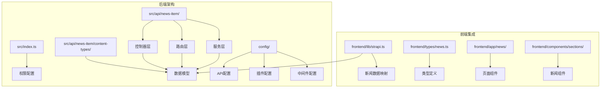
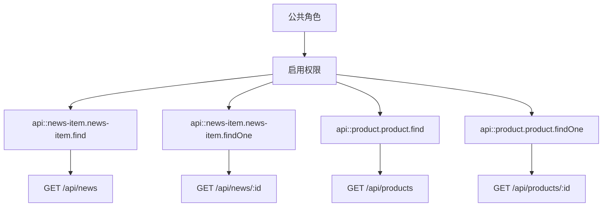
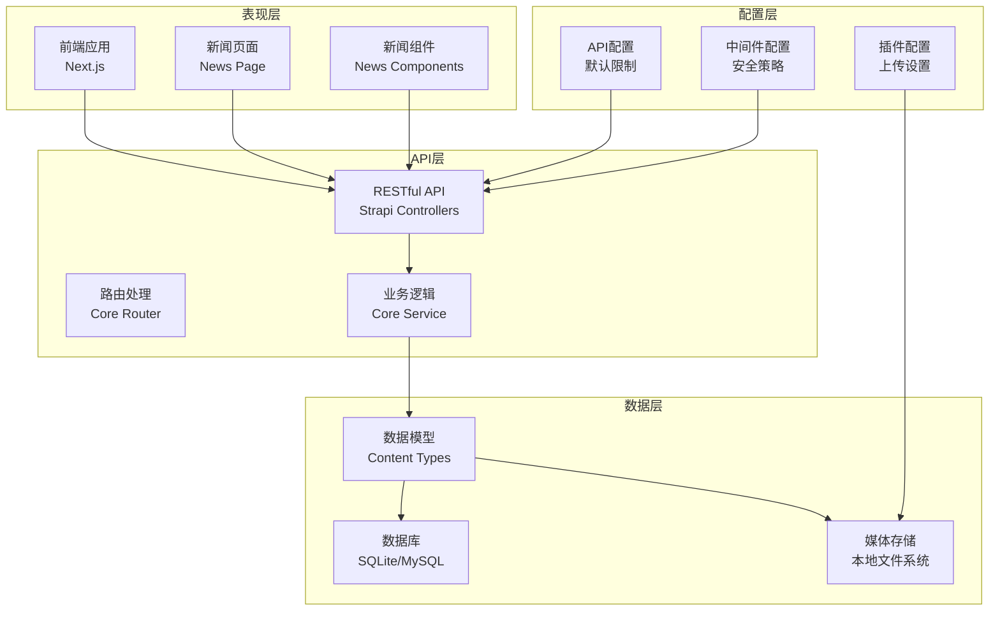
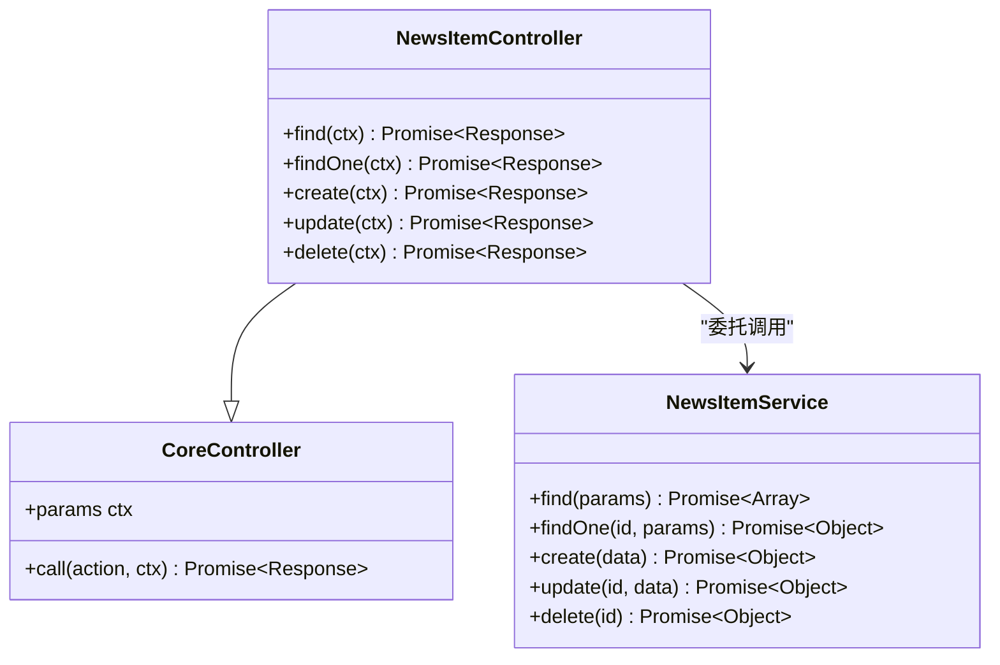
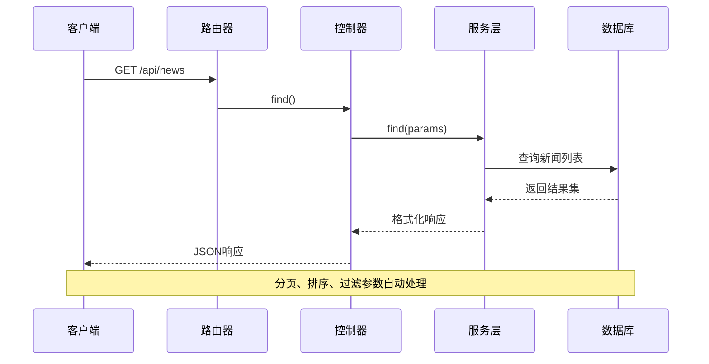
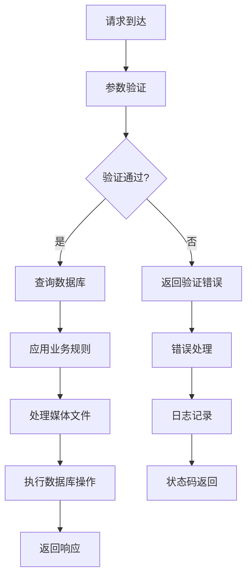
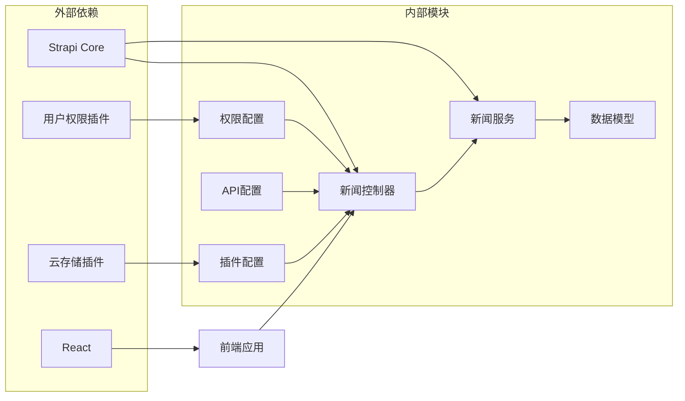
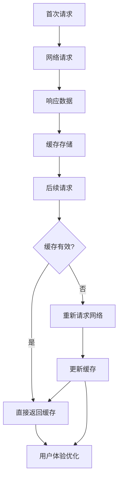

# 新闻API端点

<cite>
**本文档引用的文件**
- [backend/src/api/news-item/controllers/news-item.ts](file://backend/src/api/news-item/controllers/news-item.ts)
- [backend/src/api/news-item/routes/news-item.ts](file://backend/src/api/news-item/routes/news-item.ts)
- [backend/src/api/news-item/services/news-item.ts](file://backend/src/api/news-item/services/news-item.ts)
- [backend/src/api/news-item/content-types/news-item/schema.json](file://backend/src/api/news-item/content-types/news-item/schema.json)
- [backend/src/index.ts](file://backend/src/index.ts)
- [backend/config/api.ts](file://backend/config/api.ts)
- [backend/config/plugins.ts](file://backend/config/plugins.ts)
- [backend/config/middlewares.ts](file://backend/config/middlewares.ts)
- [backend/scripts/import-news.mjs](file://backend/scripts/import-news.mjs)
- [frontend/lib/strapi.ts](file://frontend/lib/strapi.ts)
- [frontend/types/news.ts](file://frontend/types/news.ts)
- [frontend/app/news/page.tsx](file://frontend/app/news/page.tsx)
- [frontend/components/sections/News.tsx](file://frontend/components/sections/News.tsx)
</cite>

## 目录
1. [简介](#简介)
2. [项目结构](#项目结构)
3. [核心组件](#核心组件)
4. [架构概览](#架构概览)
5. [详细组件分析](#详细组件分析)
6. [依赖关系分析](#依赖关系分析)
7. [性能考虑](#性能考虑)
8. [故障排除指南](#故障排除指南)
9. [结论](#结论)
10. [附录](#附录)

## 简介

本文档提供了中创智控智慧交通平台后端新闻API端点的全面技术文档。该系统基于Strapi 5.33.4构建，实现了完整的新闻资讯管理功能，包括新闻内容的增删改查操作、分类管理、SEO优化、媒体文件处理和权限控制。

系统采用前后端分离架构，后端提供RESTful API接口，前端使用Next.js进行内容展示和用户交互。新闻数据模型支持富文本内容、多语言配置、图片上传和关联产品管理等功能。

## 项目结构

后端采用Strapi的标准目录结构，主要包含以下关键组件：

**图表来源**
- [backend/src/index.ts](file://backend/src/index.ts#L1-L65)
- [backend/src/api/news-item/controllers/news-item.ts](file://backend/src/api/news-item/controllers/news-item.ts#L1-L4)
- [backend/src/api/news-item/routes/news-item.ts](file://backend/src/api/news-item/routes/news-item.ts#L1-L4)

**章节来源**
- [backend/src/index.ts](file://backend/src/index.ts#L1-L65)
- [backend/src/api/news-item/content-types/news-item/schema.json](file://backend/src/api/news-item/content-types/news-item/schema.json#L1-L65)

## 核心组件

### 新闻数据模型

新闻内容模型基于Strapi的集合类型设计，支持完整的新闻管理功能：

| 字段名称 | 类型 | 必填 | 描述 | 约束 |
|---------|------|------|------|------|
| title | string | 是 | 新闻标题 | 最大长度限制 |
| slug | uid | 是 | SEO友好的URL标识符 | 唯一，自动生成 |
| summary | text | 否 | 新闻摘要 | 支持HTML格式 |
| content | richtext | 否 | 富文本内容 | 支持复杂格式化 |
| category | enumeration | 否 | 新闻分类 | 枚举值：product, tech, standard, company |
| image | media | 否 | 封面图片 | 单张图片，仅限图片类型 |
| attachments | media | 否 | 附件资源 | 多张图片，仅限图片类型 |
| author | string | 否 | 作者信息 | 支持多作者 |
| featured | boolean | 否 | 置顶标记 | 默认false |
| tags | json | 否 | 标签数组 | 自由标签系统 |
| viewCount | integer | 否 | 浏览计数 | 默认0 |
| relatedProducts | json | 否 | 关联产品 | 产品slug列表 |

**章节来源**
- [backend/src/api/news-item/content-types/news-item/schema.json](file://backend/src/api/news-item/content-types/news-item/schema.json#L13-L62)

### 权限控制系统

系统通过用户权限插件实现细粒度的访问控制：

**图表来源**
- [backend/src/index.ts](file://backend/src/index.ts#L29-L34)

**章节来源**
- [backend/src/index.ts](file://backend/src/index.ts#L19-L63)

## 架构概览

系统采用分层架构设计，确保职责分离和可维护性：

**图表来源**
- [backend/src/api/news-item/controllers/news-item.ts](file://backend/src/api/news-item/controllers/news-item.ts#L1-L4)
- [backend/src/api/news-item/services/news-item.ts](file://backend/src/api/news-item/services/news-item.ts#L1-L4)

## 详细组件分析

### 控制器层实现

新闻控制器基于Strapi的核心控制器工厂模式创建，提供标准的CRUD操作：

**图表来源**
- [backend/src/api/news-item/controllers/news-item.ts](file://backend/src/api/news-item/controllers/news-item.ts#L1-L4)
- [backend/src/api/news-item/services/news-item.ts](file://backend/src/api/news-item/services/news-item.ts#L1-L4)

### 路由层配置

路由层使用Strapi的核心路由器工厂，自动为新闻内容类型生成RESTful端点：

**图表来源**
- [backend/src/api/news-item/routes/news-item.ts](file://backend/src/api/news-item/routes/news-item.ts#L1-L4)

### 服务层业务逻辑

服务层封装了核心业务逻辑，包括数据验证、关联查询和事务处理：

**图表来源**
- [backend/src/api/news-item/services/news-item.ts](file://backend/src/api/news-item/services/news-item.ts#L1-L4)

**章节来源**
- [backend/src/api/news-item/controllers/news-item.ts](file://backend/src/api/news-item/controllers/news-item.ts#L1-L4)
- [backend/src/api/news-item/routes/news-item.ts](file://backend/src/api/news-item/routes/news-item.ts#L1-L4)
- [backend/src/api/news-item/services/news-item.ts](file://backend/src/api/news-item/services/news-item.ts#L1-L4)

## 依赖关系分析

系统各组件之间的依赖关系清晰明确：

**图表来源**
- [backend/package.json](file://backend/package.json#L20-L29)
- [backend/src/index.ts](file://backend/src/index.ts#L19-L63)

**章节来源**
- [backend/package.json](file://backend/package.json#L1-L45)
- [backend/config/plugins.ts](file://backend/config/plugins.ts#L1-L11)

## 性能考虑

### API配置优化

系统默认配置提供了合理的性能基准：

- **默认分页限制**: 25条记录
- **最大分页限制**: 100条记录  
- **启用计数查询**: 提供总记录数统计
- **媒体文件大小限制**: 10MB

### 缓存策略

前端应用实现了智能缓存机制：

**图表来源**
- [frontend/lib/strapi.ts](file://frontend/lib/strapi.ts#L100-L111)

**章节来源**
- [backend/config/api.ts](file://backend/config/api.ts#L1-L8)
- [frontend/lib/strapi.ts](file://frontend/lib/strapi.ts#L100-L111)

## 故障排除指南

### 常见错误场景

| 错误类型 | HTTP状态码 | 可能原因 | 解决方案 |
|---------|-----------|----------|----------|
| 验证失败 | 400 | 字段缺失或格式不正确 | 检查必填字段和数据类型 |
| 权限不足 | 403 | 用户无访问权限 | 配置用户权限或登录认证 |
| 资源不存在 | 404 | ID或slug无效 | 验证URL参数正确性 |
| 服务器错误 | 500 | 服务器内部异常 | 查看服务器日志和堆栈跟踪 |
| 文件上传失败 | 413 | 文件大小超限 | 减少文件大小或调整配置 |

### 调试建议

1. **启用详细日志**: 在开发环境中启用Strapi的详细日志输出
2. **检查网络连接**: 确保前端能够正常访问后端API
3. **验证认证令牌**: 确认API令牌的有效性和权限范围
4. **监控数据库连接**: 检查数据库连接状态和查询性能

**章节来源**
- [backend/config/middlewares.ts](file://backend/config/middlewares.ts#L1-L13)
- [frontend/lib/strapi.ts](file://frontend/lib/strapi.ts#L105-L108)

## 结论

本新闻API系统基于Strapi框架构建，提供了完整的新闻资讯管理解决方案。系统具有以下优势：

1. **标准化架构**: 采用Strapi的标准分层架构，便于维护和扩展
2. **灵活的数据模型**: 支持富文本、媒体文件和关联数据管理
3. **完善的权限控制**: 基于用户权限插件实现细粒度访问控制
4. **前后端分离**: 清晰的职责分离，提高开发效率
5. **性能优化**: 合理的配置和缓存策略，确保良好的用户体验

系统支持RESTful API标准，易于集成到各种前端应用中，并提供了完整的错误处理和调试机制。

## 附录

### API端点规范

#### 获取新闻列表
- **方法**: GET
- **路径**: `/api/news`
- **查询参数**:
  - `sort`: 排序字段，如 `publishedAt:desc`
  - `pagination[limit]`: 分页限制，默认25
  - `pagination[start]`: 分页起始位置
  - `filters[category][$eq]`: 分类过滤
  - `filters[featured][$eq]`: 置顶过滤
  - `populate`: 关联数据填充

#### 获取单篇新闻详情
- **方法**: GET  
- **路径**: `/api/news/:id`
- **路径参数**:
  - `id`: 新闻记录ID或slug

#### 创建新新闻
- **方法**: POST
- **路径**: `/api/news`
- **请求体**: 包含所有必需字段的JSON对象

#### 更新新闻内容
- **方法**: PUT/PATCH
- **路径**: `/api/news/:id`
- **路径参数**:
  - `id`: 新闻记录ID
- **请求体**: 需要更新的字段集合

#### 删除新闻
- **方法**: DELETE
- **路径**: `/api/news/:id`
- **路径参数**:
  - `id`: 新闻记录ID

### 数据导入脚本

系统提供了批量导入新闻数据的脚本，支持：

- 自动媒体文件上传
- 去重处理（基于slug）
- 错误恢复机制
- 批量处理大量数据

**章节来源**
- [backend/scripts/import-news.mjs](file://backend/scripts/import-news.mjs#L83-L122)
- [frontend/lib/strapi.ts](file://frontend/lib/strapi.ts#L127-L147)