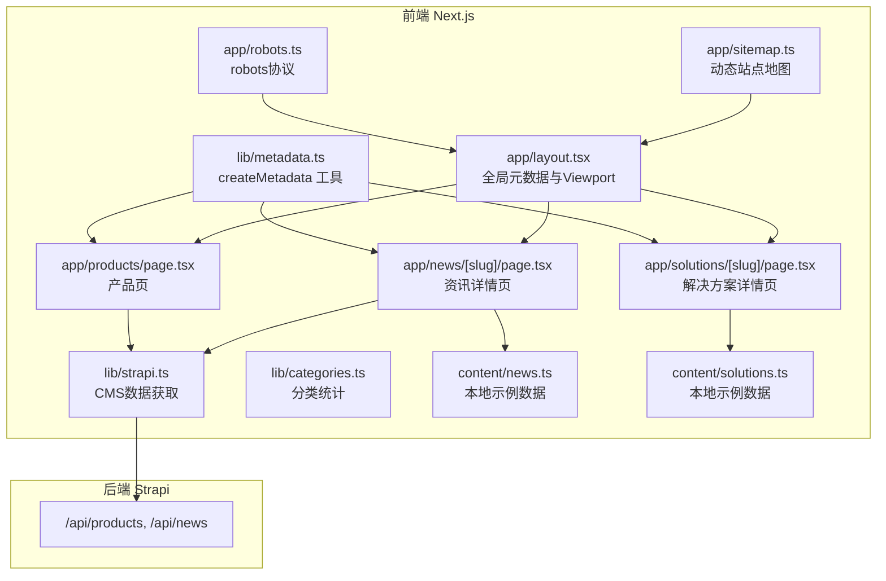
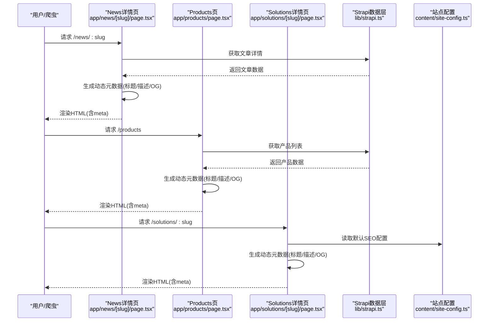
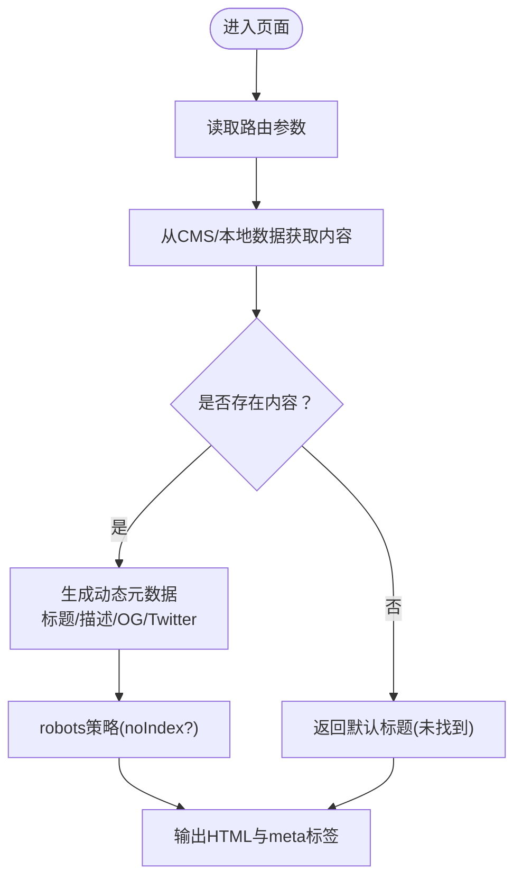
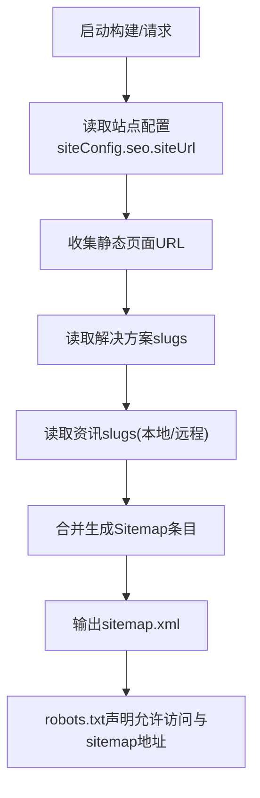
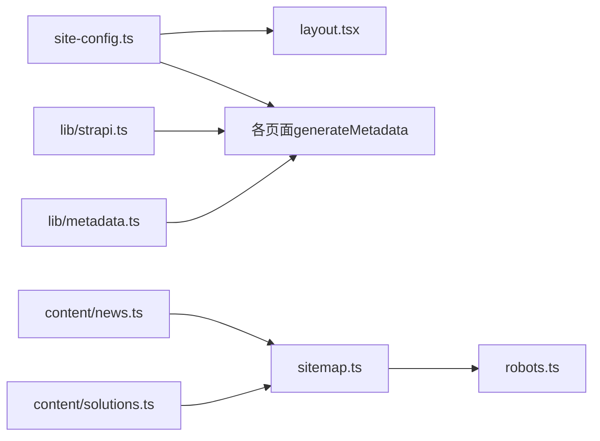

# SEO优化策略

<cite>
**本文引用的文件**
- [frontend/lib/metadata.ts](file://frontend/lib/metadata.ts)
- [frontend/app/layout.tsx](file://frontend/app/layout.tsx)
- [frontend/app/sitemap.ts](file://frontend/app/sitemap.ts)
- [frontend/app/robots.ts](file://frontend/app/robots.ts)
- [backend/public/robots.txt](file://backend/public/robots.txt)
- [frontend/content/site-config.ts](file://frontend/content/site-config.ts)
- [frontend/content/news.ts](file://frontend/content/news.ts)
- [frontend/content/solutions.ts](file://frontend/content/solutions.ts)
- [frontend/app/news/[slug]/page.tsx](file://frontend/app/news/[slug]/page.tsx)
- [frontend/app/products/page.tsx](file://frontend/app/products/page.tsx)
- [frontend/app/solutions/[slug]/page.tsx](file://frontend/app/solutions/[slug]/page.tsx)
- [frontend/lib/strapi.ts](file://frontend/lib/strapi.ts)
- [frontend/lib/categories.ts](file://frontend/lib/categories.ts)
- [frontend/types/news.ts](file://frontend/types/news.ts)
- [frontend/types/product.ts](file://frontend/types/product.ts)
</cite>

## 目录
1. [引言](#引言)
2. [项目结构](#项目结构)
3. [核心组件](#核心组件)
4. [架构总览](#架构总览)
5. [详细组件分析](#详细组件分析)
6. [依赖分析](#依赖分析)
7. [性能考虑](#性能考虑)
8. [故障排除指南](#故障排除指南)
9. [结论](#结论)
10. [附录](#附录)

## 引言
本文件面向中创智控官网的搜索引擎优化（SEO）实现，系统梳理前端Next.js应用中的元数据管理、社交分享（Open Graph、Twitter Cards）、站点地图与爬虫协议、结构化数据标记、静态生成对SEO的积极影响，以及关键词、URL结构与内容组织的最佳实践。文档同时提供Google Search Console集成、爬虫访问控制与搜索引擎友好页面设计指南，帮助团队在现有代码基础上进一步提升搜索可见性与点击率。

## 项目结构
官网采用前后端分离架构：前端基于Next.js App Router，后端为Strapi CMS，静态资源与爬虫协议位于各自目录。前端App Router下的页面通过动态元数据生成函数与全局布局配置实现SEO统一管理；内容来源于Strapi并通过工具函数映射为前端类型。

图表来源
- [frontend/app/layout.tsx](file://frontend/app/layout.tsx#L9-L52)
- [frontend/lib/metadata.ts](file://frontend/lib/metadata.ts#L10-L57)
- [frontend/app/sitemap.ts](file://frontend/app/sitemap.ts#L8-L66)
- [frontend/app/robots.ts](file://frontend/app/robots.ts#L4-L13)
- [frontend/app/news/[slug]/page.tsx](file://frontend/app/news/[slug]/page.tsx#L22-L46)
- [frontend/app/products/page.tsx](file://frontend/app/products/page.tsx#L7-L41)
- [frontend/app/solutions/[slug]/page.tsx](file://frontend/app/solutions/[slug]/page.tsx#L21-L42)
- [frontend/lib/strapi.ts](file://frontend/lib/strapi.ts#L100-L154)
- [frontend/content/news.ts](file://frontend/content/news.ts#L208-L239)
- [frontend/content/solutions.ts](file://frontend/content/solutions.ts#L114-L133)

章节来源
- [frontend/app/layout.tsx](file://frontend/app/layout.tsx#L1-L83)
- [frontend/lib/metadata.ts](file://frontend/lib/metadata.ts#L1-L60)
- [frontend/app/sitemap.ts](file://frontend/app/sitemap.ts#L1-L67)
- [frontend/app/robots.ts](file://frontend/app/robots.ts#L1-L14)
- [frontend/lib/strapi.ts](file://frontend/lib/strapi.ts#L1-L155)

## 核心组件
- 全局元数据与Viewport：在根布局中集中配置默认标题模板、描述、关键词、Open Graph、Twitter卡片与robots策略，确保所有页面具备一致的基础SEO属性。
- 动态元数据生成：页面级generateMetadata函数结合页面参数与CMS数据动态生成标题、描述与社交分享图，支持文章类页面的article类型OG与发布时间等字段。
- 元数据工具函数createMetadata：提供可复用的元数据构造逻辑，支持传入自定义标题、描述、图片与noIndex控制，便于在组件或服务层统一调用。
- 站点地图与robots：sitemap.ts聚合静态页面、解决方案详情页与资讯详情页；robots.ts声明允许爬取路径与sitemap地址，后端public/robots.txt提供额外屏蔽示例。
- 内容数据与分类：通过lib/strapi.ts从CMS拉取产品与资讯数据，lib/categories.ts计算分类计数；content/news.ts与content/solutions.ts提供本地示例数据与slug集合，支撑sitemap与详情页路由生成。

章节来源
- [frontend/app/layout.tsx](file://frontend/app/layout.tsx#L9-L52)
- [frontend/lib/metadata.ts](file://frontend/lib/metadata.ts#L10-L57)
- [frontend/app/sitemap.ts](file://frontend/app/sitemap.ts#L8-L66)
- [frontend/app/robots.ts](file://frontend/app/robots.ts#L4-L13)
- [frontend/lib/strapi.ts](file://frontend/lib/strapi.ts#L100-L154)
- [frontend/lib/categories.ts](file://frontend/lib/categories.ts#L17-L47)
- [frontend/content/news.ts](file://frontend/content/news.ts#L208-L239)
- [frontend/content/solutions.ts](file://frontend/content/solutions.ts#L114-L133)

## 架构总览
下图展示SEO相关组件在请求生命周期中的交互：浏览器请求页面 → Next.js解析路由 → 调用generateMetadata或createMetadata → 读取CMS/本地数据 → 输出HTML与元标签 → 搜索引擎抓取与索引。

图表来源
- [frontend/app/news/[slug]/page.tsx](file://frontend/app/news/[slug]/page.tsx#L22-L46)
- [frontend/app/products/page.tsx](file://frontend/app/products/page.tsx#L7-L41)
- [frontend/app/solutions/[slug]/page.tsx](file://frontend/app/solutions/[slug]/page.tsx#L21-L42)
- [frontend/lib/strapi.ts](file://frontend/lib/strapi.ts#L100-L154)
- [frontend/content/site-config.ts](file://frontend/content/site-config.ts#L21-L29)

## 详细组件分析

### 元数据管理系统
- 设计目标
  - 统一品牌与默认SEO属性（标题模板、描述、关键词、作者、站点基础URL）。
  - 支持页面级动态元数据覆盖（标题、描述、图片、noIndex）。
  - 标准化社交分享（Open Graph与Twitter Cards）。
- 关键实现
  - createMetadata函数：接收可选标题、描述、图片与noIndex，返回符合Next.js Metadata接口的对象；内部使用站点配置作为默认值，拼接品牌名，设置OG与Twitter卡片字段，以及robots策略。
  - 根布局layout.tsx：集中配置默认title模板、description、keywords、authors、metadataBase、Open Graph与Twitter卡片；robots中启用Google Bot的预览策略，提升索引质量。
  - 页面级generateMetadata：资讯详情页与产品页分别从CMS读取数据，动态生成标题、描述与OG图片；解决方案详情页使用本地数据与站点配置生成元数据。
- 最佳实践
  - 在页面级优先使用generateMetadata，确保标题与描述与内容高度相关。
  - OG图片建议使用1200x630像素，包含品牌元素与清晰文案，提升社交点击率。
  - 使用noIndex控制测试页或重复内容，避免稀释权重。

图表来源
- [frontend/app/news/[slug]/page.tsx](file://frontend/app/news/[slug]/page.tsx#L22-L46)
- [frontend/app/products/page.tsx](file://frontend/app/products/page.tsx#L7-L41)
- [frontend/app/solutions/[slug]/page.tsx](file://frontend/app/solutions/[slug]/page.tsx#L21-L42)
- [frontend/lib/metadata.ts](file://frontend/lib/metadata.ts#L10-L57)

章节来源
- [frontend/lib/metadata.ts](file://frontend/lib/metadata.ts#L10-L57)
- [frontend/app/layout.tsx](file://frontend/app/layout.tsx#L9-L52)
- [frontend/app/news/[slug]/page.tsx](file://frontend/app/news/[slug]/page.tsx#L22-L46)
- [frontend/app/products/page.tsx](file://frontend/app/products/page.tsx#L7-L41)
- [frontend/app/solutions/[slug]/page.tsx](file://frontend/app/solutions/[slug]/page.tsx#L21-L42)

### Open Graph与Twitter Cards配置
- Open Graph
  - 站点层面：在根布局中配置网站类型、语言、URL、站点名、默认OG图片尺寸与alt。
  - 页面层面：资讯详情页设置type为article，包含发布时间、作者与标签；产品页与解决方案详情页设置type为website或article，包含图片数组。
- Twitter Cards
  - 站点层面：设置summary_large_image卡片样式与默认标题、描述、图片。
  - 页面层面：根据页面内容动态设置卡片标题、描述与图片。
- 建议
  - 图片尺寸与比例保持一致，确保在不同社交平台显示效果稳定。
  - 文章类页面补充publish_time、authors、tags等字段，增强社交分享的信息密度。

章节来源
- [frontend/app/layout.tsx](file://frontend/app/layout.tsx#L19-L40)
- [frontend/app/news/[slug]/page.tsx](file://frontend/app/news/[slug]/page.tsx#L33-L45)
- [frontend/app/products/page.tsx](file://frontend/app/products/page.tsx#L13-L40)
- [frontend/app/solutions/[slug]/page.tsx](file://frontend/app/solutions/[slug]/page.tsx#L32-L41)

### sitemap.xml与robots.txt生成
- sitemap.xml
  - 由sitemap.ts生成：包含首页、产品、解决方案、资讯、关于、联系等静态页面；动态生成解决方案详情页与资讯详情页条目；设置lastModified、changeFrequency与priority。
  - 动态条目来源于content/solutions.ts与content/news.ts的slug集合，以及lib/strapi.ts的getAllNewsSlugs。
- robots.txt
  - app/robots.ts：声明允许所有爬虫访问根路径，屏蔽/api、/admin、/_next等内部路径，并指向sitemap地址。
  - backend/public/robots.txt：提供注释示例，可用于完全阻止搜索引擎访问（开发/测试环境）。
- 建议
  - 定期校验sitemap是否包含最新页面，优先为高价值页面设置更高priority。
  - 在robots中明确允许抓取静态资源（CSS/JS/图片），避免影响索引质量。

图表来源
- [frontend/app/sitemap.ts](file://frontend/app/sitemap.ts#L8-L66)
- [frontend/content/solutions.ts](file://frontend/content/solutions.ts#L131-L133)
- [frontend/content/news.ts](file://frontend/content/news.ts#L236-L239)
- [frontend/lib/strapi.ts](file://frontend/lib/strapi.ts#L149-L154)
- [frontend/app/robots.ts](file://frontend/app/robots.ts#L4-L13)
- [backend/public/robots.txt](file://backend/public/robots.txt#L1-L4)

章节来源
- [frontend/app/sitemap.ts](file://frontend/app/sitemap.ts#L8-L66)
- [frontend/app/robots.ts](file://frontend/app/robots.ts#L4-L13)
- [backend/public/robots.txt](file://backend/public/robots.txt#L1-L4)
- [frontend/content/solutions.ts](file://frontend/content/solutions.ts#L131-L133)
- [frontend/content/news.ts](file://frontend/content/news.ts#L236-L239)
- [frontend/lib/strapi.ts](file://frontend/lib/strapi.ts#L149-L154)

### 结构化数据标记（Schema.org）
- 当前实现
  - 未在页面中显式注入JSON-LD结构化数据。
- 建议
  - 产品页：添加Product或BreadcrumbList，包含品牌、名称、描述、图像、价格等信息。
  - 资讯详情页：添加Article，包含publisher、headline、datePublished、author、image、keywords等。
  - 企业信息：在首页添加Organization Schema，包含name、logo、sameAs、address、contactPoint等。
- 影响
  - 结构化数据可提升摘要丰富度与点击率，部分场景可获得富摘要展示。

章节来源
- [frontend/app/products/page.tsx](file://frontend/app/products/page.tsx#L13-L40)
- [frontend/app/news/[slug]/page.tsx](file://frontend/app/news/[slug]/page.tsx#L33-L45)
- [frontend/types/news.ts](file://frontend/types/news.ts#L16-L43)
- [frontend/types/product.ts](file://frontend/types/product.ts#L13-L38)

### Next.js静态生成对SEO的积极影响
- 预渲染与静态导出
  - 详情页通过generateStaticParams与generateMetadata实现静态路由参数与动态元数据，有利于搜索引擎抓取与缓存。
  - 产品页与资讯页通过generateMetadata从CMS拉取数据，结合静态生成，确保首屏内容与SEO标签同步。
- 页面加载优化
  - 根布局配置viewport与主题色，提升移动端体验与视觉稳定性。
  - 通过revalidate策略控制数据刷新频率，平衡新鲜度与性能。
- 建议
  - 对高价值详情页尽可能使用静态生成；对需要实时性的内容采用增量静态再生（ISR）策略。

章节来源
- [frontend/app/news/[slug]/page.tsx](file://frontend/app/news/[slug]/page.tsx#L14-L20)
- [frontend/app/solutions/[slug]/page.tsx](file://frontend/app/solutions/[slug]/page.tsx#L13-L19)
- [frontend/app/products/page.tsx](file://frontend/app/products/page.tsx#L1-L50)
- [frontend/lib/strapi.ts](file://frontend/lib/strapi.ts#L100-L111)
- [frontend/app/layout.tsx](file://frontend/app/layout.tsx#L54-L61)

### 关键词优化、URL结构与内容组织最佳实践
- 关键词优化
  - 标题模板：使用“页面主题 | 品牌名”，确保品牌曝光与语义清晰。
  - 描述：每页描述应概括页面核心价值，避免堆砌关键词。
  - 关键词：根布局配置默认关键词，页面级可按主题微调。
- URL结构
  - 使用语义化slug（如/news/:slug、/solutions/:slug），保持层级简洁。
  - 详情页URL与CMS slug保持一致，利于SEO与分享。
- 内容组织
  - 资讯与产品按分类组织，提供筛选与分页能力。
  - 详情页包含面包屑导航，增强可发现性与用户体验。

章节来源
- [frontend/content/site-config.ts](file://frontend/content/site-config.ts#L21-L29)
- [frontend/content/news.ts](file://frontend/content/news.ts#L208-L239)
- [frontend/content/solutions.ts](file://frontend/content/solutions.ts#L114-L133)
- [frontend/lib/categories.ts](file://frontend/lib/categories.ts#L17-L47)

### Google Search Console集成与爬虫访问控制
- 集成步骤
  - 添加站点并验证所有权（DNS/HTML/文件上传等方式）。
  - 在Search Console中查看覆盖率报告、索引状态、热门查询与点击率。
  - 定期检查sitemap提交状态与robots访问日志。
- 爬虫访问控制
  - robots.ts允许抓取公开内容，屏蔽内部路径；后端robots.txt提供示例注释，便于在特定环境禁用抓取。
  - 如需限制抓取，可在页面级使用noIndex策略或调整robots规则。
- 页面设计指南
  - 确保所有页面具备唯一且相关的标题与描述。
  - 为文章类页面补充发布时间、作者、标签等OG字段。
  - 保证图片加载与CDN可用性，避免影响索引与速度评分。

章节来源
- [frontend/app/robots.ts](file://frontend/app/robots.ts#L4-L13)
- [backend/public/robots.txt](file://backend/public/robots.txt#L1-L4)
- [frontend/app/news/[slug]/page.tsx](file://frontend/app/news/[slug]/page.tsx#L33-L45)
- [frontend/app/layout.tsx](file://frontend/app/layout.tsx#L19-L51)

## 依赖分析
- 组件耦合
  - 页面级generateMetadata依赖CMS数据层（lib/strapi.ts）与站点配置（content/site-config.ts）。
  - 元数据工具函数（lib/metadata.ts）被多个页面共享，提高一致性与可维护性。
  - 站点地图依赖本地与远程slug集合，确保覆盖所有详情页。
- 外部依赖
  - Strapi CMS提供产品与资讯数据；Next.js App Router负责路由与元数据生成。
- 循环依赖
  - 未发现循环导入；数据获取与页面生成职责清晰分离。

图表来源
- [frontend/content/site-config.ts](file://frontend/content/site-config.ts#L21-L29)
- [frontend/app/layout.tsx](file://frontend/app/layout.tsx#L9-L52)
- [frontend/lib/strapi.ts](file://frontend/lib/strapi.ts#L100-L154)
- [frontend/content/news.ts](file://frontend/content/news.ts#L236-L239)
- [frontend/content/solutions.ts](file://frontend/content/solutions.ts#L131-L133)
- [frontend/lib/metadata.ts](file://frontend/lib/metadata.ts#L10-L57)
- [frontend/app/sitemap.ts](file://frontend/app/sitemap.ts#L8-L66)
- [frontend/app/robots.ts](file://frontend/app/robots.ts#L4-L13)

章节来源
- [frontend/lib/metadata.ts](file://frontend/lib/metadata.ts#L10-L57)
- [frontend/app/layout.tsx](file://frontend/app/layout.tsx#L9-L52)
- [frontend/app/sitemap.ts](file://frontend/app/sitemap.ts#L8-L66)
- [frontend/app/robots.ts](file://frontend/app/robots.ts#L4-L13)
- [frontend/lib/strapi.ts](file://frontend/lib/strapi.ts#L100-L154)
- [frontend/content/news.ts](file://frontend/content/news.ts#L236-L239)
- [frontend/content/solutions.ts](file://frontend/content/solutions.ts#L131-L133)

## 性能考虑
- 静态生成与缓存
  - 详情页采用静态生成，结合revalidate策略，降低服务器压力并提升索引稳定性。
- 资源优化
  - 确保OG图片压缩与CDN加速，减少首屏加载时间。
- 可靠性
  - CMS请求失败时提供降级策略（如回退到默认描述/图片），避免页面渲染中断。

## 故障排除指南
- 页面未被索引
  - 检查robots.txt与页面robots策略，确认未被noIndex或robots禁用。
  - 校验sitemap是否包含该页面，Search Console中查看覆盖率报告。
- 标题/描述异常
  - 确认generateMetadata是否正确读取CMS数据；检查createMetadata默认值是否覆盖预期。
- OG图片不显示
  - 确认图片URL可访问且尺寸符合推荐比例；检查Open Graph images字段是否为空。
- 分类与标签统计不准确
  - 检查lib/categories.ts的统计逻辑与数据源；确保CMS返回的数据结构一致。

章节来源
- [frontend/app/robots.ts](file://frontend/app/robots.ts#L4-L13)
- [frontend/lib/metadata.ts](file://frontend/lib/metadata.ts#L53-L55)
- [frontend/app/news/[slug]/page.tsx](file://frontend/app/news/[slug]/page.tsx#L33-L45)
- [frontend/lib/categories.ts](file://frontend/lib/categories.ts#L17-L47)
- [frontend/lib/strapi.ts](file://frontend/lib/strapi.ts#L100-L111)

## 结论
中创智控官网已在Next.js框架下建立了完善的SEO基础设施：统一的全局元数据、页面级动态元数据生成、标准化的社交分享配置、自动化站点地图与robots协议，以及基于CMS的数据驱动内容。建议后续补充结构化数据标记、持续优化关键词与URL语义、定期监控Search Console并根据反馈迭代元数据策略，以进一步提升搜索可见性与转化效果。

## 附录
- 快速检查清单
  - 所有详情页是否具备唯一标题与描述
  - OG图片是否符合尺寸与可访问性要求
  - sitemap是否包含最新页面
  - robots是否允许抓取公开内容
  - Search Console是否已验证并监控覆盖率