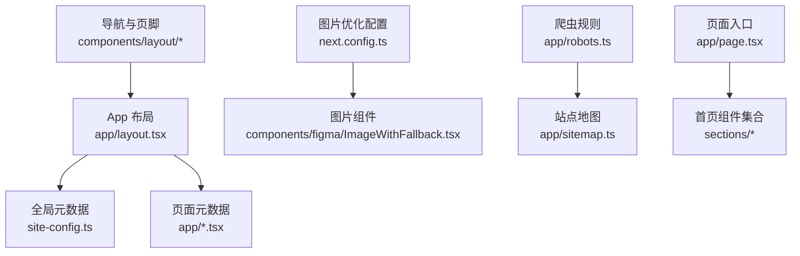
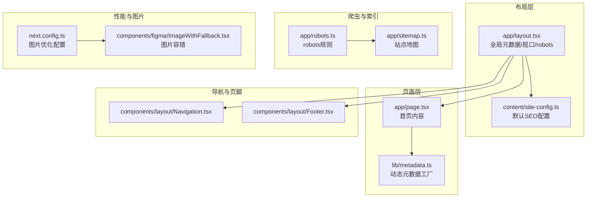
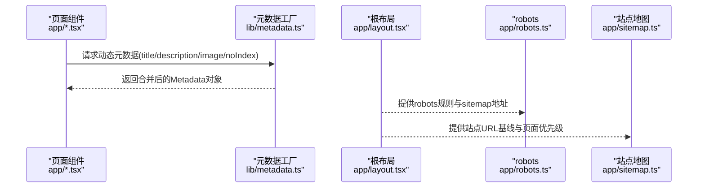
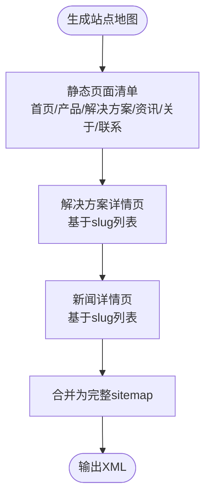
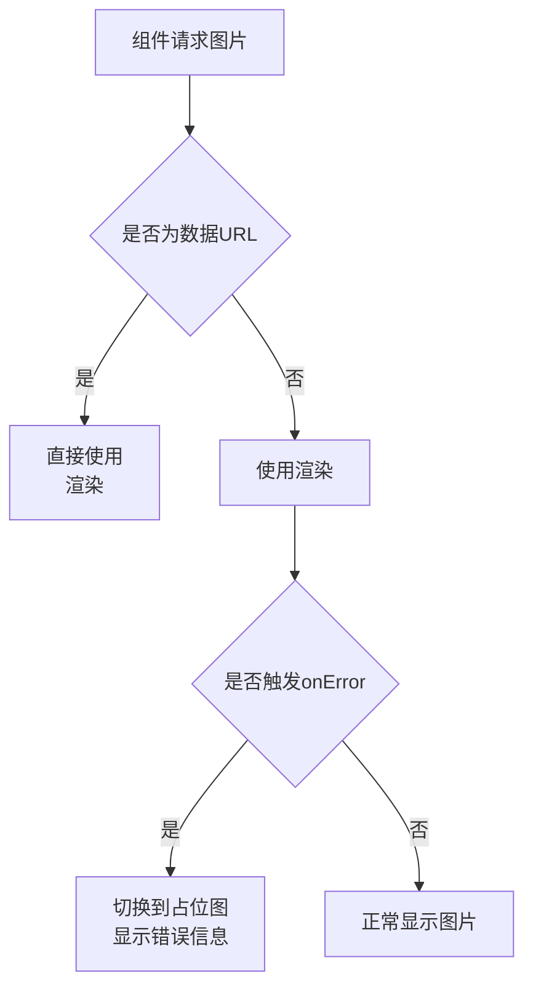
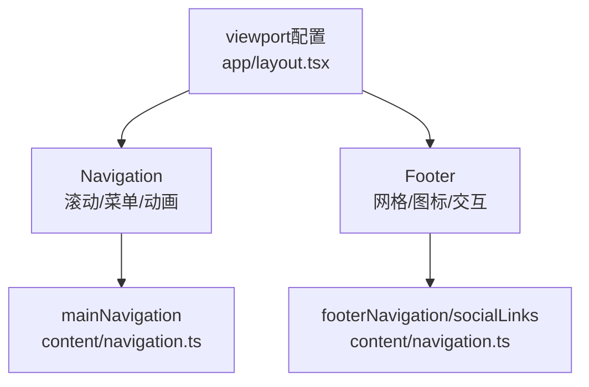
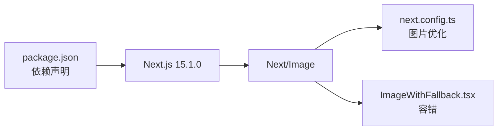

# SEO和性能优化

<cite>
**本文引用的文件**
- [frontend/lib/metadata.ts](file://frontend/lib/metadata.ts)
- [frontend/app/layout.tsx](file://frontend/app/layout.tsx)
- [frontend/next.config.ts](file://frontend/next.config.ts)
- [frontend/app/robots.ts](file://frontend/app/robots.ts)
- [frontend/app/sitemap.ts](file://frontend/app/sitemap.ts)
- [frontend/content/site-config.ts](file://frontend/content/site-config.ts)
- [frontend/components/figma/ImageWithFallback.tsx](file://frontend/components/figma/ImageWithFallback.tsx)
- [frontend/package.json](file://frontend/package.json)
- [frontend/components/layout/Navigation.tsx](file://frontend/components/layout/Navigation.tsx)
- [frontend/components/layout/Footer.tsx](file://frontend/components/layout/Footer.tsx)
- [frontend/app/page.tsx](file://frontend/app/page.tsx)
- [frontend/components/sections/Hero.tsx](file://frontend/components/sections/Hero.tsx)
- [frontend/components/sections/Products.tsx](file://frontend/components/sections/Products.tsx)
- [frontend/components/sections/News.tsx](file://frontend/components/sections/News.tsx)
- [frontend/content/navigation.ts](file://frontend/content/navigation.ts)
</cite>

## 目录
1. [引言](#引言)
2. [项目结构](#项目结构)
3. [核心组件](#核心组件)
4. [架构总览](#架构总览)
5. [详细组件分析](#详细组件分析)
6. [依赖关系分析](#依赖关系分析)
7. [性能考量](#性能考量)
8. [故障排查指南](#故障排查指南)
9. [结论](#结论)
10. [附录](#附录)

## 引言
本文件面向中创智控官网（前端）的SEO与性能优化，系统梳理了元数据管理、Open Graph与Twitter Cards配置、结构化数据标记、静态生成与预渲染对SEO的积极影响；同时覆盖图片优化、代码分割、缓存与CDN集成、响应式设计与移动端交互优化，并提供性能监控指标、加载速度优化与用户体验提升的方法建议。文档以实际源码为依据，辅以可视化图示，帮助非技术读者也能理解与落地。

## 项目结构
前端采用Next.js App Router组织页面与布局，关键SEO与性能相关文件分布如下：
- 元数据与站点配置：layout.tsx、metadata.ts、site-config.ts
- 爬虫与索引：robots.ts、sitemap.ts
- 图片与性能：next.config.ts、ImageWithFallback.tsx
- 页面与组件：page.tsx、Navigation.tsx、Footer.tsx、Hero.tsx、Products.tsx、News.tsx
- 依赖与工具链：package.json

图表来源
- [frontend/app/layout.tsx](file://frontend/app/layout.tsx#L1-L83)
- [frontend/content/site-config.ts](file://frontend/content/site-config.ts#L1-L47)
- [frontend/next.config.ts](file://frontend/next.config.ts#L1-L39)
- [frontend/components/figma/ImageWithFallback.tsx](file://frontend/components/figma/ImageWithFallback.tsx#L1-L85)
- [frontend/app/robots.ts](file://frontend/app/robots.ts#L1-L14)
- [frontend/app/sitemap.ts](file://frontend/app/sitemap.ts#L1-L67)
- [frontend/app/page.tsx](file://frontend/app/page.tsx#L1-L72)
- [frontend/components/layout/Navigation.tsx](file://frontend/components/layout/Navigation.tsx#L1-L126)
- [frontend/components/layout/Footer.tsx](file://frontend/components/layout/Footer.tsx#L1-L208)

章节来源
- [frontend/app/layout.tsx](file://frontend/app/layout.tsx#L1-L83)
- [frontend/next.config.ts](file://frontend/next.config.ts#L1-L39)
- [frontend/app/robots.ts](file://frontend/app/robots.ts#L1-L14)
- [frontend/app/sitemap.ts](file://frontend/app/sitemap.ts#L1-L67)
- [frontend/content/site-config.ts](file://frontend/content/site-config.ts#L1-L47)
- [frontend/package.json](file://frontend/package.json#L1-L88)

## 核心组件
- 全局元数据与视口配置：在根布局中集中定义标题模板、默认描述、关键词、Open Graph与Twitter卡片、robots策略与主题色，确保全站一致性。
- 动态元数据工厂：通过元数据工厂函数按页面需求组合标题、描述、OG图片与noIndex控制，避免重复配置。
- 爬虫与索引：robots规则限制敏感目录，明确sitemap地址；sitemap按静态页、解决方案详情页、新闻详情页生成，含lastModified、changeFrequency、priority。
- 图片优化：next.config.ts启用远程域名白名单、现代图片格式（AVIF/WebP）、响应式尺寸集，配合ImageWithFallback增强容错。
- 页面与组件：首页聚合多个业务模块，导航与页脚提供清晰的结构化信息与社交链接，利于SEO与可访问性。

章节来源
- [frontend/lib/metadata.ts](file://frontend/lib/metadata.ts#L1-L60)
- [frontend/app/layout.tsx](file://frontend/app/layout.tsx#L1-L83)
- [frontend/app/robots.ts](file://frontend/app/robots.ts#L1-L14)
- [frontend/app/sitemap.ts](file://frontend/app/sitemap.ts#L1-L67)
- [frontend/next.config.ts](file://frontend/next.config.ts#L1-L39)
- [frontend/components/figma/ImageWithFallback.tsx](file://frontend/components/figma/ImageWithFallback.tsx#L1-L85)
- [frontend/app/page.tsx](file://frontend/app/page.tsx#L1-L72)

## 架构总览
下图展示SEO与性能相关的关键组件如何协作：布局层负责全局元数据与视口，页面层注入动态元数据，图片层提供优化与降级，爬虫层通过robots与sitemap指引搜索引擎。

图表来源
- [frontend/app/layout.tsx](file://frontend/app/layout.tsx#L1-L83)
- [frontend/content/site-config.ts](file://frontend/content/site-config.ts#L1-L47)
- [frontend/app/page.tsx](file://frontend/app/page.tsx#L1-L72)
- [frontend/lib/metadata.ts](file://frontend/lib/metadata.ts#L1-L60)
- [frontend/app/robots.ts](file://frontend/app/robots.ts#L1-L14)
- [frontend/app/sitemap.ts](file://frontend/app/sitemap.ts#L1-L67)
- [frontend/next.config.ts](file://frontend/next.config.ts#L1-L39)
- [frontend/components/figma/ImageWithFallback.tsx](file://frontend/components/figma/ImageWithFallback.tsx#L1-L85)
- [frontend/components/layout/Navigation.tsx](file://frontend/components/layout/Navigation.tsx#L1-L126)
- [frontend/components/layout/Footer.tsx](file://frontend/components/layout/Footer.tsx#L1-L208)

## 详细组件分析

### 元数据与社交媒体配置
- 全局元数据：在根布局中定义标题模板、默认描述、关键词、作者、创建者、metadataBase、Open Graph与Twitter卡片，统一品牌调性。
- 动态元数据：通过元数据工厂函数接收页面级title、description、image与noIndex参数，自动拼接站点名称与默认OG图片，保证每页元数据唯一性与可读性。
- robots策略：允许搜索引擎抓取公开路径，限制/api、/admin、/_next等内部资源，并指向sitemap地址，提升索引效率。

图表来源
- [frontend/lib/metadata.ts](file://frontend/lib/metadata.ts#L10-L57)
- [frontend/app/layout.tsx](file://frontend/app/layout.tsx#L9-L52)
- [frontend/app/robots.ts](file://frontend/app/robots.ts#L4-L13)
- [frontend/app/sitemap.ts](file://frontend/app/sitemap.ts#L8-L66)

章节来源
- [frontend/app/layout.tsx](file://frontend/app/layout.tsx#L9-L52)
- [frontend/lib/metadata.ts](file://frontend/lib/metadata.ts#L10-L57)
- [frontend/app/robots.ts](file://frontend/app/robots.ts#L4-L13)
- [frontend/app/sitemap.ts](file://frontend/app/sitemap.ts#L8-L66)

### 爬虫与索引策略
- robots规则：允许所有用户代理访问根路径，显式禁止/api、/admin、/_next等目录，最后指向sitemap地址，减少无效抓取。
- 站点地图：静态页（首页、产品、解决方案、资讯、关于、联系）+ 动态详情页（解决方案与新闻），统一设置lastModified、changeFrequency与priority，便于搜索引擎分配抓取频次与权重。

图表来源
- [frontend/app/sitemap.ts](file://frontend/app/sitemap.ts#L8-L66)

章节来源
- [frontend/app/robots.ts](file://frontend/app/robots.ts#L4-L13)
- [frontend/app/sitemap.ts](file://frontend/app/sitemap.ts#L8-L66)

### 图片优化与容错
- next.config.ts配置：
  - 远程域名白名单：限制图片来源，提升安全性与可控性。
  - 现代图片格式：开启AVIF与WebP，降低体积、提升加载速度。
  - 响应式尺寸：deviceSizes与imageSizes结合客户端与服务端尺寸策略。
- ImageWithFallback组件：
  - onError回退：图片加载失败时显示占位图与错误提示，避免空白块与布局抖动。
  - 数据URL直出：对data:与blob:直接使用img标签，避免不必要的Next/Image开销。
  - priority支持：在首屏关键图片上启用priority，提升渲染优先级。

图表来源
- [frontend/components/figma/ImageWithFallback.tsx](file://frontend/components/figma/ImageWithFallback.tsx#L31-L84)
- [frontend/next.config.ts](file://frontend/next.config.ts#L5-L33)

章节来源
- [frontend/next.config.ts](file://frontend/next.config.ts#L5-L33)
- [frontend/components/figma/ImageWithFallback.tsx](file://frontend/components/figma/ImageWithFallback.tsx#L31-L84)

### 响应式设计与移动端交互
- 视口配置：在根布局中设置themeColor、device-width与初始缩放，适配深浅色主题与多设备。
- 导航栏：滚动变化、移动端菜单展开动画、悬停与点击反馈，提升可用性与可发现性。
- 页脚：网格布局、图标交互、法律与快速导航，增强信息密度与可达性。

图表来源
- [frontend/app/layout.tsx](file://frontend/app/layout.tsx#L54-L61)
- [frontend/components/layout/Navigation.tsx](file://frontend/components/layout/Navigation.tsx#L9-L126)
- [frontend/components/layout/Footer.tsx](file://frontend/components/layout/Footer.tsx#L10-L208)
- [frontend/content/navigation.ts](file://frontend/content/navigation.ts#L3-L37)

章节来源
- [frontend/app/layout.tsx](file://frontend/app/layout.tsx#L54-L61)
- [frontend/components/layout/Navigation.tsx](file://frontend/components/layout/Navigation.tsx#L9-L126)
- [frontend/components/layout/Footer.tsx](file://frontend/components/layout/Footer.tsx#L10-L208)
- [frontend/content/navigation.ts](file://frontend/content/navigation.ts#L3-L37)

### 页面与组件对SEO的影响
- 首页聚合：Hero、业务场景、产品矩阵、技术实力、案例、服务、资讯等模块，形成丰富的内容层次，利于搜索引擎理解站点主题与价值。
- 组件内联：导航与页脚提供结构化链接，有助于爬虫抓取与用户导航。

章节来源
- [frontend/app/page.tsx](file://frontend/app/page.tsx#L40-L72)
- [frontend/components/sections/Hero.tsx](file://frontend/components/sections/Hero.tsx#L8-L138)
- [frontend/components/sections/Products.tsx](file://frontend/components/sections/Products.tsx#L21-L223)
- [frontend/components/sections/News.tsx](file://frontend/components/sections/News.tsx#L16-L299)

## 依赖关系分析
- Next.js版本与工具链：package.json声明Next 15.1.0与Tailwind、Emotion、Radix UI等生态，为SEO与性能优化提供基础能力。
- 图片生态：Next/Image与自定义ImageWithFallback互补，前者负责现代格式与响应式，后者负责容错与体验。

图表来源
- [frontend/package.json](file://frontend/package.json#L12-L87)
- [frontend/next.config.ts](file://frontend/next.config.ts#L1-L39)
- [frontend/components/figma/ImageWithFallback.tsx](file://frontend/components/figma/ImageWithFallback.tsx#L1-L85)

章节来源
- [frontend/package.json](file://frontend/package.json#L12-L87)

## 性能考量
- 图片优化
  - 现代格式：开启AVIF与WebP，显著降低带宽占用。
  - 响应式尺寸：根据设备像素比与屏幕宽度选择合适尺寸，减少过度加载。
  - 安全来源：仅允许受信域名，避免跨域风险与CDN滥用。
- 代码分割与懒加载
  - App Router按路由自动分割，结合Suspense边界与错误边界，提升首屏渲染与稳定性。
  - 首屏关键图片使用priority，确保视觉完整性。
- 缓存与CDN
  - 静态资源由Next.js与CDN共同缓存，sitemap与robots作为静态文件可被浏览器与CDN缓存。
  - 建议在生产环境启用HTTP/2与压缩，结合CDN边缘缓存策略。
- 渲染策略
  - 首页采用服务端渲染（SSR）与静态生成（如适用）结合，提升SEO与首屏性能。
  - 对于动态内容（如资讯、产品），建议使用增量静态再生（ISR）或客户端数据拉取，平衡时效性与性能。
- 用户体验
  - 导航与页脚的动画与交互反馈，提升可感知性能与可用性。
  - 图片加载失败的占位图与错误提示，避免空白与布局抖动。

[本节为通用性能指导，不直接分析具体文件]

## 故障排查指南
- 元数据异常
  - 症状：页面标题或描述不符合预期。
  - 排查：确认页面是否正确调用元数据工厂；检查根布局中的默认值与模板是否一致。
- Open Graph与Twitter卡片不生效
  - 症状：社交媒体分享无图或标题不正确。
  - 排查：核对image参数是否传入；确认OG图片尺寸与alt文本；检查robots是否误禁用图片资源。
- 爬虫抓取问题
  - 症状：sitemap未被收录或抓取受限。
  - 排查：确认robots规则未误封sitemap；检查sitemap中URL是否与实际一致；验证sitemap返回状态。
- 图片加载失败
  - 症状：图片空白或布局抖动。
  - 排查：检查remotePatterns是否包含目标域名；确认ImageWithFallback的onError回调是否触发；验证图片URL有效性。
- 移动端交互异常
  - 症状：导航菜单无法展开或滚动样式异常。
  - 排查：确认移动端断点与CSS类名；检查滚动监听事件绑定；验证动画库版本兼容性。

章节来源
- [frontend/lib/metadata.ts](file://frontend/lib/metadata.ts#L10-L57)
- [frontend/app/layout.tsx](file://frontend/app/layout.tsx#L9-L52)
- [frontend/app/robots.ts](file://frontend/app/robots.ts#L4-L13)
- [frontend/app/sitemap.ts](file://frontend/app/sitemap.ts#L8-L66)
- [frontend/next.config.ts](file://frontend/next.config.ts#L5-L33)
- [frontend/components/figma/ImageWithFallback.tsx](file://frontend/components/figma/ImageWithFallback.tsx#L31-L84)
- [frontend/components/layout/Navigation.tsx](file://frontend/components/layout/Navigation.tsx#L13-L19)

## 结论
本项目在SEO方面建立了完善的元数据体系与爬虫指引，在性能方面通过现代图片格式、响应式尺寸与图片容错策略提升了加载质量与稳定性。建议在生产环境中结合CDN与缓存策略进一步优化首屏时间，并持续监控robots与sitemap的抓取状态，以获得更佳的搜索引擎表现与用户体验。

[本节为总结性内容，不直接分析具体文件]

## 附录
- Google Analytics集成：当前仓库未包含Analytics集成代码，可在根布局或页面中引入官方脚本或第三方SDK，并确保合规处理Cookie与隐私设置。
- 搜索爬虫优化：保持robots规则简洁有效，sitemap定期更新，避免重复内容与深度链接陷阱。
- 社交媒体分享：确保OG与Twitter卡片字段齐全且图片符合平台规范，定期测试分享预览效果。

[本节为通用建议，不直接分析具体文件]