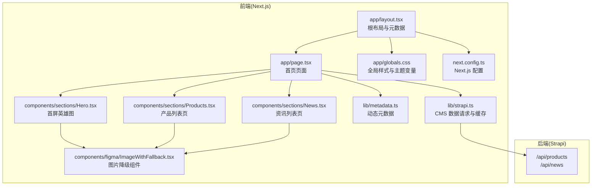
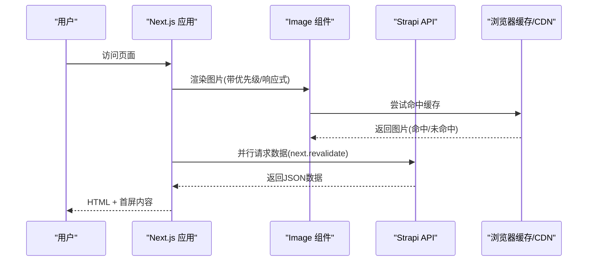
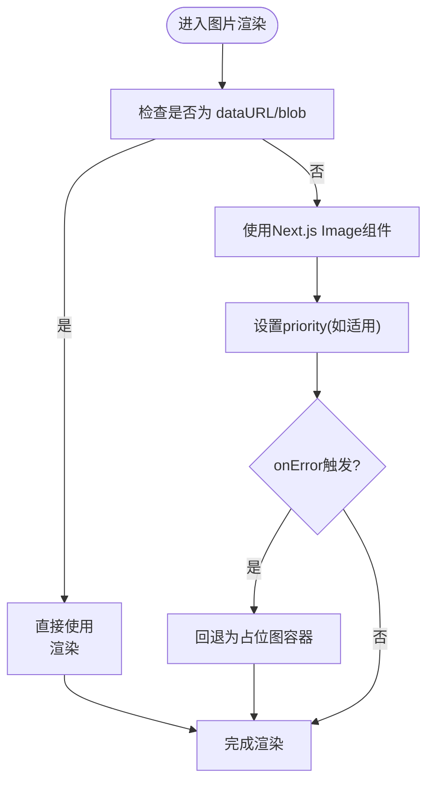
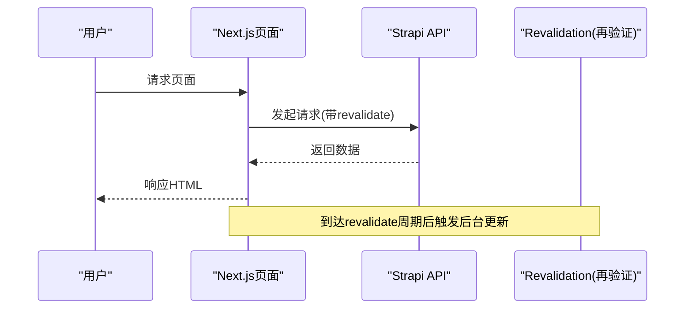
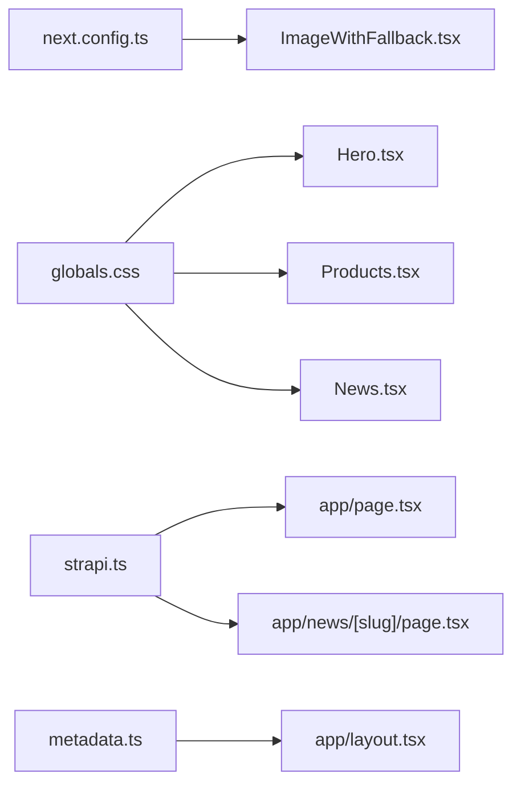

# 性能优化策略

<cite>
**本文引用的文件**
- [frontend/next.config.ts](file://frontend/next.config.ts)
- [frontend/package.json](file://frontend/package.json)
- [frontend/app/layout.tsx](file://frontend/app/layout.tsx)
- [frontend/components/figma/ImageWithFallback.tsx](file://frontend/components/figma/ImageWithFallback.tsx)
- [frontend/lib/metadata.ts](file://frontend/lib/metadata.ts)
- [frontend/app/globals.css](file://frontend/app/globals.css)
- [frontend/components/providers/Providers.tsx](file://frontend/components/providers/Providers.tsx)
- [frontend/content/site-config.ts](file://frontend/content/site-config.ts)
- [frontend/lib/strapi.ts](file://frontend/lib/strapi.ts)
- [frontend/app/page.tsx](file://frontend/app/page.tsx)
- [frontend/components/sections/Hero.tsx](file://frontend/components/sections/Hero.tsx)
- [frontend/components/sections/Products.tsx](file://frontend/components/sections/Products.tsx)
- [frontend/components/sections/News.tsx](file://frontend/components/sections/News.tsx)
- [frontend/app/news/[slug]/page.tsx](file://frontend/app/news/[slug]/page.tsx)
</cite>

## 目录
1. [引言](#引言)
2. [项目结构](#项目结构)
3. [核心组件](#核心组件)
4. [架构总览](#架构总览)
5. [详细组件分析](#详细组件分析)
6. [依赖关系分析](#依赖关系分析)
7. [性能考量](#性能考量)
8. [故障排查指南](#故障排查指南)
9. [结论](#结论)
10. [附录](#附录)

## 引言
本文件面向中创智控官网的性能优化实践，系统梳理前端在 Next.js 体系下的优化策略与落地实现，覆盖静态生成、代码分割、懒加载与预取、图片优化（含响应式与格式）、缓存策略（浏览器/CDN/API）、网络优化（HTTP/2、压缩、连接复用）、内存与渲染优化（React 组件与虚拟 DOM）、性能监控与评估方法，并提供可操作的测试与优化流程。

## 项目结构
前端采用 Next.js App Router 架构，按功能模块组织页面与组件，配合全局样式与配置文件实现统一的主题与 SEO 元数据管理。后端为 Strapi CMS，通过 API 提供内容数据，前端通过独立的请求封装层进行数据拉取与缓存控制。

图表来源
- [frontend/app/layout.tsx](file://frontend/app/layout.tsx#L1-L83)
- [frontend/app/page.tsx](file://frontend/app/page.tsx#L1-L72)
- [frontend/components/sections/Hero.tsx](file://frontend/components/sections/Hero.tsx#L1-L138)
- [frontend/components/sections/Products.tsx](file://frontend/components/sections/Products.tsx#L1-L223)
- [frontend/components/sections/News.tsx](file://frontend/components/sections/News.tsx#L1-L299)
- [frontend/components/figma/ImageWithFallback.tsx](file://frontend/components/figma/ImageWithFallback.tsx#L1-L85)
- [frontend/lib/metadata.ts](file://frontend/lib/metadata.ts#L1-L60)
- [frontend/app/globals.css](file://frontend/app/globals.css#L1-L203)
- [frontend/next.config.ts](file://frontend/next.config.ts#L1-L39)
- [frontend/lib/strapi.ts](file://frontend/lib/strapi.ts#L1-L155)

章节来源
- [frontend/next.config.ts](file://frontend/next.config.ts#L1-L39)
- [frontend/package.json](file://frontend/package.json#L1-L88)
- [frontend/app/layout.tsx](file://frontend/app/layout.tsx#L1-L83)
- [frontend/app/globals.css](file://frontend/app/globals.css#L1-L203)

## 核心组件
- Next.js 配置与图片优化：通过 next.config.ts 的 images 字段启用远程域名白名单、现代图片格式（AVIF/WebP）、响应式尺寸集合，以及严格模式。
- 图片组件与降级策略：ImageWithFallback 在原生 Next.js Image 失败时回退为 img 标签并显示占位图，避免空白或加载失败影响体验。
- 全局样式与主题：globals.css 定义品牌色、暗色主题变量与过渡动画，减少重复计算与重绘。
- 元数据与 SEO：layout.tsx 与 metadata.ts 统一生成 Open Graph、Twitter 卡片与 robots 规则，提升首屏 SEO 与分享质量。
- 数据请求与缓存：strapi.ts 使用 fetch 的 next.revalidate 控制 API 缓存刷新周期，结合 Promise.all 并行拉取首屏关键数据。

章节来源
- [frontend/next.config.ts](file://frontend/next.config.ts#L3-L36)
- [frontend/components/figma/ImageWithFallback.tsx](file://frontend/components/figma/ImageWithFallback.tsx#L1-L85)
- [frontend/app/globals.css](file://frontend/app/globals.css#L1-L203)
- [frontend/app/layout.tsx](file://frontend/app/layout.tsx#L9-L52)
- [frontend/lib/metadata.ts](file://frontend/lib/metadata.ts#L10-L57)
- [frontend/lib/strapi.ts](file://frontend/lib/strapi.ts#L100-L111)

## 架构总览
下图展示从用户访问到内容渲染的关键路径，包括静态生成、图片优化、数据拉取与缓存策略：

图表来源
- [frontend/components/sections/Hero.tsx](file://frontend/components/sections/Hero.tsx#L27-L33)
- [frontend/components/sections/Products.tsx](file://frontend/components/sections/Products.tsx#L152-L159)
- [frontend/components/sections/News.tsx](file://frontend/components/sections/News.tsx#L256-L261)
- [frontend/lib/strapi.ts](file://frontend/lib/strapi.ts#L100-L111)
- [frontend/next.config.ts](file://frontend/next.config.ts#L5-L33)

## 详细组件分析

### 图片优化与响应式适配
- 配置要点
  - 远程域名白名单：限制允许的外部图片源，确保安全与可控。
  - 现代图片格式：开启 AVIF/WebP，显著降低体积。
  - 响应式尺寸：deviceSizes 与 imageSizes 提供多密度与多尺寸裁剪，配合 sizes 属性实现正确 srcset。
- 组件实践
  - ImageWithFallback：对 Next.js Image 的 onError 回调进行处理，在原图失败时回退为 img 标签并显示占位图，保证首屏稳定性。
  - 首屏图片优先级：Hero 组件中对背景图设置 priority，确保首屏关键图片优先加载。
- 性能收益
  - 减少不必要的图片传输与渲染阻塞；在弱网环境下仍能保持可读性与可用性。

图表来源
- [frontend/components/figma/ImageWithFallback.tsx](file://frontend/components/figma/ImageWithFallback.tsx#L32-L83)
- [frontend/next.config.ts](file://frontend/next.config.ts#L5-L33)
- [frontend/components/sections/Hero.tsx](file://frontend/components/sections/Hero.tsx#L27-L33)

章节来源
- [frontend/next.config.ts](file://frontend/next.config.ts#L5-L33)
- [frontend/components/figma/ImageWithFallback.tsx](file://frontend/components/figma/ImageWithFallback.tsx#L1-L85)
- [frontend/components/sections/Hero.tsx](file://frontend/components/sections/Hero.tsx#L27-L33)

### 缓存策略实现
- 浏览器缓存
  - 图片与静态资源由 Next.js Image 自动根据尺寸与格式生成合适版本，并通过 CDN 分发，浏览器可利用强缓存与 ETag/Cache-Control。
- CDN 缓存
  - 通过远程域名白名单与现代图片格式，配合 CDN 对不同尺寸与格式的资源进行缓存与分发，减少回源压力。
- API 数据缓存
  - strapi.ts 使用 fetch 的 next.revalidate 参数控制再验证间隔，默认值用于平衡新鲜度与性能；首页通过 Promise.all 并行拉取关键数据，缩短首屏等待时间。
- 动态路由与静态生成
  - 资讯详情页通过 generateStaticParams 预渲染静态页面，结合 generateMetadata 动态生成 SEO 元数据，兼顾 SEO 与性能。

图表来源
- [frontend/lib/strapi.ts](file://frontend/lib/strapi.ts#L100-L111)
- [frontend/app/news/[slug]/page.tsx](file://frontend/app/news/[slug]/page.tsx#L14-L20)

章节来源
- [frontend/lib/strapi.ts](file://frontend/lib/strapi.ts#L100-L111)
- [frontend/app/news/[slug]/page.tsx](file://frontend/app/news/[slug]/page.tsx#L14-L20)

### 网络优化技术
- HTTP/2 与连接复用
  - 通过 CDN 与现代 Web 服务器启用 HTTP/2，支持多路复用与头部压缩，降低连接建立与队头阻塞成本。
- 资源压缩
  - Next.js 构建默认启用压缩；结合现代图片格式（WebP/AVIF）与合理尺寸裁剪，进一步降低传输体积。
- 预取与预加载
  - 首屏关键图片设置 priority；页面内可结合 next/link 的 prefetch 行为进行导航预取，减少跳转延迟。

章节来源
- [frontend/next.config.ts](file://frontend/next.config.ts#L28-L33)
- [frontend/components/sections/Hero.tsx](file://frontend/components/sections/Hero.tsx#L32-L33)
- [frontend/package.json](file://frontend/package.json#L7-L10)

### 内存管理与渲染优化
- React 组件优化
  - 使用 memo 化与 useMemo/useCallback 降低不必要重渲染（如产品与新闻列表的过滤逻辑已通过 useMemo 实现）。
  - 使用 motion/react 的布局动画时注意控制子树规模，避免大列表频繁触发动画导致卡顿。
- 虚拟 DOM 优化
  - 全局样式集中定义，减少重复类名与样式计算；使用 Tailwind 主题变量减少内联样式的开销。
  - 首屏关键区域（Hero）尽量减少复杂嵌套，避免深层节点变更引发大面积重排。

章节来源
- [frontend/components/sections/Products.tsx](file://frontend/components/sections/Products.tsx#L25-L35)
- [frontend/components/sections/News.tsx](file://frontend/components/sections/News.tsx#L22-L34)
- [frontend/app/globals.css](file://frontend/app/globals.css#L1-L203)

### 性能监控与用户体验优化
- 指标建议
  - 首包大小、TTFB、FCP/LCP、INP/CLS、TTI、TTFB、资源瀑布图。
- 加载时间分析
  - 使用浏览器开发者工具 Network 面板观察资源加载顺序与耗时；结合 Lighthouse/Chrome UX Report 评估真实用户表现。
- 用户体验优化
  - 首屏骨架屏/占位图、渐进式图片加载、交互反馈（按钮悬停/点击状态）、滚动进度指示等。

章节来源
- [frontend/app/layout.tsx](file://frontend/app/layout.tsx#L54-L61)
- [frontend/components/layout/ScrollProgress.tsx](file://frontend/components/layout/ScrollProgress.tsx)

## 依赖关系分析
- 组件耦合
  - 页面组件与业务组件解耦，通过 props 传递数据，便于测试与维护。
  - 图片组件被多个业务组件复用，统一错误处理与加载策略。
- 外部依赖
  - Next.js 图像优化、Tailwind 主题系统、motion 动画库、Strapi 数据接口。
- 潜在风险
  - 图片源过多可能增加缓存失效与回源概率；需定期清理未使用资源。

图表来源
- [frontend/next.config.ts](file://frontend/next.config.ts#L1-L39)
- [frontend/components/figma/ImageWithFallback.tsx](file://frontend/components/figma/ImageWithFallback.tsx#L1-L85)
- [frontend/app/globals.css](file://frontend/app/globals.css#L1-L203)
- [frontend/components/sections/Hero.tsx](file://frontend/components/sections/Hero.tsx#L1-L138)
- [frontend/components/sections/Products.tsx](file://frontend/components/sections/Products.tsx#L1-L223)
- [frontend/components/sections/News.tsx](file://frontend/components/sections/News.tsx#L1-L299)
- [frontend/lib/strapi.ts](file://frontend/lib/strapi.ts#L1-L155)
- [frontend/app/page.tsx](file://frontend/app/page.tsx#L1-L72)
- [frontend/app/news/[slug]/page.tsx](file://frontend/app/news/[slug]/page.tsx#L1-L71)
- [frontend/lib/metadata.ts](file://frontend/lib/metadata.ts#L1-L60)
- [frontend/app/layout.tsx](file://frontend/app/layout.tsx#L1-L83)

## 性能考量
- 静态生成与增量更新
  - 首页与资讯详情页采用静态生成与动态元数据生成，结合 API 缓存再验证，兼顾 SEO 与性能。
- 代码分割与懒加载
  - App Router 自动按路由拆分代码；图片组件与动画库按需引入，减少初始包体。
- 图片优化
  - 现代格式与响应式尺寸裁剪显著降低带宽与渲染成本；错误回退保障体验。
- 缓存与网络
  - CDN 缓存与 API 再验证形成多层缓存；HTTP/2 与压缩提升传输效率。
- 内存与渲染
  - 主题变量与样式集中管理，减少样式抖动；动画与过滤逻辑使用 memo 化，避免重复计算。

章节来源
- [frontend/app/page.tsx](file://frontend/app/page.tsx#L40-L44)
- [frontend/app/news/[slug]/page.tsx](file://frontend/app/news/[slug]/page.tsx#L14-L20)
- [frontend/lib/strapi.ts](file://frontend/lib/strapi.ts#L100-L111)
- [frontend/next.config.ts](file://frontend/next.config.ts#L28-L33)

## 故障排查指南
- 图片加载失败
  - 确认 remotePatterns 是否包含对应域名；检查图片 URL 是否为 dataURL 或 blob；查看 ImageWithFallback 的错误回退逻辑是否生效。
- 首屏渲染慢
  - 检查是否存在大量同步阻塞任务；确认关键图片是否设置 priority；核对 Promise.all 并行拉取的数据量。
- SEO 元数据异常
  - 检查 generateMetadata 与 metadata.ts 的返回值；确认 siteConfig 的 URL 与 OG 图片路径有效。
- API 缓存未生效
  - 确认 fetch 的 next.revalidate 参数是否正确传入；检查 CDN 是否缓存了旧版本响应。

章节来源
- [frontend/components/figma/ImageWithFallback.tsx](file://frontend/components/figma/ImageWithFallback.tsx#L32-L83)
- [frontend/lib/strapi.ts](file://frontend/lib/strapi.ts#L100-L111)
- [frontend/lib/metadata.ts](file://frontend/lib/metadata.ts#L10-L57)
- [frontend/content/site-config.ts](file://frontend/content/site-config.ts#L22-L29)

## 结论
中创智控官网已在 Next.js 体系下实现了较为完善的性能优化闭环：静态生成与动态元数据结合、图片优化与错误回退、多层缓存与网络优化、组件与渲染层面的内存管理。后续可在监控指标细化、自动化性能回归、资源治理与 CDN 策略优化方面持续迭代，以获得更稳定、更快速的用户体验。

## 附录
- 性能测试工具
  - Lighthouse、WebPageTest、Chrome DevTools Performance/Network、Real User Monitoring 工具。
- 瓶颈识别清单
  - 关注首包大小、关键资源阻塞、图片体积与数量、JS/CSS 体积、重排重绘热点区域。
- 优化效果评估
  - 建立基线指标（LCP、CLS、INP），设定目标阈值，定期对比版本间变化，追踪真实用户行为。