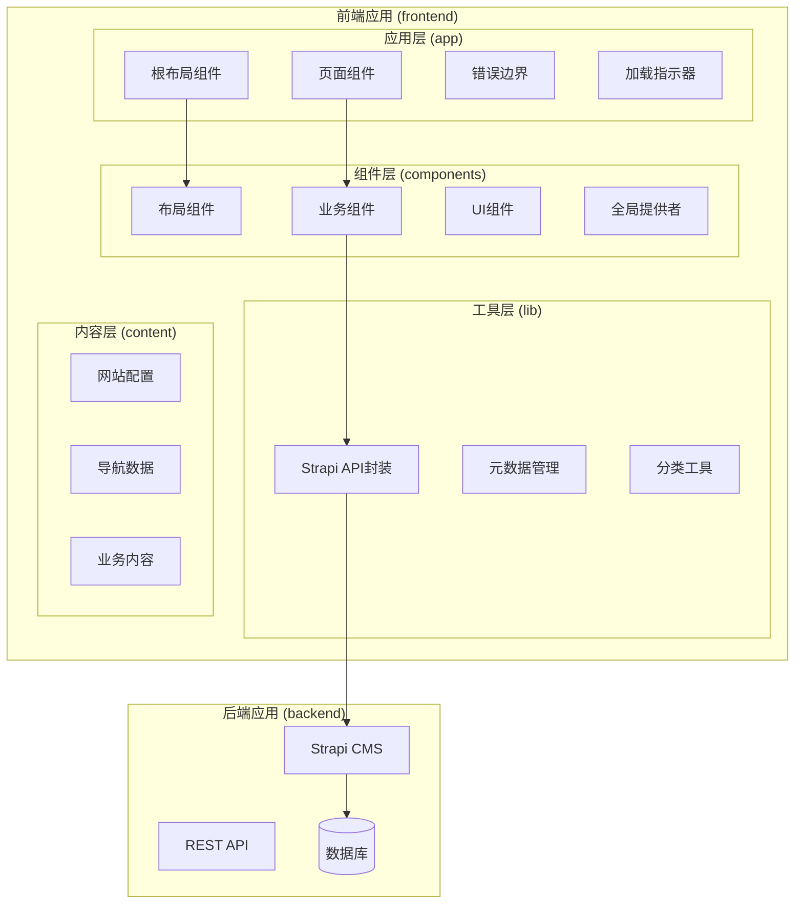
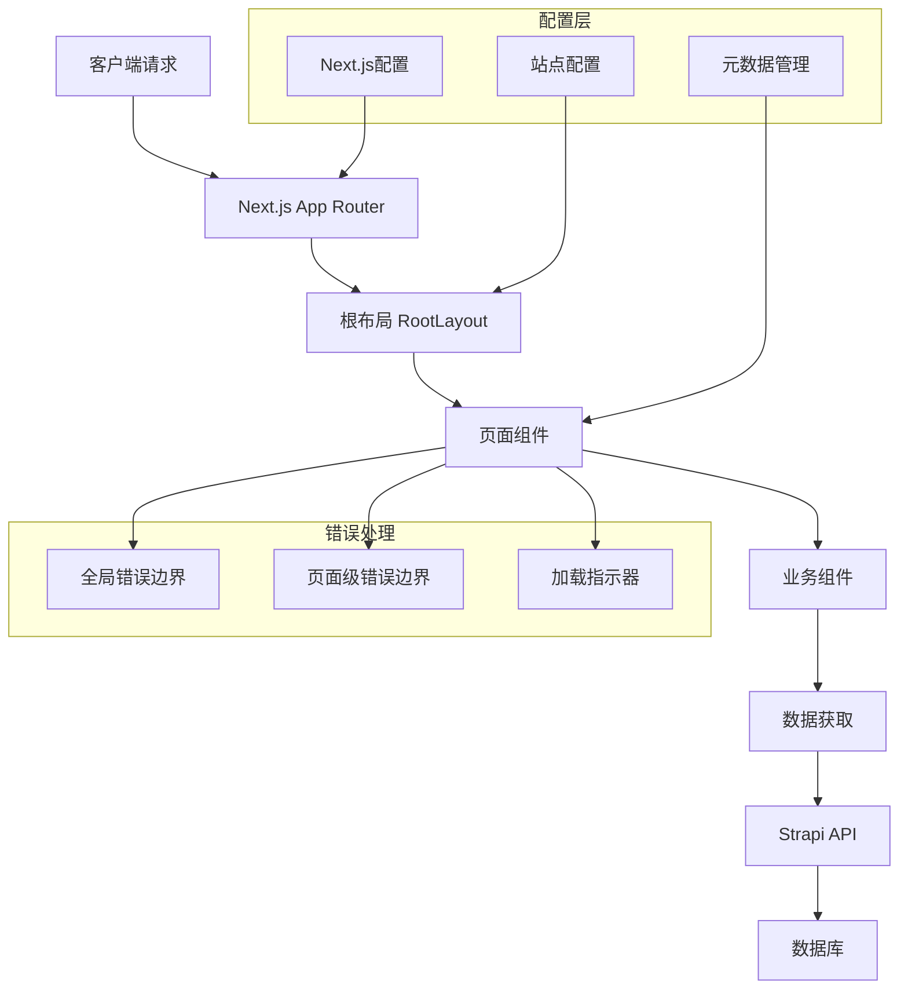
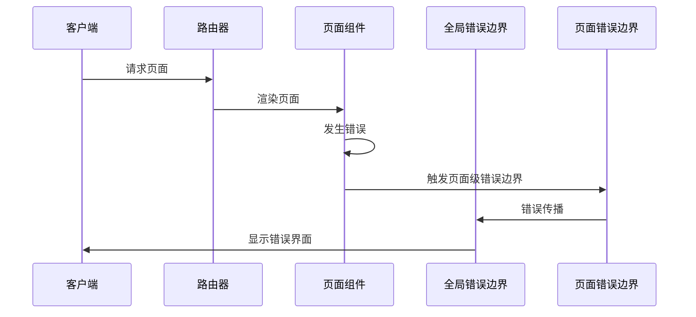
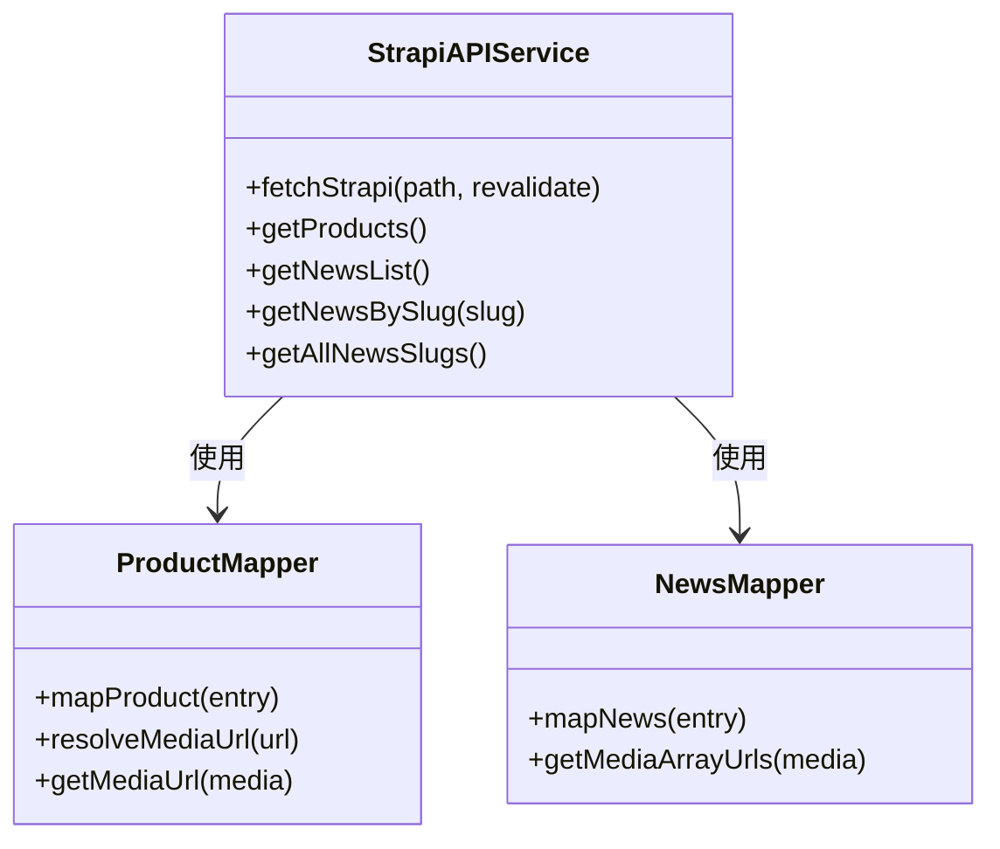
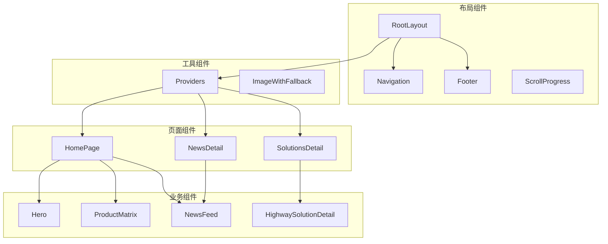
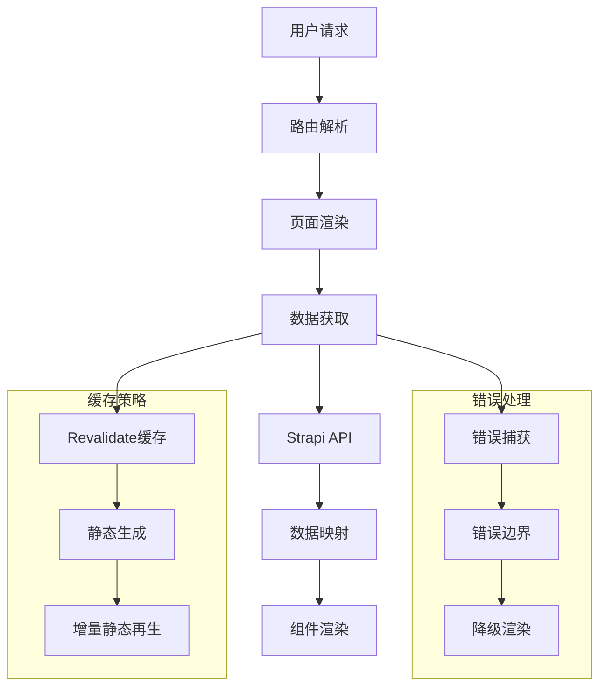
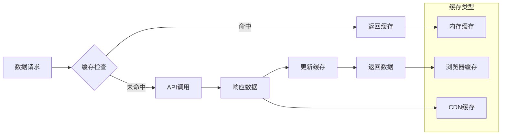

# Next.js应用结构

<cite>
**本文档引用的文件**
- [frontend/app/layout.tsx](file://frontend/app/layout.tsx)
- [frontend/next.config.ts](file://frontend/next.config.ts)
- [frontend/lib/metadata.ts](file://frontend/lib/metadata.ts)
- [frontend/app/page.tsx](file://frontend/app/page.tsx)
- [frontend/app/error.tsx](file://frontend/app/error.tsx)
- [frontend/app/loading.tsx](file://frontend/app/loading.tsx)
- [frontend/app/not-found.tsx](file://frontend/app/not-found.tsx)
- [frontend/components/providers/Providers.tsx](file://frontend/components/providers/Providers.tsx)
- [frontend/content/site-config.ts](file://frontend/content/site-config.ts)
- [frontend/lib/strapi.ts](file://frontend/lib/strapi.ts)
- [frontend/app/news/[slug]/page.tsx](file://frontend/app/news/[slug]/page.tsx)
- [frontend/app/news/[slug]/loading.tsx](file://frontend/app/news/[slug]/loading.tsx)
- [frontend/app/news/[slug]/error.tsx](file://frontend/app/news/[slug]/error.tsx)
- [frontend/app/solutions/[slug]/page.tsx](file://frontend/app/solutions/[slug]/page.tsx)
</cite>

## 目录
1. [简介](#简介)
2. [项目结构](#项目结构)
3. [核心组件](#核心组件)
4. [架构概览](#架构概览)
5. [详细组件分析](#详细组件分析)
6. [依赖关系分析](#依赖关系分析)
7. [性能考虑](#性能考虑)
8. [故障排除指南](#故障排除指南)
9. [结论](#结论)
10. [附录](#附录)

## 简介

这是一个基于Next.js App Router的现代化React应用，采用文件系统路由机制构建。该应用展示了完整的前端架构，包括根布局设计、动态路由处理、错误边界管理和性能优化策略。

应用采用模块化设计，将功能按领域进行组织：前端应用位于`frontend/`目录下，后端API位于`backend/`目录下。前端应用使用TypeScript编写，实现了类型安全的开发体验。

## 项目结构

该项目采用清晰的分层架构，主要分为以下几个层次：



**图表来源**
- [frontend/app/layout.tsx](file://frontend/app/layout.tsx#L1-L83)
- [frontend/lib/strapi.ts](file://frontend/lib/strapi.ts#L1-L155)

**章节来源**
- [frontend/app/layout.tsx](file://frontend/app/layout.tsx#L1-L83)
- [frontend/next.config.ts](file://frontend/next.config.ts#L1-L39)

## 核心组件

### 根布局组件 RootLayout

根布局组件是整个应用的基础框架，负责定义全局的HTML结构、元数据和主题配置。

#### 元数据配置
根布局使用Next.js的Metadata API定义了完整的SEO配置：
- **标题管理**：支持默认标题和模板标题
- **描述优化**：包含默认描述和关键词
- **Open Graph集成**：完整的社交分享配置
- **Twitter Card**：Twitter平台的优化配置
- **机器人指令**：搜索引擎爬取控制

#### 视口设置
应用配置了响应式视口设置，支持深色模式主题颜色：
- **设备适配**：自适应设备宽度
- **主题颜色**：根据用户偏好自动切换
- **初始缩放**：标准缩放比例

#### 主题管理
通过Providers组件实现全局主题管理：
- **上下文提供者**：可扩展的主题提供者
- **Hydration处理**：避免水合不匹配问题
- **样式隔离**：确保主题一致性

**章节来源**
- [frontend/app/layout.tsx](file://frontend/app/layout.tsx#L9-L61)
- [frontend/content/site-config.ts](file://frontend/content/site-config.ts#L21-L29)
- [frontend/components/providers/Providers.tsx](file://frontend/components/providers/Providers.tsx#L9-L16)

## 架构概览

应用采用分层架构设计，每层都有明确的职责分工：



**图表来源**
- [frontend/app/layout.tsx](file://frontend/app/layout.tsx#L63-L82)
- [frontend/app/error.tsx](file://frontend/app/error.tsx#L5-L15)
- [frontend/next.config.ts](file://frontend/next.config.ts#L3-L36)

## 详细组件分析

### 页面路由组织

#### 静态页面路由
应用包含多个静态页面，每个页面都有独立的路由配置：

```mermaid
flowchart LR
Home[首页 /] --> News[资讯 /news]
Home --> Products[产品 /products]
Home --> Solutions[解决方案 /solutions]
Home --> About[关于我们 /about]
Home --> Contact[联系我们 /contact]
News --> NewsDetail[资讯详情 /news/[slug]]
Solutions --> SolutionDetail[解决方案详情 /solutions/[slug]]
```

**图表来源**
- [frontend/app/page.tsx](file://frontend/app/page.tsx#L40-L71)
- [frontend/app/news/[slug]/page.tsx](file://frontend/app/news/[slug]/page.tsx#L48-L70)

#### 动态路由参数处理
应用使用动态路由参数处理URL中的可变部分：

**章节来源**
- [frontend/app/news/[slug]/page.tsx](file://frontend/app/news/[slug]/page.tsx#L8-L20)
- [frontend/app/solutions/[slug]/page.tsx](file://frontend/app/solutions/[slug]/page.tsx#L7-L19)

### 错误边界和加载状态处理

#### 错误边界机制
应用实现了多层次的错误处理机制：



**图表来源**
- [frontend/app/error.tsx](file://frontend/app/error.tsx#L1-L66)
- [frontend/app/news/[slug]/error.tsx](file://frontend/app/news/[slug]/error.tsx#L6-L15)

#### 加载状态管理
应用提供了统一的加载状态处理：

**章节来源**
- [frontend/app/loading.tsx](file://frontend/app/loading.tsx#L1-L15)
- [frontend/app/news/[slug]/loading.tsx](file://frontend/app/news/[slug]/loading.tsx#L1-L14)

### 数据获取和API集成

#### Strapi API封装
应用使用专门的API封装层处理数据获取：



**图表来源**
- [frontend/lib/strapi.ts](file://frontend/lib/strapi.ts#L100-L155)

**章节来源**
- [frontend/lib/strapi.ts](file://frontend/lib/strapi.ts#L100-L155)

## 依赖关系分析

### 组件依赖图



**图表来源**
- [frontend/app/layout.tsx](file://frontend/app/layout.tsx#L63-L82)
- [frontend/app/page.tsx](file://frontend/app/page.tsx#L1-L72)

### 数据流分析



**图表来源**
- [frontend/lib/strapi.ts](file://frontend/lib/strapi.ts#L100-L111)

**章节来源**
- [frontend/lib/strapi.ts](file://frontend/lib/strapi.ts#L100-L155)

## 性能考虑

### 构建优化
应用配置了多项性能优化措施：

#### 图片优化配置
- **远程域名白名单**：限制允许的图片源
- **现代格式支持**：启用AVIF和WebP格式
- **响应式尺寸**：多设备适配的图片尺寸
- **本地开发支持**：支持多种本地开发环境

#### React严格模式
启用严格模式以提高代码质量：
- **重复渲染检测**：帮助发现潜在问题
- **废弃API警告**：及时发现问题代码

### 缓存策略
应用实现了多层次的缓存机制：



**图表来源**
- [frontend/lib/strapi.ts](file://frontend/lib/strapi.ts#L100-L111)

**章节来源**
- [frontend/next.config.ts](file://frontend/next.config.ts#L3-L36)

## 故障排除指南

### 常见问题诊断

#### 错误边界调试
当页面出现错误时，可以使用以下方法进行调试：

1. **错误日志查看**：检查浏览器控制台输出
2. **错误状态检查**：验证错误对象结构
3. **重置机制测试**：确认重置函数正常工作

#### 加载状态问题
如果加载指示器显示异常：

1. **网络连接检查**：确认API接口可用性
2. **缓存状态验证**：检查数据缓存情况
3. **组件渲染检查**：验证子组件渲染逻辑

### 性能监控

#### 关键性能指标
- **首屏加载时间**：监控页面首次渲染时间
- **交互延迟**：测量用户操作响应时间
- **资源加载**：跟踪图片和API请求性能

**章节来源**
- [frontend/app/error.tsx](file://frontend/app/error.tsx#L12-L15)
- [frontend/app/news/[slug]/error.tsx](file://frontend/app/news/[slug]/error.tsx#L13-L15)

## 结论

该Next.js应用展现了现代化React开发的最佳实践，具有以下特点：

### 架构优势
- **清晰的分层设计**：各层职责明确，便于维护
- **模块化的组件结构**：组件可复用性强
- **完善的错误处理**：多层次的错误边界机制
- **性能优化策略**：从配置到实现的全方位优化

### 技术亮点
- **TypeScript集成**：提供类型安全保障
- **动态路由处理**：灵活的URL参数处理
- **静态生成支持**：结合增量静态再生
- **SEO优化**：完整的元数据管理

### 改进建议
1. **主题系统扩展**：考虑实现更完整的主题切换机制
2. **国际化支持**：添加多语言支持功能
3. **测试覆盖**：增加单元测试和集成测试
4. **监控集成**：添加性能监控和错误追踪

## 附录

### 配置选项详解

#### Next.js配置
- **图片优化**：支持多种图片格式和尺寸
- **严格模式**：提高代码质量
- **实验性功能**：可选的Next.js实验特性

#### 站点配置
- **品牌信息**：完整的品牌标识和联系方式
- **SEO设置**：全面的搜索引擎优化配置
- **社交媒体**：多平台的社交分享配置

**章节来源**
- [frontend/next.config.ts](file://frontend/next.config.ts#L3-L36)
- [frontend/content/site-config.ts](file://frontend/content/site-config.ts#L1-L47)