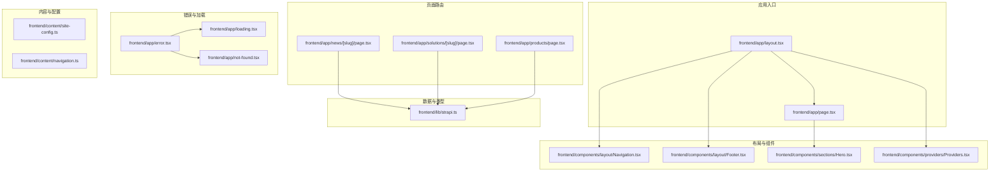
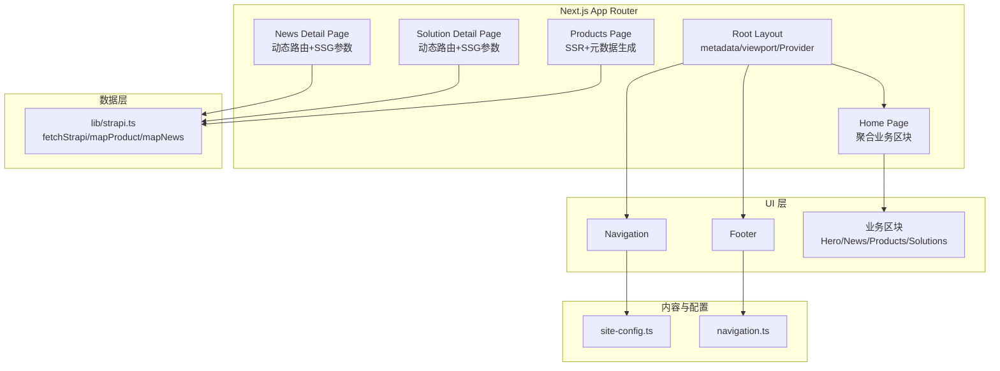
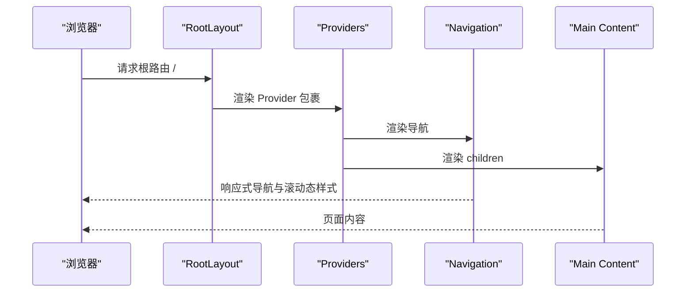
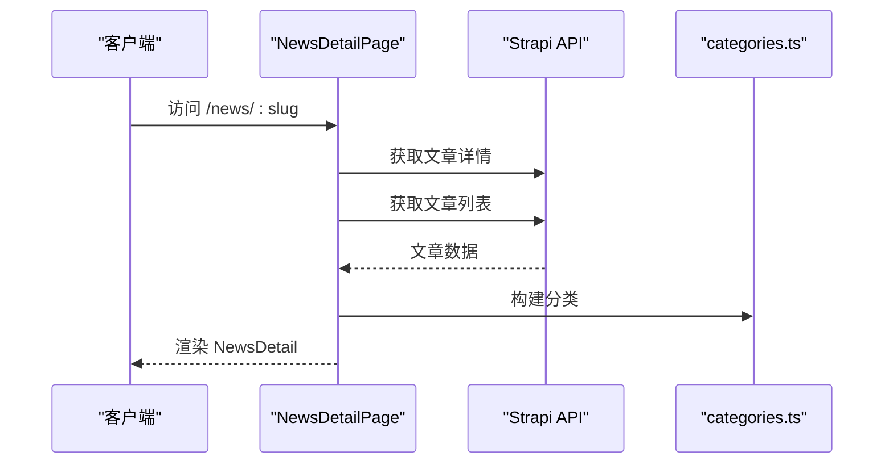
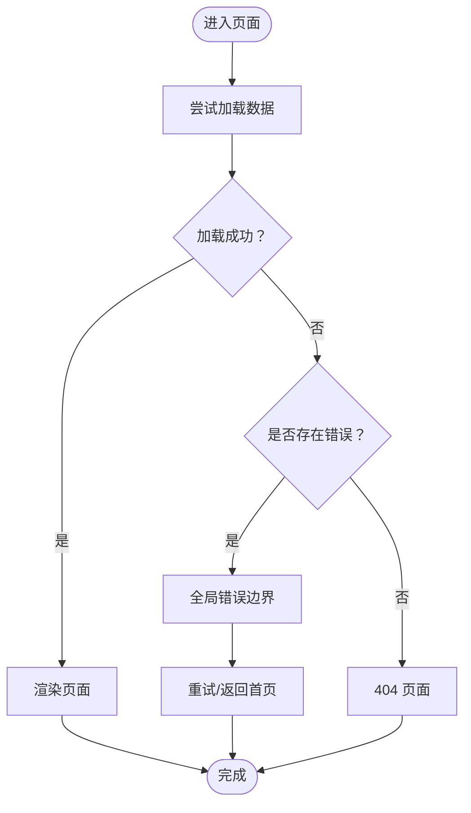
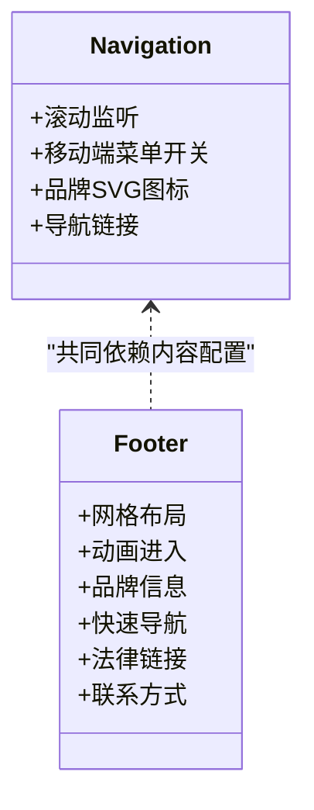
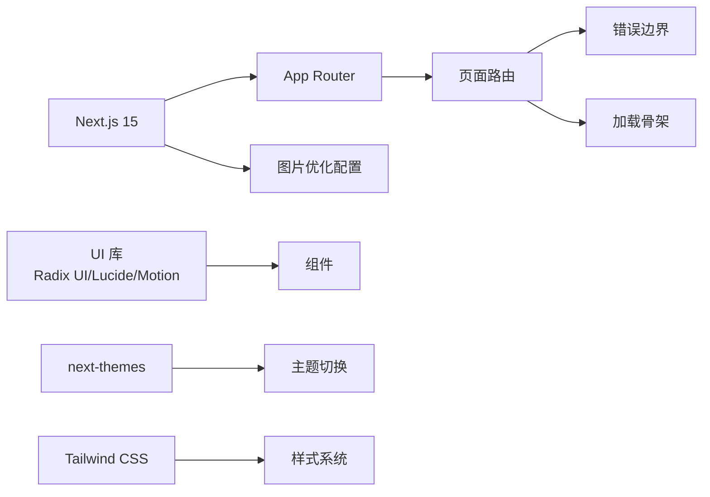

# 前端应用架构

<cite>
**本文档引用的文件**
- [frontend/app/layout.tsx](file://frontend/app/layout.tsx)
- [frontend/app/page.tsx](file://frontend/app/page.tsx)
- [frontend/components/providers/Providers.tsx](file://frontend/components/providers/Providers.tsx)
- [frontend/next.config.ts](file://frontend/next.config.ts)
- [frontend/package.json](file://frontend/package.json)
- [frontend/app/error.tsx](file://frontend/app/error.tsx)
- [frontend/app/loading.tsx](file://frontend/app/loading.tsx)
- [frontend/app/not-found.tsx](file://frontend/app/not-found.tsx)
- [frontend/components/layout/Navigation.tsx](file://frontend/components/layout/Navigation.tsx)
- [frontend/components/layout/Footer.tsx](file://frontend/components/layout/Footer.tsx)
- [frontend/lib/strapi.ts](file://frontend/lib/strapi.ts)
- [frontend/components/sections/Hero.tsx](file://frontend/components/sections/Hero.tsx)
- [frontend/content/site-config.ts](file://frontend/content/site-config.ts)
- [frontend/content/navigation.ts](file://frontend/content/navigation.ts)
- [frontend/app/news/[slug]/page.tsx](file://frontend/app/news/[slug]/page.tsx)
- [frontend/app/products/page.tsx](file://frontend/app/products/page.tsx)
- [frontend/app/solutions/[slug]/page.tsx](file://frontend/app/solutions/[slug]/page.tsx)
</cite>

## 目录
1. [引言](#引言)
2. [项目结构](#项目结构)
3. [核心组件](#核心组件)
4. [架构总览](#架构总览)
5. [详细组件分析](#详细组件分析)
6. [依赖关系分析](#依赖关系分析)
7. [性能考虑](#性能考虑)
8. [故障排查指南](#故障排查指南)
9. [结论](#结论)
10. [附录](#附录)

## 引言
本文件面向基于 Next.js 15 的前端应用，系统性梳理其架构设计与实现要点，重点覆盖以下方面：
- App Router 文件系统路由机制：页面路由、动态路由与错误处理
- 组件层次结构：布局组件、业务组件与 UI 基础组件的设计原则
- 响应式设计与主题系统：Tailwind CSS 使用与亮/暗主题切换机制
- 混合渲染模式：服务端渲染（SSR）、静态生成（SSG）与客户端渲染（CSR）的应用场景
- 组件开发最佳实践与代码组织规范

## 项目结构
前端工程采用 Next.js 15 App Router 的文件系统路由组织方式，根目录下包含应用入口、页面、组件、内容与类型定义等模块。整体结构清晰，遵循“按功能域分层”的组织方式，便于扩展与维护。

**图表来源**
- [frontend/app/layout.tsx](file://frontend/app/layout.tsx#L63-L82)
- [frontend/app/page.tsx](file://frontend/app/page.tsx#L40-L71)
- [frontend/app/news/[slug]/page.tsx](file://frontend/app/news/[slug]/page.tsx#L48-L70)
- [frontend/app/solutions/[slug]/page.tsx](file://frontend/app/solutions/[slug]/page.tsx#L44-L60)
- [frontend/app/products/page.tsx](file://frontend/app/products/page.tsx#L43-L48)
- [frontend/app/error.tsx](file://frontend/app/error.tsx#L5-L65)
- [frontend/app/loading.tsx](file://frontend/app/loading.tsx#L1-L14)
- [frontend/app/not-found.tsx](file://frontend/app/not-found.tsx#L3-L41)
- [frontend/components/layout/Navigation.tsx](file://frontend/components/layout/Navigation.tsx#L9-L125)
- [frontend/components/layout/Footer.tsx](file://frontend/components/layout/Footer.tsx#L10-L207)
- [frontend/components/sections/Hero.tsx](file://frontend/components/sections/Hero.tsx#L8-L137)
- [frontend/components/providers/Providers.tsx](file://frontend/components/providers/Providers.tsx#L9-L17)
- [frontend/content/site-config.ts](file://frontend/content/site-config.ts#L1-L47)
- [frontend/content/navigation.ts](file://frontend/content/navigation.ts#L1-L38)
- [frontend/lib/strapi.ts](file://frontend/lib/strapi.ts#L100-L155)

**章节来源**
- [frontend/app/layout.tsx](file://frontend/app/layout.tsx#L1-L83)
- [frontend/app/page.tsx](file://frontend/app/page.tsx#L1-L72)
- [frontend/next.config.ts](file://frontend/next.config.ts#L1-L39)
- [frontend/package.json](file://frontend/package.json#L1-L88)

## 核心组件
- 根布局与元数据：在根布局中集中管理站点元数据、视口配置与全局 Provider 包裹，确保页面统一的头部信息与主题色策略。
- 导航与页脚：导航组件负责响应式菜单与滚动态样式；页脚组件提供品牌信息、快速导航、法律链接与联系方式。
- 首屏区块：如 Hero 组件承担首屏视觉与交互引导，结合动画库实现流畅的入场效果。
- 数据访问层：封装 Strapi API 请求，统一媒体资源解析与数据映射，支持并发请求与缓存控制。

**章节来源**
- [frontend/app/layout.tsx](file://frontend/app/layout.tsx#L9-L61)
- [frontend/components/layout/Navigation.tsx](file://frontend/components/layout/Navigation.tsx#L9-L125)
- [frontend/components/layout/Footer.tsx](file://frontend/components/layout/Footer.tsx#L10-L207)
- [frontend/components/sections/Hero.tsx](file://frontend/components/sections/Hero.tsx#L8-L137)
- [frontend/lib/strapi.ts](file://frontend/lib/strapi.ts#L100-L155)

## 架构总览
该应用采用“布局-页面-组件”三层结构，配合内容配置与数据访问层，形成清晰的职责边界与可复用性。

**图表来源**
- [frontend/app/layout.tsx](file://frontend/app/layout.tsx#L63-L82)
- [frontend/app/page.tsx](file://frontend/app/page.tsx#L40-L71)
- [frontend/app/news/[slug]/page.tsx](file://frontend/app/news/[slug]/page.tsx#L14-L20)
- [frontend/app/solutions/[slug]/page.tsx](file://frontend/app/solutions/[slug]/page.tsx#L13-L19)
- [frontend/app/products/page.tsx](file://frontend/app/products/page.tsx#L7-L41)
- [frontend/components/layout/Navigation.tsx](file://frontend/components/layout/Navigation.tsx#L9-L125)
- [frontend/components/layout/Footer.tsx](file://frontend/components/layout/Footer.tsx#L10-L207)
- [frontend/content/site-config.ts](file://frontend/content/site-config.ts#L1-L47)
- [frontend/content/navigation.ts](file://frontend/content/navigation.ts#L1-L38)
- [frontend/lib/strapi.ts](file://frontend/lib/strapi.ts#L100-L155)

## 详细组件分析

### 根布局与全局 Provider
- 元数据与视口：集中定义标题模板、描述、关键词、Open Graph 与 Twitter 卡片，以及主题色随系统偏好变化。
- Provider 包裹：为后续引入主题、国际化、状态管理等提供统一注入点。
- 结构：HTML 根节点包裹 Provider，内部包含滚动进度条、导航、主内容区与页脚。

**图表来源**
- [frontend/app/layout.tsx](file://frontend/app/layout.tsx#L63-L82)
- [frontend/components/providers/Providers.tsx](file://frontend/components/providers/Providers.tsx#L9-L17)
- [frontend/components/layout/Navigation.tsx](file://frontend/components/layout/Navigation.tsx#L9-L125)

**章节来源**
- [frontend/app/layout.tsx](file://frontend/app/layout.tsx#L9-L61)
- [frontend/components/providers/Providers.tsx](file://frontend/components/providers/Providers.tsx#L1-L18)

### 页面路由与动态路由
- 首页：聚合多个业务区块，使用并发请求获取推荐产品与新闻，提升首屏性能。
- 新闻详情页：动态路由参数 [slug]，通过 generateStaticParams 预渲染已知文章，结合 generateMetadata 动态生成 SEO 元数据。
- 解决方案详情页：动态路由参数 [slug]，针对特定 slug（如 highway-safety）使用专用组件，其他 slug 使用通用模板。
- 产品列表页：动态生成元数据，基于首件产品的图像与描述作为 Open Graph 图像与描述。

**图表来源**
- [frontend/app/news/[slug]/page.tsx](file://frontend/app/news/[slug]/page.tsx#L48-L70)
- [frontend/lib/strapi.ts](file://frontend/lib/strapi.ts#L141-L147)
- [frontend/lib/strapi.ts](file://frontend/lib/strapi.ts#L149-L154)

**章节来源**
- [frontend/app/news/[slug]/page.tsx](file://frontend/app/news/[slug]/page.tsx#L14-L20)
- [frontend/app/news/[slug]/page.tsx](file://frontend/app/news/[slug]/page.tsx#L22-L46)
- [frontend/app/news/[slug]/page.tsx](file://frontend/app/news/[slug]/page.tsx#L48-L70)
- [frontend/app/solutions/[slug]/page.tsx](file://frontend/app/solutions/[slug]/page.tsx#L13-L19)
- [frontend/app/solutions/[slug]/page.tsx](file://frontend/app/solutions/[slug]/page.tsx#L21-L42)
- [frontend/app/solutions/[slug]/page.tsx](file://frontend/app/solutions/[slug]/page.tsx#L44-L60)
- [frontend/app/products/page.tsx](file://frontend/app/products/page.tsx#L7-L41)

### 错误处理与加载状态
- 全局错误边界：捕获子树内抛出的错误，提供重试与返回首页的交互。
- 加载骨架：统一的加载动画，保证用户体验一致性。
- 404 页面：明确提示用户访问的页面不存在，并提供返回首页的链接。

**图表来源**
- [frontend/app/error.tsx](file://frontend/app/error.tsx#L5-L65)
- [frontend/app/loading.tsx](file://frontend/app/loading.tsx#L1-L14)
- [frontend/app/not-found.tsx](file://frontend/app/not-found.tsx#L3-L41)

**章节来源**
- [frontend/app/error.tsx](file://frontend/app/error.tsx#L1-L66)
- [frontend/app/loading.tsx](file://frontend/app/loading.tsx#L1-L15)
- [frontend/app/not-found.tsx](file://frontend/app/not-found.tsx#L1-L42)

### 布局组件与交互
- 导航组件：响应式菜单、滚动态样式、移动端抽屉动画、品牌 SVG 图标与渐变色交互。
- 页脚组件：网格布局、动画进入、品牌信息、快速导航、法律链接与联系方式。

**图表来源**
- [frontend/components/layout/Navigation.tsx](file://frontend/components/layout/Navigation.tsx#L9-L125)
- [frontend/components/layout/Footer.tsx](file://frontend/components/layout/Footer.tsx#L10-L207)
- [frontend/content/navigation.ts](file://frontend/content/navigation.ts#L1-L38)
- [frontend/content/site-config.ts](file://frontend/content/site-config.ts#L1-L47)

**章节来源**
- [frontend/components/layout/Navigation.tsx](file://frontend/components/layout/Navigation.tsx#L1-L126)
- [frontend/components/layout/Footer.tsx](file://frontend/components/layout/Footer.tsx#L1-L208)
- [frontend/content/navigation.ts](file://frontend/content/navigation.ts#L1-L38)
- [frontend/content/site-config.ts](file://frontend/content/site-config.ts#L1-L47)

### 业务组件与 UI 基础组件
- 业务组件：如 Hero、News、Products、Solutions 等，承担具体业务展示与交互。
- UI 基础组件：如 Button、Card 等，提供可复用的基础 UI 能力（当前目录包含 Button 与 Card 文件，便于扩展）。

**章节来源**
- [frontend/components/sections/Hero.tsx](file://frontend/components/sections/Hero.tsx#L1-L138)
- [frontend/package.json](file://frontend/package.json#L56-L73)

### 响应式设计与主题系统
- 响应式设计：广泛使用 Tailwind CSS 类名，结合 flex、grid、gap、px/py 等工具类实现自适应布局。
- 主题系统：通过根布局的 viewport 配置，使主题色随系统偏好自动切换（亮/暗），并配合组件内的颜色变量与渐变背景营造品牌风格。

**章节来源**
- [frontend/app/layout.tsx](file://frontend/app/layout.tsx#L54-L61)
- [frontend/content/site-config.ts](file://frontend/content/site-config.ts#L15-L29)

### 混合渲染模式
- 首页：使用异步函数并发获取数据，属于 SSR 场景，适合需要实时数据的首页。
- 新闻详情页：使用 generateStaticParams 生成静态路由参数，结合动态元数据生成，兼顾 SEO 与性能。
- 解决方案详情页：同上，针对特定 slug 使用专用组件，其他使用通用模板。
- 产品列表页：动态生成元数据，基于首件产品数据，适合展示型页面。

**章节来源**
- [frontend/app/page.tsx](file://frontend/app/page.tsx#L40-L71)
- [frontend/app/news/[slug]/page.tsx](file://frontend/app/news/[slug]/page.tsx#L14-L20)
- [frontend/app/solutions/[slug]/page.tsx](file://frontend/app/solutions/[slug]/page.tsx#L13-L19)
- [frontend/app/products/page.tsx](file://frontend/app/products/page.tsx#L7-L41)

### 组件开发最佳实践与代码组织规范
- 分层清晰：布局组件负责全局结构与样式，业务组件负责页面级功能，UI 基础组件提供可复用能力。
- 内容与逻辑分离：导航、站点配置等放在 content 目录，避免在组件中硬编码。
- 并发与性能：使用 Promise.all 并发请求，减少等待时间。
- 错误与加载：统一的错误边界与加载骨架，提升用户体验。
- 类型安全：利用 TypeScript 与类型定义，确保数据结构一致。

**章节来源**
- [frontend/app/page.tsx](file://frontend/app/page.tsx#L40-L71)
- [frontend/lib/strapi.ts](file://frontend/lib/strapi.ts#L100-L155)
- [frontend/content/navigation.ts](file://frontend/content/navigation.ts#L1-L38)
- [frontend/content/site-config.ts](file://frontend/content/site-config.ts#L1-L47)

## 依赖关系分析
- Next.js 15：提供 App Router、SSR/SSG、动态元数据与错误边界等能力。
- 图片优化：next.config.ts 配置远程域名白名单、现代图片格式与响应式尺寸。
- UI 与动画：Radix UI、Lucide React、Motion、Tailwind CSS 等。
- 主题与样式：next-themes 提供主题切换能力，Tailwind 提供原子化样式。

**图表来源**
- [frontend/package.json](file://frontend/package.json#L12-L73)
- [frontend/next.config.ts](file://frontend/next.config.ts#L4-L33)

**章节来源**
- [frontend/package.json](file://frontend/package.json#L1-L88)
- [frontend/next.config.ts](file://frontend/next.config.ts#L1-L39)

## 性能考虑
- 图片优化：启用现代图片格式（AVIF/WebP），配置响应式尺寸与远程域名白名单，减少带宽与加载时间。
- 并发请求：在页面中使用 Promise.all 并发获取多源数据，缩短首屏渲染时间。
- 静态生成：对已知内容（如新闻与解决方案详情）使用 generateStaticParams 生成静态路由，降低服务器压力。
- 缓存策略：通过 fetch 的 next.revalidate 控制缓存更新周期，平衡新鲜度与性能。
- 动画与滚动：合理使用动画库与滚动事件监听，避免过度重绘与卡顿。

**章节来源**
- [frontend/next.config.ts](file://frontend/next.config.ts#L4-L33)
- [frontend/app/page.tsx](file://frontend/app/page.tsx#L40-L44)
- [frontend/lib/strapi.ts](file://frontend/lib/strapi.ts#L100-L111)

## 故障排查指南
- 图片加载失败：检查 next.config.ts 中的 remotePatterns 是否包含目标域名，确认媒体 URL 解析逻辑。
- 动态路由 404：确认 generateStaticParams 返回的 slug 列表是否完整，以及 getNewsBySlug/getSolutionBySlug 是否正确返回数据。
- 错误边界触发：查看错误日志输出，定位具体错误来源；确保错误边界提供重试与返回首页的交互。
- SEO 元数据异常：核对 generateMetadata 返回值，确保标题、描述与 Open Graph 图像正确设置。

**章节来源**
- [frontend/next.config.ts](file://frontend/next.config.ts#L7-L27)
- [frontend/lib/strapi.ts](file://frontend/lib/strapi.ts#L141-L147)
- [frontend/app/error.tsx](file://frontend/app/error.tsx#L12-L15)
- [frontend/app/news/[slug]/page.tsx](file://frontend/app/news/[slug]/page.tsx#L22-L46)

## 结论
该前端应用以 Next.js 15 的 App Router 为核心，结合内容与数据层，实现了清晰的组件层次、完善的错误与加载处理、良好的响应式与主题体验，并通过混合渲染模式兼顾性能与 SEO。建议在后续迭代中持续完善 UI 基础组件体系、增强主题切换的细粒度控制，并进一步优化图片与第三方资源的加载策略。

## 附录
- 项目依赖概览：Next.js、React、Radix UI、Lucide React、Motion、Tailwind CSS、next-themes 等。
- 配置参考：next.config.ts 的图片优化与严格模式；package.json 的脚本与依赖版本。

**章节来源**
- [frontend/package.json](file://frontend/package.json#L1-L88)
- [frontend/next.config.ts](file://frontend/next.config.ts#L1-L39)