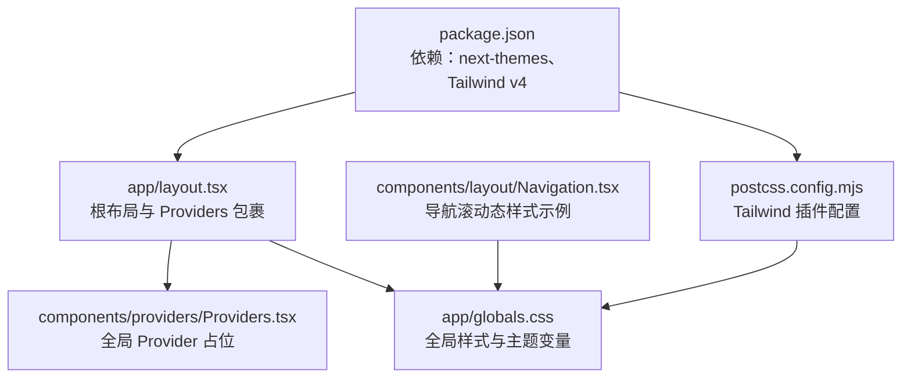
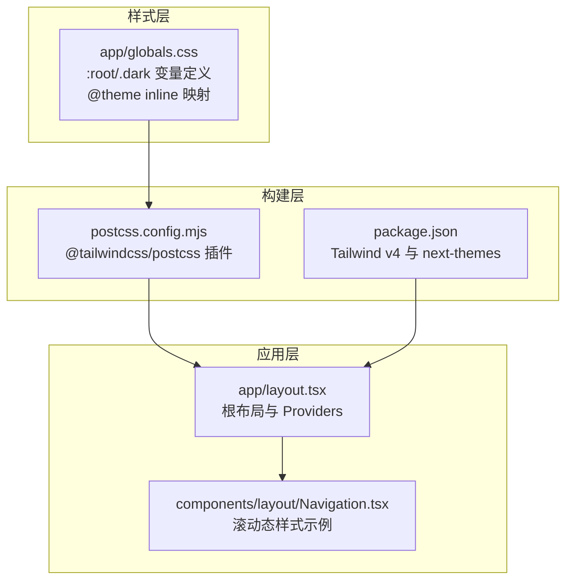
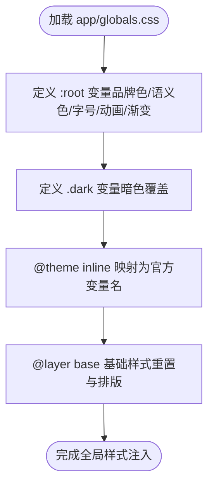
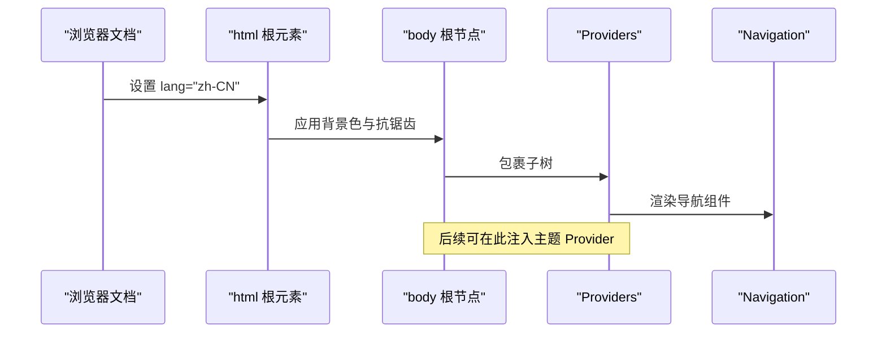
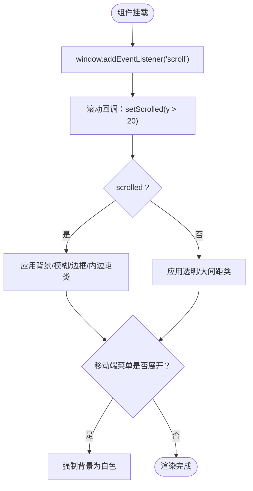
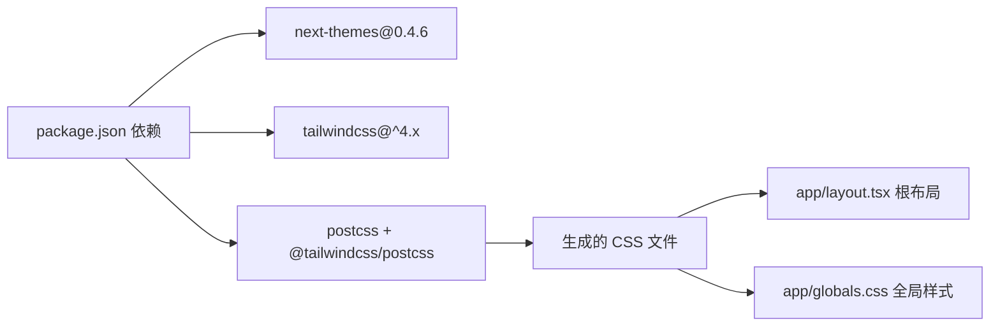

# 样式和主题

<cite>
**本文引用的文件**
- [frontend/app/globals.css](file://frontend/app/globals.css)
- [frontend/app/layout.tsx](file://frontend/app/layout.tsx)
- [frontend/components/providers/Providers.tsx](file://frontend/components/providers/Providers.tsx)
- [frontend/components/layout/Navigation.tsx](file://frontend/components/layout/Navigation.tsx)
- [frontend/postcss.config.mjs](file://frontend/postcss.config.mjs)
- [frontend/package.json](file://frontend/package.json)
</cite>

## 目录
1. [简介](#简介)
2. [项目结构](#项目结构)
3. [核心组件](#核心组件)
4. [架构总览](#架构总览)
5. [详细组件分析](#详细组件分析)
6. [依赖关系分析](#依赖关系分析)
7. [性能考量](#性能考量)
8. [故障排查指南](#故障排查指南)
9. [结论](#结论)
10. [附录](#附录)

## 简介
本文件系统性梳理本项目基于 Tailwind CSS 的样式与主题体系，覆盖以下要点：
- 全局样式组织：基础样式重置、字体与字号体系、颜色系统与品牌色定义
- 主题切换机制：亮/暗两套主题变量、CSS 变量映射与 @theme inline 的作用
- 响应式设计策略：断点与移动端适配、滚动与交互优化
- CSS 变量与自定义属性：变量命名、层级与继承关系
- 样式开发最佳实践：BEM 风格建议、组件样式隔离与性能优化

## 项目结构
前端样式与主题相关的核心位置如下：
- 全局样式入口：frontend/app/globals.css
- 应用根布局：frontend/app/layout.tsx
- Provider 容器：frontend/components/providers/Providers.tsx
- 导航组件（含滚动态样式）：frontend/components/layout/Navigation.tsx
- PostCSS 配置：frontend/postcss.config.mjs
- 依赖声明（含 next-themes、Tailwind v4 等）：frontend/package.json

图表来源
- [frontend/app/layout.tsx](file://frontend/app/layout.tsx#L63-L82)
- [frontend/components/providers/Providers.tsx](file://frontend/components/providers/Providers.tsx#L9-L17)
- [frontend/app/globals.css](file://frontend/app/globals.css#L1-L203)
- [frontend/components/layout/Navigation.tsx](file://frontend/components/layout/Navigation.tsx#L9-L26)
- [frontend/postcss.config.mjs](file://frontend/postcss.config.mjs#L1-L9)
- [frontend/package.json](file://frontend/package.json#L12-L87)

章节来源
- [frontend/app/globals.css](file://frontend/app/globals.css#L1-L203)
- [frontend/app/layout.tsx](file://frontend/app/layout.tsx#L63-L82)
- [frontend/components/providers/Providers.tsx](file://frontend/components/providers/Providers.tsx#L9-L17)
- [frontend/components/layout/Navigation.tsx](file://frontend/components/layout/Navigation.tsx#L9-L26)
- [frontend/postcss.config.mjs](file://frontend/postcss.config.mjs#L1-L9)
- [frontend/package.json](file://frontend/package.json#L12-L87)

## 核心组件
- 全局样式与主题变量
  - 在全局样式中集中定义品牌色、基础语义色、输入/边框/环形高亮等变量，并通过 :root 与 .dark 类分别定义亮/暗两套主题。
  - 使用 @theme inline 将 CSS 变量映射为 Tailwind 4 的官方变量名，确保在组件类名中可直接使用。
- 根布局与容器
  - 根布局在 <body> 上应用背景色与抗锯齿，通过 Providers 组件承载后续主题/上下文 Provider。
- 导航组件
  - 演示了滚动态下背景、模糊、阴影与文字颜色的变化，体现 CSS 变量在交互中的动态效果。

章节来源
- [frontend/app/globals.css](file://frontend/app/globals.css#L4-L146)
- [frontend/app/layout.tsx](file://frontend/app/layout.tsx#L63-L82)
- [frontend/components/layout/Navigation.tsx](file://frontend/components/layout/Navigation.tsx#L9-L26)

## 架构总览
整体样式与主题架构由“全局变量 → @theme 映射 → Tailwind 类名 → 组件样式”构成。PostCSS 通过 Tailwind 插件处理，生成最终 CSS。

图表来源
- [frontend/app/globals.css](file://frontend/app/globals.css#L1-L203)
- [frontend/postcss.config.mjs](file://frontend/postcss.config.mjs#L1-L9)
- [frontend/package.json](file://frontend/package.json#L12-L87)
- [frontend/app/layout.tsx](file://frontend/app/layout.tsx#L63-L82)
- [frontend/components/layout/Navigation.tsx](file://frontend/components/layout/Navigation.tsx#L9-L26)

## 详细组件分析

### 全局样式与主题变量（globals.css）
- 变量分层
  - 品牌色：包含企业蓝与金等品牌主色。
  - 基础语义色：背景、前景、卡片、弹出层、主要/次要、静默、强调、破坏性、边框、输入、环形高亮等。
  - 字体与权重：字号基准、中/常规/加粗权重。
  - 动画与过渡：快/慢/基础/弹跳等缓动时长。
  - 渐变：科技风渐变与网格背景。
- 主题切换
  - :root 定义亮色主题默认值；.dark 定义暗色主题变量覆盖。
  - @theme inline 将变量映射为 --color-* 与 --radius-* 等官方变量，便于在组件类名中直接使用。
- 基础层（@layer base）
  - 对 *、body、html、标题、标签、按钮、输入等进行基础样式重置与统一字号/字重/行高。

图表来源
- [frontend/app/globals.css](file://frontend/app/globals.css#L4-L203)

章节来源
- [frontend/app/globals.css](file://frontend/app/globals.css#L4-L203)

### 根布局与 Providers（layout.tsx 与 Providers.tsx）
- 根布局
  - 在 <html> 上设置语言与防闪烁策略，在 <body> 上应用背景色与抗锯齿。
  - 通过 Providers 包裹页面内容，为后续主题/上下文 Provider 提供挂载点。
- Providers
  - 当前作为占位，便于未来接入 next-themes 或其他全局 Provider。

图表来源
- [frontend/app/layout.tsx](file://frontend/app/layout.tsx#L63-L82)
- [frontend/components/providers/Providers.tsx](file://frontend/components/providers/Providers.tsx#L9-L17)

章节来源
- [frontend/app/layout.tsx](file://frontend/app/layout.tsx#L63-L82)
- [frontend/components/providers/Providers.tsx](file://frontend/components/providers/Providers.tsx#L9-L17)

### 导航组件（滚动态样式示例）
- 滚动监听与样式切换
  - 监听滚动事件，根据滚动距离切换导航背景、模糊度、边框与内边距。
  - 移动端菜单展开时强制背景为白色，避免穿透问题。
- 动效与品牌色
  - 使用品牌蓝与金色作为图标与高亮色，hover 时过渡到更柔和的色调。

图表来源
- [frontend/components/layout/Navigation.tsx](file://frontend/components/layout/Navigation.tsx#L9-L26)

章节来源
- [frontend/components/layout/Navigation.tsx](file://frontend/components/layout/Navigation.tsx#L9-L26)

### 响应式设计与移动端适配
- 断点与容器
  - 使用 Tailwind 默认断点（sm、lg 等），在组件中通过类名控制桌面/移动端布局差异。
- 移动端菜单
  - 使用 AnimatePresence 与 motion 实现抽屉式菜单的开合动画，配合绝对定位与阴影提升层级感。
- 触摸交互优化
  - 按钮与链接采用较大的点击热区与合适的圆角半径，保证移动端可触达性。

章节来源
- [frontend/components/layout/Navigation.tsx](file://frontend/components/layout/Navigation.tsx#L80-L125)

### CSS 变量与自定义属性管理
- 变量命名与层级
  - 采用 --zczk-*（品牌色）、--background/--foreground/--primary 等语义化命名，以及 --radius-* 控制圆角。
- 变量映射
  - 通过 @theme inline 将变量映射为 --color-* 与 --radius-*，使 Tailwind 类名可直接消费。
- 继承与覆盖
  - :root 定义默认值，.dark 仅覆盖差异部分，减少重复与维护成本。

章节来源
- [frontend/app/globals.css](file://frontend/app/globals.css#L4-L146)

### 样式开发最佳实践
- 命名规范建议
  - 采用 BEM 风格（块__元素--修饰），结合 Tailwind 类名组合，保持一致性。
- 组件样式隔离
  - 优先使用局部类名与容器选择器，避免全局污染；必要时通过作用域或命名空间隔离。
- 性能优化
  - 合理拆分样式文件，按需引入；利用 Tailwind 的 purge 与 Tree Shaking；避免过度嵌套与复杂选择器。
- 可访问性
  - 保证对比度与可读性；为交互元素提供明确的焦点状态与键盘可达性。

## 依赖关系分析
- Tailwind v4 与 PostCSS
  - 通过 postcss.config.mjs 加载 @tailwindcss/postcss 插件，负责扫描与生成 CSS。
- 主题库
  - 依赖 next-themes（版本 0.4.6），用于在客户端管理明/暗主题切换与持久化偏好。
- 设计系统与动画
  - 项目引入了多种 UI 组件库与动画库，可在组件中复用其样式能力，但本主题系统以 CSS 变量与 Tailwind 类为主。

图表来源
- [frontend/package.json](file://frontend/package.json#L12-L87)
- [frontend/postcss.config.mjs](file://frontend/postcss.config.mjs#L1-L9)
- [frontend/app/layout.tsx](file://frontend/app/layout.tsx#L63-L82)
- [frontend/app/globals.css](file://frontend/app/globals.css#L1-L203)

章节来源
- [frontend/package.json](file://frontend/package.json#L12-L87)
- [frontend/postcss.config.mjs](file://frontend/postcss.config.mjs#L1-L9)

## 性能考量
- 构建阶段
  - 使用 Tailwind v4 与 PostCSS 插件，确保只输出实际使用的样式，减少包体积。
- 运行时
  - CSS 变量切换主题无需重绘整个页面，仅影响相关元素；建议将高频切换的变量集中在 :root 与 .dark 中。
- 图片与图标
  - 导航中使用矢量 SVG，具备良好的缩放与性能表现；如需图片资源，建议采用现代格式与懒加载策略。

## 故障排查指南
- 主题未生效
  - 检查是否正确引入 app/globals.css；确认根布局 <html> 上未被其他样式覆盖。
  - 若使用 next-themes，请确保在客户端组件中初始化并持久化用户偏好。
- 变量未被识别
  - 确认 @theme inline 是否正确映射变量；检查变量命名是否与 Tailwind 类一致。
- 构建异常
  - 检查 postcss.config.mjs 中插件配置；确保 Tailwind 版本与插件兼容。

章节来源
- [frontend/app/globals.css](file://frontend/app/globals.css#L103-L146)
- [frontend/app/layout.tsx](file://frontend/app/layout.tsx#L63-L82)
- [frontend/package.json](file://frontend/package.json#L12-L87)
- [frontend/postcss.config.mjs](file://frontend/postcss.config.mjs#L1-L9)

## 结论
本项目以 CSS 变量为核心的主题系统，结合 Tailwind v4 的 @theme inline 映射与 PostCSS 处理，实现了清晰、可维护且高性能的样式架构。通过 :root 与 .dark 的双轨变量体系，配合 @layer base 的基础重置，既保证了品牌一致性，又提供了灵活的主题扩展能力。建议在后续迭代中完善 next-themes 的集成与持久化策略，并持续遵循 BEM 命名与组件隔离原则，进一步提升可维护性与可访问性。

## 附录
- 关键变量参考路径
  - [品牌色与语义色定义](file://frontend/app/globals.css#L4-L48)
  - [.dark 暗色覆盖](file://frontend/app/globals.css#L66-L101)
  - [@theme inline 映射](file://frontend/app/globals.css#L103-L146)
- 构建与依赖
  - [PostCSS 配置](file://frontend/postcss.config.mjs#L1-L9)
  - [Tailwind 与 next-themes 依赖](file://frontend/package.json#L12-L87)