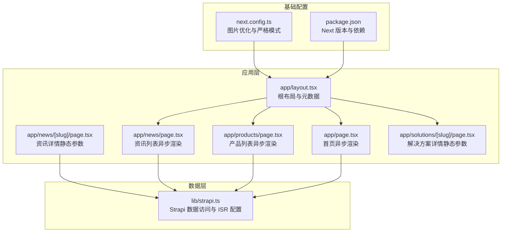
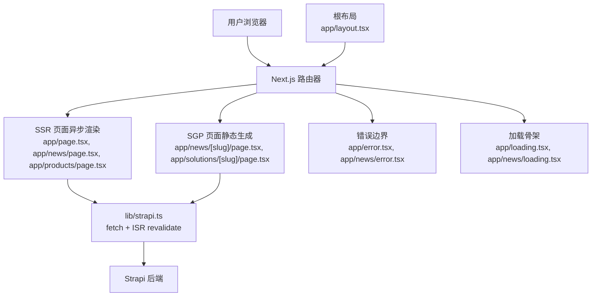
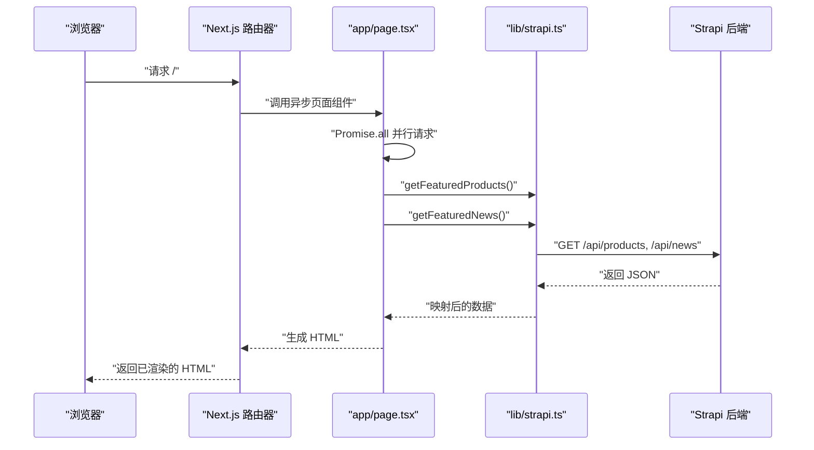
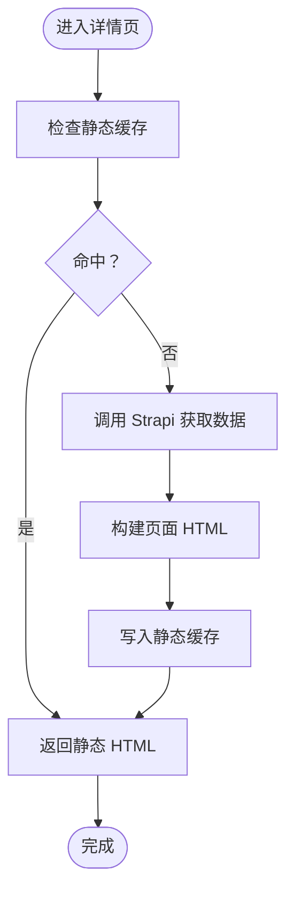
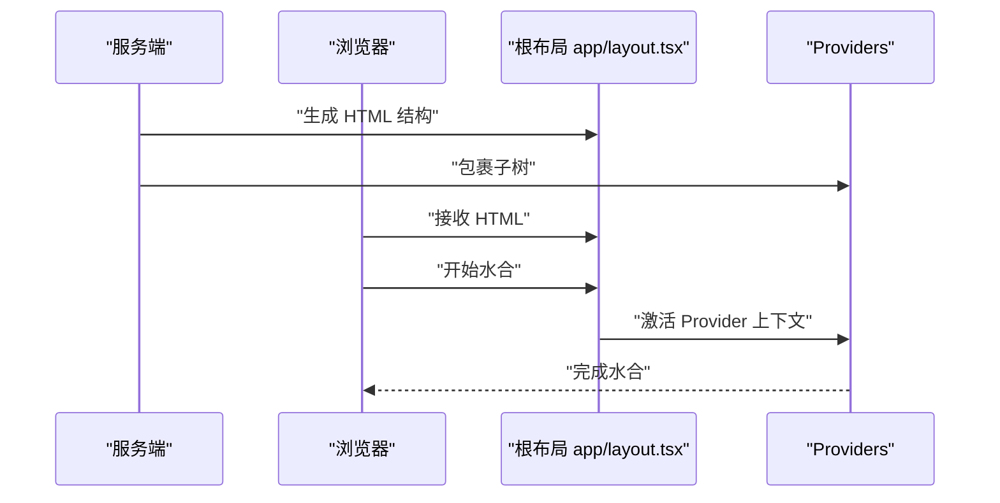
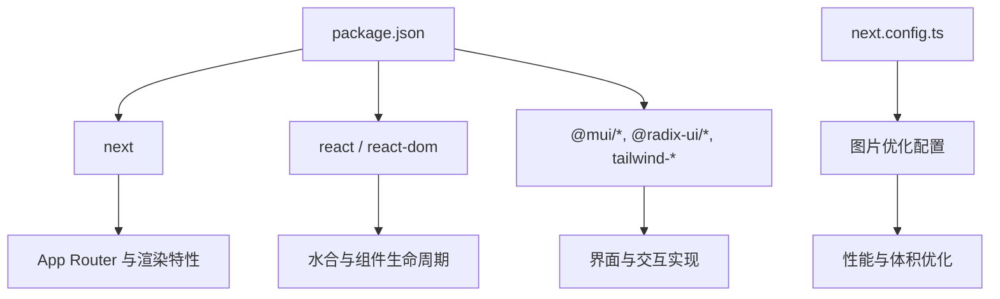

# 渲染模式

<cite>
**本文引用的文件**
- [frontend/next.config.ts](file://frontend/next.config.ts)
- [frontend/app/layout.tsx](file://frontend/app/layout.tsx)
- [frontend/app/page.tsx](file://frontend/app/page.tsx)
- [frontend/lib/metadata.ts](file://frontend/lib/metadata.ts)
- [frontend/lib/strapi.ts](file://frontend/lib/strapi.ts)
- [frontend/app/news/[slug]/page.tsx](file://frontend/app/news/[slug]/page.tsx)
- [frontend/app/news/page.tsx](file://frontend/app/news/page.tsx)
- [frontend/app/products/page.tsx](file://frontend/app/products/page.tsx)
- [frontend/app/solutions/[slug]/page.tsx](file://frontend/app/solutions/[slug]/page.tsx)
- [frontend/components/providers/Providers.tsx](file://frontend/components/providers/Providers.tsx)
- [frontend/app/news/error.tsx](file://frontend/app/news/error.tsx)
- [frontend/app/news/loading.tsx](file://frontend/app/news/loading.tsx)
- [frontend/app/loading.tsx](file://frontend/app/loading.tsx)
- [frontend/app/error.tsx](file://frontend/app/error.tsx)
- [frontend/package.json](file://frontend/package.json)
</cite>

## 目录
1. [引言](#引言)
2. [项目结构](#项目结构)
3. [核心组件](#核心组件)
4. [架构总览](#架构总览)
5. [详细组件分析](#详细组件分析)
6. [依赖分析](#依赖分析)
7. [性能考量](#性能考量)
8. [故障排查指南](#故障排查指南)
9. [结论](#结论)
10. [附录](#附录)

## 引言
本文件系统性梳理该 Next.js 项目在混合渲染架构下的实现与最佳实践，覆盖服务端渲染（SSR）、静态生成（SGP）与增量静态再生（ISR）、以及客户端渲染（CSR）的适用场景与性能权衡；同时解释水合（hydration）与同构渲染的实现细节，给出缓存策略、预加载技术与用户体验优化建议。

## 项目结构
前端采用 App Router 的目录组织方式，页面级路由位于 app 下，按路径自动生成路由；数据访问通过 lib 层封装；全局布局与元数据在根布局与内容配置中统一管理；错误与加载态通过 app 目录下的 error.tsx 与 loading.tsx 统一处理。

图表来源
- [frontend/app/layout.tsx](file://frontend/app/layout.tsx#L1-L83)
- [frontend/app/page.tsx](file://frontend/app/page.tsx#L1-L72)
- [frontend/app/news/page.tsx](file://frontend/app/news/page.tsx#L1-L31)
- [frontend/app/news/[slug]/page.tsx](file://frontend/app/news/[slug]/page.tsx#L1-L71)
- [frontend/app/products/page.tsx](file://frontend/app/products/page.tsx#L1-L50)
- [frontend/app/solutions/[slug]/page.tsx](file://frontend/app/solutions/[slug]/page.tsx#L1-L167)
- [frontend/lib/strapi.ts](file://frontend/lib/strapi.ts#L1-L155)
- [frontend/next.config.ts](file://frontend/next.config.ts#L1-L39)
- [frontend/package.json](file://frontend/package.json#L1-L88)

章节来源
- [frontend/next.config.ts](file://frontend/next.config.ts#L1-L39)
- [frontend/app/layout.tsx](file://frontend/app/layout.tsx#L1-L83)
- [frontend/package.json](file://frontend/package.json#L1-L88)

## 核心组件
- 根布局与元数据：定义站点标题、描述、OpenGraph、Twitter 卡片与 robots 策略，为 SEO 提供基础。
- 首页与列表页：使用异步函数进行数据预取，结合 Promise 并行请求提升首屏性能。
- 资讯详情与解决方案详情：通过 generateStaticParams 生成静态路由参数，实现 SGP；详情页动态元数据通过 generateMetadata 生成。
- 数据访问层：封装 Strapi 请求，统一媒体资源解析与映射，支持 ISR 的 revalidate 配置。
- 错误与加载态：全局与页面级错误边界与加载骨架，保证用户体验与可恢复性。
- Provider 包裹：为后续主题、认证等上下文提供扩展点。

章节来源
- [frontend/app/layout.tsx](file://frontend/app/layout.tsx#L9-L52)
- [frontend/app/page.tsx](file://frontend/app/page.tsx#L40-L71)
- [frontend/app/news/[slug]/page.tsx](file://frontend/app/news/[slug]/page.tsx#L14-L20)
- [frontend/app/news/[slug]/page.tsx](file://frontend/app/news/[slug]/page.tsx#L22-L46)
- [frontend/lib/strapi.ts](file://frontend/lib/strapi.ts#L100-L111)
- [frontend/app/news/error.tsx](file://frontend/app/news/error.tsx#L1-L57)
- [frontend/app/news/loading.tsx](file://frontend/app/news/loading.tsx#L1-L14)
- [frontend/app/loading.tsx](file://frontend/app/loading.tsx#L1-L15)
- [frontend/components/providers/Providers.tsx](file://frontend/components/providers/Providers.tsx#L1-L18)

## 架构总览
该站点采用“混合渲染”策略：
- 首页与资讯列表、产品列表等页面采用 SSR（异步渲染），在服务端完成数据拉取与 HTML 生成，兼顾 SEO 与首屏性能。
- 资讯详情与解决方案详情采用 SGP（静态生成），通过 generateStaticParams 预先生成静态页面，显著降低运行时开销。
- ISR 通过 fetch 的 next.revalidate 实现，允许在静态页面上启用增量更新，平衡新鲜度与性能。
- CSR 用于需要交互的局部区域或客户端逻辑，通过 “use client” 标注的组件实现。

图表来源
- [frontend/app/page.tsx](file://frontend/app/page.tsx#L40-L71)
- [frontend/app/news/page.tsx](file://frontend/app/news/page.tsx#L25-L30)
- [frontend/app/products/page.tsx](file://frontend/app/products/page.tsx#L43-L48)
- [frontend/app/news/[slug]/page.tsx](file://frontend/app/news/[slug]/page.tsx#L14-L20)
- [frontend/app/solutions/[slug]/page.tsx](file://frontend/app/solutions/[slug]/page.tsx#L13-L19)
- [frontend/lib/strapi.ts](file://frontend/lib/strapi.ts#L100-L111)
- [frontend/app/error.tsx](file://frontend/app/error.tsx#L1-L66)
- [frontend/app/news/error.tsx](file://frontend/app/news/error.tsx#L1-L57)
- [frontend/app/loading.tsx](file://frontend/app/loading.tsx#L1-L15)
- [frontend/app/news/loading.tsx](file://frontend/app/news/loading.tsx#L1-L14)
- [frontend/app/layout.tsx](file://frontend/app/layout.tsx#L63-L82)

## 详细组件分析

### 服务端渲染（SSR）
- 应用场景
  - 首页、资讯列表、产品列表等需要实时数据与 SEO 的页面。
  - 需要在服务端执行权限判断或根据用户上下文定制内容的页面。
- 实现方式
  - 使用异步页面组件，在服务端执行数据拉取与 HTML 生成。
  - 首页通过 Promise 并行请求多个数据源，减少总等待时间。
- SEO 优化
  - 根布局集中定义站点元数据；页面级 generateMetadata 可基于数据动态生成 OpenGraph/Twitter 卡片。
- 性能要点
  - 合理拆分数据请求，避免阻塞关键路径。
  - 对热点数据可结合缓存与 CDN，降低后端压力。

图表来源
- [frontend/app/page.tsx](file://frontend/app/page.tsx#L40-L44)
- [frontend/lib/strapi.ts](file://frontend/lib/strapi.ts#L120-L125)
- [frontend/lib/strapi.ts](file://frontend/lib/strapi.ts#L134-L139)

章节来源
- [frontend/app/page.tsx](file://frontend/app/page.tsx#L40-L71)
- [frontend/app/news/page.tsx](file://frontend/app/news/page.tsx#L25-L30)
- [frontend/app/products/page.tsx](file://frontend/app/products/page.tsx#L43-L48)
- [frontend/lib/strapi.ts](file://frontend/lib/strapi.ts#L100-L111)

### 静态生成（SGP）与增量静态再生（ISR）
- 应用场景
  - 内容型页面（如资讯详情、解决方案详情）具有稳定内容且需要极致首屏性能与 SEO。
- 实现方式
  - generateStaticParams 预先生成静态路由参数，构建静态页面。
  - generateMetadata 在构建期或请求期动态生成页面元信息。
  - fetch 中的 next.revalidate 配置实现 ISR，控制静态页面的再验证周期。
- 性能收益
  - 静态页面直接由服务器或 CDN 返回，无需运行时计算。
  - ISR 在后台异步更新缓存，保持内容新鲜度。

图表来源
- [frontend/app/news/[slug]/page.tsx](file://frontend/app/news/[slug]/page.tsx#L14-L20)
- [frontend/app/news/[slug]/page.tsx](file://frontend/app/news/[slug]/page.tsx#L22-L46)
- [frontend/lib/strapi.ts](file://frontend/lib/strapi.ts#L100-L111)

章节来源
- [frontend/app/news/[slug]/page.tsx](file://frontend/app/news/[slug]/page.tsx#L14-L20)
- [frontend/app/news/[slug]/page.tsx](file://frontend/app/news/[slug]/page.tsx#L22-L46)
- [frontend/app/solutions/[slug]/page.tsx](file://frontend/app/solutions/[slug]/page.tsx#L13-L19)
- [frontend/lib/strapi.ts](file://frontend/lib/strapi.ts#L100-L111)

### 客户端渲染（CSR）
- 适用场景
  - 需要复杂交互、动画或仅在客户端生效的功能模块。
  - 作为 Provider 包裹子树，承载主题切换、国际化等上下文。
- 实现注意
  - 使用 “use client” 标注客户端组件，避免在服务端渲染期间执行不兼容逻辑。
  - 将重型交互组件拆分为独立模块，按需加载，减少初始包体。

图表来源
- [frontend/components/providers/Providers.tsx](file://frontend/components/providers/Providers.tsx#L1-L18)
- [frontend/app/layout.tsx](file://frontend/app/layout.tsx#L63-L82)

章节来源
- [frontend/components/providers/Providers.tsx](file://frontend/components/providers/Providers.tsx#L1-L18)
- [frontend/app/layout.tsx](file://frontend/app/layout.tsx#L63-L82)

### 水合（Hydration）与同构渲染
- 水合流程
  - 服务端返回已完成的 HTML；客户端在浏览器中对已存在的 DOM 进行“激活”，使其具备交互能力。
  - 根布局通过 html lang 与 suppressHydrationWarning 控制水合行为与警告。
- 同构细节
  - 根布局集中注入全局样式与 Provider，确保服务端与客户端一致的结构与上下文。
  - 错误与加载态组件在客户端侧可触发重试与回退，提升鲁棒性。

图表来源
- [frontend/app/layout.tsx](file://frontend/app/layout.tsx#L63-L82)
- [frontend/components/providers/Providers.tsx](file://frontend/components/providers/Providers.tsx#L9-L16)

章节来源
- [frontend/app/layout.tsx](file://frontend/app/layout.tsx#L63-L82)
- [frontend/components/providers/Providers.tsx](file://frontend/components/providers/Providers.tsx#L1-L18)

## 依赖分析
- Next.js 版本与特性
  - 项目使用较新版本的 Next.js，支持 App Router、Server Components、Suspense、错误边界与加载骨架等特性。
- 关键依赖
  - React 与 React DOM：提供组件模型与水合能力。
  - UI 组件库与工具：Material-UI、Radix UI、Tailwind 等，支撑界面与交互。
- 配置影响
  - next.config.ts 中的图片优化与严格模式影响构建体积与运行时性能。
  - package.json 中的脚本与依赖版本决定开发体验与生产性能。

图表来源
- [frontend/package.json](file://frontend/package.json#L1-L88)
- [frontend/next.config.ts](file://frontend/next.config.ts#L1-L39)

章节来源
- [frontend/package.json](file://frontend/package.json#L1-L88)
- [frontend/next.config.ts](file://frontend/next.config.ts#L1-L39)

## 性能考量
- 缓存策略
  - ISR：通过 fetch 的 next.revalidate 控制静态页面再验证周期，平衡新鲜度与性能。
  - CDN：静态页面由 CDN 分发，缩短边缘延迟。
- 预加载技术
  - 首屏关键数据使用 Promise.all 并行拉取，减少关键路径时间。
  - 图片优化：开启现代格式（AVIF/WebP）、响应式尺寸与设备像素比适配。
- 用户体验
  - 加载骨架：全局与页面级 loading 组件提供即时反馈。
  - 错误边界：统一错误展示与重试机制，提升可恢复性。
- 选择策略
  - 高 SEO 且数据频繁变化：优先 SSR。
  - 内容稳定且高并发：优先 SGP + ISR。
  - 复杂交互与客户端逻辑：优先 CSR。

章节来源
- [frontend/lib/strapi.ts](file://frontend/lib/strapi.ts#L100-L111)
- [frontend/next.config.ts](file://frontend/next.config.ts#L5-L33)
- [frontend/app/loading.tsx](file://frontend/app/loading.tsx#L1-L15)
- [frontend/app/news/loading.tsx](file://frontend/app/news/loading.tsx#L1-L14)
- [frontend/app/error.tsx](file://frontend/app/error.tsx#L1-L66)
- [frontend/app/news/error.tsx](file://frontend/app/news/error.tsx#L1-L57)

## 故障排查指南
- 常见问题
  - 数据请求失败：检查 Strapi 地址与网络连通性；查看错误边界中的日志输出。
  - 静态页面未更新：确认 ISR revalidate 时间设置是否合理。
  - 首屏加载缓慢：检查并行请求是否过多导致后端压力；优化图片与资源体积。
- 排查步骤
  - 查看错误边界组件的错误信息与重试按钮。
  - 使用浏览器开发者工具 Network 面板观察请求与缓存命中情况。
  - 检查 next.config.ts 中的图片优化配置是否符合预期。
- 修复建议
  - 为关键页面增加超时与重试策略。
  - 对热点接口引入缓存中间件或 CDN。
  - 逐步减少一次性并行请求数量，观察性能变化。

章节来源
- [frontend/lib/strapi.ts](file://frontend/lib/strapi.ts#L100-L111)
- [frontend/app/error.tsx](file://frontend/app/error.tsx#L12-L15)
- [frontend/app/news/error.tsx](file://frontend/app/news/error.tsx#L13-L15)
- [frontend/next.config.ts](file://frontend/next.config.ts#L5-L33)

## 结论
该站点通过混合渲染策略实现了性能与体验的平衡：首页与列表采用 SSR，兼顾 SEO 与首屏；详情页采用 SGP + ISR，获得极致性能与内容新鲜度；CSR 用于交互密集区域。配合统一的元数据、错误与加载态管理，整体用户体验与可维护性得到显著提升。

## 附录
- 最佳实践清单
  - 优先使用 SGP + ISR 承载静态内容；对高频变更内容采用 SSR。
  - 使用 generateMetadata 动态生成 SEO 元信息，确保 OpenGraph 与 Twitter 卡片完整。
  - 合理设置 ISR revalidate，避免过度刷新与缓存穿透。
  - 通过并行请求与图片优化提升首屏性能。
  - 使用错误边界与加载骨架提升可恢复性与感知性能。
- 参考文件
  - [frontend/app/page.tsx](file://frontend/app/page.tsx#L40-L71)
  - [frontend/app/news/[slug]/page.tsx](file://frontend/app/news/[slug]/page.tsx#L14-L20)
  - [frontend/lib/strapi.ts](file://frontend/lib/strapi.ts#L100-L111)
  - [frontend/app/layout.tsx](file://frontend/app/layout.tsx#L9-L52)
  - [frontend/next.config.ts](file://frontend/next.config.ts#L5-L33)