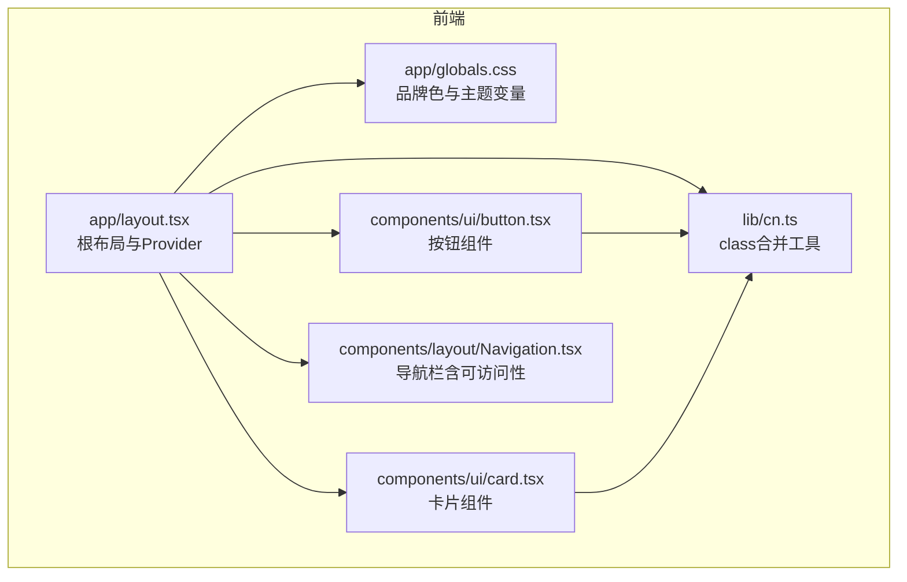
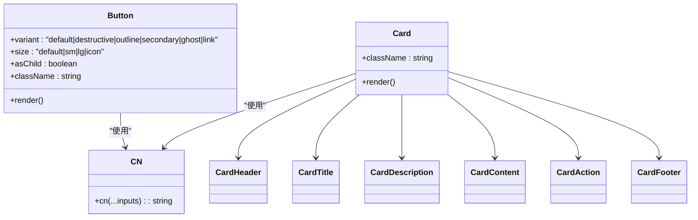
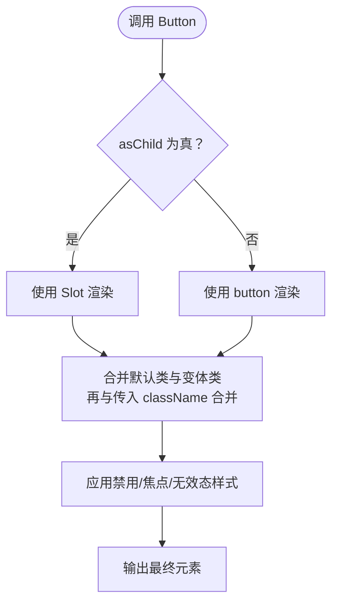
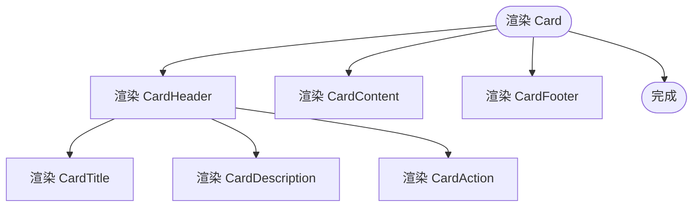
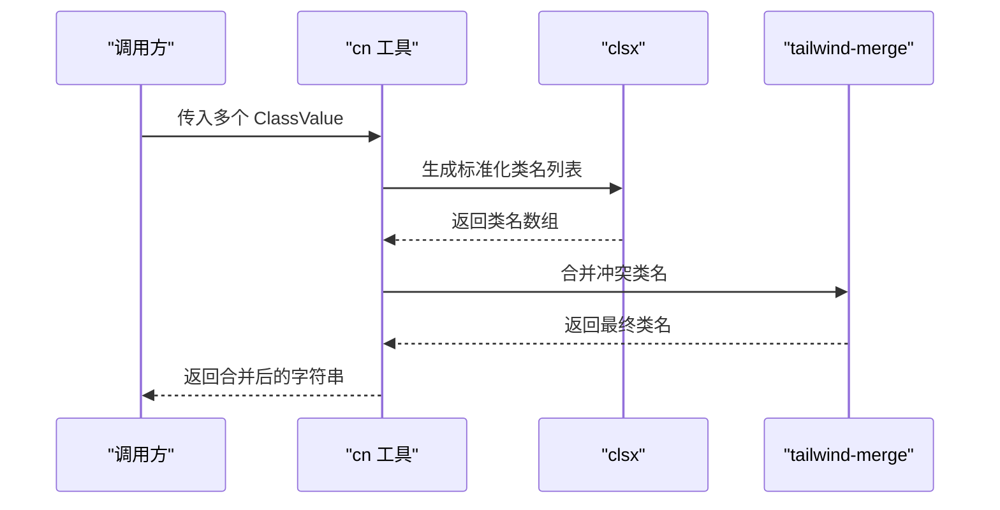
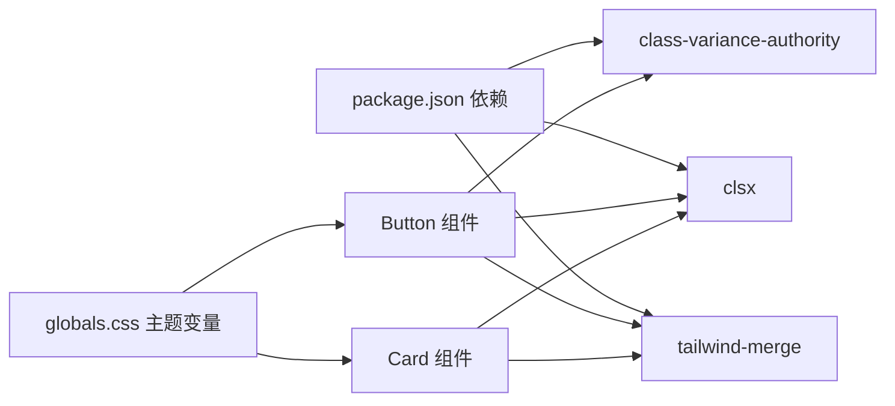

# UI基础组件

<cite>
**本文引用的文件**
- [button.tsx](file://frontend/components/ui/button.tsx)
- [card.tsx](file://frontend/components/ui/card.tsx)
- [cn.ts](file://frontend/lib/cn.ts)
- [globals.css](file://frontend/app/globals.css)
- [layout.tsx](file://frontend/app/layout.tsx)
- [package.json](file://frontend/package.json)
- [site-config.ts](file://frontend/content/site-config.ts)
- [Navigation.tsx](file://frontend/components/layout/Navigation.tsx)
</cite>

## 目录
1. [简介](#简介)
2. [项目结构](#项目结构)
3. [核心组件](#核心组件)
4. [架构总览](#架构总览)
5. [详细组件分析](#详细组件分析)
6. [依赖关系分析](#依赖关系分析)
7. [性能考虑](#性能考虑)
8. [故障排查指南](#故障排查指南)
9. [结论](#结论)
10. [附录](#附录)

## 简介
本文件聚焦于前端UI基础组件的设计与实现，重点覆盖按钮与卡片两大组件：按钮组件的设计系统（尺寸、颜色、状态与交互）、卡片组件的布局结构与样式变体；同时阐述class名称合并工具函数的使用方法与最佳实践，说明组件的可访问性与键盘导航支持，提供主题定制与样式覆盖技巧，并给出使用示例与组合模式，最后总结性能优化与渲染策略。

## 项目结构
本项目采用Next.js框架，UI基础组件位于前端目录下，样式由Tailwind CSS与CSS变量驱动，主题通过CSS自定义属性与暗色模式切换实现。

图表来源
- [layout.tsx](file://frontend/app/layout.tsx#L63-L82)
- [globals.css](file://frontend/app/globals.css#L1-L203)
- [cn.ts](file://frontend/lib/cn.ts#L1-L7)
- [button.tsx](file://frontend/components/ui/button.tsx#L1-L59)
- [card.tsx](file://frontend/components/ui/card.tsx#L1-L93)
- [Navigation.tsx](file://frontend/components/layout/Navigation.tsx#L1-L126)

章节来源
- [layout.tsx](file://frontend/app/layout.tsx#L1-L83)
- [globals.css](file://frontend/app/globals.css#L1-L203)

## 核心组件
- 按钮组件：基于class-variance-authority的变体系统，支持多种外观（variant）与尺寸（size），内置禁用态、焦点态与无效态的视觉反馈，支持作为容器元素渲染。
- 卡片组件：提供卡片主体与语义化子组件（头部、标题、描述、内容、操作、底部），统一的边框、圆角与背景风格，支持网格布局与响应式断点。
- class名称合并工具：封装clsx与tailwind-merge，确保类名冲突时正确合并，避免重复或覆盖错误。

章节来源
- [button.tsx](file://frontend/components/ui/button.tsx#L1-L59)
- [card.tsx](file://frontend/components/ui/card.tsx#L1-L93)
- [cn.ts](file://frontend/lib/cn.ts#L1-L7)

## 架构总览
按钮与卡片组件共享以下设计原则：
- 设计系统：通过变体系统与默认值控制外观一致性。
- 可访问性：焦点可见、禁用态、无效态具备明确视觉反馈。
- 主题系统：CSS变量驱动，支持明/暗两套配色，过渡动画统一。
- 渲染策略：最小化重排，优先使用原子化类名，避免内联样式。

图表来源
- [button.tsx](file://frontend/components/ui/button.tsx#L37-L56)
- [card.tsx](file://frontend/components/ui/card.tsx#L5-L92)
- [cn.ts](file://frontend/lib/cn.ts#L4-L6)

## 详细组件分析

### 按钮组件（Button）
- 设计系统与变体
  - 外观（variant）：default、destructive、outline、secondary、ghost、link，分别映射到主色、破坏色、描边、次色、透明、链接样式。
  - 尺寸（size）：default、sm、lg、icon，控制高度、内边距与图标间距。
  - 默认变体：default与default尺寸。
- 状态与交互
  - 禁用态：禁用指针事件且半透明。
  - 焦点态：outline-none移除默认轮廓，配合focus-visible添加环形高亮与边框强调。
  - 无效态：aria-invalid时为破坏色高亮，区分明/暗模式下的透明度。
  - 图标：自动适配尺寸与指针事件，避免点击穿透。
- 渲染与扩展
  - 支持asChild，将内部渲染为Slot，便于在a、Link等容器上复用按钮样式。
  - 使用cn进行类名合并，保证默认类、变体类与传入className的正确叠加。

图表来源
- [button.tsx](file://frontend/components/ui/button.tsx#L37-L56)

章节来源
- [button.tsx](file://frontend/components/ui/button.tsx#L1-L59)

### 卡片组件（Card）
- 组件构成
  - Card：卡片容器，统一背景、边框、圆角与列向布局。
  - CardHeader：网格布局，支持右侧放置操作区域，带分隔线与内边距。
  - CardTitle：标题语义标签，无多余装饰。
  - CardDescription：描述文本，使用“弱前景色”。
  - CardContent：内容区，末尾项自动底部留白。
  - CardAction：操作区，右对齐至网格第二列。
  - CardFooter：页脚区，顶部边框时自动顶部留白。
- 布局与响应式
  - 使用CSS Grid与@container指令，实现响应式与条件布局。
  - 通过data-slot标识各子组件，便于样式选择器定位。

图表来源
- [card.tsx](file://frontend/components/ui/card.tsx#L5-L92)

章节来源
- [card.tsx](file://frontend/components/ui/card.tsx#L1-L93)

### class名称合并工具（cn）
- 实现原理
  - 使用clsx生成标准化类名列表，再用tailwind-merge进行冲突合并，避免重复与错误覆盖。
- 最佳实践
  - 优先传入可选类名数组，确保顺序与可读性。
  - 在组件中统一使用cn，避免直接拼接字符串类名。
  - 对于变体系统，先合并默认类与变体类，再与外部传入className合并。

图表来源
- [cn.ts](file://frontend/lib/cn.ts#L4-L6)

章节来源
- [cn.ts](file://frontend/lib/cn.ts#L1-L7)

## 依赖关系分析
- 组件依赖
  - Button依赖cn与class-variance-authority，以及@radix-ui/react-slot用于容器渲染。
  - Card依赖cn与Tailwind原子类，不引入额外UI库。
- 主题与样式
  - 全局CSS定义品牌色与主题变量，支持明/暗两套配色与过渡动画。
  - 组件通过CSS变量与Tailwind类名实现一致的主题表现。
- 第三方依赖
  - package.json中包含class-variance-authority、clsx、tailwind-merge等，支撑变体系统与类名合并。

图表来源
- [package.json](file://frontend/package.json#L47-L73)
- [button.tsx](file://frontend/components/ui/button.tsx#L1-L5)
- [card.tsx](file://frontend/components/ui/card.tsx#L1-L3)
- [globals.css](file://frontend/app/globals.css#L1-L203)

章节来源
- [package.json](file://frontend/package.json#L1-L88)
- [button.tsx](file://frontend/components/ui/button.tsx#L1-L59)
- [card.tsx](file://frontend/components/ui/card.tsx#L1-L93)
- [globals.css](file://frontend/app/globals.css#L1-L203)

## 性能考虑
- 类名合并成本低：cn仅在组件渲染时执行一次，开销极小。
- 变体系统高效：cva在编译期生成类名映射，运行时仅做选择与合并。
- 原子化样式：Tailwind原子类减少CSS体积与重绘范围。
- 渲染策略建议
  - 避免在循环中频繁创建新对象作为className参数，尽量复用常量或缓存结果。
  - 对高频交互（如悬停、焦点）使用CSS过渡而非JavaScript动画，保持帧率稳定。
  - 卡片内容较多时，合理拆分渲染单元，必要时结合懒加载或虚拟化。

## 故障排查指南
- 按钮焦点环不显示
  - 检查是否正确使用focus-visible相关类名，确认未被其他样式覆盖。
  - 确认未手动移除outline-none或focus-visible相关规则。
- 卡片布局错位
  - 检查CardHeader中的网格类与data-slot是否匹配，确保操作区存在时网格列数正确。
  - 确认未覆盖关键的@container与grid类。
- 类名冲突导致样式异常
  - 使用cn统一合并类名，避免直接拼接字符串。
  - 若出现重复类名，检查传入参数顺序与来源。
- 主题色不生效
  - 确认CSS变量已在:root与.dark中定义完整。
  - 检查组件是否使用了正确的CSS变量名与Tailwind类名。

章节来源
- [button.tsx](file://frontend/components/ui/button.tsx#L8-L35)
- [card.tsx](file://frontend/components/ui/card.tsx#L18-L82)
- [globals.css](file://frontend/app/globals.css#L4-L101)

## 结论
本项目的UI基础组件以简洁、可维护与可扩展为核心目标：按钮通过变体系统与状态反馈实现一致的交互体验；卡片通过语义化子组件与网格布局提供灵活的内容组织方式；class名称合并工具确保样式一致性与可维护性；主题系统通过CSS变量与暗色模式实现无缝切换。遵循本文的最佳实践与组合模式，可在保证可访问性的前提下快速构建高质量界面。

## 附录

### 可访问性与键盘导航
- 焦点管理
  - 按钮组件内置focus-visible样式，确保键盘用户可清晰感知焦点。
  - 导航组件在滚动与移动端菜单状态下仍保持焦点可见性。
- 无效态提示
  - 通过aria-invalid在破坏色高亮下提供错误反馈，明/暗模式下透明度不同以增强对比度。
- 键盘可用性
  - 导航栏支持Tab键切换与Enter/Space激活，避免仅依赖鼠标交互。

章节来源
- [button.tsx](file://frontend/components/ui/button.tsx#L8-L35)
- [Navigation.tsx](file://frontend/components/layout/Navigation.tsx#L1-L126)

### 主题定制与样式覆盖
- 自定义品牌色
  - 在:root与.dark中调整品牌色变量，如--zczk-blue与--zczk-gold，影响整体视觉。
- 组件级覆盖
  - 使用cn合并时追加自定义类名，覆盖默认样式；注意避免与变体类冲突。
- 动画与过渡
  - 通过--transition-*变量统一控制动画时长与缓动曲线，确保交互一致性。

章节来源
- [globals.css](file://frontend/app/globals.css#L4-L101)
- [globals.css](file://frontend/app/globals.css#L103-L146)
- [cn.ts](file://frontend/lib/cn.ts#L4-L6)

### 使用示例与组合模式
- 按钮变体与尺寸
  - 使用variant与size控制外观与尺寸，如“destructive”、“lg”、“icon”等。
  - 通过asChild在Link或a标签上复用按钮样式。
- 卡片组合
  - 使用CardHeader+CardTitle+CardDescription组织标题与描述，右侧放置CardAction。
  - 在CardContent中放置正文内容，在CardFooter中放置操作按钮组。
- 主题与品牌
  - site-config中定义品牌主色与强调色，可在全局样式中引用以保持一致性。

章节来源
- [button.tsx](file://frontend/components/ui/button.tsx#L37-L56)
- [card.tsx](file://frontend/components/ui/card.tsx#L5-L92)
- [site-config.ts](file://frontend/content/site-config.ts#L16-L19)