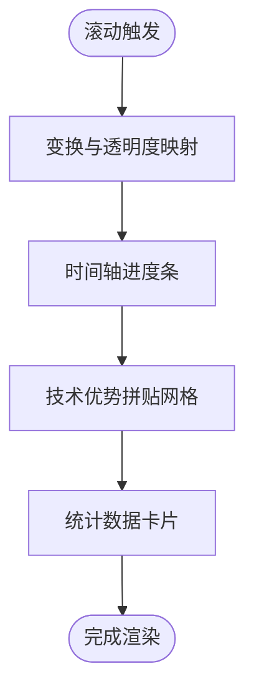

# 业务组件

<cite>
**本文引用的文件**
- [frontend/components/sections/Hero.tsx](file://frontend/components/sections/Hero.tsx)
- [frontend/components/sections/Products.tsx](file://frontend/components/sections/Products.tsx)
- [frontend/components/sections/ProductDetail.tsx](file://frontend/components/sections/ProductDetail.tsx)
- [frontend/components/sections/News.tsx](file://frontend/components/sections/News.tsx)
- [frontend/components/sections/NewsDetail.tsx](file://frontend/components/sections/NewsDetail.tsx)
- [frontend/components/sections/About.tsx](file://frontend/components/sections/About.tsx)
- [frontend/components/sections/Contact.tsx](file://frontend/components/sections/Contact.tsx)
- [frontend/components/sections/ProductRecommendations.tsx](file://frontend/components/sections/ProductRecommendations.tsx)
- [frontend/components/sections/ContactCard.tsx](file://frontend/components/sections/ContactCard.tsx)
- [frontend/types/product.ts](file://frontend/types/product.ts)
- [frontend/types/news.ts](file://frontend/types/news.ts)
- [frontend/lib/categories.ts](file://frontend/lib/categories.ts)
- [frontend/app/products/page.tsx](file://frontend/app/products/page.tsx)
- [frontend/app/news/page.tsx](file://frontend/app/news/page.tsx)
- [frontend/app/about/page.tsx](file://frontend/app/about/page.tsx)
</cite>

## 目录
1. [引言](#引言)
2. [项目结构](#项目结构)
3. [核心组件](#核心组件)
4. [架构总览](#架构总览)
5. [详细组件分析](#详细组件分析)
6. [依赖关系分析](#依赖关系分析)
7. [性能考量](#性能考量)
8. [故障排查指南](#故障排查指南)
9. [结论](#结论)
10. [附录](#附录)

## 引言
本文件面向前端与内容管理系统的业务组件，系统性梳理并说明以下模块：英雄区域组件、产品展示与详情组件、新闻资讯组件、关于页面组件、联系页面组件及其子组件（配套推荐、联系卡片）。文档重点解释设计理念、视觉效果实现、数据绑定、分类筛选、交互逻辑、内容渲染与相关推荐机制，并提供可配置参数与扩展方法，帮助开发者快速理解与二次开发。

## 项目结构
- 前端采用 Next.js 应用路由，页面组件位于 app/ 下，业务组件位于 components/sections/ 下，通用 UI 组件位于 components/ui/，类型定义位于 types/，工具函数位于 lib/。
- 页面组件通过异步获取 Strapi 数据，构建分类选项，再将数据传递给业务组件进行渲染。
- 业务组件内部使用客户端状态与动画库实现交互与视觉效果。

图表来源
- [frontend/app/products/page.tsx](file://frontend/app/products/page.tsx#L1-L50)
- [frontend/app/news/page.tsx](file://frontend/app/news/page.tsx#L1-L31)
- [frontend/app/about/page.tsx](file://frontend/app/about/page.tsx#L1-L18)
- [frontend/components/sections/Products.tsx](file://frontend/components/sections/Products.tsx#L1-L223)
- [frontend/components/sections/News.tsx](file://frontend/components/sections/News.tsx#L1-L299)
- [frontend/components/sections/About.tsx](file://frontend/components/sections/About.tsx#L1-L495)
- [frontend/components/sections/Contact.tsx](file://frontend/components/sections/Contact.tsx#L1-L254)
- [frontend/components/sections/ProductDetail.tsx](file://frontend/components/sections/ProductDetail.tsx#L1-L297)
- [frontend/components/sections/NewsDetail.tsx](file://frontend/components/sections/NewsDetail.tsx#L1-L333)
- [frontend/components/sections/ProductRecommendations.tsx](file://frontend/components/sections/ProductRecommendations.tsx#L1-L38)
- [frontend/components/sections/ContactCard.tsx](file://frontend/components/sections/ContactCard.tsx#L1-L39)
- [frontend/types/product.ts](file://frontend/types/product.ts#L1-L39)
- [frontend/types/news.ts](file://frontend/types/news.ts#L1-L44)
- [frontend/lib/categories.ts](file://frontend/lib/categories.ts#L1-L48)

章节来源
- [frontend/app/products/page.tsx](file://frontend/app/products/page.tsx#L1-L50)
- [frontend/app/news/page.tsx](file://frontend/app/news/page.tsx#L1-L31)
- [frontend/app/about/page.tsx](file://frontend/app/about/page.tsx#L1-L18)
- [frontend/components/sections/Products.tsx](file://frontend/components/sections/Products.tsx#L1-L223)
- [frontend/components/sections/News.tsx](file://frontend/components/sections/News.tsx#L1-L299)
- [frontend/components/sections/About.tsx](file://frontend/components/sections/About.tsx#L1-L495)
- [frontend/components/sections/Contact.tsx](file://frontend/components/sections/Contact.tsx#L1-L254)
- [frontend/components/sections/ProductDetail.tsx](file://frontend/components/sections/ProductDetail.tsx#L1-L297)
- [frontend/components/sections/NewsDetail.tsx](file://frontend/components/sections/NewsDetail.tsx#L1-L333)
- [frontend/components/sections/ProductRecommendations.tsx](file://frontend/components/sections/ProductRecommendations.tsx#L1-L38)
- [frontend/components/sections/ContactCard.tsx](file://frontend/components/sections/ContactCard.tsx#L1-L39)
- [frontend/types/product.ts](file://frontend/types/product.ts#L1-L39)
- [frontend/types/news.ts](file://frontend/types/news.ts#L1-L44)
- [frontend/lib/categories.ts](file://frontend/lib/categories.ts#L1-L48)

## 核心组件
- 英雄区域组件：负责首页首屏视觉呈现，包含渐变背景、粒子光效、滚动指示器与动态文案，强调品牌调性与产品价值。
- 产品展示组件：提供产品列表、分类筛选、搜索过滤、网格布局与过渡动画；支持“找不到产品”空态提示。
- 产品详情组件：包含面包屑导航、图片画廊、亮点展示、技术规格、工作原理示意、配套推荐与联系卡片。
- 新闻资讯组件：支持分类筛选、搜索、置顶文章、网格卡片、分页占位与空态提示。
- 新闻详情组件：支持 Markdown 渲染、Mermaid 图表、标签与分享、上一篇/下一篇文章导航、侧栏推荐与分类。
- 关于页面组件：企业历程时间轴、技术优势拼贴网格、统计数据、合作伙伴轮播与落地页 CTA。
- 联系页面组件：按业务类别划分的联系卡片、总部指引、交通方式、服务优势展示。
- 子组件：配套推荐、联系卡片（可配置标题、描述、按钮文本与电话）。

章节来源
- [frontend/components/sections/Hero.tsx](file://frontend/components/sections/Hero.tsx#L1-L138)
- [frontend/components/sections/Products.tsx](file://frontend/components/sections/Products.tsx#L1-L223)
- [frontend/components/sections/ProductDetail.tsx](file://frontend/components/sections/ProductDetail.tsx#L1-L297)
- [frontend/components/sections/News.tsx](file://frontend/components/sections/News.tsx#L1-L299)
- [frontend/components/sections/NewsDetail.tsx](file://frontend/components/sections/NewsDetail.tsx#L1-L333)
- [frontend/components/sections/About.tsx](file://frontend/components/sections/About.tsx#L1-L495)
- [frontend/components/sections/Contact.tsx](file://frontend/components/sections/Contact.tsx#L1-L254)
- [frontend/components/sections/ProductRecommendations.tsx](file://frontend/components/sections/ProductRecommendations.tsx#L1-L38)
- [frontend/components/sections/ContactCard.tsx](file://frontend/components/sections/ContactCard.tsx#L1-L39)

## 架构总览
页面组件通过异步请求获取数据与构建分类，然后将 props 传入业务组件。业务组件内部使用客户端状态与动画库实现交互与视觉效果。类型定义确保数据结构一致性，工具函数负责分类统计与映射。

图表来源
- [frontend/app/products/page.tsx](file://frontend/app/products/page.tsx#L1-L50)
- [frontend/app/news/page.tsx](file://frontend/app/news/page.tsx#L1-L31)
- [frontend/lib/categories.ts](file://frontend/lib/categories.ts#L1-L48)
- [frontend/types/product.ts](file://frontend/types/product.ts#L1-L39)
- [frontend/types/news.ts](file://frontend/types/news.ts#L1-L44)
- [frontend/components/sections/Products.tsx](file://frontend/components/sections/Products.tsx#L1-L223)
- [frontend/components/sections/News.tsx](file://frontend/components/sections/News.tsx#L1-L299)

## 详细组件分析

### 英雄区域组件（Hero）
- 设计理念
  - 以深蓝主色调营造科技感，叠加渐变与光晕背景，突出品牌色。
  - 使用粒子背景与滚动指示器增强沉浸感。
- 视觉效果实现
  - 背景图使用图片回退组件，优先级与填充策略保证视觉稳定。
  - 文案采用分组动画，配合“逐字入场”与“交错容器”实现层次感。
  - 功能标签与按钮组采用悬停发光与位移动画，强化交互反馈。
- 可配置参数
  - 标语徽章、主标题、副标题、描述、功能标签图标与文案、CTA 链接与文案。
- 扩展方法
  - 可通过主题色变量替换品牌色；可增加视频背景或 3D 元素；可接入滚动进度控制实现视差。

图表来源
- [frontend/components/sections/Hero.tsx](file://frontend/components/sections/Hero.tsx#L1-L138)

章节来源
- [frontend/components/sections/Hero.tsx](file://frontend/components/sections/Hero.tsx#L1-L138)

### 产品展示组件（Products）
- 数据绑定
  - 接收产品列表与分类选项，使用类型约束确保字段一致。
- 分类筛选与搜索
  - 本地状态维护当前分类与搜索词，使用记忆化计算过滤结果，避免重复渲染。
- 交互逻辑
  - 侧边栏 Sticky 定位，点击切换分类；输入框实时搜索；网格卡片支持布局动画与悬停缩放。
- 空态处理
  - 当无匹配结果时显示“未找到”的空态提示与引导。
- 可配置参数
  - 产品列表、分类选项（含 id/name/count）、搜索占位文案。
- 扩展方法
  - 支持分页加载（当前仅占位分页控件，可接入后端分页接口）；支持排序字段扩展；支持更多筛选维度（价格、评分等）。

图表来源
- [frontend/components/sections/Products.tsx](file://frontend/components/sections/Products.tsx#L1-L223)
- [frontend/lib/categories.ts](file://frontend/lib/categories.ts#L1-L48)
- [frontend/types/product.ts](file://frontend/types/product.ts#L1-L39)

章节来源
- [frontend/components/sections/Products.tsx](file://frontend/components/sections/Products.tsx#L1-L223)
- [frontend/lib/categories.ts](file://frontend/lib/categories.ts#L1-L48)
- [frontend/types/product.ts](file://frontend/types/product.ts#L1-L39)

### 产品详情组件（ProductDetail）
- 内容渲染
  - 面包屑导航、主图画廊、亮点图标块、企业级服务保障提示。
  - 技术规格表格、工作原理示意三步流程图。
- 相关产品推荐机制
  - 通过子组件渲染推荐项，支持图标、标题与描述的统一结构。
- 交互逻辑
  - 标签页切换（详情/规格/指南/下载），使用布局动画保持体验连贯。
- 可配置参数
  - 产品对象（名称、描述、图片、特性、规格、是否置顶等）、推荐项数组。
- 扩展方法
  - 支持更多标签页内容；可接入评论/问答模块；可扩展“定制方案”卡片。

图表来源
- [frontend/components/sections/ProductDetail.tsx](file://frontend/components/sections/ProductDetail.tsx#L1-L297)
- [frontend/components/sections/ProductRecommendations.tsx](file://frontend/components/sections/ProductRecommendations.tsx#L1-L38)
- [frontend/components/sections/ContactCard.tsx](file://frontend/components/sections/ContactCard.tsx#L1-L39)

章节来源
- [frontend/components/sections/ProductDetail.tsx](file://frontend/components/sections/ProductDetail.tsx#L1-L297)
- [frontend/components/sections/ProductRecommendations.tsx](file://frontend/components/sections/ProductRecommendations.tsx#L1-L38)
- [frontend/components/sections/ContactCard.tsx](file://frontend/components/sections/ContactCard.tsx#L1-L39)

### 新闻资讯组件（News）
- 列表展示
  - 置顶文章在“全部”且无搜索时优先展示；其余文章以网格卡片形式呈现。
- 分类筛选与搜索
  - 侧边栏分类与搜索框，支持实时过滤；空态提示与引导。
- 分页加载
  - 当结果超过阈值时显示分页控件（当前为占位，可接入后端分页）。
- 可配置参数
  - 新闻列表、置顶文章集合、分类选项、搜索占位文案。
- 扩展方法
  - 支持分页请求；支持更多筛选条件（作者、时间范围）；支持订阅入口。

图表来源
- [frontend/components/sections/News.tsx](file://frontend/components/sections/News.tsx#L1-L299)
- [frontend/lib/categories.ts](file://frontend/lib/categories.ts#L1-L48)
- [frontend/types/news.ts](file://frontend/types/news.ts#L1-L44)

章节来源
- [frontend/components/sections/News.tsx](file://frontend/components/sections/News.tsx#L1-L299)
- [frontend/lib/categories.ts](file://frontend/lib/categories.ts#L1-L48)
- [frontend/types/news.ts](file://frontend/types/news.ts#L1-L44)

### 新闻详情组件（NewsDetail）
- 内容渲染
  - 标题、元信息、封面图、摘要与 Markdown 正文渲染；支持 Mermaid 图表与表格样式。
- 相关推荐机制
  - 侧栏展示近期文章，排除当前文章；支持站内搜索与分类导航。
- 导航与交互
  - 上一篇/下一篇文章跳转；分享与标签展示。
- 可配置参数
  - 文章对象、全部新闻列表、近期文章集合、分类选项。
- 扩展方法
  - 支持评论系统；可接入阅读量统计；支持社交分享插件。

图表来源
- [frontend/components/sections/NewsDetail.tsx](file://frontend/components/sections/NewsDetail.tsx#L1-L333)

章节来源
- [frontend/components/sections/NewsDetail.tsx](file://frontend/components/sections/NewsDetail.tsx#L1-L333)

### 关于页面组件（About）
- 企业信息展示
  - 企业愿景、发展历程时间轴、技术优势拼贴网格、统计数据与合作伙伴展示。
- 团队介绍
  - 头像堆叠与研发占比增长趋势，体现团队规模与投入。
- 视觉效果
  - 使用滚动进度驱动的视差与进度条，营造科技感与沉浸体验。
- 可配置参数
  - 统计数据、里程碑事件、技术优势项、合作伙伴列表。
- 扩展方法
  - 支持更多历史节点；可接入团队成员详情；可扩展荣誉墙。

图表来源
- [frontend/components/sections/About.tsx](file://frontend/components/sections/About.tsx#L1-L495)

章节来源
- [frontend/components/sections/About.tsx](file://frontend/components/sections/About.tsx#L1-L495)

### 联系页面组件（Contact）
- 企业信息展示
  - 商务合作、技术支持、综合事务三大类别的联系卡片，每类包含图标、描述与联系方式。
- 地图集成
  - 总部指引包含地址、公共交通与自驾导航提示；展示总部照片与开放时间。
- 服务优势
  - 展示响应速度、专家驻场、终身维护与原厂质保等优势。
- 可配置参数
  - 联系类别数组（标题、描述、图标、详情）、服务优势数组、图片资源路径。
- 扩展方法
  - 可接入在线地图 SDK；支持表单提交；可扩展常见问题与 FAQ。

图表来源
- [frontend/components/sections/Contact.tsx](file://frontend/components/sections/Contact.tsx#L1-L254)

章节来源
- [frontend/components/sections/Contact.tsx](file://frontend/components/sections/Contact.tsx#L1-L254)

### 子组件：配套推荐（ProductRecommendations）
- 结构
  - 统一的图标 + 标题 + 描述结构，支持 hover 效果。
- 可配置参数
  - 推荐项数组（icon/title/desc）。
- 扩展方法
  - 可接入产品详情跳转；支持评分与销量展示。

章节来源
- [frontend/components/sections/ProductRecommendations.tsx](file://frontend/components/sections/ProductRecommendations.tsx#L1-L38)

### 子组件：联系卡片（ContactCard）
- 结构
  - 标题、描述、按钮与电话展示，支持 hover 缩放与颜色变化。
- 可配置参数
  - title/description/buttonText/phone。
- 扩展方法
  - 可接入在线客服；支持一键拨号；可扩展二维码。

章节来源
- [frontend/components/sections/ContactCard.tsx](file://frontend/components/sections/ContactCard.tsx#L1-L39)

## 依赖关系分析
- 类型依赖
  - 产品组件依赖产品类型定义；新闻组件依赖新闻类型定义。
- 工具函数依赖
  - 分类构建函数被产品与新闻页面复用，生成分类选项与计数。
- 页面到组件
  - 页面组件负责数据拉取与分类构建，业务组件负责渲染与交互。

图表来源
- [frontend/types/product.ts](file://frontend/types/product.ts#L1-L39)
- [frontend/types/news.ts](file://frontend/types/news.ts#L1-L44)
- [frontend/lib/categories.ts](file://frontend/lib/categories.ts#L1-L48)
- [frontend/components/sections/Products.tsx](file://frontend/components/sections/Products.tsx#L1-L223)
- [frontend/components/sections/News.tsx](file://frontend/components/sections/News.tsx#L1-L299)
- [frontend/app/products/page.tsx](file://frontend/app/products/page.tsx#L1-L50)
- [frontend/app/news/page.tsx](file://frontend/app/news/page.tsx#L1-L31)
- [frontend/components/sections/ProductDetail.tsx](file://frontend/components/sections/ProductDetail.tsx#L1-L297)
- [frontend/components/sections/ProductRecommendations.tsx](file://frontend/components/sections/ProductRecommendations.tsx#L1-L38)
- [frontend/components/sections/ContactCard.tsx](file://frontend/components/sections/ContactCard.tsx#L1-L39)

章节来源
- [frontend/types/product.ts](file://frontend/types/product.ts#L1-L39)
- [frontend/types/news.ts](file://frontend/types/news.ts#L1-L44)
- [frontend/lib/categories.ts](file://frontend/lib/categories.ts#L1-L48)
- [frontend/components/sections/Products.tsx](file://frontend/components/sections/Products.tsx#L1-L223)
- [frontend/components/sections/News.tsx](file://frontend/components/sections/News.tsx#L1-L299)
- [frontend/app/products/page.tsx](file://frontend/app/products/page.tsx#L1-L50)
- [frontend/app/news/page.tsx](file://frontend/app/news/page.tsx#L1-L31)
- [frontend/components/sections/ProductDetail.tsx](file://frontend/components/sections/ProductDetail.tsx#L1-L297)
- [frontend/components/sections/ProductRecommendations.tsx](file://frontend/components/sections/ProductRecommendations.tsx#L1-L38)
- [frontend/components/sections/ContactCard.tsx](file://frontend/components/sections/ContactCard.tsx#L1-L39)

## 性能考量
- 渲染性能
  - 使用记忆化与布局动画减少重排；网格卡片使用交错延迟入场降低首屏压力。
- 数据加载
  - 页面组件并发请求数据与分类，缩短首屏等待；新闻详情组件对近期文章做切片处理。
- 图片优化
  - 统一使用图片回退组件与填充策略，提升加载稳定性与视觉一致性。
- 交互流畅性
  - 动画库提供流畅过渡；滚动驱动的视差与进度条需注意性能监控。

## 故障排查指南
- 页面无法渲染
  - 检查页面组件的数据请求是否成功返回；确认类型定义与实际数据字段一致。
- 分类不显示或计数异常
  - 检查分类构建函数是否正确统计；确认分类 id 与数据中的分类字段一致。
- 新闻详情渲染异常
  - 检查 Markdown 插件配置与图片 URL 规范化；确认 Mermaid 代码块格式。
- 动画卡顿
  - 检查动画库版本与浏览器兼容性；适当降低动画复杂度或延迟入场。

## 结论
本项目通过清晰的页面-组件分层、强类型的类型定义与可复用的工具函数，实现了从首页英雄区到产品与新闻详情的完整业务闭环。组件具备良好的可配置性与扩展性，便于后续接入分页、搜索、表单与地图等能力。

## 附录
- 可配置参数清单
  - 产品展示：产品列表、分类选项、搜索占位文案。
  - 产品详情：产品对象、推荐项数组、侧栏卡片配置。
  - 新闻资讯：新闻列表、置顶文章、分类选项、搜索占位文案。
  - 新闻详情：文章对象、全部新闻、近期文章、分类选项。
  - 关于页面：统计数据、里程碑事件、技术优势、合作伙伴。
  - 联系页面：联系类别数组、服务优势数组、图片资源路径。
  - 子组件：配套推荐（推荐项数组）、联系卡片（标题/描述/按钮/电话）。