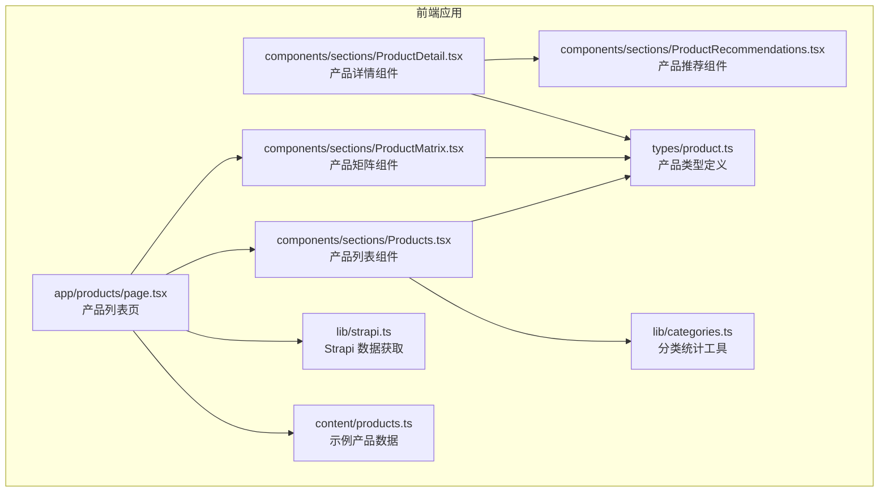
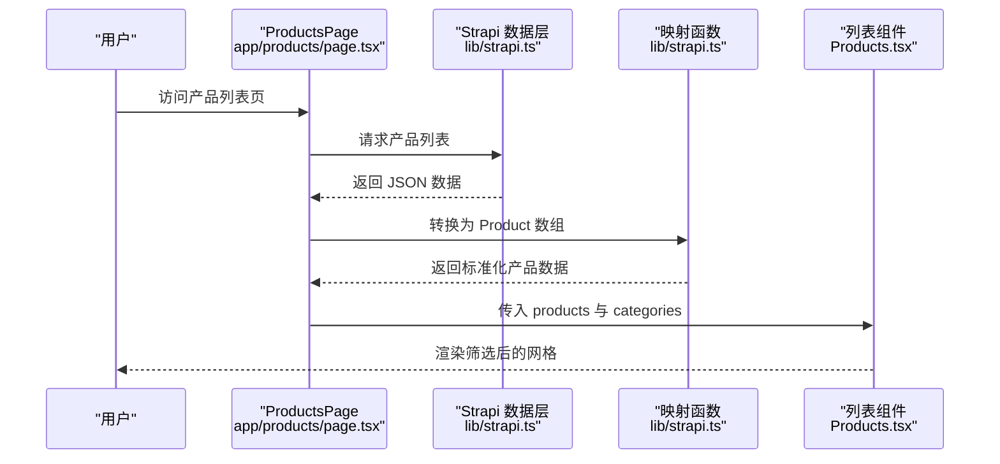
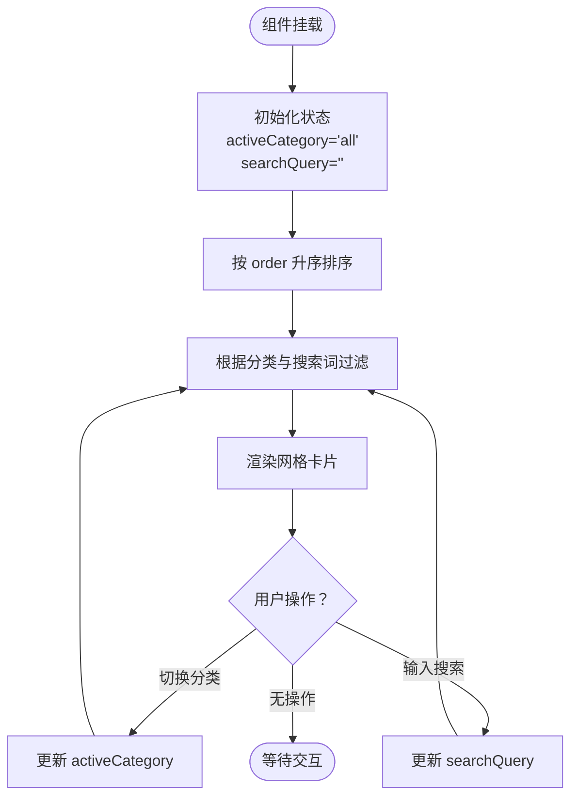
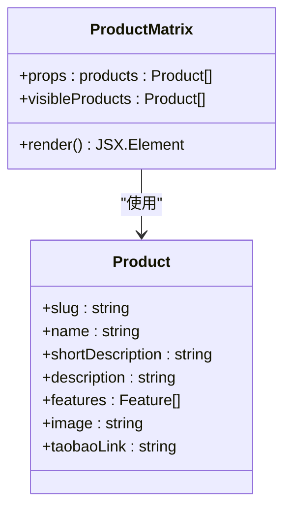
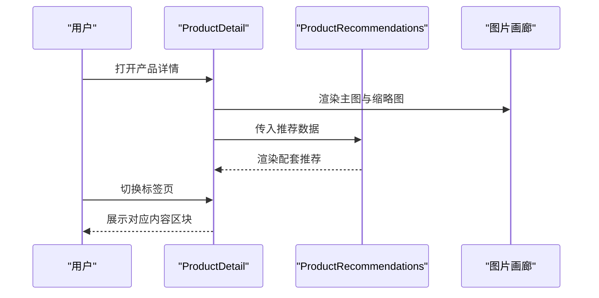
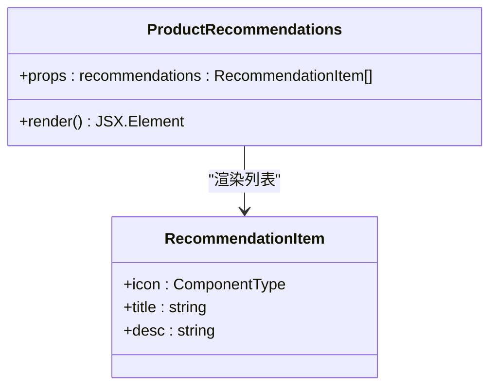
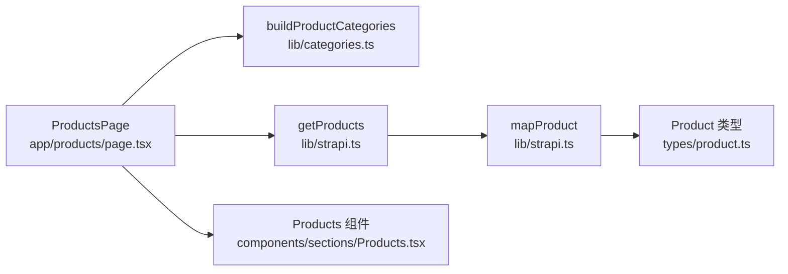

# 产品展示组件

<cite>
**本文档引用的文件**
- [frontend/components/sections/Products.tsx](file://frontend/components/sections/Products.tsx)
- [frontend/components/sections/ProductMatrix.tsx](file://frontend/components/sections/ProductMatrix.tsx)
- [frontend/components/sections/ProductDetail.tsx](file://frontend/components/sections/ProductDetail.tsx)
- [frontend/components/sections/ProductRecommendations.tsx](file://frontend/components/sections/ProductRecommendations.tsx)
- [frontend/types/product.ts](file://frontend/types/product.ts)
- [frontend/app/products/page.tsx](file://frontend/app/products/page.tsx)
- [frontend/lib/categories.ts](file://frontend/lib/categories.ts)
- [frontend/lib/strapi.ts](file://frontend/lib/strapi.ts)
- [frontend/content/products.ts](file://frontend/content/products.ts)
</cite>

## 目录
1. [简介](#简介)
2. [项目结构](#项目结构)
3. [核心组件](#核心组件)
4. [架构概览](#架构概览)
5. [详细组件分析](#详细组件分析)
6. [依赖关系分析](#依赖关系分析)
7. [性能考虑](#性能考虑)
8. [故障排除指南](#故障排除指南)
9. [结论](#结论)
10. [附录](#附录)

## 简介
本文件为产品展示组件的综合技术文档，围绕以下目标展开：产品列表组件的数据绑定、分类筛选与排序；产品矩阵组件的网格布局与响应式设计；产品详情组件的内容渲染、图片展示与相关推荐机制；产品推荐组件的算法实现与个性化展示；以及组件间的交互逻辑与状态管理方案。文档同时提供可配置参数与扩展方法，帮助开发者快速理解与二次开发。

## 项目结构
前端采用 Next.js 应用程序目录结构，产品相关页面与组件集中在 frontend 目录下，数据通过 Strapi 后端接口获取，并在构建时进行映射与类型转换。

**图表来源**
- [frontend/app/products/page.tsx](file://frontend/app/products/page.tsx#L1-L50)
- [frontend/components/sections/Products.tsx](file://frontend/components/sections/Products.tsx#L1-L223)
- [frontend/components/sections/ProductMatrix.tsx](file://frontend/components/sections/ProductMatrix.tsx#L1-L114)
- [frontend/components/sections/ProductDetail.tsx](file://frontend/components/sections/ProductDetail.tsx#L1-L297)
- [frontend/components/sections/ProductRecommendations.tsx](file://frontend/components/sections/ProductRecommendations.tsx#L1-L38)
- [frontend/types/product.ts](file://frontend/types/product.ts#L1-L39)
- [frontend/lib/strapi.ts](file://frontend/lib/strapi.ts#L1-L155)
- [frontend/lib/categories.ts](file://frontend/lib/categories.ts#L1-L48)
- [frontend/content/products.ts](file://frontend/content/products.ts#L1-L183)

**章节来源**
- [frontend/app/products/page.tsx](file://frontend/app/products/page.tsx#L1-L50)
- [frontend/lib/strapi.ts](file://frontend/lib/strapi.ts#L1-L155)
- [frontend/lib/categories.ts](file://frontend/lib/categories.ts#L1-L48)
- [frontend/types/product.ts](file://frontend/types/product.ts#L1-L39)

## 核心组件
本节概述四大核心组件的功能职责与交互关系：
- 产品列表组件（Products）：负责产品数据的本地筛选（分类与搜索）、排序与网格渲染，提供搜索框与分类侧栏导航。
- 产品矩阵组件（ProductMatrix）：以卡片网格形式展示精选产品，强调视觉层次与响应式布局。
- 产品详情组件（ProductDetail）：展示单个产品的完整信息，包括图片画廊、亮点摘要、技术规格、使用流程与相关推荐。
- 产品推荐组件（ProductRecommendations）：以图标+标题+描述的形式展示配套推荐内容，便于组合到详情页侧边栏。

**章节来源**
- [frontend/components/sections/Products.tsx](file://frontend/components/sections/Products.tsx#L1-L223)
- [frontend/components/sections/ProductMatrix.tsx](file://frontend/components/sections/ProductMatrix.tsx#L1-L114)
- [frontend/components/sections/ProductDetail.tsx](file://frontend/components/sections/ProductDetail.tsx#L1-L297)
- [frontend/components/sections/ProductRecommendations.tsx](file://frontend/components/sections/ProductRecommendations.tsx#L1-L38)

## 架构概览
产品数据从 Strapi 后端拉取，经由映射函数转换为前端可用的 Product 类型，再由页面组件传递给展示组件。页面层负责聚合数据与元信息生成，组件层负责 UI 渲染与用户交互。

**图表来源**
- [frontend/app/products/page.tsx](file://frontend/app/products/page.tsx#L43-L48)
- [frontend/lib/strapi.ts](file://frontend/lib/strapi.ts#L113-L118)
- [frontend/components/sections/Products.tsx](file://frontend/components/sections/Products.tsx#L21-L35)

**章节来源**
- [frontend/app/products/page.tsx](file://frontend/app/products/page.tsx#L1-L50)
- [frontend/lib/strapi.ts](file://frontend/lib/strapi.ts#L1-L155)

## 详细组件分析

### 产品列表组件（Products）
- 数据绑定与排序
  - 列表组件接收产品数组与分类选项，内部先按 order 字段升序排序，确保稳定顺序。
  - 过滤逻辑基于当前激活分类与搜索关键词，支持产品名称与描述的模糊匹配。
- 分类筛选
  - 侧边栏提供分类按钮，点击切换 activeCategory，触发过滤与重新渲染。
  - 分类计数来源于 buildProductCategories 的统计结果。
- 搜索功能
  - 输入框绑定受控状态，输入即刻触发过滤。
- 网格布局与动画
  - 使用 CSS Grid 实现响应式网格，移动端单列、平板双列。
  - 使用动画库实现卡片进入与布局切换的流畅过渡。
- 空状态处理
  - 当过滤结果为空时，显示“未找到相关产品”的提示。

**图表来源**
- [frontend/components/sections/Products.tsx](file://frontend/components/sections/Products.tsx#L21-L35)
- [frontend/lib/categories.ts](file://frontend/lib/categories.ts#L17-L31)

**章节来源**
- [frontend/components/sections/Products.tsx](file://frontend/components/sections/Products.tsx#L1-L223)
- [frontend/lib/categories.ts](file://frontend/lib/categories.ts#L1-L48)

### 产品矩阵组件（ProductMatrix）
- 网格布局与响应式设计
  - 采用 CSS Grid，1列（小屏）→2列（中屏）→3列（大屏），保证在不同设备上的良好体验。
- 视觉设计
  - 卡片带渐变边框与悬停阴影，图片使用遮罩渐变增强文字可读性。
  - 顶部色条与底部进度条体现品牌色彩与交互反馈。
- 内容呈现
  - 优先展示 shortDescription，其次取 features 的前两项拼接，最后回退到 description。
  - 提供“查看全部产品”入口跳转至完整列表页。

**图表来源**
- [frontend/components/sections/ProductMatrix.tsx](file://frontend/components/sections/ProductMatrix.tsx#L1-L114)
- [frontend/types/product.ts](file://frontend/types/product.ts#L13-L38)

**章节来源**
- [frontend/components/sections/ProductMatrix.tsx](file://frontend/components/sections/ProductMatrix.tsx#L1-L114)
- [frontend/types/product.ts](file://frontend/types/product.ts#L1-L39)

### 产品详情组件（ProductDetail）
- 内容渲染
  - 顶部面包屑与标题、评分与部署数量、产品描述等基础信息。
  - 亮点摘要区以图标+标签形式展示核心卖点。
  - 技术规格表格清晰罗列参数项与值。
- 图片展示
  - 主图与缩略图网格，支持悬停放大与选中态高亮。
  - 可选“热销旗舰款”徽标。
- 相关推荐机制
  - 通过 ProductRecommendations 组件展示配套推荐，便于交叉销售。
- 交互逻辑
  - 顶部标签页切换（details/specs/guide/download），使用布局动画保持视觉连贯。
  - 侧边栏组合 ContactCard 提供联系入口。

**图表来源**
- [frontend/components/sections/ProductDetail.tsx](file://frontend/components/sections/ProductDetail.tsx#L66-L296)
- [frontend/components/sections/ProductRecommendations.tsx](file://frontend/components/sections/ProductRecommendations.tsx#L13-L37)

**章节来源**
- [frontend/components/sections/ProductDetail.tsx](file://frontend/components/sections/ProductDetail.tsx#L1-L297)
- [frontend/components/sections/ProductRecommendations.tsx](file://frontend/components/sections/ProductRecommendations.tsx#L1-L38)

### 产品推荐组件（ProductRecommendations）
- 算法实现与个性化展示
  - 该组件本身不包含复杂算法，而是以纯展示组件形式接收推荐列表，逐条渲染图标、标题与描述。
  - 适合注入来自后端或业务规则计算出的相关产品集合。
- 可扩展性
  - 可通过 props 注入任意推荐项数组，便于与推荐系统、协同过滤或内容相似度算法结合。

**图表来源**
- [frontend/components/sections/ProductRecommendations.tsx](file://frontend/components/sections/ProductRecommendations.tsx#L1-L38)

**章节来源**
- [frontend/components/sections/ProductRecommendations.tsx](file://frontend/components/sections/ProductRecommendations.tsx#L1-L38)

## 依赖关系分析
- 页面到组件
  - ProductsPage 负责获取产品与分类数据，并将数据传递给 Products 组件。
- 组件到类型
  - 所有组件均依赖 Product 类型定义，确保数据结构一致性。
- 工具函数
  - buildProductCategories 用于统计各分类数量并生成分类选项。
  - getProducts/getFeaturedProducts 提供数据源，支持排序与分页。
- 数据映射
  - Strapi 返回的媒体字段需统一解析为完整 URL，避免相对路径问题。

**图表来源**
- [frontend/app/products/page.tsx](file://frontend/app/products/page.tsx#L43-L48)
- [frontend/lib/categories.ts](file://frontend/lib/categories.ts#L17-L31)
- [frontend/lib/strapi.ts](file://frontend/lib/strapi.ts#L113-L118)
- [frontend/types/product.ts](file://frontend/types/product.ts#L13-L38)

**章节来源**
- [frontend/app/products/page.tsx](file://frontend/app/products/page.tsx#L1-L50)
- [frontend/lib/categories.ts](file://frontend/lib/categories.ts#L1-L48)
- [frontend/lib/strapi.ts](file://frontend/lib/strapi.ts#L1-L155)
- [frontend/types/product.ts](file://frontend/types/product.ts#L1-L39)

## 性能考虑
- 列表筛选与排序
  - 使用 useMemo 缓存排序与过滤结果，减少重复计算，提升交互流畅度。
- 图片加载
  - 使用自定义图片组件以支持占位与降级策略，避免首屏阻塞。
- 动画与布局
  - 使用布局动画与过渡效果时注意层级与延迟，避免大量元素同时动画造成掉帧。
- 数据获取
  - 合理设置 revalidate 时间，平衡新鲜度与缓存命中率。
- 响应式布局
  - 使用 CSS Grid 与断点控制，避免过度使用 JavaScript 控制布局。

[本节为通用指导，无需特定文件引用]

## 故障排除指南
- 产品图片不显示
  - 检查媒体 URL 解析逻辑是否正确，确认 Strapi 返回的 URL 是否为相对路径。
  - 参考：[frontend/lib/strapi.ts](file://frontend/lib/strapi.ts#L35-L53)
- 分类计数不准确
  - 确认 buildProductCategories 的统计逻辑是否覆盖所有产品，检查分类枚举是否一致。
  - 参考：[frontend/lib/categories.ts](file://frontend/lib/categories.ts#L17-L31)
- 列表排序异常
  - 确认后端返回的 order 字段类型与数值，前端排序逻辑是否按升序处理。
  - 参考：[frontend/lib/strapi.ts](file://frontend/lib/strapi.ts#L113-L118)，[frontend/components/sections/Products.tsx](file://frontend/components/sections/Products.tsx#L25-L27)
- 推荐内容不显示
  - 确认传入 ProductRecommendations 的 recommendations 数组非空且结构正确。
  - 参考：[frontend/components/sections/ProductRecommendations.tsx](file://frontend/components/sections/ProductRecommendations.tsx#L9-L11)

**章节来源**
- [frontend/lib/strapi.ts](file://frontend/lib/strapi.ts#L35-L53)
- [frontend/lib/categories.ts](file://frontend/lib/categories.ts#L17-L31)
- [frontend/components/sections/Products.tsx](file://frontend/components/sections/Products.tsx#L25-L27)
- [frontend/components/sections/ProductRecommendations.tsx](file://frontend/components/sections/ProductRecommendations.tsx#L9-L11)

## 结论
本产品展示组件体系以清晰的分层设计实现了从数据获取、类型映射、页面编排到组件渲染的完整链路。通过本地筛选与排序、响应式网格布局、图片优化与动画过渡，提供了良好的用户体验。推荐组件以纯展示形式接入，便于与后端或业务算法灵活组合。建议在后续迭代中进一步完善推荐算法、增加缓存策略与错误边界，持续优化性能与可维护性。

[本节为总结性内容，无需特定文件引用]

## 附录

### 可配置参数与扩展方法
- 产品列表组件（Products）
  - 可配置项
    - products: Product[]（必填）
    - categories: { id: ProductCategory | 'all'; name: string; count: number }[]（必填）
  - 扩展建议
    - 支持多选分类、高级筛选条件（如价格区间、特性标签）。
    - 增加分页或无限滚动加载。
- 产品矩阵组件（ProductMatrix）
  - 可配置项
    - products: Product[]（必填）
  - 扩展建议
    - 支持自定义展示数量与排序策略。
    - 增加“查看更多”跳转逻辑。
- 产品详情组件（ProductDetail）
  - 可配置项
    - product: Product（必填）
  - 扩展建议
    - 增加评论区、视频介绍、下载资料等模块。
    - 将“配套推荐”改为异步加载，调用推荐服务。
- 产品推荐组件（ProductRecommendations）
  - 可配置项
    - recommendations: { icon: ComponentType; title: string; desc: string }[]（必填）
  - 扩展建议
    - 支持推荐权重与置信度展示。
    - 增加“了解更多”跳转或收藏功能。

**章节来源**
- [frontend/components/sections/Products.tsx](file://frontend/components/sections/Products.tsx#L16-L19)
- [frontend/components/sections/ProductMatrix.tsx](file://frontend/components/sections/ProductMatrix.tsx#L6-L8)
- [frontend/components/sections/ProductDetail.tsx](file://frontend/components/sections/ProductDetail.tsx#L12-L14)
- [frontend/components/sections/ProductRecommendations.tsx](file://frontend/components/sections/ProductRecommendations.tsx#L9-L11)

### 数据模型与类型定义
- 产品类型（Product）
  - 关键字段：slug、name、shortDescription、description、category、image、gallery、features、specifications、featured、order、taobaoLink
  - 参考：[frontend/types/product.ts](file://frontend/types/product.ts#L13-L38)

**章节来源**
- [frontend/types/product.ts](file://frontend/types/product.ts#L1-L39)