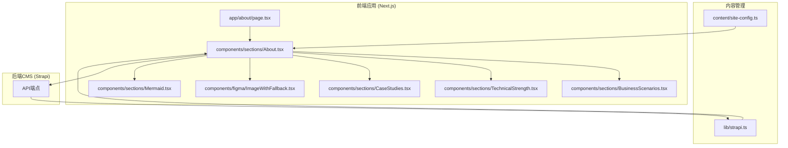
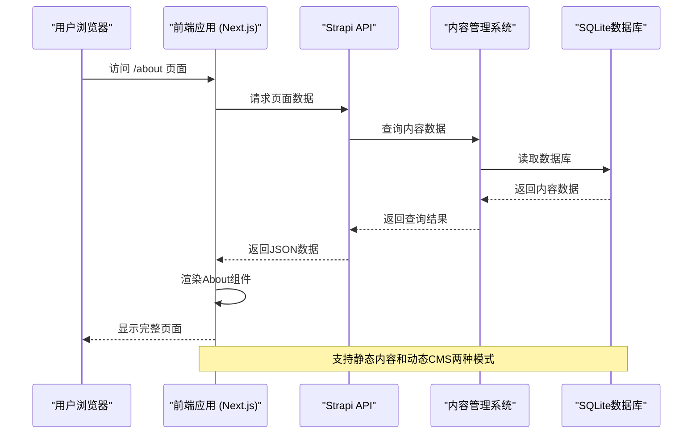
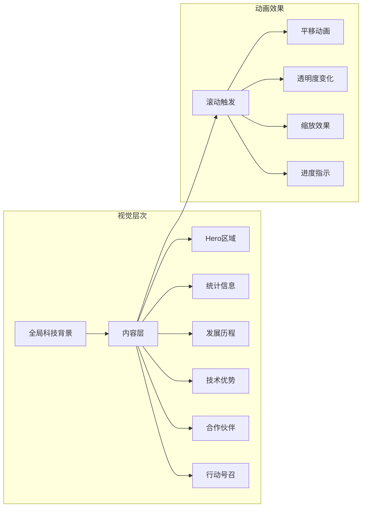
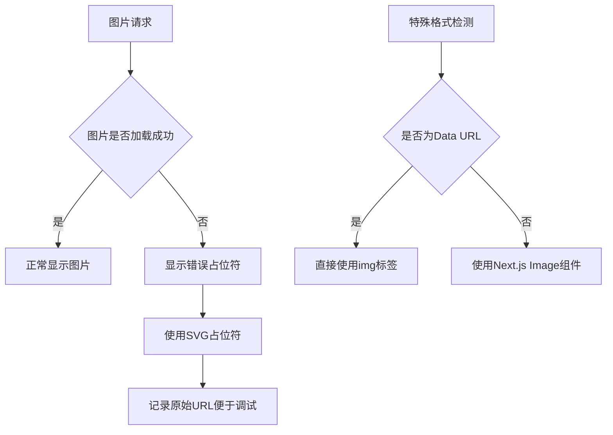
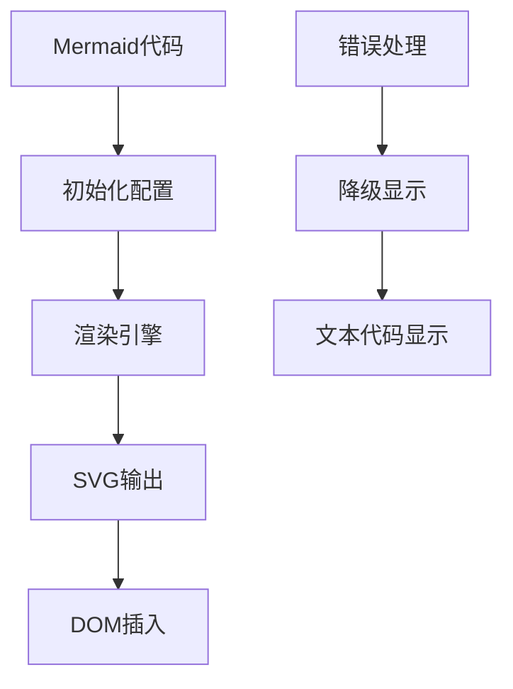
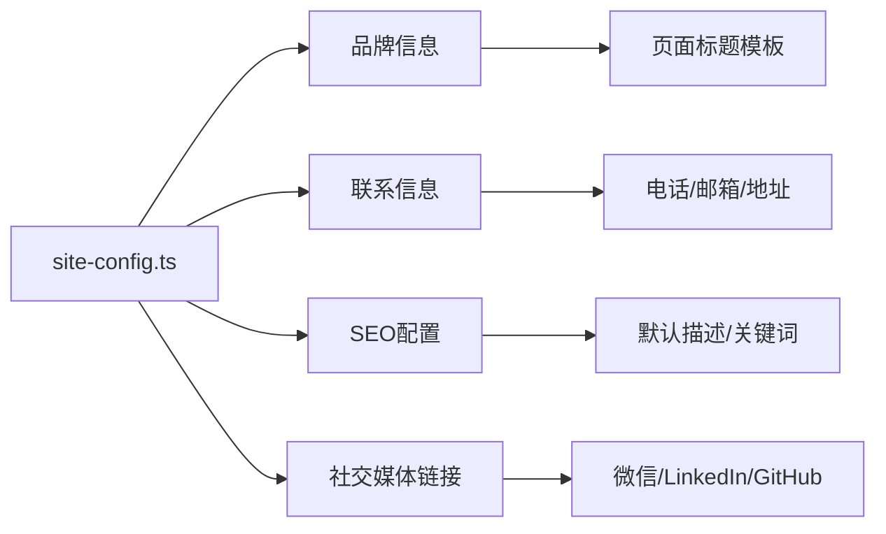
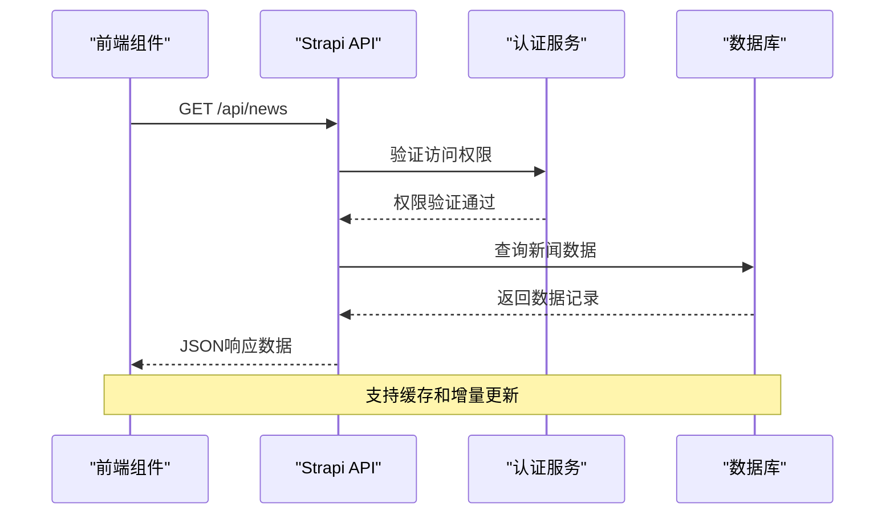
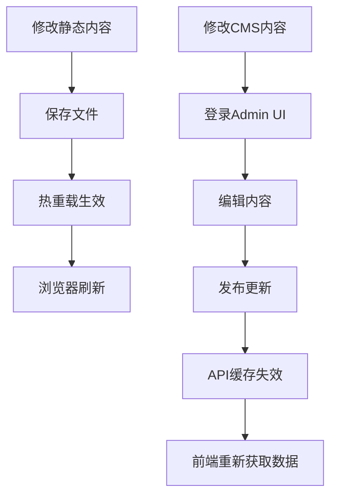

# 关于我们组件

<cite>
**本文档引用的文件**
- [About.tsx](file://frontend/components/sections/About.tsx)
- [BusinessScenarios.tsx](file://frontend/components/sections/BusinessScenarios.tsx)
- [TechnicalStrength.tsx](file://frontend/components/sections/TechnicalStrength.tsx)
- [CaseStudies.tsx](file://frontend/components/sections/CaseStudies.tsx)
- [page.tsx](file://frontend/app/about/page.tsx)
- [site-config.ts](file://frontend/content/site-config.ts)
- [strapi.ts](file://frontend/lib/strapi.ts)
- [ImageWithFallback.tsx](file://frontend/components/figma/ImageWithFallback.tsx)
- [Mermaid.tsx](file://frontend/components/sections/Mermaid.tsx)
- [README.md](file://README.md)
</cite>

## 目录
1. [简介](#简介)
2. [项目结构](#项目结构)
3. [核心组件](#核心组件)
4. [架构概览](#架构概览)
5. [详细组件分析](#详细组件分析)
6. [多媒体集成能力](#多媒体集成能力)
7. [内容管理与更新机制](#内容管理与更新机制)
8. [性能考虑](#性能考虑)
9. [故障排除指南](#故障排除指南)
10. [结论](#结论)

## 简介

"关于我们"组件是中创智控智能交通安全网站的核心展示模块，负责向访客传达公司的企业信息、品牌故事、技术实力和解决方案。该组件采用现代化的前端技术栈，结合丰富的动画效果和多媒体展示，为用户提供沉浸式的品牌体验。

该项目基于Next.js 15 App Router架构，采用前后端分离的设计模式，通过Strapi CMS提供动态内容管理能力。组件设计注重用户体验，运用Motion动画库实现流畅的滚动交互和视觉效果。

## 项目结构

项目采用模块化的组件架构，主要分为以下几个层次：

**图表来源**
- [page.tsx](file://frontend/app/about/page.tsx#L1-L18)
- [About.tsx](file://frontend/components/sections/About.tsx#L1-L495)

**章节来源**
- [README.md](file://README.md#L66-L227)

## 核心组件

"关于我们"组件由四个主要部分构成，每个部分都有其独特的功能和设计特点：

### About 组件
这是整个"关于我们"页面的核心组件，负责展示公司的整体形象和品牌故事。组件包含以下主要区域：
- **超现代英雄区域**：展示公司愿景和核心价值
- **统计信息展示**：突出公司的技术实力和成就
- **发展历程时间轴**：展示公司重要里程碑
- **核心技术优势**：详细介绍公司的技术特色
- **合作伙伴展示**：展示战略合作伙伴关系

### BusinessScenarios 组件
专注于展示公司的核心业务场景，涵盖高速公路、道路养护、景区交通和城市交通等多个应用场景。

### TechnicalStrength 组件
重点展示公司的技术实力和创新成果，包括核心技术、专利布局、协议兼容性和防护标准等方面。

### CaseStudies 组件
通过具体的案例研究展示公司的实际应用成果，包括标杆案例和合作模式介绍。

**章节来源**
- [About.tsx](file://frontend/components/sections/About.tsx#L54-L495)
- [BusinessScenarios.tsx](file://frontend/components/sections/BusinessScenarios.tsx#L33-L90)
- [TechnicalStrength.tsx](file://frontend/components/sections/TechnicalStrength.tsx#L37-L154)
- [CaseStudies.tsx](file://frontend/components/sections/CaseStudies.tsx#L33-L115)

## 架构概览

系统采用前后端分离的架构设计，通过清晰的职责分工实现高效的内容展示和管理：

**图表来源**
- [strapi.ts](file://frontend/lib/strapi.ts#L100-L155)
- [page.tsx](file://frontend/app/about/page.tsx#L1-L18)

**章节来源**
- [README.md](file://README.md#L229-L298)

## 详细组件分析

### About 组件深度分析

About组件是整个"关于我们"页面的核心，采用了多层次的设计理念和丰富的交互效果：

#### 视觉设计架构

组件采用了"科技感"和"品牌感"相结合的设计风格：

**图表来源**
- [About.tsx](file://frontend/components/sections/About.tsx#L63-L495)

#### 核心功能模块

1. **Hero区域**：展示公司名称、标语和核心价值主张
2. **统计信息模块**：展示公司的技术实力指标
3. **发展历程时间轴**：展示公司重要里程碑
4. **技术优势展示**：详细介绍核心技术特色
5. **合作伙伴展示**：展示战略合作伙伴关系

#### 动画交互设计

组件大量使用Motion动画库实现流畅的用户体验：

- **滚动动画**：根据用户滚动位置触发动画效果
- **悬停效果**：鼠标悬停时的交互反馈
- **进度指示**：时间轴的进度显示
- **渐变过渡**：不同主题之间的平滑切换

**章节来源**
- [About.tsx](file://frontend/components/sections/About.tsx#L54-L495)

### BusinessScenarios 组件分析

BusinessScenarios组件专注于展示公司的业务场景覆盖范围：

#### 业务场景分类

组件展示了四个主要的业务场景：

| 场景类别 | 图标 | 核心功能 | 应用价值 |
|---------|------|----------|----------|
| 高速公路安全管控 | 🚚 | 隧道/桥梁预警、施工防闯入、事故快速处置 | 提升道路通行安全性 |
| 道路养护作业安全 | 👷 | 人员防护、动态监控、声光预警 | 保障作业人员安全 |
| 景区交通分流预警 | ⛰️ | 停车场状态上报、路口分流 | 优化景区交通管理 |
| 城市交通风险防控 | 🏢 | 人员防护、动态监控、声光预警 | 改善城市交通环境 |

#### 设计特点

- **网格布局**：响应式网格系统适应不同屏幕尺寸
- **图片叠加**：图片与文字的巧妙结合
- **渐变装饰**：增强视觉层次感
- **悬停效果**：提供交互反馈

**章节来源**
- [BusinessScenarios.tsx](file://frontend/components/sections/BusinessScenarios.tsx#L33-L90)

### TechnicalStrength 组件分析

TechnicalStrength组件专门展示公司的技术实力和创新成果：

#### 技术优势分类

组件从四个方面展示公司的技术优势：

1. **核心技术**：高声压定向传播、毫米波雷达、AI边缘计算、北斗+GPS双模定位
2. **专利布局**：外观专利+实用新型专利的一体化设计
3. **协议兼容**：支持JT808、GB28181等行业标准
4. **防护标准**：IP55/IP56/IP65防护，适应极端环境

#### 视觉设计特色

- **深色主题**：营造科技感和专业感
- **渐变背景**：动态的几何图案背景
- **发光效果**：增强技术感和未来感
- **动画装饰**：球形光点和六边形图案

**章节来源**
- [TechnicalStrength.tsx](file://frontend/components/sections/TechnicalStrength.tsx#L37-L154)

### CaseStudies 组件分析

CaseStudies组件通过具体的案例展示公司的实际应用成果：

#### 标杆案例展示

组件展示了三个重要的成功案例：

1. **山西交控集团**：高速养护施工动态监管
2. **广河高速**：预警路锥与预警精灵联动
3. **广东地区行人摩托车防闯入项目**：智能安全预警系统

#### 合作模式介绍

组件还介绍了三种主要的合作模式：
- 联合开发：与防撞车制造商联合开发
- 方案定制：为交通管理部门提供闭环解决方案
- 设备供应：为养护企业提供模块化设备集群

**章节来源**
- [CaseStudies.tsx](file://frontend/components/sections/CaseStudies.tsx#L33-L115)

## 多媒体集成能力

系统具备强大的多媒体集成能力，支持多种类型的媒体内容展示：

### 图片处理系统

#### ImageWithFallback 组件

**图表来源**
- [ImageWithFallback.tsx](file://frontend/components/figma/ImageWithFallback.tsx#L21-L85)

#### 图片优化特性

- **Next.js Image优化**：自动优化图片大小和格式
- **懒加载支持**：延迟加载非首屏图片
- **响应式图片**：根据屏幕尺寸选择合适分辨率
- **格式支持**：支持WebP、AVIF等现代图片格式

### 视频集成能力

虽然当前版本主要使用静态图片，但系统架构支持视频内容的集成：

- **HTML5 Video标签**：原生视频播放支持
- **YouTube/Vimeo嵌入**：第三方视频平台集成
- **视频优化**：自动压缩和格式转换
- **播放控制**：自定义播放器界面

### 图表展示系统

#### Mermaid 图表组件

**图表来源**
- [Mermaid.tsx](file://frontend/components/sections/Mermaid.tsx#L10-L58)

#### 支持的图表类型

- **流程图**：展示业务流程和技术架构
- **序列图**：展示系统交互流程
- **类图**：展示对象关系
- **状态图**：展示状态转换
- **甘特图**：展示项目时间安排

**章节来源**
- [Mermaid.tsx](file://frontend/components/sections/Mermaid.tsx#L1-L58)

## 内容管理与更新机制

系统提供灵活的内容管理机制，支持静态内容和动态CMS两种模式：

### 静态内容模式

#### 站点配置管理

**图表来源**
- [site-config.ts](file://frontend/content/site-config.ts#L2-L47)

#### 内容数据结构

系统采用TypeScript接口定义确保内容的类型安全：

- **产品内容**：名称、描述、规格、图片等
- **新闻内容**：标题、摘要、正文、作者等
- **解决方案**：行业分类、亮点、技术参数等

### 动态内容模式（Strapi CMS）

#### API集成架构

**图表来源**
- [strapi.ts](file://frontend/lib/strapi.ts#L100-L155)

#### 数据映射机制

系统提供统一的数据映射函数处理不同来源的内容：

- **媒体URL解析**：统一处理本地和远程媒体资源
- **内容类型转换**：将CMS内容转换为前端可用格式
- **默认值处理**：为空值提供合理的默认值
- **类型安全保证**：通过TypeScript确保数据完整性

### 内容更新流程

#### 开发环境更新

#### 生产环境部署

- **静态内容**：通过CDN分发，支持版本控制
- **动态内容**：通过API接口实时获取，支持缓存策略
- **媒体资源**：自动优化和压缩，支持CDN加速

**章节来源**
- [strapi.ts](file://frontend/lib/strapi.ts#L1-L155)
- [README.md](file://README.md#L264-L298)

## 性能考虑

系统在设计时充分考虑了性能优化，采用多种策略提升用户体验：

### 前端性能优化

#### 图片优化策略

- **懒加载**：非首屏图片延迟加载
- **响应式图片**：根据设备像素比选择合适尺寸
- **格式优化**：自动选择最优图片格式
- **缓存策略**：利用浏览器缓存减少重复加载

#### 动画性能优化

- **GPU加速**：使用transform和opacity属性
- **节流控制**：滚动事件的性能优化
- **内存管理**：及时清理动画监听器
- **渲染优化**：避免强制同步布局

### 后端性能优化

#### API性能优化

- **缓存机制**：合理设置缓存头和缓存策略
- **分页查询**：大数据集的分页处理
- **批量请求**：减少HTTP请求数量
- **压缩传输**：启用Gzip压缩

#### 数据库优化

- **索引优化**：为常用查询字段建立索引
- **查询优化**：避免N+1查询问题
- **连接池**：复用数据库连接
- **读写分离**：分离读写操作

## 故障排除指南

### 常见问题诊断

#### 图片加载失败

**症状**：图片显示为占位符或加载错误

**可能原因**：
- 图片路径错误
- 网络连接问题
- 图片格式不支持
- 权限不足

**解决方案**：
1. 检查图片URL是否正确
2. 验证图片文件是否存在
3. 查看浏览器开发者工具的网络面板
4. 确认图片格式是否被支持

#### 动画效果异常

**症状**：滚动动画不流畅或失效

**可能原因**：
- Motion库版本冲突
- 浏览器兼容性问题
- 移动设备性能不足
- CSS冲突

**解决方案**：
1. 检查浏览器控制台是否有JavaScript错误
2. 验证CSS类名是否正确
3. 测试在不同设备上的表现
4. 调整动画性能设置

#### API请求失败

**症状**：页面内容加载失败或显示空白

**可能原因**：
- 后端服务不可用
- 网络连接问题
- CORS配置错误
- 认证令牌过期

**解决方案**：
1. 检查后端服务状态
2. 验证API端点URL
3. 查看网络请求的详细信息
4. 重新生成认证令牌

### 调试工具使用

#### 浏览器开发者工具

- **Elements面板**：检查DOM结构和CSS样式
- **Console面板**：查看JavaScript错误和警告
- **Network面板**：监控网络请求和响应
- **Performance面板**：分析页面性能瓶颈

#### 前端调试技巧

- **React DevTools**：检查组件状态和props
- **Motion调试**：查看动画状态和性能
- **TypeScript检查**：验证类型定义和接口实现

**章节来源**
- [README.md](file://README.md#L624-L800)

## 结论

"关于我们"组件通过精心设计的架构和丰富的功能，成功地展现了中创智控作为智能交通安全领域领导者的品牌形象。组件不仅在视觉上具有强烈的科技感和专业感，更重要的是通过多媒体集成和交互设计，为用户提供了沉浸式的品牌体验。

系统的核心优势包括：

1. **技术架构先进**：基于Next.js 15和React 18，采用现代化的前端技术栈
2. **多媒体集成丰富**：支持图片、视频、图表等多种媒体形式
3. **内容管理灵活**：支持静态内容和动态CMS两种模式
4. **性能优化完善**：通过多种策略确保良好的用户体验
5. **可扩展性强**：模块化的组件设计便于功能扩展和维护

未来的发展方向包括：
- 增强交互体验，提供更多个性化的用户定制选项
- 扩展多媒体支持，增加视频和3D模型展示能力
- 优化移动端体验，提升移动设备的浏览效果
- 加强数据分析功能，更好地了解用户行为和偏好

通过持续的技术创新和内容优化，"关于我们"组件将继续为中创智控的品牌建设提供强有力的支持。