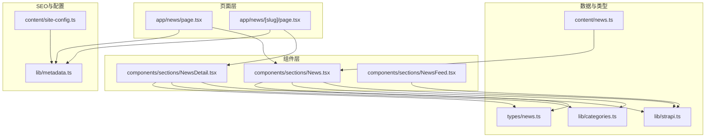
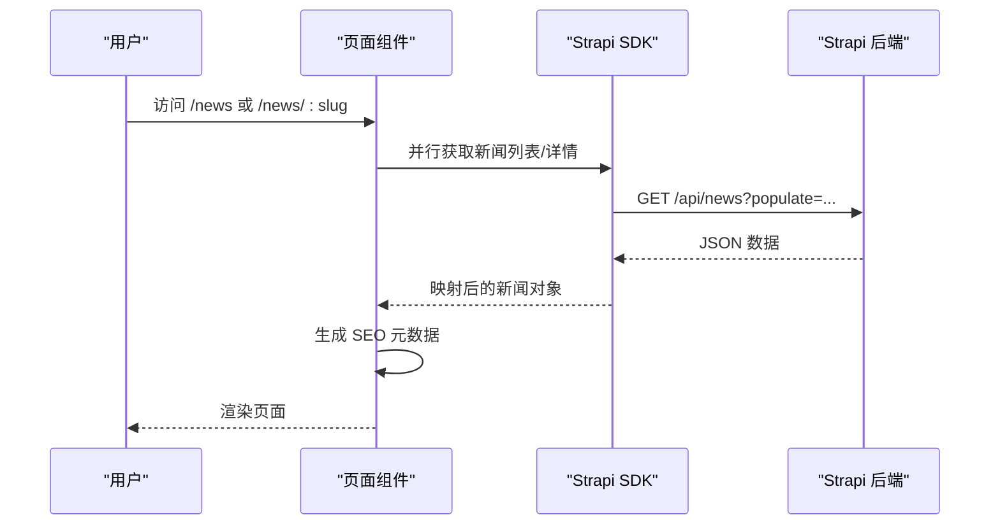
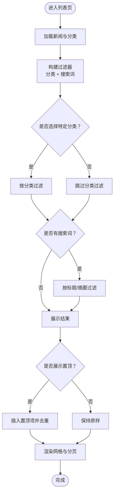
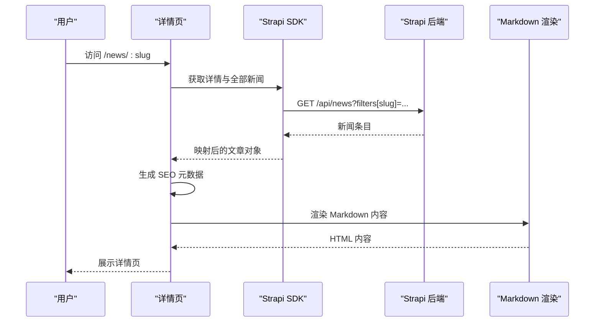
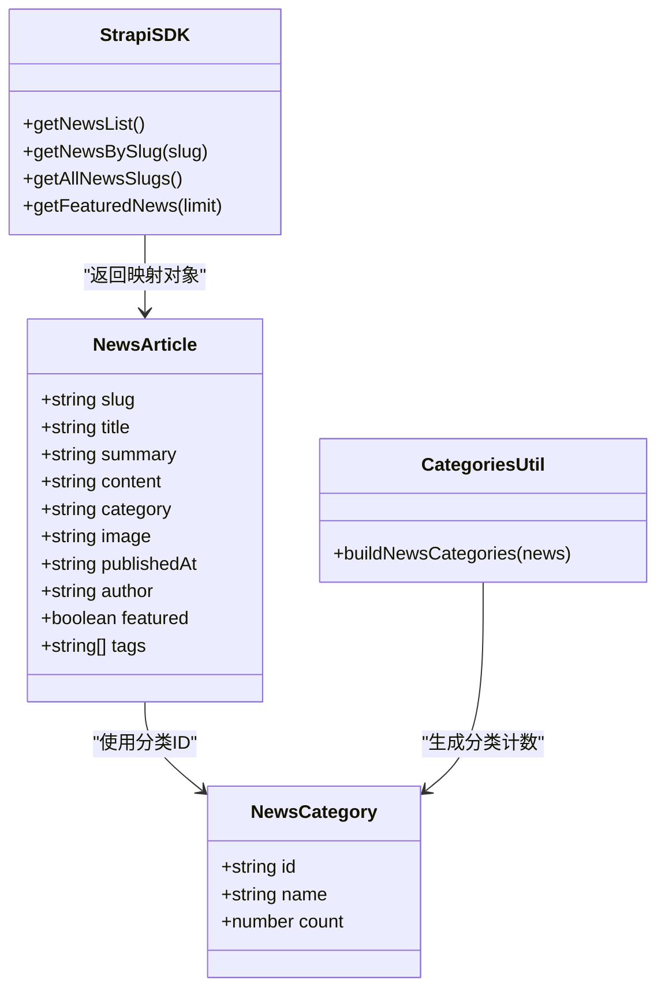

# 新闻资讯组件

<cite>
**本文引用的文件**
- [frontend/components/sections/News.tsx](file://frontend/components/sections/News.tsx)
- [frontend/components/sections/NewsDetail.tsx](file://frontend/components/sections/NewsDetail.tsx)
- [frontend/components/sections/NewsFeed.tsx](file://frontend/components/sections/NewsFeed.tsx)
- [frontend/app/news/page.tsx](file://frontend/app/news/page.tsx)
- [frontend/app/news/[slug]/page.tsx](file://frontend/app/news/[slug]/page.tsx)
- [frontend/types/news.ts](file://frontend/types/news.ts)
- [frontend/lib/strapi.ts](file://frontend/lib/strapi.ts)
- [frontend/lib/categories.ts](file://frontend/lib/categories.ts)
- [frontend/content/news.ts](file://frontend/content/news.ts)
- [frontend/content/site-config.ts](file://frontend/content/site-config.ts)
- [frontend/lib/metadata.ts](file://frontend/lib/metadata.ts)
- [frontend/app/news/loading.tsx](file://frontend/app/news/loading.tsx)
- [frontend/app/news/error.tsx](file://frontend/app/news/error.tsx)
- [frontend/app/news/[slug]/loading.tsx](file://frontend/app/news/[slug]/loading.tsx)
- [backend/src/api/news-item/controllers/news-item.ts](file://backend/src/api/news-item/controllers/news-item.ts)
</cite>

## 目录
1. [简介](#简介)
2. [项目结构](#项目结构)
3. [核心组件](#核心组件)
4. [架构总览](#架构总览)
5. [组件详解](#组件详解)
6. [依赖关系分析](#依赖关系分析)
7. [性能与缓存策略](#性能与缓存策略)
8. [故障排查指南](#故障排查指南)
9. [结论](#结论)
10. [附录](#附录)

## 简介
本文件系统化梳理新闻资讯组件的前端实现，涵盖新闻列表的分页加载、搜索过滤与分类筛选，新闻详情的内容渲染、SEO优化与分享功能，以及新闻订阅组件的用户交互与数据同步机制。同时总结缓存策略、性能优化方案，并给出可配置参数与扩展方法，包括API集成与数据源配置。

## 项目结构
前端采用Next.js App Router，页面级组件负责数据拉取与SEO元数据生成，业务组件负责UI渲染与交互逻辑；数据层通过Strapi SDK封装请求与映射；类型定义与分类工具提供类型安全与分类统计能力。

图表来源
- [frontend/app/news/page.tsx](file://frontend/app/news/page.tsx#L1-L31)
- [frontend/app/news/[slug]/page.tsx](file://frontend/app/news/[slug]/page.tsx#L1-L71)
- [frontend/components/sections/News.tsx](file://frontend/components/sections/News.tsx#L1-L299)
- [frontend/components/sections/NewsDetail.tsx](file://frontend/components/sections/NewsDetail.tsx#L1-L333)
- [frontend/components/sections/NewsFeed.tsx](file://frontend/components/sections/NewsFeed.tsx#L1-L141)
- [frontend/lib/strapi.ts](file://frontend/lib/strapi.ts#L1-L155)
- [frontend/lib/categories.ts](file://frontend/lib/categories.ts#L1-L48)
- [frontend/types/news.ts](file://frontend/types/news.ts#L1-L44)
- [frontend/content/news.ts](file://frontend/content/news.ts#L1-L239)
- [frontend/lib/metadata.ts](file://frontend/lib/metadata.ts#L1-L60)
- [frontend/content/site-config.ts](file://frontend/content/site-config.ts#L1-L47)

章节来源
- [frontend/app/news/page.tsx](file://frontend/app/news/page.tsx#L1-L31)
- [frontend/app/news/[slug]/page.tsx](file://frontend/app/news/[slug]/page.tsx#L1-L71)
- [frontend/components/sections/News.tsx](file://frontend/components/sections/News.tsx#L1-L299)
- [frontend/components/sections/NewsDetail.tsx](file://frontend/components/sections/NewsDetail.tsx#L1-L333)
- [frontend/components/sections/NewsFeed.tsx](file://frontend/components/sections/NewsFeed.tsx#L1-L141)
- [frontend/lib/strapi.ts](file://frontend/lib/strapi.ts#L1-L155)
- [frontend/lib/categories.ts](file://frontend/lib/categories.ts#L1-L48)
- [frontend/types/news.ts](file://frontend/types/news.ts#L1-L44)
- [frontend/content/news.ts](file://frontend/content/news.ts#L1-L239)
- [frontend/lib/metadata.ts](file://frontend/lib/metadata.ts#L1-L60)
- [frontend/content/site-config.ts](file://frontend/content/site-config.ts#L1-L47)

## 核心组件
- 新闻列表组件：支持分类筛选、关键词搜索、置顶推荐、分页导航与空状态展示。
- 新闻详情组件：支持Markdown内容渲染、Mermaid图示、标签与分享、前后文导航、侧边栏检索与推荐。
- 新闻动态展示组件：用于首页或入口的新闻动态卡片流，支持懒加载与查看更多跳转。
- 页面容器：负责异步数据拉取、SEO元数据生成、错误与加载占位处理。

章节来源
- [frontend/components/sections/News.tsx](file://frontend/components/sections/News.tsx#L1-L299)
- [frontend/components/sections/NewsDetail.tsx](file://frontend/components/sections/NewsDetail.tsx#L1-L333)
- [frontend/components/sections/NewsFeed.tsx](file://frontend/components/sections/NewsFeed.tsx#L1-L141)
- [frontend/app/news/page.tsx](file://frontend/app/news/page.tsx#L1-L31)
- [frontend/app/news/[slug]/page.tsx](file://frontend/app/news/[slug]/page.tsx#L1-L71)

## 架构总览
前端通过App Router页面组件调用Strapi SDK获取数据，组件内部进行本地筛选与排序，页面组件负责SEO元数据生成与静态参数生成。类型系统保证数据结构一致性，分类工具提供分类计数与标签映射。

图表来源
- [frontend/app/news/page.tsx](file://frontend/app/news/page.tsx#L25-L30)
- [frontend/app/news/[slug]/page.tsx](file://frontend/app/news/[slug]/page.tsx#L48-L70)
- [frontend/lib/strapi.ts](file://frontend/lib/strapi.ts#L127-L147)

## 组件详解

### 新闻列表组件（分页加载、搜索过滤、分类筛选）
- 分类筛选
  - 使用状态管理当前选中的分类ID，基于分类ID过滤新闻列表。
  - 分类计数来源于分类工具，支持“全部”与具体分类的切换。
- 搜索过滤
  - 通过输入框实时捕获关键词，对标题与摘要进行大小写无关匹配。
  - 使用记忆化计算确保在关键词变化时才重新过滤。
- 置顶推荐
  - 在“全部”且无搜索关键词时展示置顶文章卡片。
  - 置顶文章从置顶列表中选取，其余文章排除该条目。
- 分页导航
  - 当过滤后结果超过阈值时显示分页控件，当前页高亮。
- 空状态
  - 无结果时展示提示与建议文案，引导用户调整筛选条件。

图表来源
- [frontend/components/sections/News.tsx](file://frontend/components/sections/News.tsx#L16-L40)
- [frontend/components/sections/News.tsx](file://frontend/components/sections/News.tsx#L22-L34)
- [frontend/components/sections/News.tsx](file://frontend/components/sections/News.tsx#L151-L197)
- [frontend/components/sections/News.tsx](file://frontend/components/sections/News.tsx#L220-L235)

章节来源
- [frontend/components/sections/News.tsx](file://frontend/components/sections/News.tsx#L10-L40)
- [frontend/lib/categories.ts](file://frontend/lib/categories.ts#L33-L47)

### 新闻详情组件（内容渲染、SEO优化、分享）
- 内容渲染
  - 使用Markdown渲染器解析正文，启用表格与HTML原生渲染插件。
  - 图片组件支持URL规范化与响应式尺寸，Mermaid代码块渲染为可视化图表。
  - 标签与作者、发布时间等元信息展示。
- SEO优化
  - 页面组件动态生成标题、描述、OpenGraph与Twitter卡片元数据。
  - 支持文章类型、发布时间、作者与标签字段，增强社交分享效果。
- 分享与导航
  - 提供社交分享按钮占位，前后文导航链接便于用户继续阅读。
  - 侧边栏包含站内搜索、分类导航与推荐阅读列表。

图表来源
- [frontend/app/news/[slug]/page.tsx](file://frontend/app/news/[slug]/page.tsx#L23-L46)
- [frontend/components/sections/NewsDetail.tsx](file://frontend/components/sections/NewsDetail.tsx#L123-L169)
- [frontend/lib/strapi.ts](file://frontend/lib/strapi.ts#L141-L147)

章节来源
- [frontend/components/sections/NewsDetail.tsx](file://frontend/components/sections/NewsDetail.tsx#L13-L19)
- [frontend/app/news/[slug]/page.tsx](file://frontend/app/news/[slug]/page.tsx#L23-L46)
- [frontend/lib/strapi.ts](file://frontend/lib/strapi.ts#L78-L98)

### 新闻订阅组件（用户交互与数据同步）
- 用户交互
  - 侧边栏展示订阅卡片，包含二维码与引导文案，增强用户留存与传播。
- 数据同步
  - 订阅数据来源于本地内容文件与图片资源，无需后端接口即可展示。
  - 若需接入外部订阅服务，可在现有卡片中替换为表单提交与回调逻辑。

章节来源
- [frontend/components/sections/News.tsx](file://frontend/components/sections/News.tsx#L126-L143)
- [frontend/content/news.ts](file://frontend/content/news.ts#L1-L239)

### 新闻动态展示组件（首页入口）
- 用于首页快速展示最新新闻动态，支持懒加载与查看更多跳转。
- 卡片包含封面图、分类标签、标题、摘要与跳转按钮。

章节来源
- [frontend/components/sections/NewsFeed.tsx](file://frontend/components/sections/NewsFeed.tsx#L1-L141)

## 依赖关系分析
- 类型系统
  - 新闻条目与分类类型定义清晰，确保组件间数据契约一致。
- 数据映射
  - Strapi SDK统一处理媒体URL规范化与数据映射，屏蔽后端差异。
- 分类工具
  - 基于新闻数据统计分类计数，供筛选面板使用。
- 页面SEO
  - 页面组件在构建期/运行期生成SEO元数据，提升搜索引擎可见性。

图表来源
- [frontend/types/news.ts](file://frontend/types/news.ts#L16-L43)
- [frontend/lib/strapi.ts](file://frontend/lib/strapi.ts#L78-L98)
- [frontend/lib/categories.ts](file://frontend/lib/categories.ts#L33-L47)

章节来源
- [frontend/types/news.ts](file://frontend/types/news.ts#L1-L44)
- [frontend/lib/strapi.ts](file://frontend/lib/strapi.ts#L1-L155)
- [frontend/lib/categories.ts](file://frontend/lib/categories.ts#L1-L48)

## 性能与缓存策略
- 缓存与预取
  - Strapi SDK使用Next.js的缓存控制参数进行数据拉取，支持增量更新与缓存失效。
  - 页面组件并行拉取多个数据源，缩短首屏等待时间。
- 内容渲染
  - Markdown渲染器按需加载插件，避免不必要的包体积。
  - 图片组件支持响应式尺寸与懒加载，提升页面加载性能。
- 本地过滤
  - 列表组件使用记忆化计算与本地数组过滤，减少重复渲染。
- 错误与加载
  - 提供专用的加载与错误占位组件，改善用户体验。

章节来源
- [frontend/lib/strapi.ts](file://frontend/lib/strapi.ts#L100-L111)
- [frontend/app/news/page.tsx](file://frontend/app/news/page.tsx#L25-L30)
- [frontend/app/news/[slug]/page.tsx](file://frontend/app/news/[slug]/page.tsx#L50-L57)
- [frontend/app/news/loading.tsx](file://frontend/app/news/loading.tsx#L1-L14)
- [frontend/app/news/[slug]/loading.tsx](file://frontend/app/news/[slug]/loading.tsx#L1-L14)
- [frontend/app/news/error.tsx](file://frontend/app/news/error.tsx#L1-L57)

## 故障排查指南
- 数据拉取失败
  - 检查Strapi服务地址与网络连通性，确认返回状态与JSON格式。
  - 查看页面错误边界组件输出的错误信息并重试。
- SEO元数据异常
  - 确认页面组件正确生成标题、描述与OG图像，检查分类与标签字段。
- Markdown渲染问题
  - 检查内容字段是否包含合法的Markdown语法，确认插件配置与自定义组件映射。
- 分类与筛选异常
  - 核对分类ID与名称映射，确保分类计数统计正确。

章节来源
- [frontend/lib/strapi.ts](file://frontend/lib/strapi.ts#L105-L111)
- [frontend/app/news/error.tsx](file://frontend/app/news/error.tsx#L13-L15)
- [frontend/app/news/[slug]/page.tsx](file://frontend/app/news/[slug]/page.tsx#L23-L46)

## 结论
该新闻资讯组件以清晰的分层架构实现了列表筛选、详情渲染与SEO优化，配合本地缓存与并行数据拉取提升了性能与体验。通过类型系统与分类工具确保了数据一致性与可维护性。后续可扩展分页加载、订阅服务与评论系统，进一步完善内容生态。

## 附录

### 可配置参数与扩展方法
- Strapi服务地址
  - 通过环境变量配置，影响媒体URL拼接与API请求。
  - 参考路径：[frontend/lib/strapi.ts](file://frontend/lib/strapi.ts#L4)
- SEO默认配置
  - 站点名称、描述、关键词、OG图像与站点URL，用于生成统一的元数据。
  - 参考路径：[frontend/content/site-config.ts](file://frontend/content/site-config.ts#L22-L29)
- 分类标签映射
  - 新闻分类ID与显示名称映射，用于筛选面板与详情页展示。
  - 参考路径：[frontend/lib/categories.ts](file://frontend/lib/categories.ts#L10-L15)
- Markdown渲染配置
  - 插件与组件映射，支持Mermaid与表格等扩展。
  - 参考路径：[frontend/components/sections/NewsDetail.tsx](file://frontend/components/sections/NewsDetail.tsx#L123-L169)
- 页面元数据生成
  - 列表页与详情页分别生成不同类型的SEO元数据。
  - 参考路径：
    - [frontend/app/news/page.tsx](file://frontend/app/news/page.tsx#L7-L23)
    - [frontend/app/news/[slug]/page.tsx](file://frontend/app/news/[slug]/page.tsx#L23-L46)

### API集成与数据源配置
- 新闻列表接口
  - 支持populate媒体、按发布时间降序排序、分页限制。
  - 参考路径：[frontend/lib/strapi.ts](file://frontend/lib/strapi.ts#L127-L132)
- 新闻详情接口
  - 按slug精确查询，支持populate媒体。
  - 参考路径：[frontend/lib/strapi.ts](file://frontend/lib/strapi.ts#L141-L147)
- 静态参数生成
  - 详情页静态路由参数基于slug集合生成。
  - 参考路径：[frontend/app/news/[slug]/page.tsx](file://frontend/app/news/[slug]/page.tsx#L15-L20)
- 后端控制器
  - 核心控制器工厂创建，支持标准CRUD。
  - 参考路径：[backend/src/api/news-item/controllers/news-item.ts](file://backend/src/api/news-item/controllers/news-item.ts#L1-L4)