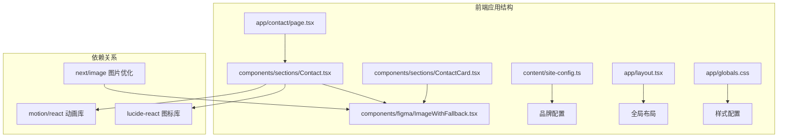
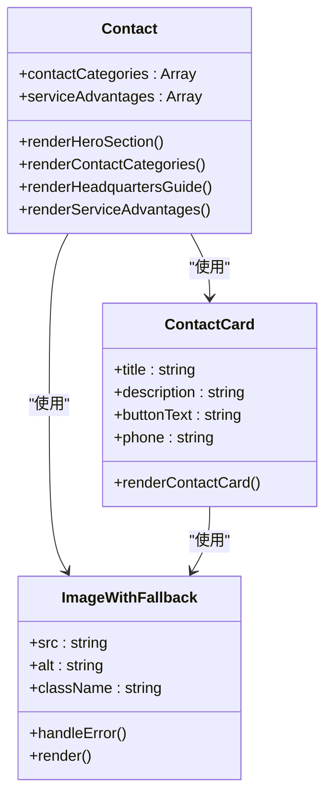
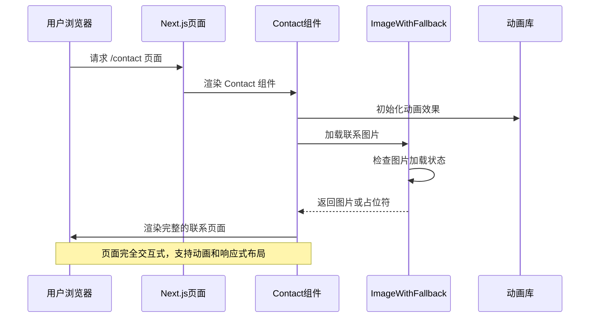
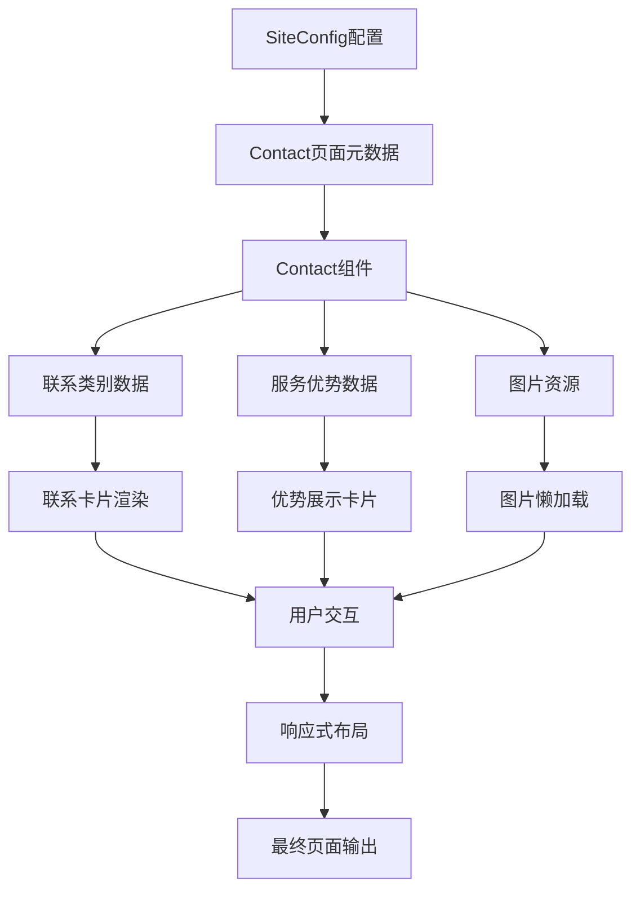
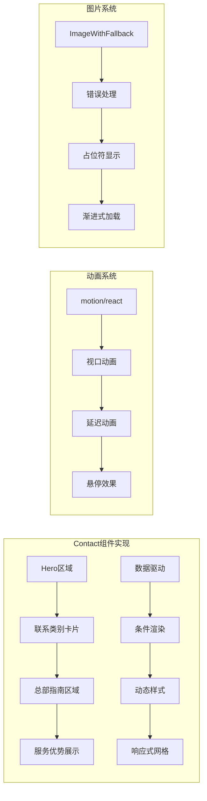
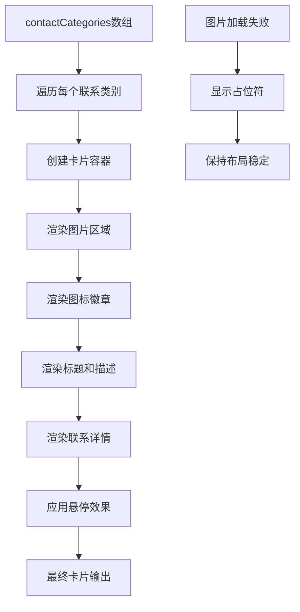
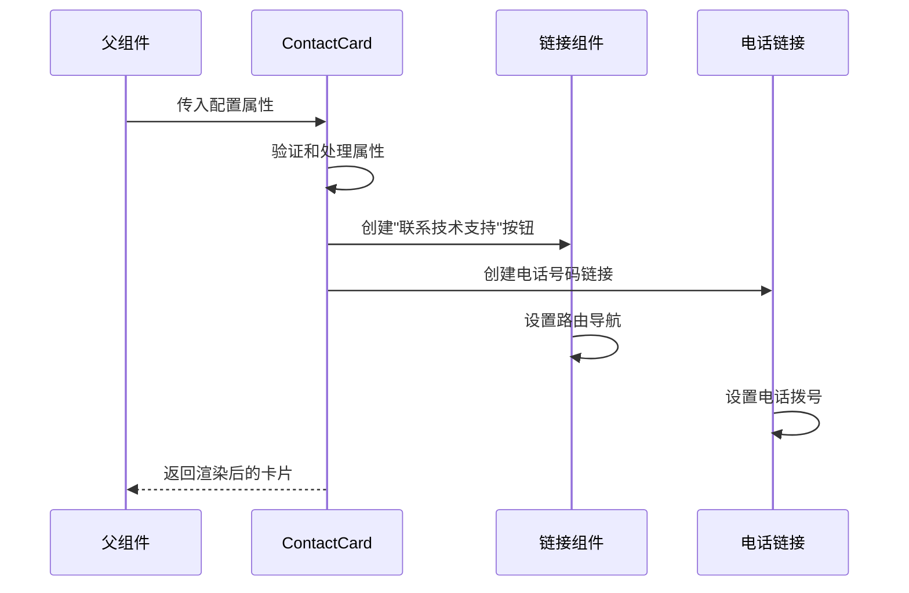
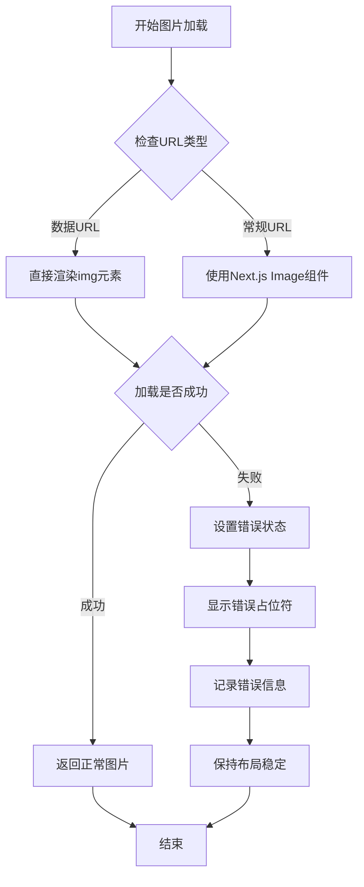

# 联系我们组件

<cite>
**本文档引用的文件**
- [frontend/components/sections/Contact.tsx](file://frontend/components/sections/Contact.tsx)
- [frontend/components/sections/ContactCard.tsx](file://frontend/components/sections/ContactCard.tsx)
- [frontend/app/contact/page.tsx](file://frontend/app/contact/page.tsx)
- [frontend/content/site-config.ts](file://frontend/content/site-config.ts)
- [frontend/components/figma/ImageWithFallback.tsx](file://frontend/components/figma/ImageWithFallback.tsx)
- [frontend/app/layout.tsx](file://frontend/app/layout.tsx)
- [frontend/app/globals.css](file://frontend/app/globals.css)
- [frontend/next.config.ts](file://frontend/next.config.ts)
- [frontend/package.json](file://frontend/package.json)
</cite>

## 目录
1. [简介](#简介)
2. [项目结构](#项目结构)
3. [核心组件](#核心组件)
4. [架构概览](#架构概览)
5. [详细组件分析](#详细组件分析)
6. [依赖关系分析](#依赖关系分析)
7. [性能考虑](#性能考虑)
8. [故障排除指南](#故障排除指南)
9. [结论](#结论)

## 简介

"联系我们"组件是中创智控网站的核心页面之一，负责向用户提供全面的联系信息和服务支持。该组件采用现代化的设计理念，结合了响应式布局、动画效果和多媒体内容展示，为用户提供了直观便捷的联系体验。

该组件主要包含三个核心部分：联系信息展示、总部位置引导和客户服务优势展示。通过精心设计的视觉层次和交互效果，确保用户能够快速找到所需的联系信息和支持服务。

## 项目结构

"联系我们"组件位于前端应用的特定目录结构中，遵循Next.js的App Router架构模式：



**图表来源**
- [frontend/app/contact/page.tsx](file://frontend/app/contact/page.tsx#L1-L18)
- [frontend/components/sections/Contact.tsx](file://frontend/components/sections/Contact.tsx#L1-L254)
- [frontend/components/sections/ContactCard.tsx](file://frontend/components/sections/ContactCard.tsx#L1-L39)

**章节来源**
- [frontend/app/contact/page.tsx](file://frontend/app/contact/page.tsx#L1-L18)
- [frontend/components/sections/Contact.tsx](file://frontend/components/sections/Contact.tsx#L1-L254)

## 核心组件

"联系我们"组件由多个精心设计的子组件构成，每个组件都有其特定的功能和职责：

### 主要组件架构



**图表来源**
- [frontend/components/sections/Contact.tsx](file://frontend/components/sections/Contact.tsx#L47-L254)
- [frontend/components/sections/ContactCard.tsx](file://frontend/components/sections/ContactCard.tsx#L11-L38)
- [frontend/components/figma/ImageWithFallback.tsx](file://frontend/components/figma/ImageWithFallback.tsx#L21-L84)

### 联系信息数据结构

组件使用结构化的数据来管理联系信息，确保内容的一致性和可维护性：

| 组件类别 | 标题 | 描述 | 图标 | 联系详情 |
|---------|------|------|------|----------|
| 商务合作 | 针对大型交通项目的定制化解决方案咨询 | Globe图标 | 电话: +86 18823780560<br>工作时间: 周一至周五 9:00-18:00 |
| 技术支持 | 产品安装指导、系统故障排查及售后维保服务 | Headphones图标 | 电话: +86 400-888-9999<br>邮箱: support@zcz-tech.com |
| 综合事务 | 媒体采访、品牌活动联络，以及人才招聘简历投递 | MessageSquare图标 | 邮箱: huangyan@szzczk.com<br>部门: 总部行政中心 |

**章节来源**
- [frontend/components/sections/Contact.tsx](file://frontend/components/sections/Contact.tsx#L7-L38)

## 架构概览

"联系我们"组件采用了现代化的React架构模式，结合了客户端渲染、服务器端渲染和静态生成的优势：



**图表来源**
- [frontend/app/contact/page.tsx](file://frontend/app/contact/page.tsx#L15-L17)
- [frontend/components/sections/Contact.tsx](file://frontend/components/sections/Contact.tsx#L47-L254)
- [frontend/components/figma/ImageWithFallback.tsx](file://frontend/components/figma/ImageWithFallback.tsx#L34-L50)

### 数据流架构

组件的数据流采用自上而下的传递模式，确保了数据的一致性和可预测性：



**图表来源**
- [frontend/content/site-config.ts](file://frontend/content/site-config.ts#L8-L13)
- [frontend/app/contact/page.tsx](file://frontend/app/contact/page.tsx#L5-L13)
- [frontend/components/sections/Contact.tsx](file://frontend/components/sections/Contact.tsx#L7-L45)

**章节来源**
- [frontend/app/layout.tsx](file://frontend/app/layout.tsx#L63-L82)
- [frontend/app/globals.css](file://frontend/app/globals.css#L1-L203)

## 详细组件分析

### Contact 主组件分析

Contact组件是整个"联系我们"页面的核心，负责协调所有子组件的渲染和交互。

#### 组件特性

- **响应式设计**: 使用Tailwind CSS实现完全响应式的布局
- **动画效果**: 集成motion/react库提供流畅的过渡动画
- **图片优化**: 通过ImageWithFallback组件处理图片加载失败的情况
- **品牌一致性**: 严格遵循中创智控的品牌色彩和设计规范

#### 关键实现模式



**图表来源**
- [frontend/components/sections/Contact.tsx](file://frontend/components/sections/Contact.tsx#L47-L254)
- [frontend/components/figma/ImageWithFallback.tsx](file://frontend/components/figma/ImageWithFallback.tsx#L21-L84)

#### 联系类别渲染逻辑

Contact组件通过映射预定义的数据结构来动态生成联系类别卡片：



**图表来源**
- [frontend/components/sections/Contact.tsx](file://frontend/components/sections/Contact.tsx#L84-L137)
- [frontend/components/sections/Contact.tsx](file://frontend/components/sections/Contact.tsx#L94-L104)

**章节来源**
- [frontend/components/sections/Contact.tsx](file://frontend/components/sections/Contact.tsx#L47-L254)

### ContactCard 组件分析

ContactCard是一个独立的联系卡片组件，专门用于在其他页面中提供快速联系入口。

#### 组件接口设计

| 属性名 | 类型 | 默认值 | 必需 | 描述 |
|--------|------|--------|------|------|
| title | string | '需要定制解决方案？' | 否 | 卡片标题文本 |
| description | string | '我们的工程师随时准备为您提供专业的技术咨询与方案设计。' | 否 | 卡片描述文本 |
| buttonText | string | '联系技术支持' | 否 | 按钮显示文本 |
| phone | string | '18823780560' | 否 | 显示的联系电话 |

#### 组件渲染流程



**图表来源**
- [frontend/components/sections/ContactCard.tsx](file://frontend/components/sections/ContactCard.tsx#L11-L38)

**章节来源**
- [frontend/components/sections/ContactCard.tsx](file://frontend/components/sections/ContactCard.tsx#L4-L16)

### ImageWithFallback 组件分析

ImageWithFallback组件提供了健壮的图片加载机制，确保在各种网络条件下都能提供良好的用户体验。

#### 错误处理机制



**图表来源**
- [frontend/components/figma/ImageWithFallback.tsx](file://frontend/components/figma/ImageWithFallback.tsx#L34-L50)
- [frontend/components/figma/ImageWithFallback.tsx](file://frontend/components/figma/ImageWithFallback.tsx#L70-L83)

#### 图片优化特性

- **自动格式检测**: 支持WebP和AVIF等现代图片格式
- **响应式尺寸**: 根据设备像素密度选择合适的图片尺寸
- **懒加载支持**: 减少初始页面加载时间
- **错误降级**: 在图片加载失败时提供友好的降级方案

**章节来源**
- [frontend/components/figma/ImageWithFallback.tsx](file://frontend/components/figma/ImageWithFallback.tsx#L1-L85)

## 依赖关系分析

"联系我们"组件的依赖关系相对简洁，主要依赖于几个核心库和框架：

```mermaid
graph TB
subgraph "核心依赖"
A[react ^18.3.1] --> B[组件基础]
C[next ^15.1.0] --> D[页面路由]
E[motion ^12.23.24] --> F[动画效果]
G[lucide-react ^0.487.0] --> H[图标系统]
end
subgraph "UI和样式"
I[tailwindcss ^4.1.0] --> J[响应式设计]
K[clsx ^2.1.1] --> L[类名合并]
M[tailwind-merge ^3.2.0] --> N[样式冲突解决]
end
subgraph "工具库"
O[react-hook-form ^7.55.0] --> P[表单处理]
Q[sonner ^2.0.3] --> R[通知系统]
S[date-fns ^3.6.0] --> T[日期处理]
end
subgraph "组件库"
U[@mui/material ^7.3.5] --> V[Material Design]
W[radix-ui/react-*] --> X[无障碍组件]
end
```

**图表来源**
- [frontend/package.json](file://frontend/package.json#L12-L74)

### 第三方服务集成

虽然当前的"联系我们"组件主要展示静态联系信息，但项目中已预留了与第三方服务集成的能力：

| 服务类型 | 当前状态 | 集成可能性 | 备注 |
|----------|----------|------------|------|
| 地图API | 未集成 | ✅ 可集成 | Google Maps或高德地图 |
| 表单处理 | 未集成 | ✅ 可集成 | Formspree、Google Forms等 |
| 图片存储 | 已集成 | ✅ 可扩展 | Cloudinary、Strapi上传 |
| 分析统计 | 未集成 | ✅ 可集成 | Google Analytics、百度统计 |

**章节来源**
- [frontend/package.json](file://frontend/package.json#L12-L74)

## 性能考虑

"联系我们"组件在设计时充分考虑了性能优化，采用了多种策略来确保最佳的用户体验：

### 图片优化策略

- **格式支持**: 自动检测并使用WebP和AVIF等现代格式
- **尺寸适配**: 根据设备屏幕密度选择最优图片尺寸
- **懒加载**: 非首屏图片采用懒加载策略
- **缓存机制**: 利用浏览器和CDN缓存提高加载速度

### 动画性能优化

- **硬件加速**: 使用transform和opacity属性触发GPU加速
- **节流控制**: 动画触发频率经过优化，避免过度重绘
- **内存管理**: 动画组件在卸载时正确清理事件监听器

### 响应式性能

- **移动优先**: 移动端优先的设计减少了不必要的计算
- **CSS Grid**: 使用原生CSS Grid替代JavaScript布局计算
- **媒体查询**: 精确的断点设置避免了过度的重排重绘

## 故障排除指南

### 常见问题及解决方案

#### 图片加载失败

**问题症状**: 联系卡片中的图片显示为灰色占位符

**可能原因**:
- 图片路径错误
- 网络连接问题
- 图片格式不受支持

**解决方案**:
1. 检查图片路径是否正确
2. 验证图片文件是否存在
3. 确认图片格式被浏览器支持

#### 动画不生效

**问题症状**: 页面元素没有预期的动画效果

**可能原因**:
- JavaScript被禁用
- 浏览器不支持某些CSS属性
- 动画库版本不兼容

**解决方案**:
1. 确认浏览器支持现代CSS动画
2. 检查浏览器JavaScript执行状态
3. 更新motion库到最新版本

#### 响应式布局异常

**问题症状**: 在移动设备上布局错乱

**可能原因**:
- CSS媒体查询配置错误
- 视口设置不当
- 设备像素比计算问题

**解决方案**:
1. 检查viewport meta标签配置
2. 验证CSS断点设置
3. 测试不同设备的显示效果

**章节来源**
- [frontend/components/figma/ImageWithFallback.tsx](file://frontend/components/figma/ImageWithFallback.tsx#L34-L50)

## 结论

"联系我们"组件展现了现代React应用的最佳实践，通过精心设计的架构和实现策略，为用户提供了优秀的联系体验。组件具有以下突出特点：

### 设计优势

- **品牌一致性**: 严格遵循中创智控的品牌色彩和设计规范
- **用户体验**: 流畅的动画效果和直观的信息架构
- **响应式设计**: 完美适配各种设备和屏幕尺寸
- **性能优化**: 采用多种策略确保最佳加载和交互性能

### 技术亮点

- **模块化架构**: 清晰的组件分层和职责分离
- **错误处理**: 健壮的图片加载和降级机制
- **可扩展性**: 为未来功能扩展预留了充足空间
- **维护性**: 代码结构清晰，易于理解和修改

### 改进建议

1. **集成表单功能**: 添加在线联系表单以提高转化率
2. **地图集成**: 集成地图API提供更直观的位置信息
3. **多语言支持**: 扩展国际化能力以服务更广泛的用户群体
4. **SEO优化**: 进一步优化搜索引擎可见性

该组件为中创智控网站的用户沟通提供了坚实的技术基础，通过持续的优化和改进，能够更好地服务于企业的客户关系管理需求。