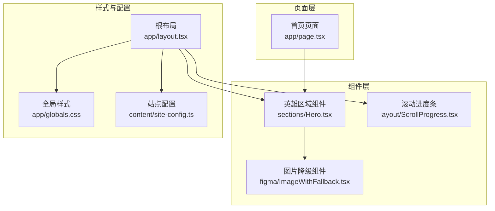
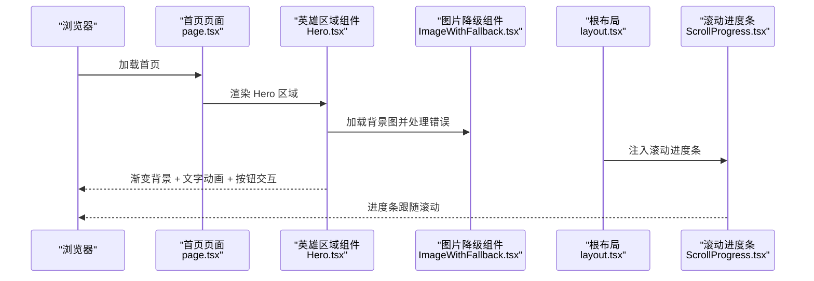
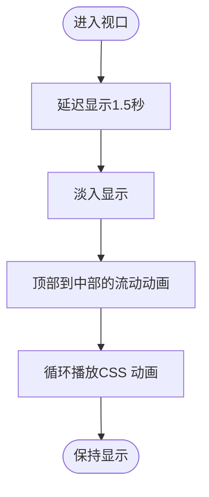
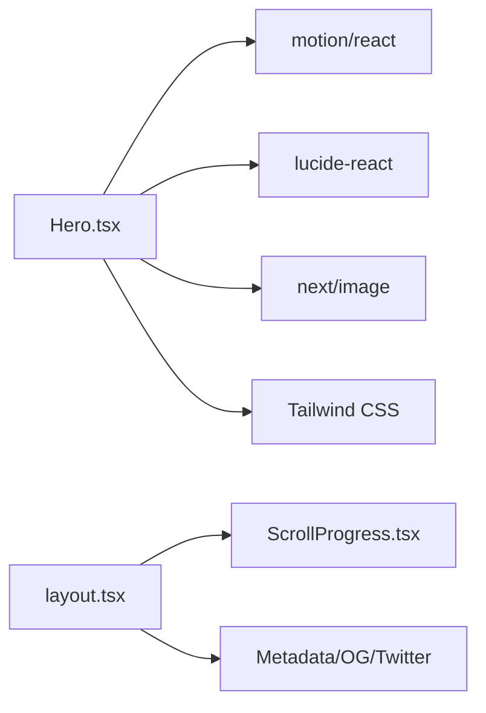

# 英雄区域组件

<cite>
**本文档引用的文件**
- [frontend/components/sections/Hero.tsx](file://frontend/components/sections/Hero.tsx)
- [frontend/components/figma/ImageWithFallback.tsx](file://frontend/components/figma/ImageWithFallback.tsx)
- [frontend/app/page.tsx](file://frontend/app/page.tsx)
- [frontend/app/layout.tsx](file://frontend/app/layout.tsx)
- [frontend/app/globals.css](file://frontend/app/globals.css)
- [frontend/content/site-config.ts](file://frontend/content/site-config.ts)
- [frontend/components/layout/ScrollProgress.tsx](file://frontend/components/layout/ScrollProgress.tsx)
- [frontend/package.json](file://frontend/package.json)
</cite>

## 目录
1. [简介](#简介)
2. [项目结构](#项目结构)
3. [核心组件](#核心组件)
4. [架构总览](#架构总览)
5. [详细组件分析](#详细组件分析)
6. [依赖分析](#依赖分析)
7. [性能考虑](#性能考虑)
8. [故障排除指南](#故障排除指南)
9. [结论](#结论)
10. [附录](#附录)

## 简介
本文件为“英雄区域组件”的深度技术文档，围绕 Hero 组件的设计理念、视觉效果实现（渐变背景、动画系统、响应式布局）、可配置参数、无障碍与 SEO 策略，以及使用与自定义方法进行系统性阐述。Hero 组件位于首页首屏，承担品牌展示、核心信息传达与用户引导的职责，采用现代前端技术栈实现高性能与高体验。

## 项目结构
Hero 组件位于前端侧 sections 目录，作为页面首屏的核心区块；其背景图通过通用的图片降级组件加载；页面布局由根布局统一注入滚动进度条与导航栏；全局样式集中于 Tailwind CSS 主题变量与基础层规则。

**图表来源**
- [frontend/app/page.tsx](file://frontend/app/page.tsx#L40-L71)
- [frontend/components/sections/Hero.tsx](file://frontend/components/sections/Hero.tsx#L1-L138)
- [frontend/components/figma/ImageWithFallback.tsx](file://frontend/components/figma/ImageWithFallback.tsx#L1-L85)
- [frontend/components/layout/ScrollProgress.tsx](file://frontend/components/layout/ScrollProgress.tsx#L1-L21)
- [frontend/app/layout.tsx](file://frontend/app/layout.tsx#L1-L83)
- [frontend/app/globals.css](file://frontend/app/globals.css#L1-L203)
- [frontend/content/site-config.ts](file://frontend/content/site-config.ts#L1-L47)

**章节来源**
- [frontend/app/page.tsx](file://frontend/app/page.tsx#L40-L71)
- [frontend/components/sections/Hero.tsx](file://frontend/components/sections/Hero.tsx#L1-L138)
- [frontend/app/layout.tsx](file://frontend/app/layout.tsx#L63-L82)

## 核心组件
Hero 组件采用客户端渲染模式，结合 Framer Motion 的动画系统与 Next.js 图片优化能力，实现首屏视觉冲击与交互流畅性。其关键特性包括：
- 渐变背景与半透明覆盖层营造科技感氛围
- 文字与元素的 stagger 动画与 fadeInUp 效果
- 可选的滚动指示器动画
- 响应式排版与多尺寸断点适配
- 可扩展的 CTA 按钮与功能标签

**章节来源**
- [frontend/components/sections/Hero.tsx](file://frontend/components/sections/Hero.tsx#L8-L138)

## 架构总览
Hero 组件在页面中的调用与周边组件的关系如下：

**图表来源**
- [frontend/app/page.tsx](file://frontend/app/page.tsx#L40-L71)
- [frontend/components/sections/Hero.tsx](file://frontend/components/sections/Hero.tsx#L23-L138)
- [frontend/components/figma/ImageWithFallback.tsx](file://frontend/components/figma/ImageWithFallback.tsx#L21-L84)
- [frontend/components/layout/ScrollProgress.tsx](file://frontend/components/layout/ScrollProgress.tsx#L6-L20)
- [frontend/app/layout.tsx](file://frontend/app/layout.tsx#L63-L82)

## 详细组件分析

### 设计理念与视觉效果
- 渐变背景：组件内嵌背景层与覆盖层，形成从深蓝到浅蓝再到深蓝的纵向渐变，配合低透明度背景图，突出文字内容的同时保持层次感。
- 文字渐变与阴影：标题采用多段渐变与滤镜投影，强调科技感与立体感；副标题与描述采用灰白过渡，保证可读性。
- 功能标签与图标：使用 lucide-react 提供的图标，配合悬停发光与位移动画，增强交互反馈。
- CTA 按钮：采用前景金与深蓝对比色，悬停时产生阴影与位移，强化点击意图。

**章节来源**
- [frontend/components/sections/Hero.tsx](file://frontend/components/sections/Hero.tsx#L24-L118)

### 动画系统
- stagger 动画容器：通过 variants 定义子元素依次入场，营造有序的视觉节奏。
- fadeInUp 动画：每个元素初始状态为透明且向下偏移，进入时淡入并上移，提升自然感。
- 滚动指示器：延迟出现的“滚动”提示与流动动画，引导用户向下浏览。

**图表来源**
- [frontend/components/sections/Hero.tsx](file://frontend/components/sections/Hero.tsx#L121-L134)

**章节来源**
- [frontend/components/sections/Hero.tsx](file://frontend/components/sections/Hero.tsx#L9-L21)
- [frontend/components/sections/Hero.tsx](file://frontend/components/sections/Hero.tsx#L121-L134)

### 响应式布局
- 容器最大宽度与边距：通过 max-w-7xl 与多断点 px 值控制，确保在小屏到超宽屏的稳定呈现。
- 文字尺寸：标题采用多级响应式字体大小，保证在不同设备上的阅读体验。
- 元素间距：描述文本与标签采用响应式间距与描边，增强层级感。

**章节来源**
- [frontend/components/sections/Hero.tsx](file://frontend/components/sections/Hero.tsx#L37-L118)
- [frontend/app/globals.css](file://frontend/app/globals.css#L148-L202)

### 可配置参数
当前 Hero 组件未对外暴露 props，但可通过以下方式实现配置化：
- 背景图片：通过背景层的图片组件替换资源路径或传参（需扩展组件接口）。
- 标题文本：通过多段标题结构拆分，支持动态文案注入。
- 特色标签：通过数组映射渲染，支持外部数据驱动。
- CTA 按钮：通过链接与文案参数化，支持不同路由与文案。

建议新增的配置接口（示意）：
- 背景图配置：src、alt、priority
- 标题配置：主标题、副标题、渐变文案
- 描述配置：文案与描边样式
- 特色标签：icon 与 text 数组
- CTA 配置：链接、文案、图标

**章节来源**
- [frontend/components/sections/Hero.tsx](file://frontend/components/sections/Hero.tsx#L27-L33)
- [frontend/components/sections/Hero.tsx](file://frontend/components/sections/Hero.tsx#L58-L83)
- [frontend/components/sections/Hero.tsx](file://frontend/components/sections/Hero.tsx#L85-L100)
- [frontend/components/sections/Hero.tsx](file://frontend/components/sections/Hero.tsx#L103-L117)

### 无障碍设计
- 文本对比度：深蓝背景搭配浅色/高亮文字，满足对比度要求。
- 图像替代：背景图通过占位符与降级逻辑保证不可用时的可读性。
- 键盘可达：按钮与链接具备默认焦点样式，便于键盘操作。
- 语义化标签：标题层级清晰，利于屏幕阅读器解析。

**章节来源**
- [frontend/components/sections/Hero.tsx](file://frontend/components/sections/Hero.tsx#L27-L33)
- [frontend/components/sections/Hero.tsx](file://frontend/components/sections/Hero.tsx#L58-L117)

### SEO 优化策略
- 页面元数据：根布局统一注入标题、描述、Open Graph 与 Twitter 卡片信息。
- 结构化数据：可在页面层补充 JSON-LD（如网站、导航、面包屑等）。
- 图片优化：Next.js 图片组件自动提供尺寸与格式优化，配合降级组件提升鲁棒性。
- 内容优先：Hero 区域作为首屏核心，承载品牌关键词与核心价值主张。

**章节来源**
- [frontend/app/layout.tsx](file://frontend/app/layout.tsx#L9-L52)
- [frontend/content/site-config.ts](file://frontend/content/site-config.ts#L21-L29)

### 使用示例与自定义方法
- 在页面中直接引入并渲染 Hero 组件，作为首屏入口。
- 自定义背景图：替换组件内的图片路径或通过 props 注入。
- 自定义文案：将标题、描述与标签改为外部数据源，实现多语言与动态内容。
- 自定义样式：通过 Tailwind 类名覆盖组件内部样式，或在全局样式中调整主题变量。

**章节来源**
- [frontend/app/page.tsx](file://frontend/app/page.tsx#L40-L71)
- [frontend/components/sections/Hero.tsx](file://frontend/components/sections/Hero.tsx#L27-L33)

## 依赖分析
Hero 组件依赖的关键包与模块：
- Framer Motion：提供动画容器与过渡效果
- Lucide React：提供图标库
- Next.js 图片：提供图片优化与懒加载
- Tailwind CSS：提供响应式与主题变量

**图表来源**
- [frontend/components/sections/Hero.tsx](file://frontend/components/sections/Hero.tsx#L3-L6)
- [frontend/package.json](file://frontend/package.json#L53-L73)
- [frontend/app/layout.tsx](file://frontend/app/layout.tsx#L9-L52)
- [frontend/components/layout/ScrollProgress.tsx](file://frontend/components/layout/ScrollProgress.tsx#L4-L12)

**章节来源**
- [frontend/package.json](file://frontend/package.json#L12-L88)
- [frontend/components/sections/Hero.tsx](file://frontend/components/sections/Hero.tsx#L3-L6)

## 性能考虑
- 图片优化：使用 Next.js 图片组件与优先加载，减少首屏阻塞。
- 动画性能：Framer Motion 使用 GPU 加速的 transform 与 opacity，避免强制重排。
- 样式体积：Tailwind 基于工具类，按需生成，避免冗余样式。
- 滚动进度条：使用弹簧动画与受控缩放，保证流畅性与低开销。

**章节来源**
- [frontend/components/sections/Hero.tsx](file://frontend/components/sections/Hero.tsx#L27-L33)
- [frontend/components/layout/ScrollProgress.tsx](file://frontend/components/layout/ScrollProgress.tsx#L7-L12)
- [frontend/app/globals.css](file://frontend/app/globals.css#L1-L203)

## 故障排除指南
- 背景图加载失败：组件内置降级逻辑，若图片异常将显示占位图与错误提示，便于排查真实 URL。
- 动画不生效：确认已启用客户端渲染与 Framer Motion 正确导入；检查 variants 与初始状态配置。
- 文本溢出或断行异常：检查响应式断点与容器宽度设置，必要时微调字体大小与行高。
- SEO 元数据缺失：确认根布局中 metadata 配置完整，并与站点配置一致。

**章节来源**
- [frontend/components/figma/ImageWithFallback.tsx](file://frontend/components/figma/ImageWithFallback.tsx#L32-L50)
- [frontend/components/sections/Hero.tsx](file://frontend/components/sections/Hero.tsx#L9-L21)
- [frontend/app/layout.tsx](file://frontend/app/layout.tsx#L9-L52)

## 结论
Hero 组件通过渐变背景、分层动画与响应式排版，构建了具有科技感与引导性的首屏体验。其基于 Next.js 与 Framer Motion 的现代化实现，兼顾性能与可维护性。建议后续引入 props 配置与结构化数据，进一步提升可扩展性与 SEO 表现。

## 附录
- 组件文件路径：frontend/components/sections/Hero.tsx
- 图片降级组件：frontend/components/figma/ImageWithFallback.tsx
- 页面入口：frontend/app/page.tsx
- 根布局与 SEO：frontend/app/layout.tsx
- 全局样式与主题：frontend/app/globals.css
- 站点配置：frontend/content/site-config.ts
- 滚动进度条：frontend/components/layout/ScrollProgress.tsx
- 依赖清单：frontend/package.json