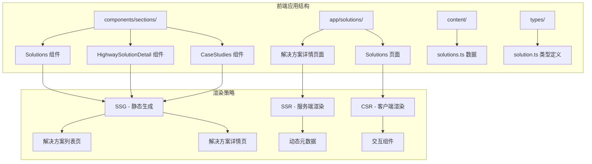
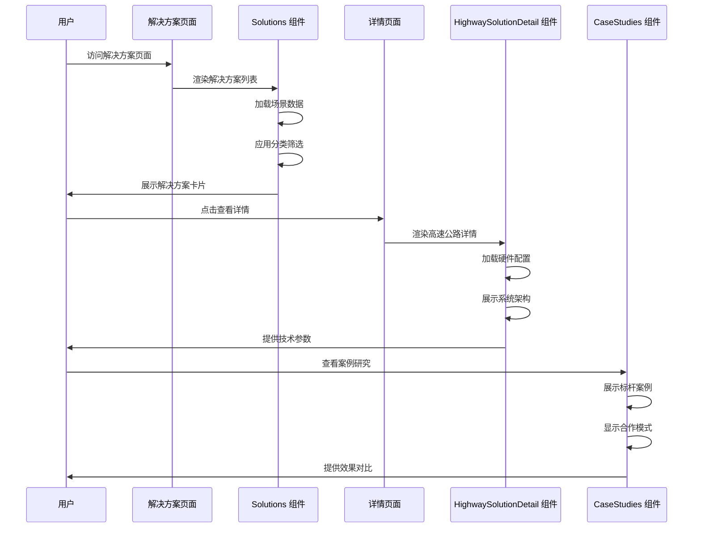
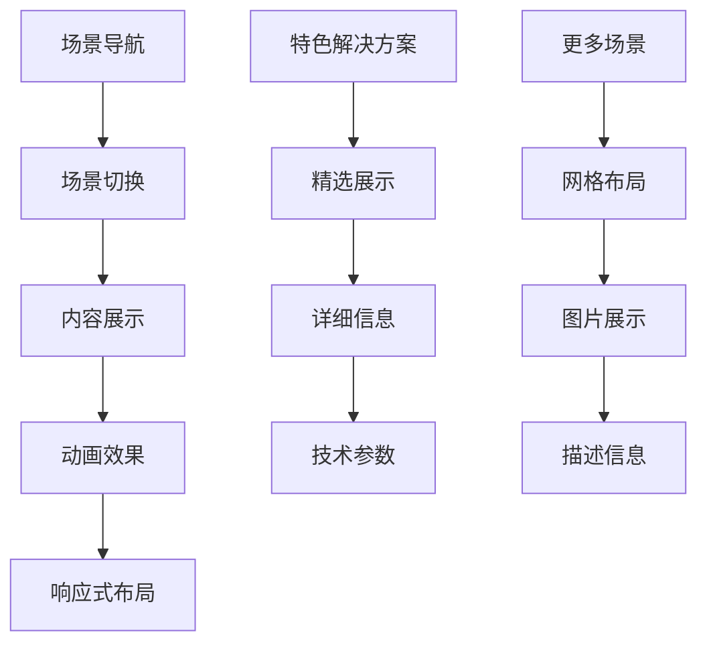
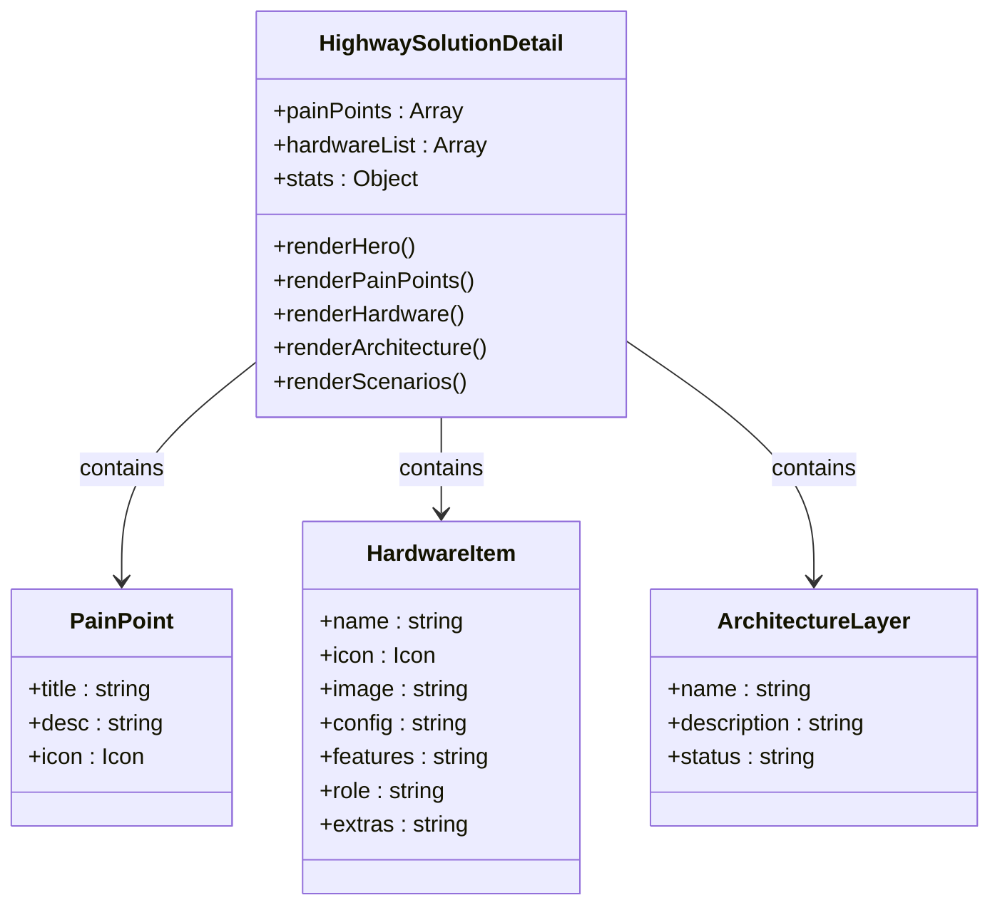
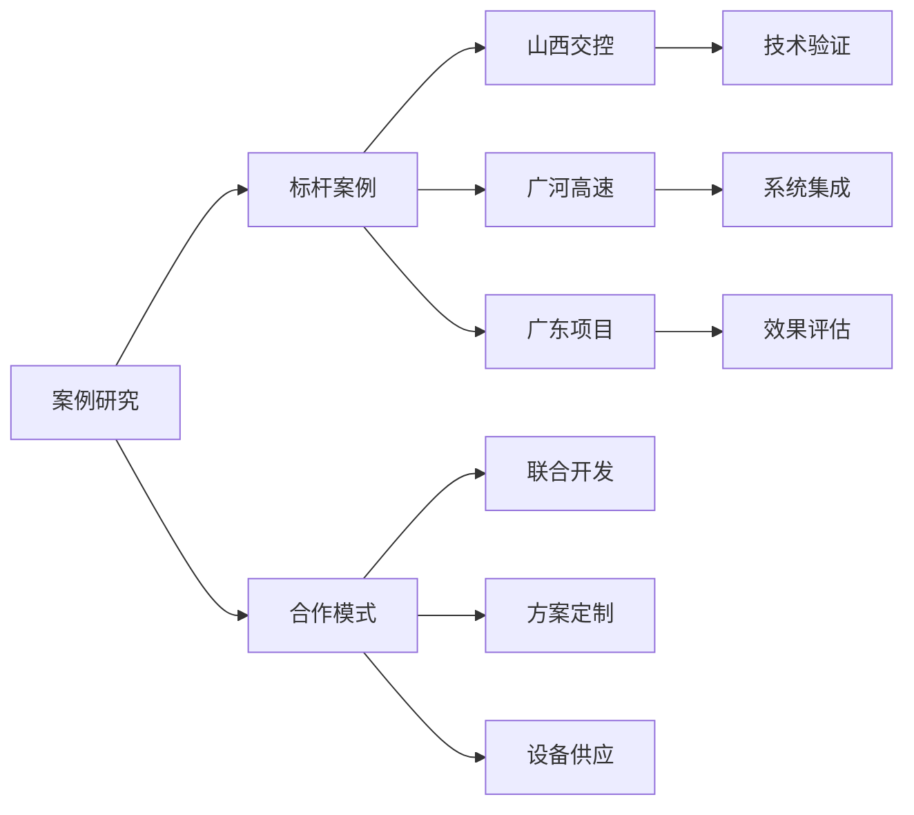
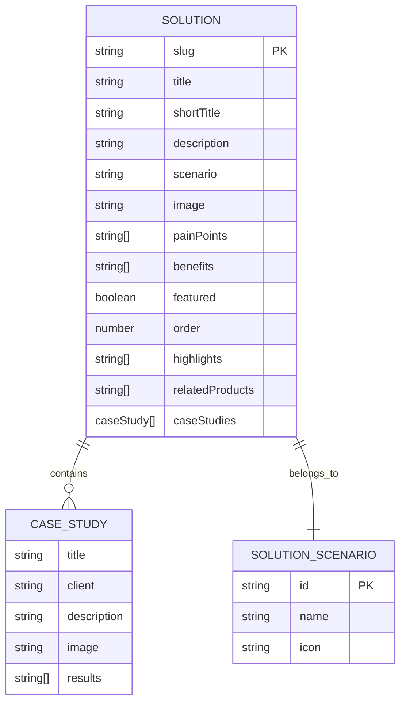
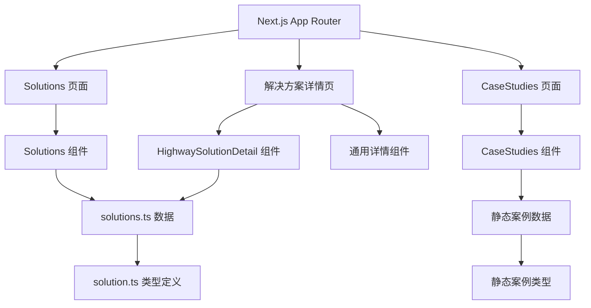
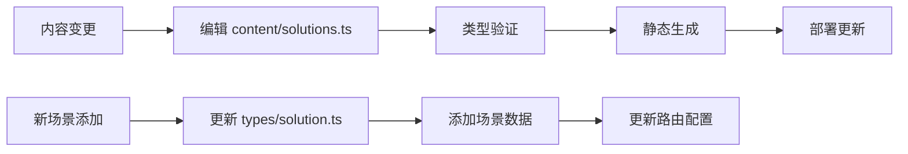

# 解决方案组件

<cite>
**本文档引用的文件**
- [frontend/components/sections/Solutions.tsx](file://frontend/components/sections/Solutions.tsx)
- [frontend/components/sections/HighwaySolutionDetail.tsx](file://frontend/components/sections/HighwaySolutionDetail.tsx)
- [frontend/components/sections/CaseStudies.tsx](file://frontend/components/sections/CaseStudies.tsx)
- [frontend/content/solutions.ts](file://frontend/content/solutions.ts)
- [frontend/types/solution.ts](file://frontend/types/solution.ts)
- [frontend/app/solutions/page.tsx](file://frontend/app/solutions/page.tsx)
- [frontend/app/solutions/[slug]/page.tsx](file://frontend/app/solutions/[slug]/page.tsx)
- [frontend/lib/categories.ts](file://frontend/lib/categories.ts)
- [specs/001-nextjs-migration/data-model.md](file://specs/001-nextjs-migration/data-model.md)
- [specs/001-nextjs-migration/research.md](file://specs/001-nextjs-migration/research.md)
- [specs/001-strapi-backend-cms/spec.md](file://specs/001-strapi-backend-cms/spec.md)
</cite>

## 目录
1. [简介](#简介)
2. [项目结构](#项目结构)
3. [核心组件](#核心组件)
4. [架构概览](#架构概览)
5. [详细组件分析](#详细组件分析)
6. [依赖关系分析](#依赖关系分析)
7. [性能考虑](#性能考虑)
8. [故障排除指南](#故障排除指南)
9. [结论](#结论)
10. [附录](#附录)

## 简介
本文件详细阐述了该智慧交通解决方案组件的综合文档，涵盖解决方案列表组件的分类展示、筛选功能和案例预览，案例研究组件的详细展示、数据可视化和效果对比功能，以及高速公路解决方案详情组件的专业内容展示和技术参数呈现。同时，文档还解释了组件的交互设计和用户体验优化策略，并提供了组件的内容管理和更新机制说明。

## 项目结构
该项目采用 Next.js 15+ App Router 架构，采用混合渲染策略（SSG/SSR/CSR）以提升 SEO 和性能。解决方案组件位于前端目录结构中，主要包含以下关键文件：

**图表来源**
- [frontend/app/solutions/page.tsx](file://frontend/app/solutions/page.tsx#L1-L18)
- [frontend/app/solutions/[slug]/page.tsx](file://frontend/app/solutions/[slug]/page.tsx#L1-L167)
- [specs/001-nextjs-migration/research.md](file://specs/001-nextjs-migration/research.md#L302-L321)

**章节来源**
- [frontend/app/solutions/page.tsx](file://frontend/app/solutions/page.tsx#L1-L18)
- [frontend/app/solutions/[slug]/page.tsx](file://frontend/app/solutions/[slug]/page.tsx#L1-L167)

## 核心组件
本项目的核心解决方案组件包括三个主要部分：

### 1. 解决方案列表组件 (Solutions)
负责展示所有解决方案的分类展示和场景导航功能，采用响应式设计和流畅的动画效果。

### 2. 高速公路解决方案详情组件 (HighwaySolutionDetail)
专门针对高速公路养护施工场景的详细展示，包含硬件配置、系统架构和场景应用等内容。

### 3. 案例研究组件 (CaseStudies)
展示实际应用案例和合作模式，提供数据可视化和效果对比功能。

**章节来源**
- [frontend/components/sections/Solutions.tsx](file://frontend/components/sections/Solutions.tsx#L56-L422)
- [frontend/components/sections/HighwaySolutionDetail.tsx](file://frontend/components/sections/HighwaySolutionDetail.tsx#L107-L886)
- [frontend/components/sections/CaseStudies.tsx](file://frontend/components/sections/CaseStudies.tsx#L33-L115)

## 架构概览
解决方案组件采用分层架构设计，结合静态生成和动态渲染的优势：

**图表来源**
- [frontend/components/sections/Solutions.tsx](file://frontend/components/sections/Solutions.tsx#L56-L422)
- [frontend/components/sections/HighwaySolutionDetail.tsx](file://frontend/components/sections/HighwaySolutionDetail.tsx#L107-L886)
- [frontend/components/sections/CaseStudies.tsx](file://frontend/components/sections/CaseStudies.tsx#L33-L115)

## 详细组件分析

### 解决方案列表组件 (Solutions)
该组件实现了完整的解决方案展示功能，包含以下核心特性：

#### 场景导航系统
组件内置了五个核心场景导航：
- 高速养护施工 (Shield)
- 隧道智慧监测 (Radio)  
- 桥梁健康监测 (Activity)
- 智慧园区/景区 (Trees)
- 应急指挥调度 (Siren)

#### 分类展示功能
每个场景都提供：
- 视觉化的场景卡片
- 详细的功能描述
- 相关的图标标识
- 响应式布局适配

#### 交互设计特点
- 使用 Framer Motion 实现流畅的入场动画
- 支持粘性导航栏
- 提供平滑的滚动体验
- 包含多种过渡效果

**图表来源**
- [frontend/components/sections/Solutions.tsx](file://frontend/components/sections/Solutions.tsx#L19-L54)
- [frontend/components/sections/Solutions.tsx](file://frontend/components/sections/Solutions.tsx#L112-L383)

**章节来源**
- [frontend/components/sections/Solutions.tsx](file://frontend/components/sections/Solutions.tsx#L56-L422)

### 高速公路解决方案详情组件 (HighwaySolutionDetail)
该组件专注于高速公路养护施工场景，提供专业的技术展示：

#### 痛点分析模块
包含六个主要行业痛点：
- 成本高且不可靠
- 覆盖与环境受限  
- 监管滞后被动
- 效率低下
- 数据误差大
- 协同管控难

#### 硬件配置展示
提供六种核心硬件的详细配置：
- 智能预警锥桶
- 智能定位肩灯
- 防闯精灵
- 便携式强声器
- 二代 4G 智能安全帽
- AI 布控球

#### 系统架构展示
采用三层架构设计：
- 识别问题层 (Problem Identification)
- 预警平台层 (Warning Platform)  
- 执行预警层 (Execution Warning)

**图表来源**
- [frontend/components/sections/HighwaySolutionDetail.tsx](file://frontend/components/sections/HighwaySolutionDetail.tsx#L47-L105)
- [frontend/components/sections/HighwaySolutionDetail.tsx](file://frontend/components/sections/HighwaySolutionDetail.tsx#L334-L742)

**章节来源**
- [frontend/components/sections/HighwaySolutionDetail.tsx](file://frontend/components/sections/HighwaySolutionDetail.tsx#L107-L886)

### 案例研究组件 (CaseStudies)
该组件展示实际应用案例和合作模式：

#### 标杆案例展示
包含三个成功案例：
- 山西交控集团 G1812 槐榆高速养护监管
- 广河高速多设备协同预警
- 广东地区行人摩托车防闯入项目

#### 合作模式展示
提供三种合作方式：
- 联合开发：与防撞车制造商联合开发智能预警系统
- 方案定制：为交通管理部门提供"感知-响应-处置"闭环解决方案  
- 设备供应：为养护企业提供模块化智能设备集群

**图表来源**
- [frontend/components/sections/CaseStudies.tsx](file://frontend/components/sections/CaseStudies.tsx#L6-L25)
- [frontend/components/sections/CaseStudies.tsx](file://frontend/components/sections/CaseStudies.tsx#L91-L110)

**章节来源**
- [frontend/components/sections/CaseStudies.tsx](file://frontend/components/sections/CaseStudies.tsx#L33-L115)

### 数据模型和类型定义
解决方案组件的数据结构设计清晰，支持灵活的内容管理：

**图表来源**
- [frontend/types/solution.ts](file://frontend/types/solution.ts#L30-L57)
- [frontend/types/solution.ts](file://frontend/types/solution.ts#L3-L7)
- [frontend/types/solution.ts](file://frontend/types/solution.ts#L15-L21)

**章节来源**
- [frontend/types/solution.ts](file://frontend/types/solution.ts#L1-L58)
- [specs/001-nextjs-migration/data-model.md](file://specs/001-nextjs-migration/data-model.md#L62-L110)

## 依赖关系分析

### 组件依赖关系
解决方案组件之间存在清晰的依赖关系：

**图表来源**
- [frontend/app/solutions/page.tsx](file://frontend/app/solutions/page.tsx#L1-L18)
- [frontend/app/solutions/[slug]/page.tsx](file://frontend/app/solutions/[slug]/page.tsx#L1-L167)
- [frontend/content/solutions.ts](file://frontend/content/solutions.ts#L1-L134)

### 外部依赖分析
组件依赖的关键外部库和工具：

| 依赖项 | 版本 | 用途 | 重要性 |
|--------|------|------|--------|
| Next.js | 15+ | 应用框架 | 核心 |
| Framer Motion | 12.x | 动画效果 | 重要 |
| Lucide React | - | 图标库 | 重要 |
| Tailwind CSS | 4.x | 样式系统 | 重要 |
| TypeScript | 5.x | 类型安全 | 核心 |

**章节来源**
- [specs/001-nextjs-migration/plan.md](file://specs/001-nextjs-migration/plan.md#L14-L21)

## 性能考虑
解决方案组件采用了多种性能优化策略：

### 渲染策略
- **静态生成 (SSG)**: 解决方案列表页和详情页使用静态生成，提升首屏加载速度
- **服务端渲染 (SSR)**: 动态元数据生成，确保 SEO 优化
- **客户端渲染 (CSR)**: 交互组件使用客户端渲染，保持流畅的用户体验

### 性能指标
- **LCP < 2.5s** (3G 网络条件下)
- **Lighthouse Performance > 90**
- **动画保持 60fps**

### 优化措施
- 使用 React Server Components 减少客户端负载
- 实现图片懒加载和优化
- 采用响应式设计减少不必要的渲染
- 实现骨架屏和加载状态

**章节来源**
- [specs/001-nextjs-migration/research.md](file://specs/001-nextjs-migration/research.md#L29-L30)
- [specs/001-nextjs-migration/research.md](file://specs/001-nextjs-migration/research.md#L299-L321)

## 故障排除指南

### 常见问题和解决方案

#### 1. 图片加载失败
**症状**: 解决方案图片无法显示
**原因**: 图片路径错误或网络问题
**解决方案**: 
- 检查图片路径是否正确
- 确认图片文件是否存在
- 验证 CDN 或服务器连接

#### 2. 动画效果不生效
**症状**: 组件动画不显示
**原因**: Framer Motion 依赖未正确安装
**解决方案**:
- 确认 Framer Motion 版本兼容性
- 检查 'use client' 指令使用
- 验证浏览器支持情况

#### 3. SEO 元数据问题
**症状**: 社交媒体分享显示不正确
**原因**: 动态元数据生成失败
**解决方案**:
- 检查 generateMetadata 函数实现
- 验证 slug 参数传递
- 确认数据源可用性

#### 4. 响应式布局问题
**症状**: 移动端显示异常
**原因**: Tailwind CSS 配置问题
**解决方案**:
- 检查断点配置
- 验证响应式类名使用
- 测试不同屏幕尺寸

**章节来源**
- [specs/001-strapi-backend-cms/spec.md](file://specs/001-strapi-backend-cms/spec.md#L69-L75)

## 结论
该解决方案组件系统展现了现代前端开发的最佳实践，通过清晰的架构设计、优秀的用户体验和强大的性能优化，为用户提供了完整的智慧交通解决方案展示和交互体验。组件采用混合渲染策略，在保证性能的同时提供了丰富的交互功能。

系统的主要优势包括：
- **模块化设计**: 组件职责清晰，易于维护和扩展
- **性能优化**: 采用多种渲染策略，确保最佳用户体验
- **响应式设计**: 适配各种设备和屏幕尺寸
- **SEO 友好**: 动态元数据生成，提升搜索引擎排名
- **可维护性**: 类型安全的 TypeScript 实现，便于长期维护

## 附录

### 内容管理更新机制
解决方案内容采用静态文件管理，支持以下更新方式：

#### 数据更新流程

**图表来源**
- [frontend/content/solutions.ts](file://frontend/content/solutions.ts#L1-L134)
- [frontend/types/solution.ts](file://frontend/types/solution.ts#L1-L58)

### 用户体验优化策略
- **渐进式加载**: 使用骨架屏和占位符提升感知性能
- **无障碍设计**: 遵循 WCAG 2.1 AA 标准
- **触摸友好的交互**: 优化移动端触摸体验
- **视觉层次**: 清晰的信息架构和视觉引导
- **反馈机制**: 即时的操作反馈和状态指示

### 技术规范
- **TypeScript**: 强类型检查，提升代码质量
- **ESLint**: 代码风格和质量保证
- **Prettier**: 代码格式化标准化
- **Git Hooks**: 自动化代码检查和格式化

**章节来源**
- [specs/001-nextjs-migration/plan.md](file://specs/001-nextjs-migration/plan.md#L41-L57)