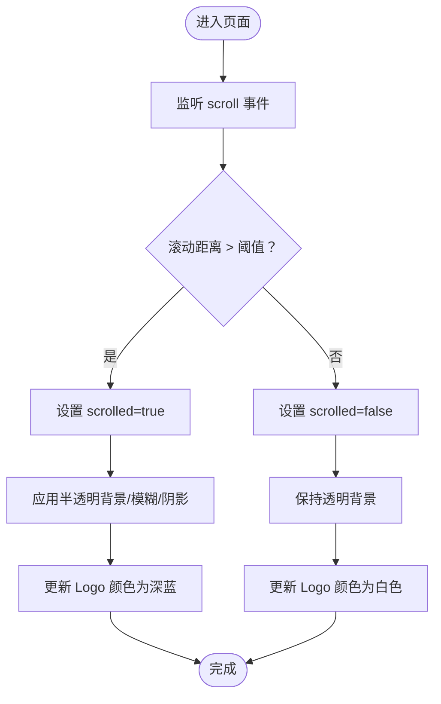

# 导航组件

<cite>
**本文档引用的文件**
- [Navigation.tsx](file://frontend/components/layout/Navigation.tsx)
- [navigation.ts](file://frontend/content/navigation.ts)
- [navigation.ts（类型定义）](file://frontend/types/navigation.ts)
- [layout.tsx](file://frontend/app/layout.tsx)
- [globals.css](file://frontend/app/globals.css)
- [site-config.ts](file://frontend/content/site-config.ts)
- [ScrollProgress.tsx](file://frontend/components/layout/ScrollProgress.tsx)
- [Footer.tsx](file://frontend/components/layout/Footer.tsx)
- [button.tsx](file://frontend/components/ui/button.tsx)
</cite>

## 目录
1. [简介](#简介)
2. [项目结构](#项目结构)
3. [核心组件](#核心组件)
4. [架构总览](#架构总览)
5. [详细组件分析](#详细组件分析)
6. [依赖关系分析](#依赖关系分析)
7. [性能考量](#性能考量)
8. [故障排查指南](#故障排查指南)
9. [结论](#结论)
10. [附录](#附录)

## 简介
本文件系统性解析前端导航组件的实现，涵盖响应式设计、滚动效果检测、背景透明度变化、颜色主题切换、桌面端菜单的悬停与下划线动画、移动端汉堡菜单与模态动画、逐项出现动效与触摸交互、SVG 图标系统（含 Logo 动态颜色变化）、导航配置数据结构与扩展方法，以及无障碍访问与键盘导航最佳实践。

## 项目结构
导航组件位于前端应用的布局层，作为页面骨架的一部分被根布局统一挂载。其依赖于站点配置、导航配置与类型定义，并通过滚动进度条增强用户体验。

**图表来源**
- [layout.tsx](file://frontend/app/layout.tsx#L63-L82)
- [Navigation.tsx](file://frontend/components/layout/Navigation.tsx#L1-L126)
- [navigation.ts](file://frontend/content/navigation.ts#L1-L38)
- [navigation.ts（类型定义）](file://frontend/types/navigation.ts#L1-L50)
- [site-config.ts](file://frontend/content/site-config.ts#L1-L47)
- [globals.css](file://frontend/app/globals.css#L1-L203)
- [Footer.tsx](file://frontend/components/layout/Footer.tsx#L1-L208)

**章节来源**
- [layout.tsx](file://frontend/app/layout.tsx#L63-L82)

## 核心组件
- 导航栏组件：负责滚动检测、背景透明度变化、Logo 动态颜色、桌面端悬停动画、移动端汉堡菜单与模态动画、逐项出现动效。
- 导航配置：定义主菜单项集合，支持扩展子菜单与移动端显示控制位。
- 类型定义：约束导航项结构，确保可扩展性与类型安全。
- 全局样式：提供品牌色与过渡动画变量，支撑导航视觉一致性。
- 站点配置：提供品牌色与 SEO 信息，影响导航配色与主题感知。
- 滚动进度条：与导航联动，提供页面滚动状态反馈。

**章节来源**
- [Navigation.tsx](file://frontend/components/layout/Navigation.tsx#L9-L126)
- [navigation.ts](file://frontend/content/navigation.ts#L3-L10)
- [navigation.ts（类型定义）](file://frontend/types/navigation.ts#L3-L12)
- [globals.css](file://frontend/app/globals.css#L4-L64)
- [site-config.ts](file://frontend/content/site-config.ts#L15-L29)
- [ScrollProgress.tsx](file://frontend/components/layout/ScrollProgress.tsx#L6-L20)

## 架构总览
导航组件采用“响应式 + 动画 + 主题”的组合模式：
- 响应式：桌面端隐藏移动端菜单，移动端隐藏桌面端菜单。
- 动画：使用帧动画库实现平滑过渡与逐项入场。
- 主题：根据滚动状态与移动端展开状态动态切换颜色与背景。

**图表来源**
- [Navigation.tsx](file://frontend/components/layout/Navigation.tsx#L13-L19)
- [Navigation.tsx](file://frontend/components/layout/Navigation.tsx#L68-L76)
- [Navigation.tsx](file://frontend/components/layout/Navigation.tsx#L80-L122)
- [ScrollProgress.tsx](file://frontend/components/layout/ScrollProgress.tsx#L7-L12)

## 详细组件分析

### 响应式设计与滚动效果检测
- 滚动检测：监听窗口滚动，当滚动超过阈值时设置状态，驱动导航背景从透明变为半透明并带模糊与阴影。
- 背景透明度变化：根据滚动状态动态切换背景类名，实现从透明到半透明的渐变。
- 颜色主题切换：滚动状态下使用深蓝色，未滚动时使用白色；移动端展开时强制使用白色背景以保证可读性。

**图表来源**
- [Navigation.tsx](file://frontend/components/layout/Navigation.tsx#L13-L26)

**章节来源**
- [Navigation.tsx](file://frontend/components/layout/Navigation.tsx#L10-L26)

### 桌面端导航菜单
- 结构：隐藏在大屏，使用 Flex 布局排列导航项。
- 悬停动画：每个链接使用相对定位与绝对定位的下划线，配合 group-hover 实现横向缩放动画。
- 字体颜色变化：根据滚动状态动态切换文字颜色（深蓝或白色），并支持悬停颜色过渡。
- 背景渐变按钮：右侧咨询按钮使用渐变背景与悬停位移、旋转、颜色过渡，增强交互反馈。

**图表来源**
- [Navigation.tsx](file://frontend/components/layout/Navigation.tsx#L40-L65)

**章节来源**
- [Navigation.tsx](file://frontend/components/layout/Navigation.tsx#L40-L65)

### 移动端菜单实现
- 汉堡菜单切换：点击按钮切换展开/收起状态，按钮颜色随滚动与展开状态动态变化。
- 模态框动画：使用外部容器包裹，通过动画库实现高度与透明度的开合过渡。
- 逐项出现动画：菜单项按序延迟入场，营造流畅的加载感。
- 触摸交互：点击菜单项自动关闭菜单，点击“立即咨询”按钮同样关闭菜单。

**图表来源**
- [Navigation.tsx](file://frontend/components/layout/Navigation.tsx#L68-L76)
- [Navigation.tsx](file://frontend/components/layout/Navigation.tsx#L80-L122)

**章节来源**
- [Navigation.tsx](file://frontend/components/layout/Navigation.tsx#L68-L122)

### SVG 图标系统与 Logo 动态颜色
- Logo 使用内联 SVG，通过路径填充色在不同状态下动态切换（深蓝或白色）。
- 图标组件：使用矢量图标库，支持尺寸与颜色的统一管理。
- 品牌色一致：Logo 与站点配置中的品牌色保持一致，确保视觉统一。

**图表来源**
- [Navigation.tsx](file://frontend/components/layout/Navigation.tsx#L30-L37)
- [site-config.ts](file://frontend/content/site-config.ts#L15-L19)

**章节来源**
- [Navigation.tsx](file://frontend/components/layout/Navigation.tsx#L30-L37)
- [site-config.ts](file://frontend/content/site-config.ts#L15-L19)

### 导航配置数据结构与自定义
- 数据结构：导航项数组，每项包含标签、链接、可选子菜单、移动端显示控制位。
- 扩展方式：新增导航项只需在配置文件中添加对象；如需子菜单，可在项上挂载子数组。
- 复用与维护：类型定义约束字段，避免误用；配置集中管理，便于统一维护。

**图表来源**
- [navigation.ts](file://frontend/content/navigation.ts#L3-L10)
- [navigation.ts（类型定义）](file://frontend/types/navigation.ts#L3-L12)

**章节来源**
- [navigation.ts](file://frontend/content/navigation.ts#L3-L10)
- [navigation.ts（类型定义）](file://frontend/types/navigation.ts#L3-L12)

### 无障碍访问与键盘导航最佳实践
- 当前实现要点：组件主要基于鼠标交互与可见状态切换，未直接使用 ARIA 属性或键盘焦点管理。
- 建议改进方向：
  - 为汉堡按钮添加 aria-expanded 与 aria-controls，指示菜单状态与目标元素。
  - 在移动端菜单打开时，将焦点转移到首个菜单项，关闭时返回触发按钮。
  - 为菜单项提供键盘可访问性（Tab/Shift+Tab 导航、Enter/Space 激活）。
  - 为 Logo 与按钮提供适当的语义化标签与描述文本。
- 参考现有 UI 组件的无障碍基线：通用按钮组件已包含焦点可见性与 ARIA 相关类名，可借鉴其模式。

**章节来源**
- [button.tsx](file://frontend/components/ui/button.tsx#L7-L8)

## 依赖关系分析
- 组件耦合：
  - Navigation 依赖导航配置与类型定义，耦合度低，便于扩展。
  - 与站点配置存在间接耦合（品牌色），用于 Logo 与按钮配色。
  - 与滚动进度条无直接耦合，但视觉上形成统一的滚动反馈体验。
- 外部依赖：
  - 动画库：用于移动端覆盖层与逐项入场动画。
  - 图标库：统一图标风格与尺寸。
  - TailwindCSS：提供原子化样式与主题变量。

**图表来源**
- [Navigation.tsx](file://frontend/components/layout/Navigation.tsx#L1-L8)
- [navigation.ts](file://frontend/content/navigation.ts#L1-L38)
- [navigation.ts（类型定义）](file://frontend/types/navigation.ts#L1-L50)
- [site-config.ts](file://frontend/content/site-config.ts#L1-L47)
- [globals.css](file://frontend/app/globals.css#L1-L203)
- [ScrollProgress.tsx](file://frontend/components/layout/ScrollProgress.tsx#L1-L21)
- [Footer.tsx](file://frontend/components/layout/Footer.tsx#L1-L208)

**章节来源**
- [Navigation.tsx](file://frontend/components/layout/Navigation.tsx#L1-L8)
- [layout.tsx](file://frontend/app/layout.tsx#L63-L82)

## 性能考量
- 滚动事件节流：当前实现直接绑定 scroll 事件，建议在滚动处理函数中加入节流/防抖，减少重绘频率。
- 动画性能：移动端覆盖层与逐项入场使用动画库，建议启用硬件加速属性，避免布局抖动。
- 资源优化：SVG 内联可减少请求，但体积较大时可考虑外部资源与懒加载策略。
- 主题切换：颜色切换为 CSS 类操作，成本较低；注意避免在高频滚动中频繁切换导致的样式回流。

## 故障排查指南
- 滚动不生效：
  - 检查滚动监听是否在客户端执行（组件标记为客户端组件）。
  - 确认滚动阈值与页面实际滚动距离匹配。
- 背景颜色异常：
  - 校验滚动状态与背景类名映射逻辑。
  - 确认移动端展开状态优先级高于滚动状态。
- Logo 颜色不变：
  - 检查滚动状态与移动端展开状态对 Logo 颜色表达式的计算结果。
  - 确认站点配置的品牌色未被覆盖。
- 移动端菜单无法关闭：
  - 确认点击菜单项与“立即咨询”按钮的关闭逻辑是否正确触发。
  - 检查动画过渡是否阻塞了事件传播。
- 动画卡顿：
  - 检查动画库版本与硬件加速设置。
  - 减少同时渲染的元素数量或降低动画复杂度。

**章节来源**
- [Navigation.tsx](file://frontend/components/layout/Navigation.tsx#L13-L19)
- [Navigation.tsx](file://frontend/components/layout/Navigation.tsx#L22-L26)
- [Navigation.tsx](file://frontend/components/layout/Navigation.tsx#L68-L76)
- [Navigation.tsx](file://frontend/components/layout/Navigation.tsx#L98-L104)

## 结论
该导航组件通过简洁的状态机与丰富的动画效果，实现了从桌面到移动端的一致体验。其配置化结构与类型约束便于扩展与维护。建议在无障碍与性能方面进一步完善，以提升可用性与稳定性。

## 附录
- 自定义导航项步骤：
  - 在导航配置中添加新的导航项对象。
  - 如需子菜单，在项上挂载子数组。
  - 如需移动端隐藏，设置移动端显示控制位。
  - 如需品牌色统一，参考站点配置的品牌色常量。
- 键盘导航建议：
  - 为汉堡按钮添加 aria-expanded 与 aria-controls。
  - 打开菜单时将焦点移动至首个菜单项，关闭时返回按钮。
  - 为菜单项提供 Tab/Shift+Tab 与 Enter/Space 支持。