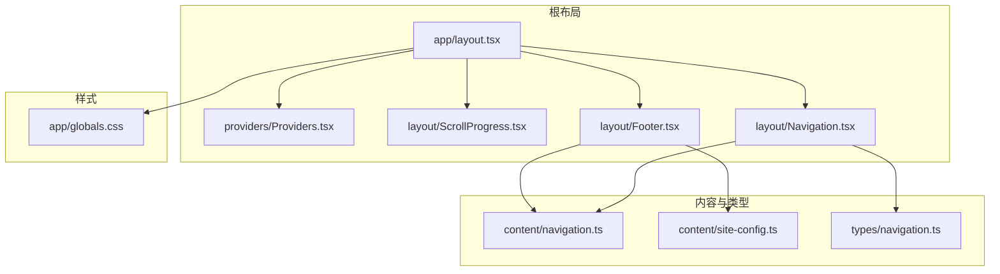
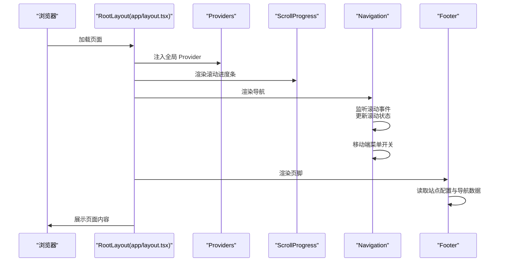
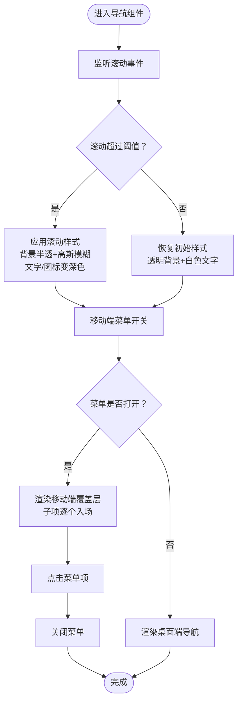
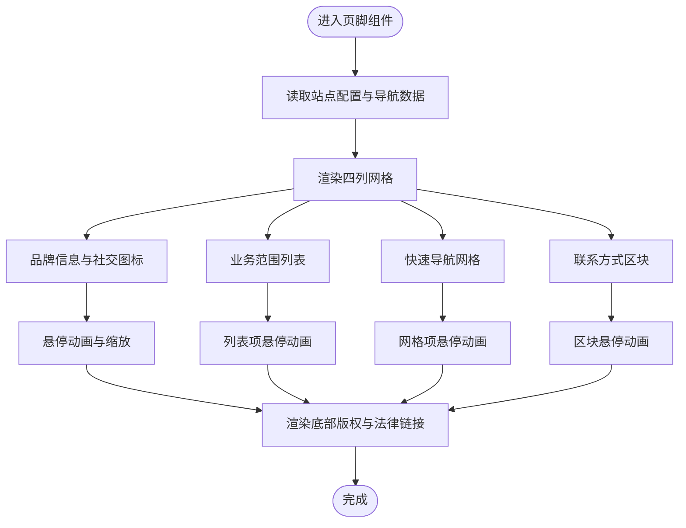
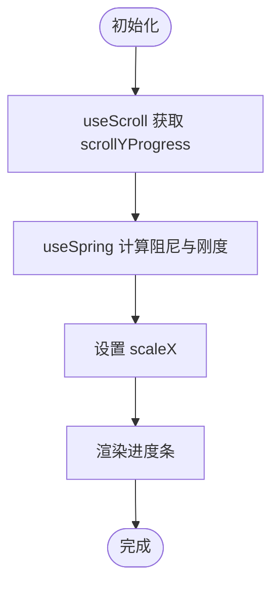
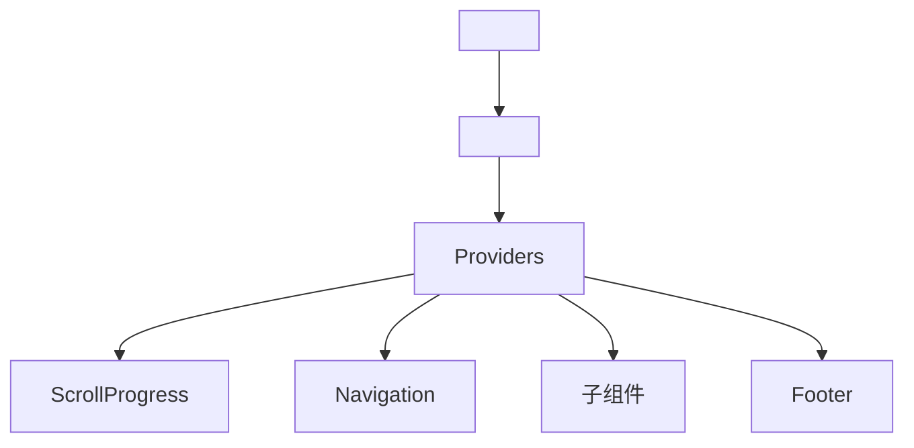
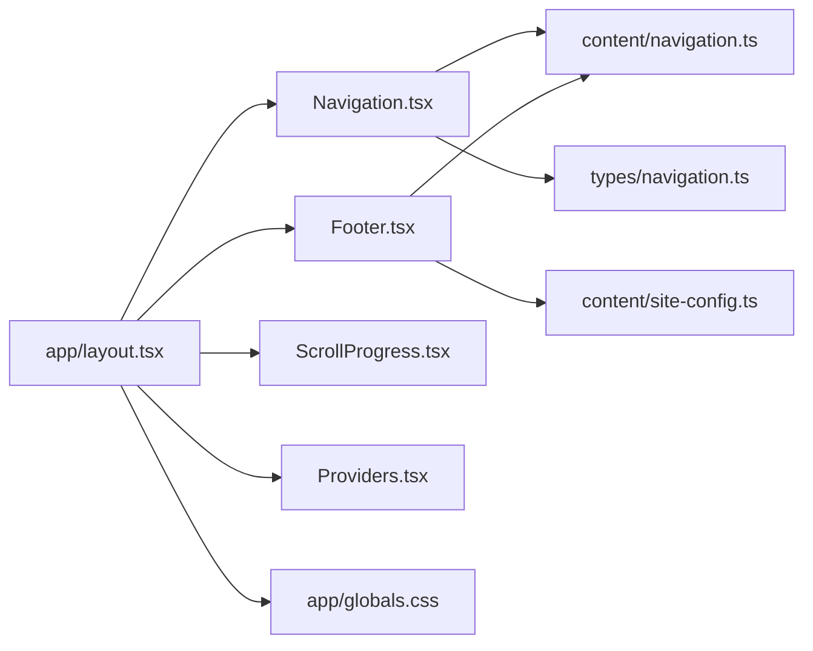

# 布局组件

<cite>
**本文引用的文件**
- [frontend/components/layout/Navigation.tsx](file://frontend/components/layout/Navigation.tsx)
- [frontend/components/layout/Footer.tsx](file://frontend/components/layout/Footer.tsx)
- [frontend/components/layout/ScrollProgress.tsx](file://frontend/components/layout/ScrollProgress.tsx)
- [frontend/components/providers/Providers.tsx](file://frontend/components/providers/Providers.tsx)
- [frontend/app/layout.tsx](file://frontend/app/layout.tsx)
- [frontend/content/navigation.ts](file://frontend/content/navigation.ts)
- [frontend/content/site-config.ts](file://frontend/content/site-config.ts)
- [frontend/types/navigation.ts](file://frontend/types/navigation.ts)
- [frontend/app/globals.css](file://frontend/app/globals.css)
- [frontend/app/page.tsx](file://frontend/app/page.tsx)
- [frontend/app/about/page.tsx](file://frontend/app/about/page.tsx)
</cite>

## 目录
1. [简介](#简介)
2. [项目结构](#项目结构)
3. [核心组件](#核心组件)
4. [架构总览](#架构总览)
5. [详细组件分析](#详细组件分析)
6. [依赖关系分析](#依赖关系分析)
7. [性能考量](#性能考量)
8. [故障排查指南](#故障排查指南)
9. [结论](#结论)
10. [附录：自定义与样式覆盖](#附录自定义与样式覆盖)

## 简介
本文件聚焦于前端布局组件体系，深入解析导航组件的响应式设计、滚动效果、移动端菜单切换与动画过渡；阐述页脚组件的设计模式（品牌信息、业务范围、快速导航、联系方式、版权与法律链接）以及多语言支持的可扩展性；解释滚动进度条组件的工作机制与用户体验优化；说明根布局组件的结构设计与 Provider 包装器的作用；并提供组件间协作模式与状态管理最佳实践，帮助开发者在不破坏现有风格的前提下进行定制化开发。

## 项目结构
布局相关的核心文件分布如下：
- 根布局：负责注入全局 Provider、渲染滚动进度条、导航与页脚，并承载页面内容
- 布局组件：导航、页脚、滚动进度条
- 内容与类型：导航数据、站点配置、类型定义
- 全局样式：品牌色、主题变量与基础层

**图表来源**
- [frontend/app/layout.tsx](file://frontend/app/layout.tsx#L63-L82)
- [frontend/components/providers/Providers.tsx](file://frontend/components/providers/Providers.tsx#L9-L17)
- [frontend/components/layout/ScrollProgress.tsx](file://frontend/components/layout/ScrollProgress.tsx#L6-L20)
- [frontend/components/layout/Navigation.tsx](file://frontend/components/layout/Navigation.tsx#L9-L125)
- [frontend/components/layout/Footer.tsx](file://frontend/components/layout/Footer.tsx#L10-L207)
- [frontend/content/navigation.ts](file://frontend/content/navigation.ts#L1-L38)
- [frontend/content/site-config.ts](file://frontend/content/site-config.ts#L1-L47)
- [frontend/types/navigation.ts](file://frontend/types/navigation.ts#L1-L50)
- [frontend/app/globals.css](file://frontend/app/globals.css#L1-L203)

**章节来源**
- [frontend/app/layout.tsx](file://frontend/app/layout.tsx#L1-L83)
- [frontend/components/layout/Navigation.tsx](file://frontend/components/layout/Navigation.tsx#L1-L126)
- [frontend/components/layout/Footer.tsx](file://frontend/components/layout/Footer.tsx#L1-L208)
- [frontend/components/layout/ScrollProgress.tsx](file://frontend/components/layout/ScrollProgress.tsx#L1-L21)
- [frontend/components/providers/Providers.tsx](file://frontend/components/providers/Providers.tsx#L1-L18)
- [frontend/content/navigation.ts](file://frontend/content/navigation.ts#L1-L38)
- [frontend/content/site-config.ts](file://frontend/content/site-config.ts#L1-L47)
- [frontend/types/navigation.ts](file://frontend/types/navigation.ts#L1-L50)
- [frontend/app/globals.css](file://frontend/app/globals.css#L1-L203)

## 核心组件
- 导航组件（Navigation）
  - 响应式设计：桌面端横向导航，移动端汉堡菜单
  - 滚动效果：随滚动改变背景、阴影与文字颜色
  - 动画过渡：使用受控动画库实现平滑展开/收起
  - 移动端菜单切换：点击汉堡按钮控制菜单显隐
- 页脚组件（Footer）
  - 设计模式：四列布局（品牌信息、业务范围、快速导航、联系方式），底部版权与法律链接
  - 多语言支持：通过内容配置与链接映射实现国际化扩展
  - 动画过渡：使用受控动画库实现进入视口时的逐项入场
- 滚动进度条（ScrollProgress）
  - 工作机制：基于滚动进度计算 scaleX，使用弹簧阻尼实现顺滑过渡
  - 用户体验：固定顶部，渐变色背景，轻量不遮挡内容
- Provider 包装器（Providers）
  - 结构作用：作为全局上下文容器，便于后续接入主题、国际化、用户态等 Provider

**章节来源**
- [frontend/components/layout/Navigation.tsx](file://frontend/components/layout/Navigation.tsx#L9-L125)
- [frontend/components/layout/Footer.tsx](file://frontend/components/layout/Footer.tsx#L10-L207)
- [frontend/components/layout/ScrollProgress.tsx](file://frontend/components/layout/ScrollProgress.tsx#L6-L20)
- [frontend/components/providers/Providers.tsx](file://frontend/components/providers/Providers.tsx#L9-L17)

## 架构总览
根布局负责装配全局 Provider、滚动进度条、导航与页脚，并将页面内容包裹在中间区域。导航与页脚均从内容模块读取配置，样式统一由全局 CSS 提供品牌色与主题变量。

**图表来源**
- [frontend/app/layout.tsx](file://frontend/app/layout.tsx#L63-L82)
- [frontend/components/layout/ScrollProgress.tsx](file://frontend/components/layout/ScrollProgress.tsx#L6-L20)
- [frontend/components/layout/Navigation.tsx](file://frontend/components/layout/Navigation.tsx#L13-L19)
- [frontend/components/layout/Footer.tsx](file://frontend/components/layout/Footer.tsx#L7-L8)

**章节来源**
- [frontend/app/layout.tsx](file://frontend/app/layout.tsx#L63-L82)

## 详细组件分析

### 导航组件（Navigation）
- 响应式设计
  - 桌面端：横向导航栏，悬停下划线动画，文字颜色随滚动状态变化
  - 移动端：汉堡菜单，点击切换显隐，子项逐个入场
- 滚动效果
  - 监听窗口滚动，超过阈值后导航栏背景变为半透明高斯模糊，同时调整文字与图标颜色
  - 移动端菜单打开时覆盖导航栏背景，确保层级与视觉一致性
- 动画过渡
  - 使用受控动画库实现菜单展开/收起的透明度与高度变化
  - 子项入场采用延迟序列，增强节奏感
- 移动端菜单切换
  - 点击汉堡按钮切换状态，点击菜单项自动关闭菜单
- 交互细节
  - Logo 放大与悬停缩放，咨询按钮渐变背景与位移动画
  - 导航项悬停时下划线由内向外扩展

**图表来源**
- [frontend/components/layout/Navigation.tsx](file://frontend/components/layout/Navigation.tsx#L13-L19)
- [frontend/components/layout/Navigation.tsx](file://frontend/components/layout/Navigation.tsx#L22-L26)
- [frontend/components/layout/Navigation.tsx](file://frontend/components/layout/Navigation.tsx#L81-L122)

**章节来源**
- [frontend/components/layout/Navigation.tsx](file://frontend/components/layout/Navigation.tsx#L9-L125)
- [frontend/content/navigation.ts](file://frontend/content/navigation.ts#L3-L10)

### 页脚组件（Footer）
- 设计模式
  - 四列布局：品牌信息（含社交图标）、业务范围、快速导航、联系方式
  - 底部版权与法律链接，支持多语言扩展
- 多语言支持
  - 通过内容配置与链接映射实现不同语言版本的导航与文案
  - 社交图标映射到对应图片资源，便于替换或扩展
- 动画过渡
  - 进入视口时，网格列与子元素按序入场，提升加载体验
  - 各列子项悬停时具备位移与颜色过渡，增强交互反馈
- 视觉与层级
  - 背景装饰元素与混合模式营造科技感，保持内容层级清晰

**图表来源**
- [frontend/components/layout/Footer.tsx](file://frontend/components/layout/Footer.tsx#L11-L28)
- [frontend/components/layout/Footer.tsx](file://frontend/components/layout/Footer.tsx#L51-L179)
- [frontend/components/layout/Footer.tsx](file://frontend/components/layout/Footer.tsx#L182-L204)
- [frontend/content/navigation.ts](file://frontend/content/navigation.ts#L12-L31)
- [frontend/content/site-config.ts](file://frontend/content/site-config.ts#L39-L43)

**章节来源**
- [frontend/components/layout/Footer.tsx](file://frontend/components/layout/Footer.tsx#L10-L207)
- [frontend/content/navigation.ts](file://frontend/content/navigation.ts#L12-L37)
- [frontend/content/site-config.ts](file://frontend/content/site-config.ts#L39-L43)

### 滚动进度条（ScrollProgress）
- 工作机制
  - 使用滚动进度计算 scaleX，结合弹簧阻尼参数实现顺滑跟随
  - 固定定位在页面顶部，渐变色背景，原点对齐左侧
- 用户体验优化
  - 阻尼与刚度参数平衡流畅度与响应速度
  - 轻量样式避免遮挡主要内容，提升可读性

**图表来源**
- [frontend/components/layout/ScrollProgress.tsx](file://frontend/components/layout/ScrollProgress.tsx#L7-L12)
- [frontend/components/layout/ScrollProgress.tsx](file://frontend/components/layout/ScrollProgress.tsx#L15-L18)

**章节来源**
- [frontend/components/layout/ScrollProgress.tsx](file://frontend/components/layout/ScrollProgress.tsx#L6-L20)

### 根布局组件（RootLayout）与 Provider 包装器
- 结构设计
  - 在 HTML 根节点包裹 Provider，注入全局上下文
  - 固定顺序：滚动进度条 → 导航 → 主体内容 → 页脚
- Provider 包装器
  - 当前为空壳，预留扩展空间（如主题、国际化、认证等 Provider）

**图表来源**
- [frontend/app/layout.tsx](file://frontend/app/layout.tsx#L63-L82)
- [frontend/components/providers/Providers.tsx](file://frontend/components/providers/Providers.tsx#L9-L17)

**章节来源**
- [frontend/app/layout.tsx](file://frontend/app/layout.tsx#L63-L82)
- [frontend/components/providers/Providers.tsx](file://frontend/components/providers/Providers.tsx#L9-L17)

## 依赖关系分析
- 组件依赖
  - Navigation 依赖内容模块中的导航数据
  - Footer 依赖站点配置与导航数据
  - RootLayout 依赖 Provider、ScrollProgress、Navigation、Footer
- 类型与样式
  - 导航类型定义位于类型模块
  - 品牌色与主题变量由全局样式提供

**图表来源**
- [frontend/components/layout/Navigation.tsx](file://frontend/components/layout/Navigation.tsx#L7-L7)
- [frontend/components/layout/Footer.tsx](file://frontend/components/layout/Footer.tsx#L7-L8)
- [frontend/app/layout.tsx](file://frontend/app/layout.tsx#L2-L5)
- [frontend/content/navigation.ts](file://frontend/content/navigation.ts#L1-L38)
- [frontend/content/site-config.ts](file://frontend/content/site-config.ts#L1-L47)
- [frontend/types/navigation.ts](file://frontend/types/navigation.ts#L1-L50)
- [frontend/app/globals.css](file://frontend/app/globals.css#L1-L203)

**章节来源**
- [frontend/components/layout/Navigation.tsx](file://frontend/components/layout/Navigation.tsx#L7-L7)
- [frontend/components/layout/Footer.tsx](file://frontend/components/layout/Footer.tsx#L7-L8)
- [frontend/app/layout.tsx](file://frontend/app/layout.tsx#L2-L5)

## 性能考量
- 滚动事件节流
  - 导航滚动监听建议在组件卸载时清理事件监听，避免内存泄漏
- 动画性能
  - 使用 transform 与 opacity 控制动画，减少重排
  - 弹簧阻尼参数需根据设备性能调优
- 资源加载
  - 页脚社交图标使用懒加载与合适的尺寸，降低首屏压力
- SSR/CSR 注意
  - 根布局启用抑制水合警告，确保客户端渲染一致性

**章节来源**
- [frontend/components/layout/Navigation.tsx](file://frontend/components/layout/Navigation.tsx#L13-L19)
- [frontend/components/layout/ScrollProgress.tsx](file://frontend/components/layout/ScrollProgress.tsx#L8-L12)
- [frontend/app/layout.tsx](file://frontend/app/layout.tsx#L69-L70)

## 故障排查指南
- 导航滚动样式未生效
  - 检查滚动阈值与类名条件逻辑
  - 确认全局样式中品牌色变量可用
- 移动端菜单无法关闭
  - 确认菜单项点击回调正确触发状态切换
- 页脚图标不显示
  - 检查图标映射与图片路径
  - 确认图片资源存在且可访问
- 滚动进度条不跟随
  - 检查滚动进度计算与弹簧阻尼参数
  - 确认容器滚动属性与页面高度

**章节来源**
- [frontend/components/layout/Navigation.tsx](file://frontend/components/layout/Navigation.tsx#L22-L26)
- [frontend/components/layout/Navigation.tsx](file://frontend/components/layout/Navigation.tsx#L68-L75)
- [frontend/components/layout/Footer.tsx](file://frontend/components/layout/Footer.tsx#L30-L34)
- [frontend/components/layout/ScrollProgress.tsx](file://frontend/components/layout/ScrollProgress.tsx#L7-L12)

## 结论
该布局组件体系以简洁的结构实现了响应式导航、优雅的页脚设计与顺滑的滚动进度条体验。通过内容驱动的配置与全局样式变量，既保证了品牌一致性，也为多语言与主题扩展提供了良好基础。建议在后续迭代中进一步完善滚动事件的性能优化与动画参数的设备适配。

## 附录：自定义与样式覆盖
- 自定义导航
  - 修改导航数据：在内容模块中增删导航项，调整移动端显示策略
  - 扩展类型：在类型模块中新增字段以支持更复杂的导航结构
- 自定义页脚
  - 增加列或调整布局：在页脚组件中新增列并调整网格
  - 多语言支持：通过内容模块映射不同语言的链接与文案
- 样式覆盖
  - 品牌色：通过全局样式变量覆盖品牌蓝与金色
  - 动画参数：调整过渡时长与缓动函数以适配不同设备
  - 组件局部样式：通过类名优先级覆盖组件默认样式，但需注意与全局主题的一致性

**章节来源**
- [frontend/content/navigation.ts](file://frontend/content/navigation.ts#L1-L38)
- [frontend/types/navigation.ts](file://frontend/types/navigation.ts#L3-L12)
- [frontend/app/globals.css](file://frontend/app/globals.css#L4-L64)