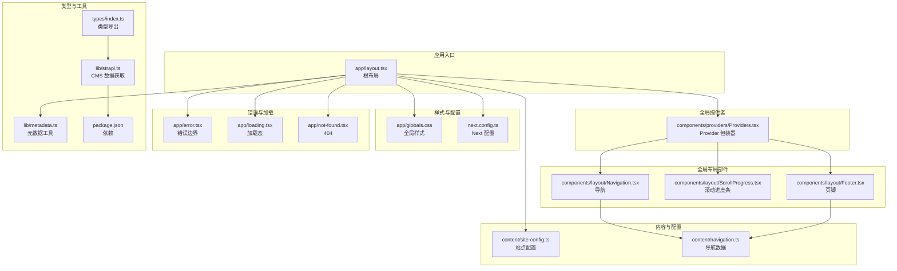
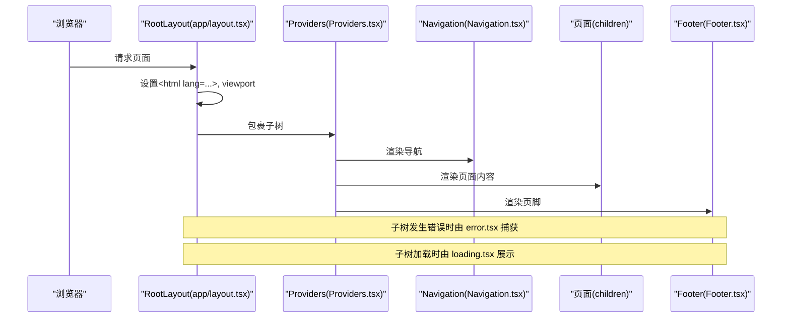
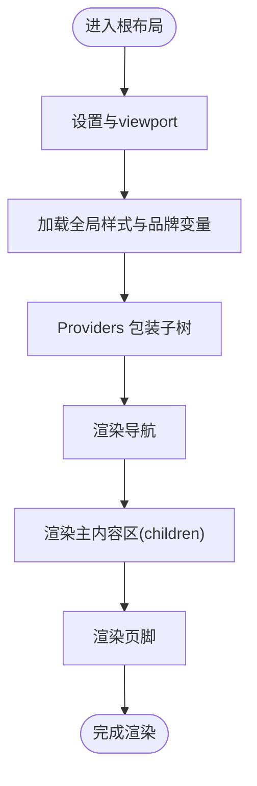
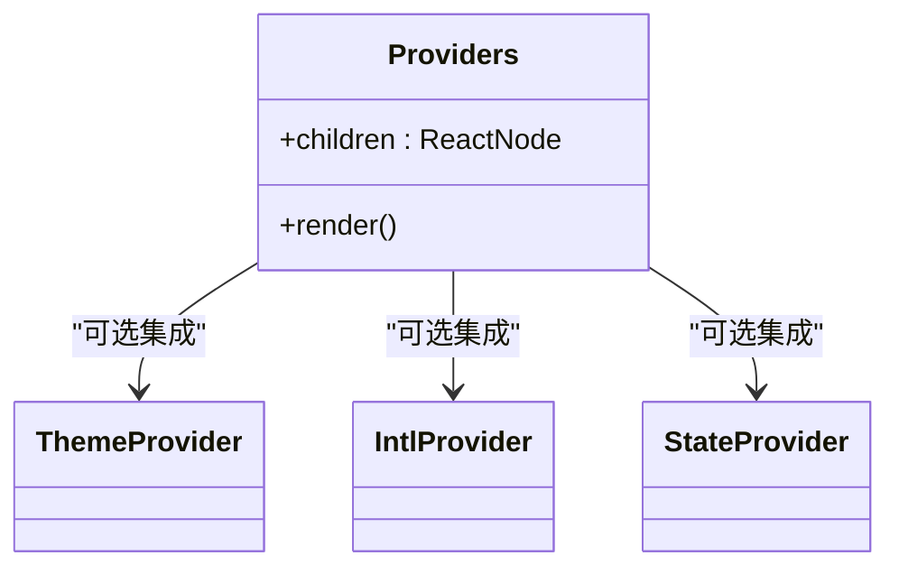
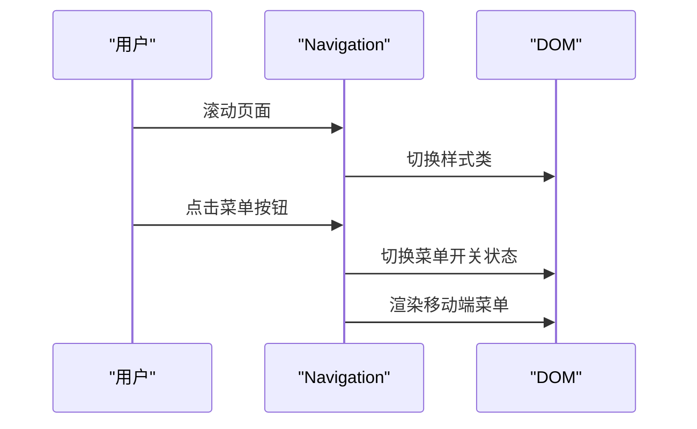
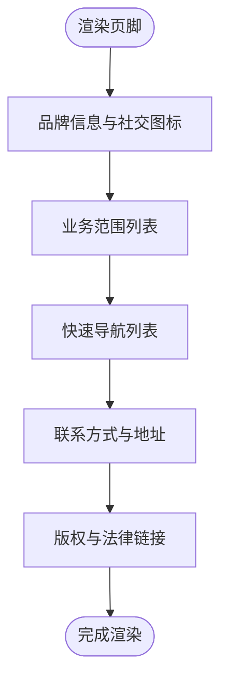
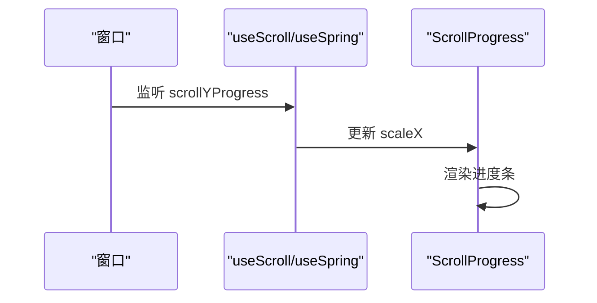
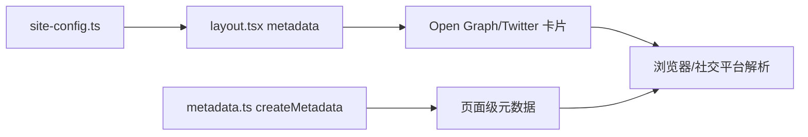
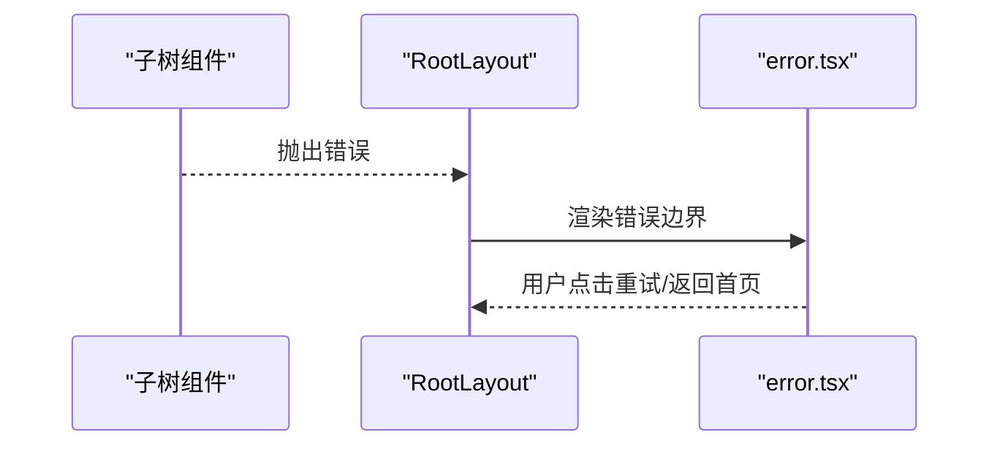
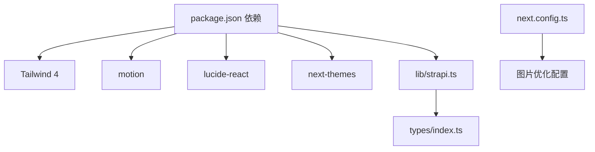

# 根布局组件

<cite>
**本文引用的文件**
- [frontend/app/layout.tsx](file://frontend/app/layout.tsx)
- [frontend/components/providers/Providers.tsx](file://frontend/components/providers/Providers.tsx)
- [frontend/components/layout/Navigation.tsx](file://frontend/components/layout/Navigation.tsx)
- [frontend/components/layout/Footer.tsx](file://frontend/components/layout/Footer.tsx)
- [frontend/components/layout/ScrollProgress.tsx](file://frontend/components/layout/ScrollProgress.tsx)
- [frontend/content/site-config.ts](file://frontend/content/site-config.ts)
- [frontend/lib/metadata.ts](file://frontend/lib/metadata.ts)
- [frontend/app/error.tsx](file://frontend/app/error.tsx)
- [frontend/app/loading.tsx](file://frontend/app/loading.tsx)
- [frontend/app/not-found.tsx](file://frontend/app/not-found.tsx)
- [frontend/next.config.ts](file://frontend/next.config.ts)
- [frontend/app/globals.css](file://frontend/app/globals.css)
- [frontend/content/navigation.ts](file://frontend/content/navigation.ts)
- [frontend/lib/strapi.ts](file://frontend/lib/strapi.ts)
- [frontend/package.json](file://frontend/package.json)
- [frontend/types/index.ts](file://frontend/types/index.ts)
</cite>

## 目录
1. [引言](#引言)
2. [项目结构](#项目结构)
3. [核心组件](#核心组件)
4. [架构总览](#架构总览)
5. [详细组件分析](#详细组件分析)
6. [依赖分析](#依赖分析)
7. [性能考虑](#性能考虑)
8. [故障排查指南](#故障排查指南)
9. [结论](#结论)
10. [附录](#附录)

## 引言
本文件聚焦于 Next.js App Router 的根布局组件，系统性解析其布局层次结构、嵌套关系与渲染流程；阐述 Provider 包装器在全局状态管理中的作用（主题、国际化、状态管理）；总结布局组件的缓存策略与性能优化技巧；给出可定制配置与扩展方法；说明错误边界与加载状态处理机制；解释 SEO 元数据与结构化数据的注入方式；最后说明与 Next.js App Router 的集成模式与路由守卫的实现思路。

## 项目结构
前端采用 App Router 结构，根布局位于 app 目录下，负责顶层 HTML 结构、全局样式与全局 Provider 包装。页面级组件按目录划分功能域，如 about、contact、news、products、solutions 等，并在各域内提供 error、loading、page 等约定文件以支持错误边界与加载态。

图表来源
- [frontend/app/layout.tsx](file://frontend/app/layout.tsx#L1-L83)
- [frontend/components/providers/Providers.tsx](file://frontend/components/providers/Providers.tsx#L1-L18)
- [frontend/components/layout/Navigation.tsx](file://frontend/components/layout/Navigation.tsx#L1-L126)
- [frontend/components/layout/Footer.tsx](file://frontend/components/layout/Footer.tsx#L1-L208)
- [frontend/components/layout/ScrollProgress.tsx](file://frontend/components/layout/ScrollProgress.tsx#L1-L21)
- [frontend/content/site-config.ts](file://frontend/content/site-config.ts#L1-L47)
- [frontend/content/navigation.ts](file://frontend/content/navigation.ts#L1-L38)
- [frontend/app/globals.css](file://frontend/app/globals.css#L1-L203)
- [frontend/next.config.ts](file://frontend/next.config.ts#L1-L39)
- [frontend/app/error.tsx](file://frontend/app/error.tsx#L1-L66)
- [frontend/app/loading.tsx](file://frontend/app/loading.tsx#L1-L15)
- [frontend/app/not-found.tsx](file://frontend/app/not-found.tsx#L1-L42)
- [frontend/lib/metadata.ts](file://frontend/lib/metadata.ts#L1-L60)
- [frontend/lib/strapi.ts](file://frontend/lib/strapi.ts#L1-L155)
- [frontend/package.json](file://frontend/package.json#L1-L88)
- [frontend/types/index.ts](file://frontend/types/index.ts#L1-L28)

章节来源
- [frontend/app/layout.tsx](file://frontend/app/layout.tsx#L1-L83)
- [frontend/next.config.ts](file://frontend/next.config.ts#L1-L39)

## 核心组件
- 根布局 RootLayout：定义顶层 HTML 结构、语言属性、全局样式与 Provider 包装，承载导航、主内容区与页脚。
- Provider 包装器 Providers：作为全局上下文容器，预留主题、国际化与状态管理提供者的挂载点。
- 导航 Navigation：响应式导航栏，含移动端菜单与滚动样式变化。
- 页脚 Footer：多列布局的信息展示与联系信息，配合动画与品牌元素。
- 滚动进度条 ScrollProgress：基于滚动进度的顶部进度指示器。
- 全局样式 globals.css：品牌色、暗色主题变量与 Tailwind 主题层配置。
- 站点配置 site-config.ts：SEO 默认标题、描述、关键词、OG 图等。
- 元数据工具 metadata.ts：统一生成页面级元数据，支持动态标题、描述与 OG 图。
- 错误边界 error.tsx：捕获子树错误并提供重试与返回首页能力。
- 加载态 loading.tsx：骨架加载动画，用于页面切换与数据拉取期间。
- 404 not-found.tsx：未找到页面的友好提示与返回首页链接。
- Next 配置 next.config.ts：图片优化、远程域名白名单、严格模式等。
- Strapi 工具 strapi.ts：与后端 CMS 的数据获取与映射工具。

章节来源
- [frontend/app/layout.tsx](file://frontend/app/layout.tsx#L63-L82)
- [frontend/components/providers/Providers.tsx](file://frontend/components/providers/Providers.tsx#L9-L17)
- [frontend/components/layout/Navigation.tsx](file://frontend/components/layout/Navigation.tsx#L9-L125)
- [frontend/components/layout/Footer.tsx](file://frontend/components/layout/Footer.tsx#L10-L207)
- [frontend/components/layout/ScrollProgress.tsx](file://frontend/components/layout/ScrollProgress.tsx#L6-L20)
- [frontend/app/globals.css](file://frontend/app/globals.css#L1-L203)
- [frontend/content/site-config.ts](file://frontend/content/site-config.ts#L1-L47)
- [frontend/lib/metadata.ts](file://frontend/lib/metadata.ts#L10-L59)
- [frontend/app/error.tsx](file://frontend/app/error.tsx#L5-L65)
- [frontend/app/loading.tsx](file://frontend/app/loading.tsx#L1-L15)
- [frontend/app/not-found.tsx](file://frontend/app/not-found.tsx#L3-L41)
- [frontend/next.config.ts](file://frontend/next.config.ts#L3-L38)
- [frontend/lib/strapi.ts](file://frontend/lib/strapi.ts#L100-L155)

## 架构总览
根布局承担以下职责：
- 定义顶层 HTML 与 viewport 元信息。
- 注入全局样式与品牌主题变量。
- 通过 Providers 统一挂载全局上下文（主题、国际化、状态管理等）。
- 渲染全局导航、主内容区与页脚。
- 提供错误边界、加载态与 404 页面的统一处理。

图表来源
- [frontend/app/layout.tsx](file://frontend/app/layout.tsx#L63-L82)
- [frontend/components/providers/Providers.tsx](file://frontend/components/providers/Providers.tsx#L9-L17)
- [frontend/components/layout/Navigation.tsx](file://frontend/components/layout/Navigation.tsx#L9-L125)
- [frontend/components/layout/Footer.tsx](file://frontend/components/layout/Footer.tsx#L10-L207)
- [frontend/app/error.tsx](file://frontend/app/error.tsx#L5-L65)
- [frontend/app/loading.tsx](file://frontend/app/loading.tsx#L1-L15)

## 详细组件分析

### 根布局 RootLayout
- 渲染流程
  - 设置 HTML 语言与抑制水合警告。
  - 应用全局样式与品牌主题变量。
  - 通过 Providers 包装子树，确保全局上下文可用。
  - 渲染滚动进度条、导航、主内容区与页脚。
- 布局层次
  - 顶层：html/body。
  - 全局：Providers → ScrollProgress → Navigation → main → Footer。
  - 子树：各页面的 page.tsx 内容。
- SEO 元数据
  - 使用 metadata 常量与 site-config 提供默认值。
  - 支持 Open Graph 与 Twitter 卡片。
  - viewport 提供主题色随系统偏好切换。
- 错误与加载
  - 子树错误由 error.tsx 捕获并展示。
  - 子树加载由 loading.tsx 展示。
  - 404 由 not-found.tsx 处理。

图表来源
- [frontend/app/layout.tsx](file://frontend/app/layout.tsx#L63-L82)
- [frontend/app/globals.css](file://frontend/app/globals.css#L1-L203)
- [frontend/content/site-config.ts](file://frontend/content/site-config.ts#L21-L29)

章节来源
- [frontend/app/layout.tsx](file://frontend/app/layout.tsx#L9-L61)
- [frontend/app/layout.tsx](file://frontend/app/layout.tsx#L63-L82)

### Provider 包装器 Providers
- 作用
  - 作为全局上下文容器，预留主题提供者、国际化提供者与状态管理提供者挂载点。
  - 保持根布局简洁，将全局状态与主题逻辑外置到独立模块。
- 扩展建议
  - 在注释位置添加主题提供者（如 next-themes）与状态管理提供者。
  - 国际化提供者可结合 i18n 配置进行集成。

图表来源
- [frontend/components/providers/Providers.tsx](file://frontend/components/providers/Providers.tsx#L9-L17)

章节来源
- [frontend/components/providers/Providers.tsx](file://frontend/components/providers/Providers.tsx#L1-L18)

### 导航 Navigation
- 功能要点
  - 响应式设计，桌面端为横向导航，移动端显示汉堡菜单。
  - 滚动时改变样式，移动端打开菜单时覆盖样式。
  - 使用动画库实现菜单展开与子项入场动画。
- 与根布局的关系
  - 作为根布局的直接子节点，受 Providers 包裹。
  - 读取导航配置来自 content/navigation.ts。

图表来源
- [frontend/components/layout/Navigation.tsx](file://frontend/components/layout/Navigation.tsx#L9-L125)
- [frontend/content/navigation.ts](file://frontend/content/navigation.ts#L3-L10)

章节来源
- [frontend/components/layout/Navigation.tsx](file://frontend/components/layout/Navigation.tsx#L1-L126)
- [frontend/content/navigation.ts](file://frontend/content/navigation.ts#L1-L38)

### 页脚 Footer
- 功能要点
  - 多列布局：品牌信息、业务范围、快速导航、联系方式。
  - 使用动画库实现入场动画与悬停效果。
  - 读取配置来自 content/navigation.ts 与 content/site-config.ts。
- 与根布局的关系
  - 作为根布局的直接子节点，受 Providers 包裹。

图表来源
- [frontend/components/layout/Footer.tsx](file://frontend/components/layout/Footer.tsx#L10-L207)
- [frontend/content/navigation.ts](file://frontend/content/navigation.ts#L12-L31)
- [frontend/content/site-config.ts](file://frontend/content/site-config.ts#L3-L44)

章节来源
- [frontend/components/layout/Footer.tsx](file://frontend/components/layout/Footer.tsx#L1-L208)
- [frontend/content/navigation.ts](file://frontend/content/navigation.ts#L1-L38)
- [frontend/content/site-config.ts](file://frontend/content/site-config.ts#L1-L47)

### 滚动进度条 ScrollProgress
- 功能要点
  - 基于滚动进度使用弹簧动画实现顶部进度条。
  - 固定定位，z-index 较高，避免被覆盖。
- 与根布局的关系
  - 作为根布局的直接子节点，受 Providers 包裹。

图表来源
- [frontend/components/layout/ScrollProgress.tsx](file://frontend/components/layout/ScrollProgress.tsx#L6-L20)

章节来源
- [frontend/components/layout/ScrollProgress.tsx](file://frontend/components/layout/ScrollProgress.tsx#L1-L21)

### SEO 元数据与结构化数据
- 根布局元数据
  - 使用 metadata 常量与 site-config 提供默认标题、描述、关键词、OG 图与 Twitter 卡片。
  - viewport 提供主题色随系统偏好切换。
- 页面级元数据
  - 使用 metadata 工具函数统一生成页面级标题、描述与 OG 图，支持 noIndex 控制。
- 结构化数据
  - 可在页面组件中通过结构化数据组件或 Head 标签注入 JSON-LD。

图表来源
- [frontend/content/site-config.ts](file://frontend/content/site-config.ts#L21-L29)
- [frontend/app/layout.tsx](file://frontend/app/layout.tsx#L9-L52)
- [frontend/lib/metadata.ts](file://frontend/lib/metadata.ts#L10-L59)

章节来源
- [frontend/app/layout.tsx](file://frontend/app/layout.tsx#L9-L61)
- [frontend/lib/metadata.ts](file://frontend/lib/metadata.ts#L1-L60)
- [frontend/content/site-config.ts](file://frontend/content/site-config.ts#L1-L47)

### 错误边界与加载状态
- 错误边界 error.tsx
  - 接收 error 与 reset 参数，记录错误并提供重试与返回首页按钮。
  - 适用于子树抛错时的兜底展示。
- 加载状态 loading.tsx
  - 页面切换或数据拉取期间的骨架加载动画。
- 404 not-found.tsx
  - 未找到页面的友好提示与返回首页链接。

图表来源
- [frontend/app/error.tsx](file://frontend/app/error.tsx#L5-L65)
- [frontend/app/loading.tsx](file://frontend/app/loading.tsx#L1-L15)
- [frontend/app/not-found.tsx](file://frontend/app/not-found.tsx#L3-L41)

章节来源
- [frontend/app/error.tsx](file://frontend/app/error.tsx#L1-L66)
- [frontend/app/loading.tsx](file://frontend/app/loading.tsx#L1-L15)
- [frontend/app/not-found.tsx](file://frontend/app/not-found.tsx#L1-L42)

### 与 Next.js App Router 的集成与路由守卫
- 集成模式
  - 根布局负责顶层结构与全局上下文；页面组件负责具体业务。
  - 约定文件 error、loading、not-found 分别处理错误、加载与 404。
- 路由守卫
  - 可在页面组件中通过客户端逻辑或中间件实现权限控制。
  - 若需全局守卫，可在应用层通过中间件或拦截器实现（需在服务器端配置）。

章节来源
- [frontend/app/layout.tsx](file://frontend/app/layout.tsx#L63-L82)
- [frontend/app/error.tsx](file://frontend/app/error.tsx#L1-L66)
- [frontend/app/loading.tsx](file://frontend/app/loading.tsx#L1-L15)
- [frontend/app/not-found.tsx](file://frontend/app/not-found.tsx#L1-L42)

## 依赖分析
- 样式与主题
  - Tailwind 4 与 @tailwindcss/postcss，全局样式通过 globals.css 注入品牌色与主题变量。
  - next-themes 用于主题切换（已在依赖中，可在 Providers 中集成）。
- 动画与交互
  - motion 用于滚动进度与布局动画。
  - lucide-react 提供图标。
- 类型与工具
  - types/index.ts 汇总类型导出，strapi.ts 提供 CMS 数据获取与映射。
- 图片优化
  - next.config.ts 配置远程域名白名单、现代图片格式与响应式尺寸。

图表来源
- [frontend/package.json](file://frontend/package.json#L12-L74)
- [frontend/next.config.ts](file://frontend/next.config.ts#L3-L38)
- [frontend/lib/strapi.ts](file://frontend/lib/strapi.ts#L1-L155)
- [frontend/types/index.ts](file://frontend/types/index.ts#L1-L28)

章节来源
- [frontend/package.json](file://frontend/package.json#L1-L88)
- [frontend/next.config.ts](file://frontend/next.config.ts#L1-L39)
- [frontend/lib/strapi.ts](file://frontend/lib/strapi.ts#L1-L155)
- [frontend/types/index.ts](file://frontend/types/index.ts#L1-L28)

## 性能考虑
- 图片优化
  - 配置远程域名白名单与现代图片格式，减少带宽与提升加载速度。
  - 响应式图片尺寸与格式选择有助于在不同设备上优化体验。
- 动画与滚动
  - 滚动进度条使用弹簧动画，注意性能开销，避免在低端设备上造成卡顿。
- 全局样式
  - 将品牌色与主题变量集中管理，减少重复计算与样式抖动。
- 缓存策略
  - 页面级数据可通过 fetch 的 next.revalidate 控制缓存与更新频率（参考 strapi.ts）。
  - 根布局本身不涉及页面级缓存，但可通过页面级缓存间接影响整体性能。

章节来源
- [frontend/next.config.ts](file://frontend/next.config.ts#L5-L33)
- [frontend/components/layout/ScrollProgress.tsx](file://frontend/components/layout/ScrollProgress.tsx#L6-L20)
- [frontend/app/globals.css](file://frontend/app/globals.css#L1-L203)
- [frontend/lib/strapi.ts](file://frontend/lib/strapi.ts#L100-L111)

## 故障排查指南
- 水合警告
  - 根布局设置了 suppressHydrationWarning，若仍出现警告，检查子树中客户端组件的 SSR/CSR 不一致。
- 图片加载失败
  - 检查 next.config.ts 中的 remotePatterns 是否包含目标域名。
- 主题切换异常
  - 确认已集成 next-themes 并正确初始化。
- 错误边界未触发
  - 确保子树确实抛出了错误；确认 error.tsx 文件路径与命名符合约定。
- 加载态不消失
  - 检查页面异步数据加载逻辑，确保在数据完成后解除加载状态。

章节来源
- [frontend/app/layout.tsx](file://frontend/app/layout.tsx#L69)
- [frontend/next.config.ts](file://frontend/next.config.ts#L7-L27)
- [frontend/package.json](file://frontend/package.json#L56)
- [frontend/app/error.tsx](file://frontend/app/error.tsx#L12-L15)

## 结论
根布局组件在 Next.js App Router 中承担顶层结构与全局上下文的职责。通过 Providers 统一挂载主题、国际化与状态管理提供者，结合 Navigation、ScrollProgress、Footer 实现一致的用户体验。借助约定文件 error、loading、not-found 提供完善的错误与加载兜底。配合 SEO 元数据工具与结构化数据注入，满足搜索引擎优化需求。通过图片优化、动画性能与缓存策略，保障整体性能表现。

## 附录
- 自定义配置选项
  - 根布局元数据：在 layout.tsx 的 metadata 常量中调整默认标题、描述、关键词与 OG 图。
  - 站点配置：在 site-config.ts 中维护品牌名称、描述、SEO 默认值与社交媒体链接。
  - Provider 扩展：在 Providers 中添加主题、国际化与状态管理提供者。
- 扩展方法
  - 在根布局中引入国际化提供者与状态管理提供者。
  - 在 Navigation 与 Footer 中接入动态数据源（如 CMS）。
  - 在页面组件中使用 metadata 工具函数生成页面级元数据。
- 路由守卫实现
  - 在页面组件中实现客户端权限校验；或在服务器端通过中间件实现全局守卫。

章节来源
- [frontend/app/layout.tsx](file://frontend/app/layout.tsx#L9-L61)
- [frontend/content/site-config.ts](file://frontend/content/site-config.ts#L1-L47)
- [frontend/components/providers/Providers.tsx](file://frontend/components/providers/Providers.tsx#L9-L17)
- [frontend/lib/metadata.ts](file://frontend/lib/metadata.ts#L10-L59)
- [frontend/lib/strapi.ts](file://frontend/lib/strapi.ts#L100-L155)