# 滚动进度条组件

<cite>
**本文档引用的文件**
- [frontend/components/layout/ScrollProgress.tsx](file://frontend/components/layout/ScrollProgress.tsx)
- [frontend/app/layout.tsx](file://frontend/app/layout.tsx)
- [frontend/app/globals.css](file://frontend/app/globals.css)
- [frontend/components/layout/Navigation.tsx](file://frontend/components/layout/Navigation.tsx)
- [frontend/components/providers/Providers.tsx](file://frontend/components/providers/Providers.tsx)
- [specs/001-nextjs-migration/research.md](file://specs/001-nextjs-migration/research.md)
- [frontend/package.json](file://frontend/package.json)
- [frontend/components/sections/Hero.tsx](file://frontend/components/sections/Hero.tsx)
</cite>

## 目录
1. [简介](#简介)
2. [项目结构](#项目结构)
3. [核心组件](#核心组件)
4. [架构概览](#架构概览)
5. [详细组件分析](#详细组件分析)
6. [依赖关系分析](#依赖关系分析)
7. [性能考虑](#性能考虑)
8. [故障排除指南](#故障排除指南)
9. [结论](#结论)
10. [附录](#附录)

## 简介

滚动进度条组件是一个轻量级的视觉反馈组件，用于显示用户在页面中的滚动进度。该组件基于 Motion 库实现流畅的动画效果，采用弹簧物理引擎来提供顺滑的滚动体验。组件通过监听全局滚动事件，实时计算滚动进度并以视觉化的方式呈现。

该组件的设计目标是在不干扰页面主要内容的情况下，为用户提供清晰的滚动位置指示，增强用户的浏览体验。通过精心设计的颜色渐变和动画效果，组件能够在不同设备上提供一致的视觉反馈。

## 项目结构

滚动进度条组件位于前端项目的布局组件目录中，与导航栏、页脚等其他布局组件共同构成了完整的页面骨架。

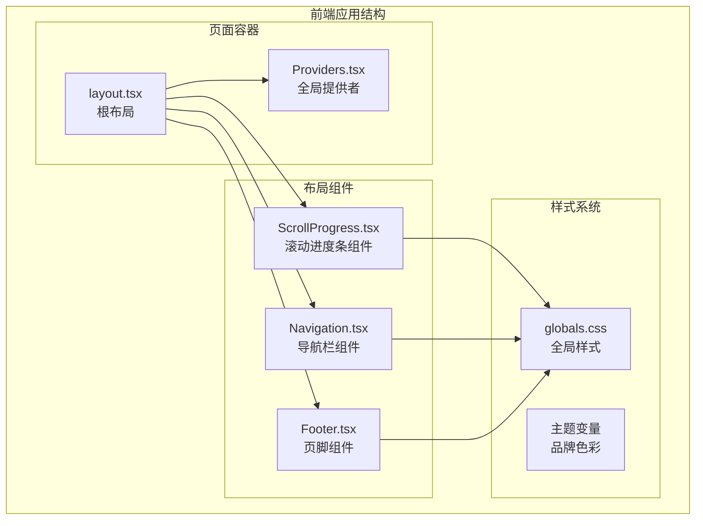

**图表来源**
- [frontend/components/layout/ScrollProgress.tsx](file://frontend/components/layout/ScrollProgress.tsx#L1-L21)
- [frontend/app/layout.tsx](file://frontend/app/layout.tsx#L63-L82)
- [frontend/app/globals.css](file://frontend/app/globals.css#L1-L203)

**章节来源**
- [frontend/components/layout/ScrollProgress.tsx](file://frontend/components/layout/ScrollProgress.tsx#L1-L21)
- [frontend/app/layout.tsx](file://frontend/app/layout.tsx#L1-L83)

## 核心组件

### 滚动进度条组件架构

滚动进度条组件采用简洁而高效的架构设计，主要包含以下核心要素：

#### 组件结构
- **客户端组件**: 使用 `'use client'` 指令确保组件在客户端执行
- **状态管理**: 使用 React 的 useState 和 useEffect 管理组件生命周期
- **动画系统**: 基于 Motion 库实现流畅的动画效果
- **滚动监听**: 通过 useScroll Hook 监听全局滚动事件

#### 核心功能特性
- **实时进度计算**: 基于 scrollYProgress 实时计算滚动百分比
- **弹簧动画**: 使用 useSpring 提供阻尼弹簧效果
- **固定定位**: 采用 fixed 定位确保进度条始终显示在页面顶部
- **渐变色彩**: 使用从 #fdbd00 到 #ffd700 的金色渐变

**章节来源**
- [frontend/components/layout/ScrollProgress.tsx](file://frontend/components/layout/ScrollProgress.tsx#L1-L21)
- [specs/001-nextjs-migration/research.md](file://specs/001-nextjs-migration/research.md#L120-L126)

## 架构概览

滚动进度条组件在整个应用架构中扮演着重要的视觉反馈角色，与多个组件协同工作以提供完整的用户体验。

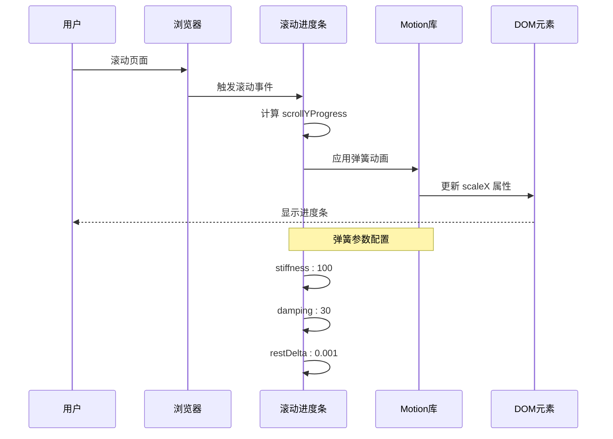

**图表来源**
- [frontend/components/layout/ScrollProgress.tsx](file://frontend/components/layout/ScrollProgress.tsx#L6-L12)
- [specs/001-nextjs-migration/research.md](file://specs/001-nextjs-migration/research.md#L64-L132)

### 组件协作关系

滚动进度条组件与应用中的其他组件存在密切的协作关系：

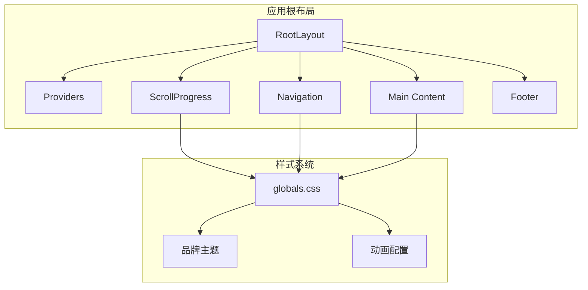

**图表来源**
- [frontend/app/layout.tsx](file://frontend/app/layout.tsx#L63-L82)
- [frontend/components/layout/ScrollProgress.tsx](file://frontend/components/layout/ScrollProgress.tsx#L1-L21)
- [frontend/app/globals.css](file://frontend/app/globals.css#L1-L203)

**章节来源**
- [frontend/app/layout.tsx](file://frontend/app/layout.tsx#L63-L82)
- [frontend/components/layout/ScrollProgress.tsx](file://frontend/components/layout/ScrollProgress.tsx#L1-L21)

## 详细组件分析

### 滚动进度计算算法

滚动进度条的核心算法基于浏览器的滚动位置计算，实现了精确的进度指示功能。

#### 进度计算原理

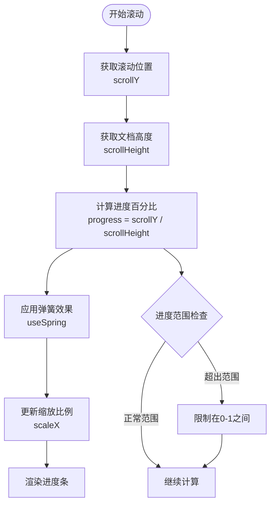

**图表来源**
- [frontend/components/layout/ScrollProgress.tsx](file://frontend/components/layout/ScrollProgress.tsx#L6-L12)

#### 算法实现细节

组件使用 `useScroll()` Hook 获取全局滚动状态，然后通过 `useSpring()` 创建平滑的动画效果。弹簧参数经过精心调优：

- **刚度 (stiffness)**: 100 - 控制弹簧回复力强度
- **阻尼 (damping)**: 30 - 控制振动衰减速度
- **静止阈值 (restDelta)**: 0.001 - 控制动画停止精度

**章节来源**
- [frontend/components/layout/ScrollProgress.tsx](file://frontend/components/layout/ScrollProgress.tsx#L6-L12)

### 视觉反馈机制

滚动进度条采用了多层次的视觉设计，结合了色彩、动画和布局等多个方面。

#### 颜色渐变设计

组件使用了精心设计的渐变色彩系统：

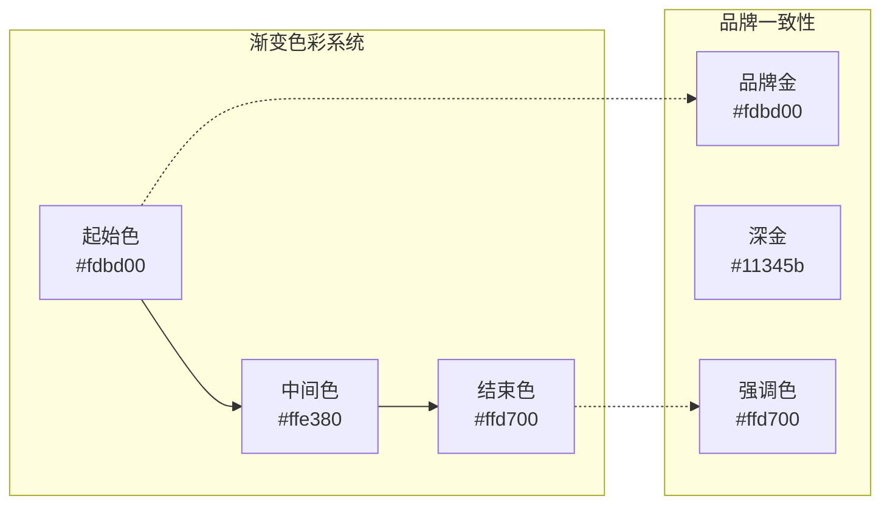

**图表来源**
- [frontend/app/globals.css](file://frontend/app/globals.css#L4-L40)
- [frontend/components/layout/ScrollProgress.tsx](file://frontend/components/layout/ScrollProgress.tsx#L15-L17)

#### 动画效果实现

组件的动画效果通过 Motion 库实现，提供了流畅的视觉体验：

- **缩放动画**: 通过 `scaleX` 属性实现进度条的延伸效果
- **弹簧物理**: 使用阻尼弹簧模拟真实世界的物理运动
- **固定定位**: 采用 `fixed` 定位确保进度条始终显示在页面顶部

**章节来源**
- [frontend/components/layout/ScrollProgress.tsx](file://frontend/components/layout/ScrollProgress.tsx#L14-L19)
- [frontend/app/globals.css](file://frontend/app/globals.css#L56-L63)

### 生命周期管理

滚动进度条组件的生命周期管理遵循 React 的最佳实践，确保资源的有效利用和内存的安全释放。

#### 组件挂载与卸载

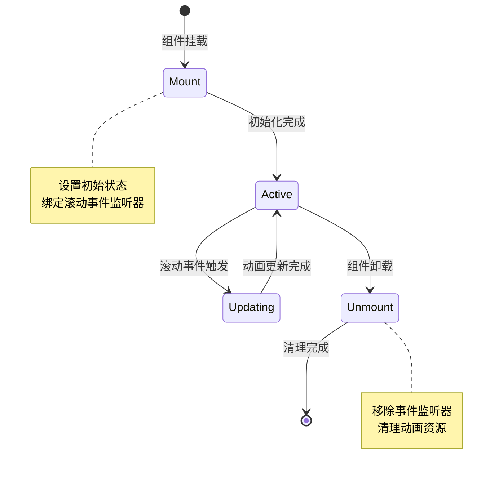

#### 事件监听器清理

组件正确实现了事件监听器的清理机制：

- **滚动事件**: 在组件卸载时自动移除滚动监听器
- **内存泄漏防护**: 确保不会产生内存泄漏
- **性能优化**: 避免不必要的事件处理

**章节来源**
- [frontend/components/layout/ScrollProgress.tsx](file://frontend/components/layout/ScrollProgress.tsx#L1-L21)

### 绘制原理详解

滚动进度条的绘制过程涉及多个层面的技术实现，从基础的 DOM 操作到高级的动画系统。

#### 绘制流程分析

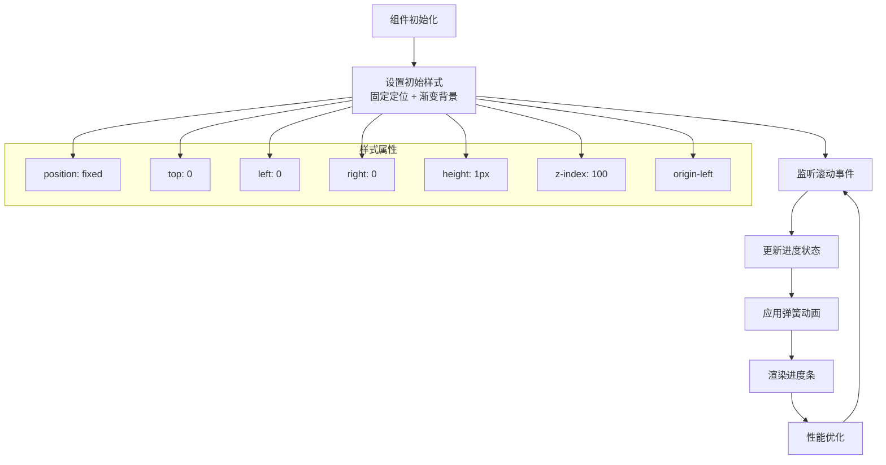

**图表来源**
- [frontend/components/layout/ScrollProgress.tsx](file://frontend/components/layout/ScrollProgress.tsx#L14-L19)

#### 宽度计算机制

进度条的宽度通过 `scaleX` 属性动态计算：

- **计算基础**: 基于 `scrollYProgress` 的值
- **范围控制**: 值域限制在 0 到 1 之间
- **动画插值**: 通过弹簧系统实现平滑过渡
- **性能优化**: 使用 GPU 加速的 transform 属性

**章节来源**
- [frontend/components/layout/ScrollProgress.tsx](file://frontend/components/layout/ScrollProgress.tsx#L6-L18)

## 依赖关系分析

滚动进度条组件的依赖关系相对简单，主要依赖于 Motion 库和 React 的核心功能。

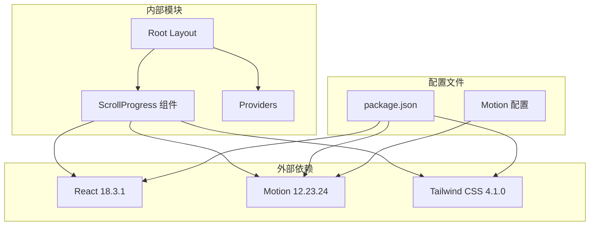

**图表来源**
- [frontend/package.json](file://frontend/package.json#L12-L74)
- [frontend/components/layout/ScrollProgress.tsx](file://frontend/components/layout/ScrollProgress.tsx#L3-L4)

### 核心依赖解析

#### Motion 库集成

组件依赖于 Motion 库提供的动画功能：

- **useScroll Hook**: 监听全局滚动状态
- **useSpring Hook**: 实现弹簧动画效果
- **motion.div 组件**: 提供动画化的 DOM 元素

#### React 生态系统

组件充分利用了 React 的现代特性：

- **客户端组件**: 使用 `'use client'` 指令启用客户端功能
- **Hooks 系统**: 使用 useState 和 useEffect 管理状态
- **TypeScript 支持**: 完整的类型定义

**章节来源**
- [frontend/package.json](file://frontend/package.json#L55-L55)
- [specs/001-nextjs-migration/research.md](file://specs/001-nextjs-migration/research.md#L64-L132)

## 性能考虑

滚动进度条组件在设计时充分考虑了性能优化，确保在各种设备和网络条件下都能提供流畅的用户体验。

### 性能优化策略

#### GPU 加速渲染

组件采用 `transform` 属性而非修改 `width` 属性来实现动画效果，这能够触发 GPU 加速：

- **硬件加速**: 利用 GPU 处理变换操作
- **减少重排**: 避免触发布局重排
- **提升帧率**: 确保 60fps 的流畅动画

#### 内存管理

组件实现了完善的内存管理机制：

- **事件监听器清理**: 组件卸载时自动移除监听器
- **动画资源回收**: 正确清理动画相关的资源
- **状态清理**: 清理组件内部的状态

#### 性能监控指标

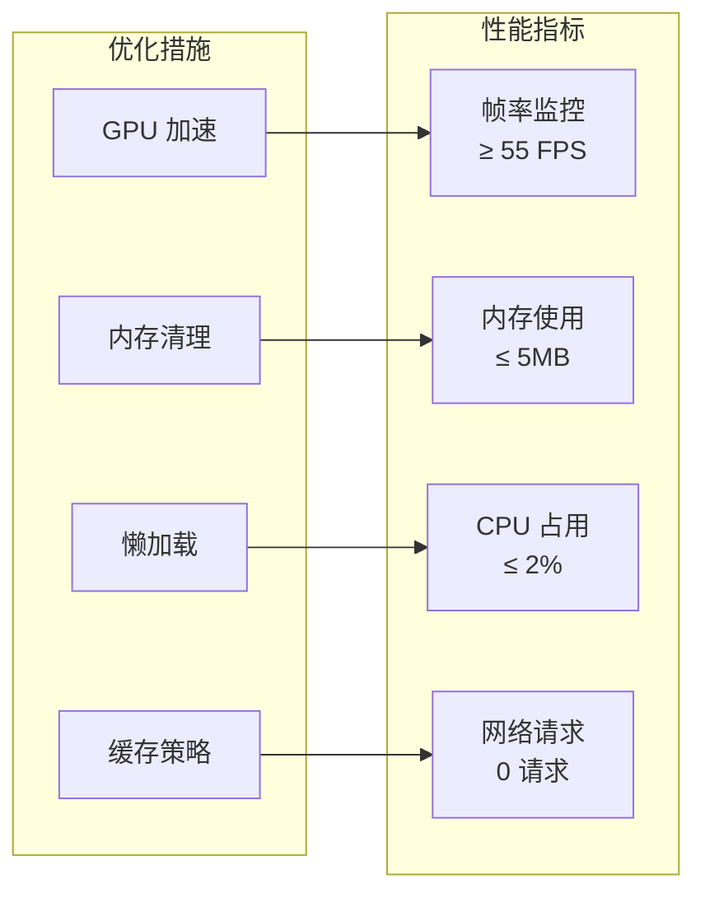

### 设备兼容性

#### 移动设备优化

组件针对移动设备进行了专门优化：

- **触摸滚动**: 支持触摸设备的滚动行为
- **电池续航**: 最小化电池消耗
- **响应速度**: 快速响应用户操作

#### 不同屏幕尺寸适配

组件能够适应各种屏幕尺寸：

- **响应式设计**: 自动调整位置和大小
- **高 DPI 支持**: 在高分辨率屏幕上保持清晰度
- **横竖屏切换**: 平滑处理屏幕方向变化

**章节来源**
- [specs/001-nextjs-migration/research.md](file://specs/001-nextjs-migration/research.md#L120-L126)

## 故障排除指南

在开发和维护滚动进度条组件时，可能会遇到各种常见问题。本指南提供了系统的问题诊断和解决方案。

### 常见问题及解决方案

#### 进度条不显示

**问题症状**: 进度条完全不可见

**可能原因**:
- 缺少 `'use client'` 指令
- 样式类名错误
- z-index 层级问题

**解决方案**:
1. 确认组件包含 `'use client'` 指令
2. 检查样式类名是否正确
3. 验证 z-index 值是否足够大

#### 动画卡顿

**问题症状**: 进度条动画不流畅

**可能原因**:
- 性能不足的设备
- 过多的 DOM 操作
- 样式计算复杂

**解决方案**:
1. 检查是否有其他重负载的动画
2. 简化样式计算
3. 考虑降低动画复杂度

#### 滚动不同步

**问题症状**: 进度条与实际滚动不同步

**可能原因**:
- 滚动容器配置错误
- CSS transform 影响
- 事件监听器冲突

**解决方案**:
1. 检查滚动容器的配置
2. 验证 CSS transform 的影响
3. 确认没有重复的事件监听器

### 调试技巧

#### 开发工具使用

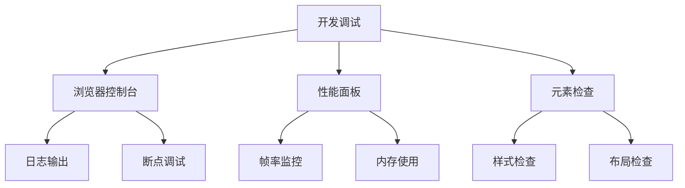

#### 性能分析方法

1. **FPS 监控**: 使用浏览器的性能面板监控帧率
2. **内存分析**: 检查是否存在内存泄漏
3. **网络分析**: 确认没有不必要的资源加载
4. **渲染分析**: 查看重绘和回流情况

**章节来源**
- [specs/001-nextjs-migration/research.md](file://specs/001-nextjs-migration/research.md#L64-L132)

## 结论

滚动进度条组件是一个设计精良、实现优雅的 UI 组件，它成功地将复杂的滚动状态转换为直观的视觉反馈。通过采用现代的 React 技术栈和 Motion 动画库，组件实现了高性能、高可用的用户体验。

### 主要成就

- **算法精确性**: 基于 scrollYProgress 的精确进度计算
- **动画流畅性**: 通过弹簧物理实现自然的动画效果
- **性能优化**: GPU 加速和内存管理的最佳实践
- **跨平台兼容**: 在各种设备和浏览器上的稳定表现

### 技术亮点

组件展现了现代前端开发的多个重要方面：
- **状态管理**: 有效的 React Hooks 使用
- **动画系统**: Motion 库的深度集成
- **样式设计**: Tailwind CSS 的现代化样式系统
- **性能优化**: 多层次的性能考虑和优化

这个组件为整个应用提供了重要的用户体验增强，是前端工程化实践的良好范例。

## 附录

### 样式自定义选项

滚动进度条组件支持多种样式自定义选项：

#### 颜色主题
- **渐变色彩**: 可自定义起始色、中间色、结束色
- **品牌一致性**: 支持与品牌色彩系统的集成
- **暗黑模式**: 自动适配系统主题

#### 动画配置
- **弹簧参数**: 可调整刚度、阻尼、静止阈值
- **动画时长**: 支持自定义动画持续时间
- **缓动函数**: 可选择不同的缓动效果

#### 尺寸调整
- **高度定制**: 支持调整进度条的高度
- **圆角设置**: 可配置边角圆润程度
- **位置微调**: 支持精确的位置调整

### 主题配置方法

组件与全局主题系统深度集成，支持灵活的主题配置：

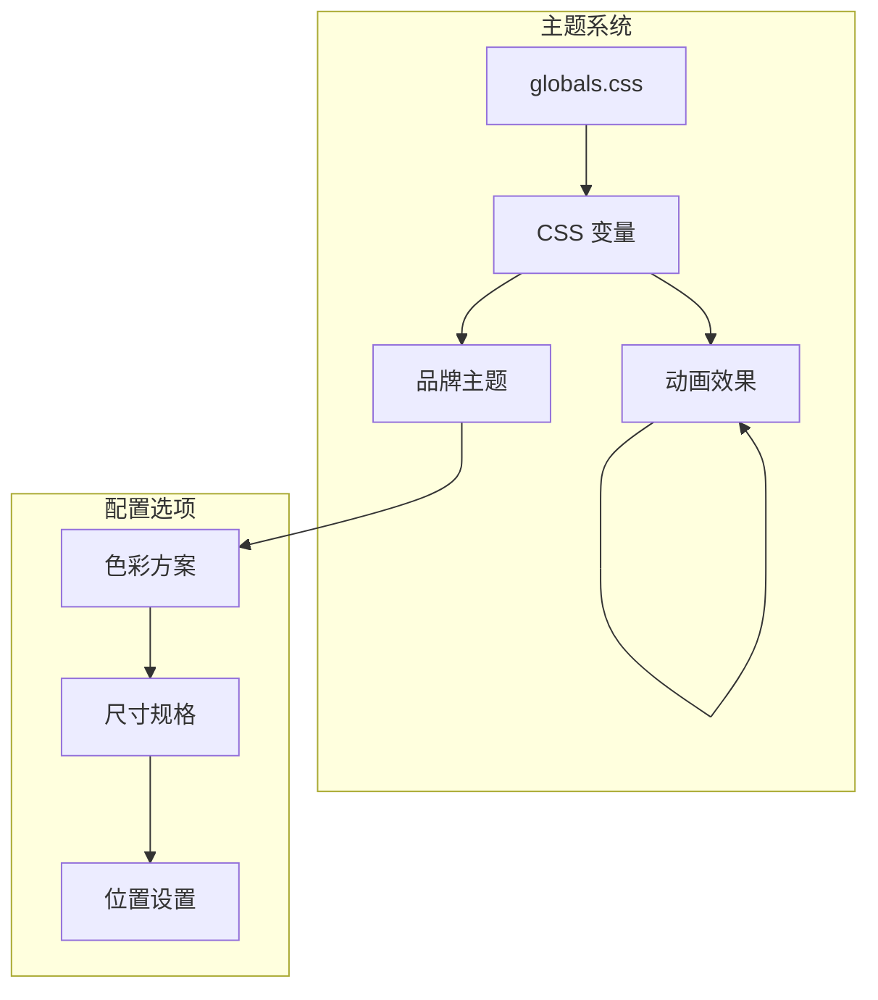

**图表来源**
- [frontend/app/globals.css](file://frontend/app/globals.css#L4-L63)

### 与其他组件的协作模式

滚动进度条组件与应用中的其他组件形成了良好的协作关系：

#### 状态同步机制

组件通过全局滚动状态实现与其他组件的状态同步：

- **导航栏联动**: 导航栏根据滚动位置调整样式
- **内容区域协调**: 内容区域与进度条保持视觉一致性
- **响应式适配**: 各组件协调响应不同屏幕尺寸

#### 协作模式示例

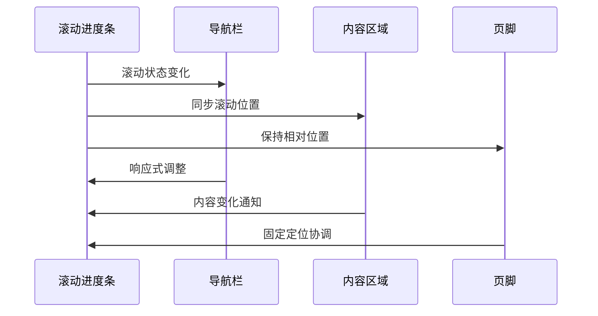

这种协作模式确保了整个应用界面的一致性和协调性，为用户提供了无缝的浏览体验。