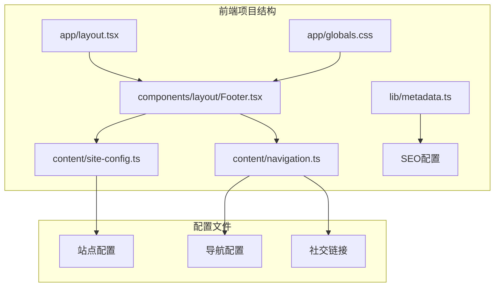
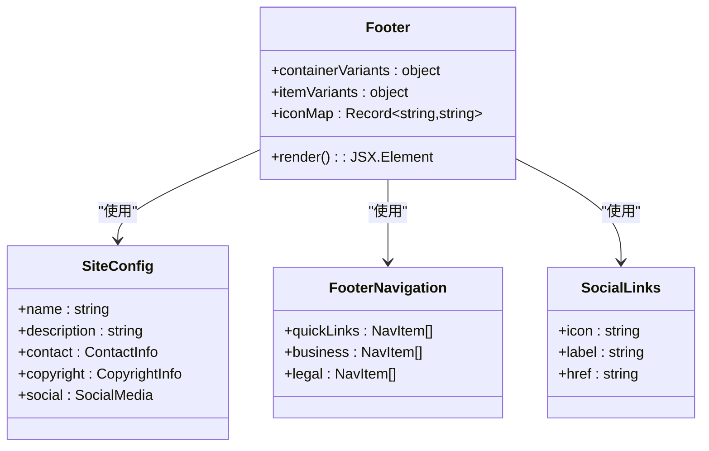
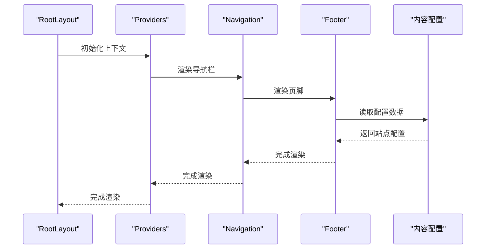
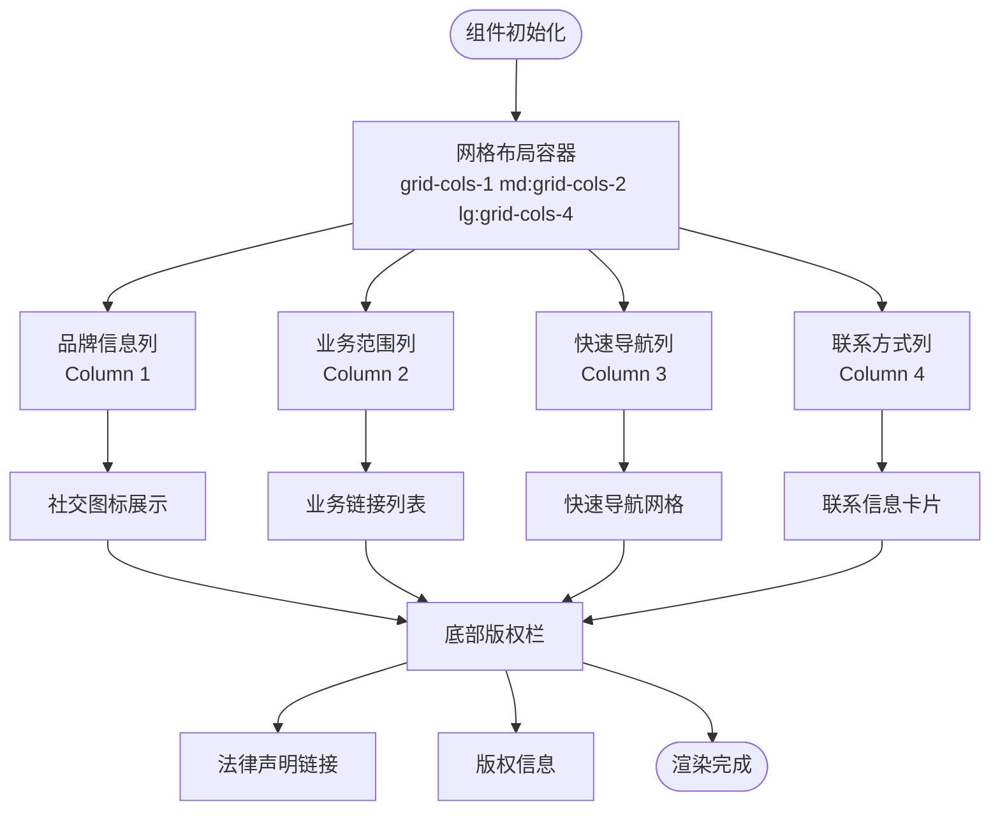
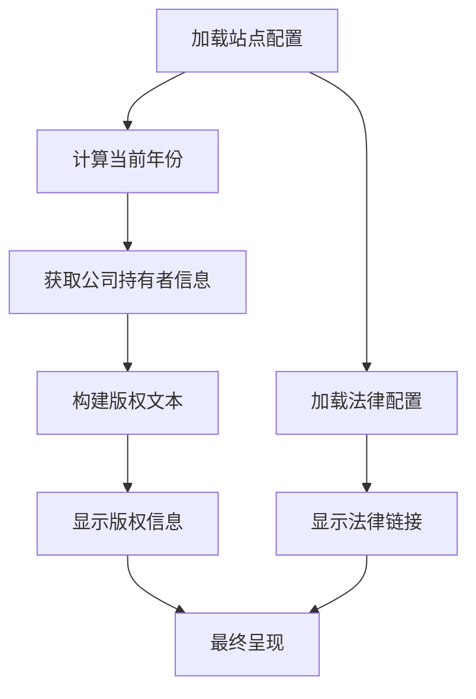
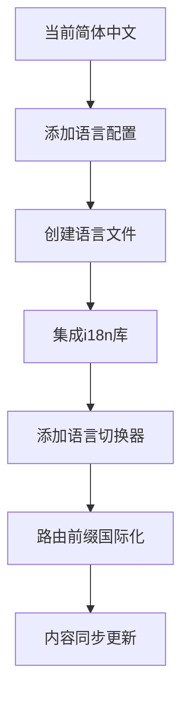
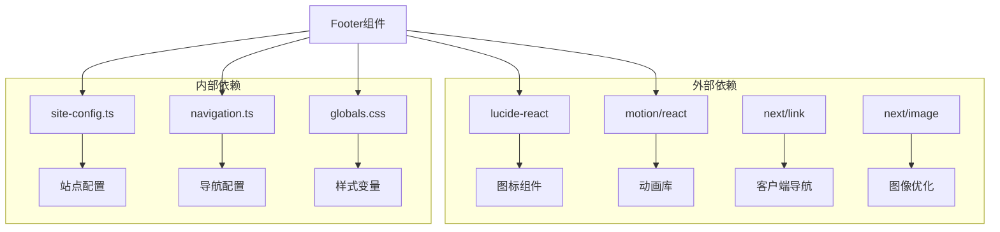

# 页脚组件

<cite>
**本文档引用的文件**
- [frontend/components/layout/Footer.tsx](file://frontend/components/layout/Footer.tsx)
- [frontend/content/site-config.ts](file://frontend/content/site-config.ts)
- [frontend/content/navigation.ts](file://frontend/content/navigation.ts)
- [frontend/app/layout.tsx](file://frontend/app/layout.tsx)
- [frontend/app/globals.css](file://frontend/app/globals.css)
- [frontend/lib/metadata.ts](file://frontend/lib/metadata.ts)
- [frontend/types/navigation.ts](file://frontend/types/navigation.ts)
</cite>

## 目录
1. [简介](#简介)
2. [项目结构](#项目结构)
3. [核心组件](#核心组件)
4. [架构概览](#架构概览)
5. [详细组件分析](#详细组件分析)
6. [依赖关系分析](#依赖关系分析)
7. [性能考量](#性能考量)
8. [故障排除指南](#故障排除指南)
9. [结论](#结论)
10. [附录](#附录)

## 简介
页脚组件是网站整体布局的重要组成部分，负责展示品牌信息、导航链接、联系方式以及法律声明等内容。本组件采用现代化的设计理念，结合响应式布局和动画效果，为用户提供一致且专业的访问体验。

## 项目结构
页脚组件位于前端项目的布局组件目录中，采用模块化设计，便于维护和扩展。



**图表来源**
- [frontend/components/layout/Footer.tsx](file://frontend/components/layout/Footer.tsx#L1-L208)
- [frontend/content/site-config.ts](file://frontend/content/site-config.ts#L1-L47)
- [frontend/content/navigation.ts](file://frontend/content/navigation.ts#L1-L38)

**章节来源**
- [frontend/components/layout/Footer.tsx](file://frontend/components/layout/Footer.tsx#L1-L208)
- [frontend/content/site-config.ts](file://frontend/content/site-config.ts#L1-L47)
- [frontend/content/navigation.ts](file://frontend/content/navigation.ts#L1-L38)

## 核心组件
页脚组件采用React函数式组件设计，集成了多种功能特性：

### 主要功能特性
- **品牌展示**：包含公司Logo、简介和社交媒体链接
- **导航组织**：业务范围、快速导航和联系方式三个主要分区
- **法律声明**：版权信息和法律链接展示
- **响应式设计**：适配不同屏幕尺寸的布局变化
- **动画效果**：使用Framer Motion实现流畅的交互体验

### 数据结构设计
组件通过多个配置文件提供数据驱动的内容管理：



**图表来源**
- [frontend/components/layout/Footer.tsx](file://frontend/components/layout/Footer.tsx#L10-L34)
- [frontend/content/site-config.ts](file://frontend/content/site-config.ts#L2-L44)
- [frontend/content/navigation.ts](file://frontend/content/navigation.ts#L12-L37)

**章节来源**
- [frontend/components/layout/Footer.tsx](file://frontend/components/layout/Footer.tsx#L10-L34)
- [frontend/content/site-config.ts](file://frontend/content/site-config.ts#L2-L44)
- [frontend/content/navigation.ts](file://frontend/content/navigation.ts#L12-L37)

## 架构概览
页脚组件在整个应用架构中扮演着关键角色，作为根布局的一部分被渲染。



**图表来源**
- [frontend/app/layout.tsx](file://frontend/app/layout.tsx#L63-L82)
- [frontend/components/layout/Footer.tsx](file://frontend/components/layout/Footer.tsx#L1-L208)

**章节来源**
- [frontend/app/layout.tsx](file://frontend/app/layout.tsx#L63-L82)

## 详细组件分析

### 布局结构设计
页脚组件采用四列网格布局，针对不同屏幕尺寸进行优化：



**图表来源**
- [frontend/components/layout/Footer.tsx](file://frontend/components/layout/Footer.tsx#L50-L207)

### 版权信息显示逻辑
版权信息采用动态生成机制，确保年份和持有者信息的准确性：



**图表来源**
- [frontend/content/site-config.ts](file://frontend/content/site-config.ts#L38-L44)
- [frontend/content/navigation.ts](file://frontend/content/navigation.ts#L26-L31)

**章节来源**
- [frontend/content/site-config.ts](file://frontend/content/site-config.ts#L38-L44)
- [frontend/content/navigation.ts](file://frontend/content/navigation.ts#L26-L31)

### 社交媒体链接集成实现
组件支持多种社交平台的集成，通过图标映射表实现统一管理：

#### 图标库使用
- **Lucide React图标库**：用于基础图标显示（电话、邮件、位置等）
- **自定义SVG图标**：微信、QQ、抖音等平台专用图标
- **响应式图标处理**：支持不同屏幕尺寸的图标适配

#### 链接跳转机制
- **外部链接**：使用`target="_blank"`和`rel="noopener noreferrer"`确保安全性
- **内部链接**：使用Next.js的Link组件实现客户端导航
- **电话号码**：自动添加`tel:`前缀实现一键拨号

#### 新窗口打开设置
```mermaid
graph LR
subgraph "链接类型"
A[外部链接] --> B[新窗口打开]
C[内部链接] --> D[同窗口导航]
E[电话链接] --> F[系统拨号]
end
subgraph "安全属性"
B --> G[target="_blank"]
B --> H[rel="noopener noreferrer"]
end
```

**图表来源**
- [frontend/components/layout/Footer.tsx](file://frontend/components/layout/Footer.tsx#L77-L93)
- [frontend/content/navigation.ts](file://frontend/content/navigation.ts#L33-L37)

**章节来源**
- [frontend/components/layout/Footer.tsx](file://frontend/components/layout/Footer.tsx#L77-L93)
- [frontend/content/navigation.ts](file://frontend/content/navigation.ts#L33-L37)

### 多语言支持实现
当前项目采用简体中文作为默认语言，多语言支持可通过以下方式扩展：

#### 当前语言状态
- **界面文本**：全部为简体中文
- **URL路径**：使用中文路径
- **元数据**：Open Graph配置为中文

#### 扩展建议


**图表来源**
- [frontend/content/site-config.ts](file://frontend/content/site-config.ts#L21-L29)

**章节来源**
- [frontend/content/site-config.ts](file://frontend/content/site-config.ts#L21-L29)

### 页脚内容配置选项
页脚组件通过多个配置文件实现灵活的内容管理：

#### 站点配置（site-config.ts）
- **基本信息**：公司名称、全称、标语、描述
- **联系信息**：电话、邮箱、地址
- **品牌色彩**：主色调、强调色
- **SEO配置**：标题模板、默认标题、描述、关键词
- **社交媒体**：各平台链接配置
- **版权信息**：年份、持有者、完整文本

#### 导航配置（navigation.ts）
- **快速链接**：常用页面的快捷访问
- **业务范围**：核心业务领域的导航
- **法律声明**：隐私政策、服务条款、网站地图
- **社交链接**：各平台的官方链接

#### 类型定义（navigation.ts）
```typescript
interface NavItem {
  label: string;      // 导航项名称
  href: string;       // 链接路径
  children?: NavItem[]; // 子菜单项
  showOnMobile?: boolean; // 是否在移动端显示
}
```

**章节来源**
- [frontend/content/site-config.ts](file://frontend/content/site-config.ts#L2-L44)
- [frontend/content/navigation.ts](file://frontend/content/navigation.ts#L1-L38)
- [frontend/types/navigation.ts](file://frontend/types/navigation.ts#L3-L12)

### SEO优化考虑
页脚组件在SEO方面采用了多项优化措施：

#### 结构化数据
- **Open Graph协议**：完整的OG标签配置
- **Twitter Card**：Twitter平台的优化配置
- **Robots指令**：搜索引擎爬虫友好设置

#### 内容优化
- **语义化HTML**：使用适当的HTML标签结构
- **可访问性**：alt属性和aria标签的合理使用
- **加载性能**：懒加载和资源优化

**章节来源**
- [frontend/app/layout.tsx](file://frontend/app/layout.tsx#L9-L52)
- [frontend/lib/metadata.ts](file://frontend/lib/metadata.ts#L10-L57)

### 响应式设计和移动端适配
页脚组件采用移动优先的设计理念，通过CSS Grid和媒体查询实现多端适配：

#### 响应式断点
- **移动端**：1列布局（最大宽度768px）
- **平板端**：2列布局（768px以上）
- **桌面端**：4列布局（1024px以上）

#### 动画和交互
- **视口检测**：使用Intersection Observer API触发动画
- **悬停效果**：平滑的颜色和位置变换
- **触摸友好的尺寸**：确保移动端点击区域足够大

**章节来源**
- [frontend/components/layout/Footer.tsx](file://frontend/components/layout/Footer.tsx#L51-L56)
- [frontend/components/layout/Footer.tsx](file://frontend/components/layout/Footer.tsx#L182-L187)

## 依赖关系分析



**图表来源**
- [frontend/components/layout/Footer.tsx](file://frontend/components/layout/Footer.tsx#L3-L8)

**章节来源**
- [frontend/components/layout/Footer.tsx](file://frontend/components/layout/Footer.tsx#L3-L8)

## 性能考量
页脚组件在设计时充分考虑了性能优化：

### 渲染优化
- **React.memo**：避免不必要的重渲染
- **懒加载**：图片和动画的延迟加载
- **CSS变量**：减少重复的样式计算

### 资源管理
- **图标优化**：按需加载和压缩
- **缓存策略**：静态资源的长期缓存
- **CDN集成**：外部资源的CDN加速

### 加载性能
- **骨架屏**：关键内容的占位符显示
- **预连接**：重要域名的DNS预解析
- **资源提示**：关键资源的优先级设置

## 故障排除指南

### 常见问题诊断
1. **图标不显示**
   - 检查SVG文件路径是否正确
   - 验证文件是否存在且可访问
   - 确认CORS配置允许跨域访问

2. **链接无法点击**
   - 检查href属性格式
   - 验证Next.js Link组件的使用
   - 确认事件处理器没有阻止默认行为

3. **样式异常**
   - 检查CSS变量定义
   - 验证Tailwind类名的正确性
   - 确认样式层的优先级

### 调试技巧
- 使用浏览器开发者工具检查元素状态
- 在控制台输出调试信息
- 使用React DevTools分析组件树

**章节来源**
- [frontend/components/layout/Footer.tsx](file://frontend/components/layout/Footer.tsx#L30-L34)

## 结论
页脚组件展现了现代Web开发的最佳实践，通过模块化设计、数据驱动配置和响应式布局，为用户提供了优秀的访问体验。组件的架构清晰，易于维护和扩展，为后续的功能增强奠定了良好的基础。

## 附录

### 配置文件参考
- **站点配置**：包含所有品牌和SEO相关信息
- **导航配置**：定义页脚各分区的链接结构
- **类型定义**：确保配置数据的类型安全

### 自定义指南
1. **修改品牌信息**：编辑site-config.ts中的相应字段
2. **添加新链接**：在navigation.ts中添加新的导航项
3. **调整样式**：修改globals.css中的CSS变量
4. **扩展功能**：根据需要添加新的配置选项