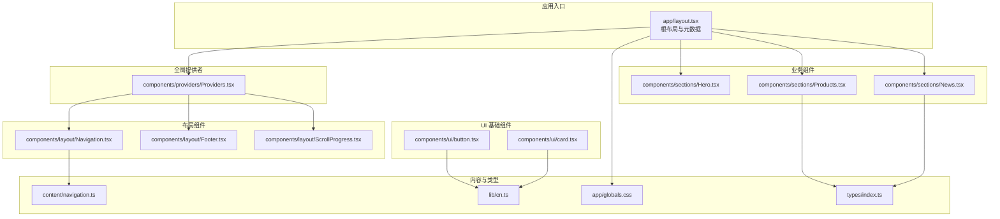
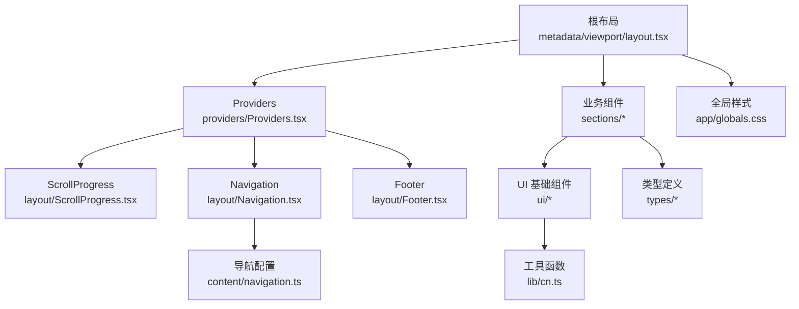
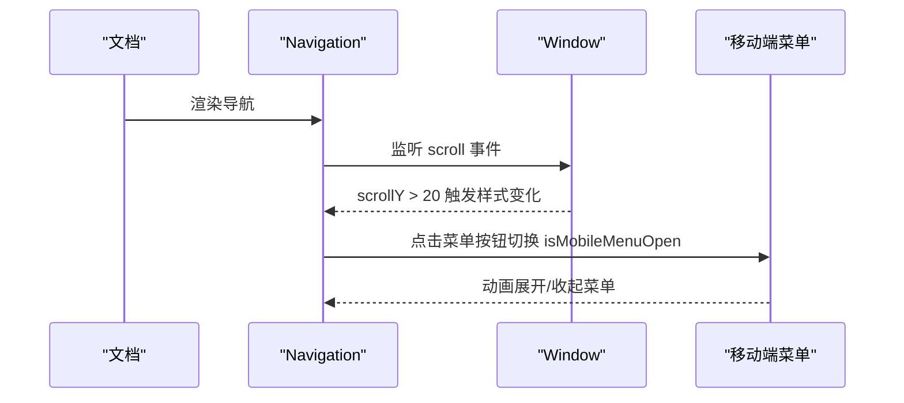
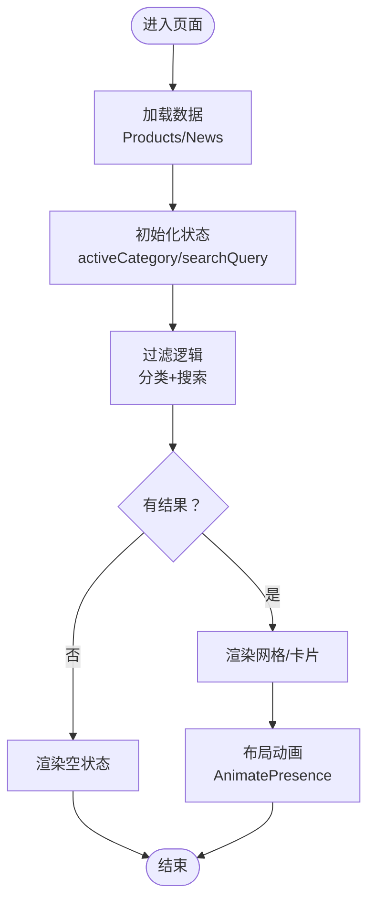
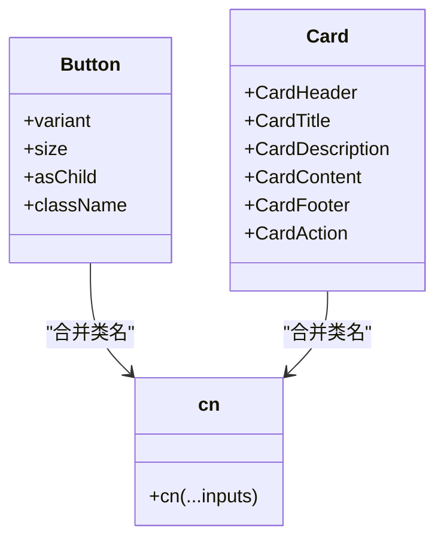
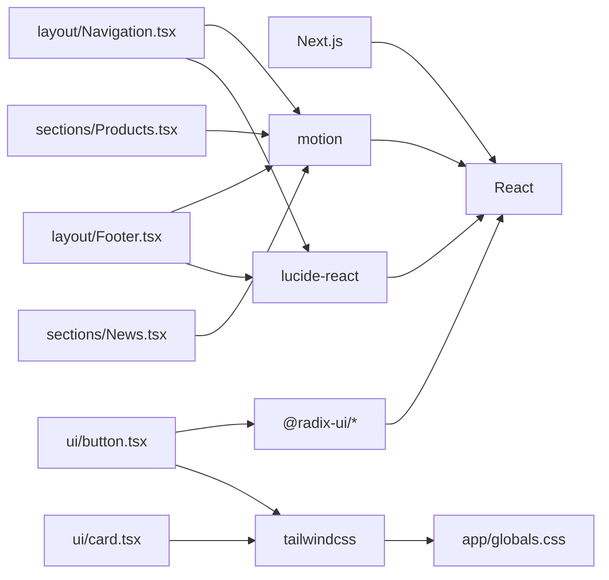

# 组件系统

<cite>
**本文档引用的文件**
- [frontend/app/layout.tsx](file://frontend/app/layout.tsx)
- [frontend/components/providers/Providers.tsx](file://frontend/components/providers/Providers.tsx)
- [frontend/components/layout/Navigation.tsx](file://frontend/components/layout/Navigation.tsx)
- [frontend/components/layout/Footer.tsx](file://frontend/components/layout/Footer.tsx)
- [frontend/components/layout/ScrollProgress.tsx](file://frontend/components/layout/ScrollProgress.tsx)
- [frontend/components/ui/button.tsx](file://frontend/components/ui/button.tsx)
- [frontend/components/ui/card.tsx](file://frontend/components/ui/card.tsx)
- [frontend/components/sections/Hero.tsx](file://frontend/components/sections/Hero.tsx)
- [frontend/components/sections/Products.tsx](file://frontend/components/sections/Products.tsx)
- [frontend/components/sections/News.tsx](file://frontend/components/sections/News.tsx)
- [frontend/content/navigation.ts](file://frontend/content/navigation.ts)
- [frontend/lib/cn.ts](file://frontend/lib/cn.ts)
- [frontend/app/globals.css](file://frontend/app/globals.css)
- [frontend/types/index.ts](file://frontend/types/index.ts)
- [frontend/package.json](file://frontend/package.json)
</cite>

## 目录
1. [简介](#简介)
2. [项目结构](#项目结构)
3. [核心组件](#核心组件)
4. [架构总览](#架构总览)
5. [组件详解](#组件详解)
6. [依赖关系分析](#依赖关系分析)
7. [性能考量](#性能考量)
8. [故障排查指南](#故障排查指南)
9. [结论](#结论)
10. [附录](#附录)

## 简介
本组件系统基于 Next.js 15 与 React 18 构建，采用语义化布局组件、可复用 UI 基础组件与功能型业务组件分层组织的方式，结合 Motion（Framer Motion）实现流畅的动画交互，Tailwind CSS 实现主题化样式与响应式设计。系统通过根布局统一挂载全局 Provider、滚动进度条、导航与页脚，形成一致的用户体验与品牌视觉。

## 项目结构
前端代码位于 frontend 目录，按职责划分为：
- app：页面级路由与根布局
- components：布局组件、UI 基础组件、业务功能组件
- content：站点配置与导航数据
- lib：工具函数（如类名合并）
- types：类型声明
- styles：全局样式与主题变量

图表来源
- [frontend/app/layout.tsx](file://frontend/app/layout.tsx#L63-L82)
- [frontend/components/providers/Providers.tsx](file://frontend/components/providers/Providers.tsx#L9-L17)
- [frontend/components/layout/Navigation.tsx](file://frontend/components/layout/Navigation.tsx#L9-L125)
- [frontend/components/layout/Footer.tsx](file://frontend/components/layout/Footer.tsx#L10-L207)
- [frontend/components/layout/ScrollProgress.tsx](file://frontend/components/layout/ScrollProgress.tsx#L6-L20)
- [frontend/components/ui/button.tsx](file://frontend/components/ui/button.tsx#L37-L58)
- [frontend/components/ui/card.tsx](file://frontend/components/ui/card.tsx#L5-L92)
- [frontend/components/sections/Hero.tsx](file://frontend/components/sections/Hero.tsx#L8-L137)
- [frontend/components/sections/Products.tsx](file://frontend/components/sections/Products.tsx#L21-L222)
- [frontend/components/sections/News.tsx](file://frontend/components/sections/News.tsx#L16-L241)
- [frontend/content/navigation.ts](file://frontend/content/navigation.ts#L3-L37)
- [frontend/lib/cn.ts](file://frontend/lib/cn.ts#L4-L6)
- [frontend/app/globals.css](file://frontend/app/globals.css#L1-L203)
- [frontend/types/index.ts](file://frontend/types/index.ts#L1-L28)

章节来源
- [frontend/app/layout.tsx](file://frontend/app/layout.tsx#L1-L83)
- [frontend/package.json](file://frontend/package.json#L12-L74)

## 核心组件
- 根布局与元数据：在根布局中注入站点元信息、视口配置，并统一包裹 Providers，渲染滚动进度条、导航与页脚。
- 全局提供者：预留扩展点，便于接入主题、认证等上下文。
- 布局组件：导航（含移动端抽屉）、页脚（网格布局、社交链接、联系信息）、滚动进度条（弹簧阻尼动画）。
- UI 基础组件：Button（变体与尺寸变体）、Card（标题、描述、内容、操作、脚注）。
- 业务组件：Hero（大图背景、特性标签、CTA）、Products（筛选、搜索、产品卡片）、News（侧边栏过滤、置顶文章、分页）。

章节来源
- [frontend/app/layout.tsx](file://frontend/app/layout.tsx#L63-L82)
- [frontend/components/providers/Providers.tsx](file://frontend/components/providers/Providers.tsx#L9-L17)
- [frontend/components/layout/Navigation.tsx](file://frontend/components/layout/Navigation.tsx#L9-L125)
- [frontend/components/layout/Footer.tsx](file://frontend/components/layout/Footer.tsx#L10-L207)
- [frontend/components/layout/ScrollProgress.tsx](file://frontend/components/layout/ScrollProgress.tsx#L6-L20)
- [frontend/components/ui/button.tsx](file://frontend/components/ui/button.tsx#L37-L58)
- [frontend/components/ui/card.tsx](file://frontend/components/ui/card.tsx#L5-L92)
- [frontend/components/sections/Hero.tsx](file://frontend/components/sections/Hero.tsx#L8-L137)
- [frontend/components/sections/Products.tsx](file://frontend/components/sections/Products.tsx#L21-L222)
- [frontend/components/sections/News.tsx](file://frontend/components/sections/News.tsx#L16-L241)

## 架构总览
系统采用“根布局统一装配 + 分层组件职责”的架构：
- 根布局负责全局元数据、主题与容器结构
- Providers 作为全局上下文容器，便于未来扩展
- 布局组件负责站点骨架与导航体验
- UI 基础组件提供一致的交互与视觉基元
- 业务组件承载页面内容与复杂交互逻辑

图表来源
- [frontend/app/layout.tsx](file://frontend/app/layout.tsx#L9-L82)
- [frontend/components/providers/Providers.tsx](file://frontend/components/providers/Providers.tsx#L9-L17)
- [frontend/components/layout/ScrollProgress.tsx](file://frontend/components/layout/ScrollProgress.tsx#L6-L20)
- [frontend/components/layout/Navigation.tsx](file://frontend/components/layout/Navigation.tsx#L9-L125)
- [frontend/components/layout/Footer.tsx](file://frontend/components/layout/Footer.tsx#L10-L207)
- [frontend/components/sections/Hero.tsx](file://frontend/components/sections/Hero.tsx#L8-L137)
- [frontend/components/sections/Products.tsx](file://frontend/components/sections/Products.tsx#L21-L222)
- [frontend/components/sections/News.tsx](file://frontend/components/sections/News.tsx#L16-L241)
- [frontend/components/ui/button.tsx](file://frontend/components/ui/button.tsx#L37-L58)
- [frontend/components/ui/card.tsx](file://frontend/components/ui/card.tsx#L5-L92)
- [frontend/content/navigation.ts](file://frontend/content/navigation.ts#L3-L37)
- [frontend/lib/cn.ts](file://frontend/lib/cn.ts#L4-L6)
- [frontend/app/globals.css](file://frontend/app/globals.css#L1-L203)
- [frontend/types/index.ts](file://frontend/types/index.ts#L1-L28)

## 组件详解

### 布局组件设计原则
- 导航组件（Navigation）
  - 设计要点：固定定位、滚动状态切换、桌面端与移动端双态、动画抽屉菜单、品牌色与高亮联动。
  - 关键交互：滚动监听、移动端菜单开关、悬停渐变与图标旋转。
  - 数据来源：导航配置项。
- 页脚组件（Footer）
  - 设计要点：网格四列布局、品牌信息、业务范围、快速导航、联系方式；使用视口进入触发的动画序列。
  - 关键交互：悬停缩放、图标渐变、联系信息可点击。
- 滚动进度条（ScrollProgress）
  - 设计要点：弹簧阻尼动画跟随滚动进度，渐变色背景，固定顶部。

图表来源
- [frontend/components/layout/Navigation.tsx](file://frontend/components/layout/Navigation.tsx#L13-L19)
- [frontend/components/layout/Navigation.tsx](file://frontend/components/layout/Navigation.tsx#L68-L76)
- [frontend/components/layout/Navigation.tsx](file://frontend/components/layout/Navigation.tsx#L81-L122)

章节来源
- [frontend/components/layout/Navigation.tsx](file://frontend/components/layout/Navigation.tsx#L9-L125)
- [frontend/components/layout/Footer.tsx](file://frontend/components/layout/Footer.tsx#L10-L207)
- [frontend/components/layout/ScrollProgress.tsx](file://frontend/components/layout/ScrollProgress.tsx#L6-L20)
- [frontend/content/navigation.ts](file://frontend/content/navigation.ts#L3-L37)

### 业务组件组织方式
- 英雄区域（Hero）
  - 设计要点：全屏高度、背景图层、渐变文字、特性标签、CTA 按钮、滚动指示器。
  - 动画策略：Stagger 容器与 FadeInUp 动画序列，强调层次感。
- 产品展示（Products）
  - 设计要点：侧边栏搜索与分类筛选、产品网格卡片、懒加载图片、空状态提示。
  - 交互策略：分类切换、搜索过滤、布局动画（AnimatePresence + popLayout）。
- 新闻资讯（News）
  - 设计要点：侧边栏分类与搜索、置顶文章、新闻卡片网格、分页控件。
  - 交互策略：分类过滤、搜索匹配、置顶文章优先显示。

图表来源
- [frontend/components/sections/Products.tsx](file://frontend/components/sections/Products.tsx#L21-L36)
- [frontend/components/sections/News.tsx](file://frontend/components/sections/News.tsx#L16-L40)

章节来源
- [frontend/components/sections/Hero.tsx](file://frontend/components/sections/Hero.tsx#L8-L137)
- [frontend/components/sections/Products.tsx](file://frontend/components/sections/Products.tsx#L21-L222)
- [frontend/components/sections/News.tsx](file://frontend/components/sections/News.tsx#L16-L241)

### UI 基础组件设计模式
- 按钮（Button）
  - 设计模式：基于 class-variance-authority 的变体与尺寸系统，支持 asChild（Slot）以适配 Link 等元素。
  - 可访问性：保留焦点可见性与键盘可达性，禁用态透明度与指针事件控制。
- 卡片（Card）
  - 设计模式：模块化子组件（Header/Title/Description/Content/Footer/Action），统一的 slot 属性，便于组合与扩展。

图表来源
- [frontend/components/ui/button.tsx](file://frontend/components/ui/button.tsx#L37-L58)
- [frontend/components/ui/card.tsx](file://frontend/components/ui/card.tsx#L5-L92)
- [frontend/lib/cn.ts](file://frontend/lib/cn.ts#L4-L6)

章节来源
- [frontend/components/ui/button.tsx](file://frontend/components/ui/button.tsx#L37-L58)
- [frontend/components/ui/card.tsx](file://frontend/components/ui/card.tsx#L5-L92)
- [frontend/lib/cn.ts](file://frontend/lib/cn.ts#L4-L6)

### 组件间通信机制
- Props 传递
  - 根布局向子组件传递 children，业务组件接收数据 props（如 Products/News 的 articles/products）。
  - 导航组件接收来自 content/navigation.ts 的导航配置。
- Context 使用
  - Providers 作为预留容器，当前未引入具体 Context，建议后续在其中注入主题、语言、认证等上下文。
- 事件处理
  - 导航组件：滚动事件监听、移动端菜单开关、链接点击。
  - 业务组件：输入框 onChange、按钮 onClick、链接跳转。

章节来源
- [frontend/app/layout.tsx](file://frontend/app/layout.tsx#L63-L82)
- [frontend/components/layout/Navigation.tsx](file://frontend/components/layout/Navigation.tsx#L13-L19)
- [frontend/content/navigation.ts](file://frontend/content/navigation.ts#L3-L37)

### 可访问性与响应式适配
- 可访问性
  - 按钮具备焦点可见性与键盘可达性；禁用态阻止交互。
  - 图片使用 ImageWithFallback 提升失败时的可用性。
  - 文本对比度与品牌色搭配遵循可读性原则。
- 响应式适配
  - Tailwind 原子类与自定义主题变量实现多断点适配。
  - 移动端抽屉菜单、网格布局在小屏自动折叠与换列。

章节来源
- [frontend/components/ui/button.tsx](file://frontend/components/ui/button.tsx#L37-L58)
- [frontend/app/globals.css](file://frontend/app/globals.css#L1-L203)

## 依赖关系分析
- 运行时依赖
  - Next.js 15、React 18、Motion（动画）、Lucide（图标）、Radix UI（无障碍原语）、Tailwind CSS（样式）。
- 组件依赖
  - 布局组件依赖 content/navigation.ts 与 app/globals.css。
  - UI 基础组件依赖 lib/cn.ts 合并类名。
  - 业务组件依赖 types/index.ts 中的数据类型。

图表来源
- [frontend/package.json](file://frontend/package.json#L12-L74)
- [frontend/components/ui/button.tsx](file://frontend/components/ui/button.tsx#L1-L59)
- [frontend/components/ui/card.tsx](file://frontend/components/ui/card.tsx#L1-L93)
- [frontend/components/layout/Navigation.tsx](file://frontend/components/layout/Navigation.tsx#L1-L126)
- [frontend/components/layout/Footer.tsx](file://frontend/components/layout/Footer.tsx#L1-L208)
- [frontend/components/sections/Products.tsx](file://frontend/components/sections/Products.tsx#L1-L223)
- [frontend/components/sections/News.tsx](file://frontend/components/sections/News.tsx#L1-L299)
- [frontend/app/globals.css](file://frontend/app/globals.css#L1-L203)

章节来源
- [frontend/package.json](file://frontend/package.json#L12-L74)

## 性能考量
- 动画性能
  - 使用 useSpring 与 useScroll 控制滚动进度条，避免频繁重排。
  - 业务组件中使用 AnimatePresence 与 layout 布局动画，注意在大数据量时限制同时动画数量。
- 图片优化
  - 使用 ImageWithFallback 与 Next.js Image，确保懒加载与占位回退。
- 样式与主题
  - Tailwind 主题变量集中管理，减少重复计算与样式抖动。
- 代码分割
  - 页面级路由按需加载，组件内部按需引入动画与图标库。

## 故障排查指南
- 滚动进度条不生效
  - 确认已包裹 Providers 并在根布局中渲染 ScrollProgress。
- 移动端菜单无法打开
  - 检查 isMobileMenuOpen 状态切换与事件绑定。
- 卡片布局错位
  - 确认 AnimatePresence 的 layout 与 popLayout 配置一致。
- 类名冲突
  - 使用 lib/cn.ts 合并类名，避免重复覆盖。

章节来源
- [frontend/components/layout/ScrollProgress.tsx](file://frontend/components/layout/ScrollProgress.tsx#L6-L20)
- [frontend/components/layout/Navigation.tsx](file://frontend/components/layout/Navigation.tsx#L68-L76)
- [frontend/components/sections/Products.tsx](file://frontend/components/sections/Products.tsx#L140-L202)
- [frontend/lib/cn.ts](file://frontend/lib/cn.ts#L4-L6)

## 结论
该组件系统以清晰的分层与一致的视觉语言构建，结合动画与响应式设计提升用户体验。建议后续完善 Providers 中的 Context 注入、补充可访问性测试与自动化检查，持续优化动画性能与图片加载策略。

## 附录
- 最佳实践
  - 使用 class-variance-authority 管理组件变体，保持样式一致性。
  - 将配置与数据外置至 content 与 types，增强可维护性。
  - 在业务组件中优先使用受控组件与 useMemo 优化渲染。
- 代码规范
  - 组件命名采用 PascalCase，文件命名与组件同名。
  - 使用 TypeScript 明确 props 类型，导出类型至 types/index.ts。
  - 样式使用原子类与主题变量，避免内联样式。