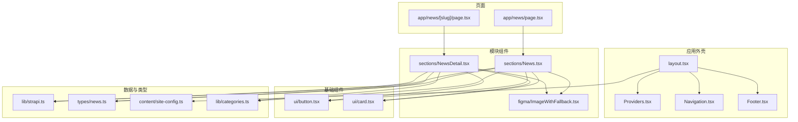
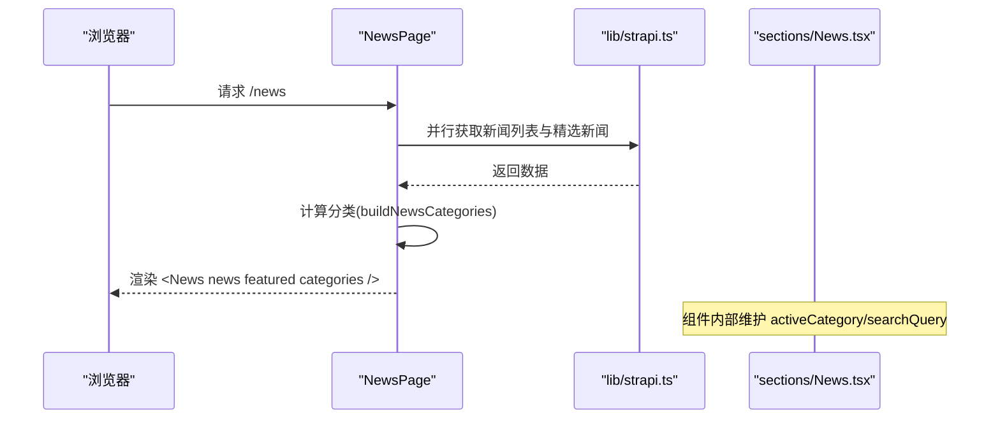
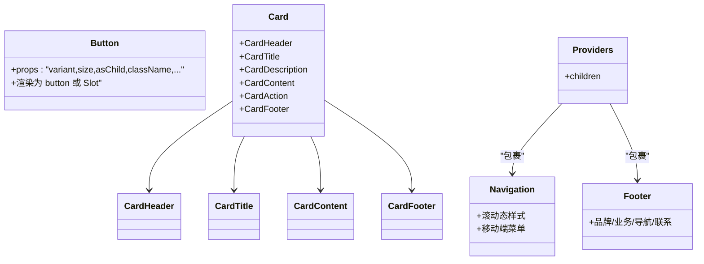
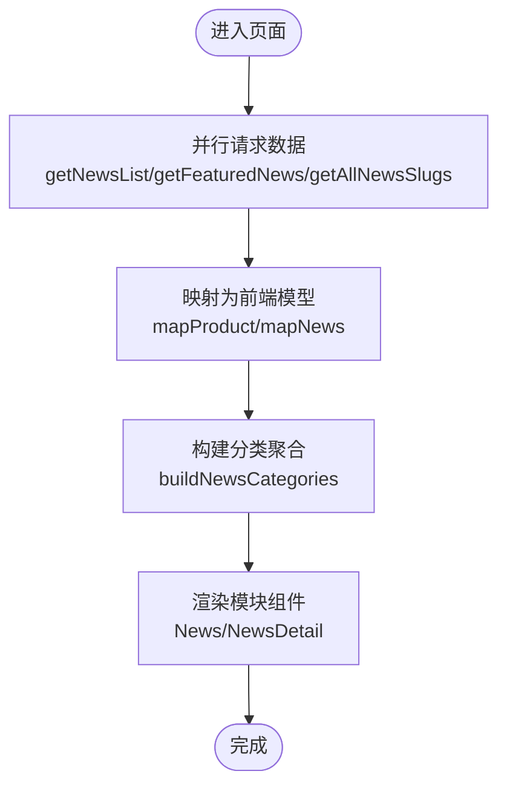
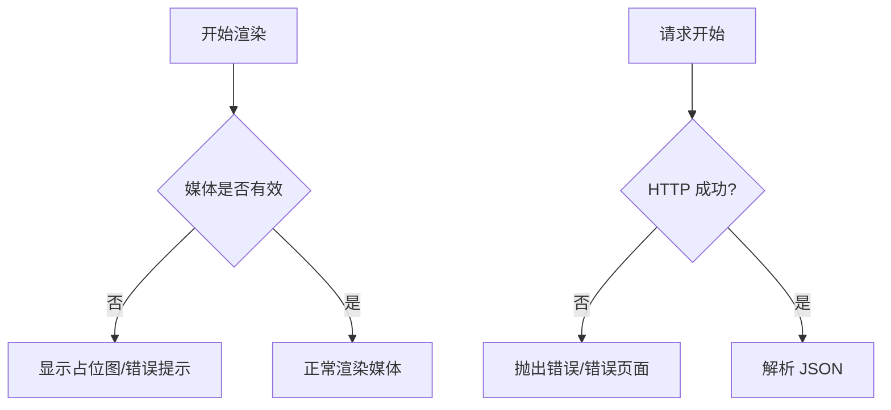
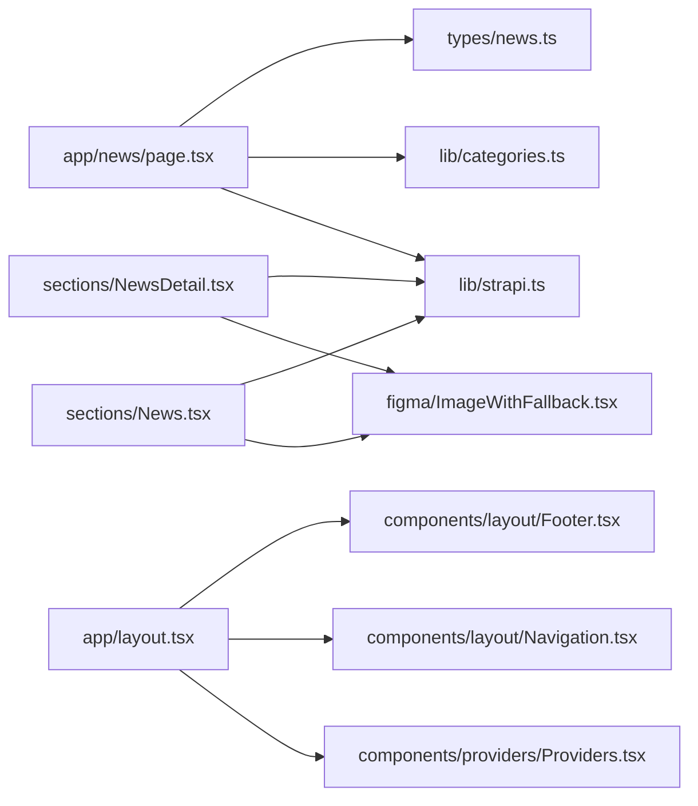

# 组件设计模式

<cite>
**本文引用的文件**   
- [frontend/components/ui/button.tsx](file://frontend/components/ui/button.tsx)
- [frontend/components/ui/card.tsx](file://frontend/components/ui/card.tsx)
- [frontend/lib/strapi.ts](file://frontend/lib/strapi.ts)
- [frontend/app/layout.tsx](file://frontend/app/layout.tsx)
- [frontend/components/providers/Providers.tsx](file://frontend/components/providers/Providers.tsx)
- [frontend/components/layout/Navigation.tsx](file://frontend/components/layout/Navigation.tsx)
- [frontend/components/layout/Footer.tsx](file://frontend/components/layout/Footer.tsx)
- [frontend/app/news/page.tsx](file://frontend/app/news/page.tsx)
- [frontend/app/news/[slug]/page.tsx](file://frontend/app/news/[slug]/page.tsx)
- [frontend/components/sections/News.tsx](file://frontend/components/sections/News.tsx)
- [frontend/components/sections/NewsDetail.tsx](file://frontend/components/sections/NewsDetail.tsx)
- [frontend/lib/categories.ts](file://frontend/lib/categories.ts)
- [frontend/types/news.ts](file://frontend/types/news.ts)
- [frontend/content/site-config.ts](file://frontend/content/site-config.ts)
- [frontend/components/figma/ImageWithFallback.tsx](file://frontend/components/figma/ImageWithFallback.tsx)
</cite>

## 目录
1. [引言](#引言)
2. [项目结构](#项目结构)
3. [核心组件](#核心组件)
4. [架构总览](#架构总览)
5. [组件详解](#组件详解)
6. [依赖关系分析](#依赖关系分析)
7. [性能考量](#性能考量)
8. [故障排查指南](#故障排查指南)
9. [结论](#结论)
10. [附录](#附录)

## 引言
本文件围绕前端组件设计模式展开，结合仓库中的实际组件与页面，系统阐述以下主题：
- 组件的组合模式与复用策略：如何通过基础 UI 组件（按钮、卡片）与布局组件（导航、页脚）组合出高复用的页面模块。
- 数据驱动组件的设计：从 Strapi 获取数据，映射为类型安全的数据模型，并在页面与组件间传递。
- 错误边界与加载状态管理：图片回退、请求失败处理、骨架屏与空态展示。
- 国际化与本地化：当前项目以中文为主，可扩展多语言；本文给出本地化落地建议。
- 测试策略与单元测试编写：基于现有组件结构，提出可测试性设计与测试方法。
- 性能优化与渲染优化：懒加载、并发请求、记忆化、骨架屏与动画优化。
- 调试方法与问题排查：定位常见问题（样式、数据、网络、SEO）的方法。
- 版本管理与向后兼容：组件 API 设计与变更策略。

## 项目结构
前端采用 Next.js App Router 结构，按功能域组织组件与页面：
- components：可复用 UI 组件与页面级模块
  - ui：基础 UI 组件（按钮、卡片）
  - layout：布局组件（导航、页脚、滚动进度条）
  - sections：页面模块（新闻列表、详情等）
  - figma：UI 适配组件（图片回退）
  - providers：全局 Provider 容器
- app：页面路由与元数据
- lib：数据访问层（Strapi）、分类工具
- types：类型定义
- content：站点配置与导航数据
- styles：全局样式

**图示来源**
- [frontend/app/layout.tsx](file://frontend/app/layout.tsx#L63-L82)
- [frontend/components/providers/Providers.tsx](file://frontend/components/providers/Providers.tsx#L9-L17)
- [frontend/components/layout/Navigation.tsx](file://frontend/components/layout/Navigation.tsx#L9-L125)
- [frontend/components/layout/Footer.tsx](file://frontend/components/layout/Footer.tsx#L10-L207)
- [frontend/app/news/page.tsx](file://frontend/app/news/page.tsx#L25-L30)
- [frontend/app/news/[slug]/page.tsx](file://frontend/app/news/[slug]/page.tsx#L48-L70)
- [frontend/components/sections/News.tsx](file://frontend/components/sections/News.tsx#L16-L242)
- [frontend/components/sections/NewsDetail.tsx](file://frontend/components/sections/NewsDetail.tsx#L20-L319)
- [frontend/components/figma/ImageWithFallback.tsx](file://frontend/components/figma/ImageWithFallback.tsx#L21-L84)
- [frontend/components/ui/button.tsx](file://frontend/components/ui/button.tsx#L37-L56)
- [frontend/components/ui/card.tsx](file://frontend/components/ui/card.tsx#L5-L92)
- [frontend/lib/strapi.ts](file://frontend/lib/strapi.ts#L100-L155)
- [frontend/types/news.ts](file://frontend/types/news.ts#L16-L43)
- [frontend/content/site-config.ts](file://frontend/content/site-config.ts#L1-L47)
- [frontend/lib/categories.ts](file://frontend/lib/categories.ts#L33-L47)

**章节来源**
- [frontend/app/layout.tsx](file://frontend/app/layout.tsx#L63-L82)
- [frontend/components/layout/Navigation.tsx](file://frontend/components/layout/Navigation.tsx#L9-L125)
- [frontend/components/layout/Footer.tsx](file://frontend/components/layout/Footer.tsx#L10-L207)
- [frontend/app/news/page.tsx](file://frontend/app/news/page.tsx#L25-L30)
- [frontend/app/news/[slug]/page.tsx](file://frontend/app/news/[slug]/page.tsx#L48-L70)
- [frontend/components/sections/News.tsx](file://frontend/components/sections/News.tsx#L16-L242)
- [frontend/components/sections/NewsDetail.tsx](file://frontend/components/sections/NewsDetail.tsx#L20-L319)
- [frontend/components/figma/ImageWithFallback.tsx](file://frontend/components/figma/ImageWithFallback.tsx#L21-L84)
- [frontend/components/ui/button.tsx](file://frontend/components/ui/button.tsx#L37-L56)
- [frontend/components/ui/card.tsx](file://frontend/components/ui/card.tsx#L5-L92)
- [frontend/lib/strapi.ts](file://frontend/lib/strapi.ts#L100-L155)
- [frontend/types/news.ts](file://frontend/types/news.ts#L16-L43)
- [frontend/content/site-config.ts](file://frontend/content/site-config.ts#L1-L47)
- [frontend/lib/categories.ts](file://frontend/lib/categories.ts#L33-L47)

## 核心组件
- 基础 UI 组件
  - 按钮：通过变体与尺寸的组合，统一风格与交互行为，支持作为语义标签或容器使用。
  - 卡片：提供卡片容器与其子块（头部、标题、描述、内容、操作、底部），便于快速搭建信息区块。
- 页面模块组件
  - 新闻列表：筛选、搜索、置顶推荐、网格布局、分页占位。
  - 新闻详情：面包屑、元信息、富文本渲染、标签与分享、前后文导航、侧栏推荐。
- 布局组件
  - 导航：响应式菜单、滚动态样式、移动端抽屉动画。
  - 页脚：品牌信息、业务范围、快速导航、联系方式、法律链接。
- 图片回退组件：优雅降级，避免资源加载失败导致页面空白。
- 数据访问与类型
  - Strapi 服务：封装请求、错误处理、媒体 URL 规范化、实体映射。
  - 类型定义：新闻文章与分类的接口与联合 ID 类型。
  - 分类工具：从数据统计生成分类聚合。

**章节来源**
- [frontend/components/ui/button.tsx](file://frontend/components/ui/button.tsx#L7-L35)
- [frontend/components/ui/card.tsx](file://frontend/components/ui/card.tsx#L5-L92)
- [frontend/components/sections/News.tsx](file://frontend/components/sections/News.tsx#L16-L242)
- [frontend/components/sections/NewsDetail.tsx](file://frontend/components/sections/NewsDetail.tsx#L20-L319)
- [frontend/components/layout/Navigation.tsx](file://frontend/components/layout/Navigation.tsx#L9-L125)
- [frontend/components/layout/Footer.tsx](file://frontend/components/layout/Footer.tsx#L10-L207)
- [frontend/components/figma/ImageWithFallback.tsx](file://frontend/components/figma/ImageWithFallback.tsx#L21-L84)
- [frontend/lib/strapi.ts](file://frontend/lib/strapi.ts#L100-L155)
- [frontend/types/news.ts](file://frontend/types/news.ts#L16-L43)
- [frontend/lib/categories.ts](file://frontend/lib/categories.ts#L33-L47)

## 架构总览
整体采用“页面驱动数据 + 组件组合”的模式：
- 页面负责并行拉取数据、生成元数据、计算派生数据（如分类）。
- 模块组件接收 props，内部进行状态管理（筛选、搜索、分页占位）。
- 基础 UI 组件提供一致的视觉与交互基线。
- 布局组件提供全局上下文与跨页面一致性。

**图示来源**
- [frontend/app/news/page.tsx](file://frontend/app/news/page.tsx#L25-L30)
- [frontend/lib/strapi.ts](file://frontend/lib/strapi.ts#L113-L132)
- [frontend/lib/categories.ts](file://frontend/lib/categories.ts#L33-L47)
- [frontend/components/sections/News.tsx](file://frontend/components/sections/News.tsx#L16-L40)

## 组件详解

### 组合模式与复用策略
- 组合优先：页面通过 props 将数据与行为注入模块组件；模块组件再组合基础 UI 与布局组件。
- 变体与尺寸：按钮通过变体与尺寸组合实现多种风格，减少重复样式代码。
- 子块拆分：卡片按头部、标题、描述、内容、操作、底部拆分，便于灵活拼装。
- Provider 扩展：在 Providers 中预留全局状态容器，便于后续接入主题、认证等上下文。

**图示来源**
- [frontend/components/ui/button.tsx](file://frontend/components/ui/button.tsx#L37-L56)
- [frontend/components/ui/card.tsx](file://frontend/components/ui/card.tsx#L5-L92)
- [frontend/components/providers/Providers.tsx](file://frontend/components/providers/Providers.tsx#L9-L17)
- [frontend/components/layout/Navigation.tsx](file://frontend/components/layout/Navigation.tsx#L9-L125)
- [frontend/components/layout/Footer.tsx](file://frontend/components/layout/Footer.tsx#L10-L207)

**章节来源**
- [frontend/components/ui/button.tsx](file://frontend/components/ui/button.tsx#L7-L35)
- [frontend/components/ui/card.tsx](file://frontend/components/ui/card.tsx#L5-L92)
- [frontend/components/providers/Providers.tsx](file://frontend/components/providers/Providers.tsx#L9-L17)
- [frontend/components/layout/Navigation.tsx](file://frontend/components/layout/Navigation.tsx#L9-L125)
- [frontend/components/layout/Footer.tsx](file://frontend/components/layout/Footer.tsx#L10-L207)

### 数据驱动组件设计
- 数据源：通过 Strapi 服务封装请求与错误处理，统一媒体 URL 规范化。
- 映射层：将 Strapi 响应映射为前端类型安全的模型，保证字段完整性与默认值。
- 页面聚合：页面并行拉取多个数据源，计算分类等派生数据，再传入组件。
- 类型约束：使用 TypeScript 接口与联合 ID 类型，确保组件消费端的类型安全。

**图示来源**
- [frontend/app/news/page.tsx](file://frontend/app/news/page.tsx#L25-L30)
- [frontend/app/news/[slug]/page.tsx](file://frontend/app/news/[slug]/page.tsx#L48-L70)
- [frontend/lib/strapi.ts](file://frontend/lib/strapi.ts#L113-L155)
- [frontend/lib/categories.ts](file://frontend/lib/categories.ts#L33-L47)
- [frontend/types/news.ts](file://frontend/types/news.ts#L16-L43)

**章节来源**
- [frontend/lib/strapi.ts](file://frontend/lib/strapi.ts#L100-L155)
- [frontend/types/news.ts](file://frontend/types/news.ts#L16-L43)
- [frontend/lib/categories.ts](file://frontend/lib/categories.ts#L33-L47)
- [frontend/app/news/page.tsx](file://frontend/app/news/page.tsx#L25-L30)
- [frontend/app/news/[slug]/page.tsx](file://frontend/app/news/[slug]/page.tsx#L48-L70)

### 错误边界与加载状态管理
- 图片回退：当媒体资源加载失败时，显示占位图与原始 URL 标记，避免空白。
- 请求失败：Strapi 请求失败抛出错误，页面可配合错误边界或错误页面捕获。
- 加载与空态：新闻列表在无结果时展示“未找到”空态；详情页可增加骨架屏占位。
- 动画与过渡：使用动画库对列表项与卡片进行入场动画，提升体验。

**图示来源**
- [frontend/components/figma/ImageWithFallback.tsx](file://frontend/components/figma/ImageWithFallback.tsx#L21-L84)
- [frontend/lib/strapi.ts](file://frontend/lib/strapi.ts#L100-L111)

**章节来源**
- [frontend/components/figma/ImageWithFallback.tsx](file://frontend/components/figma/ImageWithFallback.tsx#L21-L84)
- [frontend/lib/strapi.ts](file://frontend/lib/strapi.ts#L100-L111)

### 国际化与本地化
- 当前项目以中文为主，页面与组件文案均为中文。
- 本地化建议：
  - 使用消息文件与语言切换 Provider，将文案抽取到独立模块。
  - 对日期、数字格式化使用 Intl 工具，保持与站点配置一致。
  - SEO 元数据与 Open Graph 字段可按语言切换。
  - 组件内部文案尽量通过 props 注入，便于多语言替换。

[本节为通用指导，不直接分析具体文件，故无“章节来源”]

### 组件测试策略与单元测试
- 可测试性设计
  - 将副作用（网络请求、DOM）隔离在页面或自定义 Hook，组件保持纯函数式。
  - 使用 props 明确输入，输出通过快照或断言验证。
- 测试覆盖
  - 组件渲染：验证不同 props 下的 UI 输出。
  - 交互行为：模拟用户输入（筛选、搜索）并断言状态变化。
  - 错误场景：模拟网络失败、图片加载失败，验证错误边界与降级 UI。
  - 性能：对记忆化与昂贵计算进行基准测试。
- 推荐工具链
  - 测试运行：Vitest/Jest
  - 渲染：React Testing Library
  - Mock：MSW 或 vitest.fetch

[本节为通用指导，不直接分析具体文件，故无“章节来源”]

### 性能优化与渲染优化
- 并发请求：页面使用 Promise.all 并行获取数据，减少首屏等待。
- 记忆化：组件内部使用 useMemo 缓存过滤结果，降低重渲染成本。
- 懒加载与骨架：图片使用回退组件与占位图；列表可引入骨架屏。
- 动画与过渡：合理使用动画库，避免过度动画影响性能。
- SEO 与预渲染：页面生成元数据与静态参数，利于搜索引擎抓取。

**章节来源**
- [frontend/app/news/page.tsx](file://frontend/app/news/page.tsx#L26-L27)
- [frontend/components/sections/News.tsx](file://frontend/components/sections/News.tsx#L22-L34)

### 调试方法与问题排查
- 样式问题
  - 使用浏览器开发者工具检查元素层级与类名，确认变体与尺寸是否正确应用。
- 数据问题
  - 在页面中打印返回数据结构，核对映射函数是否正确处理字段。
- 网络问题
  - 检查 Strapi 请求 URL、环境变量、CORS 设置；观察网络面板错误码。
- SEO 问题
  - 校验生成的元数据与 Open Graph 字段，确保图片 URL 与描述完整。
- 动画与交互
  - 检查动画库版本与配置，确认入场/出场时机与触发条件。

[本节为通用指导，不直接分析具体文件，故无“章节来源”]

### 版本管理与向后兼容
- API 设计
  - 组件 props 保持稳定，新增属性时提供默认值，避免破坏性变更。
- 类型演进
  - 对类型别名与接口变更使用渐进迁移策略，保留旧字段一段时间。
- 版本策略
  - 采用语义化版本，重大变更标注为次版本或主版本升级。
- 兼容性
  - 为旧浏览器提供 polyfill；对动画与现代特性提供降级方案。

[本节为通用指导，不直接分析具体文件，故无“章节来源”]

## 依赖关系分析
- 页面依赖数据服务与类型定义，模块组件依赖基础 UI 与布局组件。
- 组件之间通过 props 传递数据，避免直接耦合。
- Provider 作为全局容器，集中管理上下文，降低跨组件通信成本。

**图示来源**
- [frontend/app/news/page.tsx](file://frontend/app/news/page.tsx#L25-L30)
- [frontend/lib/strapi.ts](file://frontend/lib/strapi.ts#L113-L155)
- [frontend/lib/categories.ts](file://frontend/lib/categories.ts#L33-L47)
- [frontend/types/news.ts](file://frontend/types/news.ts#L16-L43)
- [frontend/components/sections/News.tsx](file://frontend/components/sections/News.tsx#L16-L242)
- [frontend/components/sections/NewsDetail.tsx](file://frontend/components/sections/NewsDetail.tsx#L20-L319)
- [frontend/components/figma/ImageWithFallback.tsx](file://frontend/components/figma/ImageWithFallback.tsx#L21-L84)
- [frontend/app/layout.tsx](file://frontend/app/layout.tsx#L63-L82)
- [frontend/components/providers/Providers.tsx](file://frontend/components/providers/Providers.tsx#L9-L17)
- [frontend/components/layout/Navigation.tsx](file://frontend/components/layout/Navigation.tsx#L9-L125)
- [frontend/components/layout/Footer.tsx](file://frontend/components/layout/Footer.tsx#L10-L207)

**章节来源**
- [frontend/app/news/page.tsx](file://frontend/app/news/page.tsx#L25-L30)
- [frontend/lib/strapi.ts](file://frontend/lib/strapi.ts#L113-L155)
- [frontend/lib/categories.ts](file://frontend/lib/categories.ts#L33-L47)
- [frontend/types/news.ts](file://frontend/types/news.ts#L16-L43)
- [frontend/components/sections/News.tsx](file://frontend/components/sections/News.tsx#L16-L242)
- [frontend/components/sections/NewsDetail.tsx](file://frontend/components/sections/NewsDetail.tsx#L20-L319)
- [frontend/components/figma/ImageWithFallback.tsx](file://frontend/components/figma/ImageWithFallback.tsx#L21-L84)
- [frontend/app/layout.tsx](file://frontend/app/layout.tsx#L63-L82)
- [frontend/components/providers/Providers.tsx](file://frontend/components/providers/Providers.tsx#L9-L17)
- [frontend/components/layout/Navigation.tsx](file://frontend/components/layout/Navigation.tsx#L9-L125)
- [frontend/components/layout/Footer.tsx](file://frontend/components/layout/Footer.tsx#L10-L207)

## 性能考量
- 并发数据获取：页面使用 Promise.all 并行请求，缩短首屏时间。
- 记忆化与去抖：组件内部使用 useMemo 缓存过滤结果，避免重复计算。
- 图片优化：使用回退组件与占位图，减少空白区域与重排。
- 动画与过渡：控制动画数量与时长，避免影响滚动与交互流畅度。
- SEO 与静态参数：页面生成元数据与静态路由参数，提升搜索引擎表现。

[本节为通用指导，不直接分析具体文件，故无“章节来源”]

## 故障排查指南
- 图片无法显示
  - 检查媒体 URL 是否以 http(s) 或 data/blob 开头；否则需拼接服务端地址。
  - 若仍失败，回退至占位图并记录原始 URL 以便排查。
- 请求失败
  - 查看网络面板与错误信息，确认 Strapi 地址、鉴权与 CORS。
- 分类与筛选异常
  - 核对分类构建逻辑与数据字段，确保映射函数正确处理空值。
- SEO 元数据缺失
  - 检查页面生成的元数据与 Open Graph 字段，确保图片与描述存在。

**章节来源**
- [frontend/components/figma/ImageWithFallback.tsx](file://frontend/components/figma/ImageWithFallback.tsx#L21-L84)
- [frontend/lib/strapi.ts](file://frontend/lib/strapi.ts#L100-L111)
- [frontend/lib/categories.ts](file://frontend/lib/categories.ts#L33-L47)
- [frontend/app/news/page.tsx](file://frontend/app/news/page.tsx#L7-L23)
- [frontend/app/news/[slug]/page.tsx](file://frontend/app/news/[slug]/page.tsx#L23-L46)

## 结论
本项目通过“页面驱动数据 + 组件组合”的方式，实现了高复用、可维护的前端架构。基础 UI 组件提供一致的风格与交互，模块组件承载业务逻辑与状态管理，布局组件保障全局一致性。配合数据映射、错误边界与加载状态管理，以及可扩展的 Provider 容器，为国际化、测试与性能优化提供了良好基础。未来可在类型演进、测试覆盖率与动画性能方面持续优化，确保长期可维护性与用户体验。

## 附录
- 站点配置与品牌色：用于统一视觉与 SEO 元数据。
- 导航与页脚数据：来源于内容模块，便于多语言扩展。

**章节来源**
- [frontend/content/site-config.ts](file://frontend/content/site-config.ts#L1-L47)
- [frontend/components/layout/Navigation.tsx](file://frontend/components/layout/Navigation.tsx#L9-L125)
- [frontend/components/layout/Footer.tsx](file://frontend/components/layout/Footer.tsx#L10-L207)