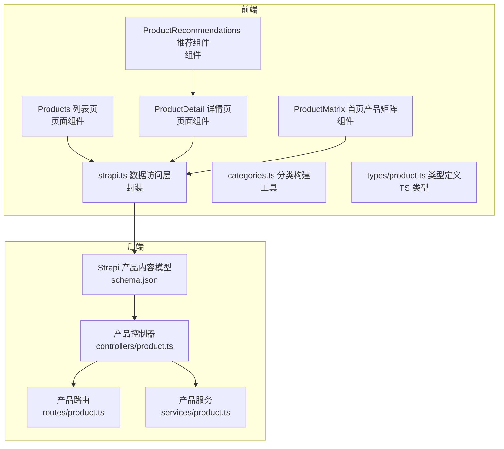
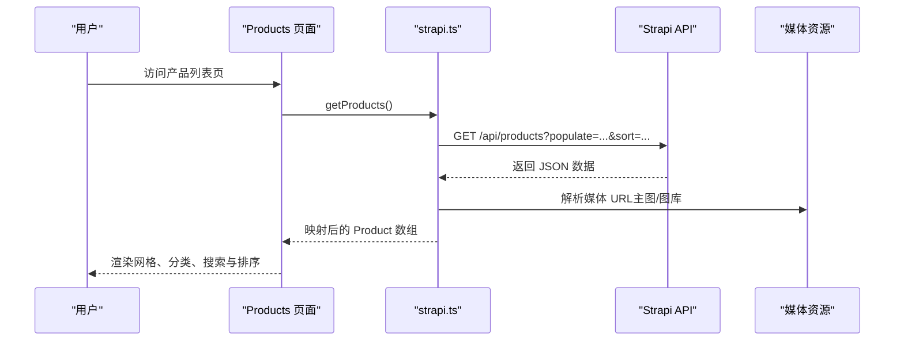
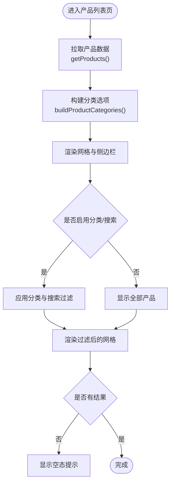
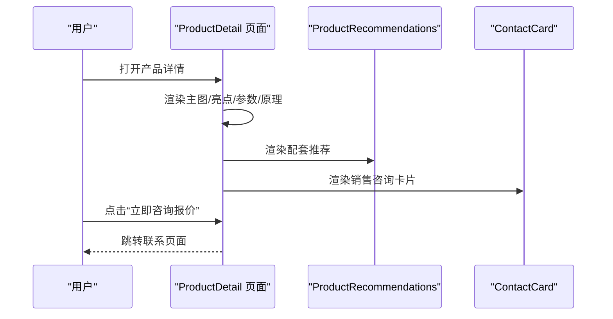
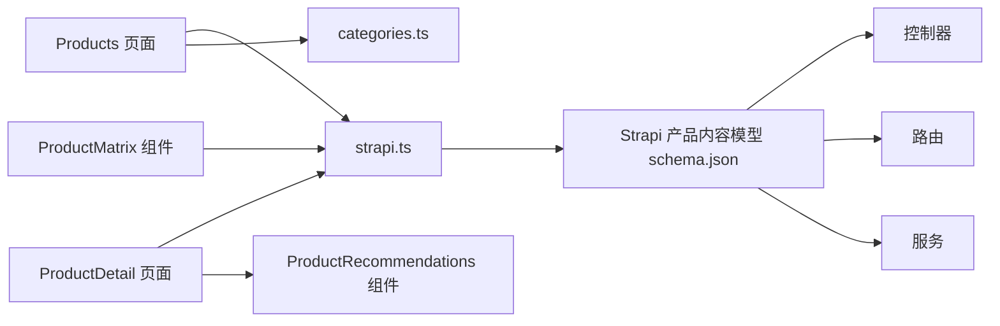

# 产品中心模块

<cite>
**本文引用的文件**
- [schema.json](file://backend/src/api/product/content-types/product/schema.json)
- [product.ts（控制器）](file://backend/src/api/product/controllers/product.ts)
- [product.ts（路由）](file://backend/src/api/product/routes/product.ts)
- [product.ts（服务）](file://backend/src/api/product/services/product.ts)
- [Products.tsx](file://frontend/components/sections/Products.tsx)
- [ProductDetail.tsx](file://frontend/components/sections/ProductDetail.tsx)
- [ProductMatrix.tsx](file://frontend/components/sections/ProductMatrix.tsx)
- [ProductRecommendations.tsx](file://frontend/components/sections/ProductRecommendations.tsx)
- [product.ts（类型定义）](file://frontend/types/product.ts)
- [categories.ts](file://frontend/lib/categories.ts)
- [strapi.ts](file://frontend/lib/strapi.ts)
- [products.ts（示例数据）](file://frontend/content/products.ts)
- [page.tsx（产品列表页）](file://frontend/app/products/page.tsx)
</cite>

## 目录
1. [简介](#简介)
2. [项目结构](#项目结构)
3. [核心组件](#核心组件)
4. [架构总览](#架构总览)
5. [详细组件分析](#详细组件分析)
6. [依赖分析](#依赖分析)
7. [性能考虑](#性能考虑)
8. [故障排查指南](#故障排查指南)
9. [结论](#结论)
10. [附录](#附录)

## 简介
本文件系统性梳理产品中心模块的前端展示与后端数据模型实现，覆盖产品列表页的网格布局、分类筛选、搜索与排序机制；产品详情页的信息展示、图片轮播、技术参数对比与购买咨询流程；产品数据模型的字段定义、关系映射与校验规则；以及 SEO 优化策略、响应式设计、图片懒加载与性能优化建议。文档旨在帮助开发者与产品人员快速理解并高效维护该模块。

## 项目结构
产品中心模块由前后端协同组成：
- 后端（Strapi）：提供产品内容模型与 API 路由，负责数据持久化与查询。
- 前端（Next.js）：负责页面渲染、交互逻辑、状态管理、SEO 与性能优化。

图表来源
- [Products.tsx](file://frontend/components/sections/Products.tsx#L1-L223)
- [ProductDetail.tsx](file://frontend/components/sections/ProductDetail.tsx#L1-L297)
- [ProductMatrix.tsx](file://frontend/components/sections/ProductMatrix.tsx#L1-L114)
- [ProductRecommendations.tsx](file://frontend/components/sections/ProductRecommendations.tsx#L1-L38)
- [strapi.ts](file://frontend/lib/strapi.ts#L1-L155)
- [schema.json](file://backend/src/api/product/content-types/product/schema.json#L1-L63)
- [product.ts（控制器）](file://backend/src/api/product/controllers/product.ts#L1-L4)
- [product.ts（路由）](file://backend/src/api/product/routes/product.ts#L1-L4)
- [product.ts（服务）](file://backend/src/api/product/services/product.ts#L1-L4)

章节来源
- [Products.tsx](file://frontend/components/sections/Products.tsx#L1-L223)
- [ProductDetail.tsx](file://frontend/components/sections/ProductDetail.tsx#L1-L297)
- [ProductMatrix.tsx](file://frontend/components/sections/ProductMatrix.tsx#L1-L114)
- [ProductRecommendations.tsx](file://frontend/components/sections/ProductRecommendations.tsx#L1-L38)
- [strapi.ts](file://frontend/lib/strapi.ts#L1-L155)
- [schema.json](file://backend/src/api/product/content-types/product/schema.json#L1-L63)
- [product.ts（控制器）](file://backend/src/api/product/controllers/product.ts#L1-L4)
- [product.ts（路由）](file://backend/src/api/product/routes/product.ts#L1-L4)
- [product.ts（服务）](file://backend/src/api/product/services/product.ts#L1-L4)

## 核心组件
- 产品列表页（Products）：提供分类筛选、搜索输入、排序与网格布局，支持空态提示与动画过渡。
- 产品详情页（ProductDetail）：包含面包屑导航、主图展示、亮点摘要、技术参数表格、配套推荐与购买咨询。
- 产品矩阵（ProductMatrix）：首页产品入口，展示精选产品卡片与“查看全部”跳转。
- 推荐组件（ProductRecommendations）：为详情页提供配套产品推荐。
- 数据访问层（strapi.ts）：封装 Strapi 请求、媒体资源解析与数据映射。
- 类型系统（types/product.ts）：统一产品数据结构与分类枚举。
- 分类构建（categories.ts）：根据产品数据生成分类选项与计数。
- 内容模型（schema.json）：定义产品字段、验证与发布策略。

章节来源
- [Products.tsx](file://frontend/components/sections/Products.tsx#L1-L223)
- [ProductDetail.tsx](file://frontend/components/sections/ProductDetail.tsx#L1-L297)
- [ProductMatrix.tsx](file://frontend/components/sections/ProductMatrix.tsx#L1-L114)
- [ProductRecommendations.tsx](file://frontend/components/sections/ProductRecommendations.tsx#L1-L38)
- [strapi.ts](file://frontend/lib/strapi.ts#L1-L155)
- [product.ts（类型定义）](file://frontend/types/product.ts#L1-L39)
- [categories.ts](file://frontend/lib/categories.ts#L1-L48)
- [schema.json](file://backend/src/api/product/content-types/product/schema.json#L1-L63)

## 架构总览
产品中心模块采用“前端 Next.js 页面 + Strapi CMS 后端”的典型架构。前端通过数据访问层统一请求后端 API，并进行媒体资源 URL 解析与数据映射，最终渲染为产品列表与详情页。

图表来源
- [page.tsx（产品列表页）](file://frontend/app/products/page.tsx#L1-L50)
- [strapi.ts](file://frontend/lib/strapi.ts#L113-L118)
- [schema.json](file://backend/src/api/product/content-types/product/schema.json#L1-L63)

## 详细组件分析

### 产品列表页面（Products）
- 网格布局：使用 CSS Grid 实现自适应列数，在小屏单列、中屏双列、大屏三列之间平滑切换。
- 分类筛选：基于分类选项与计数构建侧边栏，点击切换当前分类，支持“全部产品”。
- 搜索功能：输入框实时过滤产品名称与描述，结合分类筛选结果。
- 排序机制：按 order 字段升序排列，保证展示顺序可控。
- 动画与交互：使用布局动画与悬停效果提升体验；空态时显示提示信息。
- 导航与 CTA：右侧“定制方案”卡片引导用户联系销售。

图表来源
- [Products.tsx](file://frontend/components/sections/Products.tsx#L21-L36)
- [categories.ts](file://frontend/lib/categories.ts#L17-L31)
- [strapi.ts](file://frontend/lib/strapi.ts#L113-L118)

章节来源
- [Products.tsx](file://frontend/components/sections/Products.tsx#L1-L223)
- [categories.ts](file://frontend/lib/categories.ts#L1-L48)
- [strapi.ts](file://frontend/lib/strapi.ts#L113-L118)

### 产品详情页面（ProductDetail）
- 面包屑导航：清晰指示当前位置，便于回退与 SEO。
- 图片展示：主图与缩略图网格，支持悬停放大与选中态高亮。
- 亮点摘要：以图标+文案形式突出核心卖点。
- 技术参数：表格化展示关键参数，便于对比查阅。
- 工作原理示意：步骤化图解，降低理解成本。
- 购买咨询：提供“立即咨询报价”按钮，跳转联系页面。
- 侧边栏：配套推荐与销售卡片，促进交叉销售。

图表来源
- [ProductDetail.tsx](file://frontend/components/sections/ProductDetail.tsx#L66-L188)
- [ProductRecommendations.tsx](file://frontend/components/sections/ProductRecommendations.tsx#L13-L37)

章节来源
- [ProductDetail.tsx](file://frontend/components/sections/ProductDetail.tsx#L1-L297)
- [ProductRecommendations.tsx](file://frontend/components/sections/ProductRecommendations.tsx#L1-L38)

### 产品矩阵（ProductMatrix）
- 首页入口：展示精选产品卡片，支持跳转至淘宝购买。
- 视觉设计：渐变边框、悬停阴影与缩放动效，增强交互吸引力。
- 信息摘要：优先展示 shortDescription 或 features 的前两项，避免冗长。

章节来源
- [ProductMatrix.tsx](file://frontend/components/sections/ProductMatrix.tsx#L1-L114)

### 产品推荐组件（ProductRecommendations）
- 结构：标题 + 多条推荐项（图标、标题、描述）。
- 交互：悬停高亮，提升点击意愿。

章节来源
- [ProductRecommendations.tsx](file://frontend/components/sections/ProductRecommendations.tsx#L1-L38)

### 数据访问层（strapi.ts）
- 媒体资源解析：统一处理相对路径与绝对路径，拼接 Strapi 基础 URL。
- 数据映射：将 Strapi 响应转换为前端 Product 类型，处理可选字段与默认值。
- 请求封装：统一 fetch 调用，设置缓存与错误处理。

章节来源
- [strapi.ts](file://frontend/lib/strapi.ts#L1-L155)

### 类型系统（types/product.ts）
- 字段定义：slug、name、shortDescription、description、category、image、gallery、features、specifications、featured、order、taobaoLink。
- 分类枚举：warning、sensing、inspection。
- 可选字段：gallery、specifications、shortDescription、description 等。

章节来源
- [product.ts（类型定义）](file://frontend/types/product.ts#L1-L39)

### 分类构建（categories.ts）
- 统计各分类数量，生成“全部产品”与具体分类选项。
- 与 UI 组件配合，实现侧边栏分类导航。

章节来源
- [categories.ts](file://frontend/lib/categories.ts#L1-L48)

### 内容模型（schema.json）
- 字段与约束：name（必填）、slug（UID，唯一）、shortDescription、description（富文本）、category（枚举）、image/galley（媒体，可选）、features/specifications（JSON）、featured（布尔）、order（整数）、taobaoLink（字符串）。
- 发布策略：draftAndPublish 开启，支持草稿与发布。

章节来源
- [schema.json](file://backend/src/api/product/content-types/product/schema.json#L1-L63)

### 后端控制器/路由/服务
- 控制器：基于 Strapi 工厂创建核心控制器。
- 路由：基于 Strapi 工厂创建核心路由。
- 服务：基于 Strapi 工厂创建核心服务。

章节来源
- [product.ts（控制器）](file://backend/src/api/product/controllers/product.ts#L1-L4)
- [product.ts（路由）](file://backend/src/api/product/routes/product.ts#L1-L4)
- [product.ts（服务）](file://backend/src/api/product/services/product.ts#L1-L4)

## 依赖分析
- 前端页面依赖数据访问层（strapi.ts）获取产品数据。
- 产品列表页依赖分类构建工具（categories.ts）生成分类导航。
- 产品详情页依赖推荐组件（ProductRecommendations）与联系卡片（ContactCard）。
- 后端通过内容模型（schema.json）与工厂控制器/路由/服务提供 API。

图表来源
- [Products.tsx](file://frontend/components/sections/Products.tsx#L1-L223)
- [ProductDetail.tsx](file://frontend/components/sections/ProductDetail.tsx#L1-L297)
- [ProductMatrix.tsx](file://frontend/components/sections/ProductMatrix.tsx#L1-L114)
- [categories.ts](file://frontend/lib/categories.ts#L1-L48)
- [strapi.ts](file://frontend/lib/strapi.ts#L1-L155)
- [schema.json](file://backend/src/api/product/content-types/product/schema.json#L1-L63)
- [product.ts（控制器）](file://backend/src/api/product/controllers/product.ts#L1-L4)
- [product.ts（路由）](file://backend/src/api/product/routes/product.ts#L1-L4)
- [product.ts（服务）](file://backend/src/api/product/services/product.ts#L1-L4)

## 性能考虑
- 图片懒加载与占位：使用具备回退能力的图片组件，避免首屏阻塞。
- 响应式设计：网格列数随屏幕宽度自适应，减少不必要的重排。
- 动画与过渡：合理使用过渡与悬停效果，避免过度动画影响性能。
- 缓存策略：利用 Next.js 的缓存与 revalidate 机制，降低重复请求。
- 数据映射：在客户端进行必要的数据清洗与默认值处理，减少渲染期计算。

## 故障排查指南
- 产品图片不显示
  - 检查媒体 URL 解析逻辑，确认基础 URL 与相对路径拼接正确。
  - 确认 Strapi 中媒体字段已上传且可访问。
- 分类计数异常
  - 核对分类构建函数中的统计逻辑与枚举值一致性。
- 列表排序不生效
  - 确认后端返回数据已按 order 升序排序，前端未二次覆盖。
- SEO 元数据缺失
  - 检查页面元数据生成逻辑，确保默认值与 OpenGraph/Twitter 配置齐全。

章节来源
- [strapi.ts](file://frontend/lib/strapi.ts#L35-L76)
- [categories.ts](file://frontend/lib/categories.ts#L17-L31)
- [page.tsx（产品列表页）](file://frontend/app/products/page.tsx#L7-L41)

## 结论
产品中心模块通过清晰的数据模型与前后端协作，实现了稳定的产品展示与管理能力。列表页提供高效的筛选与搜索，详情页承载丰富的信息与转化路径。建议在后续迭代中进一步完善推荐算法与个性化策略，持续优化图片与交互性能，并加强 SEO 与可访问性建设。

## 附录

### 产品数据模型设计
- 字段与类型
  - slug: string（UID，唯一）
  - name: string（必填）
  - shortDescription: string
  - description: richtext
  - category: 枚举（warning/sensing/inspection）
  - image: media（单张，可选）
  - gallery: media[]（多张，可选）
  - features: JSON（数组对象，label/value）
  - specifications: JSON（键值对）
  - featured: boolean（默认 false）
  - order: integer
  - taobaoLink: string
- 关系映射
  - 媒体资源通过 Strapi 媒体库管理，前端统一解析为可用 URL。
  - features/specifications 作为结构化数据，便于渲染与对比。
- 数据验证规则
  - 必填字段：name、slug。
  - 发布策略：draftAndPublish，支持草稿与发布。

章节来源
- [schema.json](file://backend/src/api/product/content-types/product/schema.json#L13-L62)
- [strapi.ts](file://frontend/lib/strapi.ts#L55-L76)

### SEO 优化策略
- 结构化数据：在详情页中嵌入结构化数据（如品牌、评分、价格等），提升搜索可见性。
- OpenGraph/Twitter：为产品列表页与详情页配置 og:title、og:description、og:image、twitter:card 等。
- 元数据配置：使用页面级 generateMetadata 动态生成标题与描述，确保每页唯一性。
- 图片优化：使用合适的尺寸与格式，提供 alt 文本，支持懒加载。
- 可访问性：为图片提供替代文本，为交互元素提供语义标签。

章节来源
- [page.tsx（产品列表页）](file://frontend/app/products/page.tsx#L7-L41)