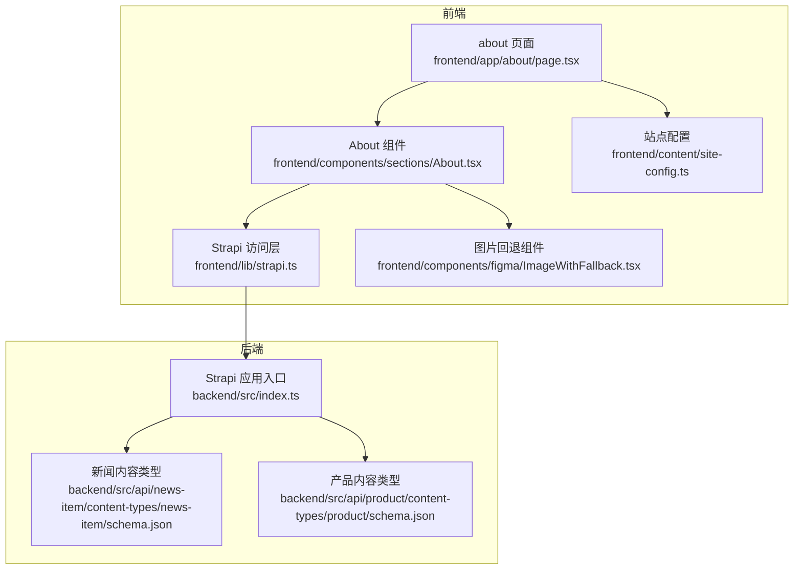
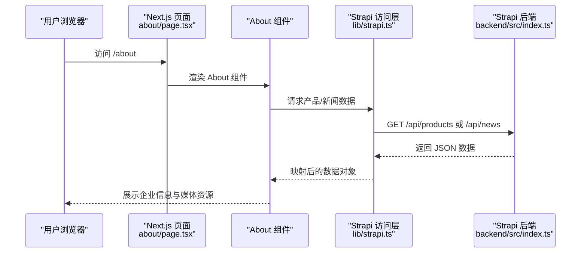
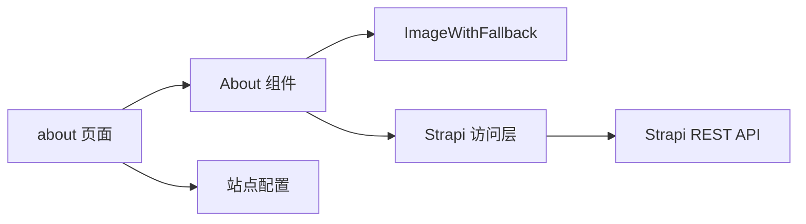

# 关于我们模块

<cite>
**本文引用的文件**
- [frontend/app/about/page.tsx](file://frontend/app/about/page.tsx)
- [frontend/components/sections/About.tsx](file://frontend/components/sections/About.tsx)
- [frontend/content/site-config.ts](file://frontend/content/site-config.ts)
- [frontend/lib/strapi.ts](file://frontend/lib/strapi.ts)
- [frontend/components/figma/ImageWithFallback.tsx](file://frontend/components/figma/ImageWithFallback.tsx)
- [backend/src/api/news-item/content-types/news-item/schema.json](file://backend/src/api/news-item/content-types/news-item/schema.json)
- [backend/src/api/product/content-types/product/schema.json](file://backend/src/api/product/content-types/product/schema.json)
- [backend/src/index.ts](file://backend/src/index.ts)
- [frontend/types/news.ts](file://frontend/types/news.ts)
- [frontend/types/product.ts](file://frontend/types/product.ts)
</cite>

## 目录
1. [简介](#简介)
2. [项目结构](#项目结构)
3. [核心组件](#核心组件)
4. [架构总览](#架构总览)
5. [详细组件分析](#详细组件分析)
6. [依赖关系分析](#依赖关系分析)
7. [性能考量](#性能考量)
8. [故障排查指南](#故障排查指南)
9. [结论](#结论)
10. [附录](#附录)

## 简介
本文件围绕“关于我们”模块进行系统化文档化，聚焦企业信息展示功能的实现与设计。内容涵盖公司介绍页面的企业概况、发展历程、企业文化与发展愿景的呈现；团队成员展示（含组织架构）的实现思路；公司荣誉与资质展示的设计要点；关于页面的数据模型设计（组织结构、人员信息、成就记录）；以及关于页面的 SEO 优化策略（企业信息优化、本地 SEO 配置、品牌价值展示）、响应式设计与多媒体整合、用户体验优化技巧。文档同时提供可视化架构图与流程图，帮助读者快速理解模块的实现逻辑与扩展方向。

## 项目结构
“关于我们”模块由前端页面与后端 CMS 数据两部分组成：
- 前端负责页面渲染、交互动效与媒体资源加载；
- 后端使用 Strapi 提供内容管理与 API 输出，前端通过统一的 Strapi 访问层进行数据拉取与映射。

图表来源
- [frontend/app/about/page.tsx](file://frontend/app/about/page.tsx#L1-L18)
- [frontend/components/sections/About.tsx](file://frontend/components/sections/About.tsx#L1-L495)
- [frontend/content/site-config.ts](file://frontend/content/site-config.ts#L1-L47)
- [frontend/lib/strapi.ts](file://frontend/lib/strapi.ts#L1-L155)
- [frontend/components/figma/ImageWithFallback.tsx](file://frontend/components/figma/ImageWithFallback.tsx#L1-L85)
- [backend/src/index.ts](file://backend/src/index.ts#L1-L65)
- [backend/src/api/news-item/content-types/news-item/schema.json](file://backend/src/api/news-item/content-types/news-item/schema.json#L1-L65)
- [backend/src/api/product/content-types/product/schema.json](file://backend/src/api/product/content-types/product/schema.json#L1-L63)

章节来源
- [frontend/app/about/page.tsx](file://frontend/app/about/page.tsx#L1-L18)
- [frontend/components/sections/About.tsx](file://frontend/components/sections/About.tsx#L1-L495)
- [frontend/content/site-config.ts](file://frontend/content/site-config.ts#L1-L47)
- [frontend/lib/strapi.ts](file://frontend/lib/strapi.ts#L1-L155)
- [frontend/components/figma/ImageWithFallback.tsx](file://frontend/components/figma/ImageWithFallback.tsx#L1-L85)
- [backend/src/index.ts](file://backend/src/index.ts#L1-L65)
- [backend/src/api/news-item/content-types/news-item/schema.json](file://backend/src/api/news-item/content-types/news-item/schema.json#L1-L65)
- [backend/src/api/product/content-types/product/schema.json](file://backend/src/api/product/content-types/product/schema.json#L1-L63)

## 核心组件
- 页面入口与元数据：about 页面负责设置标题、描述与 Open Graph 元信息，并渲染 About 组件。
- About 组件：承载企业介绍、发展历程、技术优势、合作伙伴与行动号召等区块，配合滚动动画与媒体资源展示。
- 图片回退组件：增强图片加载失败时的容错体验，避免空白或错误占位。
- Strapi 访问层：封装媒体 URL 解析、数据映射与 API 请求，支持产品与新闻数据的获取。
- 站点配置：集中管理品牌名称、标语、联系信息、品牌色彩与 SEO 默认值，便于统一风格与 SEO 策略落地。

章节来源
- [frontend/app/about/page.tsx](file://frontend/app/about/page.tsx#L1-L18)
- [frontend/components/sections/About.tsx](file://frontend/components/sections/About.tsx#L1-L495)
- [frontend/components/figma/ImageWithFallback.tsx](file://frontend/components/figma/ImageWithFallback.tsx#L1-L85)
- [frontend/lib/strapi.ts](file://frontend/lib/strapi.ts#L1-L155)
- [frontend/content/site-config.ts](file://frontend/content/site-config.ts#L1-L47)

## 架构总览
“关于我们”模块采用前后端分离架构：
- 前端 Next.js 应用通过 Strapi 提供的 REST API 获取内容；
- Strapi 在启动时为公开角色启用产品与新闻的查询权限；
- 前端对媒体资源进行统一解析与回退处理，保证在不同网络与设备下的稳定性。

图表来源
- [frontend/app/about/page.tsx](file://frontend/app/about/page.tsx#L1-L18)
- [frontend/components/sections/About.tsx](file://frontend/components/sections/About.tsx#L1-L495)
- [frontend/lib/strapi.ts](file://frontend/lib/strapi.ts#L100-L155)
- [backend/src/index.ts](file://backend/src/index.ts#L19-L63)

## 详细组件分析

### 页面入口与元数据（about 页面）
- 设置页面标题与描述，结合站点配置中的品牌名；
- 配置 Open Graph 类型与描述，提升社交分享质量；
- 渲染 About 组件作为主要内容容器。

章节来源
- [frontend/app/about/page.tsx](file://frontend/app/about/page.tsx#L5-L13)
- [frontend/content/site-config.ts](file://frontend/content/site-config.ts#L3-L29)

### About 组件（企业信息展示）
- 设计层次与区块划分：
  - 英雄区：品牌宣言、动态背景与科技感视觉元素；
  - 统计卡片：研发人数、专利数量、覆盖里程等关键指标；
  - 企业理念：企业愿景、哲学与核心能力说明；
  - 发展历程：时间轴展示里程碑事件；
  - 技术优势：技术亮点与产品能力的 Bento 网格布局；
  - 合作伙伴：横向滚动展示品牌生态；
  - 行动号召：引导联系与进一步探索。
- 动画与交互：
  - 使用滚动进度驱动的视差与进度条；
  - 卡片悬停与进入视口的动效；
  - 浮动 UI 元素模拟“实时感知引擎”状态。
- 多媒体与图片：
  - 使用图片回退组件处理加载失败；
  - 通过统一的媒体 URL 解析函数保证跨域与本地资源一致访问。

章节来源
- [frontend/components/sections/About.tsx](file://frontend/components/sections/About.tsx#L54-L495)
- [frontend/components/figma/ImageWithFallback.tsx](file://frontend/components/figma/ImageWithFallback.tsx#L21-L85)

### 图片回退组件（ImageWithFallback）
- 功能要点：
  - 捕获图片加载错误，回退到占位图；
  - 支持 data URL 与常规图片路径；
  - 保持尺寸与填充属性的一致性，避免布局抖动。
- 适用场景：
  - About 组件中的多张背景图与缩略图；
  - 新闻详情页与产品图库的容错处理。

章节来源
- [frontend/components/figma/ImageWithFallback.tsx](file://frontend/components/figma/ImageWithFallback.tsx#L1-L85)

### Strapi 访问层（lib/strapi.ts）
- 媒体 URL 解析：
  - 统一处理相对路径与绝对路径；
  - 支持单媒体与媒体数组的解析。
- 数据映射：
  - 产品映射：提取 slug、名称、简述、描述、分类、主图/图库、特性、规格、置顶、排序、链接等；
  - 新闻映射：提取 slug、标题、摘要、内容、分类、封面图、作者、置顶、标签、阅读量、关联产品等。
- API 请求：
  - 封装 fetchStrapi，统一处理响应状态与错误；
  - 提供产品与新闻的列表、详情与置顶数据接口。

章节来源
- [frontend/lib/strapi.ts](file://frontend/lib/strapi.ts#L35-L98)
- [frontend/lib/strapi.ts](file://frontend/lib/strapi.ts#L100-L155)

### 数据模型设计（内容类型）
- 新闻内容类型（news-item）：
  - 字段：标题、唯一标识、摘要、富文本内容、分类、封面图、附件、作者、置顶、标签、浏览量、关联产品等；
  - 分类枚举：产品动态、技术迭代、标准制定、公司新闻。
- 产品内容类型（product）：
  - 字段：名称、唯一标识、简述、富文本描述、分类、封面图、图库、特性、规格、置顶、排序、淘宝链接等；
  - 分类枚举：预警硬件、监测感知、无人巡检。

章节来源
- [backend/src/api/news-item/content-types/news-item/schema.json](file://backend/src/api/news-item/content-types/news-item/schema.json#L13-L62)
- [backend/src/api/product/content-types/product/schema.json](file://backend/src/api/product/content-types/product/schema.json#L13-L61)

### 权限与启动配置（Strapi 启动）
- 启动时为“公开”角色启用产品与新闻的查询权限，确保前端可无鉴权访问；
- 降低集成门槛，便于 About 页面直接拉取所需内容。

章节来源
- [backend/src/index.ts](file://backend/src/index.ts#L29-L62)

### 类型定义（前端）
- 新闻类型：包含 slug、标题、摘要、内容、分类、封面图、发布时间、作者、置顶、标签、更新时间、阅读量、关联产品等字段；
- 产品类型：包含 slug、名称、简述、描述、分类、主图、图库、特性、规格、置顶、排序、链接等字段。

章节来源
- [frontend/types/news.ts](file://frontend/types/news.ts#L16-L43)
- [frontend/types/product.ts](file://frontend/types/product.ts#L13-L38)

## 依赖关系分析
- 组件耦合与内聚：
  - About 组件高度内聚，负责企业信息的完整展示；
  - 与图片回退组件松耦合，仅通过 props 传入资源地址；
  - 与 Strapi 访问层通过函数调用解耦，便于替换数据源。
- 外部依赖：
  - Next.js 的路由与元数据 API；
  - motion/react 提供滚动驱动的动画；
  - Strapi 提供内容管理与 REST API。

图表来源
- [frontend/components/sections/About.tsx](file://frontend/components/sections/About.tsx#L1-L495)
- [frontend/components/figma/ImageWithFallback.tsx](file://frontend/components/figma/ImageWithFallback.tsx#L1-L85)
- [frontend/lib/strapi.ts](file://frontend/lib/strapi.ts#L1-L155)
- [frontend/app/about/page.tsx](file://frontend/app/about/page.tsx#L1-L18)
- [frontend/content/site-config.ts](file://frontend/content/site-config.ts#L1-L47)

章节来源
- [frontend/components/sections/About.tsx](file://frontend/components/sections/About.tsx#L1-L495)
- [frontend/lib/strapi.ts](file://frontend/lib/strapi.ts#L1-L155)
- [frontend/app/about/page.tsx](file://frontend/app/about/page.tsx#L1-L18)
- [frontend/content/site-config.ts](file://frontend/content/site-config.ts#L1-L47)

## 性能考量
- 图片加载优化：
  - 使用 Next.js Image 并结合回退组件，减少白屏与布局抖动；
  - 对大图采用懒加载与合适的尺寸参数，控制带宽占用。
- 动画与滚动：
  - 使用 useScroll/useTransform 控制动画，避免频繁重排；
  - 限制进入视口的动画触发频率，优先使用 transform 与 opacity。
- API 请求：
  - 合理设置 revalidate 时间，平衡新鲜度与缓存收益；
  - 对媒体 URL 进行本地解析，减少跨域请求失败带来的重试成本。

## 故障排查指南
- 图片无法显示：
  - 检查媒体 URL 是否正确解析（协议与域名）；
  - 确认图片资源是否存在，必要时启用回退占位。
- 数据为空或字段缺失：
  - 核对 Strapi 内容类型字段是否完整；
  - 检查访问层映射函数是否正确提取字段。
- SEO 元信息异常：
  - 确认页面元数据是否正确注入；
  - 检查站点配置中的默认 SEO 值是否合理。

章节来源
- [frontend/components/figma/ImageWithFallback.tsx](file://frontend/components/figma/ImageWithFallback.tsx#L34-L50)
- [frontend/lib/strapi.ts](file://frontend/lib/strapi.ts#L35-L53)
- [frontend/app/about/page.tsx](file://frontend/app/about/page.tsx#L5-L13)
- [frontend/content/site-config.ts](file://frontend/content/site-config.ts#L22-L29)

## 结论
“关于我们”模块通过清晰的页面结构、丰富的视觉与交互设计、完善的媒体容错机制以及标准化的数据访问层，实现了企业信息的专业展示。结合合理的 SEO 配置与响应式设计，该模块既能满足品牌传播需求，也能提供良好的用户体验。后续可在团队成员展示与组织架构可视化方面引入结构化数据与交互式图表，进一步强化“关于”的专业性与可读性。

## 附录

### 关于页面 SEO 优化策略
- 企业信息优化：
  - 标题与描述中包含品牌名与核心业务关键词；
  - Open Graph 图片与描述提升社交分享效果。
- 本地 SEO 配置：
  - 在站点配置中维护联系信息与品牌色彩，便于结构化数据与品牌一致性展示。
- 品牌价值展示：
  - 通过技术优势与合作伙伴展示企业实力与生态合作。

章节来源
- [frontend/app/about/page.tsx](file://frontend/app/about/page.tsx#L5-L13)
- [frontend/content/site-config.ts](file://frontend/content/site-config.ts#L3-L29)

### 响应式企业信息展示与多媒体整合
- 响应式网格与卡片布局，适配移动端与桌面端；
- 多媒体资源统一解析与回退，保障在弱网与离线场景下的可用性；
- 动画与滚动联动，提升沉浸式体验但不牺牲性能。

章节来源
- [frontend/components/sections/About.tsx](file://frontend/components/sections/About.tsx#L229-L495)
- [frontend/components/figma/ImageWithFallback.tsx](file://frontend/components/figma/ImageWithFallback.tsx#L21-L85)

### 用户体验优化技巧
- 视差与进度条增强空间层次感；
- 卡片悬停与进入视口动效提升交互反馈；
- 合理的留白与对比度，突出关键信息与品牌色。

章节来源
- [frontend/components/sections/About.tsx](file://frontend/components/sections/About.tsx#L54-L495)