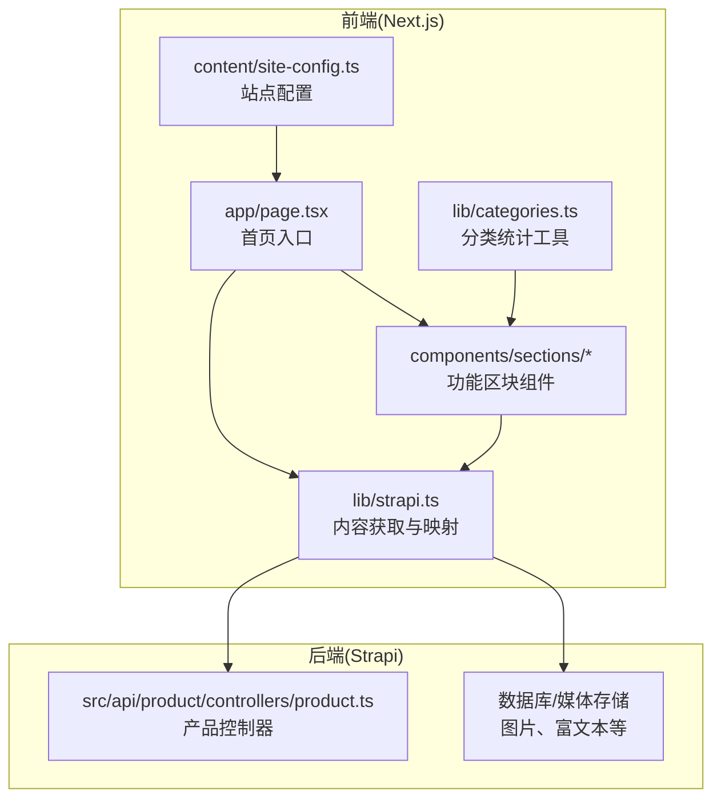
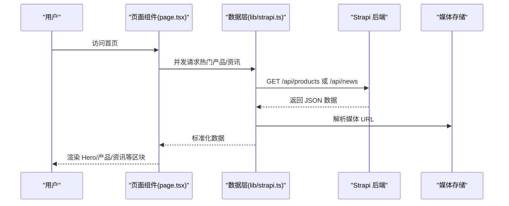
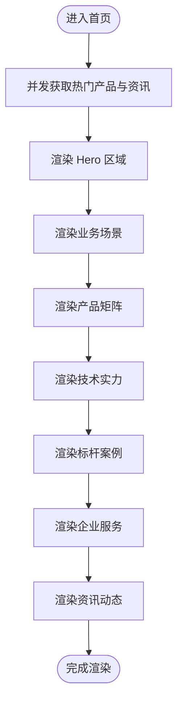
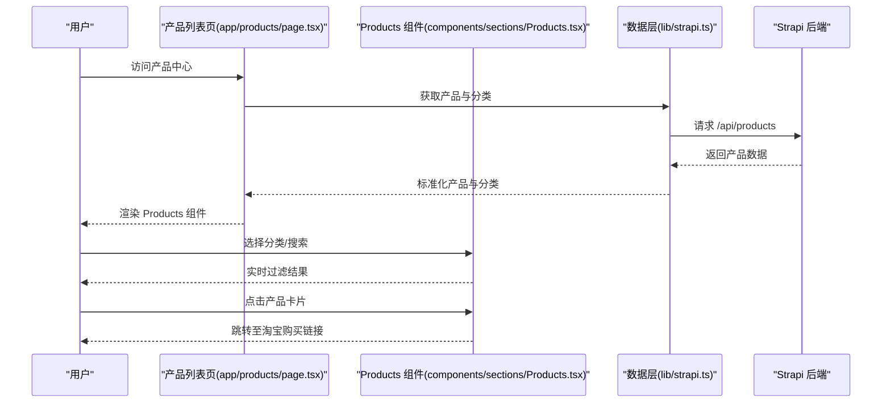
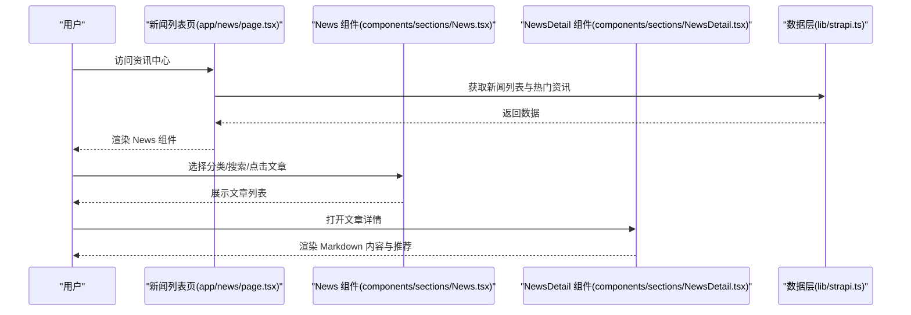
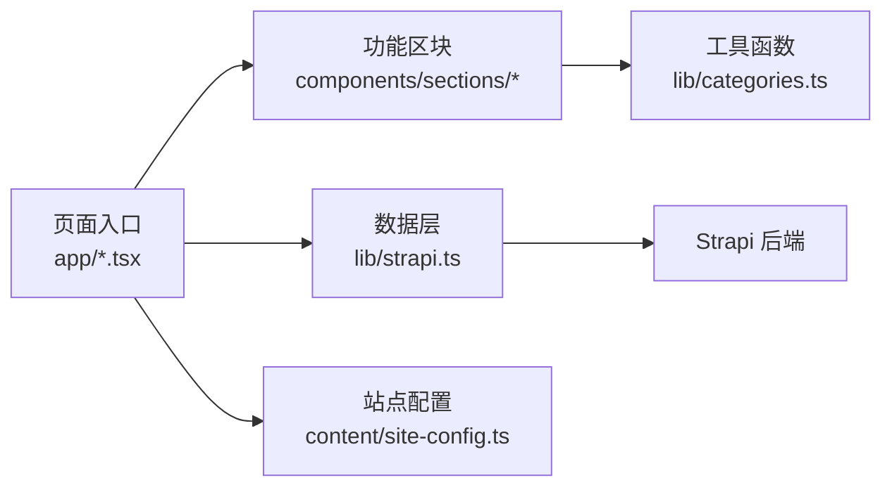

# 功能模块详解

<cite>
**本文引用的文件**
- [frontend/app/page.tsx](file://frontend/app/page.tsx)
- [frontend/components/sections/Hero.tsx](file://frontend/components/sections/Hero.tsx)
- [frontend/components/sections/Products.tsx](file://frontend/components/sections/Products.tsx)
- [frontend/app/products/page.tsx](file://frontend/app/products/page.tsx)
- [frontend/app/news/page.tsx](file://frontend/app/news/page.tsx)
- [frontend/components/sections/News.tsx](file://frontend/components/sections/News.tsx)
- [frontend/components/sections/NewsDetail.tsx](file://frontend/components/sections/NewsDetail.tsx)
- [frontend/components/sections/ProductDetail.tsx](file://frontend/components/sections/ProductDetail.tsx)
- [frontend/lib/strapi.ts](file://frontend/lib/strapi.ts)
- [frontend/lib/categories.ts](file://frontend/lib/categories.ts)
- [frontend/content/site-config.ts](file://frontend/content/site-config.ts)
- [backend/src/api/product/controllers/product.ts](file://backend/src/api/product/controllers/product.ts)
</cite>

## 目录
1. [引言](#引言)
2. [项目结构](#项目结构)
3. [核心组件](#核心组件)
4. [架构总览](#架构总览)
5. [详细组件分析](#详细组件分析)
6. [依赖分析](#依赖分析)
7. [性能考虑](#性能考虑)
8. [故障排查指南](#故障排查指南)
9. [结论](#结论)
10. [附录](#附录)

## 引言
本文件面向中创智控官网的功能模块实现，围绕首页、产品中心、新闻资讯、解决方案、关于我们、联系我们等模块进行系统化梳理。重点解释模块设计、数据流、组件交互、响应式布局与用户体验优化策略，并给出各模块间的关系图与流程图，帮助开发者与产品人员快速理解与维护。

## 项目结构
前端采用 Next.js App Router 架构，按页面组织路由；内容与配置集中在 content 与 lib 目录；组件以功能分段（sections）组织，便于复用与组合。后端使用 Strapi CMS，提供内容与媒体资源的统一管理。

图表来源
- [frontend/app/page.tsx](file://frontend/app/page.tsx#L1-L72)
- [frontend/lib/strapi.ts](file://frontend/lib/strapi.ts#L1-L155)
- [frontend/lib/categories.ts](file://frontend/lib/categories.ts#L1-L48)
- [frontend/content/site-config.ts](file://frontend/content/site-config.ts#L1-L47)
- [backend/src/api/product/controllers/product.ts](file://backend/src/api/product/controllers/product.ts#L1-L4)

章节来源
- [frontend/app/page.tsx](file://frontend/app/page.tsx#L1-L72)
- [frontend/lib/strapi.ts](file://frontend/lib/strapi.ts#L1-L155)
- [frontend/lib/categories.ts](file://frontend/lib/categories.ts#L1-L48)
- [frontend/content/site-config.ts](file://frontend/content/site-config.ts#L1-L47)
- [backend/src/api/product/controllers/product.ts](file://backend/src/api/product/controllers/product.ts#L1-L4)

## 核心组件
- 首页模块：由多个功能区块组成，包括 Hero、业务场景、产品矩阵、技术实力、案例研究、服务保障与资讯动态。
- 产品中心模块：提供产品列表、分类筛选、搜索与详情页。
- 新闻资讯模块：提供新闻列表、详情页、分类与置顶推荐。
- 解决方案模块：集中展示方案与案例研究。
- 关于我们与联系我们：基础信息页，配合 SEO 配置。

章节来源
- [frontend/app/page.tsx](file://frontend/app/page.tsx#L40-L71)
- [frontend/components/sections/Hero.tsx](file://frontend/components/sections/Hero.tsx#L1-L138)
- [frontend/components/sections/Products.tsx](file://frontend/components/sections/Products.tsx#L1-L223)
- [frontend/app/products/page.tsx](file://frontend/app/products/page.tsx#L1-L50)
- [frontend/app/news/page.tsx](file://frontend/app/news/page.tsx#L1-L31)
- [frontend/components/sections/News.tsx](file://frontend/components/sections/News.tsx#L1-L299)
- [frontend/components/sections/NewsDetail.tsx](file://frontend/components/sections/NewsDetail.tsx#L1-L333)
- [frontend/components/sections/ProductDetail.tsx](file://frontend/components/sections/ProductDetail.tsx#L1-L297)

## 架构总览
前端通过 lib/strapi.ts 统一访问 Strapi 后端，返回标准化的数据模型；lib/categories.ts 提供分类统计；页面入口负责并发拉取数据并渲染对应区块组件。

图表来源
- [frontend/app/page.tsx](file://frontend/app/page.tsx#L40-L45)
- [frontend/lib/strapi.ts](file://frontend/lib/strapi.ts#L100-L155)

章节来源
- [frontend/app/page.tsx](file://frontend/app/page.tsx#L40-L71)
- [frontend/lib/strapi.ts](file://frontend/lib/strapi.ts#L100-L155)

## 详细组件分析

### 首页模块
- 设计要点
  - Hero 区域强调品牌调性与核心价值，使用渐变与动画增强首屏体验。
  - 业务场景、产品矩阵、技术实力、案例研究、服务保障与资讯动态依次呈现，形成“认知—信任—转化”的信息流。
- 数据流
  - 页面并发获取热门产品与资讯，传递给对应区块组件。
  - 使用 buildNewsCategories 进行分类统计，用于侧边栏筛选。
- 响应式布局
  - 大量使用相对单位与栅格系统，保证在移动端与桌面端的可读性与可操作性。
- 用户体验
  - 首屏滚动指示、悬停动画、渐入过渡，提升交互愉悦度。

图表来源
- [frontend/app/page.tsx](file://frontend/app/page.tsx#L40-L71)
- [frontend/components/sections/Hero.tsx](file://frontend/components/sections/Hero.tsx#L1-L138)

章节来源
- [frontend/app/page.tsx](file://frontend/app/page.tsx#L1-L72)
- [frontend/components/sections/Hero.tsx](file://frontend/components/sections/Hero.tsx#L1-L138)

### 产品中心模块
- 列表展示
  - 支持分类筛选与关键词搜索，使用 useMemo 优化过滤性能。
  - 产品卡片包含图片、特性网格与“查看详情”按钮，点击跳转至淘宝链接。
- 详情页面
  - 展示产品详情、技术参数、工作原理示意与配套推荐，右侧提供咨询与服务保障卡片。
- 分类与推荐
  - buildProductCategories 生成分类统计，用于侧边栏导航。
  - 产品详情页提供关联推荐与联系方式卡片，促进转化。

图表来源
- [frontend/app/products/page.tsx](file://frontend/app/products/page.tsx#L1-L50)
- [frontend/components/sections/Products.tsx](file://frontend/components/sections/Products.tsx#L1-L223)
- [frontend/lib/strapi.ts](file://frontend/lib/strapi.ts#L113-L125)
- [backend/src/api/product/controllers/product.ts](file://backend/src/api/product/controllers/product.ts#L1-L4)

章节来源
- [frontend/app/products/page.tsx](file://frontend/app/products/page.tsx#L1-L50)
- [frontend/components/sections/Products.tsx](file://frontend/components/sections/Products.tsx#L1-L223)
- [frontend/lib/strapi.ts](file://frontend/lib/strapi.ts#L113-L125)
- [frontend/lib/categories.ts](file://frontend/lib/categories.ts#L17-L31)

### 新闻资讯模块
- 列表页
  - 支持分类筛选与关键词搜索，置顶推荐文章优先展示。
  - 使用 AnimatePresence 与 layout 动画，优化切换体验。
- 详情页
  - 支持 Markdown 渲染（含 mermaid 图表）、面包屑导航、上/下篇文章切换与侧边栏“推荐阅读”。
- 分类系统与 SEO
  - buildNewsCategories 生成分类统计；generateMetadata 动态注入 OG 图片与描述，提升 SEO 表现。

图表来源
- [frontend/app/news/page.tsx](file://frontend/app/news/page.tsx#L1-L31)
- [frontend/components/sections/News.tsx](file://frontend/components/sections/News.tsx#L1-L299)
- [frontend/components/sections/NewsDetail.tsx](file://frontend/components/sections/NewsDetail.tsx#L1-L333)
- [frontend/lib/strapi.ts](file://frontend/lib/strapi.ts#L127-L147)

章节来源
- [frontend/app/news/page.tsx](file://frontend/app/news/page.tsx#L1-L31)
- [frontend/components/sections/News.tsx](file://frontend/components/sections/News.tsx#L1-L299)
- [frontend/components/sections/NewsDetail.tsx](file://frontend/components/sections/NewsDetail.tsx#L1-L333)
- [frontend/lib/strapi.ts](file://frontend/lib/strapi.ts#L127-L147)
- [frontend/lib/categories.ts](file://frontend/lib/categories.ts#L33-L47)

### 解决方案模块
- 设计目标
  - 面向不同交通场景（高速、隧道、桥梁、城市道路）提供“感知-决策-预警”闭环方案。
- 实现方式
  - 页面入口负责 SEO 元数据注入；具体方案与案例研究通过区块组件组合展示。
- 与产品/新闻的关联
  - 可在详情页中嵌入相关产品卡片与新闻资讯，形成跨模块联动。

章节来源
- [frontend/app/solutions/page.tsx](file://frontend/app/solutions/page.tsx#L1-L18)
- [frontend/components/sections/Solutions.tsx](file://frontend/components/sections/Solutions.tsx)

### 关于我们与联系我们模块
- 设计要点
  - 简洁的信息展示，配合品牌色与 SEO 配置，强化信任感与可联系性。
- 实现方式
  - 页面入口注入元数据；内容通过区块组件承载。

章节来源
- [frontend/app/about/page.tsx](file://frontend/app/about/page.tsx#L1-L18)
- [frontend/app/contact/page.tsx](file://frontend/app/contact/page.tsx#L1-L18)
- [frontend/content/site-config.ts](file://frontend/content/site-config.ts#L1-L47)

## 依赖分析
- 组件耦合
  - 页面入口仅负责数据聚合与传递，组件内部处理交互逻辑，保持高内聚低耦合。
- 外部依赖
  - Strapi 提供内容与媒体资源；Next.js App Router 提供路由与 SSR/SSG 能力。
- 数据映射
  - lib/strapi.ts 将后端返回的媒体字段标准化为可用 URL，避免页面层重复处理。

图表来源
- [frontend/app/page.tsx](file://frontend/app/page.tsx#L1-L72)
- [frontend/lib/strapi.ts](file://frontend/lib/strapi.ts#L1-L155)
- [frontend/lib/categories.ts](file://frontend/lib/categories.ts#L1-L48)
- [frontend/content/site-config.ts](file://frontend/content/site-config.ts#L1-L47)

章节来源
- [frontend/app/page.tsx](file://frontend/app/page.tsx#L1-L72)
- [frontend/lib/strapi.ts](file://frontend/lib/strapi.ts#L1-L155)
- [frontend/lib/categories.ts](file://frontend/lib/categories.ts#L1-L48)
- [frontend/content/site-config.ts](file://frontend/content/site-config.ts#L1-L47)

## 性能考虑
- 并发数据拉取
  - 首页与列表页使用 Promise.all 并发获取热门产品/资讯，减少等待时间。
- 客户端过滤优化
  - 使用 useMemo 缓存排序与过滤结果，降低渲染压力。
- 媒体资源
  - 通过 ImageWithFallback 与 Next.js 图像优化，结合 CDN 与懒加载策略，提升首屏速度。
- SEO 与缓存
  - generateMetadata 注入 OG 图片与描述；fetchStrapi 设置 next.revalidate 控制缓存刷新频率。

章节来源
- [frontend/app/page.tsx](file://frontend/app/page.tsx#L40-L45)
- [frontend/components/sections/Products.tsx](file://frontend/components/sections/Products.tsx#L25-L35)
- [frontend/lib/strapi.ts](file://frontend/lib/strapi.ts#L100-L111)

## 故障排查指南
- Strapi 请求失败
  - 现象：页面白屏或错误提示。
  - 排查：检查 NEXT_PUBLIC_STRAPI_URL 是否正确；确认后端服务可达；查看控制台网络错误。
- 媒体资源缺失
  - 现象：图片不显示或占位图出现。
  - 排查：确认媒体 URL 解析逻辑；检查 Strapi 媒体是否上传成功。
- 分类统计异常
  - 现象：侧边栏分类计数不正确。
  - 排查：核对 buildNewsCategories/buildProductCategories 的输入数据与分类键值。
- SEO 元数据为空
  - 现象：OG 图片或描述缺失。
  - 排查：确认 generateMetadata 中的默认值与回退逻辑。

章节来源
- [frontend/lib/strapi.ts](file://frontend/lib/strapi.ts#L100-L111)
- [frontend/lib/strapi.ts](file://frontend/lib/strapi.ts#L35-L53)
- [frontend/lib/categories.ts](file://frontend/lib/categories.ts#L17-L47)
- [frontend/app/news/page.tsx](file://frontend/app/news/page.tsx#L7-L41)

## 结论
本项目通过清晰的页面入口、可复用的功能区块与统一的数据层，实现了从首页到各功能模块的完整信息流与交互体验。借助分类统计、SEO 配置与媒体资源优化，兼顾了可用性与可维护性。建议后续持续完善跨模块联动（如产品与新闻的关联推荐）与性能监控，以进一步提升用户体验与转化效果。

## 附录
- 最佳实践
  - 将数据获取与映射逻辑集中在 lib 层，避免页面层重复处理。
  - 使用 useMemo/缓存策略优化客户端过滤与渲染。
  - 为每个页面提供合理的 SEO 元数据与 OG 图片回退。
  - 对媒体 URL 进行统一解析与校验，确保在不同环境下稳定加载。