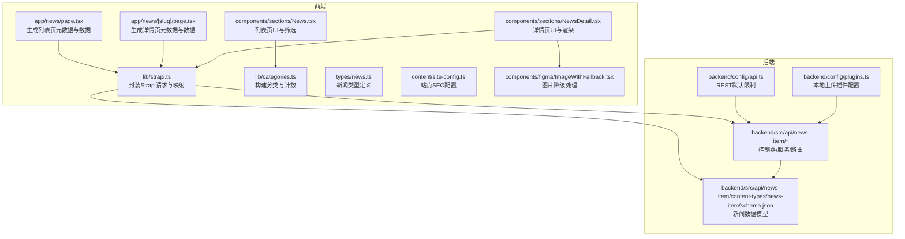
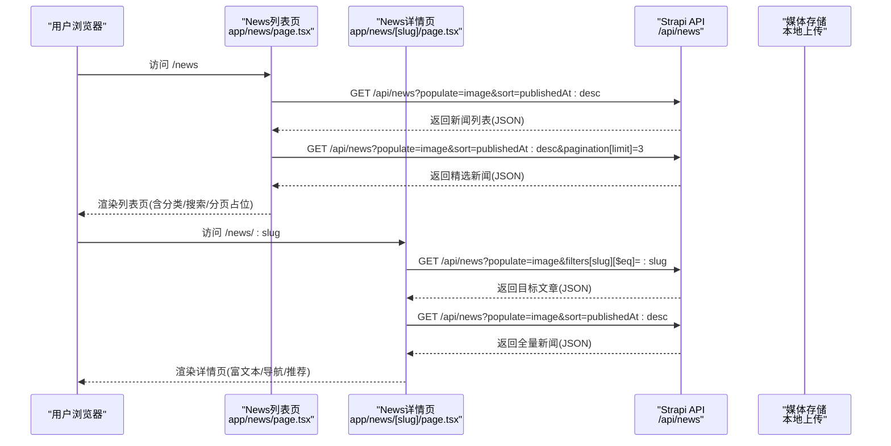
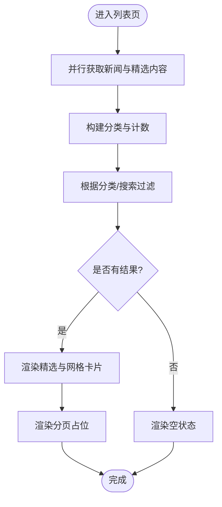
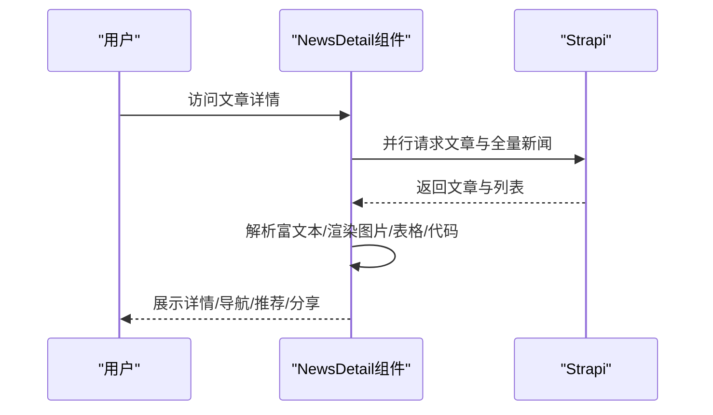
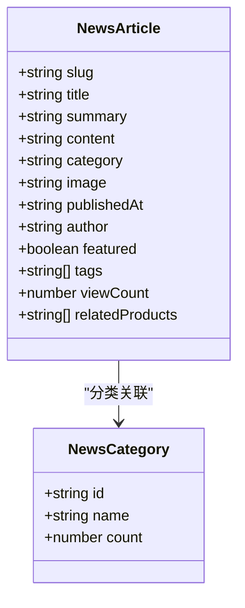
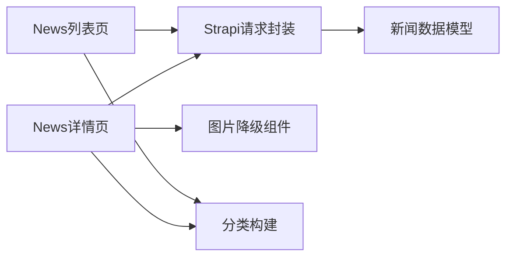

# 新闻资讯模块

<cite>
**本文引用的文件**
- [backend/src/api/news-item/controllers/news-item.ts](file://backend/src/api/news-item/controllers/news-item.ts)
- [backend/src/api/news-item/services/news-item.ts](file://backend/src/api/news-item/services/news-item.ts)
- [backend/src/api/news-item/routes/news-item.ts](file://backend/src/api/news-item/routes/news-item.ts)
- [backend/src/api/news-item/content-types/news-item/schema.json](file://backend/src/api/news-item/content-types/news-item/schema.json)
- [backend/config/api.ts](file://backend/config/api.ts)
- [backend/config/plugins.ts](file://backend/config/plugins.ts)
- [frontend/app/news/page.tsx](file://frontend/app/news/page.tsx)
- [frontend/app/news/[slug]/page.tsx](file://frontend/app/news/[slug]/page.tsx)
- [frontend/components/sections/News.tsx](file://frontend/components/sections/News.tsx)
- [frontend/components/sections/NewsDetail.tsx](file://frontend/components/sections/NewsDetail.tsx)
- [frontend/lib/strapi.ts](file://frontend/lib/strapi.ts)
- [frontend/lib/categories.ts](file://frontend/lib/categories.ts)
- [frontend/types/news.ts](file://frontend/types/news.ts)
- [frontend/content/news.ts](file://frontend/content/news.ts)
- [frontend/content/site-config.ts](file://frontend/content/site-config.ts)
- [frontend/components/figma/ImageWithFallback.tsx](file://frontend/components/figma/ImageWithFallback.tsx)
- [frontend/lib/metadata.ts](file://frontend/lib/metadata.ts)
</cite>

## 目录
1. [简介](#简介)
2. [项目结构](#项目结构)
3. [核心组件](#核心组件)
4. [架构总览](#架构总览)
5. [详细组件分析](#详细组件分析)
6. [依赖分析](#依赖分析)
7. [性能考虑](#性能考虑)
8. [故障排除指南](#故障排除指南)
9. [结论](#结论)
10. [附录](#附录)

## 简介
本文件系统性地梳理了新闻资讯模块的前端与后端实现，覆盖新闻列表与详情页面的设计与交互、新闻分类与标签体系、数据模型与媒体资源管理、SEO优化策略、响应式展示与性能优化等关键方面。目标是帮助产品、设计与开发团队全面理解模块能力与实现细节，指导后续的功能扩展与维护。

## 项目结构
新闻模块由三层组成：
- 后端（Strapi）：提供新闻内容的增删改查、媒体上传、分页与排序等接口。
- 前端（Next.js App Router）：负责页面渲染、状态管理、SEO元数据生成、图片与富文本渲染、分页与筛选逻辑。
- 工具与类型：统一封装 Strapi 请求、分类构建、类型定义与站点配置。

图表来源
- [frontend/app/news/page.tsx](file://frontend/app/news/page.tsx#L1-L31)
- [frontend/components/sections/News.tsx](file://frontend/components/sections/News.tsx#L1-L299)
- [frontend/app/news/[slug]/page.tsx](file://frontend/app/news/[slug]/page.tsx#L1-L71)
- [frontend/components/sections/NewsDetail.tsx](file://frontend/components/sections/NewsDetail.tsx#L1-L333)
- [frontend/lib/strapi.ts](file://frontend/lib/strapi.ts#L1-L155)
- [frontend/lib/categories.ts](file://frontend/lib/categories.ts#L1-L48)
- [frontend/types/news.ts](file://frontend/types/news.ts#L1-L44)
- [frontend/content/site-config.ts](file://frontend/content/site-config.ts#L1-L47)
- [frontend/components/figma/ImageWithFallback.tsx](file://frontend/components/figma/ImageWithFallback.tsx#L1-L85)
- [backend/src/api/news-item/controllers/news-item.ts](file://backend/src/api/news-item/controllers/news-item.ts#L1-L4)
- [backend/src/api/news-item/services/news-item.ts](file://backend/src/api/news-item/services/news-item.ts#L1-L4)
- [backend/src/api/news-item/routes/news-item.ts](file://backend/src/api/news-item/routes/news-item.ts#L1-L4)
- [backend/src/api/news-item/content-types/news-item/schema.json](file://backend/src/api/news-item/content-types/news-item/schema.json#L1-L65)
- [backend/config/api.ts](file://backend/config/api.ts#L1-L8)
- [backend/config/plugins.ts](file://backend/config/plugins.ts#L1-L11)

章节来源
- [frontend/app/news/page.tsx](file://frontend/app/news/page.tsx#L1-L31)
- [frontend/app/news/[slug]/page.tsx](file://frontend/app/news/[slug]/page.tsx#L1-L71)
- [frontend/components/sections/News.tsx](file://frontend/components/sections/News.tsx#L1-L299)
- [frontend/components/sections/NewsDetail.tsx](file://frontend/components/sections/NewsDetail.tsx#L1-L333)
- [frontend/lib/strapi.ts](file://frontend/lib/strapi.ts#L1-L155)
- [frontend/lib/categories.ts](file://frontend/lib/categories.ts#L1-L48)
- [frontend/types/news.ts](file://frontend/types/news.ts#L1-L44)
- [frontend/content/site-config.ts](file://frontend/content/site-config.ts#L1-L47)
- [frontend/components/figma/ImageWithFallback.tsx](file://frontend/components/figma/ImageWithFallback.tsx#L1-L85)
- [backend/src/api/news-item/controllers/news-item.ts](file://backend/src/api/news-item/controllers/news-item.ts#L1-L4)
- [backend/src/api/news-item/services/news-item.ts](file://backend/src/api/news-item/services/news-item.ts#L1-L4)
- [backend/src/api/news-item/routes/news-item.ts](file://backend/src/api/news-item/routes/news-item.ts#L1-L4)
- [backend/src/api/news-item/content-types/news-item/schema.json](file://backend/src/api/news-item/content-types/news-item/schema.json#L1-L65)
- [backend/config/api.ts](file://backend/config/api.ts#L1-L8)
- [backend/config/plugins.ts](file://backend/config/plugins.ts#L1-L11)

## 核心组件
- 新闻列表页：聚合新闻与精选内容，支持分类筛选与站内搜索，采用骨架屏与动画过渡提升体验。
- 新闻详情页：渲染富文本内容（含表格、Mermaid图、图片），提供上一篇/下一篇文章导航、相关推荐与分享入口。
- 分类与标签：基于枚举的分类与JSON标签字段，前端构建分类计数与UI展示。
- 数据模型：Strapi集合类型，包含标题、UID、摘要、富文本、枚举分类、媒体（封面/附件）、作者、置顶、标签、阅读量、关联产品等字段。
- 图片与媒体：统一的媒体URL解析与降级处理，支持本地上传与尺寸优化。
- SEO：动态生成Open Graph与Twitter卡片，支持站点默认配置与页面级覆盖。

章节来源
- [frontend/components/sections/News.tsx](file://frontend/components/sections/News.tsx#L16-L242)
- [frontend/components/sections/NewsDetail.tsx](file://frontend/components/sections/NewsDetail.tsx#L20-L319)
- [frontend/lib/categories.ts](file://frontend/lib/categories.ts#L33-L47)
- [backend/src/api/news-item/content-types/news-item/schema.json](file://backend/src/api/news-item/content-types/news-item/schema.json#L13-L62)
- [frontend/lib/strapi.ts](file://frontend/lib/strapi.ts#L78-L98)
- [frontend/components/figma/ImageWithFallback.tsx](file://frontend/components/figma/ImageWithFallback.tsx#L21-L84)
- [frontend/app/news/page.tsx](file://frontend/app/news/page.tsx#L7-L23)
- [frontend/app/news/[slug]/page.tsx](file://frontend/app/news/[slug]/page.tsx#L23-L46)

## 架构总览
前后端协作流程如下：
- 前端页面通过SSR/SSG获取数据与元数据，列表页并行拉取新闻与精选内容，详情页并行拉取文章与全量新闻用于推荐。
- Strapi提供REST接口，支持populate、filters、sort与分页，返回标准化数据结构。
- 前端统一映射为内部类型，解析媒体URL，渲染富文本与图片，构建分类与标签UI。

图表来源
- [frontend/app/news/page.tsx](file://frontend/app/news/page.tsx#L25-L30)
- [frontend/app/news/[slug]/page.tsx](file://frontend/app/news/[slug]/page.tsx#L48-L70)
- [frontend/lib/strapi.ts](file://frontend/lib/strapi.ts#L127-L154)
- [backend/config/api.ts](file://backend/config/api.ts#L2-L6)
- [backend/config/plugins.ts](file://backend/config/plugins.ts#L2-L9)

## 详细组件分析

### 新闻列表页面（News）
- 布局与交互
  - 侧边栏包含搜索框、分类过滤器与订阅卡片；主内容区展示精选文章与网格卡片。
  - 使用客户端状态管理分类与搜索查询，配合useMemo进行轻量过滤。
  - 精选文章在“全部”且无搜索时展示，其余文章网格采用动画入场与布局变化。
- 分页机制
  - 页面包含分页控件占位，当前实现为静态按钮，建议后续接入分页参数与服务端分页。
- 分类筛选与搜索
  - 分类：基于枚举值构建分类树与计数，点击切换激活态。
  - 搜索：对标题与摘要进行大小写无关匹配。
- 响应式与视觉
  - 使用Tailwind类实现响应式布局，卡片悬停缩放与过渡效果增强交互。

图表来源
- [frontend/app/news/page.tsx](file://frontend/app/news/page.tsx#L25-L30)
- [frontend/components/sections/News.tsx](file://frontend/components/sections/News.tsx#L16-L242)
- [frontend/lib/categories.ts](file://frontend/lib/categories.ts#L33-L47)

章节来源
- [frontend/components/sections/News.tsx](file://frontend/components/sections/News.tsx#L16-L242)
- [frontend/lib/categories.ts](file://frontend/lib/categories.ts#L33-L47)
- [frontend/app/news/page.tsx](file://frontend/app/news/page.tsx#L25-L30)

### 新闻详情页面（NewsDetail）
- 内容渲染
  - 使用富文本渲染器渲染Markdown，启用GFM与原始HTML，自定义组件处理图片、表格与代码块。
  - 图片组件支持尺寸与懒加载，代码块中特定语言触发可视化组件。
- 导航与推荐
  - 基于全量新闻计算上一篇/下一篇文章，详情页侧边栏提供分类与最近推荐。
- 分享与社交
  - 提供分享按钮占位，便于集成社交平台SDK或复制链接。
- SEO与结构化数据
  - 详情页动态生成Open Graph与Twitter卡片，包含发布时间、作者、标签等。

图表来源
- [frontend/app/news/[slug]/page.tsx](file://frontend/app/news/[slug]/page.tsx#L48-L70)
- [frontend/components/sections/NewsDetail.tsx](file://frontend/components/sections/NewsDetail.tsx#L20-L319)
- [frontend/lib/strapi.ts](file://frontend/lib/strapi.ts#L141-L154)

章节来源
- [frontend/components/sections/NewsDetail.tsx](file://frontend/components/sections/NewsDetail.tsx#L20-L319)
- [frontend/app/news/[slug]/page.tsx](file://frontend/app/news/[slug]/page.tsx#L23-L70)
- [frontend/lib/strapi.ts](file://frontend/lib/strapi.ts#L141-L154)

### 新闻分类系统
- 分类层级
  - 后端：枚举类型提供固定分类集合。
  - 前端：构建“全部 + 枚举项”的分类树，统计每类数量，驱动UI与筛选。
- 标签管理
  - JSON字段存储标签数组，前端用于详情页标签云与社交分享。
- 内容关联
  - 模型预留关联产品字段，可用于“相关产品”推荐或交叉内容。

图表来源
- [frontend/types/news.ts](file://frontend/types/news.ts#L16-L43)
- [frontend/lib/categories.ts](file://frontend/lib/categories.ts#L3-L15)

章节来源
- [frontend/lib/categories.ts](file://frontend/lib/categories.ts#L33-L47)
- [frontend/types/news.ts](file://frontend/types/news.ts#L3-L15)
- [backend/src/api/news-item/content-types/news-item/schema.json](file://backend/src/api/news-item/content-types/news-item/schema.json#L30-L55)

### 新闻数据模型
- 字段定义
  - 标题、UID、摘要、富文本、枚举分类、媒体（封面/附件）、作者、置顶布尔、JSON标签、整型阅读量、JSON关联产品。
- 内容格式
  - 富文本字段支持结构化内容；详情页通过渲染器输出HTML。
- 媒体资源管理
  - 媒体字段限定图片类型，支持单张封面与多图附件；前端统一解析URL并提供降级处理。

章节来源
- [backend/src/api/news-item/content-types/news-item/schema.json](file://backend/src/api/news-item/content-types/news-item/schema.json#L13-L62)
- [frontend/lib/strapi.ts](file://frontend/lib/strapi.ts#L78-L98)
- [frontend/components/figma/ImageWithFallback.tsx](file://frontend/components/figma/ImageWithFallback.tsx#L21-L84)

### SEO优化策略
- URL结构
  - 列表页：/news；详情页：/news/:slug；静态生成路由参数。
- 结构化标记
  - Open Graph与Twitter卡片动态生成，包含标题、描述、图片、发布时间、作者、标签等。
- 元数据配置
  - 站点默认配置集中管理，页面级generateMetadata覆盖默认值。
- 索引控制
  - 可通过工具函数控制robots索引策略。

章节来源
- [frontend/app/news/page.tsx](file://frontend/app/news/page.tsx#L7-L23)
- [frontend/app/news/[slug]/page.tsx](file://frontend/app/news/[slug]/page.tsx#L23-L46)
- [frontend/content/site-config.ts](file://frontend/content/site-config.ts#L21-L29)
- [frontend/lib/metadata.ts](file://frontend/lib/metadata.ts#L10-L57)

### 响应式展示与性能优化
- 响应式布局
  - 使用CSS Grid与Flex实现侧栏与主内容区的自适应排列。
- 图片优化
  - Next.js Image组件自动尺寸与懒加载；提供降级组件处理加载失败与占位。
- 加载性能
  - 列表页并行请求新闻与精选内容；详情页并行请求文章与全量新闻；服务端分页限制与媒体populate优化。
- 交互体验
  - 动画入场与布局变化，空状态提示，导航按钮与面包屑提升可用性。

章节来源
- [frontend/components/sections/News.tsx](file://frontend/components/sections/News.tsx#L76-L242)
- [frontend/components/sections/NewsDetail.tsx](file://frontend/components/sections/NewsDetail.tsx#L62-L319)
- [frontend/components/figma/ImageWithFallback.tsx](file://frontend/components/figma/ImageWithFallback.tsx#L21-L84)
- [frontend/lib/strapi.ts](file://frontend/lib/strapi.ts#L100-L111)
- [backend/config/api.ts](file://backend/config/api.ts#L2-L6)

## 依赖分析
- 组件耦合
  - 列表页与详情页均依赖Strapi请求封装与分类构建；详情页额外依赖图片降级组件。
- 外部依赖
  - 富文本渲染依赖第三方插件；媒体上传依赖本地插件配置。
- 循环依赖
  - 未发现循环导入；类型与工具文件为纯函数与常量。

图表来源
- [frontend/components/sections/News.tsx](file://frontend/components/sections/News.tsx#L1-L299)
- [frontend/components/sections/NewsDetail.tsx](file://frontend/components/sections/NewsDetail.tsx#L1-L333)
- [frontend/lib/strapi.ts](file://frontend/lib/strapi.ts#L1-L155)
- [frontend/lib/categories.ts](file://frontend/lib/categories.ts#L1-L48)
- [frontend/components/figma/ImageWithFallback.tsx](file://frontend/components/figma/ImageWithFallback.tsx#L1-L85)
- [backend/src/api/news-item/content-types/news-item/schema.json](file://backend/src/api/news-item/content-types/news-item/schema.json#L1-L65)

章节来源
- [frontend/components/sections/News.tsx](file://frontend/components/sections/News.tsx#L1-L299)
- [frontend/components/sections/NewsDetail.tsx](file://frontend/components/sections/NewsDetail.tsx#L1-L333)
- [frontend/lib/strapi.ts](file://frontend/lib/strapi.ts#L1-L155)
- [frontend/lib/categories.ts](file://frontend/lib/categories.ts#L1-L48)
- [frontend/components/figma/ImageWithFallback.tsx](file://frontend/components/figma/ImageWithFallback.tsx#L1-L85)
- [backend/src/api/news-item/content-types/news-item/schema.json](file://backend/src/api/news-item/content-types/news-item/schema.json#L1-L65)

## 性能考虑
- API层
  - REST默认限制与最大限制控制单次返回量；媒体populate按需开启。
- 前端层
  - 并行请求减少等待时间；useMemo避免重复过滤；Image组件懒加载与尺寸优化。
- 缓存与预取
  - Next.js缓存策略与revalidate配置；静态生成详情页路由参数以降低冷启动成本。

章节来源
- [backend/config/api.ts](file://backend/config/api.ts#L2-L6)
- [frontend/lib/strapi.ts](file://frontend/lib/strapi.ts#L100-L111)
- [frontend/app/news/[slug]/page.tsx](file://frontend/app/news/[slug]/page.tsx#L15-L20)

## 故障排除指南
- 图片加载失败
  - 使用降级组件显示占位与错误提示，检查媒体URL是否正确拼接。
- 详情页404
  - 若文章不存在，页面返回404；确认slug是否正确与数据库是否存在。
- 富文本渲染异常
  - 检查渲染器插件配置与自定义组件映射；确保图片URL规范化。
- 分类/搜索无结果
  - 确认分类枚举与数据一致；检查搜索关键词大小写与字段匹配逻辑。

章节来源
- [frontend/components/figma/ImageWithFallback.tsx](file://frontend/components/figma/ImageWithFallback.tsx#L34-L50)
- [frontend/app/news/[slug]/page.tsx](file://frontend/app/news/[slug]/page.tsx#L55-L57)
- [frontend/components/sections/NewsDetail.tsx](file://frontend/components/sections/NewsDetail.tsx#L323-L332)
- [frontend/lib/categories.ts](file://frontend/lib/categories.ts#L33-L47)

## 结论
新闻资讯模块在前后端协作、内容管理与用户体验之间取得了良好平衡：后端提供稳定的数据模型与REST接口，前端通过类型安全与组件化实现丰富的交互与SEO优化。建议后续完善分页参数、引入增量更新与CDN加速、扩展分享与评论能力，以进一步提升性能与可维护性。

## 附录
- 后端API配置
  - REST默认限制与最大限制，withCount开关。
  - 本地上传插件大小限制。
- 前端类型与配置
  - 新闻类型定义、站点配置、分类映射与默认数据示例。

章节来源
- [backend/config/api.ts](file://backend/config/api.ts#L1-L8)
- [backend/config/plugins.ts](file://backend/config/plugins.ts#L1-L11)
- [frontend/types/news.ts](file://frontend/types/news.ts#L1-L44)
- [frontend/content/site-config.ts](file://frontend/content/site-config.ts#L1-L47)
- [frontend/content/news.ts](file://frontend/content/news.ts#L1-L239)