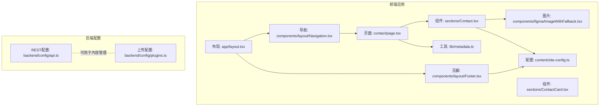
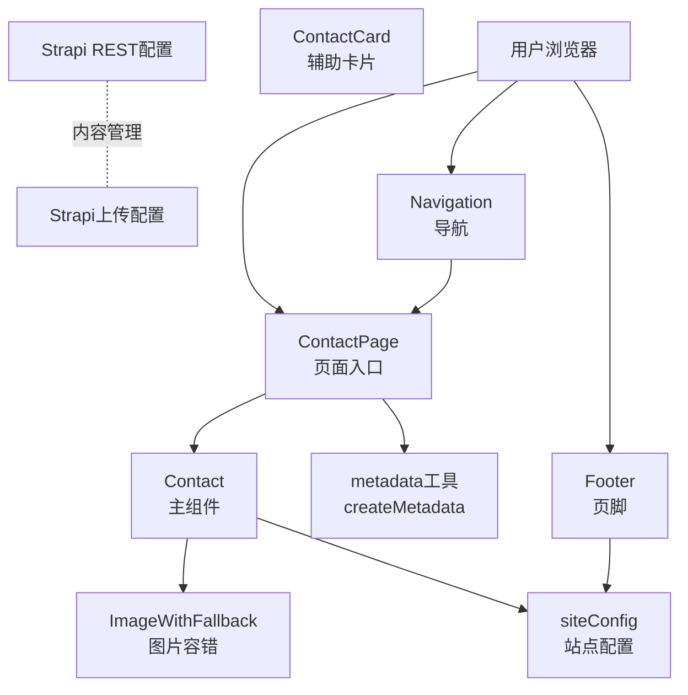
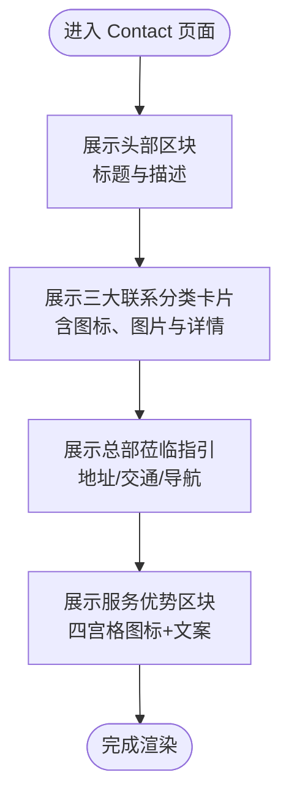
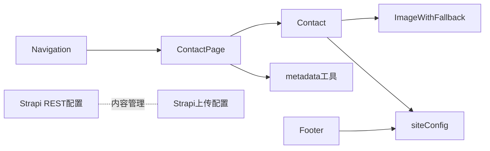

# 联系我们模块

<cite>
**本文引用的文件**
- [frontend/app/contact/page.tsx](file://frontend/app/contact/page.tsx)
- [frontend/components/sections/Contact.tsx](file://frontend/components/sections/Contact.tsx)
- [frontend/components/sections/ContactCard.tsx](file://frontend/components/sections/ContactCard.tsx)
- [frontend/content/site-config.ts](file://frontend/content/site-config.ts)
- [frontend/lib/metadata.ts](file://frontend/lib/metadata.ts)
- [frontend/app/layout.tsx](file://frontend/app/layout.tsx)
- [frontend/components/figma/ImageWithFallback.tsx](file://frontend/components/figma/ImageWithFallback.tsx)
- [frontend/components/layout/Navigation.tsx](file://frontend/components/layout/Navigation.tsx)
- [frontend/components/layout/Footer.tsx](file://frontend/components/layout/Footer.tsx)
- [backend/config/api.ts](file://backend/config/api.ts)
- [backend/config/plugins.ts](file://backend/config/plugins.ts)
</cite>

## 目录
1. [简介](#简介)
2. [项目结构](#项目结构)
3. [核心组件](#核心组件)
4. [架构总览](#架构总览)
5. [详细组件分析](#详细组件分析)
6. [依赖关系分析](#依赖关系分析)
7. [性能考量](#性能考量)
8. [故障排除指南](#故障排除指南)
9. [结论](#结论)
10. [附录](#附录)

## 简介
本文件系统性梳理“联系我们”模块的实现，覆盖联系页面设计、联系信息展示、地图与导航集成、在线联系表单设计、数据模型与SEO优化策略，并提供响应式布局与用户体验优化建议。当前仓库中“联系我们”页面由前端Next.js应用提供静态展示，未包含后端联系表单提交逻辑；地图与表单交互能力需在现有基础上扩展。

## 项目结构
“联系我们”模块位于前端Next.js应用中，采用页面级路由与组件化展示相结合的方式组织：
- 页面入口：frontend/app/contact/page.tsx
- 页面主体：frontend/components/sections/Contact.tsx
- 辅助卡片组件：frontend/components/sections/ContactCard.tsx
- 全局站点配置：frontend/content/site-config.ts
- SEO元数据工具：frontend/lib/metadata.ts
- 布局与导航/页脚：frontend/app/layout.tsx、frontend/components/layout/Navigation.tsx、frontend/components/layout/Footer.tsx
- 图片容错组件：frontend/components/figma/ImageWithFallback.tsx
- 后端配置（与联系模块间接相关）：backend/config/api.ts、backend/config/plugins.ts

图表来源
- [frontend/app/contact/page.tsx](file://frontend/app/contact/page.tsx#L1-L18)
- [frontend/components/sections/Contact.tsx](file://frontend/components/sections/Contact.tsx#L1-L254)
- [frontend/components/sections/ContactCard.tsx](file://frontend/components/sections/ContactCard.tsx#L1-L39)
- [frontend/content/site-config.ts](file://frontend/content/site-config.ts#L1-L47)
- [frontend/lib/metadata.ts](file://frontend/lib/metadata.ts#L1-L60)
- [frontend/app/layout.tsx](file://frontend/app/layout.tsx#L1-L83)
- [frontend/components/layout/Navigation.tsx](file://frontend/components/layout/Navigation.tsx#L1-L126)
- [frontend/components/layout/Footer.tsx](file://frontend/components/layout/Footer.tsx#L1-L208)
- [frontend/components/figma/ImageWithFallback.tsx](file://frontend/components/figma/ImageWithFallback.tsx#L1-L85)
- [backend/config/api.ts](file://backend/config/api.ts#L1-L8)
- [backend/config/plugins.ts](file://backend/config/plugins.ts#L1-L11)

章节来源
- [frontend/app/contact/page.tsx](file://frontend/app/contact/page.tsx#L1-L18)
- [frontend/components/sections/Contact.tsx](file://frontend/components/sections/Contact.tsx#L1-L254)
- [frontend/content/site-config.ts](file://frontend/content/site-config.ts#L1-L47)
- [frontend/lib/metadata.ts](file://frontend/lib/metadata.ts#L1-L60)
- [frontend/app/layout.tsx](file://frontend/app/layout.tsx#L1-L83)
- [frontend/components/layout/Navigation.tsx](file://frontend/components/layout/Navigation.tsx#L1-L126)
- [frontend/components/layout/Footer.tsx](file://frontend/components/layout/Footer.tsx#L1-L208)
- [frontend/components/figma/ImageWithFallback.tsx](file://frontend/components/figma/ImageWithFallback.tsx#L1-L85)
- [backend/config/api.ts](file://backend/config/api.ts#L1-L8)
- [backend/config/plugins.ts](file://backend/config/plugins.ts#L1-L11)

## 核心组件
- 页面组件 ContactPage：负责设置页面元数据与渲染 Contact 主体组件。
- 主体组件 Contact：负责联系信息分组展示、总部指引、服务优势等区块的组织与样式。
- 卡片组件 ContactCard：用于在其他页面中提供“联系技术支持”的快捷入口。
- 站点配置 siteConfig：集中管理品牌名称、联系方式、SEO默认值等。
- SEO工具 createMetadata：统一生成OG/Twitter等社交分享元数据。
- 布局与导航/页脚：提供全局导航、页脚联系信息展示，增强可发现性。
- 图片容错组件 ImageWithFallback：提升图片加载失败时的用户体验。

章节来源
- [frontend/app/contact/page.tsx](file://frontend/app/contact/page.tsx#L1-L18)
- [frontend/components/sections/Contact.tsx](file://frontend/components/sections/Contact.tsx#L1-L254)
- [frontend/components/sections/ContactCard.tsx](file://frontend/components/sections/ContactCard.tsx#L1-L39)
- [frontend/content/site-config.ts](file://frontend/content/site-config.ts#L1-L47)
- [frontend/lib/metadata.ts](file://frontend/lib/metadata.ts#L1-L60)
- [frontend/components/layout/Navigation.tsx](file://frontend/components/layout/Navigation.tsx#L1-L126)
- [frontend/components/layout/Footer.tsx](file://frontend/components/layout/Footer.tsx#L1-L208)
- [frontend/components/figma/ImageWithFallback.tsx](file://frontend/components/figma/ImageWithFallback.tsx#L1-L85)

## 架构总览
“联系我们”模块采用前后端分离架构：
- 前端Next.js应用负责页面渲染、交互与SEO优化。
- 后端Strapi CMS提供内容管理能力（与联系模块直接相关的API与上传配置）。
- 联系页面通过静态数据与图片资源完成展示；若需在线表单提交，可在现有基础上扩展后端API或第三方表单服务。

图表来源
- [frontend/app/contact/page.tsx](file://frontend/app/contact/page.tsx#L1-L18)
- [frontend/components/sections/Contact.tsx](file://frontend/components/sections/Contact.tsx#L1-L254)
- [frontend/components/sections/ContactCard.tsx](file://frontend/components/sections/ContactCard.tsx#L1-L39)
- [frontend/content/site-config.ts](file://frontend/content/site-config.ts#L1-L47)
- [frontend/lib/metadata.ts](file://frontend/lib/metadata.ts#L1-L60)
- [frontend/components/layout/Navigation.tsx](file://frontend/components/layout/Navigation.tsx#L1-L126)
- [frontend/components/layout/Footer.tsx](file://frontend/components/layout/Footer.tsx#L1-L208)
- [frontend/components/figma/ImageWithFallback.tsx](file://frontend/components/figma/ImageWithFallback.tsx#L1-L85)
- [backend/config/api.ts](file://backend/config/api.ts#L1-L8)
- [backend/config/plugins.ts](file://backend/config/plugins.ts#L1-L11)

## 详细组件分析

### 页面入口 ContactPage
- 功能职责：设置页面标题、描述与Open Graph元数据，渲染 Contact 组件。
- 关键点：使用 siteConfig.name 动态拼接标题；Open Graph类型为website，便于社交分享。

章节来源
- [frontend/app/contact/page.tsx](file://frontend/app/contact/page.tsx#L1-L18)
- [frontend/content/site-config.ts](file://frontend/content/site-config.ts#L1-L47)

### 主体组件 Contact
- 设计要点：
  - 分类卡片：按“商务合作/技术支持/综合事务”三类展示联系方式与简述，每类配图标、图片与详情列表。
  - 总部指引：展示地址、公共交通与自驾导航提示，右侧配总部照片与开放时间提示。
  - 服务优势：以四宫格形式突出响应速度、专家驻场、终身维护、原厂质保等优势。
  - 视觉风格：深蓝背景、金色点缀，配合渐变与动态背景元素，营造专业与科技感。
- 交互与动画：使用motion/react实现入场动画，增强视觉层次。
- 图片处理：通过 ImageWithFallback 提升图片加载失败时的可用性。

图表来源
- [frontend/components/sections/Contact.tsx](file://frontend/components/sections/Contact.tsx#L47-L254)
- [frontend/components/figma/ImageWithFallback.tsx](file://frontend/components/figma/ImageWithFallback.tsx#L1-L85)

章节来源
- [frontend/components/sections/Contact.tsx](file://frontend/components/sections/Contact.tsx#L1-L254)
- [frontend/components/figma/ImageWithFallback.tsx](file://frontend/components/figma/ImageWithFallback.tsx#L1-L85)

### 卡片组件 ContactCard
- 设计用途：在其他页面中提供“联系技术支持”的快捷入口，包含标题、描述、按钮与电话。
- 交互行为：按钮链接至 /contact；电话支持点击拨号。

章节来源
- [frontend/components/sections/ContactCard.tsx](file://frontend/components/sections/ContactCard.tsx#L1-L39)

### 站点配置 siteConfig
- 内容范围：品牌名称、全称、标语、描述、联系方式（电话/邮箱/地址）、品牌色彩、SEO默认值、社交媒体、版权信息。
- 作用：为页面与组件提供统一的品牌与联系信息数据源，避免硬编码。

章节来源
- [frontend/content/site-config.ts](file://frontend/content/site-config.ts#L1-L47)

### SEO工具 createMetadata
- 功能：根据传入的title/description/image生成统一的Meta标签，包含Open Graph与Twitter卡片配置。
- 应用：ContactPage 使用该工具生成页面级元数据，提升社交分享效果。

章节来源
- [frontend/lib/metadata.ts](file://frontend/lib/metadata.ts#L1-L60)

### 布局与导航/页脚
- 布局：RootLayout 设置全局SEO基础、主题色与viewport，保证跨页面一致性。
- 导航：在桌面端与移动端均提供“立即咨询”入口，引导用户访问联系页面。
- 页脚：展示服务热线、邮箱与地址，强化联系信息的可见性与可点击性。

章节来源
- [frontend/app/layout.tsx](file://frontend/app/layout.tsx#L1-L83)
- [frontend/components/layout/Navigation.tsx](file://frontend/components/layout/Navigation.tsx#L1-L126)
- [frontend/components/layout/Footer.tsx](file://frontend/components/layout/Footer.tsx#L1-L208)

### 图片容错组件 ImageWithFallback
- 功能：在图片加载失败时回退到占位图，减少空白与布局抖动。
- 实现：监听onError事件，切换到错误占位图；对dataURL与blob做特殊处理。

章节来源
- [frontend/components/figma/ImageWithFallback.tsx](file://frontend/components/figma/ImageWithFallback.tsx#L1-L85)

## 依赖关系分析
- 页面到组件：ContactPage 依赖 Contact；Contact 依赖 ImageWithFallback 与 siteConfig。
- SEO：ContactPage 依赖 metadata 工具；RootLayout 提供全局SEO基础。
- 导航与页脚：Navigation/ Footer 依赖 siteConfig，增强联系信息的全局可见性。
- 后端：backend/config/api.ts 与 backend/config/plugins.ts 为内容管理与上传提供基础配置，与联系模块间接关联。

图表来源
- [frontend/app/contact/page.tsx](file://frontend/app/contact/page.tsx#L1-L18)
- [frontend/components/sections/Contact.tsx](file://frontend/components/sections/Contact.tsx#L1-L254)
- [frontend/components/figma/ImageWithFallback.tsx](file://frontend/components/figma/ImageWithFallback.tsx#L1-L85)
- [frontend/content/site-config.ts](file://frontend/content/site-config.ts#L1-L47)
- [frontend/lib/metadata.ts](file://frontend/lib/metadata.ts#L1-L60)
- [frontend/components/layout/Navigation.tsx](file://frontend/components/layout/Navigation.tsx#L1-L126)
- [frontend/components/layout/Footer.tsx](file://frontend/components/layout/Footer.tsx#L1-L208)
- [backend/config/api.ts](file://backend/config/api.ts#L1-L8)
- [backend/config/plugins.ts](file://backend/config/plugins.ts#L1-L11)

章节来源
- [frontend/app/contact/page.tsx](file://frontend/app/contact/page.tsx#L1-L18)
- [frontend/components/sections/Contact.tsx](file://frontend/components/sections/Contact.tsx#L1-L254)
- [frontend/content/site-config.ts](file://frontend/content/site-config.ts#L1-L47)
- [frontend/lib/metadata.ts](file://frontend/lib/metadata.ts#L1-L60)
- [frontend/components/layout/Navigation.tsx](file://frontend/components/layout/Navigation.tsx#L1-L126)
- [frontend/components/layout/Footer.tsx](file://frontend/components/layout/Footer.tsx#L1-L208)
- [backend/config/api.ts](file://backend/config/api.ts#L1-L8)
- [backend/config/plugins.ts](file://backend/config/plugins.ts#L1-L11)

## 性能考量
- 图片优化：使用 Next.js Image 并结合 ImageWithFallback，在保证加载性能的同时提升失败兜底体验。
- 动画与滚动：motion/react 的入场动画应合理控制延迟与触发阈值，避免首屏阻塞。
- SEO与社交分享：统一的元数据生成有助于搜索引擎抓取与社交传播，降低重复请求成本。
- 响应式设计：组件已采用网格与弹性布局，建议在移动端进一步压缩图片体积与减少不必要的阴影/渐变层叠。

## 故障排除指南
- 图片不显示或布局抖动
  - 检查图片路径是否正确，确认 ImageWithFallback 是否被调用。
  - 确认图片尺寸与fill属性使用是否合理。
- 联系信息未更新
  - 确认 siteConfig 中联系方式字段是否正确，组件是否从该配置读取。
- 社交分享异常
  - 检查 createMetadata 生成的OG/Twitter参数是否完整，图片尺寸与URL是否有效。
- 移动端交互问题
  - 检查 Navigation 的移动端菜单开关状态与点击事件绑定。

章节来源
- [frontend/components/figma/ImageWithFallback.tsx](file://frontend/components/figma/ImageWithFallback.tsx#L1-L85)
- [frontend/content/site-config.ts](file://frontend/content/site-config.ts#L1-L47)
- [frontend/lib/metadata.ts](file://frontend/lib/metadata.ts#L1-L60)
- [frontend/components/layout/Navigation.tsx](file://frontend/components/layout/Navigation.tsx#L1-L126)

## 结论
“联系我们”模块通过清晰的页面结构、统一的站点配置与SEO工具，实现了专业、易发现的企业联系信息展示。现有实现强调视觉体验与信息层级，建议后续在以下方面持续优化：
- 在线联系表单：新增表单字段、校验规则与提交处理流程，确保用户输入质量与隐私安全。
- 地图与导航：接入地图API（如高德/百度），实现总部位置标记、路线导航与周边设施展示。
- 数据模型：定义联系信息的数据模型（如地理位置、时区、多语言），支撑多站点或多语言部署。
- SEO与信任度：完善本地SEO（结构化数据、联系信息schema、品牌一致性），提升搜索可见性与用户信任。

## 附录

### 联系信息数据模型设计建议
- 字段建议
  - 基础信息：公司名称、全称、标语、描述
  - 联系方式：电话、邮箱、地址、传真
  - 地理位置：纬度、经度、时区、行政区划
  - 营业时间：工作日/节假日开放时间、法定节假日说明
  - 服务类别：商务合作、技术支持、综合事务等分类与对应联系方式
  - 媒体与社交：微信公众号、LinkedIn、GitHub等
  - 法律与版权：ICP备案号、版权归属、隐私政策链接
- 复杂度与性能
  - 查询复杂度：按分类检索 O(n)，按地理位置检索可引入索引优化
  - 缓存策略：热点联系信息可缓存于CDN或应用层缓存
- 错误处理
  - 地址解析失败、时区计算异常、图片加载失败等场景需有降级策略

### SEO优化策略
- 结构化数据：为联系信息添加schema.org的Organization/LocalBusiness类型，包含电话、email、address、openingHours等。
- 本地SEO：在地址中明确省市区，提供营业时间与地图链接，增强本地搜索可见性。
- 可见性与信任度：在页脚与导航中重复展示关键联系信息，使用可点击的电话/邮件链接，提升转化率与信任度。
- 元数据：统一使用 createMetadata 生成OG与Twitter卡片，确保分享一致性。

### 响应式与用户体验
- 响应式展示：在小屏设备上优先展示关键联系信息，折叠次要细节；移动端使用大触控目标。
- 表单体验：在线表单采用必填星标、实时校验、错误提示与提交反馈，减少用户认知负担。
- 地图体验：在移动端提供“获取路线”与“查看周边”入口，避免遮挡主要内容。