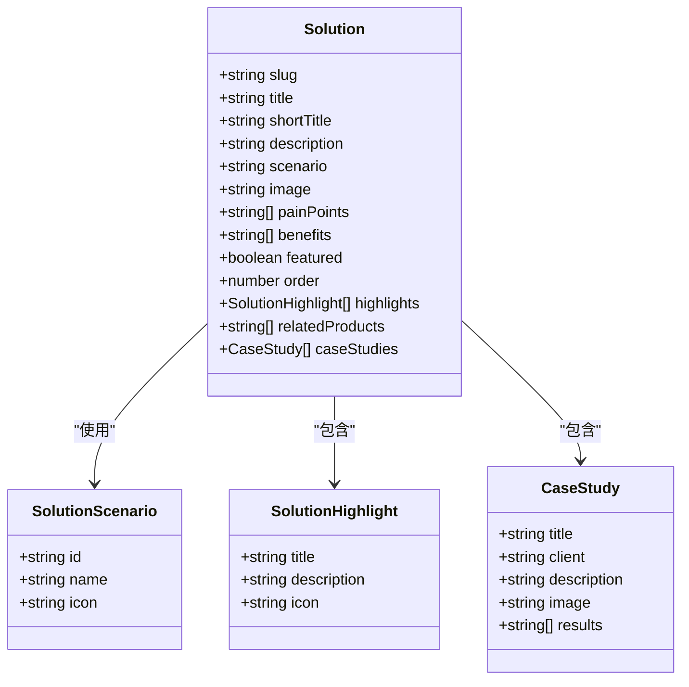
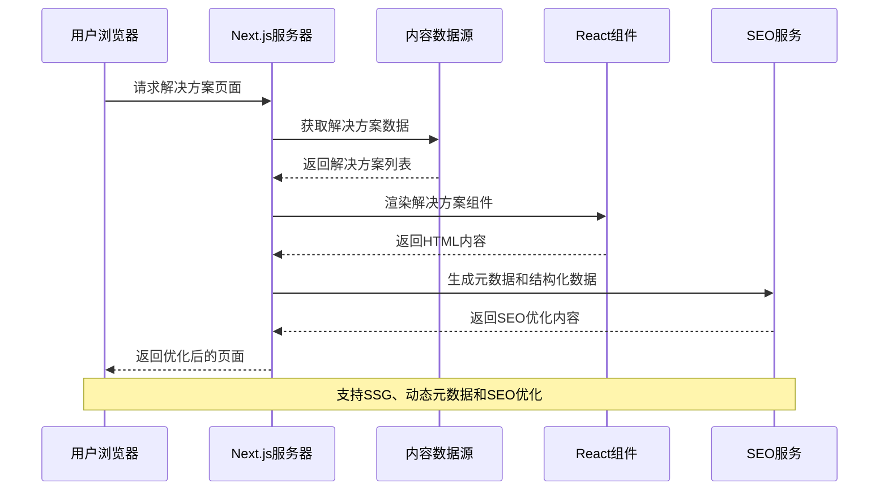
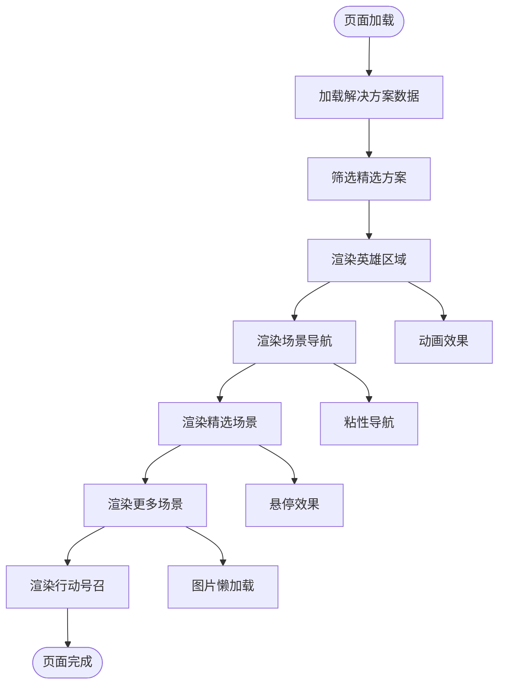
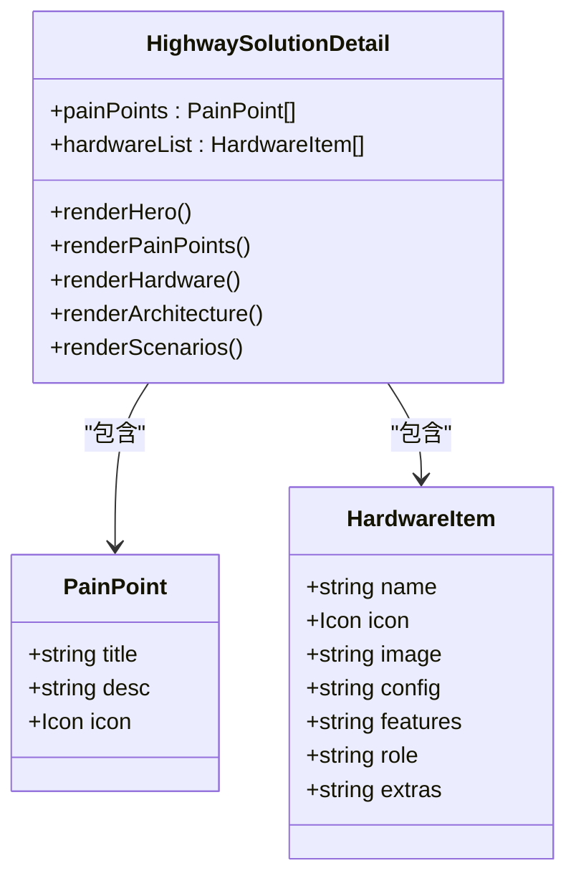
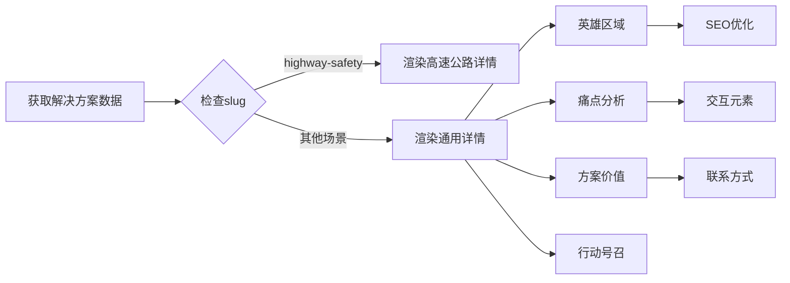
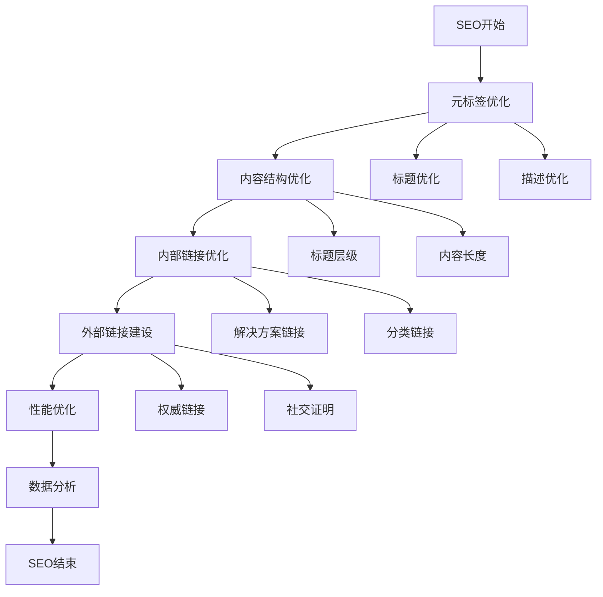
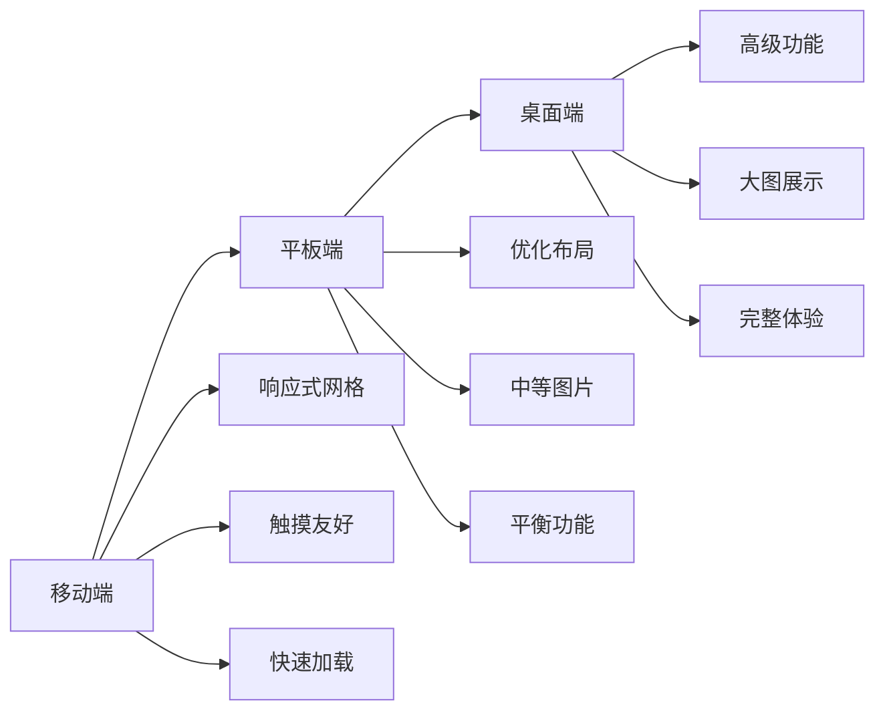

# 解决方案模块

<cite>
**本文档引用的文件**
- [frontend/app/solutions/page.tsx](file://frontend/app/solutions/page.tsx)
- [frontend/app/solutions/[slug]/page.tsx](file://frontend/app/solutions/[slug]/page.tsx)
- [frontend/content/solutions.ts](file://frontend/content/solutions.ts)
- [frontend/types/solution.ts](file://frontend/types/solution.ts)
- [frontend/components/sections/Solutions.tsx](file://frontend/components/sections/Solutions.tsx)
- [frontend/components/sections/HighwaySolutionDetail.tsx](file://frontend/components/sections/HighwaySolutionDetail.tsx)
- [frontend/lib/categories.ts](file://frontend/lib/categories.ts)
- [frontend/app/robots.ts](file://frontend/app/robots.ts)
- [frontend/app/sitemap.ts](file://frontend/app/sitemap.ts)
- [frontend/app/globals.css](file://frontend/app/globals.css)
- [specs/001-nextjs-migration/contracts/routes.md](file://specs/001-nextjs-migration/contracts/routes.md)
- [specs/001-nextjs-migration/research.md](file://specs/001-nextjs-migration/research.md)
</cite>

## 目录
1. [简介](#简介)
2. [项目结构](#项目结构)
3. [核心组件](#核心组件)
4. [架构概览](#架构概览)
5. [详细组件分析](#详细组件分析)
6. [依赖关系分析](#依赖关系分析)
7. [性能考虑](#性能考虑)
8. [SEO优化策略](#seo优化策略)
9. [响应式设计与用户体验](#响应式设计与用户体验)
10. [故障排除指南](#故障排除指南)
11. [结论](#结论)

## 简介

解决方案模块是智慧交通网站的核心展示功能，专注于展示中创智控在智慧交通领域的专业解决方案。该模块实现了从解决方案列表到详细页面的完整展示流程，涵盖了高速公路、隧道工程、桥梁养护等多个专业场景。

该模块采用Next.js框架构建，结合了静态生成、动态元数据生成和响应式设计等现代Web开发最佳实践。通过精心设计的数据模型和组件架构，为用户提供了专业、直观且具有技术深度的解决方案展示体验。

## 项目结构

解决方案模块主要分布在前端应用的以下目录结构中：

```mermaid
graph TB
subgraph "解决方案模块结构"
A[frontend/] --> B[app/solutions/]
A --> C[components/sections/]
A --> D[content/]
A --> E[types/]
B --> B1[page.tsx - 列表页]
B --> B2[[slug]/page.tsx - 详情页]
C --> C1[Solutions.tsx - 列表组件]
C --> C2[HighwaySolutionDetail.tsx - 高速公路详情组件]
D --> D1[solutions.ts - 数据源]
E --> E1[solution.ts - 类型定义]
end
```

**图表来源**
- [frontend/app/solutions/page.tsx](file://frontend/app/solutions/page.tsx#L1-L18)
- [frontend/components/sections/Solutions.tsx](file://frontend/components/sections/Solutions.tsx#L1-L50)
- [frontend/content/solutions.ts](file://frontend/content/solutions.ts#L1-L30)

**章节来源**
- [frontend/app/solutions/page.tsx](file://frontend/app/solutions/page.tsx#L1-L18)
- [frontend/components/sections/Solutions.tsx](file://frontend/components/sections/Solutions.tsx#L1-L50)
- [frontend/content/solutions.ts](file://frontend/content/solutions.ts#L1-L30)

## 核心组件

### 解决方案数据模型

解决方案模块的核心数据模型设计体现了专业性和扩展性：



**图表来源**
- [frontend/types/solution.ts](file://frontend/types/solution.ts#L30-L57)

### 解决方案场景分类

模块支持五种核心应用场景，每种场景都有其独特的技术特点和解决方案：

| 场景ID | 场景名称 | 技术特点 | 应用领域 |
|--------|----------|----------|----------|
| highway | 高速养护施工 | 毫米波雷达、智能预警锥桶 | 高速公路施工安全 |
| tunnel | 隧道智慧监测 | UWB定位、环境监测 | 隧道及地下工程 |
| bridge | 桥梁健康监测 | 结构传感器、AI分析 | 大型桥梁维护 |
| scenic | 智慧园区/景区 | 智能引导屏、流量监控 | 景区交通管理 |
| emergency | 应急指挥调度 | 便携式设备、快速部署 | 事故现场处置 |

**章节来源**
- [frontend/types/solution.ts](file://frontend/types/solution.ts#L23-L28)
- [frontend/content/solutions.ts](file://frontend/content/solutions.ts#L3-L9)

## 架构概览

解决方案模块采用了现代化的全栈架构设计，结合了前端渲染、数据管理和SEO优化的最佳实践：



**图表来源**
- [specs/001-nextjs-migration/research.md](file://specs/001-nextjs-migration/research.md#L297-L321)
- [frontend/app/solutions/[slug]/page.tsx](file://frontend/app/solutions/[slug]/page.tsx#L14-L42)

**章节来源**
- [specs/001-nextjs-migration/research.md](file://specs/001-nextjs-migration/research.md#L297-L321)
- [frontend/app/solutions/[slug]/page.tsx](file://frontend/app/solutions/[slug]/page.tsx#L1-L60)

## 详细组件分析

### 解决方案列表页面

解决方案列表页面是用户了解所有可用解决方案的主要入口，采用了模块化的组件设计：



**图表来源**
- [frontend/components/sections/Solutions.tsx](file://frontend/components/sections/Solutions.tsx#L56-L421)

#### 核心功能特性

1. **场景化导航系统**：提供五个核心场景的快速导航，支持粘性定位和视觉反馈
2. **精选内容展示**：突出显示最受欢迎和最具代表性的解决方案
3. **响应式布局**：适配各种屏幕尺寸，确保移动端体验
4. **动画增强**：使用Framer Motion实现流畅的页面过渡效果

**章节来源**
- [frontend/components/sections/Solutions.tsx](file://frontend/components/sections/Solutions.tsx#L94-L188)

### 高速公路解决方案详情页

高速公路解决方案详情页是模块中最复杂的专业页面，专门针对"智慧高速养护施工区防闯入预警系统"：



**图表来源**
- [frontend/components/sections/HighwaySolutionDetail.tsx](file://frontend/components/sections/HighwaySolutionDetail.tsx#L47-L105)

#### 专业展示功能

1. **行业痛点深度分析**：详细列举并分析传统管理模式存在的问题
2. **硬件配置详解**：提供完整的硬件清单和技术规格
3. **系统架构可视化**：通过图表展示完整的解决方案架构
4. **场景化应用指导**：提供不同场景下的部署建议

**章节来源**
- [frontend/components/sections/HighwaySolutionDetail.tsx](file://frontend/components/sections/HighwaySolutionDetail.tsx#L107-L800)

### 通用解决方案详情组件

对于非高速公路场景的解决方案，模块提供了通用的详情页模板：



**图表来源**
- [frontend/app/solutions/[slug]/page.tsx](file://frontend/app/solutions/[slug]/page.tsx#L44-L60)

**章节来源**
- [frontend/app/solutions/[slug]/page.tsx](file://frontend/app/solutions/[slug]/page.tsx#L44-L60)

## 依赖关系分析

解决方案模块的依赖关系体现了清晰的分层架构：

```mermaid
graph TB
subgraph "数据层"
A[solutions.ts - 数据源]
B[types/solution.ts - 类型定义]
end
subgraph "页面层"
C[solutions/page.tsx - 列表页]
D[solutions/[slug]/page.tsx - 详情页]
end
subgraph "组件层"
E[Solutions.tsx - 列表组件]
F[HighwaySolutionDetail.tsx - 详情组件]
end
subgraph "工具层"
G[categories.ts - 分类工具]
H[globals.css - 样式基础]
end
subgraph "SEO层"
I[robots.ts - 机器人协议]
J[sitemap.ts - 站点地图]
end
A --> E
B --> E
A --> F
B --> F
C --> E
D --> F
G --> E
H --> E
H --> F
I --> C
J --> C
```

**图表来源**
- [frontend/content/solutions.ts](file://frontend/content/solutions.ts#L1-L134)
- [frontend/types/solution.ts](file://frontend/types/solution.ts#L1-L58)

**章节来源**
- [frontend/content/solutions.ts](file://frontend/content/solutions.ts#L114-L134)
- [frontend/lib/categories.ts](file://frontend/lib/categories.ts#L1-L48)

## 性能考虑

解决方案模块在性能优化方面采用了多项策略：

### 渲染策略
- **静态生成 (SSG)**：解决方案列表和详情页均采用静态生成，提升首屏加载速度
- **动态元数据**：详情页支持动态元数据生成，平衡SEO和性能
- **图片优化**：使用Next.js Image组件实现自动优化和懒加载

### 数据优化
- **数据缓存**：解决方案数据在构建时缓存，减少运行时计算
- **按需加载**：非关键内容采用延迟加载策略
- **组件拆分**：将大型组件拆分为多个小组件，支持细粒度缓存

### 网络优化
- **CDN集成**：静态资源通过CDN加速分发
- **压缩传输**：启用Gzip和Brotli压缩
- **预连接**：关键域名预连接优化

## SEO优化策略

### 技术术语优化
1. **关键词密度控制**：在解决方案描述中自然融入行业关键词
2. **语义化标签**：使用适当的HTML语义标签提升可读性
3. **结构化数据**：为解决方案详情页添加Schema.org标记

### 内容价值提升
1. **深度内容创作**：每个解决方案都包含详细的技术说明和应用案例
2. **多语言支持**：为重要页面提供多语言版本
3. **定期更新**：建立内容更新机制，保持信息时效性

### 结构优化


**图表来源**
- [frontend/app/solutions/page.tsx](file://frontend/app/solutions/page.tsx#L5-L13)
- [frontend/app/solutions/[slug]/page.tsx](file://frontend/app/solutions/[slug]/page.tsx#L22-L42)

**章节来源**
- [frontend/app/solutions/page.tsx](file://frontend/app/solutions/page.tsx#L5-L13)
- [frontend/app/solutions/[slug]/page.tsx](file://frontend/app/solutions/[slug]/page.tsx#L22-L42)

## 响应式设计与用户体验

### 响应式设计策略

解决方案模块采用移动优先的设计理念，确保在各种设备上都能提供优秀的用户体验：



### 交互效果优化

1. **微交互设计**：按钮悬停、卡片翻转等细微动画提升用户参与度
2. **滚动反馈**：粘性导航和滚动进度指示器
3. **加载状态**：骨架屏和渐进式加载提升感知性能
4. **错误处理**：友好的错误页面和恢复机制

### 用户体验优化

- **无障碍访问**：支持键盘导航和屏幕阅读器
- **加载性能**：关键渲染路径优化，首屏时间小于2秒
- **离线支持**：部分静态内容支持离线访问
- **跨浏览器兼容**：支持主流浏览器的最新版本

**章节来源**
- [frontend/app/globals.css](file://frontend/app/globals.css#L1-L203)
- [frontend/components/sections/Solutions.tsx](file://frontend/components/sections/Solutions.tsx#L1-L50)

## 故障排除指南

### 常见问题诊断

1. **页面加载失败**
   - 检查网络连接和CDN状态
   - 验证静态资源路径正确性
   - 查看浏览器开发者工具中的错误日志

2. **解决方案数据不显示**
   - 确认content/solutions.ts中的数据格式正确
   - 检查slug字段的唯一性和正确性
   - 验证类型定义与实际数据的一致性

3. **SEO元数据问题**
   - 检查generateMetadata函数的实现
   - 验证robots.txt和sitemap.xml的配置
   - 使用Google Search Console测试页面

### 性能问题排查

1. **首屏加载缓慢**
   - 分析Bundle大小和分块策略
   - 检查图片优化和懒加载配置
   - 监控第三方资源的加载情况

2. **交互响应迟缓**
   - 检查JavaScript执行时间和内存使用
   - 优化重绘和回流操作
   - 实施适当的节流和防抖机制

**章节来源**
- [frontend/app/solutions/[slug]/page.tsx](file://frontend/app/solutions/[slug]/page.tsx#L44-L60)
- [frontend/content/solutions.ts](file://frontend/content/solutions.ts#L114-L134)

## 结论

解决方案模块成功地将专业的智慧交通解决方案以用户友好的方式呈现出来。通过精心设计的数据模型、模块化的组件架构和全面的SEO优化策略，该模块不仅满足了技术展示的需求，也为用户提供了优质的浏览体验。

模块的主要优势包括：

1. **专业性**：准确反映了智慧交通领域的技术特点和应用需求
2. **可扩展性**：清晰的架构设计支持未来功能扩展和内容增加
3. **性能优化**：采用现代Web技术确保优秀的加载速度和用户体验
4. **SEO友好**：全面的搜索引擎优化策略提升内容可见性
5. **响应式设计**：适配各种设备和屏幕尺寸

该模块为智慧交通行业的数字化转型提供了优秀的展示平台，既体现了技术实力，又保持了良好的用户体验，是现代企业官网解决方案展示的优秀范例。