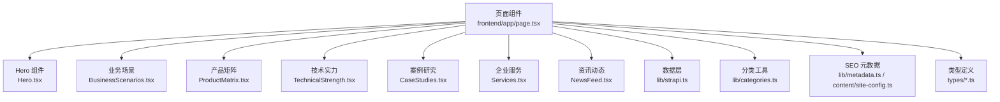
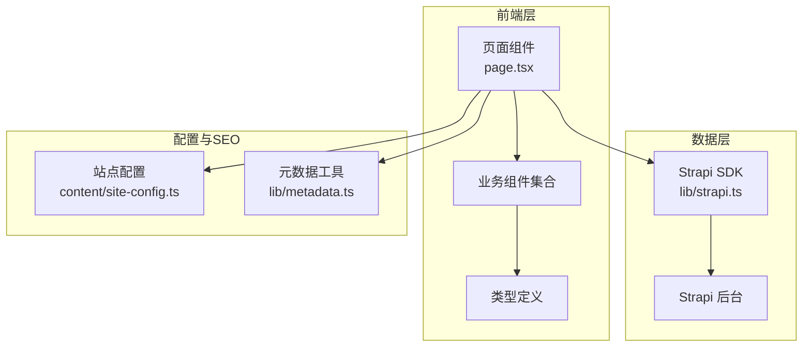
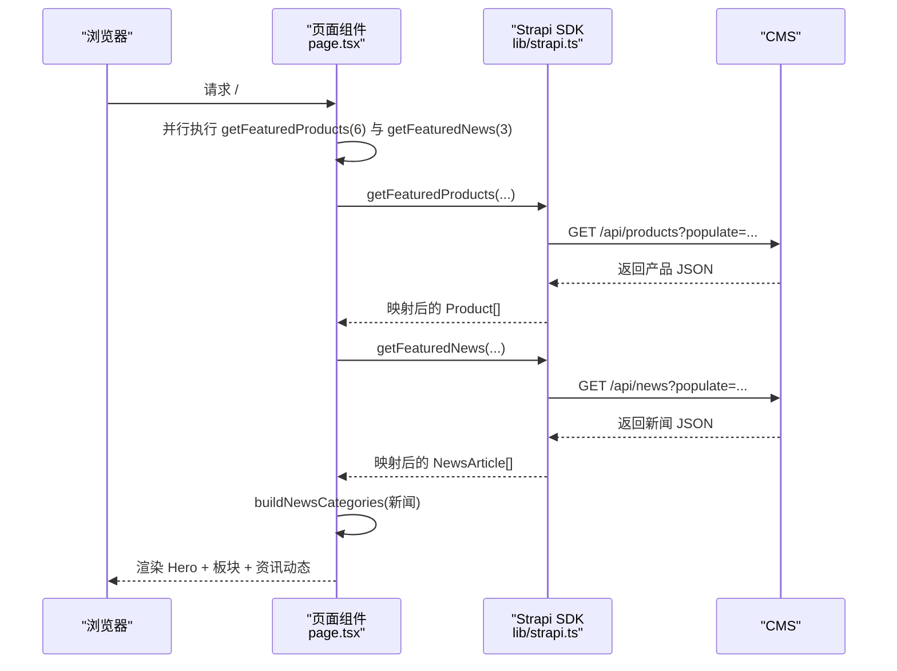
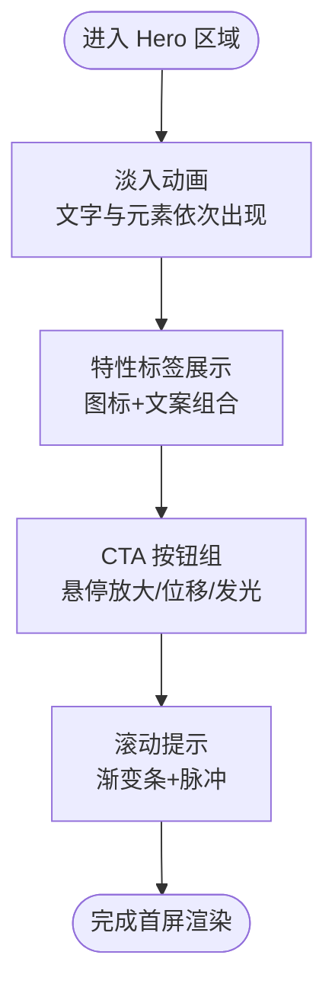
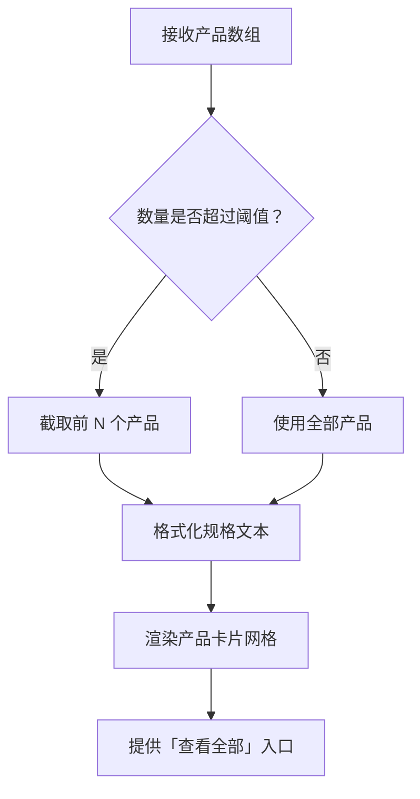
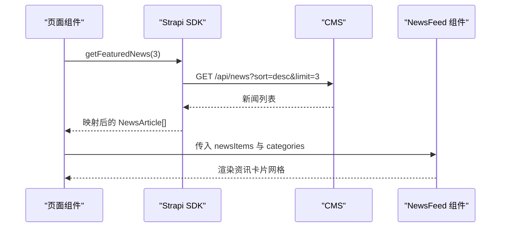
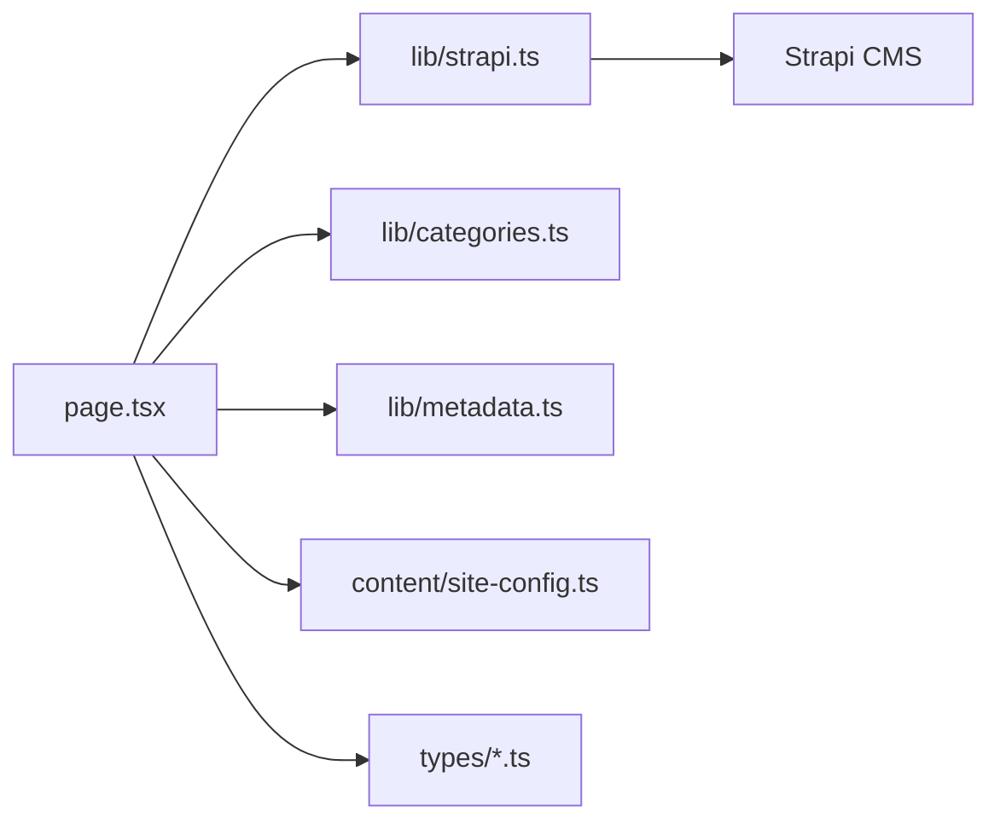

# 首页模块

<cite>
**本文引用的文件**
- [frontend/app/page.tsx](file://frontend/app/page.tsx)
- [frontend/components/sections/Hero.tsx](file://frontend/components/sections/Hero.tsx)
- [frontend/components/sections/ProductMatrix.tsx](file://frontend/components/sections/ProductMatrix.tsx)
- [frontend/components/sections/NewsFeed.tsx](file://frontend/components/sections/NewsFeed.tsx)
- [frontend/components/sections/BusinessScenarios.tsx](file://frontend/components/sections/BusinessScenarios.tsx)
- [frontend/components/sections/TechnicalStrength.tsx](file://frontend/components/sections/TechnicalStrength.tsx)
- [frontend/components/sections/CaseStudies.tsx](file://frontend/components/sections/CaseStudies.tsx)
- [frontend/components/sections/Services.tsx](file://frontend/components/sections/Services.tsx)
- [frontend/lib/strapi.ts](file://frontend/lib/strapi.ts)
- [frontend/lib/categories.ts](file://frontend/lib/categories.ts)
- [frontend/lib/metadata.ts](file://frontend/lib/metadata.ts)
- [frontend/content/site-config.ts](file://frontend/content/site-config.ts)
- [frontend/types/news.ts](file://frontend/types/news.ts)
- [frontend/types/product.ts](file://frontend/types/product.ts)
</cite>

## 目录
1. [简介](#简介)
2. [项目结构](#项目结构)
3. [核心组件](#核心组件)
4. [架构总览](#架构总览)
5. [详细组件分析](#详细组件分析)
6. [依赖关系分析](#依赖关系分析)
7. [性能考量](#性能考量)
8. [故障排查指南](#故障排查指南)
9. [结论](#结论)
10. [附录](#附录)

## 简介
本文件面向中创智控官网首页模块，系统性阐述首页的整体布局架构、Hero 区域设计理念与交互效果、产品矩阵展示逻辑、新闻资讯集成的数据获取与展示策略，以及业务场景、技术实力、案例研究、企业服务等核心板块的组件化实现。同时覆盖 SEO 优化策略（元数据、Open Graph、Twitter Card）、性能优化技巧（图片懒加载、组件预加载、数据缓存）、响应式设计与无障碍访问支持，并给出数据流与最佳实践建议。

## 项目结构
首页采用 Next.js App Router 的页面路由组织方式，页面组件负责并行拉取数据并组装多个业务板块组件；数据层通过 Strapi SDK 统一封装；站点配置与 SEO 元数据集中管理；类型定义统一于 types 目录。

图表来源
- [frontend/app/page.tsx](file://frontend/app/page.tsx#L40-L71)
- [frontend/components/sections/Hero.tsx](file://frontend/components/sections/Hero.tsx#L8-L137)
- [frontend/components/sections/ProductMatrix.tsx](file://frontend/components/sections/ProductMatrix.tsx#L20-L113)
- [frontend/components/sections/NewsFeed.tsx](file://frontend/components/sections/NewsFeed.tsx#L14-L140)
- [frontend/components/sections/BusinessScenarios.tsx](file://frontend/components/sections/BusinessScenarios.tsx#L33-L89)
- [frontend/components/sections/TechnicalStrength.tsx](file://frontend/components/sections/TechnicalStrength.tsx#L37-L153)
- [frontend/components/sections/CaseStudies.tsx](file://frontend/components/sections/CaseStudies.tsx#L33-L114)
- [frontend/components/sections/Services.tsx](file://frontend/components/sections/Services.tsx#L32-L90)
- [frontend/lib/strapi.ts](file://frontend/lib/strapi.ts#L100-L154)
- [frontend/lib/categories.ts](file://frontend/lib/categories.ts#L33-L47)
- [frontend/lib/metadata.ts](file://frontend/lib/metadata.ts#L10-L57)
- [frontend/content/site-config.ts](file://frontend/content/site-config.ts#L21-L29)
- [frontend/types/news.ts](file://frontend/types/news.ts#L16-L43)
- [frontend/types/product.ts](file://frontend/types/product.ts#L13-L38)

章节来源
- [frontend/app/page.tsx](file://frontend/app/page.tsx#L1-L72)

## 核心组件
- 页面装配器：负责并行获取首页所需的产品与新闻数据，构建页面骨架，按顺序渲染各业务板块。
- Hero：首屏视觉焦点，强调品牌调性与核心价值，提供滚动指示与交互按钮。
- 业务场景：以网格卡片形式呈现四大核心应用场景，突出可落地的解决方案。
- 产品矩阵：展示精选产品，支持跳转至外部电商链接，强调技术亮点与视觉层次。
- 技术实力：以技术优势与认证双维度展示企业硬实力，营造科技感与信任度。
- 案例研究：以真实项目案例与合作模式增强可信度与转化路径。
- 企业服务：明确售后服务、技术支持与培训保障，降低用户决策成本。
- 资讯动态：在首页聚合最新资讯，支持分类筛选与搜索，引导进入完整资讯中心。

章节来源
- [frontend/app/page.tsx](file://frontend/app/page.tsx#L40-L71)
- [frontend/components/sections/Hero.tsx](file://frontend/components/sections/Hero.tsx#L8-L137)
- [frontend/components/sections/BusinessScenarios.tsx](file://frontend/components/sections/BusinessScenarios.tsx#L33-L89)
- [frontend/components/sections/ProductMatrix.tsx](file://frontend/components/sections/ProductMatrix.tsx#L20-L113)
- [frontend/components/sections/TechnicalStrength.tsx](file://frontend/components/sections/TechnicalStrength.tsx#L37-L153)
- [frontend/components/sections/CaseStudies.tsx](file://frontend/components/sections/CaseStudies.tsx#L33-L114)
- [frontend/components/sections/Services.tsx](file://frontend/components/sections/Services.tsx#L32-L90)
- [frontend/components/sections/NewsFeed.tsx](file://frontend/components/sections/NewsFeed.tsx#L14-L140)

## 架构总览
首页采用“页面装配 + 组件化区块”的分层架构。页面组件负责数据聚合与并发请求，业务组件专注各自领域内容与交互，数据层统一封装 CMS 访问，类型系统保证数据一致性，SEO 配置集中管理。

图表来源
- [frontend/app/page.tsx](file://frontend/app/page.tsx#L40-L71)
- [frontend/lib/strapi.ts](file://frontend/lib/strapi.ts#L100-L154)
- [frontend/content/site-config.ts](file://frontend/content/site-config.ts#L21-L29)
- [frontend/lib/metadata.ts](file://frontend/lib/metadata.ts#L10-L57)
- [frontend/types/news.ts](file://frontend/types/news.ts#L16-L43)
- [frontend/types/product.ts](file://frontend/types/product.ts#L13-L38)

## 详细组件分析

### 页面装配与数据流
- 数据并行获取：首页使用 Promise.all 并发拉取精选产品与新闻，减少首屏等待时间。
- 分类构建：基于已获取的新闻数据生成分类导航，供资讯模块复用。
- 组件装配：按顺序渲染 Hero → 业务场景 → 产品矩阵 → 技术实力 → 案例研究 → 企业服务 → 资讯动态。

图表来源
- [frontend/app/page.tsx](file://frontend/app/page.tsx#L40-L71)
- [frontend/lib/strapi.ts](file://frontend/lib/strapi.ts#L120-L139)
- [frontend/lib/categories.ts](file://frontend/lib/categories.ts#L33-L47)

章节来源
- [frontend/app/page.tsx](file://frontend/app/page.tsx#L40-L71)

### Hero 区域：设计理念与交互
- 视觉基调：深蓝背景叠加渐变与几何图案，强化科技感与专业度。
- 动效策略：使用帧动画与 staggerChildren 实现文字与元素逐次入场，增强节奏感。
- 交互元素：提供“探索产品中心”“立即咨询合作”两大行动按钮，配合悬停动效与阴影变化。
- 滚动提示：底部滚动指示器，结合渐变条与脉冲动画，引导用户向下浏览。

图表来源
- [frontend/components/sections/Hero.tsx](file://frontend/components/sections/Hero.tsx#L8-L137)

章节来源
- [frontend/components/sections/Hero.tsx](file://frontend/components/sections/Hero.tsx#L8-L137)

### 产品矩阵：展示逻辑与视觉设计
- 数据截断：仅展示前 N 个精选产品，避免信息过载。
- 视觉层次：卡片容器带渐变边框与悬浮阴影，图片容器带遮罩与缩放过渡，强化交互反馈。
- 规格展示：优先展示短描述，其次拼接特性键值对，最后回退到完整描述。
- 行为引导：卡片底部带渐变线，悬停时由左向右扩展，增强点击意图表达；提供“查看全部产品”入口。

图表来源
- [frontend/components/sections/ProductMatrix.tsx](file://frontend/components/sections/ProductMatrix.tsx#L20-L113)
- [frontend/types/product.ts](file://frontend/types/product.ts#L13-L38)

章节来源
- [frontend/components/sections/ProductMatrix.tsx](file://frontend/components/sections/ProductMatrix.tsx#L20-L113)
- [frontend/types/product.ts](file://frontend/types/product.ts#L13-L38)

### 资讯动态：数据获取与展示策略
- 数据来源：从 Strapi 拉取最新新闻，首页仅展示前若干条，其余进入资讯中心。
- 分类构建：统计新闻分类计数，生成“全部 + 分类项”，支持侧边栏筛选。
- 展示策略：首页采用三列栅格布局，每条卡片包含封面图、分类标签、发布日期、标题摘要与“详情解析”按钮；支持“查看更多”跳转完整资讯页。

图表来源
- [frontend/app/page.tsx](file://frontend/app/page.tsx#L40-L71)
- [frontend/lib/strapi.ts](file://frontend/lib/strapi.ts#L134-L139)
- [frontend/components/sections/NewsFeed.tsx](file://frontend/components/sections/NewsFeed.tsx#L14-L140)
- [frontend/lib/categories.ts](file://frontend/lib/categories.ts#L33-L47)

章节来源
- [frontend/app/page.tsx](file://frontend/app/page.tsx#L40-L71)
- [frontend/components/sections/NewsFeed.tsx](file://frontend/components/sections/NewsFeed.tsx#L14-L140)
- [frontend/lib/strapi.ts](file://frontend/lib/strapi.ts#L134-L139)
- [frontend/lib/categories.ts](file://frontend/lib/categories.ts#L33-L47)

### 业务场景：场景化展示
- 设计要点：四宫格布局，每个场景卡片包含图标、标题、描述与背景图，悬停时缩放与渐变叠加，营造科技氛围。
- 内容覆盖：高速公路安全管控、道路养护作业安全、景区交通分流预警、城市交通风险防控。

章节来源
- [frontend/components/sections/BusinessScenarios.tsx](file://frontend/components/sections/BusinessScenarios.tsx#L33-L89)

### 技术实力：优势与认证
- 设计风格：深色背景叠加动态光球与六角网格纹理，突出技术质感。
- 内容结构：四大技术优势卡片 + 资质认证大卡片，均具备悬停动效与渐变装饰线。
- 交互反馈：图标发光、卡片上浮、装饰线由左至右扩展，强化专业与信赖感。

章节来源
- [frontend/components/sections/TechnicalStrength.tsx](file://frontend/components/sections/TechnicalStrength.tsx#L37-L153)

### 案例研究：真实项目与合作模式
- 案例卡片：三组真实项目，含项目标签、标题、描述与背景图，悬停时缩放与装饰线变化。
- 合作模式：三段式服务承诺，图标+文案组合，强调可落地与可定制。

章节来源
- [frontend/components/sections/CaseStudies.tsx](file://frontend/components/sections/CaseStudies.tsx#L33-L114)

### 企业服务：售后与支持
- 服务卡片：四类服务（技术咨询、定制开发、售后维护、培训支持），图标+文案+装饰角标，悬停时边框与渐变背景变化。
- 设计细节：网格背景纹理与边框动画，提升专业度与信任感。

章节来源
- [frontend/components/sections/Services.tsx](file://frontend/components/sections/Services.tsx#L32-L90)

## 依赖关系分析
- 页面组件依赖数据层与分类工具，输出给各业务组件。
- 业务组件之间低耦合，通过 props 传递数据，便于独立演进与测试。
- 类型系统贯穿前后端约定，确保数据结构一致与可维护性。
- SEO 配置集中于站点配置与元数据工具，避免分散维护。

图表来源
- [frontend/app/page.tsx](file://frontend/app/page.tsx#L40-L71)
- [frontend/lib/strapi.ts](file://frontend/lib/strapi.ts#L100-L154)
- [frontend/lib/categories.ts](file://frontend/lib/categories.ts#L33-L47)
- [frontend/lib/metadata.ts](file://frontend/lib/metadata.ts#L10-L57)
- [frontend/content/site-config.ts](file://frontend/content/site-config.ts#L21-L29)
- [frontend/types/news.ts](file://frontend/types/news.ts#L16-L43)
- [frontend/types/product.ts](file://frontend/types/product.ts#L13-L38)

章节来源
- [frontend/app/page.tsx](file://frontend/app/page.tsx#L40-L71)
- [frontend/lib/strapi.ts](file://frontend/lib/strapi.ts#L100-L154)
- [frontend/lib/categories.ts](file://frontend/lib/categories.ts#L33-L47)
- [frontend/lib/metadata.ts](file://frontend/lib/metadata.ts#L10-L57)
- [frontend/content/site-config.ts](file://frontend/content/site-config.ts#L21-L29)
- [frontend/types/news.ts](file://frontend/types/news.ts#L16-L43)
- [frontend/types/product.ts](file://frontend/types/product.ts#L13-L38)

## 性能考量
- 图片懒加载与占位：组件普遍使用支持懒加载的图片组件，配合填充尺寸与优先级属性，减少主线程阻塞。
- 组件预加载：页面组件通过并行请求减少首屏等待；可考虑在路由层引入客户端预取策略，进一步缩短二次进入时间。
- 数据缓存策略：数据层使用带有 revalidate 参数的请求，合理设置缓存刷新周期，平衡新鲜度与性能。
- 动画与渲染：大量使用 CSS 过渡与 GPU 加速的 transform，避免频繁重排；对长列表卡片采用视口可见触发渲染，降低初始压力。
- 资源体积：按需引入图标与动画库，避免全量打包；利用现代构建工具的 Tree Shaking 与分包策略。

## 故障排查指南
- 数据为空或异常：
  - 检查 Strapi 地址与接口返回，确认 populate 字段与排序参数正确。
  - 核对映射函数对空字段的兜底处理（如新闻默认图）。
- SEO 元数据不生效：
  - 确认页面导出的 metadata 对象与站点配置一致，Open Graph 与 Twitter Card 字段齐全。
- 图片显示异常：
  - 检查媒体 URL 解析逻辑与本地回退路径，确认 CDN 或本地资源可用。
- 分类统计错误：
  - 核对分类映射表与数据中的分类 ID，确保计数与显示一致。

章节来源
- [frontend/lib/strapi.ts](file://frontend/lib/strapi.ts#L35-L98)
- [frontend/lib/metadata.ts](file://frontend/lib/metadata.ts#L28-L56)
- [frontend/content/site-config.ts](file://frontend/content/site-config.ts#L21-L29)

## 结论
首页模块通过清晰的页面装配、稳定的组件化设计与完善的 SEO/性能策略，实现了品牌展示、业务转化与用户体验的平衡。建议持续优化数据缓存与首屏渲染体验，完善无障碍访问细节，并在后续迭代中引入更细粒度的组件拆分与测试覆盖。

## 附录
- SEO 最佳实践清单
  - 使用页面级 metadata 定义默认标题、描述与 Open Graph/Twitter Card。
  - 保持 og:image 尺寸与比例一致，确保分享预览质量。
  - 为每个页面提供 canonical 与 alternate 语言链接（如有需要）。
- 响应式设计要点
  - 采用移动端优先的栅格系统，确保在小屏设备上的可读性与可触达性。
  - 控制首屏元素数量，避免在窄屏下产生过多滚动。
- 无障碍访问建议
  - 为图片提供语义化 alt 文本，确保图片降级时仍可传达关键信息。
  - 为交互元素提供键盘可达性与焦点可见性。
  - 使用语义化标签与 ARIA 属性增强屏幕阅读器体验。