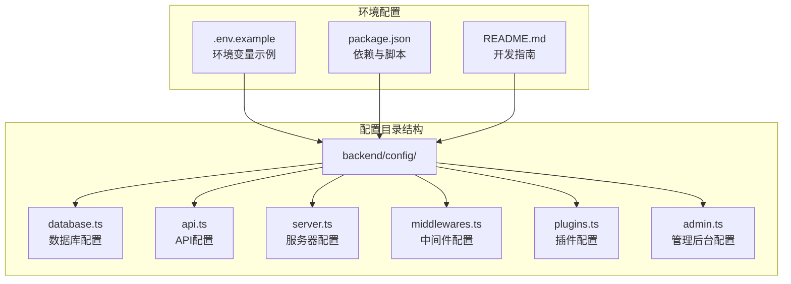
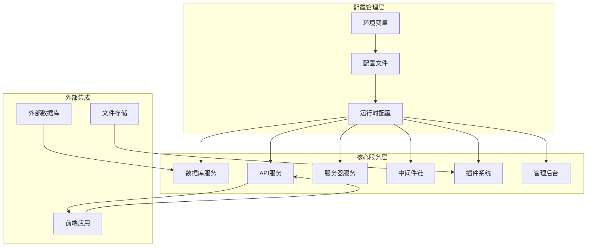
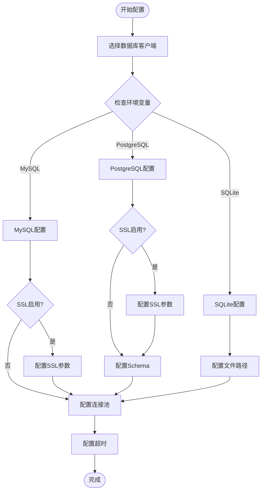
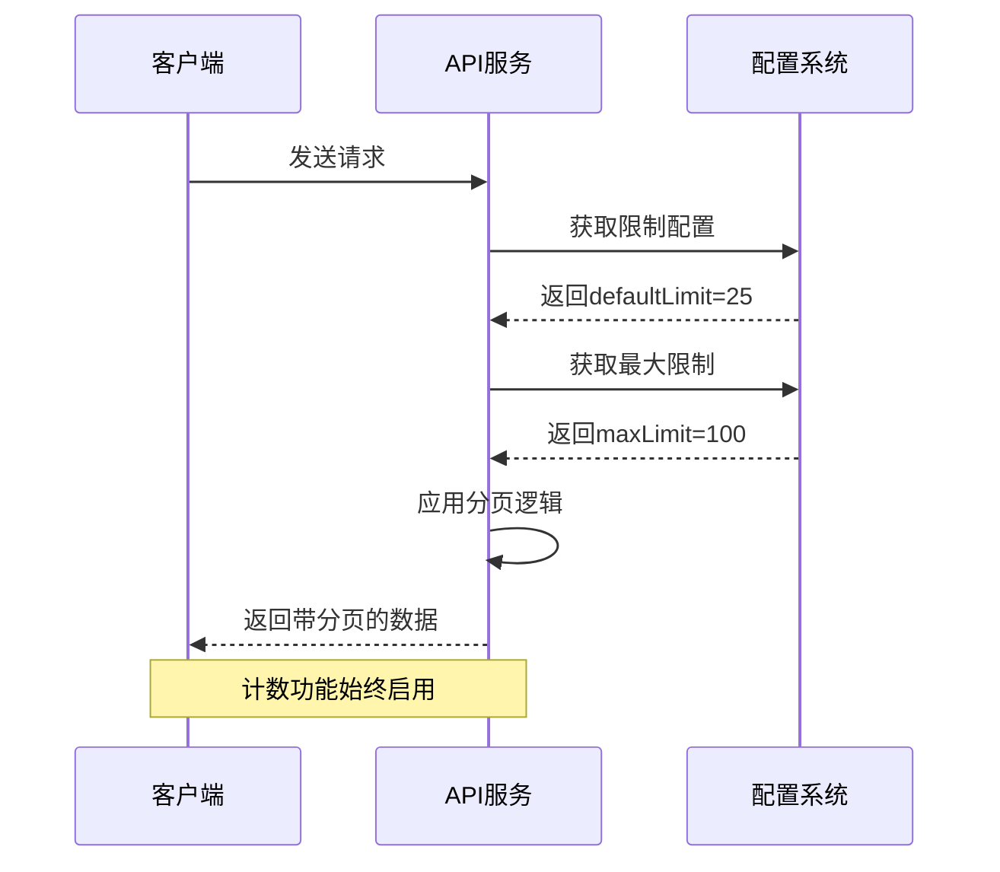
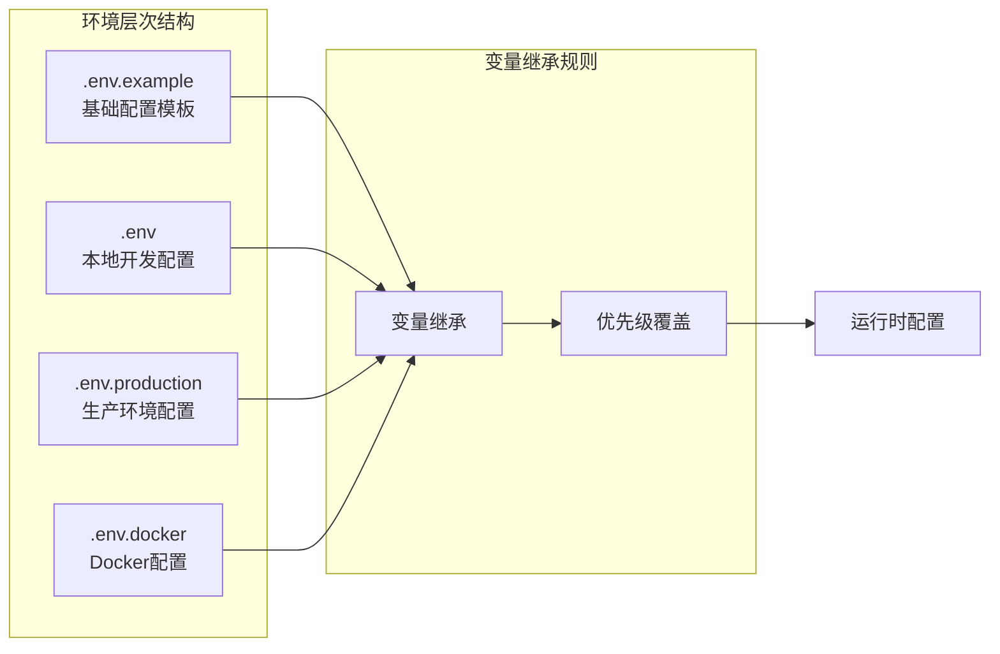
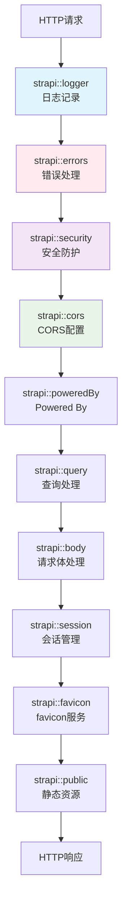
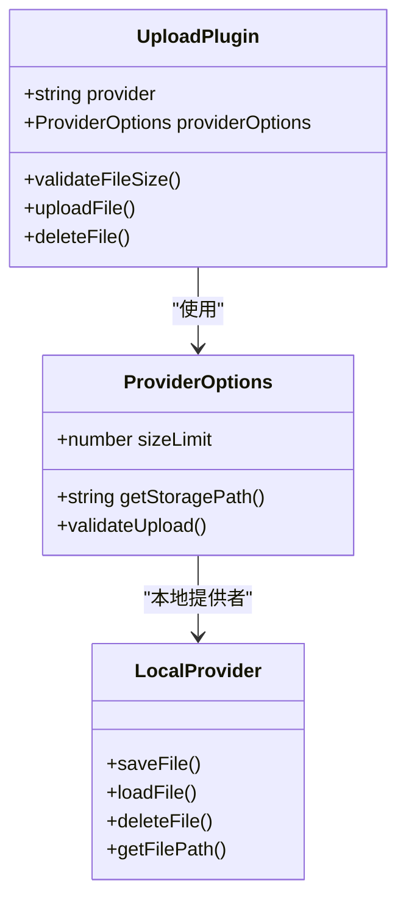
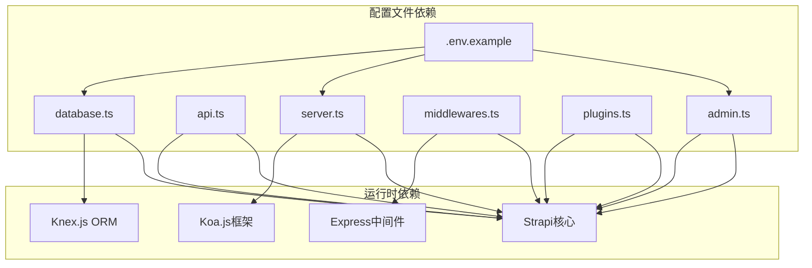
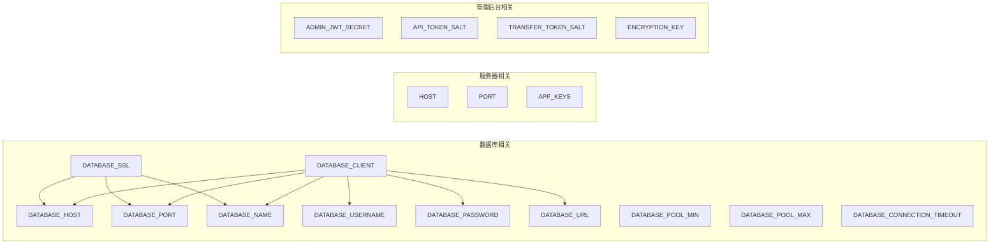
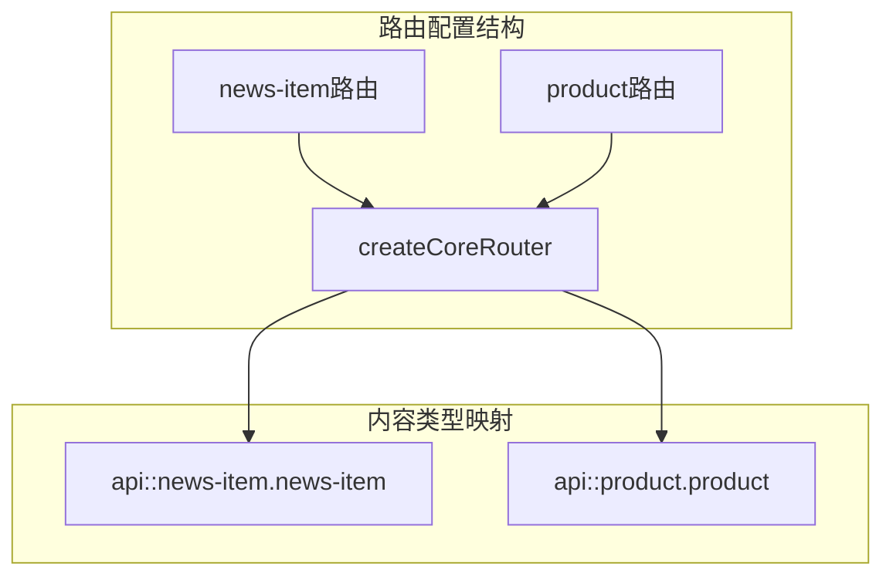

# Strapi配置管理

<cite>
**本文档引用的文件**
- [database.ts](file://backend/config/database.ts)
- [api.ts](file://backend/config/api.ts)
- [server.ts](file://backend/config/server.ts)
- [middlewares.ts](file://backend/config/middlewares.ts)
- [plugins.ts](file://backend/config/plugins.ts)
- [admin.ts](file://backend/config/admin.ts)
- [.env.example](file://backend/.env.example)
- [package.json](file://backend/package.json)
- [README.md](file://backend/README.md)
- [routes.md](file://specs/001-strapi-backend-cms/contracts/routes.md)
- [news-item.ts](file://backend/src/api/news-item/routes/news-item.ts)
- [product.ts](file://backend/src/api/product/routes/product.ts)
</cite>

## 目录
1. [简介](#简介)
2. [项目结构](#项目结构)
3. [核心组件](#核心组件)
4. [架构概览](#架构概览)
5. [详细组件分析](#详细组件分析)
6. [依赖关系分析](#依赖关系分析)
7. [性能考虑](#性能考虑)
8. [故障排除指南](#故障排除指南)
9. [结论](#结论)
10. [附录](#附录)

## 简介

本文件为Strapi 5配置管理的详细技术文档，深入解析后端配置体系，涵盖数据库配置、API配置、服务器配置、中间件配置、插件配置和管理后台配置。文档基于实际代码库进行分析，提供可操作的最佳实践建议，帮助开发者理解并优化Strapi应用的配置管理。

## 项目结构

后端配置位于`backend/config/`目录下，采用按功能模块划分的组织方式：

**图表来源**
- [database.ts](file://backend/config/database.ts#L1-L61)
- [.env.example](file://backend/.env.example#L1-L15)

**章节来源**
- [database.ts](file://backend/config/database.ts#L1-L61)
- [api.ts](file://backend/config/api.ts#L1-L8)
- [server.ts](file://backend/config/server.ts#L1-L8)
- [middlewares.ts](file://backend/config/middlewares.ts#L1-L13)
- [plugins.ts](file://backend/config/plugins.ts#L1-L11)
- [admin.ts](file://backend/config/admin.ts#L1-L21)
- [.env.example](file://backend/.env.example#L1-L15)

## 核心组件

### 数据库配置体系

Strapi支持三种数据库客户端：MySQL、PostgreSQL和SQLite，通过统一的配置接口提供一致的连接体验。

#### MySQL配置特性
- **连接参数**：支持主机、端口、数据库名、用户名、密码配置
- **SSL支持**：完整的SSL/TLS配置，包括密钥、证书、CA链验证
- **连接池**：可配置最小连接数和最大连接数
- **超时设置**：支持连接超时配置

#### PostgreSQL配置特性
- **连接字符串**：支持DATABASE_URL环境变量
- **主机配置**：默认localhost，可配置端口5432
- **Schema支持**：可指定数据库schema
- **SSL配置**：与MySQL相同的SSL配置选项

#### SQLite配置特性
- **文件存储**：使用本地文件系统存储数据
- **默认路径**：`.tmp/data.db`相对路径
- **空值处理**：启用null作为默认值

**章节来源**
- [database.ts](file://backend/config/database.ts#L3-L60)

### API配置体系

API配置主要控制REST接口的行为模式：

- **默认限制**：每页默认返回25条记录
- **最大限制**：单次请求最多100条记录
- **计数支持**：查询结果包含总数信息

**章节来源**
- [api.ts](file://backend/config/api.ts#L1-L8)

### 服务器配置体系

服务器配置控制Strapi应用的运行参数：

- **主机绑定**：默认绑定到所有网络接口
- **端口设置**：默认1337端口
- **应用密钥**：支持多密钥配置用于加密

**章节来源**
- [server.ts](file://backend/config/server.ts#L1-L8)

### 中间件配置体系

内置中间件按顺序执行，提供完整的请求处理链：

1. **日志记录**：请求响应日志
2. **错误处理**：统一错误处理机制
3. **安全防护**：安全头和防护措施
4. **CORS支持**：跨域资源共享配置
5. **查询处理**：查询参数解析
6. **请求体处理**：JSON、URL编码等
7. **会话管理**：用户会话支持
8. **静态资源**：公共文件服务

**章节来源**
- [middlewares.ts](file://backend/config/middlewares.ts#L1-L13)

### 插件配置体系

当前配置了文件上传插件：

- **本地提供者**：使用本地文件系统存储
- **大小限制**：默认10MB上传限制
- **可扩展性**：支持切换到云存储提供者

**章节来源**
- [plugins.ts](file://backend/config/plugins.ts#L1-L11)

### 管理后台配置体系

管理后台安全配置：

- **JWT密钥**：管理员JWT令牌加密
- **API令牌**：API访问令牌盐值
- **传输令牌**：数据传输令牌配置
- **加密密钥**：系统加密密钥
- **功能标志**：可选功能开关

**章节来源**
- [admin.ts](file://backend/config/admin.ts#L1-L21)

## 架构概览

Strapi配置系统的整体架构如下：

**图表来源**
- [database.ts](file://backend/config/database.ts#L3-L60)
- [api.ts](file://backend/config/api.ts#L1-L8)
- [server.ts](file://backend/config/server.ts#L1-L8)
- [middlewares.ts](file://backend/config/middlewares.ts#L1-L13)
- [plugins.ts](file://backend/config/plugins.ts#L1-L11)
- [admin.ts](file://backend/config/admin.ts#L1-L21)

## 详细组件分析

### 数据库配置深度分析

#### 连接参数配置流程

**图表来源**
- [database.ts](file://backend/config/database.ts#L3-L60)

#### SSL配置参数详解

| 参数名称 | 类型 | 默认值 | 说明 |
|---------|------|--------|------|
| DATABASE_SSL | boolean | false | 启用SSL连接 |
| DATABASE_SSL_KEY | string | undefined | 私钥文件路径 |
| DATABASE_SSL_CERT | string | undefined | 证书文件路径 |
| DATABASE_SSL_CA | string | undefined | CA证书文件路径 |
| DATABASE_SSL_CAPATH | string | undefined | CA证书目录路径 |
| DATABASE_SSL_CIPHER | string | undefined | SSL加密套件 |
| DATABASE_SSL_REJECT_UNAUTHORIZED | boolean | true | 拒绝未授权连接 |

**章节来源**
- [database.ts](file://backend/config/database.ts#L14-L21)
- [database.ts](file://backend/config/database.ts#L33-L40)

### API配置分析

#### 请求限制配置

**图表来源**
- [api.ts](file://backend/config/api.ts#L2-L7)

**章节来源**
- [api.ts](file://backend/config/api.ts#L1-L8)

### 服务器配置分析

#### 环境变量继承机制

**图表来源**
- [.env.example](file://backend/.env.example#L1-L15)

**章节来源**
- [server.ts](file://backend/config/server.ts#L1-L8)
- [.env.example](file://backend/.env.example#L1-L15)

### 中间件配置分析

#### 中间件执行顺序

**图表来源**
- [middlewares.ts](file://backend/config/middlewares.ts#L1-L13)

**章节来源**
- [middlewares.ts](file://backend/config/middlewares.ts#L1-L13)

### 插件配置分析

#### 文件上传配置

**图表来源**
- [plugins.ts](file://backend/config/plugins.ts#L1-L11)

**章节来源**
- [plugins.ts](file://backend/config/plugins.ts#L1-L11)

### 管理后台配置分析

#### 安全配置矩阵

| 配置项 | 必需性 | 用途 | 安全级别 |
|--------|--------|------|----------|
| ADMIN_JWT_SECRET | 强制 | 管理员JWT签名 | 高 |
| API_TOKEN_SALT | 强制 | API令牌盐值 | 高 |
| TRANSFER_TOKEN_SALT | 强制 | 传输令牌盐值 | 高 |
| ENCRYPTION_KEY | 强制 | 系统加密密钥 | 高 |
| APP_KEYS | 强制 | 多密钥轮换 | 高 |
| FLAG_NPS | 可选 | 用户反馈功能 | 低 |
| FLAG_PROMOTE_EE | 可选 | 企业版推广 | 低 |

**章节来源**
- [admin.ts](file://backend/config/admin.ts#L1-L21)

## 依赖关系分析

### 配置文件依赖图

**图表来源**
- [database.ts](file://backend/config/database.ts#L1-L61)
- [api.ts](file://backend/config/api.ts#L1-L8)
- [server.ts](file://backend/config/server.ts#L1-L8)
- [middlewares.ts](file://backend/config/middlewares.ts#L1-L13)
- [plugins.ts](file://backend/config/plugins.ts#L1-L11)
- [admin.ts](file://backend/config/admin.ts#L1-L21)
- [.env.example](file://backend/.env.example#L1-L15)

### 环境变量依赖关系

**图表来源**
- [database.ts](file://backend/config/database.ts#L3-L60)
- [server.ts](file://backend/config/server.ts#L1-L8)
- [admin.ts](file://backend/config/admin.ts#L1-L21)
- [.env.example](file://backend/.env.example#L1-L15)

**章节来源**
- [database.ts](file://backend/config/database.ts#L3-L60)
- [server.ts](file://backend/config/server.ts#L1-L8)
- [admin.ts](file://backend/config/admin.ts#L1-L21)
- [.env.example](file://backend/.env.example#L1-L15)

## 性能考虑

### 连接池优化建议

1. **数据库连接池配置**
   - MySQL: 默认min=2, max=10，适合中小型应用
   - PostgreSQL: 与MySQL相同的配置模式
   - SQLite: 单文件模式，连接池主要用于事务管理

2. **超时配置**
   - 连接超时默认60秒，可根据网络环境调整
   - 建议在生产环境中适当增加超时时间

3. **内存使用优化**
   - 合理设置连接池大小避免内存泄漏
   - 监控数据库连接数与系统资源使用情况

### API性能优化

1. **分页策略**
   - 默认每页25条，最大100条，平衡性能与用户体验
   - 建议前端实现智能分页加载

2. **查询优化**
   - 合理使用populate减少N+1查询
   - 实施适当的索引策略

## 故障排除指南

### 常见配置问题

#### 数据库连接问题
- **症状**：应用启动失败，数据库连接超时
- **排查步骤**：
  1. 检查DATABASE_CLIENT配置
  2. 验证数据库服务状态
  3. 确认网络连通性
  4. 检查SSL配置是否正确

#### 服务器启动问题
- **症状**：端口被占用或权限不足
- **解决方案**：
  1. 修改PORT环境变量
  2. 检查防火墙设置
  3. 验证APP_KEYS配置

#### 中间件冲突
- **症状**：请求处理异常或功能失效
- **解决方法**：
  1. 检查中间件执行顺序
  2. 临时禁用可疑中间件
  3. 查看日志输出定位问题

**章节来源**
- [database.ts](file://backend/config/database.ts#L57-L58)
- [server.ts](file://backend/config/server.ts#L2-L3)
- [middlewares.ts](file://backend/config/middlewares.ts#L1-L13)

## 结论

Strapi 5的配置管理体系提供了高度模块化和可扩展的架构设计。通过环境变量驱动的配置方式，实现了开发、测试、生产环境的无缝切换。建议在实际部署中：

1. **严格区分环境配置**：使用.env.example作为模板，.env保存本地配置
2. **强化安全配置**：确保所有密钥都使用强随机值
3. **监控配置变更**：建立配置变更的审计机制
4. **定期审查配置**：根据业务发展调整连接池和性能参数

## 附录

### API路由配置示例

基于核心路由器的API路由配置遵循Strapi约定：

**图表来源**
- [news-item.ts](file://backend/src/api/news-item/routes/news-item.ts#L1-L4)
- [product.ts](file://backend/src/api/product/routes/product.ts#L1-L4)

### 环境变量最佳实践

#### 开发环境配置
- 使用SQLite简化开发环境搭建
- 设置宽松的调试参数
- 启用详细的日志输出

#### 生产环境配置
- 使用PostgreSQL提升性能
- 配置SSL连接增强安全性
- 设置严格的连接池参数
- 实施监控和告警机制

**章节来源**
- [routes.md](file://specs/001-strapi-backend-cms/contracts/routes.md#L1-L34)
- [README.md](file://backend/README.md#L1-L91)