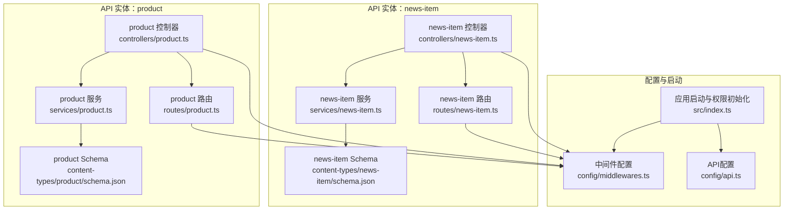
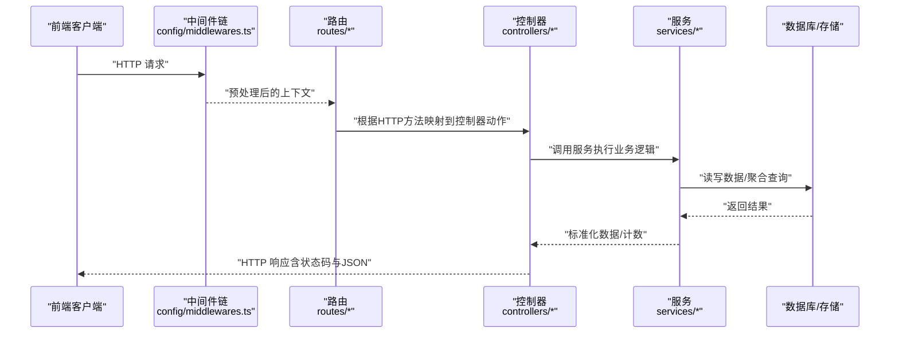
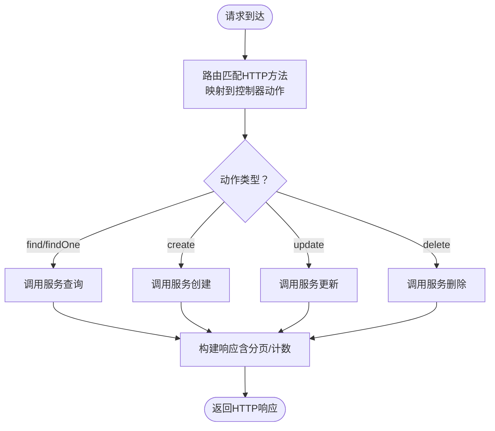
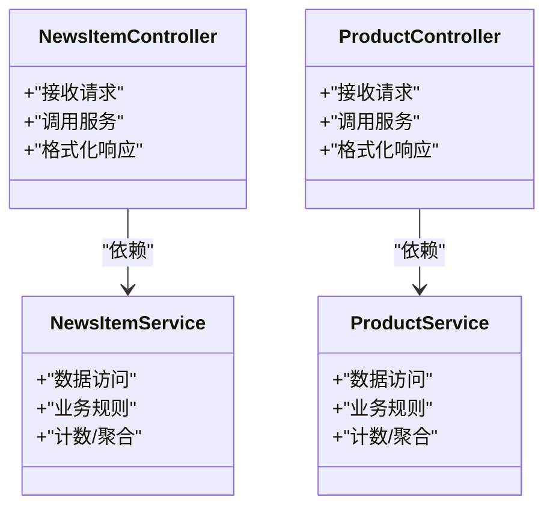
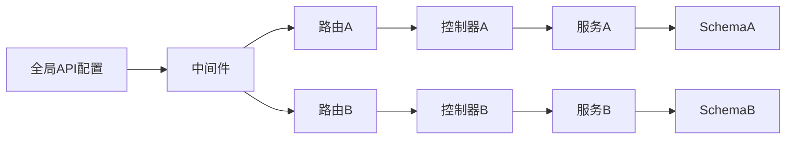

# API控制器层

<cite>
**本文引用的文件**
- [backend/src/api/news-item/controllers/news-item.ts](file://backend/src/api/news-item/controllers/news-item.ts)
- [backend/src/api/product/controllers/product.ts](file://backend/src/api/product/controllers/product.ts)
- [backend/src/api/news-item/routes/news-item.ts](file://backend/src/api/news-item/routes/news-item.ts)
- [backend/src/api/product/routes/product.ts](file://backend/src/api/product/routes/product.ts)
- [backend/src/api/news-item/services/news-item.ts](file://backend/src/api/news-item/services/news-item.ts)
- [backend/src/api/product/services/product.ts](file://backend/src/api/product/services/product.ts)
- [backend/src/api/news-item/content-types/news-item/schema.json](file://backend/src/api/news-item/content-types/news-item/schema.json)
- [backend/src/api/product/content-types/product/schema.json](file://backend/src/api/product/content-types/product/schema.json)
- [backend/config/middlewares.ts](file://backend/config/middlewares.ts)
- [backend/config/api.ts](file://backend/config/api.ts)
- [backend/src/index.ts](file://backend/src/index.ts)
- [backend/scripts/import-news.mjs](file://backend/scripts/import-news.mjs)
- [backend/scripts/import-products.mjs](file://backend/scripts/import-products.mjs)
- [frontend/lib/strapi.ts](file://frontend/lib/strapi.ts)
</cite>

## 目录
1. [引言](#引言)
2. [项目结构](#项目结构)
3. [核心组件](#核心组件)
4. [架构总览](#架构总览)
5. [详细组件分析](#详细组件分析)
6. [依赖关系分析](#依赖关系分析)
7. [性能考量](#性能考量)
8. [故障排查指南](#故障排查指南)
9. [结论](#结论)
10. [附录](#附录)

## 引言
本文件聚焦于Strapi后端的API控制器层，系统性解析控制器如何通过工厂函数生成核心控制器，并与路由、服务层协同完成标准CRUD操作（创建、检索、更新、删除）。我们将从请求处理流程、参数与响应格式、中间件与权限控制、错误处理与异常管理、到扩展与自定义操作的实践路径进行深入说明。同时结合内容类型schema与前端调用方式，帮助读者全面掌握控制器在实际业务中的运行机制。

## 项目结构
后端采用按功能域分层的组织方式：每个API实体（如news-item、product）下包含控制器、路由、服务与内容类型schema。控制器通过工厂函数绑定到对应内容类型；路由负责REST端点注册；服务封装数据访问与业务逻辑；中间件统一处理安全、日志、CORS、查询参数、请求体等横切关注点；全局配置定义REST默认行为与公共权限初始化。

图表来源
- [backend/src/api/news-item/controllers/news-item.ts](file://backend/src/api/news-item/controllers/news-item.ts#L1-L4)
- [backend/src/api/product/controllers/product.ts](file://backend/src/api/product/controllers/product.ts#L1-L4)
- [backend/src/api/news-item/routes/news-item.ts](file://backend/src/api/news-item/routes/news-item.ts#L1-L4)
- [backend/src/api/product/routes/product.ts](file://backend/src/api/product/routes/product.ts#L1-L4)
- [backend/src/api/news-item/services/news-item.ts](file://backend/src/api/news-item/services/news-item.ts#L1-L4)
- [backend/src/api/product/services/product.ts](file://backend/src/api/product/services/product.ts#L1-L4)
- [backend/src/api/news-item/content-types/news-item/schema.json](file://backend/src/api/news-item/content-types/news-item/schema.json#L1-L65)
- [backend/src/api/product/content-types/product/schema.json](file://backend/src/api/product/content-types/product/schema.json#L1-L63)
- [backend/config/middlewares.ts](file://backend/config/middlewares.ts#L1-L13)
- [backend/config/api.ts](file://backend/config/api.ts#L1-L8)
- [backend/src/index.ts](file://backend/src/index.ts#L1-L65)

章节来源
- [backend/src/api/news-item/controllers/news-item.ts](file://backend/src/api/news-item/controllers/news-item.ts#L1-L4)
- [backend/src/api/product/controllers/product.ts](file://backend/src/api/product/controllers/product.ts#L1-L4)
- [backend/src/api/news-item/routes/news-item.ts](file://backend/src/api/news-item/routes/news-item.ts#L1-L4)
- [backend/src/api/product/routes/product.ts](file://backend/src/api/product/routes/product.ts#L1-L4)
- [backend/src/api/news-item/services/news-item.ts](file://backend/src/api/news-item/services/news-item.ts#L1-L4)
- [backend/src/api/product/services/product.ts](file://backend/src/api/product/services/product.ts#L1-L4)
- [backend/src/api/news-item/content-types/news-item/schema.json](file://backend/src/api/news-item/content-types/news-item/schema.json#L1-L65)
- [backend/src/api/product/content-types/product/schema.json](file://backend/src/api/product/content-types/product/schema.json#L1-L63)
- [backend/config/middlewares.ts](file://backend/config/middlewares.ts#L1-L13)
- [backend/config/api.ts](file://backend/config/api.ts#L1-L8)
- [backend/src/index.ts](file://backend/src/index.ts#L1-L65)

## 核心组件
- 控制器（Controller）
  - 通过工厂函数为内容类型生成核心控制器，自动继承标准CRUD端点与行为。
  - 典型文件路径：[backend/src/api/news-item/controllers/news-item.ts](file://backend/src/api/news-item/controllers/news-item.ts#L1-L4)，[backend/src/api/product/controllers/product.ts](file://backend/src/api/product/controllers/product.ts#L1-L4)。
- 路由（Router）
  - 通过工厂函数注册内容类型的REST路由，映射HTTP动词到控制器动作。
  - 典型文件路径：[backend/src/api/news-item/routes/news-item.ts](file://backend/src/api/news-item/routes/news-item.ts#L1-L4)，[backend/src/api/product/routes/product.ts](file://backend/src/api/product/routes/product.ts#L1-L4)。
- 服务（Service）
  - 封装数据访问与业务逻辑，供控制器调用，支持事务、关联查询、计数等。
  - 典型文件路径：[backend/src/api/news-item/services/news-item.ts](file://backend/src/api/news-item/services/news-item.ts#L1-L4)，[backend/src/api/product/services/product.ts](file://backend/src/api/product/services/product.ts#L1-L4)。
- 内容类型Schema
  - 定义字段、校验、媒体、UID、枚举等元数据，影响控制器的输入输出形态。
  - 典型文件路径：[backend/src/api/news-item/content-types/news-item/schema.json](file://backend/src/api/news-item/content-types/news-item/schema.json#L1-L65)，[backend/src/api/product/content-types/product/schema.json](file://backend/src/api/product/content-types/product/schema.json#L1-L63)。
- 中间件与全局配置
  - 统一处理日志、错误、安全、CORS、查询参数、请求体、静态资源等。
  - 典型文件路径：[backend/config/middlewares.ts](file://backend/config/middlewares.ts#L1-L13)，[backend/config/api.ts](file://backend/config/api.ts#L1-L8)。
- 启动与权限初始化
  - 在应用启动时为公共角色启用指定内容类型的读取权限，确保前端可访问。
  - 典型文件路径：[backend/src/index.ts](file://backend/src/index.ts#L1-L65)。

章节来源
- [backend/src/api/news-item/controllers/news-item.ts](file://backend/src/api/news-item/controllers/news-item.ts#L1-L4)
- [backend/src/api/product/controllers/product.ts](file://backend/src/api/product/controllers/product.ts#L1-L4)
- [backend/src/api/news-item/routes/news-item.ts](file://backend/src/api/news-item/routes/news-item.ts#L1-L4)
- [backend/src/api/product/routes/product.ts](file://backend/src/api/product/routes/product.ts#L1-L4)
- [backend/src/api/news-item/services/news-item.ts](file://backend/src/api/news-item/services/news-item.ts#L1-L4)
- [backend/src/api/product/services/product.ts](file://backend/src/api/product/services/product.ts#L1-L4)
- [backend/src/api/news-item/content-types/news-item/schema.json](file://backend/src/api/news-item/content-types/news-item/schema.json#L1-L65)
- [backend/src/api/product/content-types/product/schema.json](file://backend/src/api/product/content-types/product/schema.json#L1-L63)
- [backend/config/middlewares.ts](file://backend/config/middlewares.ts#L1-L13)
- [backend/config/api.ts](file://backend/config/api.ts#L1-L8)
- [backend/src/index.ts](file://backend/src/index.ts#L1-L65)

## 架构总览
控制器层以“控制器-路由-服务-内容类型”的分层协作实现REST API。请求经由中间件链路进入，路由将HTTP方法映射到控制器动作，控制器调用服务执行业务逻辑，服务基于内容类型schema进行数据访问与校验，最终返回标准化响应。

图表来源
- [backend/config/middlewares.ts](file://backend/config/middlewares.ts#L1-L13)
- [backend/src/api/news-item/routes/news-item.ts](file://backend/src/api/news-item/routes/news-item.ts#L1-L4)
- [backend/src/api/product/routes/product.ts](file://backend/src/api/product/routes/product.ts#L1-L4)
- [backend/src/api/news-item/controllers/news-item.ts](file://backend/src/api/news-item/controllers/news-item.ts#L1-L4)
- [backend/src/api/product/controllers/product.ts](file://backend/src/api/product/controllers/product.ts#L1-L4)
- [backend/src/api/news-item/services/news-item.ts](file://backend/src/api/news-item/services/news-item.ts#L1-L4)
- [backend/src/api/product/services/product.ts](file://backend/src/api/product/services/product.ts#L1-L4)

## 详细组件分析

### 控制器与路由的协作
- 控制器通过工厂函数绑定到内容类型，自动获得标准CRUD端点（如find、findOne、create、update、delete）。
- 路由通过工厂函数注册REST端点，将HTTP方法映射到控制器动作，遵循REST约定。
- 典型文件路径：
  - 控制器：[backend/src/api/news-item/controllers/news-item.ts](file://backend/src/api/news-item/controllers/news-item.ts#L1-L4)，[backend/src/api/product/controllers/product.ts](file://backend/src/api/product/controllers/product.ts#L1-L4)
  - 路由：[backend/src/api/news-item/routes/news-item.ts](file://backend/src/api/news-item/routes/news-item.ts#L1-L4)，[backend/src/api/product/routes/product.ts](file://backend/src/api/product/routes/product.ts#L1-L4)

图表来源
- [backend/src/api/news-item/routes/news-item.ts](file://backend/src/api/news-item/routes/news-item.ts#L1-L4)
- [backend/src/api/product/routes/product.ts](file://backend/src/api/product/routes/product.ts#L1-L4)
- [backend/src/api/news-item/controllers/news-item.ts](file://backend/src/api/news-item/controllers/news-item.ts#L1-L4)
- [backend/src/api/product/controllers/product.ts](file://backend/src/api/product/controllers/product.ts#L1-L4)

章节来源
- [backend/src/api/news-item/controllers/news-item.ts](file://backend/src/api/news-item/controllers/news-item.ts#L1-L4)
- [backend/src/api/product/controllers/product.ts](file://backend/src/api/product/controllers/product.ts#L1-L4)
- [backend/src/api/news-item/routes/news-item.ts](file://backend/src/api/news-item/routes/news-item.ts#L1-L4)
- [backend/src/api/product/routes/product.ts](file://backend/src/api/product/routes/product.ts#L1-L4)

### CRUD操作实现要点
- 创建（create）
  - 路由端点：POST /api/{entity}
  - 处理流程：路由接收请求 → 控制器调用服务创建 → 服务执行数据写入与校验 → 返回创建结果
  - 参考路径：[backend/src/api/news-item/routes/news-item.ts](file://backend/src/api/news-item/routes/news-item.ts#L1-L4)，[backend/src/api/product/routes/product.ts](file://backend/src/api/product/routes/product.ts#L1-L4)
- 检索（retrieve）
  - 列表（find）：GET /api/{entity}，受全局REST限制影响
    - 参考路径：[backend/config/api.ts](file://backend/config/api.ts#L1-L8)
  - 单条（findOne）：GET /api/{entity}/:id
  - 参考路径：[backend/src/api/news-item/routes/news-item.ts](file://backend/src/api/news-item/routes/news-item.ts#L1-L4)，[backend/src/api/product/routes/product.ts](file://backend/src/api/product/routes/product.ts#L1-L4)
- 更新（update）
  - PUT/PATCH /api/{entity}/:id
  - 参考路径：[backend/src/api/news-item/routes/news-item.ts](file://backend/src/api/news-item/routes/news-item.ts#L1-L4)，[backend/src/api/product/routes/product.ts](file://backend/src/api/product/routes/product.ts#L1-L4)
- 删除（delete）
  - DELETE /api/{entity}/:id
  - 参考路径：[backend/src/api/news-item/routes/news-item.ts](file://backend/src/api/news-item/routes/news-item.ts#L1-L4)，[backend/src/api/product/routes/product.ts](file://backend/src/api/product/routes/product.ts#L1-L4)

章节来源
- [backend/src/api/news-item/routes/news-item.ts](file://backend/src/api/news-item/routes/news-item.ts#L1-L4)
- [backend/src/api/product/routes/product.ts](file://backend/src/api/product/routes/product.ts#L1-L4)
- [backend/config/api.ts](file://backend/config/api.ts#L1-L8)

### 参数验证与响应格式
- 参数来源与处理
  - 查询参数：由查询中间件统一解析，支持分页、排序、过滤等
    - 参考路径：[backend/config/middlewares.ts](file://backend/config/middlewares.ts#L1-L13)
  - 请求体：由请求体中间件解析，用于创建/更新
    - 参考路径：[backend/config/middlewares.ts](file://backend/config/middlewares.ts#L1-L13)
- 响应格式
  - 控制器返回标准化JSON响应（包含数据、元信息、计数等），具体结构由服务层决定
  - 参考路径：[backend/src/api/news-item/controllers/news-item.ts](file://backend/src/api/news-item/controllers/news-item.ts#L1-L4)，[backend/src/api/product/controllers/product.ts](file://backend/src/api/product/controllers/product.ts#L1-L4)
- 内容类型约束
  - Schema定义字段类型、必填、唯一、枚举、媒体等，直接影响控制器对输入的约束与输出形态
  - 参考路径：
    - [backend/src/api/news-item/content-types/news-item/schema.json](file://backend/src/api/news-item/content-types/news-item/schema.json#L1-L65)
    - [backend/src/api/product/content-types/product/schema.json](file://backend/src/api/product/content-types/product/schema.json#L1-L63)

章节来源
- [backend/config/middlewares.ts](file://backend/config/middlewares.ts#L1-L13)
- [backend/src/api/news-item/controllers/news-item.ts](file://backend/src/api/news-item/controllers/news-item.ts#L1-L4)
- [backend/src/api/product/controllers/product.ts](file://backend/src/api/product/controllers/product.ts#L1-L4)
- [backend/src/api/news-item/content-types/news-item/schema.json](file://backend/src/api/news-item/content-types/news-item/schema.json#L1-L65)
- [backend/src/api/product/content-types/product/schema.json](file://backend/src/api/product/content-types/product/schema.json#L1-L63)

### 控制器与服务层交互模式
- 控制器职责：接收请求、组装参数、调用服务、格式化响应
- 服务职责：封装业务规则、数据访问、关联查询、计数、事务等
- 交互示意：

图表来源
- [backend/src/api/news-item/controllers/news-item.ts](file://backend/src/api/news-item/controllers/news-item.ts#L1-L4)
- [backend/src/api/product/controllers/product.ts](file://backend/src/api/product/controllers/product.ts#L1-L4)
- [backend/src/api/news-item/services/news-item.ts](file://backend/src/api/news-item/services/news-item.ts#L1-L4)
- [backend/src/api/product/services/product.ts](file://backend/src/api/product/services/product.ts#L1-L4)

章节来源
- [backend/src/api/news-item/controllers/news-item.ts](file://backend/src/api/news-item/controllers/news-item.ts#L1-L4)
- [backend/src/api/product/controllers/product.ts](file://backend/src/api/product/controllers/product.ts#L1-L4)
- [backend/src/api/news-item/services/news-item.ts](file://backend/src/api/news-item/services/news-item.ts#L1-L4)
- [backend/src/api/product/services/product.ts](file://backend/src/api/product/services/product.ts#L1-L4)

### 错误处理与异常管理
- 中间件层统一捕获与转换异常，保证一致的错误响应格式
  - 参考路径：[backend/config/middlewares.ts](file://backend/config/middlewares.ts#L1-L13)
- 控制器层通常无需重复处理常见异常，但可在需要时进行特定动作包装或补充上下文
- 前端调用侧也具备基础错误处理示例（如网络错误、非2xx状态）
  - 参考路径：[frontend/lib/strapi.ts](file://frontend/lib/strapi.ts#L100-L118)

章节来源
- [backend/config/middlewares.ts](file://backend/config/middlewares.ts#L1-L13)
- [frontend/lib/strapi.ts](file://frontend/lib/strapi.ts#L100-L118)

### 权限验证与请求拦截
- 启动阶段为公共角色启用指定内容类型的读取权限，确保前端可访问
  - 参考路径：[backend/src/index.ts](file://backend/src/index.ts#L1-L65)
- 中间件链中包含安全与CORS等拦截能力，可按需扩展或调整
  - 参考路径：[backend/config/middlewares.ts](file://backend/config/middlewares.ts#L1-L13)

章节来源
- [backend/src/index.ts](file://backend/src/index.ts#L1-L65)
- [backend/config/middlewares.ts](file://backend/config/middlewares.ts#L1-L13)

### 扩展与自定义操作
- 自定义动作
  - 在控制器中新增方法，结合路由注册自定义端点，实现业务特定的处理逻辑
  - 示例参考路径：[backend/src/api/news-item/controllers/news-item.ts](file://backend/src/api/news-item/controllers/news-item.ts#L1-L4)，[backend/src/api/product/controllers/product.ts](file://backend/src/api/product/controllers/product.ts#L1-L4)
- 自定义路由
  - 在路由文件中添加自定义HTTP端点，映射到控制器自定义方法
  - 示例参考路径：[backend/src/api/news-item/routes/news-item.ts](file://backend/src/api/news-item/routes/news-item.ts#L1-L4)，[backend/src/api/product/routes/product.ts](file://backend/src/api/product/routes/product.ts#L1-L4)
- 与服务层协作
  - 在自定义控制器动作中调用服务，复用数据访问与业务规则
  - 示例参考路径：[backend/src/api/news-item/services/news-item.ts](file://backend/src/api/news-item/services/news-item.ts#L1-L4)，[backend/src/api/product/services/product.ts](file://backend/src/api/product/services/product.ts#L1-L4)

章节来源
- [backend/src/api/news-item/controllers/news-item.ts](file://backend/src/api/news-item/controllers/news-item.ts#L1-L4)
- [backend/src/api/product/controllers/product.ts](file://backend/src/api/product/controllers/product.ts#L1-L4)
- [backend/src/api/news-item/routes/news-item.ts](file://backend/src/api/news-item/routes/news-item.ts#L1-L4)
- [backend/src/api/product/routes/product.ts](file://backend/src/api/product/routes/product.ts#L1-L4)
- [backend/src/api/news-item/services/news-item.ts](file://backend/src/api/news-item/services/news-item.ts#L1-L4)
- [backend/src/api/product/services/product.ts](file://backend/src/api/product/services/product.ts#L1-L4)

### 请求拦截与中间件配置
- 中间件顺序与职责
  - 日志、错误、安全、CORS、PoweredBy、查询参数、请求体、会话、favicon、静态资源
  - 参考路径：[backend/config/middlewares.ts](file://backend/config/middlewares.ts#L1-L13)
- 配置建议
  - 根据业务需求调整中间件顺序与开关，例如在开发环境开启更宽松的CORS，在生产环境严格限制
  - 对敏感接口可增加鉴权中间件或自定义中间件

章节来源
- [backend/config/middlewares.ts](file://backend/config/middlewares.ts#L1-L13)

## 依赖关系分析
- 控制器与路由
  - 控制器通过工厂函数绑定内容类型，路由通过工厂函数注册REST端点，二者强耦合于同一内容类型标识
- 控制器与服务
  - 控制器仅负责编排，服务负责实现业务与数据访问，低耦合高内聚
- 服务与内容类型Schema
  - 服务依据Schema进行字段校验、媒体处理、UID/枚举约束等
- 中间件与全局配置
  - 中间件统一拦截请求，全局配置影响REST行为（如分页上限、是否返回计数）

图表来源
- [backend/src/api/news-item/controllers/news-item.ts](file://backend/src/api/news-item/controllers/news-item.ts#L1-L4)
- [backend/src/api/product/controllers/product.ts](file://backend/src/api/product/controllers/product.ts#L1-L4)
- [backend/src/api/news-item/routes/news-item.ts](file://backend/src/api/news-item/routes/news-item.ts#L1-L4)
- [backend/src/api/product/routes/product.ts](file://backend/src/api/product/routes/product.ts#L1-L4)
- [backend/src/api/news-item/services/news-item.ts](file://backend/src/api/news-item/services/news-item.ts#L1-L4)
- [backend/src/api/product/services/product.ts](file://backend/src/api/product/services/product.ts#L1-L4)
- [backend/src/api/news-item/content-types/news-item/schema.json](file://backend/src/api/news-item/content-types/news-item/schema.json#L1-L65)
- [backend/src/api/product/content-types/product/schema.json](file://backend/src/api/product/content-types/product/schema.json#L1-L63)
- [backend/config/middlewares.ts](file://backend/config/middlewares.ts#L1-L13)
- [backend/config/api.ts](file://backend/config/api.ts#L1-L8)

章节来源
- [backend/src/api/news-item/controllers/news-item.ts](file://backend/src/api/news-item/controllers/news-item.ts#L1-L4)
- [backend/src/api/product/controllers/product.ts](file://backend/src/api/product/controllers/product.ts#L1-L4)
- [backend/src/api/news-item/routes/news-item.ts](file://backend/src/api/news-item/routes/news-item.ts#L1-L4)
- [backend/src/api/product/routes/product.ts](file://backend/src/api/product/routes/product.ts#L1-L4)
- [backend/src/api/news-item/services/news-item.ts](file://backend/src/api/news-item/services/news-item.ts#L1-L4)
- [backend/src/api/product/services/product.ts](file://backend/src/api/product/services/product.ts#L1-L4)
- [backend/src/api/news-item/content-types/news-item/schema.json](file://backend/src/api/news-item/content-types/news-item/schema.json#L1-L65)
- [backend/src/api/product/content-types/product/schema.json](file://backend/src/api/product/content-types/product/schema.json#L1-L63)
- [backend/config/middlewares.ts](file://backend/config/middlewares.ts#L1-L13)
- [backend/config/api.ts](file://backend/config/api.ts#L1-L8)

## 性能考量
- 分页与计数
  - 全局配置默认返回计数，列表查询可能带来额外开销；可根据场景关闭withCount或调整默认limit与maxLimit
  - 参考路径：[backend/config/api.ts](file://backend/config/api.ts#L1-L8)
- 查询参数优化
  - 合理使用过滤、排序、选择字段，避免不必要的关联加载
  - 参考路径：[backend/config/middlewares.ts](file://backend/config/middlewares.ts#L1-L13)
- 缓存策略
  - 结合前端缓存与CDN，减少重复请求；对热点内容可考虑服务层缓存
- 媒体与大字段
  - 媒体上传与缩略图生成可能消耗较多I/O，建议异步处理与懒加载

章节来源
- [backend/config/api.ts](file://backend/config/api.ts#L1-L8)
- [backend/config/middlewares.ts](file://backend/config/middlewares.ts#L1-L13)

## 故障排查指南
- 常见问题定位
  - 端点不可访问：检查路由是否正确注册、中间件顺序是否阻断请求
    - 参考路径：[backend/src/api/news-item/routes/news-item.ts](file://backend/src/api/news-item/routes/news-item.ts#L1-L4)，[backend/src/api/product/routes/product.ts](file://backend/src/api/product/routes/product.ts#L1-L4)，[backend/config/middlewares.ts](file://backend/config/middlewares.ts#L1-L13)
  - 权限不足：确认公共角色是否已启用相应读取权限
    - 参考路径：[backend/src/index.ts](file://backend/src/index.ts#L1-L65)
  - 参数错误：核对Schema约束与请求体格式
    - 参考路径：
      - [backend/src/api/news-item/content-types/news-item/schema.json](file://backend/src/api/news-item/content-types/news-item/schema.json#L1-L65)
      - [backend/src/api/product/content-types/product/schema.json](file://backend/src/api/product/content-types/product/schema.json#L1-L63)
  - 响应异常：查看中间件错误处理与控制器返回格式
    - 参考路径：[backend/config/middlewares.ts](file://backend/config/middlewares.ts#L1-L13)
- 前端调用示例
  - 前端库对非2xx状态抛出错误，便于快速发现后端异常
    - 参考路径：[frontend/lib/strapi.ts](file://frontend/lib/strapi.ts#L100-L118)

章节来源
- [backend/src/api/news-item/routes/news-item.ts](file://backend/src/api/news-item/routes/news-item.ts#L1-L4)
- [backend/src/api/product/routes/product.ts](file://backend/src/api/product/routes/product.ts#L1-L4)
- [backend/config/middlewares.ts](file://backend/config/middlewares.ts#L1-L13)
- [backend/src/index.ts](file://backend/src/index.ts#L1-L65)
- [backend/src/api/news-item/content-types/news-item/schema.json](file://backend/src/api/news-item/content-types/news-item/schema.json#L1-L65)
- [backend/src/api/product/content-types/product/schema.json](file://backend/src/api/product/content-types/product/schema.json#L1-L63)
- [frontend/lib/strapi.ts](file://frontend/lib/strapi.ts#L100-L118)

## 结论
Strapi控制器层通过“控制器-路由-服务-内容类型”清晰分层，配合中间件与全局配置，实现了标准化的REST API与一致的错误处理。开发者可在此基础上快速扩展自定义动作与路由，同时依托内容类型Schema与服务层能力保障数据一致性与业务规则。权限初始化与中间件配置是上线前的关键检查项，建议在开发与生产环境中分别审慎调整。

## 附录
- 数据模型概览（基于Schema）
  - 新闻项（news-item）：标题、UID、摘要、富文本内容、分类、主图、附件、作者、推荐、标签、浏览量、相关产品等
    - 参考路径：[backend/src/api/news-item/content-types/news-item/schema.json](file://backend/src/api/news-item/content-types/news-item/schema.json#L1-L65)
  - 产品（product）：名称、UID、简介、富文本描述、分类、主图、图集、特性、规格、推荐、排序、链接等
    - 参考路径：[backend/src/api/product/content-types/product/schema.json](file://backend/src/api/product/content-types/product/schema.json#L1-L63)
- 导入脚本参考
  - 新闻导入与UPSERT示例（含鉴权与重试逻辑）
    - 参考路径：[backend/scripts/import-news.mjs](file://backend/scripts/import-news.mjs#L98-L156)
  - 产品导入与媒体上传示例
    - 参考路径：[backend/scripts/import-products.mjs](file://backend/scripts/import-products.mjs#L1-L45)
- 前端调用参考
  - 产品与新闻的拉取与映射
    - 参考路径：[frontend/lib/strapi.ts](file://frontend/lib/strapi.ts#L55-L118)