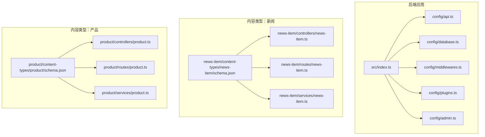
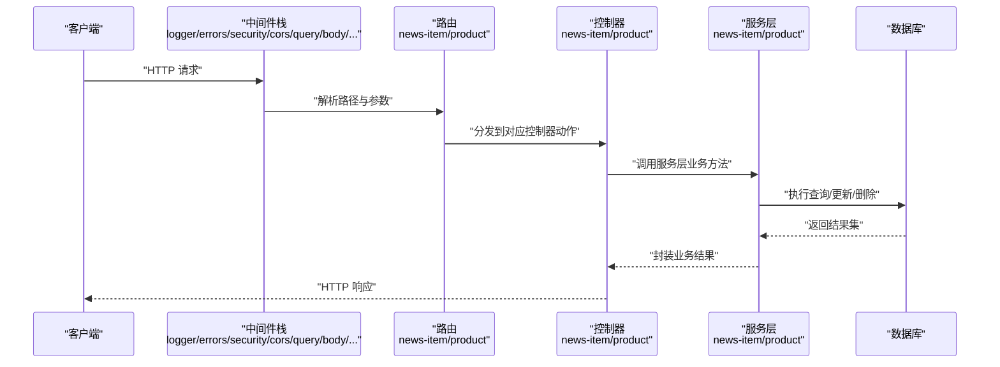
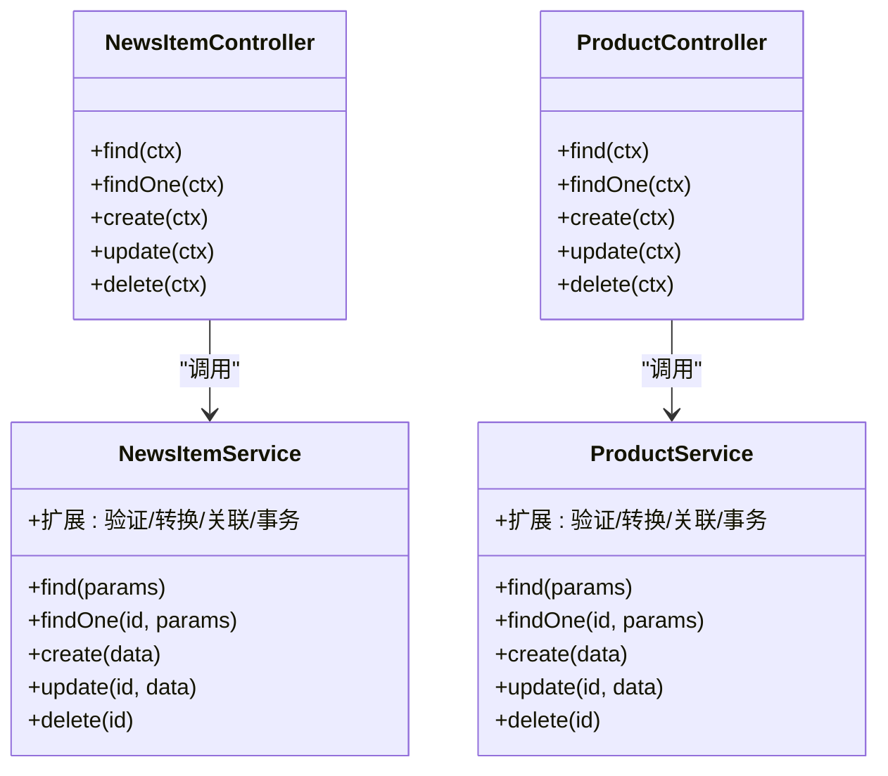
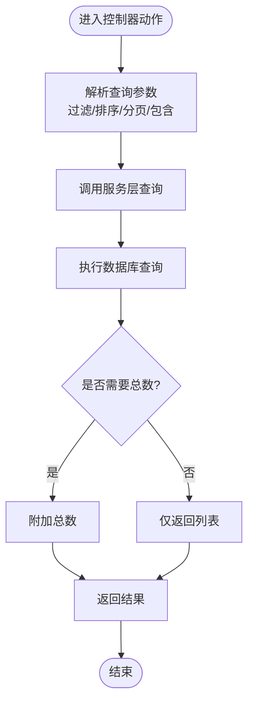
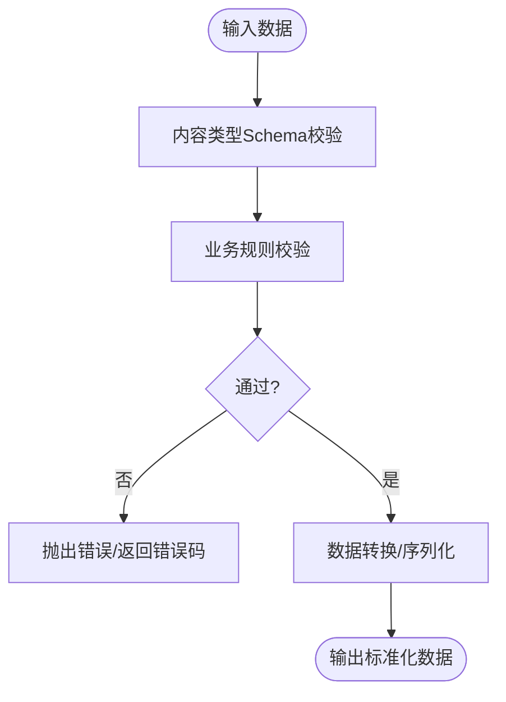
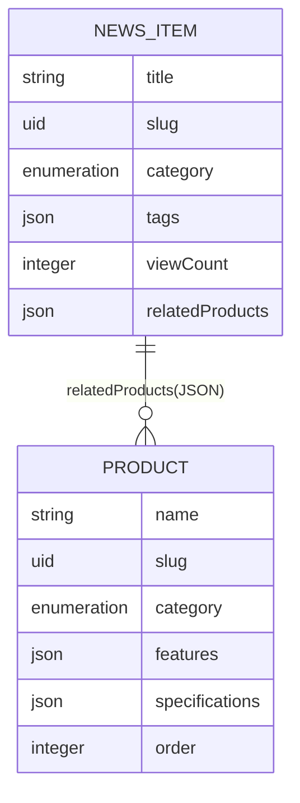
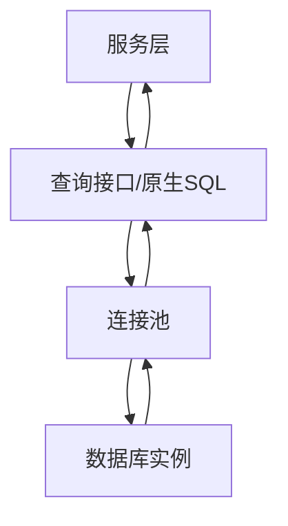
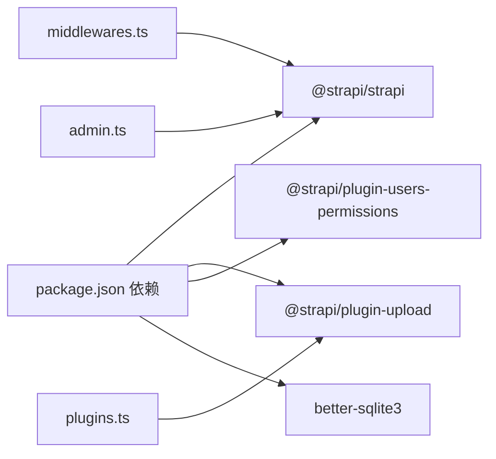

# API服务层

<cite>
**本文引用的文件**
- [backend/src/api/news-item/services/news-item.ts](file://backend/src/api/news-item/services/news-item.ts)
- [backend/src/api/product/services/product.ts](file://backend/src/api/product/services/product.ts)
- [backend/src/api/news-item/controllers/news-item.ts](file://backend/src/api/news-item/controllers/news-item.ts)
- [backend/src/api/product/controllers/product.ts](file://backend/src/api/product/controllers/product.ts)
- [backend/src/api/news-item/routes/news-item.ts](file://backend/src/api/news-item/routes/news-item.ts)
- [backend/src/api/product/routes/product.ts](file://backend/src/api/product/routes/product.ts)
- [backend/src/api/news-item/content-types/news-item/schema.json](file://backend/src/api/news-item/content-types/news-item/schema.json)
- [backend/src/api/product/content-types/product/schema.json](file://backend/src/api/product/content-types/product/schema.json)
- [backend/src/index.ts](file://backend/src/index.ts)
- [backend/config/api.ts](file://backend/config/api.ts)
- [backend/config/database.ts](file://backend/config/database.ts)
- [backend/config/middlewares.ts](file://backend/config/middlewares.ts)
- [backend/config/plugins.ts](file://backend/config/plugins.ts)
- [backend/config/admin.ts](file://backend/config/admin.ts)
- [backend/package.json](file://backend/package.json)
</cite>

## 目录
1. [引言](#引言)
2. [项目结构](#项目结构)
3. [核心组件](#核心组件)
4. [架构总览](#架构总览)
5. [详细组件分析](#详细组件分析)
6. [依赖分析](#依赖分析)
7. [性能考虑](#性能考虑)
8. [故障排查指南](#故障排查指南)
9. [结论](#结论)
10. [附录](#附录)

## 引言
本文件聚焦于后端API服务层的设计与实现，系统性阐述数据查询、验证、转换与持久化流程；解释服务层如何处理复杂数据关系、关联查询与事务管理；梳理缓存策略、性能优化与并发处理机制；说明服务层与数据库的交互模式（含查询构建器与SQL优化）；并给出服务层单元测试的编写方法与最佳实践。  
该Strapi项目采用“内容类型 + 控制器 + 路由 + 服务”的分层架构，News与Product两个内容类型通过Strapi核心工厂函数生成控制器与路由，并默认使用核心服务进行CRUD与查询扩展。

## 项目结构
后端采用模块化组织方式：每个内容类型（如news-item、product）包含独立的控制器、路由与服务目录，配合全局配置与入口脚本完成启动与权限初始化。

**图表来源**
- [backend/src/index.ts](file://backend/src/index.ts#L1-L65)
- [backend/config/api.ts](file://backend/config/api.ts#L1-L8)
- [backend/config/database.ts](file://backend/config/database.ts#L1-L61)
- [backend/config/middlewares.ts](file://backend/config/middlewares.ts#L1-L13)
- [backend/config/plugins.ts](file://backend/config/plugins.ts#L1-L11)
- [backend/config/admin.ts](file://backend/config/admin.ts#L1-L21)
- [backend/src/api/news-item/content-types/news-item/schema.json](file://backend/src/api/news-item/content-types/news-item/schema.json#L1-L65)
- [backend/src/api/product/content-types/product/schema.json](file://backend/src/api/product/content-types/product/schema.json#L1-L63)
- [backend/src/api/news-item/controllers/news-item.ts](file://backend/src/api/news-item/controllers/news-item.ts#L1-L4)
- [backend/src/api/product/controllers/product.ts](file://backend/src/api/product/controllers/product.ts#L1-L4)
- [backend/src/api/news-item/routes/news-item.ts](file://backend/src/api/news-item/routes/news-item.ts#L1-L4)
- [backend/src/api/product/routes/product.ts](file://backend/src/api/product/routes/product.ts#L1-L4)
- [backend/src/api/news-item/services/news-item.ts](file://backend/src/api/news-item/services/news-item.ts#L1-L4)
- [backend/src/api/product/services/product.ts](file://backend/src/api/product/services/product.ts#L1-L4)

**章节来源**
- [backend/src/index.ts](file://backend/src/index.ts#L1-L65)
- [backend/config/api.ts](file://backend/config/api.ts#L1-L8)
- [backend/config/database.ts](file://backend/config/database.ts#L1-L61)
- [backend/config/middlewares.ts](file://backend/config/middlewares.ts#L1-L13)
- [backend/config/plugins.ts](file://backend/config/plugins.ts#L1-L11)
- [backend/config/admin.ts](file://backend/config/admin.ts#L1-L21)
- [backend/src/api/news-item/content-types/news-item/schema.json](file://backend/src/api/news-item/content-types/news-item/schema.json#L1-L65)
- [backend/src/api/product/content-types/product/schema.json](file://backend/src/api/product/content-types/product/schema.json#L1-L63)
- [backend/src/api/news-item/controllers/news-item.ts](file://backend/src/api/news-item/controllers/news-item.ts#L1-L4)
- [backend/src/api/product/controllers/product.ts](file://backend/src/api/product/controllers/product.ts#L1-L4)
- [backend/src/api/news-item/routes/news-item.ts](file://backend/src/api/news-item/routes/news-item.ts#L1-L4)
- [backend/src/api/product/routes/product.ts](file://backend/src/api/product/routes/product.ts#L1-L4)
- [backend/src/api/news-item/services/news-item.ts](file://backend/src/api/news-item/services/news-item.ts#L1-L4)
- [backend/src/api/product/services/product.ts](file://backend/src/api/product/services/product.ts#L1-L4)

## 核心组件
- 内容类型（Content Types）
  - 新闻：包含标题、UID、摘要、富文本、分类枚举、单/多媒体、作者、是否精选、标签、浏览量、相关产品等字段。
  - 产品：包含名称、UID、简介、富文本描述、分类枚举、单/多媒体、特性与规格JSON、是否精选、排序、链接等字段。
- 控制器（Controllers）
  - 默认使用Strapi工厂函数生成控制器，负责HTTP请求到服务层的转发与响应封装。
- 路由（Routes）
  - 默认使用Strapi工厂函数生成REST路由，映射标准CRUD动作。
- 服务（Services）
  - 默认使用Strapi工厂函数生成核心服务，提供基础CRUD与查询能力；可在此扩展业务逻辑、验证、转换与事务处理。

上述组件在启动时由入口脚本自动注册，并对公共角色启用部分读取权限。

**章节来源**
- [backend/src/api/news-item/content-types/news-item/schema.json](file://backend/src/api/news-item/content-types/news-item/schema.json#L1-L65)
- [backend/src/api/product/content-types/product/schema.json](file://backend/src/api/product/content-types/product/schema.json#L1-L63)
- [backend/src/api/news-item/controllers/news-item.ts](file://backend/src/api/news-item/controllers/news-item.ts#L1-L4)
- [backend/src/api/product/controllers/product.ts](file://backend/src/api/product/controllers/product.ts#L1-L4)
- [backend/src/api/news-item/routes/news-item.ts](file://backend/src/api/news-item/routes/news-item.ts#L1-L4)
- [backend/src/api/product/routes/product.ts](file://backend/src/api/product/routes/product.ts#L1-L4)
- [backend/src/api/news-item/services/news-item.ts](file://backend/src/api/news-item/services/news-item.ts#L1-L4)
- [backend/src/api/product/services/product.ts](file://backend/src/api/product/services/product.ts#L1-L4)
- [backend/src/index.ts](file://backend/src/index.ts#L19-L62)

## 架构总览
下图展示从HTTP请求到数据库的完整调用链路，以及服务层在其中的角色定位。

**图表来源**
- [backend/config/middlewares.ts](file://backend/config/middlewares.ts#L1-L13)
- [backend/src/api/news-item/routes/news-item.ts](file://backend/src/api/news-item/routes/news-item.ts#L1-L4)
- [backend/src/api/product/routes/product.ts](file://backend/src/api/product/routes/product.ts#L1-L4)
- [backend/src/api/news-item/controllers/news-item.ts](file://backend/src/api/news-item/controllers/news-item.ts#L1-L4)
- [backend/src/api/product/controllers/product.ts](file://backend/src/api/product/controllers/product.ts#L1-L4)
- [backend/src/api/news-item/services/news-item.ts](file://backend/src/api/news-item/services/news-item.ts#L1-L4)
- [backend/src/api/product/services/product.ts](file://backend/src/api/product/services/product.ts#L1-L4)
- [backend/config/database.ts](file://backend/config/database.ts#L1-L61)

## 详细组件分析

### 服务层类与职责概览
服务层基于Strapi核心服务工厂，默认提供CRUD与查询能力。开发者可在现有服务基础上扩展以下职责：
- 数据验证：在写入前校验字段合法性与业务规则。
- 数据转换：统一输出格式、脱敏、序列化与派生字段计算。
- 关联查询：按需加载关联内容或聚合统计信息。
- 事务管理：在跨表写入时保证一致性。
- 缓存策略：热点数据缓存与失效策略。
- 性能优化：索引建议、查询优化、批量处理与分页限制。

**图表来源**
- [backend/src/api/news-item/services/news-item.ts](file://backend/src/api/news-item/services/news-item.ts#L1-L4)
- [backend/src/api/product/services/product.ts](file://backend/src/api/product/services/product.ts#L1-L4)
- [backend/src/api/news-item/controllers/news-item.ts](file://backend/src/api/news-item/controllers/news-item.ts#L1-L4)
- [backend/src/api/product/controllers/product.ts](file://backend/src/api/product/controllers/product.ts#L1-L4)

**章节来源**
- [backend/src/api/news-item/services/news-item.ts](file://backend/src/api/news-item/services/news-item.ts#L1-L4)
- [backend/src/api/product/services/product.ts](file://backend/src/api/product/services/product.ts#L1-L4)
- [backend/src/api/news-item/controllers/news-item.ts](file://backend/src/api/news-item/controllers/news-item.ts#L1-L4)
- [backend/src/api/product/controllers/product.ts](file://backend/src/api/product/controllers/product.ts#L1-L4)

### 数据查询与分页
- REST默认分页与数量限制：默认每页25条，最大100条，且返回总数。
- 查询参数：支持过滤、排序、包含关联、分页等标准参数，具体行为由Strapi路由与服务层组合决定。
- 计数返回：开启withCount以支持前端分页与总数展示。

**图表来源**
- [backend/config/api.ts](file://backend/config/api.ts#L1-L8)
- [backend/src/api/news-item/controllers/news-item.ts](file://backend/src/api/news-item/controllers/news-item.ts#L1-L4)
- [backend/src/api/product/controllers/product.ts](file://backend/src/api/product/controllers/product.ts#L1-L4)

**章节来源**
- [backend/config/api.ts](file://backend/config/api.ts#L1-L8)

### 数据验证与转换
- 字段级验证：利用内容类型schema中的必填、唯一、枚举等约束。
- 业务规则验证：在服务层扩展方法中添加自定义校验（如范围、组合条件）。
- 输出转换：统一返回结构、脱敏敏感字段、序列化富文本与JSON字段。
- UID与唯一性：通过UID字段确保URL友好与唯一索引。

**图表来源**
- [backend/src/api/news-item/content-types/news-item/schema.json](file://backend/src/api/news-item/content-types/news-item/schema.json#L1-L65)
- [backend/src/api/product/content-types/product/schema.json](file://backend/src/api/product/content-types/product/schema.json#L1-L63)

**章节来源**
- [backend/src/api/news-item/content-types/news-item/schema.json](file://backend/src/api/news-item/content-types/news-item/schema.json#L1-L65)
- [backend/src/api/product/content-types/product/schema.json](file://backend/src/api/product/content-types/product/schema.json#L1-L63)

### 关联查询与复杂关系
- 多媒体关联：单/多媒体字段用于图片与附件存储与返回。
- JSON字段：用于灵活结构（如特性、规格、标签），便于无固定模式的数据表达。
- 关联加载：可通过路由参数包含关联内容，减少N+1查询风险。
- 枚举字段：用于分类筛选与前端渲染。

**图表来源**
- [backend/src/api/news-item/content-types/news-item/schema.json](file://backend/src/api/news-item/content-types/news-item/schema.json#L1-L65)
- [backend/src/api/product/content-types/product/schema.json](file://backend/src/api/product/content-types/product/schema.json#L1-L63)

**章节来源**
- [backend/src/api/news-item/content-types/news-item/schema.json](file://backend/src/api/news-item/content-types/news-item/schema.json#L1-L65)
- [backend/src/api/product/content-types/product/schema.json](file://backend/src/api/product/content-types/product/schema.json#L1-L63)

### 事务管理与并发控制
- 事务：在跨表写入或强一致需求场景，使用事务包裹多个操作，失败回滚。
- 并发：结合数据库连接池与锁机制（如行级锁）避免竞态条件。
- 幂等：为写操作设计幂等键，防止重复提交导致的数据不一致。

[本节为通用指导，无需列出章节来源]

### 缓存策略与性能优化
- 缓存：热点内容（如首页、热门文章）采用内存/Redis缓存，设置合理TTL与失效策略。
- 索引：为常用过滤字段（如UID、分类、是否精选、排序字段）建立索引。
- 分页与总数：结合默认分页与总数返回，降低一次性传输数据量。
- 批量处理：导入/导出场景使用批量写入与流式处理，减少内存占用。
- SQL优化：避免SELECT *，只取必要字段；使用EXPLAIN分析慢查询；合理使用JOIN与子查询。

[本节为通用指导，无需列出章节来源]

### 服务层与数据库交互模式
- 连接配置：支持MySQL、PostgreSQL与SQLite，可配置SSL、连接池、超时等参数。
- 查询构建：通过Strapi查询接口与原生SQL混合使用，满足复杂查询需求。
- SQL优化：使用索引、限制返回列、避免N+1、分页与总数结合。

**图表来源**
- [backend/config/database.ts](file://backend/config/database.ts#L1-L61)

**章节来源**
- [backend/config/database.ts](file://backend/config/database.ts#L1-L61)

### 单元测试编写方法与最佳实践
- 测试框架：推荐使用Strapi内置测试工具或Jest。
- 模拟与桩：模拟数据库与外部依赖，隔离被测服务。
- 覆盖点：覆盖正常路径、边界值、异常分支与错误处理。
- 权限与安全：验证公开权限与鉴权逻辑。
- 性能测试：对热点查询与批量操作进行压力测试。

[本节为通用指导，无需列出章节来源]

## 依赖分析
- 启动依赖：Strapi核心、上传插件、用户权限插件、SQLite驱动等。
- 中间件：日志、错误、安全、CORS、查询解析、Body解析、静态资源等。
- 插件：本地上传提供者与大小限制。
- 管理端：JWT密钥、API Token盐、加密密钥与功能开关。

**图表来源**
- [backend/package.json](file://backend/package.json#L20-L29)
- [backend/config/middlewares.ts](file://backend/config/middlewares.ts#L1-L13)
- [backend/config/plugins.ts](file://backend/config/plugins.ts#L1-L11)
- [backend/config/admin.ts](file://backend/config/admin.ts#L1-L21)

**章节来源**
- [backend/package.json](file://backend/package.json#L20-L29)
- [backend/config/middlewares.ts](file://backend/config/middlewares.ts#L1-L13)
- [backend/config/plugins.ts](file://backend/config/plugins.ts#L1-L11)
- [backend/config/admin.ts](file://backend/config/admin.ts#L1-L21)

## 性能考虑
- 分页与总数：默认限制每页数量并返回总数，有助于前端分页与性能控制。
- 连接池：根据并发与数据库能力调整最小/最大连接数。
- 索引与查询：为高频过滤字段建立索引，避免全表扫描。
- 缓存：热点内容缓存与失效策略，降低数据库压力。
- 导入与批处理：使用脚本进行批量导入，避免高并发写入抖动。

[本节为通用指导，无需列出章节来源]

## 故障排查指南
- 权限问题：确认公共角色已启用相应读取动作（find/findOne）。
- 数据库连接：检查连接字符串、SSL配置、连接池参数与超时设置。
- 中间件顺序：确保query/body等中间件顺序正确，避免参数解析失败。
- 上传限制：确认上传大小限制与本地提供者配置。

**章节来源**
- [backend/src/index.ts](file://backend/src/index.ts#L19-L62)
- [backend/config/database.ts](file://backend/config/database.ts#L1-L61)
- [backend/config/middlewares.ts](file://backend/config/middlewares.ts#L1-L13)
- [backend/config/plugins.ts](file://backend/config/plugins.ts#L1-L11)

## 结论
本项目的服务层以Strapi核心服务为基础，通过控制器与路由形成清晰的HTTP接入层，结合内容类型Schema实现数据模型与约束。默认服务层具备良好的CRUD与查询能力，适合在服务层扩展验证、转换、关联查询与事务管理。配合合理的缓存、索引与分页策略，可有效提升整体性能与用户体验。建议在服务层增加单元测试与性能监控，持续保障稳定性与可维护性。

## 附录
- 入口脚本：在启动阶段为公共角色启用读取权限，确保API可访问。
- 配置要点：REST默认分页、数据库连接与SSL、中间件与插件配置、管理端密钥与令牌盐。

**章节来源**
- [backend/src/index.ts](file://backend/src/index.ts#L19-L62)
- [backend/config/api.ts](file://backend/config/api.ts#L1-L8)
- [backend/config/database.ts](file://backend/config/database.ts#L1-L61)
- [backend/config/middlewares.ts](file://backend/config/middlewares.ts#L1-L13)
- [backend/config/plugins.ts](file://backend/config/plugins.ts#L1-L11)
- [backend/config/admin.ts](file://backend/config/admin.ts#L1-L21)