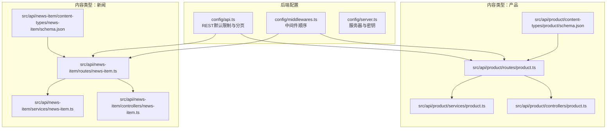
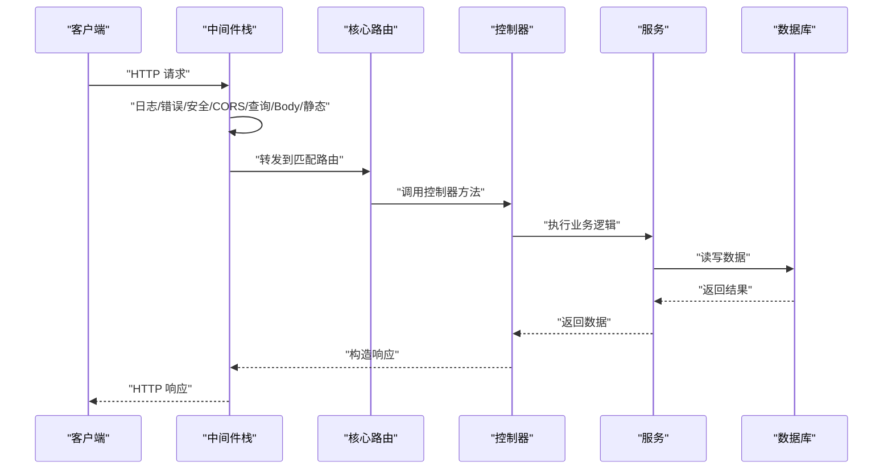
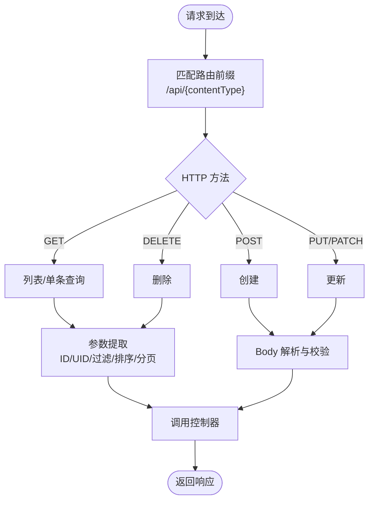
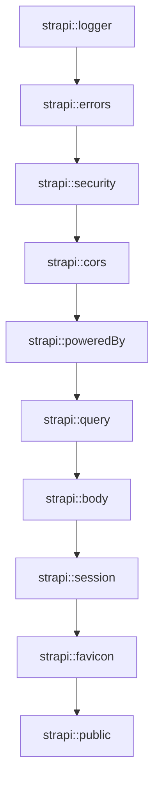
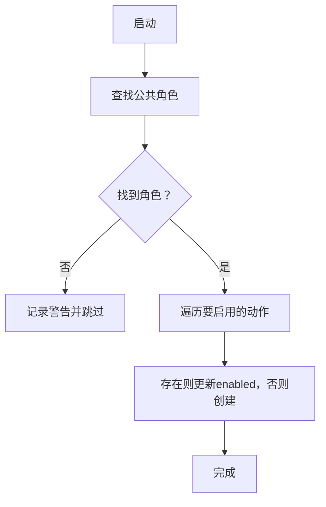
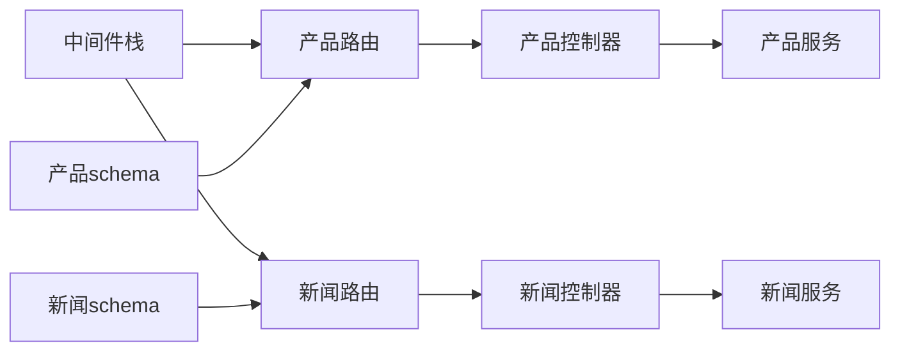

# API路由层

<cite>
**本文引用的文件**
- [backend/src/index.ts](file://backend/src/index.ts)
- [backend/config/api.ts](file://backend/config/api.ts)
- [backend/config/middlewares.ts](file://backend/config/middlewares.ts)
- [backend/config/server.ts](file://backend/config/server.ts)
- [backend/src/api/news-item/routes/news-item.ts](file://backend/src/api/news-item/routes/news-item.ts)
- [backend/src/api/product/routes/product.ts](file://backend/src/api/product/routes/product.ts)
- [backend/src/api/news-item/controllers/news-item.ts](file://backend/src/api/news-item/controllers/news-item.ts)
- [backend/src/api/product/controllers/product.ts](file://backend/src/api/product/controllers/product.ts)
- [backend/src/api/news-item/services/news-item.ts](file://backend/src/api/news-item/services/news-item.ts)
- [backend/src/api/product/services/product.ts](file://backend/src/api/product/services/product.ts)
- [backend/src/api/news-item/content-types/news-item/schema.json](file://backend/src/api/news-item/content-types/news-item/schema.json)
- [backend/src/api/product/content-types/product/schema.json](file://backend/src/api/product/content-types/product/schema.json)
- [backend/package.json](file://backend/package.json)
</cite>

## 目录
1. [引言](#引言)
2. [项目结构](#项目结构)
3. [核心组件](#核心组件)
4. [架构总览](#架构总览)
5. [详细组件分析](#详细组件分析)
6. [依赖关系分析](#依赖关系分析)
7. [性能考虑](#性能考虑)
8. [故障排查指南](#故障排查指南)
9. [结论](#结论)
10. [附录](#附录)

## 引言
本文件系统性梳理后端API路由层的设计与实现，围绕Strapi的RESTful路由定义、HTTP方法映射、URL模式匹配与参数提取、中间件配置与执行顺序、错误处理与异常捕获、路由扩展与动态路由、嵌套路由实践、性能优化与安全防护等主题展开。目标是帮助开发者快速理解并高效维护该系统的API路由层。

## 项目结构
后端采用Strapi的约定式目录结构：每个内容类型（如产品、新闻）在src/api下拥有独立的routes、controllers、services与content-types目录；全局配置位于backend/config目录；应用入口与初始化逻辑位于backend/src/index.ts。



**图表来源**
- [backend/config/api.ts](file://backend/config/api.ts#L1-L8)
- [backend/config/middlewares.ts](file://backend/config/middlewares.ts#L1-L13)
- [backend/config/server.ts](file://backend/config/server.ts#L1-L8)
- [backend/src/api/product/routes/product.ts](file://backend/src/api/product/routes/product.ts#L1-L4)
- [backend/src/api/news-item/routes/news-item.ts](file://backend/src/api/news-item/routes/news-item.ts#L1-L4)
- [backend/src/api/product/controllers/product.ts](file://backend/src/api/product/controllers/product.ts#L1-L4)
- [backend/src/api/news-item/controllers/news-item.ts](file://backend/src/api/news-item/controllers/news-item.ts#L1-L4)
- [backend/src/api/product/services/product.ts](file://backend/src/api/product/services/product.ts#L1-L4)
- [backend/src/api/news-item/services/news-item.ts](file://backend/src/api/news-item/services/news-item.ts#L1-L4)
- [backend/src/api/product/content-types/product/schema.json](file://backend/src/api/product/content-types/product/schema.json#L1-L63)
- [backend/src/api/news-item/content-types/news-item/schema.json](file://backend/src/api/news-item/content-types/news-item/schema.json#L1-L65)

**章节来源**
- [backend/config/api.ts](file://backend/config/api.ts#L1-L8)
- [backend/config/middlewares.ts](file://backend/config/middlewares.ts#L1-L13)
- [backend/config/server.ts](file://backend/config/server.ts#L1-L8)
- [backend/src/api/product/routes/product.ts](file://backend/src/api/product/routes/product.ts#L1-L4)
- [backend/src/api/news-item/routes/news-item.ts](file://backend/src/api/news-item/routes/news-item.ts#L1-L4)
- [backend/src/api/product/controllers/product.ts](file://backend/src/api/product/controllers/product.ts#L1-L4)
- [backend/src/api/news-item/controllers/news-item.ts](file://backend/src/api/news-item/controllers/news-item.ts#L1-L4)
- [backend/src/api/product/services/product.ts](file://backend/src/api/product/services/product.ts#L1-L4)
- [backend/src/api/news-item/services/news-item.ts](file://backend/src/api/news-item/services/news-item.ts#L1-L4)
- [backend/src/api/product/content-types/product/schema.json](file://backend/src/api/product/content-types/product/schema.json#L1-L63)
- [backend/src/api/news-item/content-types/news-item/schema.json](file://backend/src/api/news-item/content-types/news-item/schema.json#L1-L65)

## 核心组件
- 路由定义：通过createCoreRouter为内容类型生成REST路由，自动映射标准HTTP方法与URL模式。
- 控制器：通过createCoreController绑定业务逻辑，负责请求处理与响应返回。
- 服务：通过createCoreService封装数据访问与业务规则，供控制器调用。
- 全局REST配置：统一REST接口的分页、最大限制与计数行为。
- 中间件栈：按序执行日志、错误、安全、CORS、查询、Body解析、静态资源等处理。
- 初始化脚手架：在启动时为公共角色启用公开读取权限，确保前端可访问。

**章节来源**
- [backend/src/api/product/routes/product.ts](file://backend/src/api/product/routes/product.ts#L1-L4)
- [backend/src/api/news-item/routes/news-item.ts](file://backend/src/api/news-item/routes/news-item.ts#L1-L4)
- [backend/src/api/product/controllers/product.ts](file://backend/src/api/product/controllers/product.ts#L1-L4)
- [backend/src/api/news-item/controllers/news-item.ts](file://backend/src/api/news-item/controllers/news-item.ts#L1-L4)
- [backend/src/api/product/services/product.ts](file://backend/src/api/product/services/product.ts#L1-L4)
- [backend/src/api/news-item/services/news-item.ts](file://backend/src/api/news-item/services/news-item.ts#L1-L4)
- [backend/config/api.ts](file://backend/config/api.ts#L1-L8)
- [backend/config/middlewares.ts](file://backend/config/middlewares.ts#L1-L13)
- [backend/src/index.ts](file://backend/src/index.ts#L1-L65)

## 架构总览
下图展示从客户端到数据库的典型请求路径，以及中间件在其中的职责分工。



**图表来源**
- [backend/config/middlewares.ts](file://backend/config/middlewares.ts#L1-L13)
- [backend/src/api/product/routes/product.ts](file://backend/src/api/product/routes/product.ts#L1-L4)
- [backend/src/api/news-item/routes/news-item.ts](file://backend/src/api/news-item/routes/news-item.ts#L1-L4)
- [backend/src/api/product/controllers/product.ts](file://backend/src/api/product/controllers/product.ts#L1-L4)
- [backend/src/api/news-item/controllers/news-item.ts](file://backend/src/api/news-item/controllers/news-item.ts#L1-L4)
- [backend/src/api/product/services/product.ts](file://backend/src/api/product/services/product.ts#L1-L4)
- [backend/src/api/news-item/services/news-item.ts](file://backend/src/api/news-item/services/news-item.ts#L1-L4)

## 详细组件分析

### 路由定义与HTTP方法映射
- 产品与新闻两个内容类型均使用createCoreRouter创建核心路由，遵循Strapi的REST约定：
  - GET /api/products → 列表查询
  - GET /api/products/:id → 单条查询
  - POST /api/products → 创建
  - PUT/PATCH /api/products/:id → 更新
  - DELETE /api/products/:id → 删除
- URL模式基于内容类型的UID字段（slug）支持更友好的路径语义，例如通过slug进行单条查询或详情访问。



**图表来源**
- [backend/src/api/product/routes/product.ts](file://backend/src/api/product/routes/product.ts#L1-L4)
- [backend/src/api/news-item/routes/news-item.ts](file://backend/src/api/news-item/routes/news-item.ts#L1-L4)
- [backend/config/api.ts](file://backend/config/api.ts#L1-L8)

**章节来源**
- [backend/src/api/product/routes/product.ts](file://backend/src/api/product/routes/product.ts#L1-L4)
- [backend/src/api/news-item/routes/news-item.ts](file://backend/src/api/news-item/routes/news-item.ts#L1-L4)
- [backend/config/api.ts](file://backend/config/api.ts#L1-L8)

### 参数提取与URL模式匹配
- UID字段（slug）作为URL路径的一部分，用于精确匹配内容项，提升可读性与SEO友好度。
- REST配置中的defaultLimit、maxLimit与withCount控制分页与总数返回，避免一次性返回过多数据。

**章节来源**
- [backend/src/api/product/content-types/product/schema.json](file://backend/src/api/product/content-types/product/schema.json#L1-L63)
- [backend/src/api/news-item/content-types/news-item/schema.json](file://backend/src/api/news-item/content-types/news-item/schema.json#L1-L65)
- [backend/config/api.ts](file://backend/config/api.ts#L1-L8)

### 控制器与服务协作
- 控制器负责接收请求、参数校验与响应格式化，并调用对应服务。
- 服务封装业务规则与数据访问，便于单元测试与复用。

```mermaid
classDiagram
class 路由 {
+"匹配URL前缀"
+"/api/{contentType}"
}
class 控制器 {
+handleList()
+handleOne()
+handleCreate()
+handleUpdate()
+handleDelete()
}
class 服务 {
+findMany()
+findOne()
+create()
+update()
+delete()
}
路由 --> 控制器 : "调用"
控制器 --> 服务 : "委托"
```

**图表来源**
- [backend/src/api/product/routes/product.ts](file://backend/src/api/product/routes/product.ts#L1-L4)
- [backend/src/api/news-item/routes/news-item.ts](file://backend/src/api/news-item/routes/news-item.ts#L1-L4)
- [backend/src/api/product/controllers/product.ts](file://backend/src/api/product/controllers/product.ts#L1-L4)
- [backend/src/api/news-item/controllers/news-item.ts](file://backend/src/api/news-item/controllers/news-item.ts#L1-L4)
- [backend/src/api/product/services/product.ts](file://backend/src/api/product/services/product.ts#L1-L4)
- [backend/src/api/news-item/services/news-item.ts](file://backend/src/api/news-item/services/news-item.ts#L1-L4)

**章节来源**
- [backend/src/api/product/controllers/product.ts](file://backend/src/api/product/controllers/product.ts#L1-L4)
- [backend/src/api/news-item/controllers/news-item.ts](file://backend/src/api/news-item/controllers/news-item.ts#L1-L4)
- [backend/src/api/product/services/product.ts](file://backend/src/api/product/services/product.ts#L1-L4)
- [backend/src/api/news-item/services/news-item.ts](file://backend/src/api/news-item/services/news-item.ts#L1-L4)

### 中间件配置与执行顺序
- 中间件顺序严格决定请求处理链路，常见顺序如下：
  1) 日志与错误：记录请求与异常
  2) 安全与CORS：设置安全头与跨域策略
  3) poweredBy：添加服务器标识
  4) 查询参数：解析查询字符串
  5) Body解析：JSON/上传等
  6) Session与Favicon：会话与静态资源
  7) 静态资源：public目录
- CORS中间件允许跨域访问，结合安全中间件共同保障接口安全。



**图表来源**
- [backend/config/middlewares.ts](file://backend/config/middlewares.ts#L1-L13)

**章节来源**
- [backend/config/middlewares.ts](file://backend/config/middlewares.ts#L1-L13)

### 错误处理与异常捕获
- 错误中间件负责捕获未处理异常并输出标准化错误响应。
- 结合REST配置的withCount与分页限制，避免异常导致的资源泄露或超大响应体。

**章节来源**
- [backend/config/middlewares.ts](file://backend/config/middlewares.ts#L1-L13)
- [backend/config/api.ts](file://backend/config/api.ts#L1-L8)

### 权限与公开访问控制
- 启动阶段为“public”角色启用产品与新闻的读取权限，确保匿名用户可访问列表与详情。
- 该逻辑通过查询插件权限表实现，若角色不存在则跳过并记录告警。



**图表来源**
- [backend/src/index.ts](file://backend/src/index.ts#L19-L62)

**章节来源**
- [backend/src/index.ts](file://backend/src/index.ts#L1-L65)

### 路由扩展、动态路由与嵌套路由
- 扩展方式：通过自定义路由文件覆盖或补充核心路由，或在控制器中增加自定义动作。
- 动态路由：利用UID字段与查询参数实现动态路径与筛选。
- 嵌套路由：可通过模块化目录结构组织子路由（例如在内容类型下新增子模块），并在父级路由中挂载。

[本节为通用实践指导，不直接分析具体文件，故无章节来源]

### 性能优化与缓存策略
- 分页与限制：通过REST配置限制单次查询数量，降低内存与带宽压力。
- 缓存建议：对热点列表与详情可引入Redis缓存，注意版本化键名与失效策略。
- 数据库索引：为常用查询字段（如slug、分类、发布时间）建立索引。
- 压缩与静态资源：开启Gzip压缩与浏览器缓存，减少静态资源传输时间。

**章节来源**
- [backend/config/api.ts](file://backend/config/api.ts#L1-L8)
- [backend/package.json](file://backend/package.json#L1-L45)

### 安全防护措施
- 安全中间件：统一设置安全头，防止常见Web攻击。
- CORS中间件：明确允许来源、方法与头，避免过度放行。
- 认证与授权：结合用户权限插件，仅对公开内容开放读取权限。
- 密钥管理：服务器密钥通过环境变量配置，避免硬编码。

**章节来源**
- [backend/config/middlewares.ts](file://backend/config/middlewares.ts#L1-L13)
- [backend/config/server.ts](file://backend/config/server.ts#L1-L8)
- [backend/src/index.ts](file://backend/src/index.ts#L1-L65)

## 依赖关系分析
- 路由依赖于控制器与服务，控制器依赖于服务，形成清晰的分层。
- 中间件对所有路由生效，且顺序固定，影响请求处理的每个环节。
- 内容类型schema决定URL模式与参数约束，从而影响路由匹配与参数提取。



**图表来源**
- [backend/config/middlewares.ts](file://backend/config/middlewares.ts#L1-L13)
- [backend/src/api/product/routes/product.ts](file://backend/src/api/product/routes/product.ts#L1-L4)
- [backend/src/api/news-item/routes/news-item.ts](file://backend/src/api/news-item/routes/news-item.ts#L1-L4)
- [backend/src/api/product/controllers/product.ts](file://backend/src/api/product/controllers/product.ts#L1-L4)
- [backend/src/api/news-item/controllers/news-item.ts](file://backend/src/api/news-item/controllers/news-item.ts#L1-L4)
- [backend/src/api/product/services/product.ts](file://backend/src/api/product/services/product.ts#L1-L4)
- [backend/src/api/news-item/services/news-item.ts](file://backend/src/api/news-item/services/news-item.ts#L1-L4)
- [backend/src/api/product/content-types/product/schema.json](file://backend/src/api/product/content-types/product/schema.json#L1-L63)
- [backend/src/api/news-item/content-types/news-item/schema.json](file://backend/src/api/news-item/content-types/news-item/schema.json#L1-L65)

**章节来源**
- [backend/src/api/product/routes/product.ts](file://backend/src/api/product/routes/product.ts#L1-L4)
- [backend/src/api/news-item/routes/news-item.ts](file://backend/src/api/news-item/routes/news-item.ts#L1-L4)
- [backend/src/api/product/controllers/product.ts](file://backend/src/api/product/controllers/product.ts#L1-L4)
- [backend/src/api/news-item/controllers/news-item.ts](file://backend/src/api/news-item/controllers/news-item.ts#L1-L4)
- [backend/src/api/product/services/product.ts](file://backend/src/api/product/services/product.ts#L1-L4)
- [backend/src/api/news-item/services/news-item.ts](file://backend/src/api/news-item/services/news-item.ts#L1-L4)
- [backend/src/api/product/content-types/product/schema.json](file://backend/src/api/product/content-types/product/schema.json#L1-L63)
- [backend/src/api/news-item/content-types/news-item/schema.json](file://backend/src/api/news-item/content-types/news-item/schema.json#L1-L65)

## 性能考虑
- REST分页与限制：合理设置defaultLimit与maxLimit，避免一次性拉取大量数据。
- 并发与连接池：根据负载调整数据库连接池大小与超时设置。
- CDN与静态资源：将图片与媒体资源托管至CDN，减轻服务器压力。
- 响应压缩：开启Gzip/Brotli压缩，降低网络传输体积。

**章节来源**
- [backend/config/api.ts](file://backend/config/api.ts#L1-L8)
- [backend/package.json](file://backend/package.json#L1-L45)

## 故障排查指南
- 无法访问公开内容：检查启动脚本是否成功为公共角色启用相应权限。
- CORS报错：核对CORS中间件配置与允许来源、方法、头。
- 分页异常：确认REST配置中的limit与count设置是否符合预期。
- 中间件顺序问题：若出现日志缺失或安全头未生效，检查中间件顺序与自定义中间件插入位置。

**章节来源**
- [backend/src/index.ts](file://backend/src/index.ts#L1-L65)
- [backend/config/middlewares.ts](file://backend/config/middlewares.ts#L1-L13)
- [backend/config/api.ts](file://backend/config/api.ts#L1-L8)

## 结论
本项目的API路由层以Strapi核心路由为基础，通过清晰的三层结构（路由→控制器→服务）与严格的中间件顺序，实现了RESTful接口的稳定运行。配合公开权限的自动配置、合理的REST分页与安全中间件，既保证了易用性也兼顾了安全性。后续可在缓存、CDN与数据库索引方面进一步优化性能。

## 附录
- 关键配置一览
  - REST默认限制与分页：见[backend/config/api.ts](file://backend/config/api.ts#L1-L8)
  - 中间件顺序：见[backend/config/middlewares.ts](file://backend/config/middlewares.ts#L1-L13)
  - 服务器密钥：见[backend/config/server.ts](file://backend/config/server.ts#L1-L8)
  - 启动时权限初始化：见[backend/src/index.ts](file://backend/src/index.ts#L1-L65)