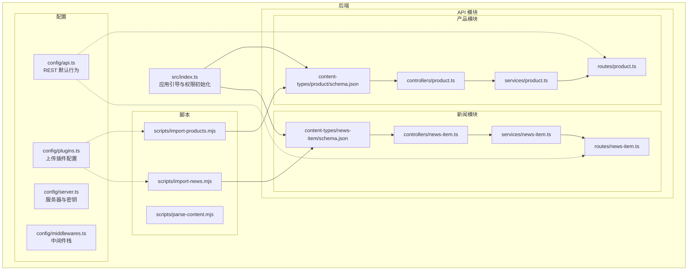
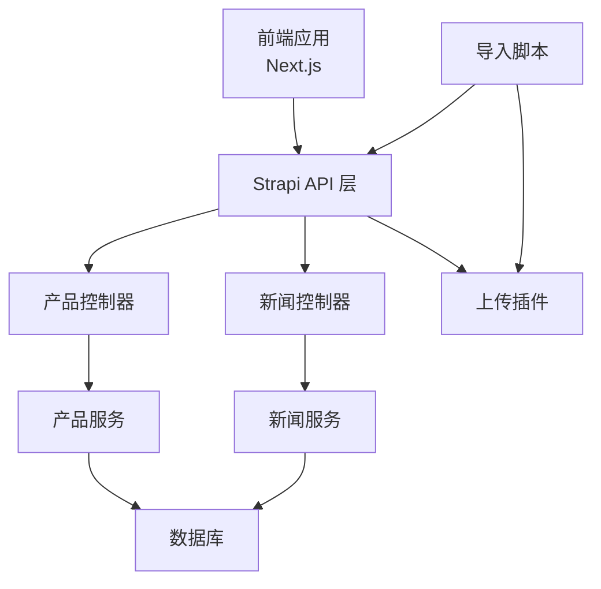
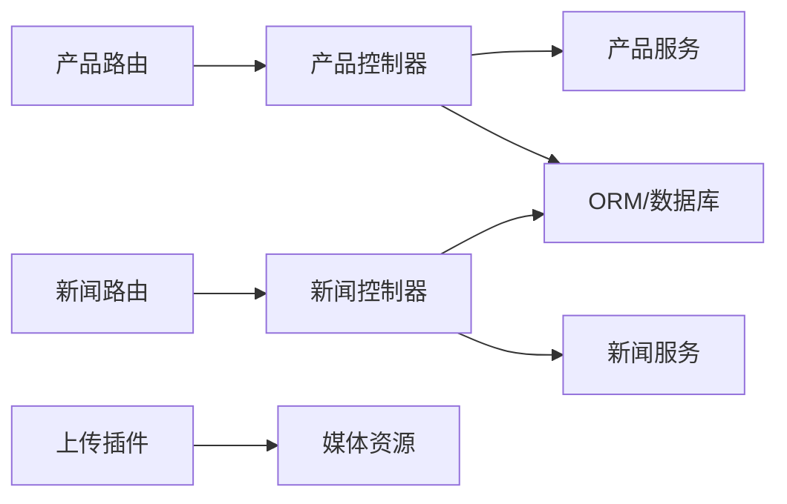
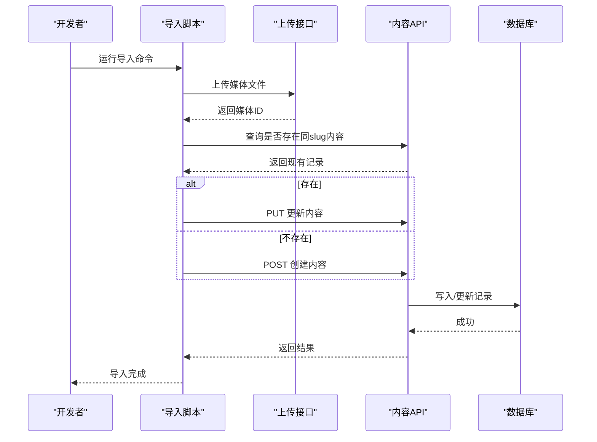

# 内容管理API设计

<cite>
**本文档引用的文件**
- [backend/src/index.ts](file://backend/src/index.ts)
- [backend/package.json](file://backend/package.json)
- [backend/src/api/product/content-types/product/schema.json](file://backend/src/api/product/content-types/product/schema.json)
- [backend/src/api/news-item/content-types/news-item/schema.json](file://backend/src/api/news-item/content-types/news-item/schema.json)
- [backend/src/api/product/controllers/product.ts](file://backend/src/api/product/controllers/product.ts)
- [backend/src/api/news-item/controllers/news-item.ts](file://backend/src/api/news-item/controllers/news-item.ts)
- [backend/src/api/product/routes/product.ts](file://backend/src/api/product/routes/product.ts)
- [backend/src/api/news-item/routes/news-item.ts](file://backend/src/api/news-item/routes/news-item.ts)
- [backend/src/api/product/services/product.ts](file://backend/src/api/product/services/product.ts)
- [backend/src/api/news-item/services/news-item.ts](file://backend/src/api/news-item/services/news-item.ts)
- [backend/config/api.ts](file://backend/config/api.ts)
- [backend/config/plugins.ts](file://backend/config/plugins.ts)
- [backend/config/server.ts](file://backend/config/server.ts)
- [backend/config/middlewares.ts](file://backend/config/middlewares.ts)
- [backend/scripts/import-products.mjs](file://backend/scripts/import-products.mjs)
- [backend/scripts/import-news.mjs](file://backend/scripts/import-news.mjs)
- [backend/scripts/parse-content.mjs](file://backend/scripts/parse-content.mjs)
- [backend/types/generated/contentTypes.d.ts](file://backend/types/generated/contentTypes.d.ts)
- [frontend/lib/strapi.ts](file://frontend/lib/strapi.ts)
</cite>

## 目录
1. [简介](#简介)
2. [项目结构](#项目结构)
3. [核心组件](#核心组件)
4. [架构总览](#架构总览)
5. [详细组件分析](#详细组件分析)
6. [依赖分析](#依赖分析)
7. [性能考虑](#性能考虑)
8. [故障排除指南](#故障排除指南)
9. [结论](#结论)
10. [附录](#附录)

## 简介
本设计文档面向基于 Strapi 的内容管理 API，聚焦于产品 API（product）与新闻 API（news-item）的完整实现。文档从架构、控制器（controllers）、服务层（services）、路由（routes）、数据模型、安全机制、分页与查询、以及导入脚本等维度进行系统化梳理，帮助开发者快速理解并扩展该 API。

## 项目结构
后端采用 Strapi 核心目录结构，按功能域划分 API 模块：每个模块包含内容类型定义、控制器、服务与路由；另有全局配置与脚本工具用于上传、导入与解析前端内容。



图表来源
- [backend/src/index.ts](file://backend/src/index.ts#L19-L62)
- [backend/src/api/product/content-types/product/schema.json](file://backend/src/api/product/content-types/product/schema.json#L1-L63)
- [backend/src/api/news-item/content-types/news-item/schema.json](file://backend/src/api/news-item/content-types/news-item/schema.json#L1-L65)
- [backend/src/api/product/controllers/product.ts](file://backend/src/api/product/controllers/product.ts#L1-L4)
- [backend/src/api/news-item/controllers/news-item.ts](file://backend/src/api/news-item/controllers/news-item.ts#L1-L4)
- [backend/src/api/product/routes/product.ts](file://backend/src/api/product/routes/product.ts#L1-L4)
- [backend/src/api/news-item/routes/news-item.ts](file://backend/src/api/news-item/routes/news-item.ts#L1-L4)
- [backend/src/api/product/services/product.ts](file://backend/src/api/product/services/product.ts#L1-L4)
- [backend/src/api/news-item/services/news-item.ts](file://backend/src/api/news-item/services/news-item.ts#L1-L4)
- [backend/config/api.ts](file://backend/config/api.ts#L1-L8)
- [backend/config/plugins.ts](file://backend/config/plugins.ts#L1-L11)
- [backend/config/server.ts](file://backend/config/server.ts#L1-L8)
- [backend/config/middlewares.ts](file://backend/config/middlewares.ts#L1-L13)
- [backend/scripts/import-products.mjs](file://backend/scripts/import-products.mjs#L1-L163)
- [backend/scripts/import-news.mjs](file://backend/scripts/import-news.mjs#L1-L157)

章节来源
- [backend/src/index.ts](file://backend/src/index.ts#L1-L65)
- [backend/package.json](file://backend/package.json#L1-L45)

## 核心组件
- 应用引导与权限初始化：在启动阶段为公共角色启用产品与新闻的查询权限，确保前台可读取发布内容。
- 产品 API：提供产品列表、详情查询，支持 UID 唯一标识、富文本描述、媒体图集、JSON 扩展字段等。
- 新闻 API：提供新闻列表、详情查询，支持分类枚举、作者、标签、浏览量、关联产品等。
- 路由与控制器：使用 Strapi 工厂函数自动生成 CRUD 路由与核心控制器，减少样板代码。
- 服务层：默认工厂服务，便于后续扩展业务逻辑与数据处理。
- 配置：REST 分页限制、上传大小限制、服务器密钥、中间件顺序等。

章节来源
- [backend/src/index.ts](file://backend/src/index.ts#L19-L62)
- [backend/src/api/product/content-types/product/schema.json](file://backend/src/api/product/content-types/product/schema.json#L1-L63)
- [backend/src/api/news-item/content-types/news-item/schema.json](file://backend/src/api/news-item/content-types/news-item/schema.json#L1-L65)
- [backend/src/api/product/controllers/product.ts](file://backend/src/api/product/controllers/product.ts#L1-L4)
- [backend/src/api/news-item/controllers/news-item.ts](file://backend/src/api/news-item/controllers/news-item.ts#L1-L4)
- [backend/src/api/product/routes/product.ts](file://backend/src/api/product/routes/product.ts#L1-L4)
- [backend/src/api/news-item/routes/news-item.ts](file://backend/src/api/news-item/routes/news-item.ts#L1-L4)
- [backend/src/api/product/services/product.ts](file://backend/src/api/product/services/product.ts#L1-L4)
- [backend/src/api/news-item/services/news-item.ts](file://backend/src/api/news-item/services/news-item.ts#L1-L4)
- [backend/config/api.ts](file://backend/config/api.ts#L1-L8)
- [backend/config/plugins.ts](file://backend/config/plugins.ts#L1-L11)
- [backend/config/server.ts](file://backend/config/server.ts#L1-L8)
- [backend/config/middlewares.ts](file://backend/config/middlewares.ts#L1-L13)

## 架构总览
下图展示前后端交互与 API 生命周期：前端通过 Next.js 应用调用 Strapi 后端，后端根据路由映射到控制器，控制器委托服务层执行数据访问，最终返回标准化响应；上传与导入脚本独立运行以维护内容与媒体资源。



图表来源
- [frontend/lib/strapi.ts](file://frontend/lib/strapi.ts#L100-L155)
- [backend/src/api/product/controllers/product.ts](file://backend/src/api/product/controllers/product.ts#L1-L4)
- [backend/src/api/news-item/controllers/news-item.ts](file://backend/src/api/news-item/controllers/news-item.ts#L1-L4)
- [backend/src/api/product/services/product.ts](file://backend/src/api/product/services/product.ts#L1-L4)
- [backend/src/api/news-item/services/news-item.ts](file://backend/src/api/news-item/services/news-item.ts#L1-L4)
- [backend/config/plugins.ts](file://backend/config/plugins.ts#L1-L11)
- [backend/scripts/import-products.mjs](file://backend/scripts/import-products.mjs#L1-L163)
- [backend/scripts/import-news.mjs](file://backend/scripts/import-news.mjs#L1-L157)

## 详细组件分析

### 产品 API（product）
- 数据模型与字段
  - 名称、唯一 slug、简述、富文本描述、分类枚举、主图与画廊媒体、JSON 扩展字段、布尔推荐位、整数排序、链接等。
  - 支持草稿与发布（draftAndPublish），便于预览与上线控制。
- 控制器与路由
  - 使用核心控制器工厂，自动暴露标准 CRUD 路由。
- 服务层
  - 使用核心服务工厂，默认行为由 Strapi ORM 提供，便于扩展业务逻辑。
- 查询与分页
  - REST 默认分页限制与最大限制由配置统一设定，支持计数返回。
- 安全与权限
  - 启动时为公共角色启用产品查询权限，确保前台可读取已发布内容。

```mermaid
classDiagram
class 产品内容类型 {
"+名称"
"+唯一slug"
"+简述"
"+富文本描述"
"+分类枚举"
"+主图媒体"
"+画廊媒体"
"+JSON扩展"
"+布尔推荐位"
"+整数排序"
"+链接"
}
class 产品控制器 {
"+标准CRUD路由"
}
class 产品服务 {
"+默认服务工厂"
}
产品内容类型 --> 产品控制器 : "被控制器映射"
产品控制器 --> 产品服务 : "委托数据处理"
```

图表来源
- [backend/src/api/product/content-types/product/schema.json](file://backend/src/api/product/content-types/product/schema.json#L1-L63)
- [backend/src/api/product/controllers/product.ts](file://backend/src/api/product/controllers/product.ts#L1-L4)
- [backend/src/api/product/services/product.ts](file://backend/src/api/product/services/product.ts#L1-L4)

章节来源
- [backend/src/api/product/content-types/product/schema.json](file://backend/src/api/product/content-types/product/schema.json#L1-L63)
- [backend/src/api/product/controllers/product.ts](file://backend/src/api/product/controllers/product.ts#L1-L4)
- [backend/src/api/product/services/product.ts](file://backend/src/api/product/services/product.ts#L1-L4)
- [backend/config/api.ts](file://backend/config/api.ts#L1-L8)
- [backend/src/index.ts](file://backend/src/index.ts#L29-L60)

### 新闻 API（news-item）
- 数据模型与字段
  - 标题、唯一 slug、摘要、富文本内容、分类枚举、主图与附件媒体、作者、布尔推荐位、标签 JSON、浏览量、关联产品 JSON 等。
  - 支持草稿与发布（draftAndPublish）。
- 控制器与路由
  - 使用核心控制器工厂，自动暴露标准 CRUD 路由。
- 服务层
  - 使用核心服务工厂，默认行为由 Strapi ORM 提供。
- 查询与分页
  - REST 默认分页限制与最大限制由配置统一设定，支持计数返回。

```mermaid
classDiagram
class 新闻内容类型 {
"+标题"
"+唯一slug"
"+摘要"
"+富文本内容"
"+分类枚举"
"+主图媒体"
"+附件媒体"
"+作者"
"+布尔推荐位"
"+标签JSON"
"+浏览量"
"+关联产品JSON"
}
class 新闻控制器 {
"+标准CRUD路由"
}
class 新闻服务 {
"+默认服务工厂"
}
新闻内容类型 --> 新闻控制器 : "被控制器映射"
新闻控制器 --> 新闻服务 : "委托数据处理"
```

图表来源
- [backend/src/api/news-item/content-types/news-item/schema.json](file://backend/src/api/news-item/content-types/news-item/schema.json#L1-L65)
- [backend/src/api/news-item/controllers/news-item.ts](file://backend/src/api/news-item/controllers/news-item.ts#L1-L4)
- [backend/src/api/news-item/services/news-item.ts](file://backend/src/api/news-item/services/news-item.ts#L1-L4)

章节来源
- [backend/src/api/news-item/content-types/news-item/schema.json](file://backend/src/api/news-item/content-types/news-item/schema.json#L1-L65)
- [backend/src/api/news-item/controllers/news-item.ts](file://backend/src/api/news-item/controllers/news-item.ts#L1-L4)
- [backend/src/api/news-item/services/news-item.ts](file://backend/src/api/news-item/services/news-item.ts#L1-L4)
- [backend/config/api.ts](file://backend/config/api.ts#L1-L8)

### 路由与 URL 映射
- 产品路由：基于工厂函数自动生成，遵循 Strapi REST 约定。
- 新闻路由：基于工厂函数自动生成，遵循 Strapi REST 约定。
- 全局 REST 行为：默认分页限制、最大限制与是否返回总数由配置统一控制。

章节来源
- [backend/src/api/product/routes/product.ts](file://backend/src/api/product/routes/product.ts#L1-L4)
- [backend/src/api/news-item/routes/news-item.ts](file://backend/src/api/news-item/routes/news-item.ts#L1-L4)
- [backend/config/api.ts](file://backend/config/api.ts#L1-L8)

### 服务层数据处理逻辑
- 产品服务：默认工厂服务，适合直接使用 ORM 能力；如需扩展可在服务中添加业务逻辑。
- 新闻服务：默认工厂服务，适合直接使用 ORM 能力；如需扩展可在服务中添加业务逻辑。

章节来源
- [backend/src/api/product/services/product.ts](file://backend/src/api/product/services/product.ts#L1-L4)
- [backend/src/api/news-item/services/news-item.ts](file://backend/src/api/news-item/services/news-item.ts#L1-L4)

### 安全机制
- 认证与授权
  - 启动时为公共角色启用产品与新闻的查询权限，确保前台可读取已发布内容。
- CSRF 与安全中间件
  - 中间件栈包含安全、CORS、查询、Body 解析等，提供基础防护。
- 服务器密钥
  - 服务器配置包含应用密钥数组，用于签名与加密。
- 上传安全
  - 上传插件配置了本地提供者与大小限制，防止过大文件上传。

章节来源
- [backend/src/index.ts](file://backend/src/index.ts#L19-L62)
- [backend/config/middlewares.ts](file://backend/config/middlewares.ts#L1-L13)
- [backend/config/server.ts](file://backend/config/server.ts#L1-L8)
- [backend/config/plugins.ts](file://backend/config/plugins.ts#L1-L11)

### API 版本管理、分页、搜索与排序
- 版本管理
  - 当前未见显式版本号或路径版本化策略，建议在路由前缀中引入版本号（如 /api/v1/products）以便演进。
- 分页
  - REST 默认分页限制与最大限制由配置统一设定，支持计数返回。
- 搜索与过滤
  - 可通过查询参数进行过滤（如 slug 等值匹配），前端示例展示了过滤与排序的使用方式。
- 排序
  - 支持多字段排序（如按发布时间降序、按排序字段升序）。

章节来源
- [backend/config/api.ts](file://backend/config/api.ts#L1-L8)
- [frontend/lib/strapi.ts](file://frontend/lib/strapi.ts#L113-L155)

### 错误处理机制
- 中间件错误处理
  - 中间件栈包含错误处理中间件，负责捕获与格式化异常。
- 导入脚本错误处理
  - 导入脚本对上传失败、查询失败、写入失败等情况进行错误捕获与重试处理（例如在更新失败时回退到创建）。

章节来源
- [backend/config/middlewares.ts](file://backend/config/middlewares.ts#L1-L13)
- [backend/scripts/import-products.mjs](file://backend/scripts/import-products.mjs#L100-L124)
- [backend/scripts/import-news.mjs](file://backend/scripts/import-news.mjs#L98-L122)

### 字段验证规则与数据关系
- 字段验证
  - 产品与新闻内容类型定义了必填字段、UID 唯一性、枚举范围、媒体类型限制、布尔默认值、整数默认值等。
- 数据关系
  - 媒体字段支持单张或多张图片；JSON 字段用于灵活存储结构化数据（如特性、规格、标签、关联产品）。
- 国际化与本地化
  - 类型定义中包含本地化相关字段，表明具备国际化能力。

章节来源
- [backend/src/api/product/content-types/product/schema.json](file://backend/src/api/product/content-types/product/schema.json#L1-L63)
- [backend/src/api/news-item/content-types/news-item/schema.json](file://backend/src/api/news-item/content-types/news-item/schema.json#L1-L65)
- [backend/types/generated/contentTypes.d.ts](file://backend/types/generated/contentTypes.d.ts#L477-L519)
- [backend/types/generated/contentTypes.d.ts](file://backend/types/generated/contentTypes.d.ts#L433-L475)

### API 测试、文档生成与性能优化最佳实践
- 测试
  - 建议结合 Strapi 自带的测试工具与前端集成测试框架，覆盖关键路由与业务场景。
- 文档生成
  - 可利用 Strapi 的内容类型导出与 TypeScript 类型定义，生成 OpenAPI/Swagger 文档。
- 性能优化
  - 合理使用 populate 减少 N+1 查询；开启数据库索引（如 slug、分类、发布时间）；缓存热点数据；限制返回字段（fields）与分页大小。

[本节为通用指导，不直接分析具体文件]

## 依赖分析
- 组件耦合
  - 控制器与服务之间松耦合，通过工厂函数注入；内容类型定义与控制器解耦，便于独立演进。
- 外部依赖
  - 上传插件提供媒体资源管理；数据库驱动（better-sqlite3）用于本地开发。
- 循环依赖
  - 当前结构未发现循环依赖迹象。



图表来源
- [backend/src/api/product/routes/product.ts](file://backend/src/api/product/routes/product.ts#L1-L4)
- [backend/src/api/news-item/routes/news-item.ts](file://backend/src/api/news-item/routes/news-item.ts#L1-L4)
- [backend/src/api/product/controllers/product.ts](file://backend/src/api/product/controllers/product.ts#L1-L4)
- [backend/src/api/news-item/controllers/news-item.ts](file://backend/src/api/news-item/controllers/news-item.ts#L1-L4)
- [backend/src/api/product/services/product.ts](file://backend/src/api/product/services/product.ts#L1-L4)
- [backend/src/api/news-item/services/news-item.ts](file://backend/src/api/news-item/services/news-item.ts#L1-L4)
- [backend/config/plugins.ts](file://backend/config/plugins.ts#L1-L11)

章节来源
- [backend/package.json](file://backend/package.json#L20-L29)
- [backend/config/plugins.ts](file://backend/config/plugins.ts#L1-L11)

## 性能考虑
- 分页与限制
  - 通过 REST 配置限制每次查询数量，避免一次性返回过多数据。
- 查询优化
  - 使用 populate 精准加载所需关联字段；仅返回必要字段（fields）。
- 缓存策略
  - 对静态内容与热点列表设置合理的缓存时间（revalidate）。
- 媒体处理
  - 控制上传文件大小与类型，减少存储与传输压力。

[本节为通用指导，不直接分析具体文件]

## 故障排除指南
- 权限问题
  - 若前台无法读取产品或新闻，请检查启动时权限初始化逻辑是否成功为公共角色启用相应查询权限。
- 上传失败
  - 检查上传插件配置与文件大小限制；确认导入脚本中的鉴权令牌有效。
- 查询异常
  - 查看中间件错误处理日志；确认查询参数格式正确（如过滤与排序）。
- 导入失败
  - 导入脚本对 404 更新失败有回退到创建的处理；若仍失败，检查内容源与网络连接。

章节来源
- [backend/src/index.ts](file://backend/src/index.ts#L19-L62)
- [backend/config/plugins.ts](file://backend/config/plugins.ts#L1-L11)
- [backend/config/middlewares.ts](file://backend/config/middlewares.ts#L1-L13)
- [backend/scripts/import-products.mjs](file://backend/scripts/import-products.mjs#L100-L124)
- [backend/scripts/import-news.mjs](file://backend/scripts/import-news.mjs#L98-L122)

## 结论
本设计文档系统梳理了基于 Strapi 的产品与新闻 API 实现，涵盖数据模型、控制器、服务、路由、配置与脚本工具。通过默认工厂模式与统一 REST 配置，系统实现了开箱即用的 CRUD 能力；配合权限初始化与中间件栈，提供了基础的安全与错误处理保障。建议在后续迭代中引入版本化路由、完善测试与文档生成流程，并持续优化查询与缓存策略以提升性能与可维护性。

[本节为总结性内容，不直接分析具体文件]

## 附录

### API 请求与响应概览（概念性）
- 产品 API
  - GET /api/products：分页返回产品列表，支持过滤、排序与计数。
  - GET /api/products/:id 或 :slug：返回指定产品详情。
  - POST /api/products：创建产品（受用户权限与中间件约束）。
  - PUT /api/products/:id：更新产品（受用户权限与中间件约束）。
  - DELETE /api/products/:id：删除产品（受用户权限与中间件约束）。
- 新闻 API
  - GET /api/news：分页返回新闻列表，支持过滤、排序与计数。
  - GET /api/news/:id 或 :slug：返回指定新闻详情。
  - POST /api/news：创建新闻（受用户权限与中间件约束）。
  - PUT /api/news/:id：更新新闻（受用户权限与中间件约束）。
  - DELETE /api/news/:id：删除新闻（受用户权限与中间件约束）。

[本节为概念性说明，不直接分析具体文件]

### 导入流程时序（产品与新闻）


图表来源
- [backend/scripts/import-products.mjs](file://backend/scripts/import-products.mjs#L68-L124)
- [backend/scripts/import-news.mjs](file://backend/scripts/import-news.mjs#L68-L122)