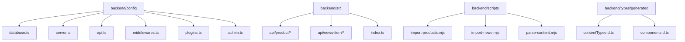
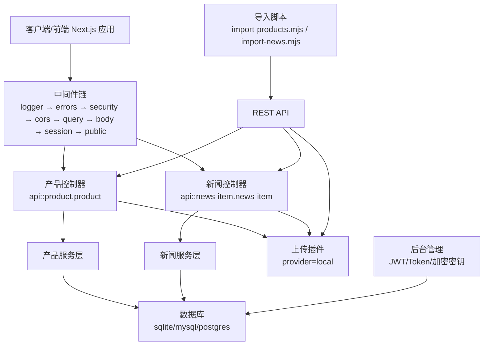
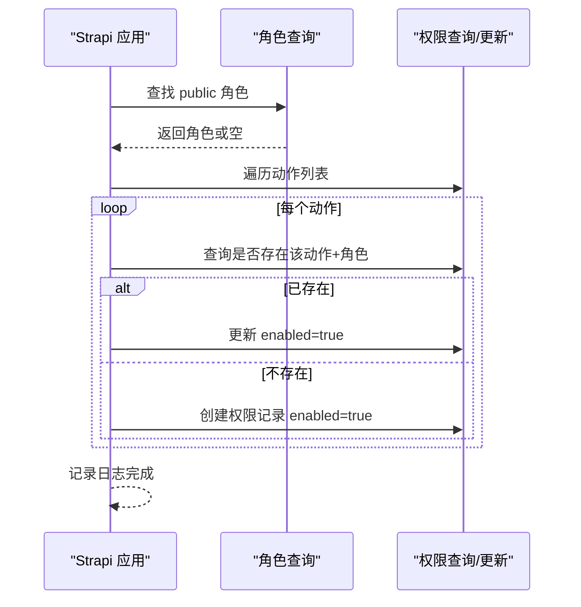
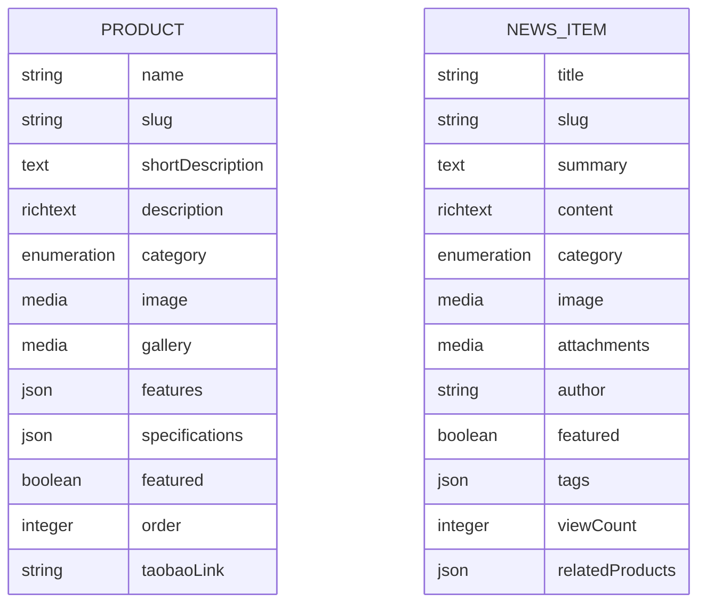
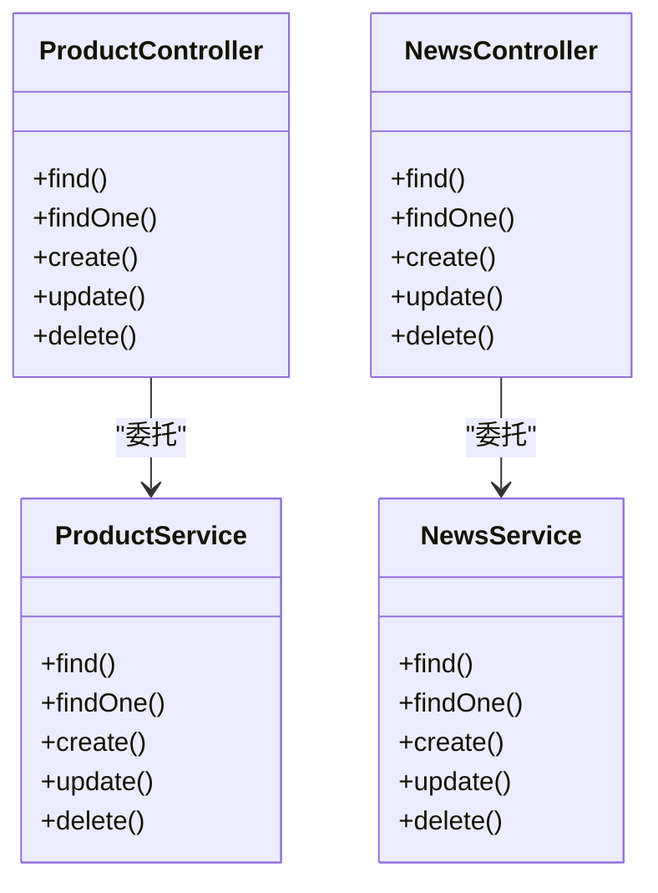
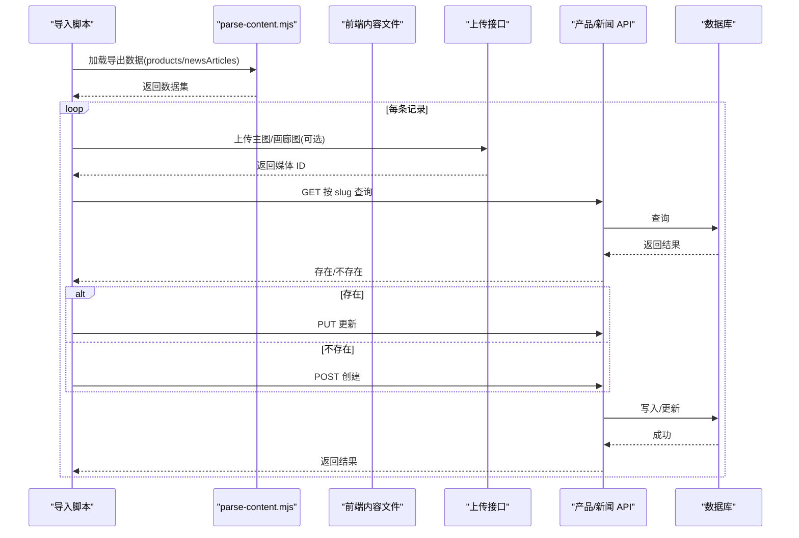
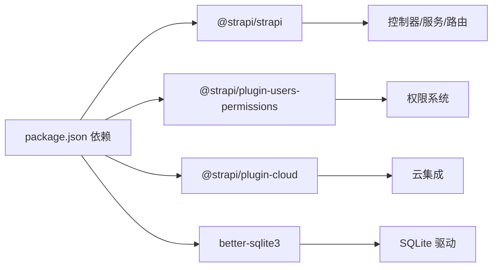

# 后端CMS架构

<cite>
**本文引用的文件**
- [package.json](file://backend/package.json)
- [database.ts](file://backend/config/database.ts)
- [server.ts](file://backend/config/server.ts)
- [api.ts](file://backend/config/api.ts)
- [middlewares.ts](file://backend/config/middlewares.ts)
- [plugins.ts](file://backend/config/plugins.ts)
- [admin.ts](file://backend/config/admin.ts)
- [index.ts](file://backend/src/index.ts)
- [product-schema.json](file://backend/src/api/product/content-types/product/schema.json)
- [news-schema.json](file://backend/src/api/news-item/content-types/news-item/schema.json)
- [product-controller.ts](file://backend/src/api/product/controllers/product.ts)
- [news-controller.ts](file://backend/src/api/news-item/controllers/news-item.ts)
- [product-service.ts](file://backend/src/api/product/services/product.ts)
- [news-service.ts](file://backend/src/api/news-item/services/news-item.ts)
- [product-route.ts](file://backend/src/api/product/routes/product.ts)
- [news-route.ts](file://backend/src/api/news-item/routes/news-item.ts)
- [import-products.mjs](file://backend/scripts/import-products.mjs)
- [import-news.mjs](file://backend/scripts/import-news.mjs)
- [parse-content.mjs](file://backend/scripts/parse-content.mjs)
</cite>

## 目录
1. [引言](#引言)
2. [项目结构](#项目结构)
3. [核心组件](#核心组件)
4. [架构总览](#架构总览)
5. [详细组件分析](#详细组件分析)
6. [依赖分析](#依赖分析)
7. [性能考虑](#性能考虑)
8. [故障排查指南](#故障排查指南)
9. [结论](#结论)
10. [附录](#附录)

## 引言
本文件为基于 Strapi 5 的无头 CMS 系统架构文档，面向后端开发与运维人员，系统性阐述配置体系、内容管理 API 设计、权限管理、内容类型与关系、数据库迁移与媒体管理、内容导入导出流程，以及性能优化与安全最佳实践。文档以仓库中的实际代码为依据，避免臆测，确保可操作性与可追溯性。

## 项目结构
后端采用标准 Strapi 5 结构，核心目录与职责如下：
- config：应用配置中心，包含数据库、服务器、API、中间件、插件与后台管理等配置
- src：业务源码，包含 API 内容类型、控制器、服务层与路由
- scripts：内容导入脚本与解析工具
- types/generated：自动生成的类型声明
- 根目录 package.json：依赖与脚本命令

图表来源
- [database.ts](file://backend/config/database.ts#L1-L61)
- [server.ts](file://backend/config/server.ts#L1-L8)
- [api.ts](file://backend/config/api.ts#L1-L8)
- [middlewares.ts](file://backend/config/middlewares.ts#L1-L13)
- [plugins.ts](file://backend/config/plugins.ts#L1-L11)
- [admin.ts](file://backend/config/admin.ts#L1-L21)
- [index.ts](file://backend/src/index.ts#L1-L65)
- [product-controller.ts](file://backend/src/api/product/controllers/product.ts#L1-L4)
- [news-controller.ts](file://backend/src/api/news-item/controllers/news-item.ts#L1-L4)
- [import-products.mjs](file://backend/scripts/import-products.mjs#L1-L163)
- [import-news.mjs](file://backend/scripts/import-news.mjs#L1-L157)
- [parse-content.mjs](file://backend/scripts/parse-content.mjs)

章节来源
- [package.json](file://backend/package.json#L1-L45)

## 核心组件
- 配置体系
  - 数据库配置：支持 sqlite、mysql、postgres，含连接池、SSL、超时等参数
  - 服务器配置：主机、端口、应用密钥
  - API 配置：REST 默认分页、最大限制与计数开关
  - 中间件：日志、错误处理、安全、CORS、查询、Body、会话、静态资源等
  - 插件：上传 provider 本地化与大小限制
  - 后台管理：管理员 JWT 秘钥、API Token 与传输 Token 盐、加密密钥与功能标志
- 权限与启动引导
  - 在应用启动时自动为公共角色启用产品与新闻的查询权限
- 内容类型与 API
  - 产品与新闻均为集合类型，支持草稿/发布，包含 UID 字段、富文本、枚举分类、媒体字段、JSON 扩展字段等
  - 控制器与服务层均使用 Strapi 核心工厂函数生成，路由通过核心路由器绑定

章节来源
- [database.ts](file://backend/config/database.ts#L1-L61)
- [server.ts](file://backend/config/server.ts#L1-L8)
- [api.ts](file://backend/config/api.ts#L1-L8)
- [middlewares.ts](file://backend/config/middlewares.ts#L1-L13)
- [plugins.ts](file://backend/config/plugins.ts#L1-L11)
- [admin.ts](file://backend/config/admin.ts#L1-L21)
- [index.ts](file://backend/src/index.ts#L19-L63)
- [product-schema.json](file://backend/src/api/product/content-types/product/schema.json#L1-L63)
- [news-schema.json](file://backend/src/api/news-item/content-types/news-item/schema.json#L1-L65)
- [product-controller.ts](file://backend/src/api/product/controllers/product.ts#L1-L4)
- [news-controller.ts](file://backend/src/api/news-item/controllers/news-item.ts#L1-L4)
- [product-service.ts](file://backend/src/api/product/services/product.ts#L1-L4)
- [news-service.ts](file://backend/src/api/news-item/services/news-item.ts#L1-L4)
- [product-route.ts](file://backend/src/api/product/routes/product.ts#L1-L4)
- [news-route.ts](file://backend/src/api/news-item/routes/news-item.ts#L1-L4)

## 架构总览
下图展示从客户端到 Strapi 后端的整体交互路径，包括请求进入、中间件链路、控制器与服务层调用、数据库与上传插件交互，以及内容导入脚本与前端内容源的关系。

图表来源
- [middlewares.ts](file://backend/config/middlewares.ts#L1-L13)
- [product-controller.ts](file://backend/src/api/product/controllers/product.ts#L1-L4)
- [news-controller.ts](file://backend/src/api/news-item/controllers/news-item.ts#L1-L4)
- [product-service.ts](file://backend/src/api/product/services/product.ts#L1-L4)
- [news-service.ts](file://backend/src/api/news-item/services/news-item.ts#L1-L4)
- [database.ts](file://backend/config/database.ts#L1-L61)
- [plugins.ts](file://backend/config/plugins.ts#L1-L11)
- [admin.ts](file://backend/config/admin.ts#L1-L21)
- [import-products.mjs](file://backend/scripts/import-products.mjs#L1-L163)
- [import-news.mjs](file://backend/scripts/import-news.mjs#L1-L157)

## 详细组件分析

### 配置体系
- 数据库配置
  - 支持 sqlite、mysql、postgres 三类驱动，按 DATABASE_CLIENT 切换
  - mysql/postgres 提供 SSL 可选配置与连接池参数
  - sqlite 使用相对路径文件名，便于本地开发
  - 统一设置连接超时时间
- 服务器配置
  - 主机与端口默认监听所有接口与 1337 端口
  - 应用密钥数组用于签名与加密
- API 配置
  - 默认分页限制与最大限制，开启返回总数
- 中间件配置
  - 安全、CORS、查询、Body、会话、静态资源等按顺序执行
- 插件配置
  - 上传 provider 为本地，单文件大小限制 10MB
- 后台管理配置
  - 管理员 JWT 秘钥、API Token 与传输 Token 盐、加密密钥与功能标志

章节来源
- [database.ts](file://backend/config/database.ts#L1-L61)
- [server.ts](file://backend/config/server.ts#L1-L8)
- [api.ts](file://backend/config/api.ts#L1-L8)
- [middlewares.ts](file://backend/config/middlewares.ts#L1-L13)
- [plugins.ts](file://backend/config/plugins.ts#L1-L11)
- [admin.ts](file://backend/config/admin.ts#L1-L21)

### 权限管理与启动引导
- 基于角色的访问控制（RBAC）
  - 启动阶段自动查找“public”角色
  - 对产品与新闻的 find/findOne 动作进行授权（启用或创建）
- 最佳实践
  - 仅对公开读取接口开放公共角色权限
  - 管理员与编辑者角色通过后台管理界面精细化配置

图表来源
- [index.ts](file://backend/src/index.ts#L19-L63)

章节来源
- [index.ts](file://backend/src/index.ts#L19-L63)

### 内容类型与数据模型
- 产品（product）
  - 关键字段：名称（必填）、slug（UID，唯一）、简述、富文本描述、枚举分类、主图与画廊（图片）、JSON 扩展（特性、规格）、布尔推荐位、排序、链接
  - 草稿/发布：开启
- 新闻（news-item）
  - 关键字段：标题（必填）、slug（UID，唯一）、摘要、富文本内容、分类枚举、封面图、附件（图片）、作者、推荐位、标签（JSON）、浏览量、关联产品（JSON）
  - 草稿/发布：开启

图表来源
- [product-schema.json](file://backend/src/api/product/content-types/product/schema.json#L1-L63)
- [news-schema.json](file://backend/src/api/news-item/content-types/news-item/schema.json#L1-L65)

章节来源
- [product-schema.json](file://backend/src/api/product/content-types/product/schema.json#L1-L63)
- [news-schema.json](file://backend/src/api/news-item/content-types/news-item/schema.json#L1-L65)

### 内容管理 API 设计
- 控制器与服务层
  - 产品与新闻均使用 Strapi 核心工厂函数生成控制器与服务，遵循“控制器负责请求响应，服务层封装业务逻辑”的分层原则
- 路由
  - 产品与新闻路由通过核心路由器绑定，自动暴露 CRUD 与查询接口
- API 行为
  - 由 API 配置统一限制分页与返回总数
  - 上传插件提供媒体文件上传能力

图表来源
- [product-controller.ts](file://backend/src/api/product/controllers/product.ts#L1-L4)
- [product-service.ts](file://backend/src/api/product/services/product.ts#L1-L4)
- [news-controller.ts](file://backend/src/api/news-item/controllers/news-item.ts#L1-L4)
- [news-service.ts](file://backend/src/api/news-item/services/news-item.ts#L1-L4)

章节来源
- [product-controller.ts](file://backend/src/api/product/controllers/product.ts#L1-L4)
- [news-controller.ts](file://backend/src/api/news-item/controllers/news-item.ts#L1-L4)
- [product-service.ts](file://backend/src/api/product/services/product.ts#L1-L4)
- [news-service.ts](file://backend/src/api/news-item/services/news-item.ts#L1-L4)
- [product-route.ts](file://backend/src/api/product/routes/product.ts#L1-L4)
- [news-route.ts](file://backend/src/api/news-item/routes/news-item.ts#L1-L4)
- [api.ts](file://backend/config/api.ts#L1-L8)

### 内容导入与导出流程
- 导入脚本
  - 产品导入：从前端内容导出模块加载产品数据，逐条上传主图与画廊图，构建 payload 并发起 upsert 请求
  - 新闻导入：从前端内容导出模块加载文章数据，上传封面图，构建 payload 并发起 upsert 请求
  - 共同点：先按 slug 查询现有记录，存在则 PUT 更新，否则 POST 创建；若 404 则回退为 POST
- 解析工具
  - parse-content.mjs 提供 loadExports，用于从前端内容模块中提取导出数据
- 环境要求
  - 需要 STRAPI_URL 与 STRAPI_TOKEN（管理员 JWT）

图表来源
- [import-products.mjs](file://backend/scripts/import-products.mjs#L126-L157)
- [import-news.mjs](file://backend/scripts/import-news.mjs#L124-L151)
- [parse-content.mjs](file://backend/scripts/parse-content.mjs)

章节来源
- [import-products.mjs](file://backend/scripts/import-products.mjs#L1-L163)
- [import-news.mjs](file://backend/scripts/import-news.mjs#L1-L157)
- [parse-content.mjs](file://backend/scripts/parse-content.mjs)

### 数据库迁移与媒体管理
- 迁移管理
  - 本项目未提供显式的数据库迁移脚本；内容类型变更与字段调整建议通过 Strapi 后台或 CLI 进行，保持 schema.json 与后台同步
- 媒体文件管理
  - 上传插件使用本地 provider，单文件大小限制为 10MB
  - 媒体字段在内容类型 schema 中声明，支持多图与单图
- 内容导入导出
  - 通过导入脚本将前端内容与媒体文件批量写入后端，适合初始数据或增量同步场景

章节来源
- [plugins.ts](file://backend/config/plugins.ts#L1-L11)
- [product-schema.json](file://backend/src/api/product/content-types/product/schema.json#L34-L44)
- [news-schema.json](file://backend/src/api/news-item/content-types/news-item/schema.json#L34-L44)
- [import-products.mjs](file://backend/scripts/import-products.mjs#L35-L66)
- [import-news.mjs](file://backend/scripts/import-news.mjs#L35-L66)

## 依赖分析
- 外部依赖
  - Strapi 核心与云插件、用户权限插件、better-sqlite3
- 脚本命令
  - 开发、构建、启动、升级、内容导入等命令
- 耦合与内聚
  - 控制器与服务层低耦合，通过 Strapi 工厂函数解耦具体实现
  - 路由与控制器通过核心路由器绑定，保持一致的 REST 行为

图表来源
- [package.json](file://backend/package.json#L20-L29)

章节来源
- [package.json](file://backend/package.json#L1-L45)

## 性能考虑
- 分页与查询
  - API 层限制默认分页与最大限制，减少一次性返回大量数据
- 连接池与超时
  - 数据库连接池参数与连接超时可按环境调优，避免高并发下的连接争用
- 中间件顺序
  - 将轻量中间件前置，重负载中间件（如 body/session）靠后，平衡延迟与功能
- 媒体上传
  - 本地上传大小限制适配前端压缩策略，避免大文件拖慢整体吞吐
- 缓存策略
  - 对热点内容（如首页产品/新闻列表）结合前端缓存与 CDN，减少后端压力
- 安全配置
  - 启用安全中间件与 CORS 白名单，严格管理密钥与 Token

章节来源
- [api.ts](file://backend/config/api.ts#L1-L8)
- [database.ts](file://backend/config/database.ts#L23-L24)
- [middlewares.ts](file://backend/config/middlewares.ts#L1-L13)
- [plugins.ts](file://backend/config/plugins.ts#L1-L11)
- [admin.ts](file://backend/config/admin.ts#L1-L21)

## 故障排查指南
- 权限问题
  - 若公共用户无法读取产品/新闻，检查启动引导是否成功启用对应动作权限
- 上传失败
  - 检查上传大小限制、文件类型与媒体 ID 返回；确认 STRAPI_TOKEN 有效
- 导入异常
  - 查看导入脚本输出与错误堆栈；确认 STRAPI_URL 与 STRAPI_TOKEN 环境变量
- 数据库连接
  - 核对 DATABASE_CLIENT、连接参数与 SSL 配置；检查连接池与超时设置

章节来源
- [index.ts](file://backend/src/index.ts#L19-L63)
- [import-products.mjs](file://backend/scripts/import-products.mjs#L13-L16)
- [import-news.mjs](file://backend/scripts/import-news.mjs#L13-L16)
- [database.ts](file://backend/config/database.ts#L1-L61)

## 结论
本项目以 Strapi 5 为核心，采用清晰的配置分层、标准的内容类型与 API 分层设计、后台自动权限引导、本地上传与导入脚本，形成一套可维护、可扩展的无头 CMS 后端。建议在生产环境中进一步完善数据库迁移机制、引入缓存与 CDN、细化中间件白名单与安全策略，并持续通过后台管理与脚本保障内容一致性。

## 附录
- 环境变量建议
  - 数据库相关：DATABASE_CLIENT、DATABASE_URL/HOST/PORT/NAME/USERNAME/PASSWORD、DATABASE_SSL_*、DATABASE_POOL_MIN/DATABASE_POOL_MAX、DATABASE_CONNECTION_TIMEOUT、DATABASE_FILENAME
  - 服务器：HOST、PORT、APP_KEYS
  - API 与中间件：REST 默认分页与最大限制
  - 上传：UPLOAD_SIZE_LIMIT
  - 后台管理：ADMIN_JWT_SECRET、API_TOKEN_SALT、TRANSFER_TOKEN_SALT、ENCRYPTION_KEY、FLAG_NPS、FLAG_PROMOTE_EE
  - 导入：STRAPI_URL、STRAPI_TOKEN
- 命令参考
  - 开发：npm run dev
  - 构建：npm run build
  - 启动：npm run start
  - 升级：npm run upgrade / upgrade:dry
  - 导入：npm run import:products / import:news / import:content

章节来源
- [database.ts](file://backend/config/database.ts#L1-L61)
- [server.ts](file://backend/config/server.ts#L1-L8)
- [api.ts](file://backend/config/api.ts#L1-L8)
- [middlewares.ts](file://backend/config/middlewares.ts#L1-L13)
- [plugins.ts](file://backend/config/plugins.ts#L1-L11)
- [admin.ts](file://backend/config/admin.ts#L1-L21)
- [package.json](file://backend/package.json#L6-L18)
- [import-products.mjs](file://backend/scripts/import-products.mjs#L10-L11)
- [import-news.mjs](file://backend/scripts/import-news.mjs#L10-L11)