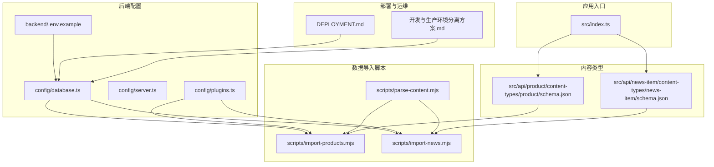
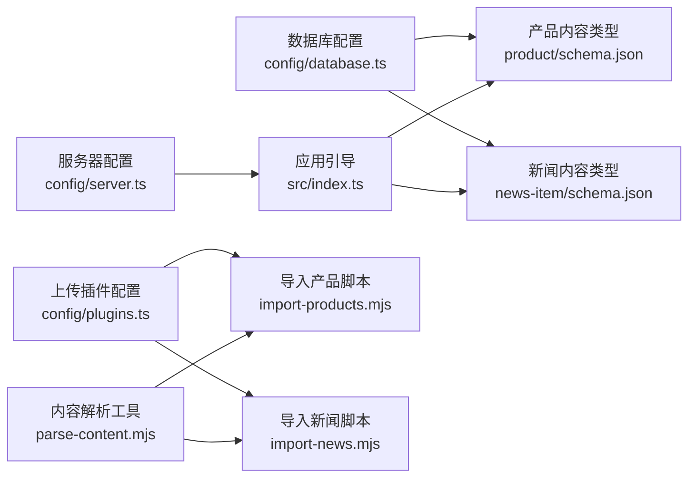
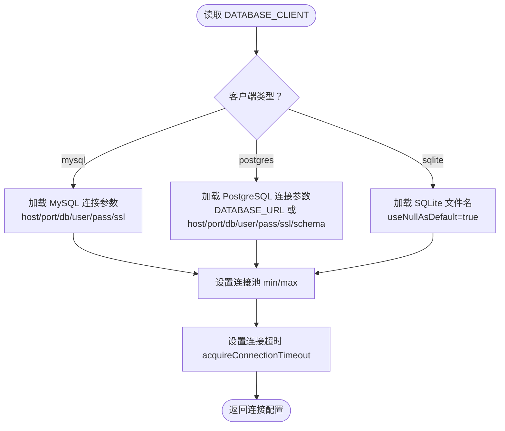
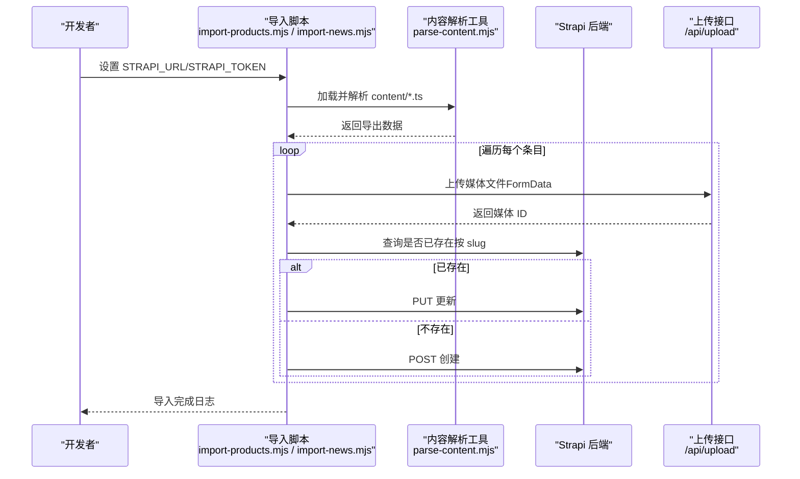
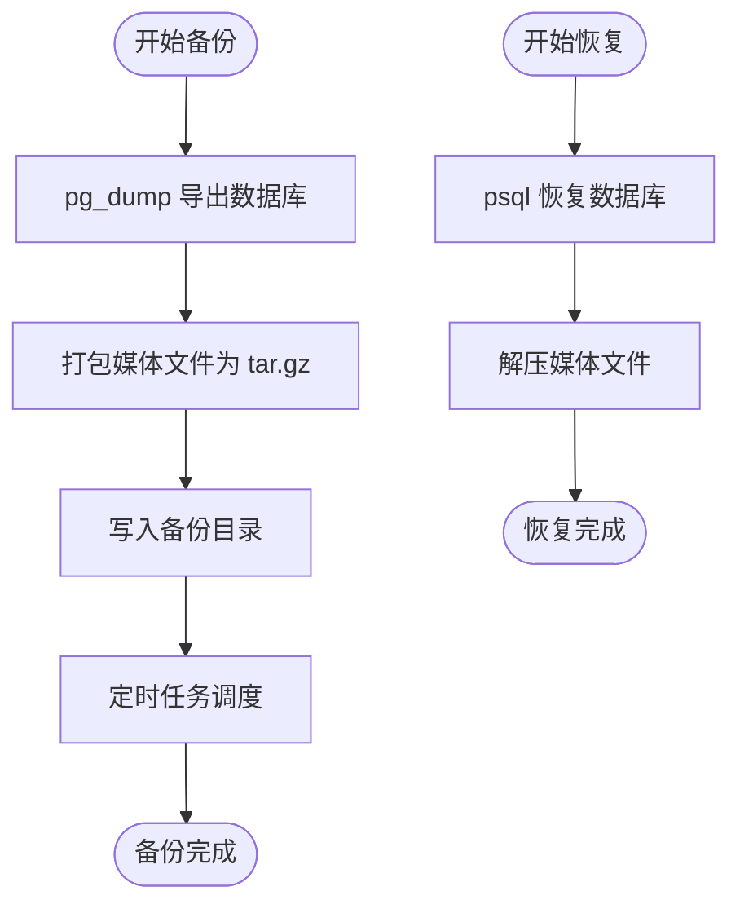
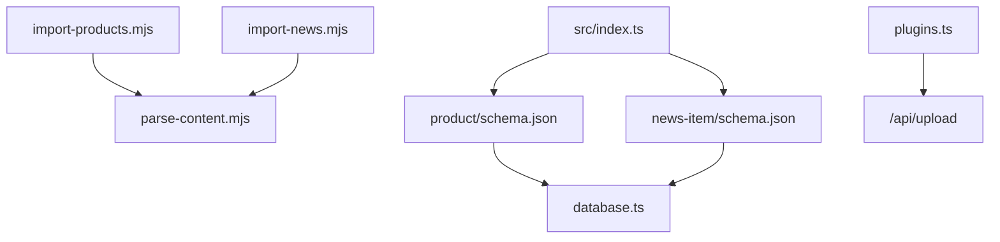

# 数据库管理

<cite>
**本文引用的文件**
- [backend/config/database.ts](file://backend/config/database.ts)
- [backend/config/server.ts](file://backend/config/server.ts)
- [backend/config/plugins.ts](file://backend/config/plugins.ts)
- [backend/package.json](file://backend/package.json)
- [backend/scripts/import-products.mjs](file://backend/scripts/import-products.mjs)
- [backend/scripts/import-news.mjs](file://backend/scripts/import-news.mjs)
- [backend/scripts/parse-content.mjs](file://backend/scripts/parse-content.mjs)
- [backend/src/api/product/content-types/product/schema.json](file://backend/src/api/product/content-types/product/schema.json)
- [backend/src/api/news-item/content-types/news-item/schema.json](file://backend/src/api/news-item/content-types/news-item/schema.json)
- [backend/src/index.ts](file://backend/src/index.ts)
- [backend/.env.example](file://backend/.env.example)
- [DEPLOYMENT.md](file://DEPLOYMENT.md)
- [开发与生产环境分离方案.md](file://开发与生产环境分离方案.md)
</cite>

## 目录
1. [简介](#简介)
2. [项目结构](#项目结构)
3. [核心组件](#核心组件)
4. [架构总览](#架构总览)
5. [详细组件分析](#详细组件分析)
6. [依赖关系分析](#依赖关系分析)
7. [性能考量](#性能考量)
8. [故障排查指南](#故障排查指南)
9. [结论](#结论)
10. [附录](#附录)

## 简介
本文件面向数据库管理员与后端工程师，系统化梳理 Strapi 后端的数据库配置、连接池与超时控制、事务与一致性保障、数据导入与内容解析、媒体文件上传与本地存储、备份与恢复、迁移流程与最佳实践。文档同时覆盖多数据库客户端（SQLite、MySQL、PostgreSQL）的配置差异与使用场景建议，并给出性能优化、索引策略与查询优化的实操要点。

## 项目结构
后端采用 Strapi 应用结构，数据库配置位于 config 目录；数据导入脚本位于 scripts 目录；内容类型定义位于 src/api/*/content-types/*/schema.json；插件配置位于 config/plugins.ts；应用启动入口与权限初始化逻辑位于 src/index.ts；环境变量示例位于 .env.example；部署与运维文档位于根目录 DEPLOYMENT.md 与“开发与生产环境分离方案.md”。

图表来源
- [backend/config/database.ts](file://backend/config/database.ts#L1-L61)
- [backend/config/plugins.ts](file://backend/config/plugins.ts#L1-L11)
- [backend/scripts/import-products.mjs](file://backend/scripts/import-products.mjs#L1-L163)
- [backend/scripts/import-news.mjs](file://backend/scripts/import-news.mjs#L1-L157)
- [backend/scripts/parse-content.mjs](file://backend/scripts/parse-content.mjs#L1-L17)
- [backend/src/api/product/content-types/product/schema.json](file://backend/src/api/product/content-types/product/schema.json#L1-L63)
- [backend/src/api/news-item/content-types/news-item/schema.json](file://backend/src/api/news-item/content-types/news-item/schema.json#L1-L65)
- [backend/src/index.ts](file://backend/src/index.ts#L1-L65)
- [backend/.env.example](file://backend/.env.example#L1-L15)
- [DEPLOYMENT.md](file://DEPLOYMENT.md#L692-L955)
- [开发与生产环境分离方案.md](file://开发与生产环境分离方案.md#L1037-L1428)

章节来源
- [backend/config/database.ts](file://backend/config/database.ts#L1-L61)
- [backend/config/server.ts](file://backend/config/server.ts#L1-L8)
- [backend/config/plugins.ts](file://backend/config/plugins.ts#L1-L11)
- [backend/package.json](file://backend/package.json#L1-L45)
- [backend/.env.example](file://backend/.env.example#L1-L15)

## 核心组件
- 数据库配置与连接参数：通过 config/database.ts 动态选择客户端（sqlite/mysql/postgres），并支持连接字符串、SSL、Schema、连接池大小与连接超时等参数。
- 服务器与应用密钥：config/server.ts 提供主机、端口与 APP_KEYS。
- 插件与媒体存储：config/plugins.ts 配置上传插件与本地存储大小限制。
- 内容类型与字段约束：产品与新闻内容类型的 schema.json 定义了字段类型、枚举、媒体字段与 UID 等。
- 应用引导与权限：src/index.ts 在启动时为公开角色启用产品与新闻的读取权限。
- 数据导入与内容解析：scripts/import-products.mjs 与 import-news.mjs 实现产品与新闻的数据导入；parse-content.mjs 提供内容导出加载工具。
- 环境变量：.env.example 提供默认值，便于本地与生产环境切换。
- 运维与迁移：DEPLOYMENT.md 与“开发与生产环境分离方案.md”提供备份、恢复、迁移与回滚流程。

章节来源
- [backend/src/api/product/content-types/product/schema.json](file://backend/src/api/product/content-types/product/schema.json#L1-L63)
- [backend/src/api/news-item/content-types/news-item/schema.json](file://backend/src/api/news-item/content-types/news-item/schema.json#L1-L65)
- [backend/src/index.ts](file://backend/src/index.ts#L19-L62)
- [backend/scripts/import-products.mjs](file://backend/scripts/import-products.mjs#L126-L157)
- [backend/scripts/import-news.mjs](file://backend/scripts/import-news.mjs#L124-L151)
- [backend/scripts/parse-content.mjs](file://backend/scripts/parse-content.mjs#L3-L16)
- [backend/.env.example](file://backend/.env.example#L1-L15)

## 架构总览
下图展示了数据库配置、内容类型、上传插件、导入脚本与应用引导之间的交互关系。

图表来源
- [backend/config/database.ts](file://backend/config/database.ts#L3-L60)
- [backend/config/server.ts](file://backend/config/server.ts#L1-L8)
- [backend/config/plugins.ts](file://backend/config/plugins.ts#L1-L11)
- [backend/src/api/product/content-types/product/schema.json](file://backend/src/api/product/content-types/product/schema.json#L1-L63)
- [backend/src/api/news-item/content-types/news-item/schema.json](file://backend/src/api/news-item/content-types/news-item/schema.json#L1-L65)
- [backend/src/index.ts](file://backend/src/index.ts#L19-L62)
- [backend/scripts/import-products.mjs](file://backend/scripts/import-products.mjs#L1-L163)
- [backend/scripts/import-news.mjs](file://backend/scripts/import-news.mjs#L1-L157)
- [backend/scripts/parse-content.mjs](file://backend/scripts/parse-content.mjs#L1-L17)

## 详细组件分析

### 数据库配置与多数据库支持
- 客户端选择：通过 DATABASE_CLIENT（默认 sqlite）动态选择 mysql、postgres 或 sqlite。
- MySQL 配置：支持 host/port/database/user/password 以及 SSL 参数；连接池由 DATABASE_POOL_MIN/DATABASE_POOL_MAX 控制；连接超时由 DATABASE_CONNECTION_TIMEOUT 指定。
- PostgreSQL 配置：优先使用 DATABASE_URL（连接字符串），也可分别指定 host/port/database/user/password；支持 schema 与 SSL；连接池与超时同上。
- SQLite 配置：使用相对路径的 filename，useNullAsDefault 为 true。
- 环境变量示例：.env.example 提供默认值，便于本地开发与生产环境切换。

图表来源
- [backend/config/database.ts](file://backend/config/database.ts#L3-L60)
- [backend/.env.example](file://backend/.env.example#L3-L4)

章节来源
- [backend/config/database.ts](file://backend/config/database.ts#L3-L60)
- [backend/.env.example](file://backend/.env.example#L1-L15)

### 服务器与应用密钥
- 主机与端口：host/port 由 HOST/PORT 控制。
- 应用密钥：APP_KEYS 用于加密与签名，需在部署时正确配置。

章节来源
- [backend/config/server.ts](file://backend/config/server.ts#L1-L8)
- [backend/.env.example](file://backend/.env.example#L1-L15)

### 上传插件与媒体存储
- 上传提供者：本地提供者（local）。
- 存储大小限制：默认 10MB。
- 媒体字段：产品与新闻内容类型均包含 media 字段，支持单张或多张图片上传。

章节来源
- [backend/config/plugins.ts](file://backend/config/plugins.ts#L1-L11)
- [backend/src/api/product/content-types/product/schema.json](file://backend/src/api/product/content-types/product/schema.json#L34-L44)
- [backend/src/api/news-item/content-types/news-item/schema.json](file://backend/src/api/news-item/content-types/news-item/schema.json#L34-L44)

### 内容类型与字段约束
- 产品（Products）：包含 name/slug/shortDescription/description/category/image/gallery/features/specifications/featured/order/taobaoLink 等字段；slug 为 UID 并唯一；支持草稿与发布。
- 新闻（News）：包含 title/slug/summary/content/category/image/attachments/author/featured/tags/viewCount/relatedProducts 等字段；slug 为 UID 并唯一；支持草稿与发布。

章节来源
- [backend/src/api/product/content-types/product/schema.json](file://backend/src/api/product/content-types/product/schema.json#L1-L63)
- [backend/src/api/news-item/content-types/news-item/schema.json](file://backend/src/api/news-item/content-types/news-item/schema.json#L1-L65)

### 应用引导与权限
- 启动时自动为公开角色启用产品与新闻的 find/findOne 权限，确保前端可读取内容。

章节来源
- [backend/src/index.ts](file://backend/src/index.ts#L19-L62)

### 数据导入脚本与内容解析
- 导入脚本职责：
  - 产品导入：读取前端 content/products.ts，解析导出内容，上传图片，去重（按 slug），创建或更新产品。
  - 新闻导入：读取前端 content/news.ts，解析导出内容，上传封面图，创建或更新新闻。
- 内容解析工具：parse-content.mjs 将 TypeScript 源码清洗为可执行的 JS 片段并返回所需导出对象。
- 上传流程：使用 FormData 调用 /api/upload，基于 Authorization Bearer Token 上传；失败时跳过并记录警告。
- 去重策略：通过查询 slug 等过滤条件判断是否存在，存在则 PUT 更新，否则 POST 创建。

图表来源
- [backend/scripts/import-products.mjs](file://backend/scripts/import-products.mjs#L126-L157)
- [backend/scripts/import-news.mjs](file://backend/scripts/import-news.mjs#L124-L151)
- [backend/scripts/parse-content.mjs](file://backend/scripts/parse-content.mjs#L3-L16)

章节来源
- [backend/scripts/import-products.mjs](file://backend/scripts/import-products.mjs#L1-L163)
- [backend/scripts/import-news.mjs](file://backend/scripts/import-news.mjs#L1-L157)
- [backend/scripts/parse-content.mjs](file://backend/scripts/parse-content.mjs#L1-L17)

### 备份、恢复与迁移
- 备份：每日凌晨 2:00 执行数据库与媒体归档备份；支持清理过期备份。
- 恢复：通过 psql 恢复数据库 SQL 文件；媒体文件通过 tar.gz 解压恢复。
- 迁移：支持从开发环境（SQLite）迁移到生产环境（PostgreSQL），包含产品与新闻迁移流程与回滚方案。

图表来源
- [DEPLOYMENT.md](file://DEPLOYMENT.md#L692-L743)
- [开发与生产环境分离方案.md](file://开发与生产环境分离方案.md#L1037-L1117)

章节来源
- [DEPLOYMENT.md](file://DEPLOYMENT.md#L692-L955)
- [开发与生产环境分离方案.md](file://开发与生产环境分离方案.md#L1037-L1428)

## 依赖关系分析
- 数据导入脚本依赖 parse-content.mjs 提供的内容导出能力。
- 产品与新闻内容类型依赖数据库 schema 的字段定义与 UID 约束。
- 上传接口依赖上传插件配置与媒体字段类型。
- 应用引导依赖用户权限插件的角色与权限模型。

图表来源
- [backend/scripts/import-products.mjs](file://backend/scripts/import-products.mjs#L1-L163)
- [backend/scripts/import-news.mjs](file://backend/scripts/import-news.mjs#L1-L157)
- [backend/scripts/parse-content.mjs](file://backend/scripts/parse-content.mjs#L1-L17)
- [backend/src/api/product/content-types/product/schema.json](file://backend/src/api/product/content-types/product/schema.json#L1-L63)
- [backend/src/api/news-item/content-types/news-item/schema.json](file://backend/src/api/news-item/content-types/news-item/schema.json#L1-L65)
- [backend/config/plugins.ts](file://backend/config/plugins.ts#L1-L11)
- [backend/src/index.ts](file://backend/src/index.ts#L19-L62)

章节来源
- [backend/package.json](file://backend/package.json#L6-L18)

## 性能考量
- 连接池与超时：根据并发请求与数据库负载调整 DATABASE_POOL_MIN/DATABASE_POOL_MAX 与 DATABASE_CONNECTION_TIMEOUT，避免连接饥饿与超时。
- 上传限制：合理设置上传大小限制，避免大文件占用过多带宽与存储。
- 查询优化：对高频查询字段（如 slug）建立索引；避免 N+1 查询，尽量使用关联查询或批量查询。
- 缓存策略：结合 CDN 与静态资源缓存，减少数据库压力。
- 分页与分批：导入与迁移采用分页与分批策略，降低峰值负载。
- 监控与日志：迁移过程记录详细日志，便于定位性能瓶颈。

## 故障排查指南
- 导入失败：
  - 检查 STRAPI_TOKEN 是否有效且具有完全访问权限。
  - 确认目标环境 API 地址与端口可达。
  - 查看上传接口返回状态与错误信息，确认媒体文件格式与大小限制。
- 数据重复：
  - 确认内容类型中 slug 为 UID 且唯一；导入脚本按 slug 去重。
- 权限问题：
  - 应用引导会为公开角色启用读取权限；若仍无法访问，检查用户权限插件配置。
- 备份与恢复：
  - 备份脚本与定时任务需正确配置；恢复时注意数据库与媒体文件的对应关系。
- 迁移回滚：
  - 若迁移失败，按回滚方案停止服务、恢复数据库与媒体文件、重启服务并验证健康状态。

章节来源
- [backend/scripts/import-products.mjs](file://backend/scripts/import-products.mjs#L13-L16)
- [backend/scripts/import-news.mjs](file://backend/scripts/import-news.mjs#L13-L16)
- [backend/src/index.ts](file://backend/src/index.ts#L29-L62)
- [DEPLOYMENT.md](file://DEPLOYMENT.md#L921-L941)
- [开发与生产环境分离方案.md](file://开发与生产环境分离方案.md#L1394-L1414)

## 结论
本项目通过清晰的数据库配置、完善的导入与解析工具、严格的权限与上传策略，以及标准化的备份、恢复与迁移流程，构建了可维护、可扩展的数据库管理方案。建议在生产环境中结合连接池调优、查询优化与 CDN 缓存，持续监控与迭代，确保高可用与高性能。

## 附录
- 常用命令与脚本：
  - 开发模式：npm run develop
  - 导入产品：npm run import:products
  - 导入新闻：npm run import:news
  - 导入全部：npm run import:content
- 环境变量参考：
  - DATABASE_CLIENT、DATABASE_URL/HOST/PORT/NAME/USERNAME/PASSWORD
  - DATABASE_SSL/DATABASE_SCHEMA/DATABASE_POOL_MIN/DATABASE_POOL_MAX/DATABASE_CONNECTION_TIMEOUT
  - STRAPI_URL、STRAPI_TOKEN

章节来源
- [backend/package.json](file://backend/package.json#L6-L18)
- [backend/.env.example](file://backend/.env.example#L1-L15)
- [backend/config/database.ts](file://backend/config/database.ts#L3-L60)