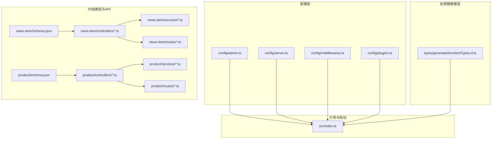
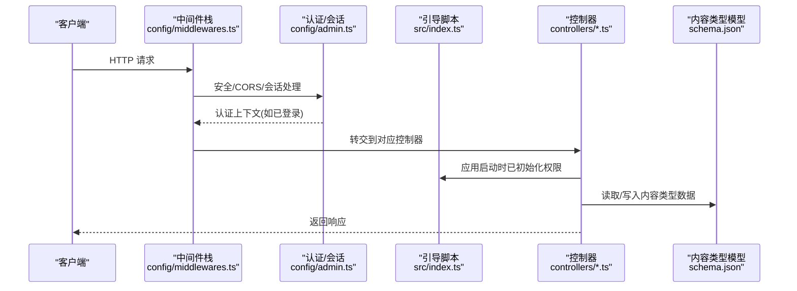
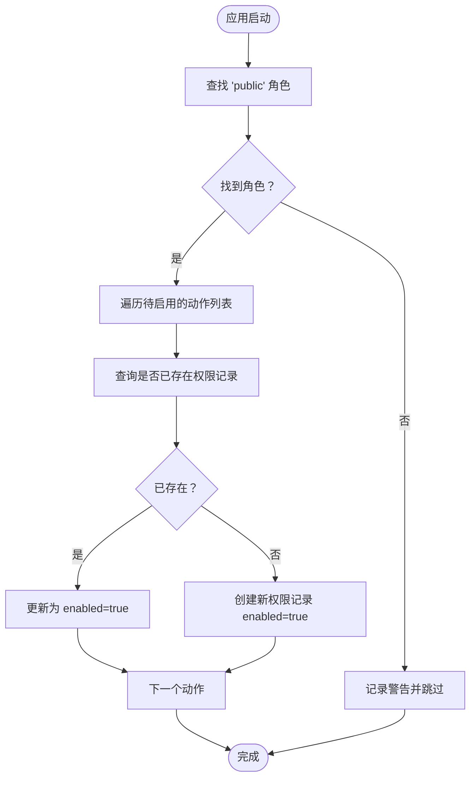
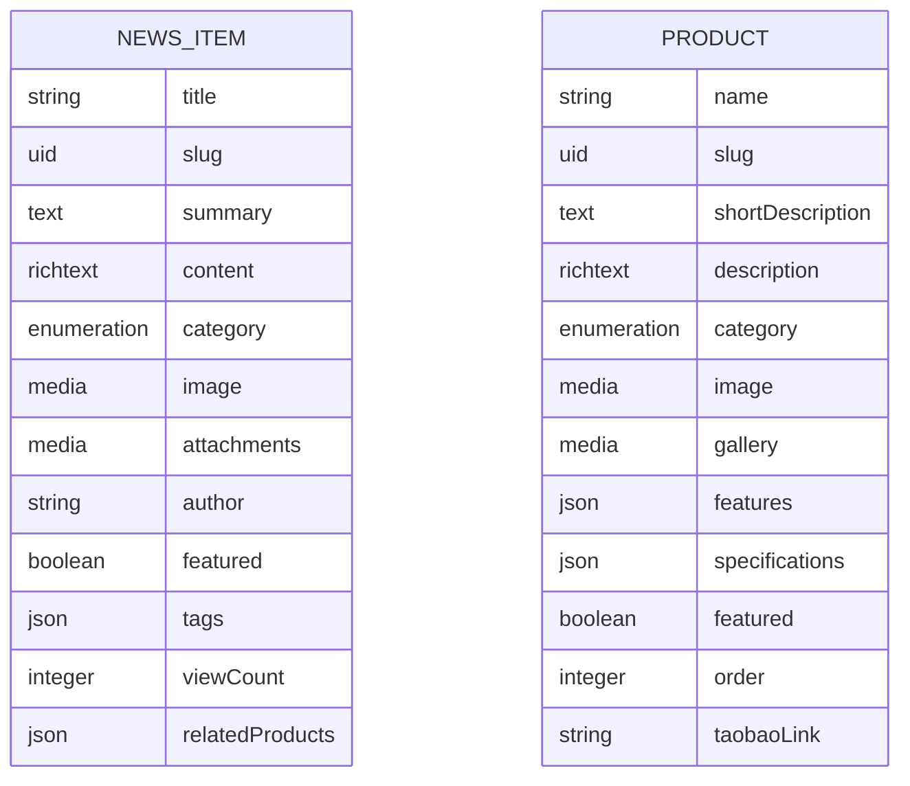
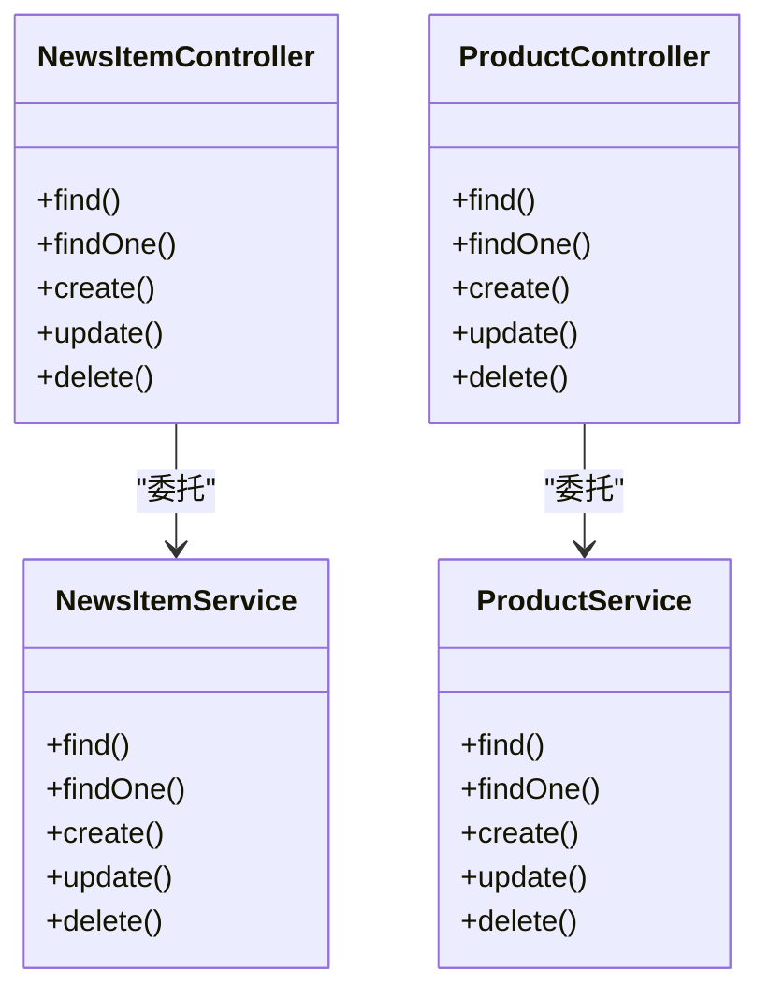
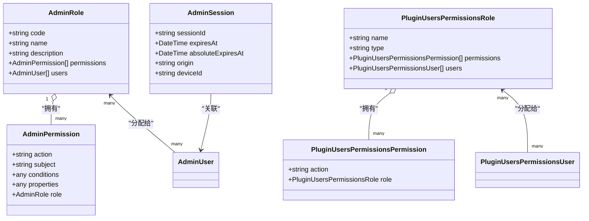
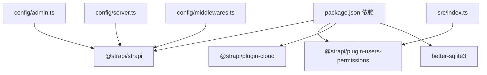

# 权限管理系统

<cite>
**本文引用的文件**
- [backend/src/index.ts](file://backend/src/index.ts)
- [backend/config/admin.ts](file://backend/config/admin.ts)
- [backend/config/middlewares.ts](file://backend/config/middlewares.ts)
- [backend/config/server.ts](file://backend/config/server.ts)
- [backend/config/plugins.ts](file://backend/config/plugins.ts)
- [backend/package.json](file://backend/package.json)
- [backend/src/api/news-item/content-types/news-item/schema.json](file://backend/src/api/news-item/content-types/news-item/schema.json)
- [backend/src/api/product/content-types/product/schema.json](file://backend/src/api/product/content-types/product/schema.json)
- [backend/src/api/news-item/controllers/news-item.ts](file://backend/src/api/news-item/controllers/news-item.ts)
- [backend/src/api/product/controllers/product.ts](file://backend/src/api/product/controllers/product.ts)
- [backend/src/api/news-item/routes/news-item.ts](file://backend/src/api/news-item/routes/news-item.ts)
- [backend/src/api/product/routes/product.ts](file://backend/src/api/product/routes/product.ts)
- [backend/src/api/news-item/services/news-item.ts](file://backend/src/api/news-item/services/news-item.ts)
- [backend/src/api/product/services/product.ts](file://backend/src/api/product/services/product.ts)
- [backend/types/generated/contentTypes.d.ts](file://backend/types/generated/contentTypes.d.ts)
</cite>

## 目录
1. [简介](#简介)
2. [项目结构](#项目结构)
3. [核心组件](#核心组件)
4. [架构总览](#架构总览)
5. [详细组件分析](#详细组件分析)
6. [依赖关系分析](#依赖关系分析)
7. [性能考虑](#性能考虑)
8. [故障排查指南](#故障排查指南)
9. [结论](#结论)
10. [附录](#附录)

## 简介
本文件系统性梳理该 Strapi 后端的权限管理体系，重点覆盖以下方面：
- 基于角色的访问控制（RBAC）与用户权限配置
- 管理员、编辑者、访客等角色差异及适用场景
- API 权限配置、内容类型权限与字段级权限控制
- JWT 令牌认证、会话管理与第三方认证集成思路
- 权限继承、权限组合与动态权限检查的实现原理
- 权限调试、审计与安全最佳实践
- 插件权限配置与自定义权限扩展方法

本项目使用 Strapi 的官方用户权限插件与内置管理后台，结合自定义引导逻辑实现“公开角色”的 API 访问授权。

## 项目结构
后端采用 Strapi 标准分层：配置、内容类型、控制器、服务、路由、中间件与插件配置。权限相关的关键位置如下：
- 配置层：管理员密钥、API Token、会话与安全中间件
- 数据模型层：内容类型 schema 定义
- 控制器/服务/路由：核心业务处理与权限入口
- 引导脚本：在应用启动时为“公开角色”批量启用特定 API 动作

**图表来源**
- [backend/config/admin.ts](file://backend/config/admin.ts#L1-L21)
- [backend/config/server.ts](file://backend/config/server.ts#L1-L8)
- [backend/config/middlewares.ts](file://backend/config/middlewares.ts#L1-L13)
- [backend/config/plugins.ts](file://backend/config/plugins.ts#L1-L11)
- [backend/types/generated/contentTypes.d.ts](file://backend/types/generated/contentTypes.d.ts#L868-L962)
- [backend/src/api/news-item/content-types/news-item/schema.json](file://backend/src/api/news-item/content-types/news-item/schema.json#L1-L65)
- [backend/src/api/product/content-types/product/schema.json](file://backend/src/api/product/content-types/product/schema.json#L1-L63)
- [backend/src/api/news-item/controllers/news-item.ts](file://backend/src/api/news-item/controllers/news-item.ts#L1-L4)
- [backend/src/api/product/controllers/product.ts](file://backend/src/api/product/controllers/product.ts#L1-L4)
- [backend/src/api/news-item/services/news-item.ts](file://backend/src/api/news-item/services/news-item.ts#L1-L4)
- [backend/src/api/product/services/product.ts](file://backend/src/api/product/services/product.ts#L1-L4)
- [backend/src/api/news-item/routes/news-item.ts](file://backend/src/api/news-item/routes/news-item.ts#L1-L4)
- [backend/src/api/product/routes/product.ts](file://backend/src/api/product/routes/product.ts#L1-L4)
- [backend/src/index.ts](file://backend/src/index.ts#L1-L65)

**章节来源**
- [backend/config/admin.ts](file://backend/config/admin.ts#L1-L21)
- [backend/config/server.ts](file://backend/config/server.ts#L1-L8)
- [backend/config/middlewares.ts](file://backend/config/middlewares.ts#L1-L13)
- [backend/config/plugins.ts](file://backend/config/plugins.ts#L1-L11)
- [backend/src/index.ts](file://backend/src/index.ts#L1-L65)

## 核心组件
- 用户权限插件与数据模型
  - 管理后台角色与权限：用于管理后台操作的 RBAC
  - 用户权限角色与权限：用于前台 API 的 RBAC
  - 会话存储：Strapi 内置会话表，支持登录态管理
- 引导脚本
  - 在应用启动时自动为“公开角色”启用指定 API 动作，确保匿名用户可读取产品与新闻列表/详情
- 中间件栈
  - 包含安全、CORS、会话、公共资源等中间件，为权限与认证提供基础
- 配置
  - 管理后台 JWT 密钥、API Token Salt、会话加密密钥等

**章节来源**
- [backend/types/generated/contentTypes.d.ts](file://backend/types/generated/contentTypes.d.ts#L110-L203)
- [backend/types/generated/contentTypes.d.ts](file://backend/types/generated/contentTypes.d.ts#L868-L962)
- [backend/types/generated/contentTypes.d.ts](file://backend/types/generated/contentTypes.d.ts#L206-L249)
- [backend/src/index.ts](file://backend/src/index.ts#L19-L63)
- [backend/config/middlewares.ts](file://backend/config/middlewares.ts#L1-L13)
- [backend/config/admin.ts](file://backend/config/admin.ts#L1-L21)

## 架构总览
下图展示从请求到权限决策与数据返回的整体流程，涵盖中间件、权限插件、引导脚本与内容类型控制器：

**图表来源**
- [backend/config/middlewares.ts](file://backend/config/middlewares.ts#L1-L13)
- [backend/config/admin.ts](file://backend/config/admin.ts#L1-L21)
- [backend/src/index.ts](file://backend/src/index.ts#L19-L63)
- [backend/src/api/news-item/controllers/news-item.ts](file://backend/src/api/news-item/controllers/news-item.ts#L1-L4)
- [backend/src/api/product/controllers/product.ts](file://backend/src/api/product/controllers/product.ts#L1-L4)
- [backend/src/api/news-item/content-types/news-item/schema.json](file://backend/src/api/news-item/content-types/news-item/schema.json#L1-L65)
- [backend/src/api/product/content-types/product/schema.json](file://backend/src/api/product/content-types/product/schema.json#L1-L63)

## 详细组件分析

### 组件A：引导脚本与公开角色权限启用
- 目标：在应用启动时，自动为“公开角色”启用产品与新闻的查询类 API 动作，使匿名用户可读取相关内容。
- 关键点：
  - 查找“public”角色
  - 批量创建或更新权限记录，启用指定动作
  - 日志输出便于审计与排障

**图表来源**
- [backend/src/index.ts](file://backend/src/index.ts#L19-L63)

**章节来源**
- [backend/src/index.ts](file://backend/src/index.ts#L19-L63)

### 组件B：内容类型与字段级权限
- 内容类型定义了字段、验证与发布状态等属性，字段级权限通常通过“条件”与“属性”在权限模型中表达。
- 本项目中，内容类型启用了草稿/发布能力，字段层面的细粒度权限需结合权限插件的“条件”字段进行配置。

**图表来源**
- [backend/src/api/news-item/content-types/news-item/schema.json](file://backend/src/api/news-item/content-types/news-item/schema.json#L1-L65)
- [backend/src/api/product/content-types/product/schema.json](file://backend/src/api/product/content-types/product/schema.json#L1-L63)

**章节来源**
- [backend/src/api/news-item/content-types/news-item/schema.json](file://backend/src/api/news-item/content-types/news-item/schema.json#L1-L65)
- [backend/src/api/product/content-types/product/schema.json](file://backend/src/api/product/content-types/product/schema.json#L1-L63)

### 组件C：控制器、服务与路由
- 控制器与服务采用 Strapi 核心工厂创建，遵循统一的 CRUD 与业务封装模式
- 路由通过核心路由器生成，映射到对应控制器方法

**图表来源**
- [backend/src/api/news-item/controllers/news-item.ts](file://backend/src/api/news-item/controllers/news-item.ts#L1-L4)
- [backend/src/api/product/controllers/product.ts](file://backend/src/api/product/controllers/product.ts#L1-L4)
- [backend/src/api/news-item/services/news-item.ts](file://backend/src/api/news-item/services/news-item.ts#L1-L4)
- [backend/src/api/product/services/product.ts](file://backend/src/api/product/services/product.ts#L1-L4)

**章节来源**
- [backend/src/api/news-item/controllers/news-item.ts](file://backend/src/api/news-item/controllers/news-item.ts#L1-L4)
- [backend/src/api/product/controllers/product.ts](file://backend/src/api/product/controllers/product.ts#L1-L4)
- [backend/src/api/news-item/services/news-item.ts](file://backend/src/api/news-item/services/news-item.ts#L1-L4)
- [backend/src/api/product/services/product.ts](file://backend/src/api/product/services/product.ts#L1-L4)
- [backend/src/api/news-item/routes/news-item.ts](file://backend/src/api/news-item/routes/news-item.ts#L1-L4)
- [backend/src/api/product/routes/product.ts](file://backend/src/api/product/routes/product.ts#L1-L4)

### 组件D：权限数据模型与角色/权限关系
- 管理后台角色/权限：用于后台管理操作的 RBAC
- 用户权限角色/权限：用于前台 API 的 RBAC
- 会话：Strapi 内置会话存储，支持登录态持久化

**图表来源**
- [backend/types/generated/contentTypes.d.ts](file://backend/types/generated/contentTypes.d.ts#L110-L203)
- [backend/types/generated/contentTypes.d.ts](file://backend/types/generated/contentTypes.d.ts#L868-L962)
- [backend/types/generated/contentTypes.d.ts](file://backend/types/generated/contentTypes.d.ts#L206-L249)

**章节来源**
- [backend/types/generated/contentTypes.d.ts](file://backend/types/generated/contentTypes.d.ts#L110-L203)
- [backend/types/generated/contentTypes.d.ts](file://backend/types/generated/contentTypes.d.ts#L868-L962)
- [backend/types/generated/contentTypes.d.ts](file://backend/types/generated/contentTypes.d.ts#L206-L249)

## 依赖关系分析
- 核心依赖
  - Strapi 核心与用户权限插件：提供 RBAC、用户、角色、权限与会话能力
  - 数据库驱动：使用 SQLite（better-sqlite3）
- 运行时配置
  - 管理后台 JWT 密钥、API Token Salt、会话加密密钥
  - 服务器监听地址与端口、应用密钥数组

**图表来源**
- [backend/package.json](file://backend/package.json#L20-L29)
- [backend/config/admin.ts](file://backend/config/admin.ts#L1-L21)
- [backend/config/server.ts](file://backend/config/server.ts#L1-L8)
- [backend/config/middlewares.ts](file://backend/config/middlewares.ts#L1-L13)
- [backend/src/index.ts](file://backend/src/index.ts#L19-L63)

**章节来源**
- [backend/package.json](file://backend/package.json#L20-L29)
- [backend/config/admin.ts](file://backend/config/admin.ts#L1-L21)
- [backend/config/server.ts](file://backend/config/server.ts#L1-L8)
- [backend/config/middlewares.ts](file://backend/config/middlewares.ts#L1-L13)
- [backend/src/index.ts](file://backend/src/index.ts#L19-L63)

## 性能考虑
- 权限检查的复杂度
  - 基于角色的权限检查通常为 O(1) 到 O(n)，n 为角色数量；当角色嵌套或条件复杂时，应避免深层递归与重复查询
- 缓存策略
  - 对热点内容与权限元数据进行缓存，减少数据库往返
- 中间件顺序
  - 将轻量错误与日志中间件置于前部，尽早失败以降低后续开销
- 会话与 Token
  - 合理设置会话有效期与刷新策略，避免频繁重建上下文

## 故障排查指南
- 公共访问未生效
  - 检查引导脚本是否成功执行，确认“public”角色存在且对应动作已启用
  - 参考路径：[backend/src/index.ts](file://backend/src/index.ts#L19-L63)
- 管理后台登录异常
  - 检查管理员 JWT 密钥配置与会话加密密钥
  - 参考路径：[backend/config/admin.ts](file://backend/config/admin.ts#L1-L21)
- CORS 或安全中间件导致跨域问题
  - 检查安全与 CORS 中间件顺序与配置
  - 参考路径：[backend/config/middlewares.ts](file://backend/config/middlewares.ts#L1-L13)
- API 无法访问或返回 403/401
  - 使用 Strapi 管理后台查看用户权限角色与权限条目，核对动作与条件
  - 参考路径：[backend/types/generated/contentTypes.d.ts](file://backend/types/generated/contentTypes.d.ts#L868-L962)

**章节来源**
- [backend/src/index.ts](file://backend/src/index.ts#L19-L63)
- [backend/config/admin.ts](file://backend/config/admin.ts#L1-L21)
- [backend/config/middlewares.ts](file://backend/config/middlewares.ts#L1-L13)
- [backend/types/generated/contentTypes.d.ts](file://backend/types/generated/contentTypes.d.ts#L868-L962)

## 结论
本项目通过 Strapi 用户权限插件与内置管理后台实现了清晰的 RBAC 权限体系，并利用引导脚本自动化为“公开角色”启用必要的 API 动作，满足前端匿名读取需求。配合会话与安全中间件，整体具备良好的可维护性与扩展性。建议在生产环境中进一步完善权限审计、条件化权限与第三方认证集成，以满足更复杂的业务场景。

## 附录

### 角色与权限差异及应用场景
- 管理员（Admin）
  - 场景：后台内容管理、用户管理、系统配置
  - 特点：通常拥有最高权限，可访问所有后台功能
- 编辑者（Editor）
  - 场景：内容创作与审核、部分后台功能
  - 特点：按需授予内容类型与字段级权限
- 访客（Public）
  - 场景：匿名用户浏览公开内容
  - 特点：通过引导脚本启用有限的只读 API 动作

### API 权限配置要点
- 动作命名规范
  - 使用“内容类型名.动作名”的形式，例如“api::product.product.find”
- 条件与属性
  - 权限模型支持条件与属性字段，可用于实现字段级与记录级控制
- 字段级权限
  - 通过权限条件与属性组合，限制字段可见性与可编辑性

### JWT 令牌认证与会话管理
- 管理后台 JWT
  - 由管理后台配置提供，用于后台登录与鉴权
- 会话存储
  - Strapi 内置会话表，支持登录态持久化与跨请求识别
- 第三方认证集成
  - 可通过用户权限插件的 provider 与回调流程接入第三方登录（OAuth 等）

### 权限继承、组合与动态检查
- 继承与组合
  - 角色可组合多个权限，权限可附加条件；动态检查时按“允许白名单”与“条件过滤”综合判定
- 实现建议
  - 在控制器或服务层封装统一的权限检查函数，集中处理条件与上下文

### 权限调试与审计
- 调试
  - 启用日志中间件，观察请求链路与权限决策过程
  - 在引导脚本与权限模型处添加日志输出
- 审计
  - 定期审查用户权限角色与权限条目，清理无效或冗余权限
  - 对敏感操作增加审计日志

### 插件权限配置与自定义扩展
- 插件配置
  - 通过插件配置文件调整上传等行为，必要时扩展权限相关配置
- 自定义扩展
  - 可在引导脚本中扩展更多默认权限，或在业务层引入条件化权限模块

**章节来源**
- [backend/config/plugins.ts](file://backend/config/plugins.ts#L1-L11)
- [backend/types/generated/contentTypes.d.ts](file://backend/types/generated/contentTypes.d.ts#L868-L962)
- [backend/src/index.ts](file://backend/src/index.ts#L19-L63)