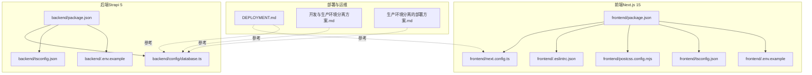

# 开发工具和配置

<cite>
**本文引用的文件**
- [frontend/tsconfig.json](file://frontend/tsconfig.json)
- [frontend/.eslintrc.json](file://frontend/.eslintrc.json)
- [frontend/.eslintignore](file://frontend/.eslintignore)
- [frontend/next.config.ts](file://frontend/next.config.ts)
- [frontend/postcss.config.mjs](file://frontend/postcss.config.mjs)
- [frontend/next-env.d.ts](file://frontend/next-env.d.ts)
- [frontend/package.json](file://frontend/package.json)
- [backend/tsconfig.json](file://backend/tsconfig.json)
- [backend/config/database.ts](file://backend/config/database.ts)
- [backend/.env.example](file://backend/.env.example)
- [backend/package.json](file://backend/package.json)
- [README.md](file://README.md)
- [DEPLOYMENT.md](file://DEPLOYMENT.md)
- [开发与生产环境分离方案.md](file://开发与生产环境分离方案.md)
- [生产环境分离的部署方案.md](file://生产环境分离的部署方案.md)
</cite>

## 目录
1. [简介](#简介)
2. [项目结构](#项目结构)
3. [核心组件](#核心组件)
4. [架构总览](#架构总览)
5. [详细组件分析](#详细组件分析)
6. [依赖关系分析](#依赖关系分析)
7. [性能考量](#性能考量)
8. [故障排查指南](#故障排查指南)
9. [结论](#结论)
10. [附录](#附录)

## 简介
本文件面向中创智控官网的开发团队，系统化梳理并说明开发工具链与配置，涵盖：
- TypeScript 配置（严格模式、路径别名、模块解析）
- ESLint 配置（代码规范、错误检测、自动修复）
- Next.js 构建配置（图片优化、路径别名、开发服务器）
- 数据库配置（SQLite、迁移与备份策略）
- 开发工作流程、代码审查标准与持续集成建议
- 调试技巧、性能分析与开发效率提升方法

目标是帮助团队建立一致、可维护且高效的开发与运维体系。

## 项目结构
项目采用前后端分离架构，前端基于 Next.js 15 App Router，后端基于 Strapi 5 CMS，数据库默认使用 SQLite（开发环境），生产环境可切换至 PostgreSQL，并通过 Nginx 反向代理统一对外提供服务。

图表来源
- [frontend/package.json](file://frontend/package.json#L1-L88)
- [frontend/tsconfig.json](file://frontend/tsconfig.json#L1-L42)
- [frontend/.eslintrc.json](file://frontend/.eslintrc.json#L1-L7)
- [frontend/next.config.ts](file://frontend/next.config.ts#L1-L39)
- [frontend/postcss.config.mjs](file://frontend/postcss.config.mjs#L1-L9)
- [backend/package.json](file://backend/package.json#L1-L45)
- [backend/tsconfig.json](file://backend/tsconfig.json#L1-L44)
- [backend/config/database.ts](file://backend/config/database.ts#L1-L61)
- [DEPLOYMENT.md](file://DEPLOYMENT.md#L1-L800)
- [开发与生产环境分离方案.md](file://开发与生产环境分离方案.md#L1-L800)
- [生产环境分离的部署方案.md](file://生产环境分离的部署方案.md#L1-L800)

章节来源
- [README.md](file://README.md#L66-L227)

## 核心组件
- TypeScript 配置：前端启用严格模式、路径别名、bundler 模块解析；后端启用增量编译与 CommonJS 模块解析。
- ESLint 配置：继承 Next.js 核心 Web Vitals 与 TypeScript 规范，配合忽略文件过滤噪声。
- Next.js 构建配置：图片优化白名单、现代图片格式、响应式尺寸、严格模式。
- 数据库配置：默认 SQLite，支持 MySQL/PostgreSQL，集中于 database.ts，含连接超时与池配置。
- 环境变量与密钥：前后端均提供示例文件，生产环境通过运维脚本生成密钥并注入 Docker Compose。
- 部署与运维：多阶段构建、容器化部署、Nginx 反向代理、Let's Encrypt 自动续期、备份与恢复脚本。

章节来源
- [frontend/tsconfig.json](file://frontend/tsconfig.json#L1-L42)
- [backend/tsconfig.json](file://backend/tsconfig.json#L1-L44)
- [frontend/.eslintrc.json](file://frontend/.eslintrc.json#L1-L7)
- [frontend/.eslintignore](file://frontend/.eslintignore#L1-L7)
- [frontend/next.config.ts](file://frontend/next.config.ts#L1-L39)
- [backend/config/database.ts](file://backend/config/database.ts#L1-L61)
- [backend/.env.example](file://backend/.env.example#L1-L15)
- [DEPLOYMENT.md](file://DEPLOYMENT.md#L1-L800)

## 架构总览
前后端分离，前端负责 UI 与交互，后端提供 CMS 与 API，数据库默认 SQLite（开发）或 PostgreSQL（生产）。Nginx 作为反向代理统一入口，提供 HTTPS 与健康检查。

图表来源
- [README.md](file://README.md#L229-L298)
- [DEPLOYMENT.md](file://DEPLOYMENT.md#L34-L100)
- [开发与生产环境分离方案.md](file://开发与生产环境分离方案.md#L72-L140)

## 详细组件分析

### TypeScript 配置（前端）
- 严格模式开启，提升类型安全
- 路径别名 @/* 指向前端根目录，简化导入
- 模块解析方式为 bundler，适配 Next.js 与 Turbopack
- 目标 ES2017，增量编译提升开发速度
- 通过插件启用 Next.js 类型支持

图表来源
- [frontend/tsconfig.json](file://frontend/tsconfig.json#L1-L42)

章节来源
- [frontend/tsconfig.json](file://frontend/tsconfig.json#L1-L42)

### TypeScript 配置（后端）
- CommonJS 模块解析，适配 Node.js 运行时
- 目标 ES2019，严格模式关闭但启用 skipLibCheck、forceConsistentCasingInFileNames
- 增量编译与 noEmitOnError，避免错误产物
- include/exclude 明确源码范围，排除 admin 与测试目录

章节来源
- [backend/tsconfig.json](file://backend/tsconfig.json#L1-L44)

### ESLint 配置与忽略
- 继承 Next.js 核心 Web Vitals 与 TypeScript 规范，统一前端代码风格
- 忽略 node_modules、.next、dist、build、coverage、public 等目录，减少无关扫描

章节来源
- [frontend/.eslintrc.json](file://frontend/.eslintrc.json#L1-L7)
- [frontend/.eslintignore](file://frontend/.eslintignore#L1-L7)

### Next.js 构建配置
- 图片优化：远程域名白名单（Unsplash、localhost:1337、127.0.0.1:1337、192.168.0.2:1337）
- 现代图片格式：AVIF、WebP
- 响应式尺寸：deviceSizes 与 imageSizes
- 严格模式：reactStrictMode
- 环境声明：next-env.d.ts 引用 Next.js 类型

图表来源
- [frontend/next.config.ts](file://frontend/next.config.ts#L1-L39)
- [frontend/next-env.d.ts](file://frontend/next-env.d.ts#L1-L7)

章节来源
- [frontend/next.config.ts](file://frontend/next.config.ts#L1-L39)
- [frontend/next-env.d.ts](file://frontend/next-env.d.ts#L1-L7)

### PostCSS 与 Tailwind CSS
- 使用 @tailwindcss/postcss 插件，自动处理 Tailwind 相关配置
- 全局样式在 app/globals.css 中定义品牌色与主题

章节来源
- [frontend/postcss.config.mjs](file://frontend/postcss.config.mjs#L1-L9)
- [README.md](file://README.md#L530-L543)

### 数据库配置（SQLite/MySQL/PostgreSQL）
- 默认客户端为 sqlite，连接参数包含文件路径与 useNullAsDefault
- 支持 mysql 与 postgres，包含连接字符串、SSL、池大小、连接超时等
- 可通过 DATABASE_CLIENT 与 DATABASE_FILENAME 等环境变量切换

图表来源
- [backend/config/database.ts](file://backend/config/database.ts#L1-L61)
- [backend/.env.example](file://backend/.env.example#L1-L15)

章节来源
- [backend/config/database.ts](file://backend/config/database.ts#L1-L61)
- [backend/.env.example](file://backend/.env.example#L1-L15)

### 环境变量与密钥管理
- 前端：NEXT_PUBLIC_STRAPI_URL（开发环境默认 http://localhost:1337）
- 后端：HOST/PORT、DATABASE_CLIENT/FILENAME/URL、APP_KEYS/JWT_SECRET 等
- 生产环境通过运维脚本生成密钥并注入 Docker Compose

章节来源
- [backend/.env.example](file://backend/.env.example#L1-L15)
- [DEPLOYMENT.md](file://DEPLOYMENT.md#L182-L222)

### 开发工作流程与脚本
- 前端：dev（TurboPack）、build、start、lint
- 后端：develop、build、start、console、deploy、import:*、strapi:*、upgrade
- 一键启动：终端1启动后端，终端2启动前端
- 代码检查：pnpm lint

章节来源
- [frontend/package.json](file://frontend/package.json#L6-L11)
- [backend/package.json](file://backend/package.json#L6-L19)
- [README.md](file://README.md#L306-L408)

### 持续集成与部署（CI/CD）建议
- 构建策略：部署时构建，不在仓库中提交构建产物
- 多阶段构建：减小镜像体积，提升安全性
- 健康检查：容器健康检查与 API 健康检查
- 自动化：部署脚本、证书初始化与续期、备份与恢复脚本
- 环境分离：开发/生产环境配置独立，密钥不提交

章节来源
- [DEPLOYMENT.md](file://DEPLOYMENT.md#L225-L320)
- [开发与生产环境分离方案.md](file://开发与生产环境分离方案.md#L291-L458)
- [生产环境分离的部署方案.md](file://生产环境分离的部署方案.md#L287-L350)

## 依赖关系分析
- 前端依赖 Next.js 15、React 18、TypeScript、Tailwind CSS、Radix UI、MUI 等
- 后端依赖 Strapi 5、better-sqlite3、React、styled-components、TypeScript
- 包管理器：前端使用 pnpm，后端使用 npm

图表来源
- [frontend/package.json](file://frontend/package.json#L12-L86)
- [backend/package.json](file://backend/package.json#L20-L35)

章节来源
- [frontend/package.json](file://frontend/package.json#L1-L88)
- [backend/package.json](file://backend/package.json#L1-L45)

## 性能考量
- 开发体验：前端启用 TurboPack，提升热更新与构建速度
- 图片优化：合理配置 remotePatterns 与响应式尺寸，减少带宽与加载时间
- 构建优化：多阶段构建、依赖缓存、生产依赖精简
- 健康检查：容器与 API 健康检查，保障服务可用性
- 监控与日志：Docker 日志轮转、健康检查、日志查看命令

章节来源
- [README.md](file://README.md#L496-L549)
- [DEPLOYMENT.md](file://DEPLOYMENT.md#L587-L647)

## 故障排查指南
- 环境变量缺失：确认 .env 与 .env.example 是否齐全，生产环境密钥是否生成
- 数据库连接失败：检查 DATABASE_CLIENT 与连接参数，确认 SQLite 文件路径或 PostgreSQL 可达性
- 图片加载异常：核对 next.config.ts 中 remotePatterns 与端口是否匹配
- API 404/500：检查后端健康状态与 CORS 配置
- 证书问题：确认 Let's Encrypt 证书初始化与续期脚本执行
- 备份与恢复：按备份脚本执行数据库与媒体文件备份，按恢复脚本执行恢复

章节来源
- [backend/.env.example](file://backend/.env.example#L1-L15)
- [backend/config/database.ts](file://backend/config/database.ts#L1-L61)
- [frontend/next.config.ts](file://frontend/next.config.ts#L1-L39)
- [DEPLOYMENT.md](file://DEPLOYMENT.md#L648-L744)

## 结论
本项目提供了清晰的前后端分离架构与完善的工具链配置。通过严格的 TypeScript 与 ESLint 设置、Next.js 图片优化与开发服务器、Strapi 后端与多数据库支持、以及容器化与自动化部署方案，团队可以在保证质量与安全的前提下，高效推进开发与运维工作。建议在日常工作中坚持：
- 严格遵循 ESLint 规范与代码审查标准
- 使用 Turbopack 与图片优化提升开发与用户体验
- 严格执行环境分离与密钥管理
- 定期备份与演练恢复流程
- 持续优化容器构建与健康检查

## 附录

### TypeScript 配置要点对照
- 前端：严格模式、bundler 模块解析、路径别名 @/*、ES2017、增量编译、Next 插件
- 后端：CommonJS、ES2019、增量编译、noEmitOnError、排除 admin 与测试

章节来源
- [frontend/tsconfig.json](file://frontend/tsconfig.json#L1-L42)
- [backend/tsconfig.json](file://backend/tsconfig.json#L1-L44)

### ESLint 配置要点
- 继承 next/core-web-vitals 与 next/typescript
- 忽略 node_modules、.next、dist、build、coverage、public

章节来源
- [frontend/.eslintrc.json](file://frontend/.eslintrc.json#L1-L7)
- [frontend/.eslintignore](file://frontend/.eslintignore#L1-L7)

### Next.js 构建配置要点
- 图片优化：remotePatterns、formats、deviceSizes/imageSizes
- 严格模式：reactStrictMode
- 环境声明：next-env.d.ts

章节来源
- [frontend/next.config.ts](file://frontend/next.config.ts#L1-L39)
- [frontend/next-env.d.ts](file://frontend/next-env.d.ts#L1-L7)

### 数据库配置要点
- 客户端：sqlite/mysql/postgres
- 连接参数：host/port/connectionString、ssl、pool、schema
- 环境变量：DATABASE_CLIENT、DATABASE_FILENAME/URL、连接超时

章节来源
- [backend/config/database.ts](file://backend/config/database.ts#L1-L61)
- [backend/.env.example](file://backend/.env.example#L1-L15)

### 部署与运维要点
- 多阶段构建、部署时构建、不提交构建产物
- 健康检查、日志轮转、备份与恢复脚本
- Let's Encrypt 证书初始化与续期
- 环境变量模板与密钥生成脚本

章节来源
- [DEPLOYMENT.md](file://DEPLOYMENT.md#L225-L320)
- [开发与生产环境分离方案.md](file://开发与生产环境分离方案.md#L291-L458)
- [生产环境分离的部署方案.md](file://生产环境分离的部署方案.md#L287-L350)