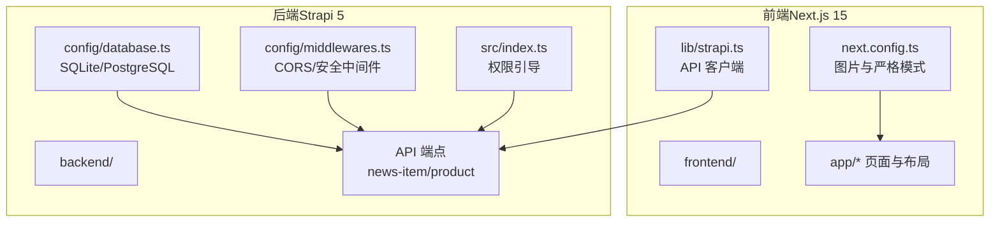
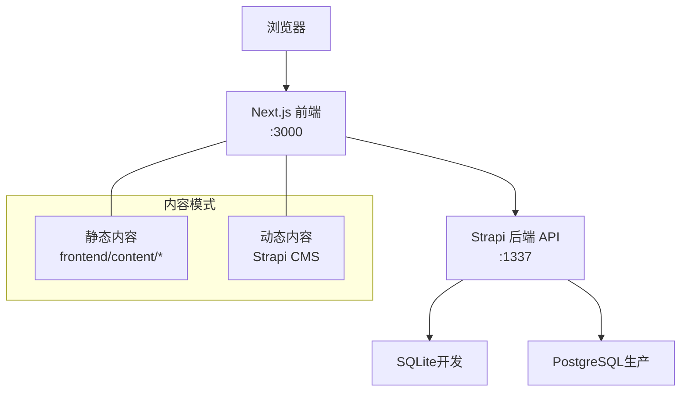
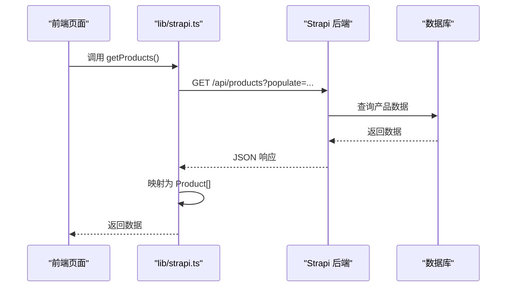
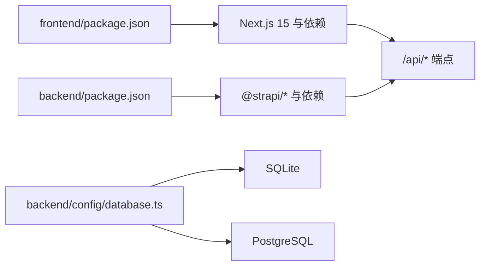

# 快速开始

<cite>
**本文引用的文件**
- [README.md](file://README.md)
- [DEPLOYMENT.md](file://DEPLOYMENT.md)
- [开发与生产环境分离方案.md](file://开发与生产环境分离方案.md)
- [生产环境分离的部署方案.md](file://生产环境分离的部署方案.md)
- [backend/package.json](file://backend/package.json)
- [frontend/package.json](file://frontend/package.json)
- [backend/.env.example](file://backend/.env.example)
- [frontend/.env.example](file://frontend/.env.example)
- [backend/config/database.ts](file://backend/config/database.ts)
- [frontend/next.config.ts](file://frontend/next.config.ts)
- [frontend/lib/strapi.ts](file://frontend/lib/strapi.ts)
- [backend/src/index.ts](file://backend/src/index.ts)
- [backend/config/middlewares.ts](file://backend/config/middlewares.ts)
</cite>

## 目录
1. [简介](#简介)
2. [项目结构](#项目结构)
3. [核心组件](#核心组件)
4. [架构总览](#架构总览)
5. [详细组件分析](#详细组件分析)
6. [依赖关系分析](#依赖关系分析)
7. [性能考虑](#性能考虑)
8. [故障排除指南](#故障排除指南)
9. [结论](#结论)
10. [附录](#附录)

## 简介
本指南面向希望快速搭建并运行中创智控官网项目的开发者，涵盖环境要求、安装步骤、环境变量配置、开发与生产模式启动流程、静态内容与动态内容模式的区别与切换方法，以及常见问题与故障排除建议。项目采用前后端分离架构：前端基于 Next.js 15 App Router，后端基于 Strapi 5 CMS，通过 API 进行数据交互。

## 项目结构
项目分为前后端两个独立目录，均提供独立的包管理与配置：
- frontend/：Next.js 15 应用，负责页面渲染、路由与静态/动态内容集成
- backend/：Strapi 5 CMS，提供 REST API、内容管理与 Admin UI

图表来源
- [frontend/next.config.ts](file://frontend/next.config.ts#L1-L39)
- [frontend/lib/strapi.ts](file://frontend/lib/strapi.ts#L1-L155)
- [backend/config/database.ts](file://backend/config/database.ts#L1-L61)
- [backend/config/middlewares.ts](file://backend/config/middlewares.ts#L1-L13)
- [backend/src/index.ts](file://backend/src/index.ts#L1-L65)

章节来源
- [README.md](file://README.md#L66-L227)

## 核心组件
- 前端 Next.js 15
  - App Router 文件系统路由，支持 SSR/SSG/CSR
  - 图片优化与远程域名白名单
  - 严格模式与 TypeScript
- 后端 Strapi 5
  - REST API 管理产品与新闻
  - SQLite/PostgreSQL 数据库配置
  - CORS/安全中间件与权限引导
- API 客户端
  - 前端通过 lib/strapi.ts 与后端 API 交互，支持 populate、排序与分页参数

章节来源
- [README.md](file://README.md#L496-L591)
- [frontend/next.config.ts](file://frontend/next.config.ts#L1-L39)
- [frontend/lib/strapi.ts](file://frontend/lib/strapi.ts#L1-L155)
- [backend/config/database.ts](file://backend/config/database.ts#L1-L61)
- [backend/config/middlewares.ts](file://backend/config/middlewares.ts#L1-L13)
- [backend/src/index.ts](file://backend/src/index.ts#L1-L65)

## 架构总览
前后端分离架构，前端通过 HTTP/HTTPS 与后端 API 通信；支持静态内容与动态内容两种模式。

图表来源
- [README.md](file://README.md#L249-L298)
- [backend/config/database.ts](file://backend/config/database.ts#L1-L61)

章节来源
- [README.md](file://README.md#L229-L298)

## 详细组件分析

### 环境要求与安装
- 前端
  - Node.js >= 20.0.0 且 <= 24.x.x
  - 包管理器：pnpm >= 8.0.0
- 后端
  - Node.js >= 20.0.0 且 <= 24.x.x
  - 包管理器：npm >= 6.0.0

安装步骤
- 进入 frontend 目录，安装依赖
- 进入 backend 目录，安装依赖

章节来源
- [README.md](file://README.md#L308-L321)
- [frontend/package.json](file://frontend/package.json#L1-L88)
- [backend/package.json](file://backend/package.json#L1-L45)

### 环境变量配置
- 前端（可选，使用 Strapi 动态内容时需要）
  - 复制示例文件为 .env
  - 设置 NEXT_PUBLIC_STRAPI_URL 指向后端 API
- 后端
  - 复制示例文件为 .env
  - 配置 HOST、PORT、DATABASE_CLIENT、DATABASE_FILENAME 等
  - 生产环境建议替换默认密钥

章节来源
- [README.md](file://README.md#L323-L337)
- [frontend/.env.example](file://frontend/.env.example#L1-L2)
- [backend/.env.example](file://backend/.env.example#L1-L15)

### 开发模式启动
- 终端 1：启动后端 Strapi
  - 进入 backend，执行开发命令
- 终端 2：启动前端 Next.js
  - 进入 frontend，执行开发命令
- 访问
  - 前端：http://localhost:3000
  - 后端 Admin：http://localhost:1337/admin
  - 后端 API：http://localhost:1337/api

章节来源
- [README.md](file://README.md#L339-L354)

### 生产模式构建与启动
- 构建
  - 前端：pnpm build
  - 后端：npm run build
- 启动
  - 前端：pnpm start
  - 后端：npm start

章节来源
- [README.md](file://README.md#L375-L398)

### 内容导入（可选）
- 设置环境变量
  - STRAPI_URL 指向后端地址
  - STRAPI_TOKEN 使用 Admin UI 获取的 JWT Token
- 导入命令
  - 导入产品：npm run import:products
  - 导入新闻：npm run import:news
  - 导入全部：npm run import:content

章节来源
- [README.md](file://README.md#L355-L373)

### 静态内容模式 vs 动态内容模式
- 静态内容模式（默认）
  - 内容存储在 frontend/content/ 目录
  - 类型安全的数据结构
  - 适合快速开发与静态内容
- 动态内容模式（Strapi CMS）
  - 内容存储在 Strapi 数据库
  - 通过 NEXT_PUBLIC_STRAPI_URL 指向后端 API
  - 支持 Admin UI 内容管理与导入脚本

切换方法
- 启用动态内容：设置前端 NEXT_PUBLIC_STRAPI_URL，使用 lib/strapi.ts 获取数据
- 回退静态内容：停止后端，直接使用 frontend/content/* 数据

章节来源
- [README.md](file://README.md#L264-L280)
- [frontend/lib/strapi.ts](file://frontend/lib/strapi.ts#L1-L155)

### 前端配置要点
- 图片优化
  - 远程域名白名单（含 localhost:1337、127.0.0.1:1337、192.168.0.2:1337）
  - 支持现代图片格式（AVIF、WebP）
  - 响应式尺寸配置
- 严格模式与 TypeScript
  - 严格模式开启
  - 目标 ES2017，模块解析方式为 bundler

章节来源
- [README.md](file://README.md#L500-L542)
- [frontend/next.config.ts](file://frontend/next.config.ts#L1-L39)

### 后端配置要点
- 数据库
  - 默认 SQLite（开发）
  - 支持 MySQL/PostgreSQL（通过 DATABASE_CLIENT 与连接参数）
- 中间件
  - 包含 CORS、安全、错误处理等中间件
- 权限引导
  - 自动为 Public 角色启用 Product/News 的 find/findOne 权限

章节来源
- [README.md](file://README.md#L555-L623)
- [backend/config/database.ts](file://backend/config/database.ts#L1-L61)
- [backend/config/middlewares.ts](file://backend/config/middlewares.ts#L1-L13)
- [backend/src/index.ts](file://backend/src/index.ts#L1-L65)

### API 客户端与数据映射
- API 客户端封装
  - getProducts、getFeaturedProducts、getNewsList、getFeaturedNews、getNewsBySlug、getAllNewsSlugs
  - 自动处理媒体 URL（resolveMediaUrl）
- 数据映射
  - 将 Strapi 返回的 attributes 映射为前端类型安全的 Product/NewsArticle

图表来源
- [frontend/lib/strapi.ts](file://frontend/lib/strapi.ts#L100-L155)
- [backend/config/database.ts](file://backend/config/database.ts#L1-L61)

章节来源
- [frontend/lib/strapi.ts](file://frontend/lib/strapi.ts#L1-L155)

## 依赖关系分析
- 前端依赖后端提供的 API，通过 NEXT_PUBLIC_STRAPI_URL 进行通信
- 后端支持多种数据库，通过 DATABASE_CLIENT 与连接参数切换
- CORS 中间件与权限引导确保 API 的安全访问

图表来源
- [frontend/package.json](file://frontend/package.json#L1-L88)
- [backend/package.json](file://backend/package.json#L1-L45)
- [backend/config/database.ts](file://backend/config/database.ts#L1-L61)

章节来源
- [frontend/package.json](file://frontend/package.json#L1-L88)
- [backend/package.json](file://backend/package.json#L1-L45)
- [backend/config/database.ts](file://backend/config/database.ts#L1-L61)

## 性能考虑
- 前端
  - Turbopack 开发服务器加速
  - 图片优化与现代格式支持
- 后端
  - 多数据库客户端支持，生产环境建议使用 PostgreSQL
  - 中间件与 CORS 配置降低跨域与安全风险

章节来源
- [README.md](file://README.md#L446-L448)
- [README.md](file://README.md#L592-L599)
- [README.md](file://README.md#L600-L607)

## 故障排除指南
- 前端无法访问后端 API
  - 检查 NEXT_PUBLIC_STRAPI_URL 是否指向正确的后端地址
  - 确认后端 CORS 配置允许前端来源
- 后端无法启动或数据库连接失败
  - 检查 DATABASE_CLIENT 与连接参数
  - 开发环境默认使用 SQLite，确认数据库文件路径
- 权限不足导致 API 403
  - 确认 Public 角色已启用 Product/News 的 find/findOne 权限
- 生产环境 HTTPS 证书问题
  - 使用 Let's Encrypt 自动化证书与续期
  - 检查 Nginx 配置与域名解析

章节来源
- [README.md](file://README.md#L624-L800)
- [backend/config/middlewares.ts](file://backend/config/middlewares.ts#L1-L13)
- [backend/src/index.ts](file://backend/src/index.ts#L19-L63)
- [DEPLOYMENT.md](file://DEPLOYMENT.md#L322-L410)

## 结论
通过本快速开始指南，您可以完成环境准备、安装依赖、配置环境变量，并在开发与生产模式下分别启动前后端。项目支持静态与动态两种内容模式，可根据需求灵活切换。遇到问题时，可参考故障排除章节进行定位与解决。

## 附录

### 开发与生产环境分离方案（参考）
- 开发环境：SQLite + 本地端口（前端:3000，后端:1337）
- 生产环境：PostgreSQL + Nginx 反向代理 + Let's Encrypt 证书
- 自动化部署脚本与健康检查

章节来源
- [开发与生产环境分离方案.md](file://开发与生产环境分离方案.md#L1-L800)
- [生产环境分离的部署方案.md](file://生产环境分离的部署方案.md#L1-L800)
- [DEPLOYMENT.md](file://DEPLOYMENT.md#L1-L800)