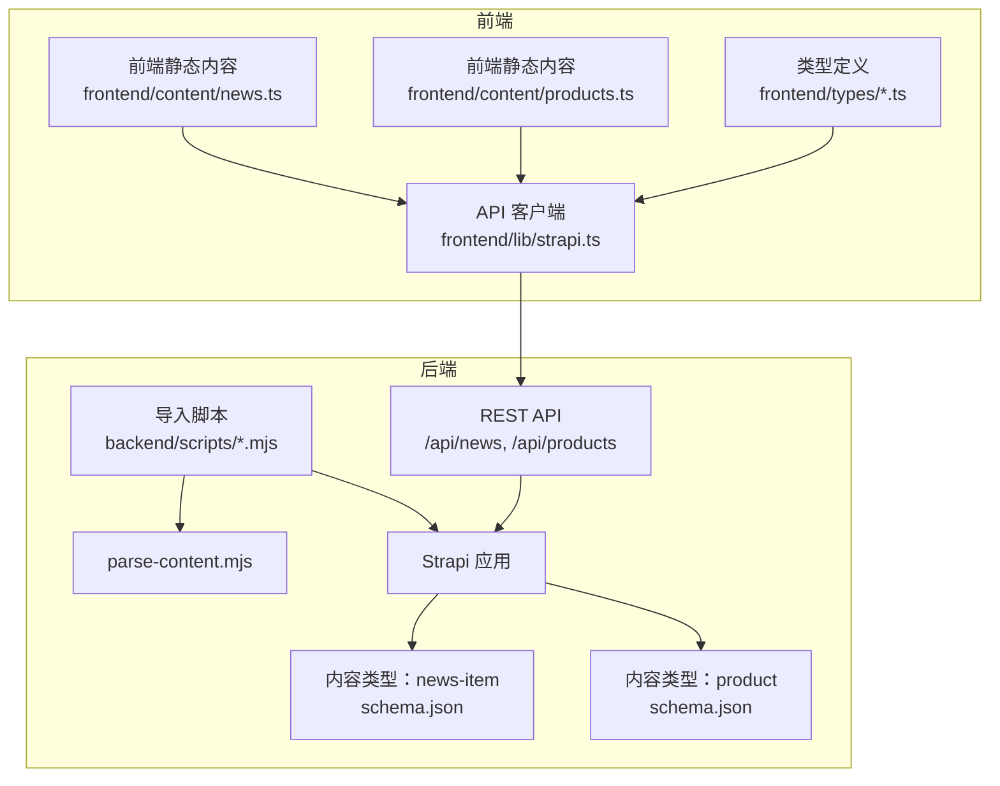
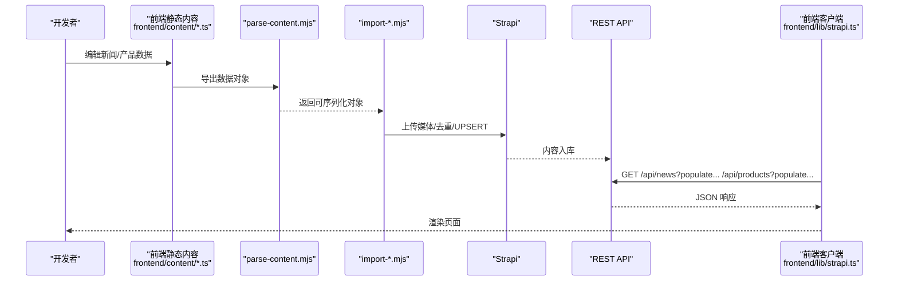
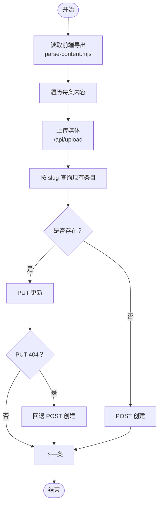
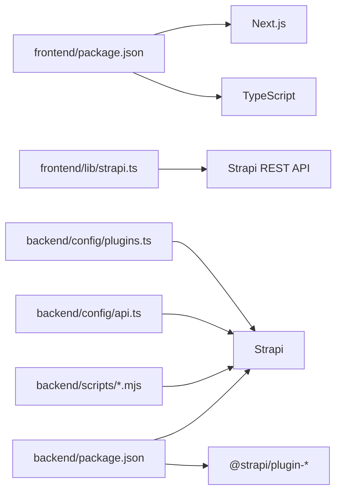

# 内容同步机制

<cite>
**本文引用的文件**
- [backend/src/index.ts](file://backend/src/index.ts)
- [backend/config/api.ts](file://backend/config/api.ts)
- [backend/config/plugins.ts](file://backend/config/plugins.ts)
- [backend/src/api/news-item/content-types/news-item/schema.json](file://backend/src/api/news-item/content-types/news-item/schema.json)
- [backend/src/api/product/content-types/product/schema.json](file://backend/src/api/product/content-types/product/schema.json)
- [backend/src/api/news-item/controllers/news-item.ts](file://backend/src/api/news-item/controllers/news-item.ts)
- [backend/src/api/news-item/services/news-item.ts](file://backend/src/api/news-item/services/news-item.ts)
- [backend/src/api/product/controllers/product.ts](file://backend/src/api/product/controllers/product.ts)
- [backend/src/api/product/services/product.ts](file://backend/src/api/product/services/product.ts)
- [backend/scripts/parse-content.mjs](file://backend/scripts/parse-content.mjs)
- [backend/scripts/import-news.mjs](file://backend/scripts/import-news.mjs)
- [backend/scripts/import-products.mjs](file://backend/scripts/import-products.mjs)
- [backend/package.json](file://backend/package.json)
- [frontend/lib/strapi.ts](file://frontend/lib/strapi.ts)
- [frontend/content/news.ts](file://frontend/content/news.ts)
- [frontend/content/products.ts](file://frontend/content/products.ts)
- [frontend/types/news.ts](file://frontend/types/news.ts)
- [frontend/types/product.ts](file://frontend/types/product.ts)
- [frontend/package.json](file://frontend/package.json)
</cite>

## 目录
1. [引言](#引言)
2. [项目结构](#项目结构)
3. [核心组件](#核心组件)
4. [架构总览](#架构总览)
5. [详细组件分析](#详细组件分析)
6. [依赖分析](#依赖分析)
7. [性能考虑](#性能考虑)
8. [故障排除指南](#故障排除指南)
9. [结论](#结论)
10. [附录](#附录)

## 引言
本文件系统性阐述本项目的“内容同步机制”，聚焦静态内容与动态内容之间的双向同步策略。项目采用“前端静态内容 + Strapi 动态 CMS”的混合架构：前端以 TypeScript/Next.js 管理静态内容（如新闻、产品），后端以 Strapi 提供动态内容服务（媒体、内容类型、REST API）。内容同步通过脚本导入器将前端静态内容导入 Strapi，同时前端通过 Strapi 提供的 API 获取动态内容，实现“本地编辑 → 内容验证 → 同步执行 → 前端消费”的完整工作流。

## 项目结构
- 后端（Strapi）
  - 内容类型：news-item（新闻）、product（产品）
  - 控制器与服务：基于 Strapi 工厂方法生成
  - 配置：REST 默认分页、上传插件大小限制
  - 同步脚本：parse-content（解析前端导出）、import-news、import-products（批量导入）
- 前端（Next.js）
  - 静态内容：news.ts、products.ts（数组与查询函数）
  - 类型定义：news.ts、product.ts
  - API 客户端：lib/strapi.ts（封装 Strapi 请求、媒体 URL 解析、数据映射）

图表来源
- [frontend/content/news.ts](file://frontend/content/news.ts#L1-L239)
- [frontend/content/products.ts](file://frontend/content/products.ts#L1-L183)
- [frontend/types/news.ts](file://frontend/types/news.ts#L1-L44)
- [frontend/types/product.ts](file://frontend/types/product.ts#L1-L39)
- [frontend/lib/strapi.ts](file://frontend/lib/strapi.ts#L1-L155)
- [backend/scripts/parse-content.mjs](file://backend/scripts/parse-content.mjs#L1-L17)
- [backend/scripts/import-news.mjs](file://backend/scripts/import-news.mjs#L1-L157)
- [backend/scripts/import-products.mjs](file://backend/scripts/import-products.mjs#L1-L163)
- [backend/src/api/news-item/content-types/news-item/schema.json](file://backend/src/api/news-item/content-types/news-item/schema.json#L1-L65)
- [backend/src/api/product/content-types/product/schema.json](file://backend/src/api/product/content-types/product/schema.json#L1-L63)
- [backend/config/api.ts](file://backend/config/api.ts#L1-L8)
- [backend/config/plugins.ts](file://backend/config/plugins.ts#L1-L11)

章节来源
- [backend/package.json](file://backend/package.json#L1-L45)
- [frontend/package.json](file://frontend/package.json#L1-L88)

## 核心组件
- 静态内容源（前端）
  - 新闻与产品数据以数组形式存储，配合查询函数提供筛选、排序、置顶等能力。
  - 类型定义确保前后端字段一致性和可维护性。
- 动态内容源（Strapi）
  - news-item 与 product 内容类型定义了字段、校验、UID、媒体、枚举等。
  - REST API 提供分页、排序、过滤、populate 等能力。
- 同步脚本
  - parse-content.mjs：清理并提取前端导出对象，返回可序列化的对象集合。
  - import-news.mjs 与 import-products.mjs：上传媒体、去重（按 slug）、UPSERT 写入 Strapi。
- 前端 API 客户端
  - 封装 Strapi URL、请求、错误处理、populate 参数、媒体 URL 解析与数据映射。

章节来源
- [frontend/content/news.ts](file://frontend/content/news.ts#L1-L239)
- [frontend/content/products.ts](file://frontend/content/products.ts#L1-L183)
- [frontend/types/news.ts](file://frontend/types/news.ts#L1-L44)
- [frontend/types/product.ts](file://frontend/types/product.ts#L1-L39)
- [frontend/lib/strapi.ts](file://frontend/lib/strapi.ts#L1-L155)
- [backend/src/api/news-item/content-types/news-item/schema.json](file://backend/src/api/news-item/content-types/news-item/schema.json#L1-L65)
- [backend/src/api/product/content-types/product/schema.json](file://backend/src/api/product/content-types/product/schema.json#L1-L63)
- [backend/scripts/parse-content.mjs](file://backend/scripts/parse-content.mjs#L1-L17)
- [backend/scripts/import-news.mjs](file://backend/scripts/import-news.mjs#L1-L157)
- [backend/scripts/import-products.mjs](file://backend/scripts/import-products.mjs#L1-L163)

## 架构总览
静态内容与动态内容的同步遵循“前端编辑 → 导入脚本 → Strapi”的单向写入路径；前端通过 Strapi 的 REST API 读取动态内容，实现“读取即消费”。

图表来源
- [frontend/content/news.ts](file://frontend/content/news.ts#L1-L239)
- [frontend/content/products.ts](file://frontend/content/products.ts#L1-L183)
- [backend/scripts/parse-content.mjs](file://backend/scripts/parse-content.mjs#L1-L17)
- [backend/scripts/import-news.mjs](file://backend/scripts/import-news.mjs#L1-L157)
- [backend/scripts/import-products.mjs](file://backend/scripts/import-products.mjs#L1-L163)
- [frontend/lib/strapi.ts](file://frontend/lib/strapi.ts#L100-L154)

## 详细组件分析

### 静态内容模式设计原理
- 内容文件结构
  - 新闻：news.ts 包含分类、文章数组与查询函数（按分类、置顶、最近等）。
  - 产品：products.ts 包含分类、产品数组与查询函数（按分类、置顶、排序等）。
- 数据组织方式
  - 使用强类型接口定义字段，确保字段一致性与 IDE 提示。
  - slug 作为唯一标识，便于与 Strapi 的 UID 字段对齐。
- 版本管理
  - 建议在 VCS 中记录每次变更，配合 CI/CD 触发导入脚本，实现“变更即同步”。

章节来源
- [frontend/content/news.ts](file://frontend/content/news.ts#L1-L239)
- [frontend/content/products.ts](file://frontend/content/products.ts#L1-L183)
- [frontend/types/news.ts](file://frontend/types/news.ts#L1-L44)
- [frontend/types/product.ts](file://frontend/types/product.ts#L1-L39)

### 动态内容模式实现机制
- Strapi 内容类型定义
  - news-item：包含标题、UID、摘要、富文本、枚举分类、单/多图媒体、布尔字段、JSON 字段、整数计数等。
  - product：包含名称、UID、简介、富文本、枚举分类、单/多图媒体、JSON 特性/规格、布尔置顶、排序权重、链接等。
- API 接口设计
  - REST 分页与排序：默认分页、最大限制、withCount。
  - populate 参数：按需加载关联媒体。
  - 过滤与排序：按 slug、发布时间、置顶等。
- 数据模型映射
  - 前端通过 lib/strapi.ts 将 Strapi 响应映射为前端类型，统一媒体 URL 解析与字段转换。

章节来源
- [backend/src/api/news-item/content-types/news-item/schema.json](file://backend/src/api/news-item/content-types/news-item/schema.json#L1-L65)
- [backend/src/api/product/content-types/product/schema.json](file://backend/src/api/product/content-types/product/schema.json#L1-L63)
- [backend/config/api.ts](file://backend/config/api.ts#L1-L8)
- [frontend/lib/strapi.ts](file://frontend/lib/strapi.ts#L1-L155)

### 内容同步触发条件与执行流程
- 触发条件
  - 前端静态内容变更（新增/修改/删除条目）。
  - CI/CD 流水线或手动执行导入脚本。
- 执行流程
  - parse-content.mjs：读取前端导出文件，清理导出包装，返回可序列化对象。
  - import-news.mjs / import-products.mjs：
    - 上传媒体文件至 Strapi（/api/upload）。
    - 按 slug 查询现有条目，存在则 PUT（UPSERT），不存在则 POST 创建。
    - 对 404 场景进行回退重试，确保幂等。
- 冲突解决策略
  - 以 slug 为键进行去重与更新，避免重复创建。
  - 上传失败时跳过并告警，不影响其他条目的导入。

图表来源
- [backend/scripts/parse-content.mjs](file://backend/scripts/parse-content.mjs#L1-L17)
- [backend/scripts/import-news.mjs](file://backend/scripts/import-news.mjs#L68-L122)
- [backend/scripts/import-products.mjs](file://backend/scripts/import-products.mjs#L68-L124)

章节来源
- [backend/scripts/parse-content.mjs](file://backend/scripts/parse-content.mjs#L1-L17)
- [backend/scripts/import-news.mjs](file://backend/scripts/import-news.mjs#L1-L157)
- [backend/scripts/import-products.mjs](file://backend/scripts/import-products.mjs#L1-L163)

### 内容更新工作流程
- 本地编辑
  - 在 frontend/content/*.ts 中修改数据。
- 内容验证
  - 使用类型定义进行字段校验；必要时在本地运行导入脚本进行预检。
- 同步执行
  - 设置 STRAPI_URL 与 STRAPI_TOKEN，执行 npm/yarn 脚本触发导入。
- 回滚机制
  - 若导入失败，保留前端静态内容不变；可在 Strapi 后台手动撤销或重试。

章节来源
- [backend/package.json](file://backend/package.json#L6-L18)
- [backend/scripts/import-news.mjs](file://backend/scripts/import-news.mjs#L10-L16)
- [backend/scripts/import-products.mjs](file://backend/scripts/import-products.mjs#L10-L16)

### 内容一致性、并发控制与数据完整性
- 一致性
  - 以 slug 为键进行 UPSERT，保证同一内容的唯一性与幂等。
  - populate 参数确保媒体与关联字段的一致加载。
- 并发控制
  - 导入脚本逐条处理，避免并发写入冲突。
  - 媒体上传失败时跳过并记录告警，不影响整体导入。
- 数据完整性
  - Strapi 内容类型定义字段约束与 UID 唯一性。
  - 前端类型定义与 Strapi 字段映射，减少字段错配。

章节来源
- [backend/src/api/news-item/content-types/news-item/schema.json](file://backend/src/api/news-item/content-types/news-item/schema.json#L13-L62)
- [backend/src/api/product/content-types/product/schema.json](file://backend/src/api/product/content-types/product/schema.json#L13-L61)
- [frontend/lib/strapi.ts](file://frontend/lib/strapi.ts#L55-L98)

### 实际同步示例
- 新闻导入
  - 步骤：准备 news.ts → 执行导入脚本 → 上传封面图 → 按 slug 去重 → 写入 Strapi → 前端通过 API 获取。
- 产品导入
  - 步骤：准备 products.ts → 执行导入脚本 → 上传主图与图库 → 按 slug 去重 → 写入 Strapi → 前端通过 API 获取。

章节来源
- [frontend/content/news.ts](file://frontend/content/news.ts#L11-L206)
- [frontend/content/products.ts](file://frontend/content/products.ts#L10-L161)
- [backend/scripts/import-news.mjs](file://backend/scripts/import-news.mjs#L124-L151)
- [backend/scripts/import-products.mjs](file://backend/scripts/import-products.mjs#L126-L157)

## 依赖分析
- 前端依赖
  - Next.js、React、类型定义与 API 客户端依赖 Strapi 提供的 REST 接口。
- 后端依赖
  - Strapi 核心、用户权限插件、上传插件（本地提供者与大小限制）。
  - 导入脚本依赖 Node.js 文件系统与 fetch。

图表来源
- [frontend/package.json](file://frontend/package.json#L1-L88)
- [frontend/lib/strapi.ts](file://frontend/lib/strapi.ts#L1-L155)
- [backend/package.json](file://backend/package.json#L1-L45)
- [backend/config/api.ts](file://backend/config/api.ts#L1-L8)
- [backend/config/plugins.ts](file://backend/config/plugins.ts#L1-L11)
- [backend/scripts/import-news.mjs](file://backend/scripts/import-news.mjs#L1-L157)
- [backend/scripts/import-products.mjs](file://backend/scripts/import-products.mjs#L1-L163)

章节来源
- [frontend/package.json](file://frontend/package.json#L1-L88)
- [backend/package.json](file://backend/package.json#L1-L45)

## 性能考虑
- 导入性能
  - 媒体上传串行执行，建议在 CI 中并行多个导入任务或分批处理。
  - 控制 populate 字段数量，减少响应体积。
- 读取性能
  - 合理使用 filters 与 sort，避免全量扫描。
  - 利用 Next.js 的 revalidate 机制缓存 API 响应。

## 故障排除指南
- 导入失败
  - 检查 STRAPI_TOKEN 是否正确设置；确认 Strapi 可访问。
  - 查看媒体上传失败日志，确认文件路径与 MIME 类型。
- 404 回退
  - 导入脚本对 PUT 404 进行回退到 POST，若仍失败，请检查 slug 是否正确。
- 前端无法获取数据
  - 确认 NEXT_PUBLIC_STRAPI_URL 与 API 路径；检查 populate 参数是否匹配内容类型。

章节来源
- [backend/scripts/import-news.mjs](file://backend/scripts/import-news.mjs#L13-L16)
- [backend/scripts/import-news.mjs](file://backend/scripts/import-news.mjs#L98-L122)
- [backend/scripts/import-products.mjs](file://backend/scripts/import-products.mjs#L13-L16)
- [backend/scripts/import-products.mjs](file://backend/scripts/import-products.mjs#L100-L124)
- [frontend/lib/strapi.ts](file://frontend/lib/strapi.ts#L100-L111)

## 结论
本项目通过“前端静态内容 + Strapi 动态内容”的组合，实现了高效的内容同步与消费。静态内容负责业务数据与元数据，动态内容负责媒体与灵活字段；导入脚本提供幂等的 UPSERT 能力，前端 API 客户端完成数据映射与渲染。通过明确的触发条件、执行流程与冲突策略，系统在保证一致性的同时具备良好的可维护性与扩展性。

## 附录
- 常用命令
  - 导入产品：npm/yarn 脚本调用导入脚本。
  - 导入新闻：npm/yarn 脚本调用导入脚本。
  - 导入全部：组合执行产品与新闻导入。
- 环境变量
  - STRAPI_URL：Strapi 服务地址。
  - STRAPI_TOKEN：管理员 JWT，用于授权导入。

章节来源
- [backend/package.json](file://backend/package.json#L6-L18)
- [backend/scripts/import-news.mjs](file://backend/scripts/import-news.mjs#L10-L16)
- [backend/scripts/import-products.mjs](file://backend/scripts/import-products.mjs#L10-L16)