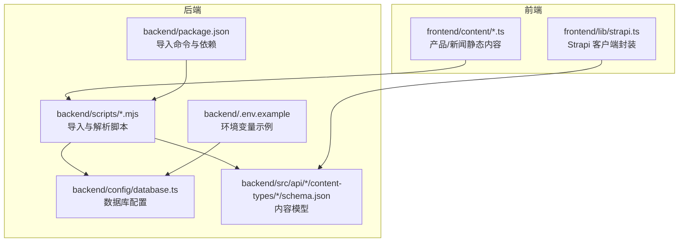
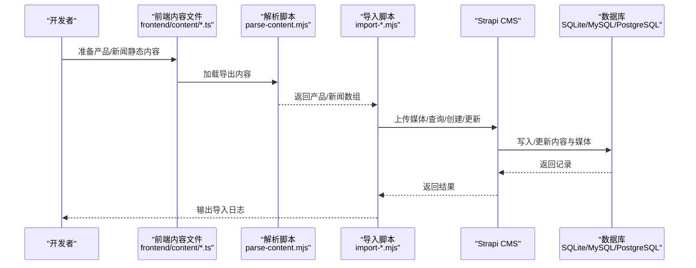
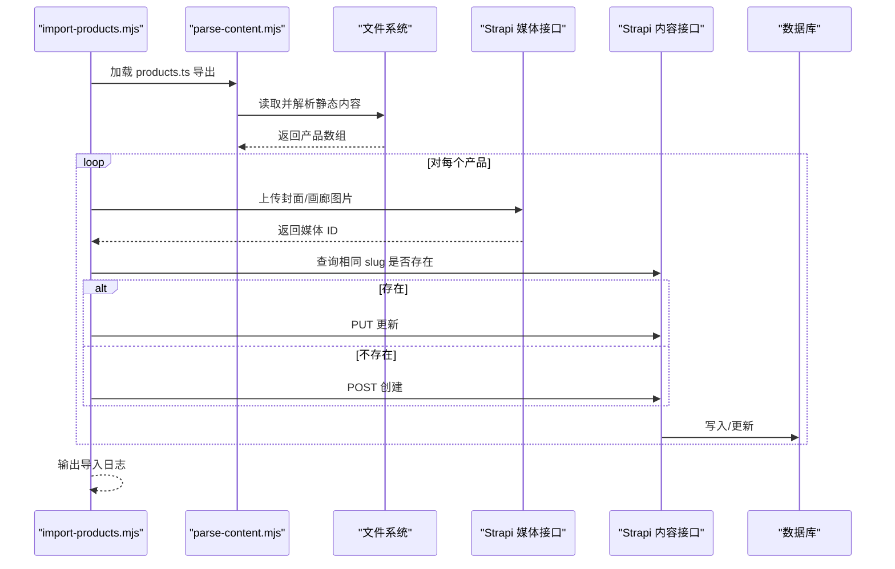
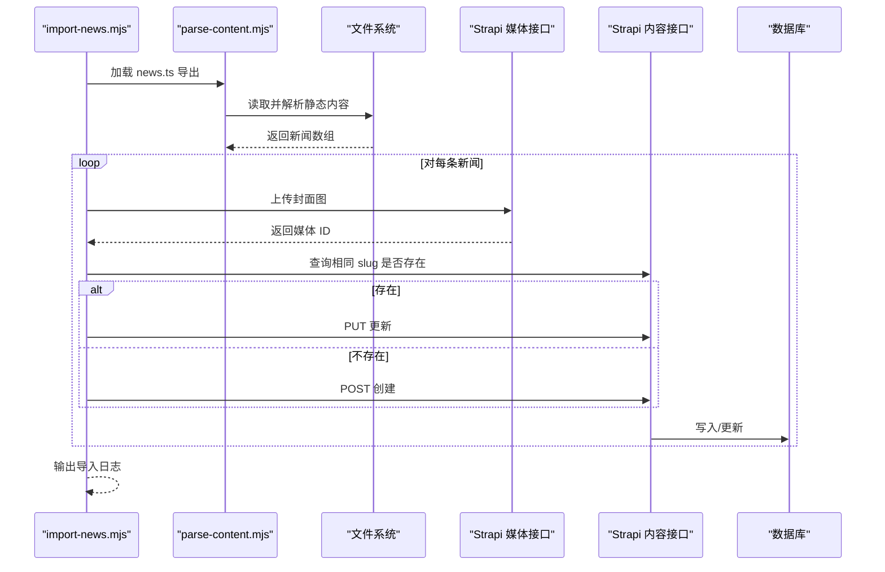
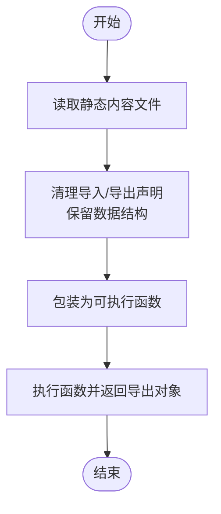
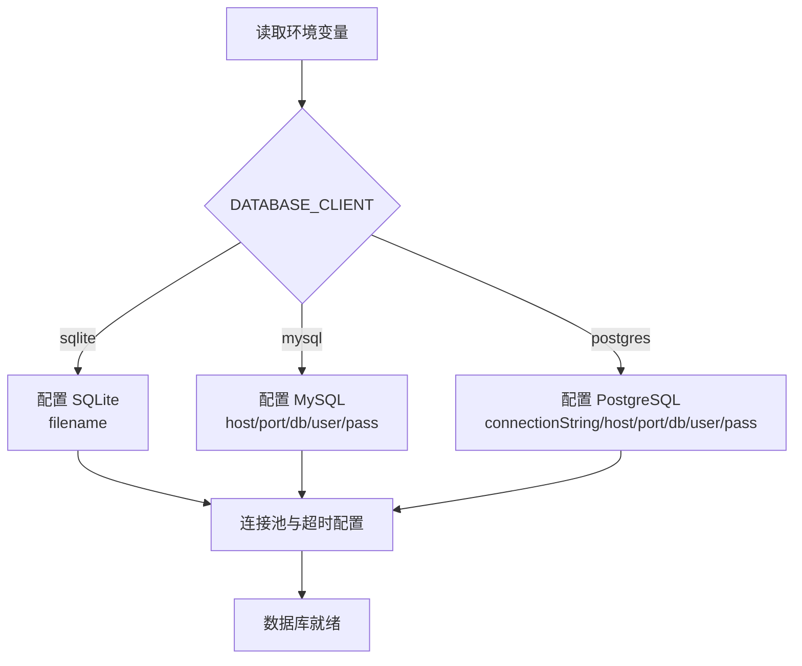
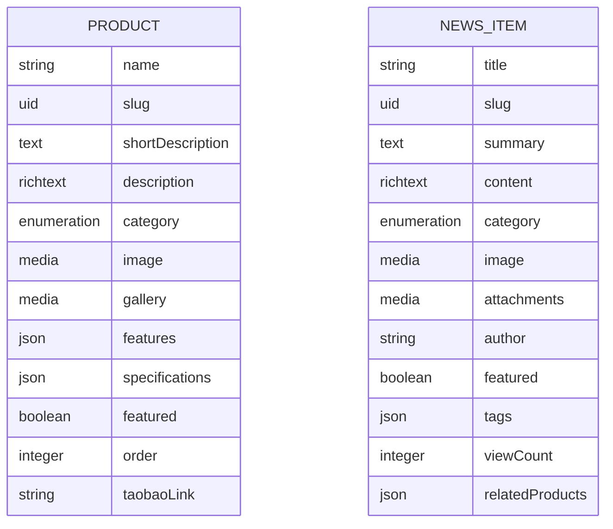
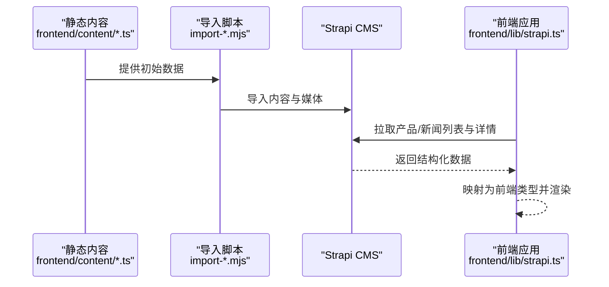
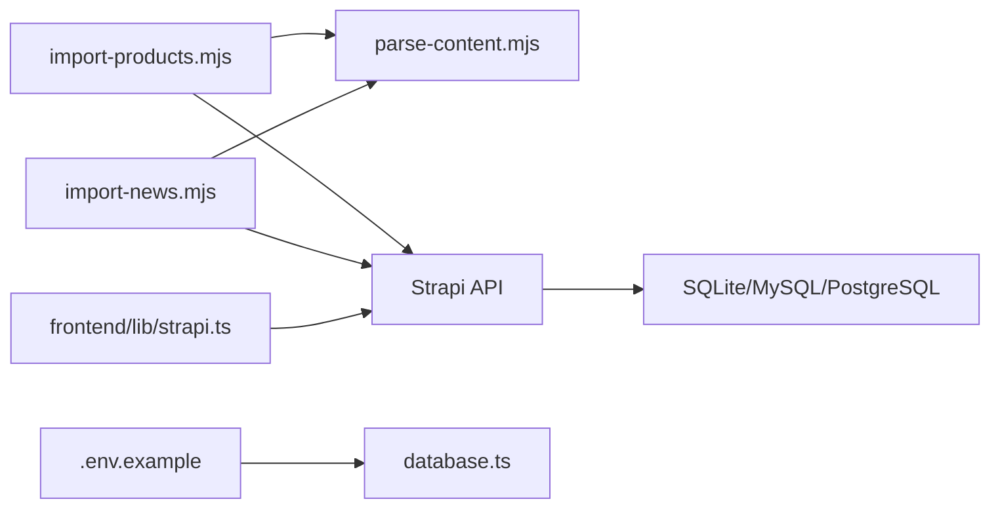

# 数据导入和迁移

<cite>
**本文引用的文件**
- [backend/scripts/import-products.mjs](file://backend/scripts/import-products.mjs)
- [backend/scripts/import-news.mjs](file://backend/scripts/import-news.mjs)
- [backend/scripts/parse-content.mjs](file://backend/scripts/parse-content.mjs)
- [backend/config/database.ts](file://backend/config/database.ts)
- [backend/src/api/product/content-types/product/schema.json](file://backend/src/api/product/content-types/product/schema.json)
- [backend/src/api/news-item/content-types/news-item/schema.json](file://backend/src/api/news-item/content-types/news-item/schema.json)
- [backend/package.json](file://backend/package.json)
- [frontend/content/products.ts](file://frontend/content/products.ts)
- [frontend/content/news.ts](file://frontend/content/news.ts)
- [backend/.env.example](file://backend/.env.example)
- [specs/001-strapi-backend-cms/spec.md](file://specs/001-strapi-backend-cms/spec.md)
- [frontend/lib/strapi.ts](file://frontend/lib/strapi.ts)
</cite>

## 目录
1. [简介](#简介)
2. [项目结构](#项目结构)
3. [核心组件](#核心组件)
4. [架构总览](#架构总览)
5. [详细组件分析](#详细组件分析)
6. [依赖分析](#依赖分析)
7. [性能考虑](#性能考虑)
8. [故障排除指南](#故障排除指南)
9. [结论](#结论)
10. [附录](#附录)

## 简介
本文件面向中创智控官网的数据管理与迁移，系统化阐述后端 Strapi CMS 的数据导入与迁移策略、数据库配置与迁移管理、静态内容与动态内容的同步机制、数据备份与恢复、数据验证与质量控制，以及批量处理、增量更新与数据清理的最佳实践。文档基于仓库中的脚本、配置与内容模型，提供可操作的流程与可视化图示，帮助运维与开发团队高效、安全地完成数据导入与日常维护。

## 项目结构
后端采用 Strapi 5 应用，前端为 Next.js 应用。数据导入脚本位于 backend/scripts，内容模型定义在 backend/src/api/*/content-types/*/schema.json，前端内容初始数据位于 frontend/content。数据库配置在 backend/config/database.ts，环境变量示例在 backend/.env.example。迁移与导入命令在 backend/package.json 的 scripts 字段中定义。

图表来源
- [backend/scripts/import-products.mjs](file://backend/scripts/import-products.mjs#L1-L163)
- [backend/scripts/import-news.mjs](file://backend/scripts/import-news.mjs#L1-L157)
- [backend/scripts/parse-content.mjs](file://backend/scripts/parse-content.mjs#L1-L17)
- [backend/config/database.ts](file://backend/config/database.ts#L1-L61)
- [backend/src/api/product/content-types/product/schema.json](file://backend/src/api/product/content-types/product/schema.json#L1-L63)
- [backend/src/api/news-item/content-types/news-item/schema.json](file://backend/src/api/news-item/content-types/news-item/schema.json#L1-L65)
- [backend/package.json](file://backend/package.json#L1-L45)
- [frontend/content/products.ts](file://frontend/content/products.ts#L1-L183)
- [frontend/content/news.ts](file://frontend/content/news.ts#L1-L239)
- [backend/.env.example](file://backend/.env.example#L1-L15)

章节来源
- [backend/package.json](file://backend/package.json#L6-L18)
- [backend/config/database.ts](file://backend/config/database.ts#L1-L61)
- [backend/.env.example](file://backend/.env.example#L1-L15)

## 核心组件
- 导入脚本
  - 产品导入：backend/scripts/import-products.mjs
  - 新闻导入：backend/scripts/import-news.mjs
  - 内容解析：backend/scripts/parse-content.mjs
- 数据库配置：backend/config/database.ts（支持 sqlite/mysql/postgres）
- 内容模型：产品与新闻的内容类型定义
- 前端数据客户端：frontend/lib/strapi.ts（负责调用 Strapi API 并映射为前端类型）

章节来源
- [backend/scripts/import-products.mjs](file://backend/scripts/import-products.mjs#L1-L163)
- [backend/scripts/import-news.mjs](file://backend/scripts/import-news.mjs#L1-L157)
- [backend/scripts/parse-content.mjs](file://backend/scripts/parse-content.mjs#L1-L17)
- [backend/config/database.ts](file://backend/config/database.ts#L1-L61)
- [backend/src/api/product/content-types/product/schema.json](file://backend/src/api/product/content-types/product/schema.json#L1-L63)
- [backend/src/api/news-item/content-types/news-item/schema.json](file://backend/src/api/news-item/content-types/news-item/schema.json#L1-L65)
- [frontend/lib/strapi.ts](file://frontend/lib/strapi.ts#L1-L155)

## 架构总览
数据从前端静态内容文件导入到 Strapi，再由前端通过 Strapi 客户端读取并渲染。数据库默认使用 SQLite，可通过环境变量切换为 MySQL 或 PostgreSQL。

图表来源
- [frontend/content/products.ts](file://frontend/content/products.ts#L1-L183)
- [frontend/content/news.ts](file://frontend/content/news.ts#L1-L239)
- [backend/scripts/parse-content.mjs](file://backend/scripts/parse-content.mjs#L1-L17)
- [backend/scripts/import-products.mjs](file://backend/scripts/import-products.mjs#L126-L157)
- [backend/scripts/import-news.mjs](file://backend/scripts/import-news.mjs#L124-L151)
- [backend/config/database.ts](file://backend/config/database.ts#L45-L50)

## 详细组件分析

### 产品数据导入流程
- 输入来源：frontend/content/products.ts
- 解析方式：parse-content.mjs 动态加载并提取导出对象
- 导入逻辑：
  - 上传封面图与画廊图到 Strapi 媒体库
  - 查询是否存在相同 slug 的产品，存在则更新，否则新建
  - 发送 JSON payload 至 Strapi API，包含名称、slug、描述、分类、特性、规格、排序、链接等字段
- 关键点：
  - 媒体上传失败会跳过该图片并记录告警
  - 404 场景下自动降级为新建
  - 成功后输出导入日志

图表来源
- [backend/scripts/import-products.mjs](file://backend/scripts/import-products.mjs#L126-L157)
- [backend/scripts/parse-content.mjs](file://backend/scripts/parse-content.mjs#L3-L16)
- [frontend/content/products.ts](file://frontend/content/products.ts#L10-L161)

章节来源
- [backend/scripts/import-products.mjs](file://backend/scripts/import-products.mjs#L1-L163)
- [backend/scripts/parse-content.mjs](file://backend/scripts/parse-content.mjs#L1-L17)
- [frontend/content/products.ts](file://frontend/content/products.ts#L1-L183)

### 新闻数据导入流程
- 输入来源：frontend/content/news.ts
- 解析与导入逻辑与产品类似，但字段包含标题、摘要、正文、作者、标签、相关产品、阅读数等
- 媒体上传与 Upsert 流程一致，失败时跳过图片并继续

图表来源
- [backend/scripts/import-news.mjs](file://backend/scripts/import-news.mjs#L124-L151)
- [backend/scripts/parse-content.mjs](file://backend/scripts/parse-content.mjs#L3-L16)
- [frontend/content/news.ts](file://frontend/content/news.ts#L11-L206)

章节来源
- [backend/scripts/import-news.mjs](file://backend/scripts/import-news.mjs#L1-L157)
- [backend/scripts/parse-content.mjs](file://backend/scripts/parse-content.mjs#L1-L17)
- [frontend/content/news.ts](file://frontend/content/news.ts#L1-L239)

### 内容解析工具
- loadExports 动态执行静态内容文件，剥离 import/export，仅保留数据结构，返回所需导出对象
- 作用：在不改动前端内容文件结构的前提下，将产品/新闻数组注入导入脚本

图表来源
- [backend/scripts/parse-content.mjs](file://backend/scripts/parse-content.mjs#L3-L16)

章节来源
- [backend/scripts/parse-content.mjs](file://backend/scripts/parse-content.mjs#L1-L17)

### 数据库配置与迁移管理
- 默认客户端：sqlite
- 配置项：
  - DATABASE_CLIENT：选择 sqlite/mysql/postgres
  - DATABASE_FILENAME：SQLite 文件路径
  - DATABASE_HOST/DATABASE_PORT/DATABASE_NAME/DATABASE_USERNAME/DATABASE_PASSWORD：MySQL/PostgreSQL 连接参数
  - DATABASE_URL：PostgreSQL 连接字符串
  - DATABASE_SSL_*：SSL 相关配置
  - DATABASE_POOL_MIN/DATABASE_POOL_MAX：连接池大小
  - DATABASE_CONNECTION_TIMEOUT：连接超时
- 迁移与版本：
  - Strapi 版本固定为 5.33.4
  - 提供 upgrade/upgrade:dry 命令用于升级
- 建议：
  - 生产环境优先使用 MySQL/PostgreSQL
  - SQLite 适合本地开发与小规模测试

图表来源
- [backend/config/database.ts](file://backend/config/database.ts#L4-L61)
- [backend/.env.example](file://backend/.env.example#L3-L4)

章节来源
- [backend/config/database.ts](file://backend/config/database.ts#L1-L61)
- [backend/.env.example](file://backend/.env.example#L1-L15)
- [backend/package.json](file://backend/package.json#L20-L28)

### 内容模型与字段映射
- 产品模型（product）：
  - 关键字段：name/slug/shortDescription/description/category/image/gallery/features/specifications/featured/order/taobaoLink
  - draftAndPublish：启用草稿与发布
- 新闻模型（news-item）：
  - 关键字段：title/slug/summary/content/category/image/attachments/author/featured/tags/viewCount/relatedProducts
  - draftAndPublish：启用草稿与发布
- 前端映射：
  - frontend/lib/strapi.ts 将 Strapi 返回的 attributes 映射为前端类型，处理媒体 URL 与回退

图表来源
- [backend/src/api/product/content-types/product/schema.json](file://backend/src/api/product/content-types/product/schema.json#L13-L62)
- [backend/src/api/news-item/content-types/news-item/schema.json](file://backend/src/api/news-item/content-types/news-item/schema.json#L13-L63)
- [frontend/lib/strapi.ts](file://frontend/lib/strapi.ts#L55-L98)

章节来源
- [backend/src/api/product/content-types/product/schema.json](file://backend/src/api/product/content-types/product/schema.json#L1-L63)
- [backend/src/api/news-item/content-types/news-item/schema.json](file://backend/src/api/news-item/content-types/news-item/schema.json#L1-L65)
- [frontend/lib/strapi.ts](file://frontend/lib/strapi.ts#L1-L155)

### 静态内容与动态内容同步机制
- 静态内容：产品/新闻的初始数据位于 frontend/content/*.ts
- 动态内容：通过导入脚本迁移到 Strapi，前端通过 frontend/lib/strapi.ts 调用 API 获取
- 同步策略：
  - 首次迁移：使用 import:content 命令批量导入产品与新闻
  - 日常维护：通过 Strapi 后台编辑内容，前端按需拉取
  - 首页动态模块：产品矩阵与新闻动态从 Strapi 获取，其他模块保持静态

图表来源
- [frontend/content/products.ts](file://frontend/content/products.ts#L1-L183)
- [frontend/content/news.ts](file://frontend/content/news.ts#L1-L239)
- [backend/scripts/import-products.mjs](file://backend/scripts/import-products.mjs#L126-L157)
- [backend/scripts/import-news.mjs](file://backend/scripts/import-news.mjs#L124-L151)
- [frontend/lib/strapi.ts](file://frontend/lib/strapi.ts#L113-L147)

章节来源
- [specs/001-strapi-backend-cms/spec.md](file://specs/001-strapi-backend-cms/spec.md#L83-L96)
- [backend/package.json](file://backend/package.json#L12-L14)
- [frontend/lib/strapi.ts](file://frontend/lib/strapi.ts#L1-L155)

## 依赖分析
- 导入脚本依赖：
  - parse-content.mjs：解析静态内容文件
  - Strapi API：上传媒体、查询、创建/更新
  - 环境变量：STRAPI_URL、STRAPI_TOKEN
- 前端依赖：
  - frontend/lib/strapi.ts：封装 Strapi API 调用与数据映射
- 数据库依赖：
  - backend/config/database.ts：根据 DATABASE_CLIENT 选择驱动
  - backend/.env.example：提供默认配置项

图表来源
- [backend/scripts/import-products.mjs](file://backend/scripts/import-products.mjs#L1-L163)
- [backend/scripts/import-news.mjs](file://backend/scripts/import-news.mjs#L1-L157)
- [backend/scripts/parse-content.mjs](file://backend/scripts/parse-content.mjs#L1-L17)
- [backend/config/database.ts](file://backend/config/database.ts#L1-L61)
- [backend/.env.example](file://backend/.env.example#L1-L15)
- [frontend/lib/strapi.ts](file://frontend/lib/strapi.ts#L1-L155)

章节来源
- [backend/package.json](file://backend/package.json#L12-L14)
- [backend/config/database.ts](file://backend/config/database.ts#L1-L61)
- [backend/.env.example](file://backend/.env.example#L1-L15)

## 性能考虑
- 批量导入建议：
  - 使用 import:content 一次性导入产品与新闻，减少多次往返
  - 控制并发：媒体上传与 API 调用建议串行或受控并发，避免超载
- 缓存与重验证：
  - 前端通过 next.fetch 的 revalidate 参数控制缓存刷新周期
- 数据库连接：
  - 合理设置连接池大小与超时，避免在导入高峰期阻塞
- 媒体处理：
  - 上传前校验文件类型与大小，避免无效请求

## 故障排除指南
- 环境变量缺失
  - 症状：导入脚本报错提示缺少 STRAPI_TOKEN
  - 处理：设置 STRAPI_TOKEN 为管理员 JWT，确保 STRAPI_URL 正确
- 媒体上传失败
  - 症状：控制台出现图片上传跳过告警
  - 处理：检查图片路径与类型，确认 Strapi 媒体接口可用
- Upsert 失败
  - 症状：404 后自动降级为新建仍失败
  - 处理：检查 slug 唯一性、内容模型字段、API 返回文本
- 数据库连接问题
  - 症状：启动时连接超时或无法连接
  - 处理：核对 DATABASE_CLIENT、DATABASE_URL/FILENAME、SSL 配置与网络代理

章节来源
- [backend/scripts/import-products.mjs](file://backend/scripts/import-products.mjs#L13-L16)
- [backend/scripts/import-news.mjs](file://backend/scripts/import-news.mjs#L13-L16)
- [backend/config/database.ts](file://backend/config/database.ts#L57-L58)
- [backend/.env.example](file://backend/.env.example#L1-L15)

## 结论
本方案通过静态内容文件与导入脚本实现初始数据迁移，借助 Strapi 的内容模型与媒体管理能力，将产品与新闻内容动态化。前端通过统一的 API 客户端获取数据并映射为类型化对象，实现首页动态模块与静态模块的解耦。配合数据库配置与环境变量，系统可在本地与生产环境灵活部署。建议在生产环境使用 MySQL/PostgreSQL，并建立完善的备份与回滚策略，确保数据安全与业务连续性。

## 附录

### 数据导入与迁移最佳实践
- 批量导入
  - 使用 import:content 一键导入产品与新闻
  - 导入前备份数据库，导入后验证关键字段与媒体
- 增量更新
  - 通过 Strapi 后台编辑内容，前端按 revalidate 周期自动刷新
  - 对热点内容可缩短 revalidate 时间
- 数据清理
  - 定期清理无用媒体与重复内容
  - 使用 Strapi 后台的草稿/发布流程控制可见性

### 数据备份与恢复
- SQLite
  - 备份：复制 DATABASE_FILENAME 指定的数据库文件
  - 恢复：停止服务后替换数据库文件，重启服务
- MySQL/PostgreSQL
  - 备份：使用 mysqldump/pg_dump 导出 SQL
  - 恢复：在目标实例执行导入，重建索引与权限
- 内容导出
  - 通过 Strapi 后台的备份功能导出内容与媒体
  - 导出后进行加密与异地存储

### 数据验证与质量控制
- 字段校验
  - 校验 slug 唯一性、必填字段完整性
- 媒体校验
  - 校验图片可访问性与尺寸合理性
- 前端校验
  - 对空数据与错误状态进行兜底渲染
- 监控与告警
  - 导入脚本输出日志，结合日志系统进行异常告警