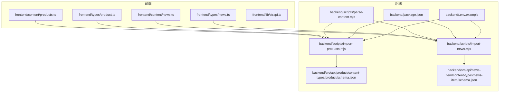
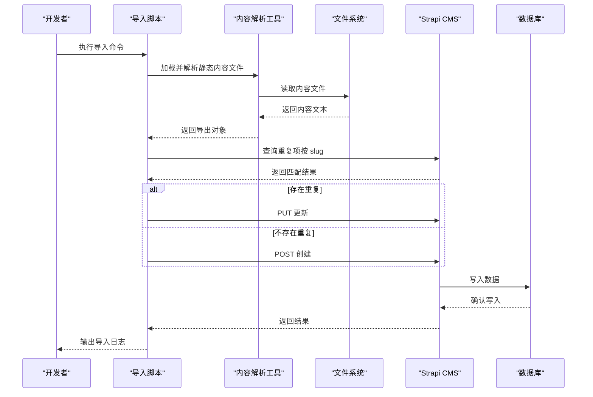
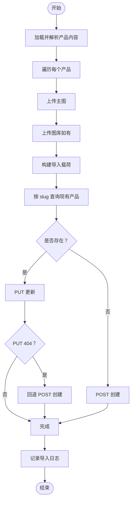
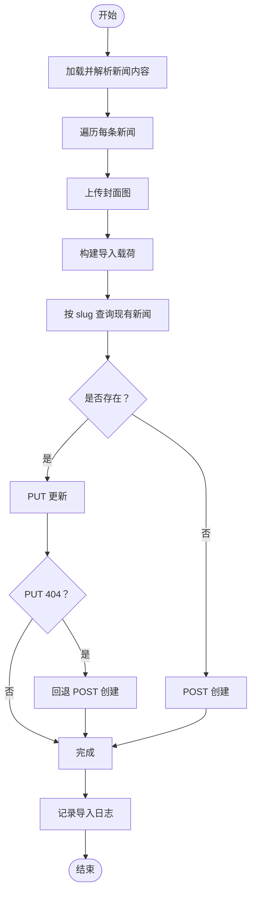
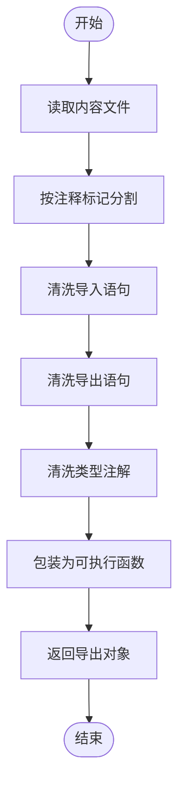
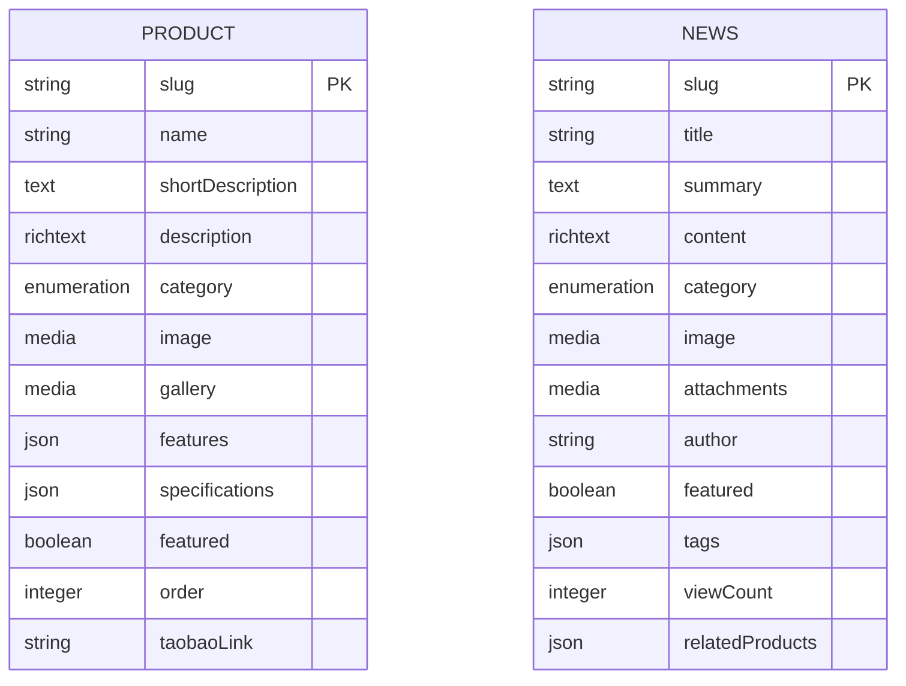
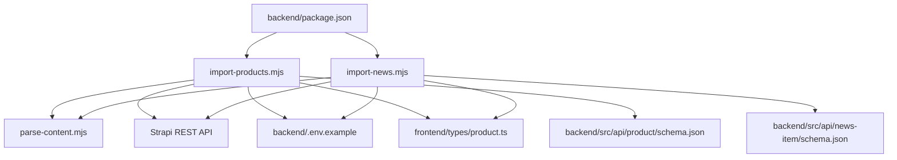

# 数据导入脚本

<cite>
**本文引用的文件**
- [backend/scripts/import-products.mjs](file://backend/scripts/import-products.mjs)
- [backend/scripts/import-news.mjs](file://backend/scripts/import-news.mjs)
- [backend/scripts/parse-content.mjs](file://backend/scripts/parse-content.mjs)
- [backend/package.json](file://backend/package.json)
- [backend/.env.example](file://backend/.env.example)
- [frontend/content/products.ts](file://frontend/content/products.ts)
- [frontend/content/news.ts](file://frontend/content/news.ts)
- [frontend/lib/strapi.ts](file://frontend/lib/strapi.ts)
- [frontend/types/product.ts](file://frontend/types/product.ts)
- [frontend/types/news.ts](file://frontend/types/news.ts)
- [backend/src/api/product/content-types/product/schema.json](file://backend/src/api/product/content-types/product/schema.json)
- [backend/src/api/news-item/content-types/news-item/schema.json](file://backend/src/api/news-item/content-types/news-item/schema.json)
- [README.md](file://README.md)
- [DEPLOYMENT.md](file://DEPLOYMENT.md)
</cite>

## 目录
1. [简介](#简介)
2. [项目结构](#项目结构)
3. [核心组件](#核心组件)
4. [架构概览](#架构概览)
5. [详细组件分析](#详细组件分析)
6. [依赖分析](#依赖分析)
7. [性能考虑](#性能考虑)
8. [故障排除指南](#故障排除指南)
9. [结论](#结论)
10. [附录](#附录)

## 简介
本文件系统性地阐述中创智控官网的数据导入自动化流程，聚焦两类脚本：
- 产品数据导入脚本：负责将前端静态内容中的产品数据导入至 Strapi CMS，并完成图片上传、重复数据检查、UPSERT 操作与错误处理。
- 新闻数据导入脚本：负责将前端静态内容中的新闻数据导入至 Strapi CMS，包含内容解析、数据映射与批量导入策略。

同时，文档还解释了内容解析工具的实现原理与使用方法，涵盖静态内容提取、数据格式转换与验证规则。最后提供脚本执行步骤、环境变量配置、参数设置指南，以及常见问题排查、性能优化建议与最佳实践。

## 项目结构
本项目采用前后端分离架构，数据导入脚本位于后端目录，通过 Strapi REST API 与数据库交互。前端静态内容通过导入脚本转换为 CMS 数据。

图表来源
- [backend/scripts/import-products.mjs](file://backend/scripts/import-products.mjs#L1-L163)
- [backend/scripts/import-news.mjs](file://backend/scripts/import-news.mjs#L1-L157)
- [backend/scripts/parse-content.mjs](file://backend/scripts/parse-content.mjs#L1-L17)
- [backend/package.json](file://backend/package.json#L6-L18)
- [backend/.env.example](file://backend/.env.example#L1-L15)
- [frontend/content/products.ts](file://frontend/content/products.ts#L1-L183)
- [frontend/content/news.ts](file://frontend/content/news.ts#L1-L239)
- [frontend/types/product.ts](file://frontend/types/product.ts#L1-L39)
- [frontend/types/news.ts](file://frontend/types/news.ts#L1-L44)
- [backend/src/api/product/content-types/product/schema.json](file://backend/src/api/product/content-types/product/schema.json#L1-L63)
- [backend/src/api/news-item/content-types/news-item/schema.json](file://backend/src/api/news-item/content-types/news-item/schema.json#L1-L65)

章节来源
- [README.md](file://README.md#L66-L227)

## 核心组件
- 内容解析工具：从静态内容文件中提取导出数据，清洗并动态执行，返回所需导出对象。
- 产品导入脚本：读取产品数据，上传图片，去重检查，执行 UPSERT，记录导入日志。
- 新闻导入脚本：读取新闻数据，上传封面图，去重检查，执行 UPSERT，记录导入日志。
- Strapi Schema：定义产品与新闻的数据字段、类型与约束，确保导入数据结构一致。
- 前端类型定义：保证导入数据与前端消费接口的类型一致性。

章节来源
- [backend/scripts/parse-content.mjs](file://backend/scripts/parse-content.mjs#L1-L17)
- [backend/scripts/import-products.mjs](file://backend/scripts/import-products.mjs#L1-L163)
- [backend/scripts/import-news.mjs](file://backend/scripts/import-news.mjs#L1-L157)
- [frontend/types/product.ts](file://frontend/types/product.ts#L1-L39)
- [frontend/types/news.ts](file://frontend/types/news.ts#L1-L44)
- [backend/src/api/product/content-types/product/schema.json](file://backend/src/api/product/content-types/product/schema.json#L1-L63)
- [backend/src/api/news-item/content-types/news-item/schema.json](file://backend/src/api/news-item/content-types/news-item/schema.json#L1-L65)

## 架构概览
数据导入的整体流程如下：

图表来源
- [backend/scripts/import-products.mjs](file://backend/scripts/import-products.mjs#L68-L124)
- [backend/scripts/import-news.mjs](file://backend/scripts/import-news.mjs#L68-L122)
- [backend/scripts/parse-content.mjs](file://backend/scripts/parse-content.mjs#L3-L16)

## 详细组件分析

### 产品数据导入脚本分析
- 数据来源与解析
  - 从前端内容文件中读取产品集合，使用内容解析工具动态执行并返回导出对象。
  - 解析工具通过清洗导入声明、导出声明与类型注解，构造可执行的包装函数，返回所需导出名称的对象。
- 图片上传处理
  - 通过相对路径拼接绝对路径，读取本地图片文件，构造 FormData 并调用 Strapi 上传接口。
  - 根据文件扩展名推断 MIME 类型，确保上传成功并返回媒体 ID。
- 重复数据检查与 UPSERT
  - 通过查询 API 按 slug 检索现有产品，若存在则使用 PUT 更新，否则使用 POST 创建。
  - 若 PUT 返回 404，表示实体已被删除但仍保留 ID，脚本会回退为 POST 创建。
- 错误处理机制
  - 上传失败时记录警告并跳过该图片，继续处理后续数据。
  - API 请求失败时抛出错误并终止脚本，便于定位问题。
- 数据映射与填充
  - 将前端产品字段映射到 Strapi 产品模型，必要字段如 gallery 为数组时逐个上传并收集 ID。
  - 为每条产品填充发布时间等字段，确保数据完整性。

图表来源
- [backend/scripts/import-products.mjs](file://backend/scripts/import-products.mjs#L126-L157)
- [backend/scripts/import-products.mjs](file://backend/scripts/import-products.mjs#L35-L66)
- [backend/scripts/import-products.mjs](file://backend/scripts/import-products.mjs#L68-L81)
- [backend/scripts/import-products.mjs](file://backend/scripts/import-products.mjs#L83-L124)

章节来源
- [backend/scripts/import-products.mjs](file://backend/scripts/import-products.mjs#L1-L163)
- [backend/scripts/parse-content.mjs](file://backend/scripts/parse-content.mjs#L1-L17)
- [frontend/content/products.ts](file://frontend/content/products.ts#L1-L183)
- [frontend/types/product.ts](file://frontend/types/product.ts#L1-L39)
- [backend/src/api/product/content-types/product/schema.json](file://backend/src/api/product/content-types/product/schema.json#L1-L63)

### 新闻数据导入脚本分析
- 数据来源与解析
  - 从前端内容文件中读取新闻集合，使用内容解析工具动态执行并返回导出对象。
- 图片上传处理
  - 与产品脚本相同，上传封面图并返回媒体 ID。
- 重复数据检查与 UPSERT
  - 通过查询 API 按 slug 检索现有新闻，若存在则使用 PUT 更新，否则使用 POST 创建。
  - 若 PUT 返回 404，脚本回退为 POST 创建。
- 错误处理机制
  - 上传失败时记录警告并跳过该图片，继续处理后续数据。
  - API 请求失败时抛出错误并终止脚本。
- 数据映射与填充
  - 将前端新闻字段映射到 Strapi 新闻模型，处理日期格式、标签、置顶、阅读量等字段。
  - 为每条新闻填充发布时间，确保排序与展示逻辑正确。

图表来源
- [backend/scripts/import-news.mjs](file://backend/scripts/import-news.mjs#L124-L151)
- [backend/scripts/import-news.mjs](file://backend/scripts/import-news.mjs#L35-L66)
- [backend/scripts/import-news.mjs](file://backend/scripts/import-news.mjs#L68-L81)
- [backend/scripts/import-news.mjs](file://backend/scripts/import-news.mjs#L83-L122)

章节来源
- [backend/scripts/import-news.mjs](file://backend/scripts/import-news.mjs#L1-L157)
- [backend/scripts/parse-content.mjs](file://backend/scripts/parse-content.mjs#L1-L17)
- [frontend/content/news.ts](file://frontend/content/news.ts#L1-L239)
- [frontend/types/news.ts](file://frontend/types/news.ts#L1-L44)
- [backend/src/api/news-item/content-types/news-item/schema.json](file://backend/src/api/news-item/content-types/news-item/schema.json#L1-L65)

### 内容解析工具分析
- 静态内容提取
  - 读取目标内容文件，截取注释标记之前的片段，避免解析到后续代码。
- 数据格式转换
  - 清洗导入语句、导出语句与类型注解，将导出常量转换为普通变量，以便动态执行。
- 验证规则
  - 通过返回对象包含指定导出名称，确保导入脚本只获取所需数据集合。
- 使用方法
  - 在导入脚本中调用解析工具，传入内容文件路径与导出名称数组，即可获得导出对象。

图表来源
- [backend/scripts/parse-content.mjs](file://backend/scripts/parse-content.mjs#L3-L16)

章节来源
- [backend/scripts/parse-content.mjs](file://backend/scripts/parse-content.mjs#L1-L17)

### 数据模型与映射
- 产品模型
  - 字段包括名称、唯一标识、简述、富文本描述、分类、主图、图库、特性列表、技术规格、置顶、排序权重、淘宝链接等。
  - 通过前端类型定义与 Strapi Schema 保持一致，确保导入与消费两端类型安全。
- 新闻模型
  - 字段包括标题、唯一标识、摘要、富文本正文、分类、封面图、附件、作者、置顶、标签、阅读量、关联产品等。
  - 通过前端类型定义与 Strapi Schema 保持一致，确保导入与消费两端类型安全。

图表来源
- [backend/src/api/product/content-types/product/schema.json](file://backend/src/api/product/content-types/product/schema.json#L13-L62)
- [backend/src/api/news-item/content-types/news-item/schema.json](file://backend/src/api/news-item/content-types/news-item/schema.json#L13-L63)
- [frontend/types/product.ts](file://frontend/types/product.ts#L13-L38)
- [frontend/types/news.ts](file://frontend/types/news.ts#L16-L43)

章节来源
- [frontend/types/product.ts](file://frontend/types/product.ts#L1-L39)
- [frontend/types/news.ts](file://frontend/types/news.ts#L1-L44)
- [backend/src/api/product/content-types/product/schema.json](file://backend/src/api/product/content-types/product/schema.json#L1-L63)
- [backend/src/api/news-item/content-types/news-item/schema.json](file://backend/src/api/news-item/content-types/news-item/schema.json#L1-L65)

## 依赖分析
- 脚本与工具
  - 导入脚本依赖内容解析工具，解析前端静态内容文件。
  - 导入脚本通过 Strapi REST API 与数据库交互，依赖后端环境变量与 API Token。
- 前后端类型一致性
  - 前端类型定义与 Strapi Schema 保持一致，确保导入数据结构正确。
- 命令与脚本
  - 通过后端 package.json 中的脚本命令执行导入，支持分别导入产品与新闻，或一次性导入全部内容。

图表来源
- [backend/scripts/import-products.mjs](file://backend/scripts/import-products.mjs#L1-L163)
- [backend/scripts/import-news.mjs](file://backend/scripts/import-news.mjs#L1-L157)
- [backend/scripts/parse-content.mjs](file://backend/scripts/parse-content.mjs#L1-L17)
- [backend/package.json](file://backend/package.json#L6-L18)
- [backend/.env.example](file://backend/.env.example#L1-L15)
- [frontend/types/product.ts](file://frontend/types/product.ts#L1-L39)
- [frontend/types/news.ts](file://frontend/types/news.ts#L1-L44)
- [backend/src/api/product/content-types/product/schema.json](file://backend/src/api/product/content-types/product/schema.json#L1-L63)
- [backend/src/api/news-item/content-types/news-item/schema.json](file://backend/src/api/news-item/content-types/news-item/schema.json#L1-L65)

章节来源
- [backend/package.json](file://backend/package.json#L6-L18)
- [backend/.env.example](file://backend/.env.example#L1-L15)

## 性能考虑
- 并发与批量
  - 当前脚本逐条处理，未使用并发上传或批量导入。对于大量图片或数据，可考虑分批处理与并发上传以提升性能。
- 上传策略
  - 图片上传采用逐张上传，若存在大量重复图片，可引入去重与缓存策略，减少重复上传。
- 错误恢复
  - 脚本在遇到错误时会终止，建议在生产环境中增加重试机制与断点续传能力，避免大规模中断。
- 网络与带宽
  - 导入过程受网络与带宽影响较大，建议在稳定网络环境下执行，并预留重试与超时配置。
- 数据库写入
  - 通过 UPSERT 写入数据库，建议在导入前进行索引优化与事务批量提交，减少锁竞争与写入延迟。

## 故障排除指南
- 环境变量缺失
  - STRAPI_TOKEN 未设置会导致脚本退出。请在执行前设置正确的 Admin JWT Token。
- API 请求失败
  - 若 API 返回非 2xx 状态码，脚本会抛出错误并输出详细信息。请检查 Strapi 服务状态与网络连通性。
- 404 回退
  - 若 PUT 更新返回 404，脚本会自动回退为 POST 创建。若仍失败，请检查实体是否存在或权限配置。
- 图片上传失败
  - 若图片上传失败，脚本会记录警告并跳过该图片。请检查图片路径与权限，确认文件存在且可读。
- 类型不匹配
  - 若导入字段与 Strapi Schema 不一致，可能导致写入失败。请核对前端类型定义与后端 Schema。
- 前端消费异常
  - 若前端无法正确显示导入数据，检查前端类型定义与 Strapi 响应映射逻辑，确保字段一致。

章节来源
- [backend/scripts/import-products.mjs](file://backend/scripts/import-products.mjs#L13-L16)
- [backend/scripts/import-products.mjs](file://backend/scripts/import-products.mjs#L55-L58)
- [backend/scripts/import-products.mjs](file://backend/scripts/import-products.mjs#L100-L121)
- [backend/scripts/import-news.mjs](file://backend/scripts/import-news.mjs#L13-L16)
- [backend/scripts/import-news.mjs](file://backend/scripts/import-news.mjs#L55-L58)
- [backend/scripts/import-news.mjs](file://backend/scripts/import-news.mjs#L98-L119)
- [frontend/lib/strapi.ts](file://frontend/lib/strapi.ts#L55-L98)

## 结论
本数据导入脚本通过内容解析工具与 Strapi REST API，实现了从静态内容到动态 CMS 的自动化导入。脚本具备完善的重复数据检查、UPSERT 与错误处理机制，能够稳定地将产品与新闻数据导入至数据库。建议在生产环境中进一步优化并发与批量策略，并完善重试与断点续传能力，以提升整体性能与可靠性。

## 附录

### 脚本执行步骤
- 设置环境变量
  - 设置 STRAPI_URL 与 STRAPI_TOKEN，前者为 Strapi API 地址，后者为 Admin JWT Token。
- 执行导入命令
  - 导入产品：在后端目录执行导入命令。
  - 导入新闻：在后端目录执行导入命令。
  - 导入全部：在后端目录执行导入全部内容的命令。

章节来源
- [backend/package.json](file://backend/package.json#L12-L14)
- [README.md](file://README.md#L355-L373)

### 环境变量配置
- 后端环境变量
  - HOST、PORT、DATABASE_CLIENT、DATABASE_FILENAME 等，用于配置 Strapi 服务器与数据库。
  - APP_KEYS、API_TOKEN_SALT、ADMIN_JWT_SECRET、TRANSFER_TOKEN_SALT、JWT_SECRET、ENCRYPTION_KEY 等，用于安全密钥。
  - HTTP_PROXY、HTTPS_PROXY 等，用于网络代理配置（可选）。

章节来源
- [backend/.env.example](file://backend/.env.example#L1-L15)

### 参数设置指南
- STRAPI_URL
  - 导入脚本使用的 Strapi API 地址，默认为本地开发环境地址。
- STRAPI_TOKEN
  - 导入脚本使用的 Admin JWT Token，必须设置，否则脚本会退出。
- 产品与新闻字段映射
  - 导入脚本会将前端内容中的字段映射到 Strapi Schema 中对应字段，确保类型与结构一致。

章节来源
- [backend/scripts/import-products.mjs](file://backend/scripts/import-products.mjs#L10-L16)
- [backend/scripts/import-news.mjs](file://backend/scripts/import-news.mjs#L10-L16)
- [frontend/types/product.ts](file://frontend/types/product.ts#L13-L38)
- [frontend/types/news.ts](file://frontend/types/news.ts#L16-L43)
- [backend/src/api/product/content-types/product/schema.json](file://backend/src/api/product/content-types/product/schema.json#L13-L62)
- [backend/src/api/news-item/content-types/news-item/schema.json](file://backend/src/api/news-item/content-types/news-item/schema.json#L13-L63)

### 常见问题排查
- 无法连接 Strapi
  - 检查 STRAPI_URL 与网络连通性，确认 Strapi 服务正在运行。
- 权限不足
  - 确认 STRAPI_TOKEN 具备创建与更新权限，必要时在 Admin UI 中生成 Full Access Token。
- 图片路径错误
  - 检查前端内容文件中的图片路径是否正确，确保图片存在于 public 目录中。
- 字段类型不匹配
  - 检查前端类型定义与后端 Schema，确保字段类型与枚举值一致。

章节来源
- [README.md](file://README.md#L624-L800)

### 性能优化建议
- 并发上传与批量导入
  - 对于大量图片与数据，建议分批处理并使用并发上传，减少等待时间。
- 去重与缓存
  - 引入图片去重与缓存策略，避免重复上传，提升导入速度。
- 重试与断点续传
  - 在生产环境中增加重试机制与断点续传能力，避免大规模中断。
- 索引与事务
  - 在导入前进行数据库索引优化与事务批量提交，减少锁竞争与写入延迟。

### 最佳实践
- 类型安全
  - 前端类型定义与后端 Schema 保持一致，确保导入数据结构正确。
- 错误处理
  - 在导入脚本中完善错误处理与日志记录，便于问题定位与恢复。
- 环境隔离
  - 开发、测试与生产环境使用不同的 STRAPI_URL 与 STRAPI_TOKEN，避免误操作。
- 自动化
  - 将导入脚本集成到 CI/CD 流水线中，实现自动化部署与数据同步。