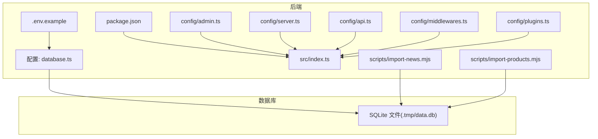
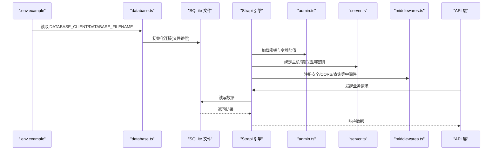
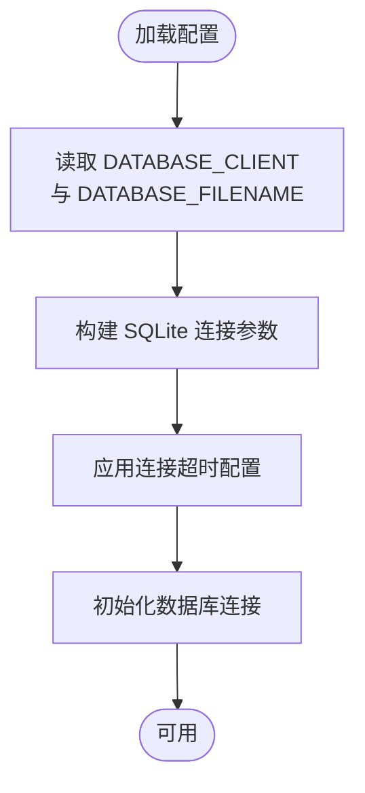
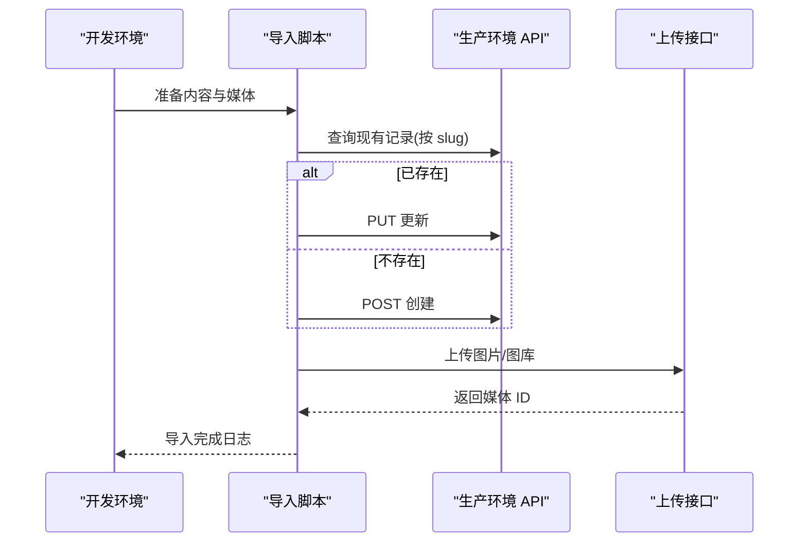
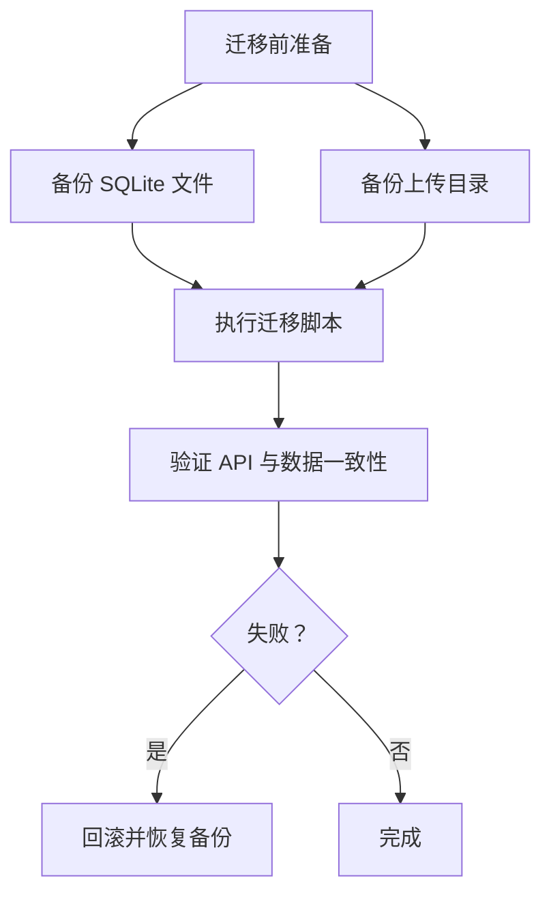
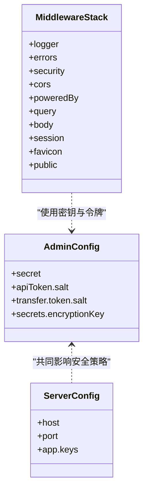
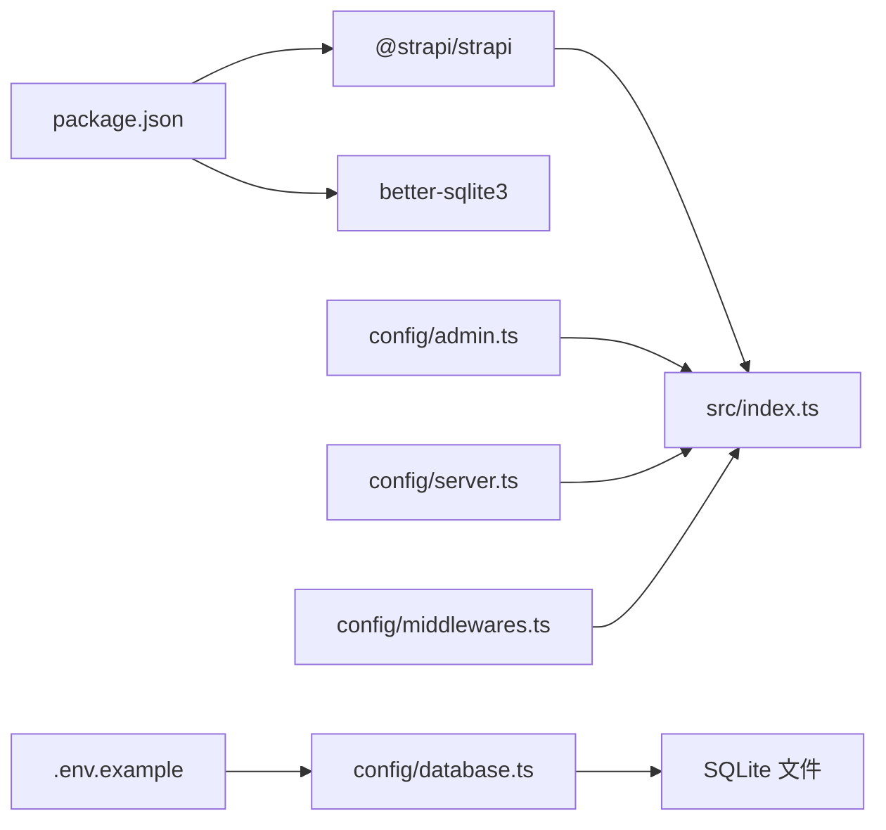

# 数据库管理

<cite>
**本文引用的文件**
- [backend/config/database.ts](file://backend/config/database.ts)
- [backend/.env.example](file://backend/.env.example)
- [backend/package.json](file://backend/package.json)
- [backend/src/index.ts](file://backend/src/index.ts)
- [backend/config/admin.ts](file://backend/config/admin.ts)
- [backend/config/server.ts](file://backend/config/server.ts)
- [backend/config/api.ts](file://backend/config/api.ts)
- [backend/config/plugins.ts](file://backend/config/plugins.ts)
- [backend/config/middlewares.ts](file://backend/config/middlewares.ts)
- [backend/scripts/import-news.mjs](file://backend/scripts/import-news.mjs)
- [backend/scripts/import-products.mjs](file://backend/scripts/import-products.mjs)
- [DEPLOYMENT.md](file://DEPLOYMENT.md)
- [开发与生产环境分离方案.md](file://开发与生产环境分离方案.md)
</cite>

## 目录
1. [简介](#简介)
2. [项目结构](#项目结构)
3. [核心组件](#核心组件)
4. [架构总览](#架构总览)
5. [详细组件分析](#详细组件分析)
6. [依赖关系分析](#依赖关系分析)
7. [性能考虑](#性能考虑)
8. [故障排查指南](#故障排查指南)
9. [结论](#结论)
10. [附录](#附录)

## 简介
本文件面向中创智控官网的数据库管理与运维，聚焦于基于 Strapi 的后端系统在 SQLite 场景下的配置与管理策略。内容涵盖：
- SQLite 数据库配置项与连接参数
- 性能调优与存储设置建议
- 数据库迁移流程（版本控制、结构变更、数据迁移）
- 备份与恢复机制（自动与手动、灾难恢复）
- 监控与维护任务（性能监控、索引优化、空间管理）
- 安全配置、访问控制与审计日志
- 故障诊断、性能调优与容量规划最佳实践

## 项目结构
后端采用 Strapi 框架，数据库配置位于配置目录，运行时通过环境变量驱动；前端内容通过脚本导入至后端 API。

**图表来源**
- [backend/config/database.ts](file://backend/config/database.ts#L1-L61)
- [backend/.env.example](file://backend/.env.example#L1-L15)
- [backend/package.json](file://backend/package.json#L1-L45)
- [backend/src/index.ts](file://backend/src/index.ts#L1-L65)
- [backend/config/admin.ts](file://backend/config/admin.ts#L1-L21)
- [backend/config/server.ts](file://backend/config/server.ts#L1-L8)
- [backend/config/api.ts](file://backend/config/api.ts#L1-L8)
- [backend/config/middlewares.ts](file://backend/config/middlewares.ts#L1-L13)
- [backend/config/plugins.ts](file://backend/config/plugins.ts#L1-L11)
- [backend/scripts/import-news.mjs](file://backend/scripts/import-news.mjs#L1-L157)
- [backend/scripts/import-products.mjs](file://backend/scripts/import-products.mjs#L1-L163)

**章节来源**
- [backend/config/database.ts](file://backend/config/database.ts#L1-L61)
- [backend/.env.example](file://backend/.env.example#L1-L15)
- [backend/package.json](file://backend/package.json#L1-L45)

## 核心组件
- 数据库配置中心：集中定义客户端类型、连接参数、连接池与超时等。
- 环境变量模板：提供默认值与占位符，便于本地与生产差异化配置。
- 运行时初始化：在启动阶段完成权限与公开访问策略的初始化。
- 插件与中间件：提供安全、CORS、查询、静态资源等基础能力。
- 数据导入脚本：用于将前端内容与媒体导入后端 API，支撑数据迁移与种子数据注入。

**章节来源**
- [backend/config/database.ts](file://backend/config/database.ts#L1-L61)
- [backend/.env.example](file://backend/.env.example#L1-L15)
- [backend/src/index.ts](file://backend/src/index.ts#L1-L65)
- [backend/config/plugins.ts](file://backend/config/plugins.ts#L1-L11)
- [backend/config/middlewares.ts](file://backend/config/middlewares.ts#L1-L13)
- [backend/scripts/import-news.mjs](file://backend/scripts/import-news.mjs#L1-L157)
- [backend/scripts/import-products.mjs](file://backend/scripts/import-products.mjs#L1-L163)

## 架构总览
下图展示 SQLite 在本项目中的运行路径：配置加载 → 连接建立 → 数据读写 → 管理与安全中间件参与 → API 层对外提供服务。

**图表来源**
- [backend/config/database.ts](file://backend/config/database.ts#L1-L61)
- [backend/.env.example](file://backend/.env.example#L1-L15)
- [backend/config/admin.ts](file://backend/config/admin.ts#L1-L21)
- [backend/config/server.ts](file://backend/config/server.ts#L1-L8)
- [backend/config/middlewares.ts](file://backend/config/middlewares.ts#L1-L13)

## 详细组件分析

### SQLite 数据库配置与连接参数
- 客户端选择：通过环境变量指定数据库客户端为 sqlite。
- 文件路径：SQLite 数据库文件路径由环境变量决定，默认位于仓库根目录下的临时位置。
- 连接超时：可通过环境变量设置连接超时时间。
- 其他客户端（mysql/postgres）配置项在此项目未启用，但保留了完整的连接参数结构以便扩展。

**图表来源**
- [backend/config/database.ts](file://backend/config/database.ts#L3-L59)
- [backend/.env.example](file://backend/.env.example#L3-L4)

**章节来源**
- [backend/config/database.ts](file://backend/config/database.ts#L1-L61)
- [backend/.env.example](file://backend/.env.example#L1-L15)

### 性能调优与存储设置
- 连接池与超时：当前配置未显式设置连接池参数，连接超时默认值已提供，可根据并发与延迟需求调整。
- 存储位置：SQLite 文件位于仓库内临时目录，生产环境建议迁移到持久化卷或独立磁盘以提升可靠性与性能。
- I/O 优化：避免频繁小事务，合并批量写入；合理使用索引减少查询扫描。
- 并发限制：SQLite 在高并发写入场景下存在锁竞争，建议结合读写分离或缓存策略降低压力。

**章节来源**
- [backend/config/database.ts](file://backend/config/database.ts#L53-L59)

### 数据库迁移管理流程
- 版本控制：通过 Git 管理配置与脚本，确保迁移步骤可追溯。
- 结构变更：若需切换到其他数据库（如 MySQL/PostgreSQL），可复用现有配置结构进行迁移。
- 数据迁移：
  - 使用导入脚本将前端内容与媒体导入后端 API。
  - 支持 Upsert 逻辑（按 slug 判定存在性），保证幂等性。
  - 提供批量处理与错误重试机制，保障大规模数据迁移的稳定性。

**图表来源**
- [backend/scripts/import-news.mjs](file://backend/scripts/import-news.mjs#L68-L122)
- [backend/scripts/import-products.mjs](file://backend/scripts/import-products.mjs#L68-L124)

**章节来源**
- [backend/scripts/import-news.mjs](file://backend/scripts/import-news.mjs#L1-L157)
- [backend/scripts/import-products.mjs](file://backend/scripts/import-products.mjs#L1-L163)
- [DEPLOYMENT.md](file://DEPLOYMENT.md#L761-L827)
- [开发与生产环境分离方案.md](file://开发与生产环境分离方案.md#L1242-L1282)

### 备份与恢复机制
- 自动备份策略：建议在 CI/CD 中集成定时任务，对 SQLite 文件进行归档备份，并校验完整性。
- 手动备份操作：在执行重大迁移前，先备份 SQLite 文件与上传目录。
- 灾难恢复流程：优先恢复数据库文件，再恢复媒体资源；验证 API 可用性与关键接口返回。

**图表来源**
- [DEPLOYMENT.md](file://DEPLOYMENT.md#L765-L812)

**章节来源**
- [DEPLOYMENT.md](file://DEPLOYMENT.md#L761-L827)

### 监控与维护任务
- 性能监控：关注数据库连接数、查询耗时与慢查询日志；结合中间件日志定位瓶颈。
- 索引优化：针对高频过滤字段（如 slug、category）建立索引；定期评估无效索引。
- 空间管理：清理无用媒体与历史快照；监控 SQLite 文件大小与碎片化情况。

**章节来源**
- [backend/config/middlewares.ts](file://backend/config/middlewares.ts#L1-L13)
- [backend/config/api.ts](file://backend/config/api.ts#L1-L8)

### 安全配置、访问控制与审计日志
- 应用密钥与令牌：通过环境变量配置 APP_KEYS、API_TOKEN_SALT、ADMIN_JWT_SECRET、ENCRYPTION_KEY 等，确保密钥轮换与最小权限原则。
- 管理员与 API Token：在管理后台生成 Full Access Token，仅在受信网络使用。
- 审计日志：启用 strapi::logger 与 strapi::errors 中间件，记录异常与错误堆栈，便于事后审计。

**图表来源**
- [backend/config/admin.ts](file://backend/config/admin.ts#L1-L21)
- [backend/config/server.ts](file://backend/config/server.ts#L1-L8)
- [backend/config/middlewares.ts](file://backend/config/middlewares.ts#L1-L13)

**章节来源**
- [backend/config/admin.ts](file://backend/config/admin.ts#L1-L21)
- [backend/config/server.ts](file://backend/config/server.ts#L1-L8)
- [backend/config/middlewares.ts](file://backend/config/middlewares.ts#L1-L13)
- [backend/.env.example](file://backend/.env.example#L9-L15)

## 依赖关系分析
- Strapi 版本与依赖：后端使用固定版本的 Strapi 与 better-sqlite3 驱动，确保兼容性与稳定性。
- 启动流程：package.json 中的脚本定义了开发、构建与启动命令；index.ts 在启动阶段完成权限初始化。
- 配置耦合：database.ts 与 .env.example 彼此依赖；admin.ts/server.ts 与密钥相关配置耦合度较高。

**图表来源**
- [backend/package.json](file://backend/package.json#L20-L29)
- [backend/src/index.ts](file://backend/src/index.ts#L1-L65)
- [backend/config/database.ts](file://backend/config/database.ts#L1-L61)
- [backend/.env.example](file://backend/.env.example#L1-L15)
- [backend/config/admin.ts](file://backend/config/admin.ts#L1-L21)
- [backend/config/server.ts](file://backend/config/server.ts#L1-L8)
- [backend/config/middlewares.ts](file://backend/config/middlewares.ts#L1-L13)

**章节来源**
- [backend/package.json](file://backend/package.json#L1-L45)
- [backend/src/index.ts](file://backend/src/index.ts#L1-L65)

## 性能考虑
- 连接与超时：根据实际并发与网络状况调整连接超时，避免长时间阻塞。
- 写入优化：批量提交、减少不必要的事务；对热点数据增加只读副本或缓存层。
- 存储与 I/O：将 SQLite 文件置于高性能磁盘；定期检查文件系统碎片与 inode 使用率。
- 索引策略：针对高频查询字段建立合适索引，避免全表扫描；定期分析查询计划。

[本节为通用指导，无需列出具体文件来源]

## 故障排查指南
- 连接失败：检查 DATABASE_CLIENT 与 DATABASE_FILENAME 是否正确；确认文件路径存在且可写。
- 权限问题：核对 APP_KEYS、API_TOKEN_SALT、ADMIN_JWT_SECRET 等是否一致且未泄露。
- 导入失败：查看导入脚本输出与错误日志，确认目标 API 地址与 Token 有效；必要时重试或降速重跑。
- 慢查询：启用日志与中间件统计，定位慢接口与数据库查询；优化索引与 SQL。

**章节来源**
- [backend/config/database.ts](file://backend/config/database.ts#L1-L61)
- [backend/.env.example](file://backend/.env.example#L1-L15)
- [backend/scripts/import-news.mjs](file://backend/scripts/import-news.mjs#L124-L157)
- [backend/scripts/import-products.mjs](file://backend/scripts/import-products.mjs#L126-L163)

## 结论
本项目以 SQLite 作为默认数据库，配合 Strapi 的配置体系与导入脚本，实现了从开发到生产的平滑迁移与数据注入。建议在生产环境中：
- 将 SQLite 文件迁移到持久化存储；
- 明确密钥管理与最小权限原则；
- 建立自动化备份与恢复流程；
- 持续监控性能并优化索引与查询；
- 将迁移脚本纳入 CI/CD 流水线，确保可重复与可审计。

[本节为总结性内容，无需列出具体文件来源]

## 附录
- 迁移脚本功能概览
  - 支持产品与新闻两类内容导入
  - 自动上传媒体并回填 ID
  - Upsert 逻辑保证幂等
  - 分页与错误重试增强稳定性

**章节来源**
- [开发与生产环境分离方案.md](file://开发与生产环境分离方案.md#L1271-L1282)