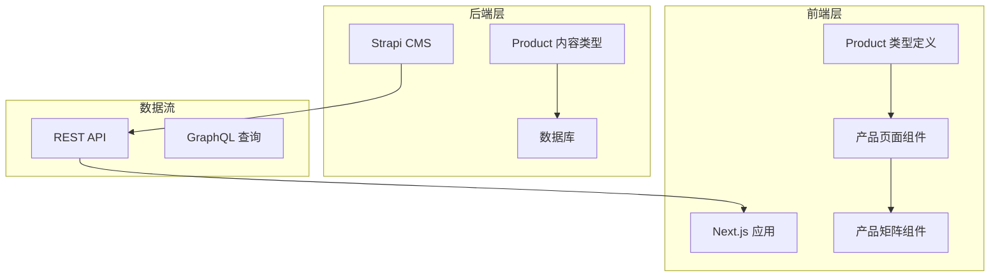
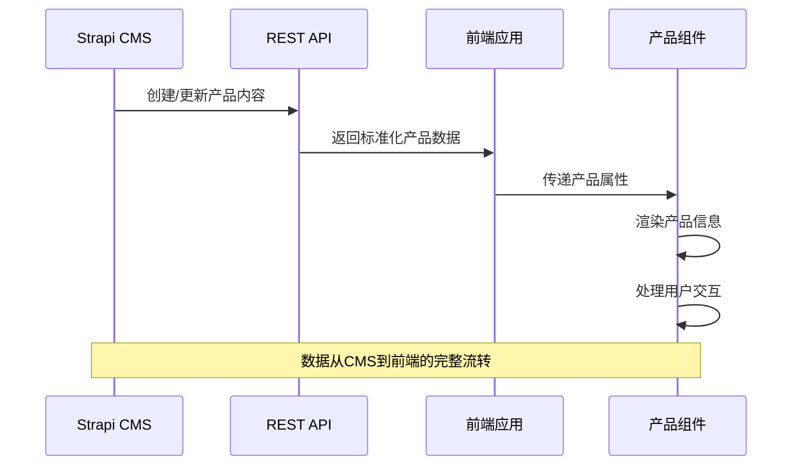
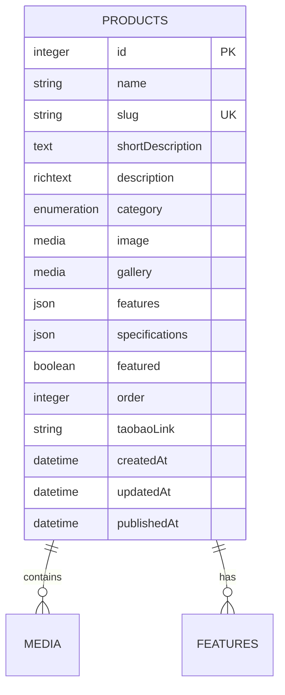
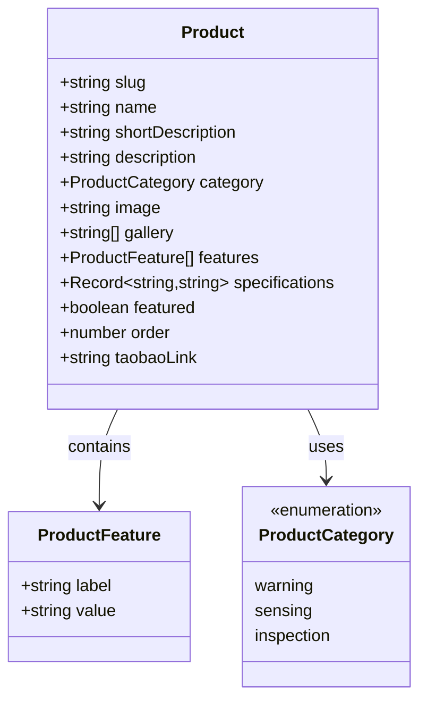
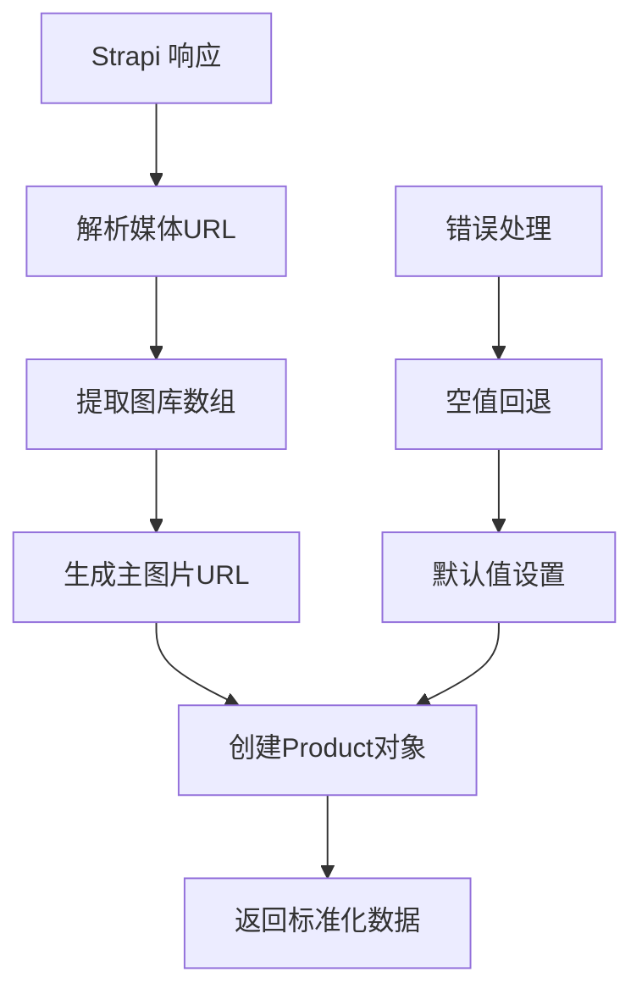
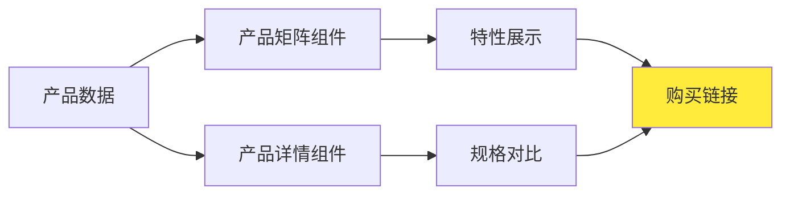
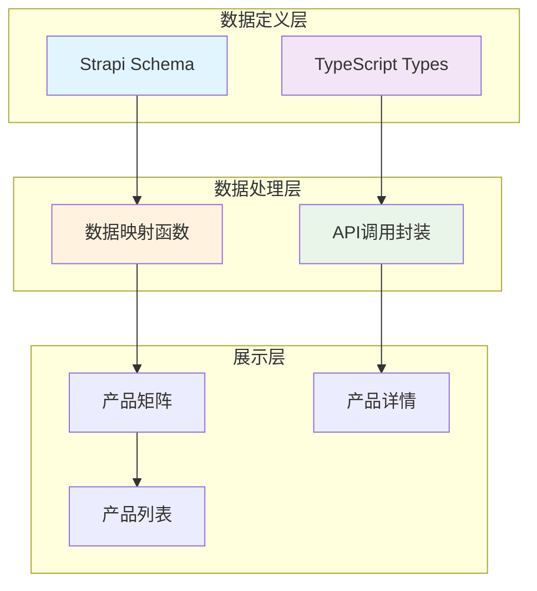
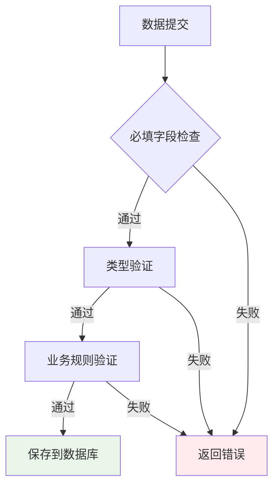

# 产品数据模型

<cite>
**本文档引用的文件**
- [backend/src/api/product/content-types/product/schema.json](file://backend/src/api/product/content-types/product/schema.json)
- [frontend/types/product.ts](file://frontend/types/product.ts)
- [backend/types/generated/contentTypes.d.ts](file://backend/types/generated/contentTypes.d.ts)
- [frontend/content/products.ts](file://frontend/content/products.ts)
- [frontend/lib/strapi.ts](file://frontend/lib/strapi.ts)
- [frontend/components/sections/ProductMatrix.tsx](file://frontend/components/sections/ProductMatrix.tsx)
- [frontend/components/sections/ProductDetail.tsx](file://frontend/components/sections/ProductDetail.tsx)
- [specs/001-strapi-backend-cms/data-model.md](file://specs/001-strapi-backend-cms/data-model.md)
</cite>

## 目录
1. [简介](#简介)
2. [项目结构](#项目结构)
3. [核心组件](#核心组件)
4. [架构概览](#架构概览)
5. [详细组件分析](#详细组件分析)
6. [依赖关系分析](#依赖关系分析)
7. [性能考虑](#性能考虑)
8. [故障排除指南](#故障排除指南)
9. [结论](#结论)

## 简介

本文件详细阐述了项目中的产品数据模型设计，涵盖从Strapi后端内容类型定义到前端类型系统的完整实现。该数据模型服务于智能预警硬件、监测感知设备和无人巡检系统三大产品类别，为产品展示、分类筛选、特性对比和销售转化提供了完整的数据支撑。

## 项目结构

项目采用前后端分离架构，产品数据模型在后端通过Strapi内容类型定义，在前端通过TypeScript类型系统进行约束：



**图表来源**
- [backend/src/api/product/content-types/product/schema.json](file://backend/src/api/product/content-types/product/schema.json#L1-L63)
- [frontend/types/product.ts](file://frontend/types/product.ts#L1-L39)

**章节来源**
- [backend/src/api/product/content-types/product/schema.json](file://backend/src/api/product/content-types/product/schema.json#L1-L63)
- [frontend/types/product.ts](file://frontend/types/product.ts#L1-L39)

## 核心组件

### 产品接口定义

产品接口包含以下关键字段：

| 字段名 | 类型 | 必填 | 约束 | 描述 |
|--------|------|------|------|------|
| slug | string | 是 | 唯一、UID | 产品唯一标识符，用于URL路径 |
| name | string | 是 | 最大长度限制 | 产品名称 |
| shortDescription | string | 否 | 文本类型 | 产品简短描述 |
| description | string | 否 | 富文本类型 | 产品详细描述 |
| category | ProductCategory | 否 | 枚举类型 | 产品分类 |
| image | string | 否 | 图片URL | 主图片URL |
| gallery | string[] | 否 | 数组类型 | 产品图库数组 |
| features | ProductFeature[] | 是 | JSON类型 | 产品特性列表 |
| specifications | Record<string,string> | 否 | JSON类型 | 技术规格 |
| featured | boolean | 否 | 默认false | 是否首页展示 |
| order | number | 否 | 整数类型 | 排序权重 |
| taobaoLink | string | 否 | 字符串类型 | 淘宝链接 |

**章节来源**
- [frontend/types/product.ts](file://frontend/types/product.ts#L13-L38)
- [backend/src/api/product/content-types/product/schema.json](file://backend/src/api/product/content-types/product/schema.json#L13-L61)

### 产品分类枚举

产品分类采用严格的枚举类型定义：

```mermaid
classDiagram
class ProductCategory {
<<enumeration>>
"warning" : 智能预警硬件
"sensing" : 监测感知设备
"inspection" : 无人巡检系统
}
class Product {
+string slug
+string name
+string shortDescription
+string description
+ProductCategory category
+string image
+string[] gallery
+ProductFeature[] features
+Record~string,string~ specifications
+boolean featured
+number order
+string taobaoLink
}
Product --> ProductCategory : 使用
```

**图表来源**
- [frontend/types/product.ts](file://frontend/types/product.ts#L8-L11)
- [backend/types/generated/contentTypes.d.ts](file://backend/types/generated/contentTypes.d.ts#L489-L491)

**章节来源**
- [frontend/types/product.ts](file://frontend/types/product.ts#L8-L11)
- [backend/types/generated/contentTypes.d.ts](file://backend/types/generated/contentTypes.d.ts#L489-L491)

### 产品特性接口

产品特性采用键值对结构：

| 特性字段 | 类型 | 必填 | 描述 |
|----------|------|------|------|
| label | string | 是 | 特性标签 |
| value | string | 是 | 特性值 |

**章节来源**
- [frontend/types/product.ts](file://frontend/types/product.ts#L3-L6)

## 架构概览

产品数据模型的完整架构流程：



**图表来源**
- [frontend/lib/strapi.ts](file://frontend/lib/strapi.ts#L55-L76)
- [frontend/components/sections/ProductMatrix.tsx](file://frontend/components/sections/ProductMatrix.tsx#L20-L98)

**章节来源**
- [frontend/lib/strapi.ts](file://frontend/lib/strapi.ts#L55-L76)
- [frontend/components/sections/ProductMatrix.tsx](file://frontend/components/sections/ProductMatrix.tsx#L20-L98)

## 详细组件分析

### 后端内容类型定义

后端通过Strapi内容类型系统定义产品结构：



**图表来源**
- [backend/src/api/product/content-types/product/schema.json](file://backend/src/api/product/content-types/product/schema.json#L13-L61)

**章节来源**
- [backend/src/api/product/content-types/product/schema.json](file://backend/src/api/product/content-types/product/schema.json#L13-L61)

### 前端类型系统

前端通过TypeScript确保类型安全：



**图表来源**
- [frontend/types/product.ts](file://frontend/types/product.ts#L3-L38)

**章节来源**
- [frontend/types/product.ts](file://frontend/types/product.ts#L3-L38)

### 数据映射与转换

前端通过专门的映射函数处理Strapi返回的数据：



**图表来源**
- [frontend/lib/strapi.ts](file://frontend/lib/strapi.ts#L55-L76)

**章节来源**
- [frontend/lib/strapi.ts](file://frontend/lib/strapi.ts#L55-L76)

### 组件使用模式

产品组件展示了数据的实际应用场景：



**图表来源**
- [frontend/components/sections/ProductMatrix.tsx](file://frontend/components/sections/ProductMatrix.tsx#L12-L18)
- [frontend/components/sections/ProductDetail.tsx](file://frontend/components/sections/ProductDetail.tsx#L16-L30)

**章节来源**
- [frontend/components/sections/ProductMatrix.tsx](file://frontend/components/sections/ProductMatrix.tsx#L12-L18)
- [frontend/components/sections/ProductDetail.tsx](file://frontend/components/sections/ProductDetail.tsx#L16-L30)

## 依赖关系分析

产品数据模型的依赖关系呈现清晰的分层结构：



**图表来源**
- [backend/src/api/product/content-types/product/schema.json](file://backend/src/api/product/content-types/product/schema.json#L1-L63)
- [frontend/types/product.ts](file://frontend/types/product.ts#L1-L39)
- [frontend/lib/strapi.ts](file://frontend/lib/strapi.ts#L113-L125)

**章节来源**
- [backend/src/api/product/content-types/product/schema.json](file://backend/src/api/product/content-types/product/schema.json#L1-L63)
- [frontend/types/product.ts](file://frontend/types/product.ts#L1-L39)
- [frontend/lib/strapi.ts](file://frontend/lib/strapi.ts#L113-L125)

## 性能考虑

### 查询优化策略

1. **索引设计建议**
   - 在 `slug` 字段建立唯一索引（已由UID类型保证）
   - 在 `category` 字段建立普通索引
   - 在 `featured` 字段建立布尔索引
   - 在 `order` 字段建立数值索引

2. **查询优化**
   - 使用 `populate` 参数按需加载关联媒体资源
   - 实施分页查询避免一次性加载大量数据
   - 利用缓存机制减少重复查询

3. **前端优化**
   - 实施虚拟滚动处理大量产品列表
   - 使用 React.memo 优化组件渲染
   - 实现懒加载处理图片资源

### 数据验证规则



**章节来源**
- [specs/001-strapi-backend-cms/data-model.md](file://specs/001-strapi-backend-cms/data-model.md#L17-L18)

## 故障排除指南

### 常见问题及解决方案

1. **产品图片显示异常**
   - 检查媒体URL是否正确解析
   - 验证图片格式是否符合要求
   - 确认CDN配置是否正确

2. **产品分类显示错误**
   - 验证枚举值是否在允许范围内
   - 检查前端类型定义是否一致
   - 确认数据库存储格式

3. **排序功能异常**
   - 检查order字段数据类型
   - 验证排序逻辑实现
   - 确认数据库索引状态

**章节来源**
- [frontend/lib/strapi.ts](file://frontend/lib/strapi.ts#L35-L53)
- [frontend/content/products.ts](file://frontend/content/products.ts#L164-L178)

## 结论

产品数据模型通过严谨的类型定义、完善的验证规则和高效的查询优化，为智能预警硬件、监测感知设备和无人巡检系统三大产品类别提供了可靠的数据支撑。该模型不仅满足了当前的功能需求，还具备良好的扩展性和维护性，能够适应未来业务发展的需要。

通过前后端协作的开发模式，确保了数据的一致性和完整性，为用户提供优质的浏览和购买体验。建议在后续开发中持续关注性能优化和用户体验改进，进一步提升系统的整体表现。