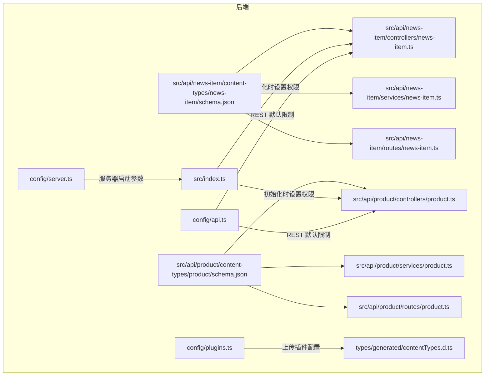
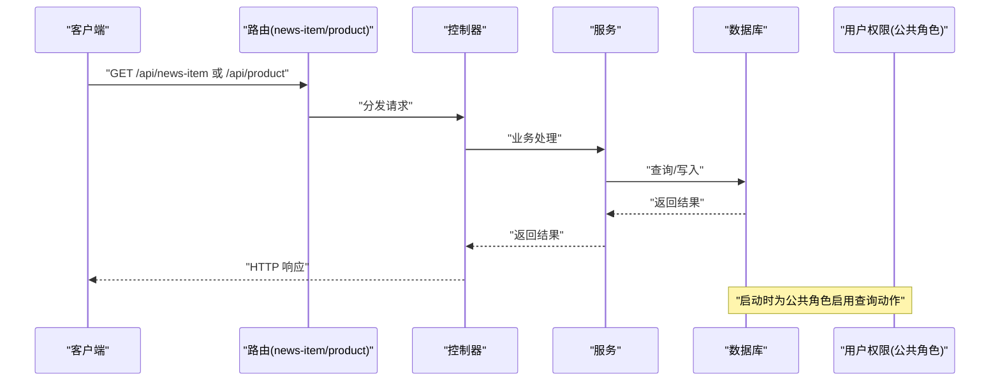
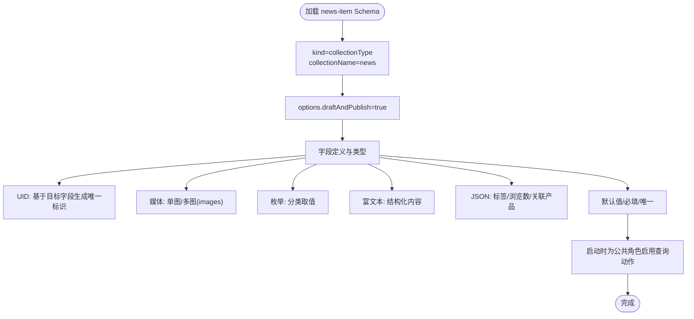
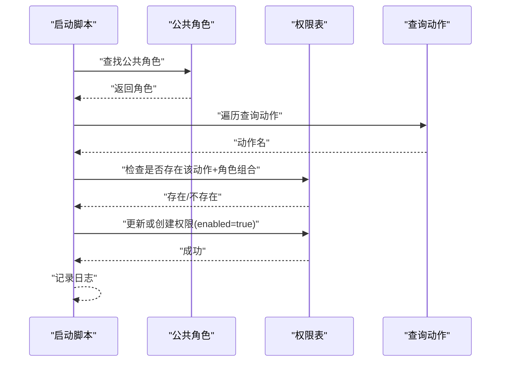
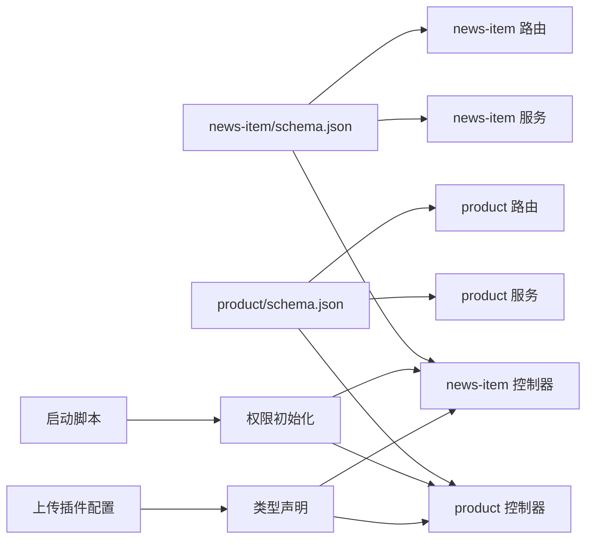

# 内容类型Schema

<cite>
**本文引用的文件**
- [backend/src/api/news-item/content-types/news-item/schema.json](file://backend/src/api/news-item/content-types/news-item/schema.json)
- [backend/src/api/product/content-types/product/schema.json](file://backend/src/api/product/content-types/product/schema.json)
- [backend/src/index.ts](file://backend/src/index.ts)
- [backend/config/api.ts](file://backend/config/api.ts)
- [backend/config/plugins.ts](file://backend/config/plugins.ts)
- [backend/config/server.ts](file://backend/config/server.ts)
- [backend/package.json](file://backend/package.json)
- [backend/types/generated/contentTypes.d.ts](file://backend/types/generated/contentTypes.d.ts)
- [backend/src/api/news-item/controllers/news-item.ts](file://backend/src/api/news-item/controllers/news-item.ts)
- [backend/src/api/news-item/services/news-item.ts](file://backend/src/api/news-item/services/news-item.ts)
- [backend/src/api/news-item/routes/news-item.ts](file://backend/src/api/news-item/routes/news-item.ts)
- [backend/src/api/product/controllers/product.ts](file://backend/src/api/product/controllers/product.ts)
- [backend/src/api/product/services/product.ts](file://backend/src/api/product/services/product.ts)
- [backend/src/api/product/routes/product.ts](file://backend/src/api/product/routes/product.ts)
</cite>

## 目录
1. [引言](#引言)
2. [项目结构](#项目结构)
3. [核心组件](#核心组件)
4. [架构总览](#架构总览)
5. [详细组件分析](#详细组件分析)
6. [依赖分析](#依赖分析)
7. [性能考虑](#性能考虑)
8. [故障排查指南](#故障排查指南)
9. [结论](#结论)
10. [附录](#附录)

## 引言
本文件围绕 Strapi 内容管理系统的“内容类型 Schema”进行系统化说明，重点解析 schema.json 的结构与配置项（模型配置、字段定义、验证规则、关系映射、权限设置），并结合项目中的新闻与产品两类内容类型，阐述动态内容类型与静态内容类型的差异及应用场景；同时梳理字段类型体系（文本、数字、日期、媒体、关系等）与内容类型间的一对一、一对多、多对多关系实现方式，给出权限控制机制与访问级别设置方法，并提供 Schema 版本管理与迁移策略建议与实践范式。

## 项目结构
后端采用 Strapi 标准目录组织：每个内容类型在 content-types 下维护独立的 schema.json，配套控制器、服务与路由文件，形成清晰的分层职责。全局配置位于 config 目录，类型声明由 Strapi 自动生成到 types/generated 目录中，便于前端与 TS 环境下获得强类型支持。

图表来源
- [backend/src/api/news-item/content-types/news-item/schema.json](file://backend/src/api/news-item/content-types/news-item/schema.json#L1-L65)
- [backend/src/api/product/content-types/product/schema.json](file://backend/src/api/product/content-types/product/schema.json#L1-L63)
- [backend/src/api/news-item/controllers/news-item.ts](file://backend/src/api/news-item/controllers/news-item.ts#L1-L4)
- [backend/src/api/news-item/services/news-item.ts](file://backend/src/api/news-item/services/news-item.ts#L1-L4)
- [backend/src/api/news-item/routes/news-item.ts](file://backend/src/api/news-item/routes/news-item.ts#L1-L4)
- [backend/src/api/product/controllers/product.ts](file://backend/src/api/product/controllers/product.ts#L1-L4)
- [backend/src/api/product/services/product.ts](file://backend/src/api/product/services/product.ts#L1-L4)
- [backend/src/api/product/routes/product.ts](file://backend/src/api/product/routes/product.ts#L1-L4)
- [backend/src/index.ts](file://backend/src/index.ts#L19-L63)
- [backend/config/api.ts](file://backend/config/api.ts#L1-L8)
- [backend/config/plugins.ts](file://backend/config/plugins.ts#L1-L11)
- [backend/config/server.ts](file://backend/config/server.ts#L1-L8)
- [backend/types/generated/contentTypes.d.ts](file://backend/types/generated/contentTypes.d.ts#L433-L475)

章节来源
- [backend/src/api/news-item/content-types/news-item/schema.json](file://backend/src/api/news-item/content-types/news-item/schema.json#L1-L65)
- [backend/src/api/product/content-types/product/schema.json](file://backend/src/api/product/content-types/product/schema.json#L1-L63)
- [backend/src/index.ts](file://backend/src/index.ts#L19-L63)
- [backend/config/api.ts](file://backend/config/api.ts#L1-L8)
- [backend/config/plugins.ts](file://backend/config/plugins.ts#L1-L11)
- [backend/config/server.ts](file://backend/config/server.ts#L1-L8)
- [backend/types/generated/contentTypes.d.ts](file://backend/types/generated/contentTypes.d.ts#L433-L475)

## 核心组件
- 新闻内容类型（news-item）
  - kind: collectionType
  - collectionName: news
  - draftAndPublish: true
  - 关键字段：标题、UID、摘要、富文本、枚举分类、单图/多图附件、作者、布尔推荐、JSON 标签/浏览数/关联产品等
- 产品内容类型（product）
  - kind: collectionType
  - collectionName: products
  - draftAndPublish: true
  - 关键字段：名称、UID、短描述、富文本、枚举分类、单图/图集、JSON 功能特性/规格、布尔推荐、排序、链接等
- 权限初始化
  - 启动时为公共角色启用产品与新闻的查询类动作，确保前端可读取
- 类型声明
  - 自动生成的 contentTypes.d.ts 提供强类型接口，包含字段类型、默认值、关系映射等

章节来源
- [backend/src/api/news-item/content-types/news-item/schema.json](file://backend/src/api/news-item/content-types/news-item/schema.json#L1-L65)
- [backend/src/api/product/content-types/product/schema.json](file://backend/src/api/product/content-types/product/schema.json#L1-L63)
- [backend/src/index.ts](file://backend/src/index.ts#L29-L62)
- [backend/types/generated/contentTypes.d.ts](file://backend/types/generated/contentTypes.d.ts#L433-L475)

## 架构总览
下图展示从请求到数据模型的调用链路，以及权限初始化流程：

图表来源
- [backend/src/api/news-item/routes/news-item.ts](file://backend/src/api/news-item/routes/news-item.ts#L1-L4)
- [backend/src/api/product/routes/product.ts](file://backend/src/api/product/routes/product.ts#L1-L4)
- [backend/src/api/news-item/controllers/news-item.ts](file://backend/src/api/news-item/controllers/news-item.ts#L1-L4)
- [backend/src/api/product/controllers/product.ts](file://backend/src/api/product/controllers/product.ts#L1-L4)
- [backend/src/api/news-item/services/news-item.ts](file://backend/src/api/news-item/services/news-item.ts#L1-L4)
- [backend/src/api/product/services/product.ts](file://backend/src/api/product/services/product.ts#L1-L4)
- [backend/src/index.ts](file://backend/src/index.ts#L19-L63)

## 详细组件分析

### 新闻内容类型（news-item）Schema 解析
- 模型配置
  - kind: collectionType
  - collectionName: news
  - info: 单复数名、显示名、描述
  - options: draftAndPublish: true
- 字段定义与特性
  - 标题：字符串，必填
  - UID：基于目标字段生成唯一标识，必填且唯一
  - 摘要：文本
  - 富文本：支持结构化内容
  - 枚举：分类取值集合
  - 媒体：单图与多图，限定类型为 images
  - 作者：字符串
  - 推荐：布尔，默认 false
  - JSON：标签、浏览计数、关联产品等
- 验证规则
  - 必填、唯一、默认值等通过字段属性声明
- 关系映射
  - 未显式声明 relation 字段，但可通过 JSON 存储关联 ID 或结构化数据
- 权限设置
  - 通过启动脚本为公共角色启用查询动作，允许前端读取

图表来源
- [backend/src/api/news-item/content-types/news-item/schema.json](file://backend/src/api/news-item/content-types/news-item/schema.json#L1-L65)
- [backend/src/index.ts](file://backend/src/index.ts#L29-L62)

章节来源
- [backend/src/api/news-item/content-types/news-item/schema.json](file://backend/src/api/news-item/content-types/news-item/schema.json#L1-L65)
- [backend/src/index.ts](file://backend/src/index.ts#L29-L62)

### 产品内容类型（product）Schema 解析
- 模型配置
  - kind: collectionType
  - collectionName: products
  - info: 单复数名、显示名、描述
  - options: draftAndPublish: true
- 字段定义与特性
  - 名称：字符串，必填
  - UID：基于目标字段生成唯一标识，必填且唯一
  - 短描述/富文本：文本与结构化内容
  - 枚举：分类取值集合
  - 媒体：单图与图集，限定类型为 images
  - JSON：功能特性/规格
  - 推荐：布尔，默认 false
  - 排序：整数
  - 外链：字符串
- 验证规则
  - 必填、默认值等通过字段属性声明
- 关系映射
  - 未显式声明 relation 字段，但可通过 JSON 存储关联 ID 或结构化数据
- 权限设置
  - 通过启动脚本为公共角色启用查询动作，允许前端读取

章节来源
- [backend/src/api/product/content-types/product/schema.json](file://backend/src/api/product/content-types/product/schema.json#L1-L63)
- [backend/src/index.ts](file://backend/src/index.ts#L29-L62)

### 字段类型系统与配置选项
- 字符串（String）
  - 用途：标题、作者、外链等
  - 常见属性：required、unique、default
- 文本（Text）
  - 用途：摘要、短描述
  - 常见属性：required
- 富文本（RichText）
  - 用途：正文内容
  - 常见属性：无特殊约束
- 枚举（Enumeration）
  - 用途：分类
  - 常见属性：enum 取值列表
- 媒体（Media）
  - 用途：图片/视频等资源
  - 常见属性：multiple、allowedTypes、required
- JSON
  - 用途：灵活结构存储（标签、浏览计数、关联产品）
  - 常见属性：无特殊约束
- 整数（Integer）
  - 用途：排序、浏览计数
  - 常见属性：default
- UID
  - 用途：自动生成 URL 友好标识
  - 常见属性：targetField、required、unique

章节来源
- [backend/src/api/news-item/content-types/news-item/schema.json](file://backend/src/api/news-item/content-types/news-item/schema.json#L13-L62)
- [backend/src/api/product/content-types/product/schema.json](file://backend/src/api/product/content-types/product/schema.json#L13-L61)

### 内容类型之间的关联关系
- 当前实现
  - 未使用显式 relation 字段，而是通过 JSON 字段存储关联信息（如新闻中的关联产品）
- 关系类型说明
  - 一对一：一个实体的一个字段指向另一个实体的唯一记录
  - 一对多：一个实体的一个字段指向另一个实体的多个记录
  - 多对多：两个实体互相持有对方的多个引用
- 建议
  - 对于强关系与强约束场景，优先使用 relation 字段以获得更严格的校验与查询能力
  - 对于弱耦合或动态关联，JSON 字段具备灵活性，但需在应用层保证一致性

章节来源
- [backend/src/api/news-item/content-types/news-item/schema.json](file://backend/src/api/news-item/content-types/news-item/schema.json#L60-L62)
- [backend/src/api/product/content-types/product/schema.json](file://backend/src/api/product/content-types/product/schema.json#L46-L51)

### 权限控制机制与访问级别设置
- 公共角色与查询动作
  - 启动时为公共角色启用产品与新闻的查询动作，使未登录用户可读取
- 用户权限插件
  - 使用 users-permissions 插件进行角色与权限管理
- 最佳实践
  - 明确区分公开与私有内容，仅对必要动作放行
  - 为不同角色配置最小权限原则，避免过度授权

图表来源
- [backend/src/index.ts](file://backend/src/index.ts#L19-L63)

章节来源
- [backend/src/index.ts](file://backend/src/index.ts#L19-L63)
- [backend/package.json](file://backend/package.json#L22-L22)

### Schema 版本管理与迁移策略
- 版本化建议
  - 在 schema.json 中增加版本字段（如 version），用于标识 Schema 版本
  - 迁移脚本：在升级时根据版本号执行迁移逻辑，更新字段、默认值、索引等
- 迁移策略
  - 渐进式迁移：先添加新字段与默认值，再逐步替换旧数据
  - 回滚策略：保留备份与回滚脚本，确保可逆操作
  - 自动化：结合 CI/CD 在部署阶段自动执行迁移

[本节为通用指导，不直接分析具体文件]

### 实际 Schema 配置示例与最佳实践
- 示例参考路径
  - 新闻内容类型 Schema：[backend/src/api/news-item/content-types/news-item/schema.json](file://backend/src/api/news-item/content-types/news-item/schema.json#L1-L65)
  - 产品内容类型 Schema：[backend/src/api/product/content-types/product/schema.json](file://backend/src/api/product/content-types/product/schema.json#L1-L63)
- 最佳实践
  - 明确字段语义与约束，统一使用 UID 作为 URL 标识
  - 对媒体资源限制类型与大小，提升安全性与性能
  - 使用富文本与枚举提升内容表达力与一致性
  - 对强关系优先使用 relation 字段，弱关系可用 JSON 承载
  - 启动时集中初始化权限，遵循最小授权原则

章节来源
- [backend/src/api/news-item/content-types/news-item/schema.json](file://backend/src/api/news-item/content-types/news-item/schema.json#L1-L65)
- [backend/src/api/product/content-types/product/schema.json](file://backend/src/api/product/content-types/product/schema.json#L1-L63)
- [backend/src/index.ts](file://backend/src/index.ts#L29-L62)

## 依赖分析
- 组件耦合
  - 控制器/服务/路由与内容类型强绑定，职责清晰
  - 启动脚本集中处理权限初始化，降低分散配置风险
- 外部依赖
  - users-permissions 插件提供权限管理
  - upload 插件提供本地文件上传能力
  - 自动生成的 contentTypes.d.ts 提供强类型支持

图表来源
- [backend/src/api/news-item/content-types/news-item/schema.json](file://backend/src/api/news-item/content-types/news-item/schema.json#L1-L65)
- [backend/src/api/product/content-types/product/schema.json](file://backend/src/api/product/content-types/product/schema.json#L1-L63)
- [backend/src/api/news-item/controllers/news-item.ts](file://backend/src/api/news-item/controllers/news-item.ts#L1-L4)
- [backend/src/api/news-item/services/news-item.ts](file://backend/src/api/news-item/services/news-item.ts#L1-L4)
- [backend/src/api/news-item/routes/news-item.ts](file://backend/src/api/news-item/routes/news-item.ts#L1-L4)
- [backend/src/api/product/controllers/product.ts](file://backend/src/api/product/controllers/product.ts#L1-L4)
- [backend/src/api/product/services/product.ts](file://backend/src/api/product/services/product.ts#L1-L4)
- [backend/src/api/product/routes/product.ts](file://backend/src/api/product/routes/product.ts#L1-L4)
- [backend/src/index.ts](file://backend/src/index.ts#L19-L63)
- [backend/config/plugins.ts](file://backend/config/plugins.ts#L1-L11)
- [backend/types/generated/contentTypes.d.ts](file://backend/types/generated/contentTypes.d.ts#L433-L475)

章节来源
- [backend/src/api/news-item/content-types/news-item/schema.json](file://backend/src/api/news-item/content-types/news-item/schema.json#L1-L65)
- [backend/src/api/product/content-types/product/schema.json](file://backend/src/api/product/content-types/product/schema.json#L1-L63)
- [backend/src/index.ts](file://backend/src/index.ts#L19-L63)
- [backend/config/plugins.ts](file://backend/config/plugins.ts#L1-L11)
- [backend/types/generated/contentTypes.d.ts](file://backend/types/generated/contentTypes.d.ts#L433-L475)

## 性能考虑
- REST 查询限制
  - 默认每页数量与最大限制可在配置中调整，避免一次性返回过多数据
- 媒体资源
  - 限制上传大小与类型，减少带宽与存储压力
- Draft/Publish
  - 启用草稿发布可减少未发布数据对查询的影响

章节来源
- [backend/config/api.ts](file://backend/config/api.ts#L1-L8)
- [backend/config/plugins.ts](file://backend/config/plugins.ts#L1-L11)

## 故障排查指南
- 权限问题
  - 若前端无法读取内容，请确认启动脚本是否已为公共角色启用相应动作
- 字段缺失或类型不符
  - 检查 schema.json 中字段定义与默认值，确保与服务/前端一致
- 媒体上传失败
  - 检查上传插件配置与大小限制，确认路径与权限

章节来源
- [backend/src/index.ts](file://backend/src/index.ts#L19-L63)
- [backend/config/plugins.ts](file://backend/config/plugins.ts#L1-L11)

## 结论
本项目通过清晰的 Schema 定义与强类型声明，实现了新闻与产品两类内容的标准化建模；配合启动时的权限初始化与 REST 配置，满足了前端读取需求。对于强关系场景建议使用 relation 字段，弱关系可用 JSON 承载；同时应建立完善的版本管理与迁移策略，确保 Schema 的演进可控、可回溯。

## 附录
- 服务器与应用配置
  - 主机与端口、应用密钥等在服务器配置中集中管理
- 包与插件
  - Strapi 核心、上传与用户权限插件版本在包配置中声明

章节来源
- [backend/config/server.ts](file://backend/config/server.ts#L1-L8)
- [backend/package.json](file://backend/package.json#L20-L44)